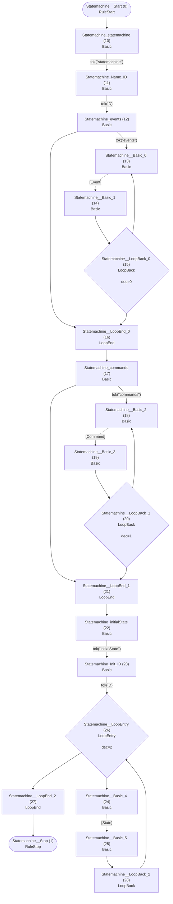
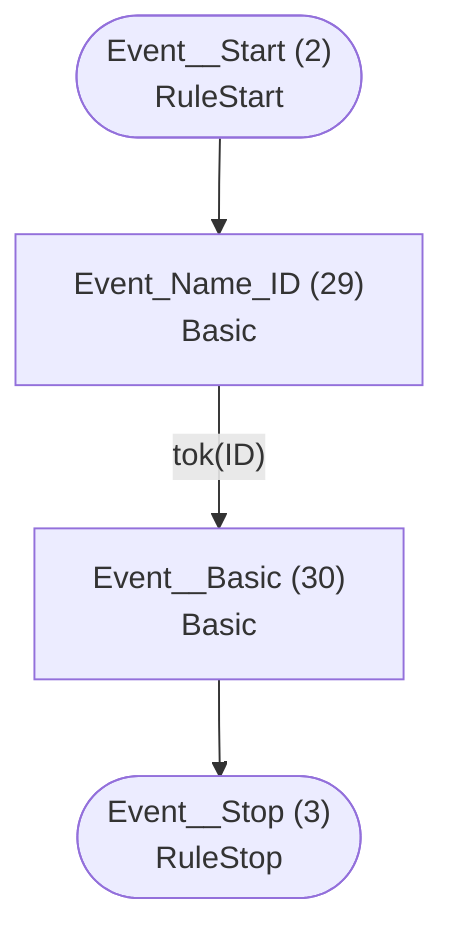
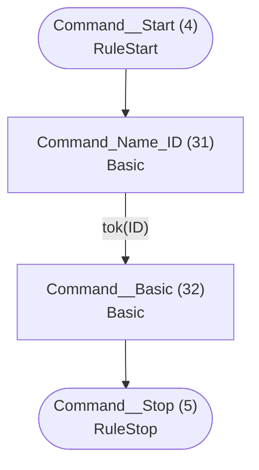
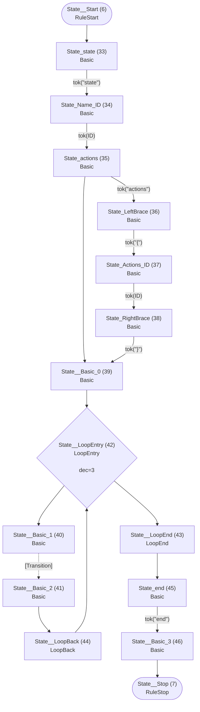
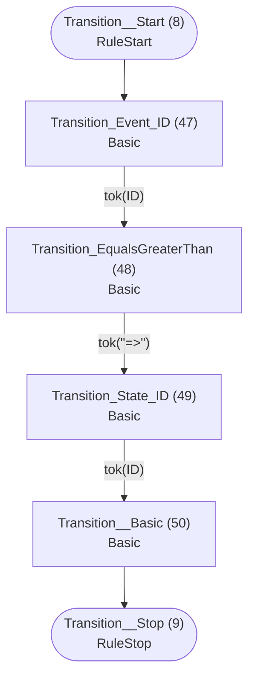

# Runtime ATN for statemachine

## Statemachine

```mermaid
flowchart TD
    q0(["Statemachine__Start (0)<br/>RuleStart"])
    q1(["Statemachine__Stop (1)<br/>RuleStop"])
    q10["Statemachine_statemachine (10)<br/>Basic<br/>"]
    q11["Statemachine_Name_ID (11)<br/>Basic<br/>"]
    q12["Statemachine_events (12)<br/>Basic<br/>"]
    q13["Statemachine__Basic_0 (13)<br/>Basic<br/>"]
    q14["Statemachine__Basic_1 (14)<br/>Basic<br/>"]
    q15{"Statemachine__LoopBack_0 (15)<br/>LoopBack<br/><br/>dec=0"}
    q16["Statemachine__LoopEnd_0 (16)<br/>LoopEnd<br/>"]
    q17["Statemachine_commands (17)<br/>Basic<br/>"]
    q18["Statemachine__Basic_2 (18)<br/>Basic<br/>"]
    q19["Statemachine__Basic_3 (19)<br/>Basic<br/>"]
    q20{"Statemachine__LoopBack_1 (20)<br/>LoopBack<br/><br/>dec=1"}
    q21["Statemachine__LoopEnd_1 (21)<br/>LoopEnd<br/>"]
    q22["Statemachine_initialState (22)<br/>Basic<br/>"]
    q23["Statemachine_Init_ID (23)<br/>Basic<br/>"]
    q24["Statemachine__Basic_4 (24)<br/>Basic<br/>"]
    q25["Statemachine__Basic_5 (25)<br/>Basic<br/>"]
    q26{"Statemachine__LoopEntry (26)<br/>LoopEntry<br/><br/>dec=2"}
    q27["Statemachine__LoopEnd_2 (27)<br/>LoopEnd<br/>"]
    q28["Statemachine__LoopBack_2 (28)<br/>LoopBack<br/>"]

    q0 --> q10
    q10 -->|"tok(&quot;statemachine&quot;)"| q11
    q11 -->|"tok(ID)"| q12
    q12 -->|"tok(&quot;events&quot;)"| q13
    q12 --> q16
    q13 -.->|"[Event]"| q14
    q14 --> q15
    q15 --> q13
    q15 --> q16
    q16 --> q17
    q17 -->|"tok(&quot;commands&quot;)"| q18
    q17 --> q21
    q18 -.->|"[Command]"| q19
    q19 --> q20
    q20 --> q18
    q20 --> q21
    q21 --> q22
    q22 -->|"tok(&quot;initialState&quot;)"| q23
    q23 -->|"tok(ID)"| q26
    q24 -.->|"[State]"| q25
    q25 --> q28
    q26 --> q24
    q26 --> q27
    q27 --> q1
    q28 --> q26
```

## Event

```mermaid
flowchart TD
    q2(["Event__Start (2)<br/>RuleStart"])
    q3(["Event__Stop (3)<br/>RuleStop"])
    q29["Event_Name_ID (29)<br/>Basic<br/>"]
    q30["Event__Basic (30)<br/>Basic<br/>"]

    q2 --> q29
    q29 -->|"tok(ID)"| q30
    q30 --> q3
```

## Command

```mermaid
flowchart TD
    q4(["Command__Start (4)<br/>RuleStart"])
    q5(["Command__Stop (5)<br/>RuleStop"])
    q31["Command_Name_ID (31)<br/>Basic<br/>"]
    q32["Command__Basic (32)<br/>Basic<br/>"]

    q4 --> q31
    q31 -->|"tok(ID)"| q32
    q32 --> q5
```

## State

```mermaid
flowchart TD
    q6(["State__Start (6)<br/>RuleStart"])
    q7(["State__Stop (7)<br/>RuleStop"])
    q33["State_state (33)<br/>Basic<br/>"]
    q34["State_Name_ID (34)<br/>Basic<br/>"]
    q35["State_actions (35)<br/>Basic<br/>"]
    q36["State_LeftBrace (36)<br/>Basic<br/>"]
    q37["State_Actions_ID (37)<br/>Basic<br/>"]
    q38["State_RightBrace (38)<br/>Basic<br/>"]
    q39["State__Basic_0 (39)<br/>Basic<br/>"]
    q40["State__Basic_1 (40)<br/>Basic<br/>"]
    q41["State__Basic_2 (41)<br/>Basic<br/>"]
    q42{"State__LoopEntry (42)<br/>LoopEntry<br/><br/>dec=3"}
    q43["State__LoopEnd (43)<br/>LoopEnd<br/>"]
    q44["State__LoopBack (44)<br/>LoopBack<br/>"]
    q45["State_end (45)<br/>Basic<br/>"]
    q46["State__Basic_3 (46)<br/>Basic<br/>"]

    q6 --> q33
    q33 -->|"tok(&quot;state&quot;)"| q34
    q34 -->|"tok(ID)"| q35
    q35 -->|"tok(&quot;actions&quot;)"| q36
    q35 --> q39
    q36 -->|"tok(&quot;{&quot;)"| q37
    q37 -->|"tok(ID)"| q38
    q38 -->|"tok(&quot;}&quot;)"| q39
    q39 --> q42
    q40 -.->|"[Transition]"| q41
    q41 --> q44
    q42 --> q40
    q42 --> q43
    q43 --> q45
    q44 --> q42
    q45 -->|"tok(&quot;end&quot;)"| q46
    q46 --> q7
```

## Transition

```mermaid
flowchart TD
    q8(["Transition__Start (8)<br/>RuleStart"])
    q9(["Transition__Stop (9)<br/>RuleStop"])
    q47["Transition_Event_ID (47)<br/>Basic<br/>"]
    q48["Transition_EqualsGreaterThan (48)<br/>Basic<br/>"]
    q49["Transition_State_ID (49)<br/>Basic<br/>"]
    q50["Transition__Basic (50)<br/>Basic<br/>"]

    q8 --> q47
    q47 -->|"tok(ID)"| q48
    q48 -->|"tok(&quot;=>&quot;)"| q49
    q49 -->|"tok(ID)"| q50
    q50 --> q9
```

