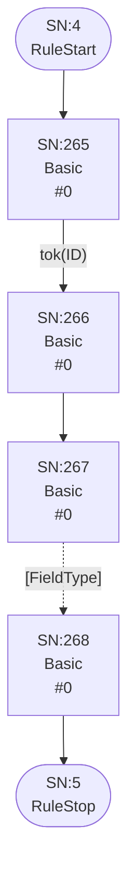
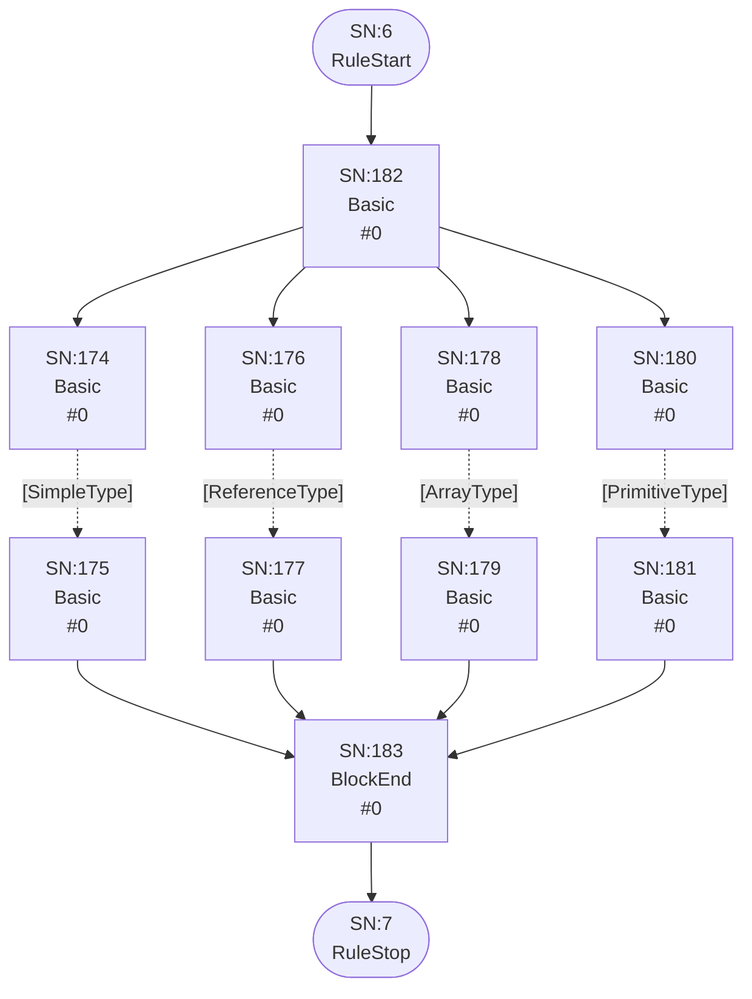
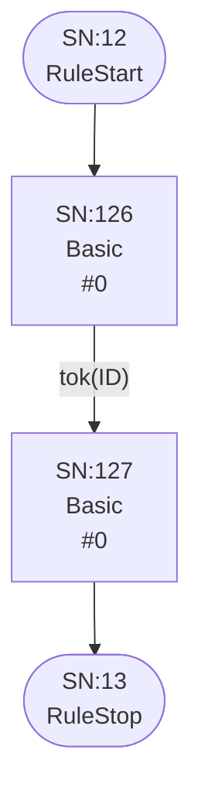
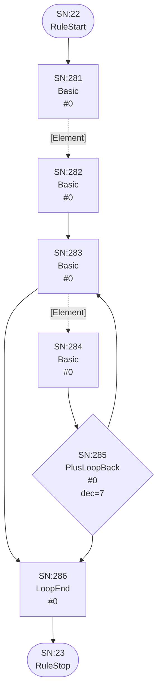
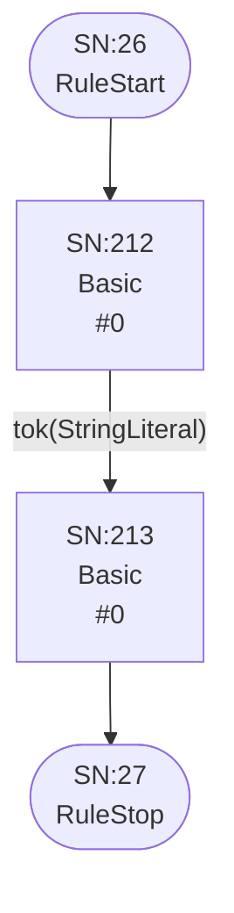
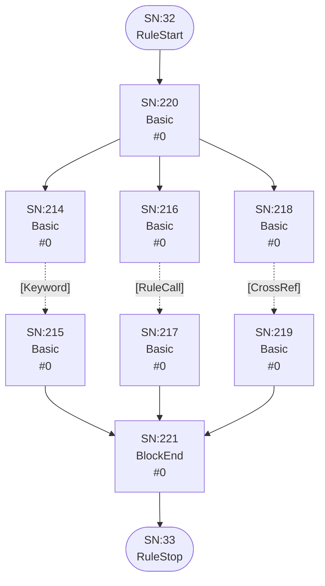
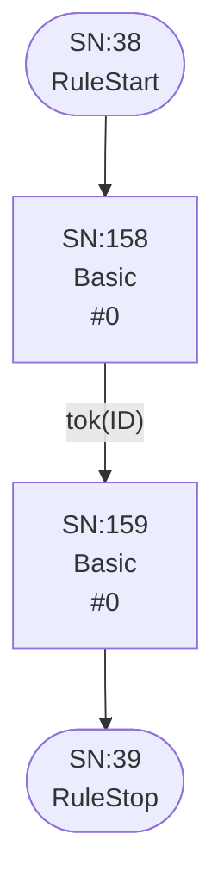

# Runtime ATN for grammar

## Grammar

```mermaid
flowchart TD
    q0(["SN:0<br/>RuleStart"])
    q1(["SN:1<br/>RuleStop"])
    q222["SN:222<br/>Basic<br/> #0"]
    q223["SN:223<br/>Basic<br/> #0"]
    q224["SN:224<br/>Basic<br/> #0"]
    q225["SN:225<br/>Basic<br/> #0"]
    q226["SN:226<br/>Basic<br/> #0"]
    q227["SN:227<br/>Basic<br/> #0"]
    q228["SN:228<br/>Basic<br/> #0"]
    q229["SN:229<br/>Basic<br/> #0"]
    q230["SN:230<br/>Basic<br/> #0"]
    q231["SN:231<br/>Basic<br/> #0"]
    q232["SN:232<br/>Basic<br/> #0"]
    q233["SN:233<br/>Basic<br/> #0"]
    q234["SN:234<br/>Basic<br/> #0"]
    q235["SN:235<br/>Basic<br/> #0"]
    q236["SN:236<br/>Basic<br/> #0"]
    q237["SN:237<br/>BlockEnd<br/> #0"]
    q238{"SN:238<br/>StarLoopEntry<br/> #0<br/>dec=4"}
    q239["SN:239<br/>LoopEnd<br/> #0"]
    q240["SN:240<br/>StarLoopBack<br/> #0"]

    q0 --> q222
    q222 -->|"tok("grammar")"| q223
    q223 --> q224
    q224 -->|"tok(ID)"| q225
    q225 --> q226
    q226 -->|"tok(";")"| q227
    q227 --> q238
    q228 -.->|"[ParserRule]"| q229
    q229 --> q237
    q230 -.->|"[Token]"| q231
    q231 --> q237
    q232 -.->|"[Interface]"| q233
    q233 --> q237
    q234 -.->|"[CompositeRule]"| q235
    q235 --> q237
    q236 --> q228
    q236 --> q230
    q236 --> q232
    q236 --> q234
    q237 --> q240
    q238 --> q236
    q238 --> q239
    q239 --> q1
    q240 --> q238
```

## Interface

```mermaid
flowchart TD
    q2(["SN:2<br/>RuleStart"])
    q3(["SN:3<br/>RuleStop"])
    q241["SN:241<br/>Basic<br/> #0"]
    q242["SN:242<br/>Basic<br/> #0"]
    q243["SN:243<br/>Basic<br/> #0"]
    q244["SN:244<br/>Basic<br/> #0"]
    q245["SN:245<br/>Basic<br/> #0"]
    q246["SN:246<br/>Basic<br/> #0"]
    q247["SN:247<br/>Basic<br/> #0"]
    q248["SN:248<br/>Basic<br/> #0"]
    q249["SN:249<br/>Basic<br/> #0"]
    q250["SN:250<br/>Basic<br/> #0"]
    q251["SN:251<br/>Basic<br/> #0"]
    q252["SN:252<br/>Basic<br/> #0"]
    q253{"SN:253<br/>StarLoopEntry<br/> #0<br/>dec=5"}
    q254["SN:254<br/>LoopEnd<br/> #0"]
    q255["SN:255<br/>StarLoopBack<br/> #0"]
    q256["SN:256<br/>Basic<br/> #0"]
    q257["SN:257<br/>Basic<br/> #0"]
    q258["SN:258<br/>Basic<br/> #0"]
    q259["SN:259<br/>Basic<br/> #0"]
    q260{"SN:260<br/>StarLoopEntry<br/> #0<br/>dec=6"}
    q261["SN:261<br/>LoopEnd<br/> #0"]
    q262["SN:262<br/>StarLoopBack<br/> #0"]
    q263["SN:263<br/>Basic<br/> #0"]
    q264["SN:264<br/>Basic<br/> #0"]

    q2 --> q241
    q241 -->|"tok("interface")"| q242
    q242 --> q243
    q243 -->|"tok(ID)"| q244
    q244 --> q245
    q245 -->|"tok("extends")"| q246
    q245 --> q254
    q246 --> q247
    q247 -->|"tok(ID)"| q248
    q248 --> q253
    q249 -->|"tok(",")"| q250
    q250 --> q251
    q251 -->|"tok(ID)"| q252
    q252 --> q255
    q253 --> q249
    q253 --> q254
    q254 --> q256
    q255 --> q253
    q256 -->|"tok("{")"| q257
    q257 --> q260
    q258 -.->|"[Field]"| q259
    q259 --> q262
    q260 --> q258
    q260 --> q261
    q261 --> q263
    q262 --> q260
    q263 -->|"tok("}")"| q264
    q264 --> q3
```

## Field



## FieldType



## ArrayType

```mermaid
flowchart TD
    q8(["SN:8<br/>RuleStart"])
    q9(["SN:9<br/>RuleStop"])
    q120["SN:120<br/>Basic<br/> #0"]
    q121["SN:121<br/>Basic<br/> #0"]
    q122["SN:122<br/>Basic<br/> #0"]
    q123["SN:123<br/>Basic<br/> #0"]
    q124["SN:124<br/>Basic<br/> #0"]
    q125["SN:125<br/>Basic<br/> #0"]

    q8 --> q120
    q120 -->|"tok("[")"| q121
    q121 --> q122
    q122 -->|"tok("]")"| q123
    q123 --> q124
    q124 -.->|"[FieldType]"| q125
    q125 --> q9
```

## ReferenceType

```mermaid
flowchart TD
    q10(["SN:10<br/>RuleStart"])
    q11(["SN:11<br/>RuleStop"])
    q184["SN:184<br/>Basic<br/> #0"]
    q185["SN:185<br/>Basic<br/> #0"]
    q186["SN:186<br/>Basic<br/> #0"]
    q187["SN:187<br/>Basic<br/> #0"]

    q10 --> q184
    q184 -->|"tok("*")"| q185
    q185 --> q186
    q186 -->|"tok(ID)"| q187
    q187 --> q11
```

## SimpleType



## PrimitiveType

```mermaid
flowchart TD
    q14(["SN:14<br/>RuleStart"])
    q15(["SN:15<br/>RuleStop"])
    q188["SN:188<br/>Basic<br/> #0"]
    q189["SN:189<br/>Basic<br/> #0"]
    q190["SN:190<br/>Basic<br/> #0"]
    q191["SN:191<br/>Basic<br/> #0"]
    q192["SN:192<br/>Basic<br/> #0"]
    q193["SN:193<br/>Basic<br/> #0"]
    q194["SN:194<br/>Basic<br/> #0"]
    q195["SN:195<br/>BlockEnd<br/> #0"]

    q14 --> q194
    q188 -->|"tok("string")"| q189
    q189 --> q195
    q190 -->|"tok("bool")"| q191
    q191 --> q195
    q192 -->|"tok("composite")"| q193
    q193 --> q195
    q194 --> q188
    q194 --> q190
    q194 --> q192
    q195 --> q15
```

## ParserRule

```mermaid
flowchart TD
    q16(["SN:16<br/>RuleStart"])
    q17(["SN:17<br/>RuleStop"])
    q269["SN:269<br/>Basic<br/> #0"]
    q270["SN:270<br/>Basic<br/> #0"]
    q271["SN:271<br/>Basic<br/> #0"]
    q272["SN:272<br/>Basic<br/> #0"]
    q273["SN:273<br/>Basic<br/> #0"]
    q274["SN:274<br/>Basic<br/> #0"]
    q275["SN:275<br/>Basic<br/> #0"]
    q276["SN:276<br/>Basic<br/> #0"]
    q277["SN:277<br/>Basic<br/> #0"]
    q278["SN:278<br/>Basic<br/> #0"]
    q279["SN:279<br/>Basic<br/> #0"]
    q280["SN:280<br/>Basic<br/> #0"]

    q16 --> q269
    q269 -->|"tok(ID)"| q270
    q270 --> q271
    q271 -->|"tok("returns")"| q272
    q271 --> q274
    q272 --> q273
    q273 -->|"tok(ID)"| q274
    q274 --> q275
    q275 -->|"tok(":")"| q276
    q276 --> q277
    q277 -.->|"[Alternatives]"| q278
    q278 --> q279
    q279 -->|"tok(";")"| q280
    q280 --> q17
```

## Token

```mermaid
flowchart TD
    q18(["SN:18<br/>RuleStart"])
    q19(["SN:19<br/>RuleStop"])
    q196["SN:196<br/>Basic<br/> #0"]
    q197["SN:197<br/>Basic<br/> #0"]
    q198["SN:198<br/>Basic<br/> #0"]
    q199["SN:199<br/>Basic<br/> #0"]
    q200["SN:200<br/>Basic<br/> #0"]
    q201["SN:201<br/>BlockEnd<br/> #0"]
    q202["SN:202<br/>Basic<br/> #0"]
    q203["SN:203<br/>Basic<br/> #0"]
    q204["SN:204<br/>Basic<br/> #0"]
    q205["SN:205<br/>Basic<br/> #0"]
    q206["SN:206<br/>Basic<br/> #0"]
    q207["SN:207<br/>Basic<br/> #0"]
    q208["SN:208<br/>Basic<br/> #0"]
    q209["SN:209<br/>Basic<br/> #0"]
    q210["SN:210<br/>Basic<br/> #0"]
    q211["SN:211<br/>Basic<br/> #0"]

    q18 --> q200
    q196 -->|"tok("hidden")"| q197
    q197 --> q201
    q198 -->|"tok("comment")"| q199
    q199 --> q201
    q200 --> q196
    q200 --> q198
    q200 --> q201
    q201 --> q202
    q202 -->|"tok("token")"| q203
    q203 --> q204
    q204 -->|"tok(ID)"| q205
    q205 --> q206
    q206 -->|"tok(":")"| q207
    q207 --> q208
    q208 -->|"tok(RegexLiteral)"| q209
    q209 --> q210
    q210 -->|"tok(";")"| q211
    q211 --> q19
```

## Alternatives

```mermaid
flowchart TD
    q20(["SN:20<br/>RuleStart"])
    q21(["SN:21<br/>RuleStop"])
    q50["SN:50<br/>Basic<br/> #0"]
    q51["SN:51<br/>Basic<br/> #0"]
    q52["SN:52<br/>Basic<br/> #0"]
    q53["SN:53<br/>Basic<br/> #0"]
    q54["SN:54<br/>Basic<br/> #0"]
    q55["SN:55<br/>Basic<br/> #0"]
    q56{"SN:56<br/>PlusLoopBack<br/> #0<br/>dec=0"}
    q57["SN:57<br/>LoopEnd<br/> #0"]

    q20 --> q50
    q50 -.->|"[Group]"| q51
    q51 --> q52
    q52 -->|"tok("|")"| q53
    q52 --> q57
    q53 --> q54
    q54 -.->|"[Group]"| q55
    q55 --> q56
    q56 --> q52
    q56 --> q57
    q57 --> q21
```

## Group



## Element

```mermaid
flowchart TD
    q24(["SN:24<br/>RuleStart"])
    q25(["SN:25<br/>RuleStop"])
    q287["SN:287<br/>Basic<br/> #0"]
    q288["SN:288<br/>Basic<br/> #0"]
    q289["SN:289<br/>Basic<br/> #0"]
    q290["SN:290<br/>Basic<br/> #0"]
    q291["SN:291<br/>Basic<br/> #0"]
    q292["SN:292<br/>Basic<br/> #0"]
    q293["SN:293<br/>Basic<br/> #0"]
    q294["SN:294<br/>Basic<br/> #0"]
    q295["SN:295<br/>Basic<br/> #0"]
    q296["SN:296<br/>Basic<br/> #0"]
    q297["SN:297<br/>Basic<br/> #0"]
    q298["SN:298<br/>Basic<br/> #0"]
    q299["SN:299<br/>Basic<br/> #0"]
    q300["SN:300<br/>Basic<br/> #0"]
    q301["SN:301<br/>Basic<br/> #0"]
    q302["SN:302<br/>BlockEnd<br/> #0"]
    q303["SN:303<br/>Basic<br/> #0"]
    q304["SN:304<br/>Basic<br/> #0"]
    q305["SN:305<br/>Basic<br/> #0"]
    q306["SN:306<br/>Basic<br/> #0"]
    q307["SN:307<br/>Basic<br/> #0"]
    q308["SN:308<br/>Basic<br/> #0"]
    q309["SN:309<br/>Basic<br/> #0"]
    q310["SN:310<br/>BlockEnd<br/> #0"]

    q24 --> q301
    q287 -.->|"[Keyword]"| q288
    q288 --> q302
    q289 -.->|"[Assignment]"| q290
    q290 --> q302
    q291 -.->|"[RuleCall]"| q292
    q292 --> q302
    q293 -.->|"[Action]"| q294
    q294 --> q302
    q295 -->|"tok("(")"| q296
    q296 --> q297
    q297 -.->|"[Alternatives]"| q298
    q298 --> q299
    q299 -->|"tok(")")"| q300
    q300 --> q302
    q301 --> q287
    q301 --> q289
    q301 --> q291
    q301 --> q293
    q301 --> q295
    q302 --> q309
    q303 -->|"tok("*")"| q304
    q304 --> q310
    q305 -->|"tok("+")"| q306
    q306 --> q310
    q307 -->|"tok("?")"| q308
    q308 --> q310
    q309 --> q303
    q309 --> q305
    q309 --> q307
    q309 --> q310
    q310 --> q25
```

## Keyword



## Assignment

```mermaid
flowchart TD
    q28(["SN:28<br/>RuleStart"])
    q29(["SN:29<br/>RuleStop"])
    q128["SN:128<br/>Basic<br/> #0"]
    q129["SN:129<br/>Basic<br/> #0"]
    q130["SN:130<br/>Basic<br/> #0"]
    q131["SN:131<br/>Basic<br/> #0"]
    q132["SN:132<br/>Basic<br/> #0"]
    q133["SN:133<br/>Basic<br/> #0"]
    q134["SN:134<br/>Basic<br/> #0"]
    q135["SN:135<br/>Basic<br/> #0"]
    q136["SN:136<br/>Basic<br/> #0"]
    q137["SN:137<br/>BlockEnd<br/> #0"]
    q138["SN:138<br/>Basic<br/> #0"]
    q139["SN:139<br/>Basic<br/> #0"]

    q28 --> q128
    q128 -->|"tok(ID)"| q129
    q129 --> q136
    q130 -->|"tok("+=")"| q131
    q131 --> q137
    q132 -->|"tok("=")"| q133
    q133 --> q137
    q134 -->|"tok("?=")"| q135
    q135 --> q137
    q136 --> q130
    q136 --> q132
    q136 --> q134
    q137 --> q138
    q138 -.->|"[Assignable]"| q139
    q139 --> q29
```

## Assignable

```mermaid
flowchart TD
    q30(["SN:30<br/>RuleStart"])
    q31(["SN:31<br/>RuleStop"])
    q58["SN:58<br/>Basic<br/> #0"]
    q59["SN:59<br/>Basic<br/> #0"]
    q60["SN:60<br/>Basic<br/> #0"]
    q61["SN:61<br/>Basic<br/> #0"]
    q62["SN:62<br/>Basic<br/> #0"]
    q63["SN:63<br/>Basic<br/> #0"]
    q64["SN:64<br/>Basic<br/> #0"]
    q65["SN:65<br/>Basic<br/> #0"]
    q66["SN:66<br/>Basic<br/> #0"]
    q67["SN:67<br/>Basic<br/> #0"]
    q68["SN:68<br/>Basic<br/> #0"]
    q69["SN:69<br/>Basic<br/> #0"]
    q70["SN:70<br/>Basic<br/> #0"]
    q71["SN:71<br/>BlockEnd<br/> #0"]

    q30 --> q70
    q58 -.->|"[Keyword]"| q59
    q59 --> q71
    q60 -.->|"[RuleCall]"| q61
    q61 --> q71
    q62 -.->|"[CrossRef]"| q63
    q63 --> q71
    q64 -->|"tok("(")"| q65
    q65 --> q66
    q66 -.->|"[AssignableAlternatives]"| q67
    q67 --> q68
    q68 -->|"tok(")")"| q69
    q69 --> q71
    q70 --> q58
    q70 --> q60
    q70 --> q62
    q70 --> q64
    q71 --> q31
```

## AssignableWithoutAlts



## AssignableAlternatives

```mermaid
flowchart TD
    q34(["SN:34<br/>RuleStart"])
    q35(["SN:35<br/>RuleStop"])
    q140["SN:140<br/>Basic<br/> #0"]
    q141["SN:141<br/>Basic<br/> #0"]
    q142["SN:142<br/>Basic<br/> #0"]
    q143["SN:143<br/>Basic<br/> #0"]
    q144["SN:144<br/>Basic<br/> #0"]
    q145["SN:145<br/>Basic<br/> #0"]
    q146{"SN:146<br/>PlusLoopBack<br/> #0<br/>dec=1"}
    q147["SN:147<br/>LoopEnd<br/> #0"]

    q34 --> q140
    q140 -.->|"[AssignableWithoutAlts]"| q141
    q141 --> q142
    q142 -->|"tok("|")"| q143
    q142 --> q147
    q143 --> q144
    q144 -.->|"[AssignableWithoutAlts]"| q145
    q145 --> q146
    q146 --> q142
    q146 --> q147
    q147 --> q35
```

## CrossRef

```mermaid
flowchart TD
    q36(["SN:36<br/>RuleStart"])
    q37(["SN:37<br/>RuleStop"])
    q148["SN:148<br/>Basic<br/> #0"]
    q149["SN:149<br/>Basic<br/> #0"]
    q150["SN:150<br/>Basic<br/> #0"]
    q151["SN:151<br/>Basic<br/> #0"]
    q152["SN:152<br/>Basic<br/> #0"]
    q153["SN:153<br/>Basic<br/> #0"]
    q154["SN:154<br/>Basic<br/> #0"]
    q155["SN:155<br/>Basic<br/> #0"]
    q156["SN:156<br/>Basic<br/> #0"]
    q157["SN:157<br/>Basic<br/> #0"]

    q36 --> q148
    q148 -->|"tok("[")"| q149
    q149 --> q150
    q150 -->|"tok(ID)"| q151
    q151 --> q152
    q152 -->|"tok(":")"| q153
    q152 --> q155
    q153 --> q154
    q154 -.->|"[RuleCall]"| q155
    q155 --> q156
    q156 -->|"tok("]")"| q157
    q157 --> q37
```

## RuleCall



## Action

```mermaid
flowchart TD
    q40(["SN:40<br/>RuleStart"])
    q41(["SN:41<br/>RuleStop"])
    q72["SN:72<br/>Basic<br/> #0"]
    q73["SN:73<br/>Basic<br/> #0"]
    q74["SN:74<br/>Basic<br/> #0"]
    q75["SN:75<br/>Basic<br/> #0"]
    q76["SN:76<br/>Basic<br/> #0"]
    q77["SN:77<br/>Basic<br/> #0"]
    q78["SN:78<br/>Basic<br/> #0"]
    q79["SN:79<br/>Basic<br/> #0"]
    q80["SN:80<br/>Basic<br/> #0"]
    q81["SN:81<br/>Basic<br/> #0"]
    q82["SN:82<br/>Basic<br/> #0"]
    q83["SN:83<br/>Basic<br/> #0"]
    q84["SN:84<br/>Basic<br/> #0"]
    q85["SN:85<br/>BlockEnd<br/> #0"]
    q86["SN:86<br/>Basic<br/> #0"]
    q87["SN:87<br/>Basic<br/> #0"]
    q88["SN:88<br/>Basic<br/> #0"]
    q89["SN:89<br/>Basic<br/> #0"]

    q40 --> q72
    q72 -->|"tok("{")"| q73
    q73 --> q74
    q74 -->|"tok(ID)"| q75
    q75 --> q76
    q76 -->|"tok(".")"| q77
    q76 --> q87
    q77 --> q78
    q78 -->|"tok(ID)"| q79
    q79 --> q84
    q80 -->|"tok("+=")"| q81
    q81 --> q85
    q82 -->|"tok("=")"| q83
    q83 --> q85
    q84 --> q80
    q84 --> q82
    q85 --> q86
    q86 -->|"tok("current")"| q87
    q87 --> q88
    q88 -->|"tok("}")"| q89
    q89 --> q41
```

## CompositeRule

```mermaid
flowchart TD
    q42(["SN:42<br/>RuleStart"])
    q43(["SN:43<br/>RuleStop"])
    q90["SN:90<br/>Basic<br/> #0"]
    q91["SN:91<br/>Basic<br/> #0"]
    q92["SN:92<br/>Basic<br/> #0"]
    q93["SN:93<br/>Basic<br/> #0"]
    q94["SN:94<br/>Basic<br/> #0"]
    q95["SN:95<br/>Basic<br/> #0"]
    q96["SN:96<br/>Basic<br/> #0"]
    q97["SN:97<br/>Basic<br/> #0"]
    q98["SN:98<br/>Basic<br/> #0"]
    q99["SN:99<br/>Basic<br/> #0"]

    q42 --> q90
    q90 -->|"tok("composite")"| q91
    q91 --> q92
    q92 -->|"tok(ID)"| q93
    q93 --> q94
    q94 -->|"tok(":")"| q95
    q95 --> q96
    q96 -.->|"[CompositeAlternatives]"| q97
    q97 --> q98
    q98 -->|"tok(";")"| q99
    q99 --> q43
```

## CompositeAlternatives

```mermaid
flowchart TD
    q44(["SN:44<br/>RuleStart"])
    q45(["SN:45<br/>RuleStop"])
    q160["SN:160<br/>Basic<br/> #0"]
    q161["SN:161<br/>Basic<br/> #0"]
    q162["SN:162<br/>Basic<br/> #0"]
    q163["SN:163<br/>Basic<br/> #0"]
    q164["SN:164<br/>Basic<br/> #0"]
    q165["SN:165<br/>Basic<br/> #0"]
    q166{"SN:166<br/>PlusLoopBack<br/> #0<br/>dec=2"}
    q167["SN:167<br/>LoopEnd<br/> #0"]

    q44 --> q160
    q160 -.->|"[CompositeGroup]"| q161
    q161 --> q162
    q162 -->|"tok("|")"| q163
    q162 --> q167
    q163 --> q164
    q164 -.->|"[CompositeGroup]"| q165
    q165 --> q166
    q166 --> q162
    q166 --> q167
    q167 --> q45
```

## CompositeGroup

```mermaid
flowchart TD
    q46(["SN:46<br/>RuleStart"])
    q47(["SN:47<br/>RuleStop"])
    q168["SN:168<br/>Basic<br/> #0"]
    q169["SN:169<br/>Basic<br/> #0"]
    q170["SN:170<br/>Basic<br/> #0"]
    q171["SN:171<br/>Basic<br/> #0"]
    q172{"SN:172<br/>PlusLoopBack<br/> #0<br/>dec=3"}
    q173["SN:173<br/>LoopEnd<br/> #0"]

    q46 --> q168
    q168 -.->|"[CompositeElement]"| q169
    q169 --> q170
    q170 -.->|"[CompositeElement]"| q171
    q170 --> q173
    q171 --> q172
    q172 --> q170
    q172 --> q173
    q173 --> q47
```

## CompositeElement

```mermaid
flowchart TD
    q48(["SN:48<br/>RuleStart"])
    q49(["SN:49<br/>RuleStop"])
    q100["SN:100<br/>Basic<br/> #0"]
    q101["SN:101<br/>Basic<br/> #0"]
    q102["SN:102<br/>Basic<br/> #0"]
    q103["SN:103<br/>Basic<br/> #0"]
    q104["SN:104<br/>Basic<br/> #0"]
    q105["SN:105<br/>Basic<br/> #0"]
    q106["SN:106<br/>Basic<br/> #0"]
    q107["SN:107<br/>Basic<br/> #0"]
    q108["SN:108<br/>Basic<br/> #0"]
    q109["SN:109<br/>Basic<br/> #0"]
    q110["SN:110<br/>Basic<br/> #0"]
    q111["SN:111<br/>BlockEnd<br/> #0"]
    q112["SN:112<br/>Basic<br/> #0"]
    q113["SN:113<br/>Basic<br/> #0"]
    q114["SN:114<br/>Basic<br/> #0"]
    q115["SN:115<br/>Basic<br/> #0"]
    q116["SN:116<br/>Basic<br/> #0"]
    q117["SN:117<br/>Basic<br/> #0"]
    q118["SN:118<br/>Basic<br/> #0"]
    q119["SN:119<br/>BlockEnd<br/> #0"]

    q48 --> q110
    q100 -.->|"[Keyword]"| q101
    q101 --> q111
    q102 -.->|"[RuleCall]"| q103
    q103 --> q111
    q104 -->|"tok("(")"| q105
    q105 --> q106
    q106 -.->|"[CompositeAlternatives]"| q107
    q107 --> q108
    q108 -->|"tok(")")"| q109
    q109 --> q111
    q110 --> q100
    q110 --> q102
    q110 --> q104
    q111 --> q118
    q112 -->|"tok("*")"| q113
    q113 --> q119
    q114 -->|"tok("+")"| q115
    q115 --> q119
    q116 -->|"tok("?")"| q117
    q117 --> q119
    q118 --> q112
    q118 --> q114
    q118 --> q116
    q118 --> q119
    q119 --> q49
```

