# Runtime ATN for grammar

## Grammar

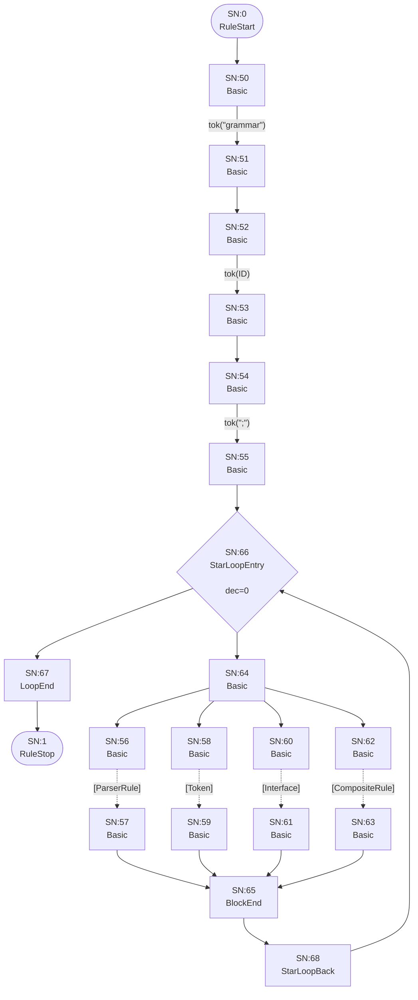

## Interface

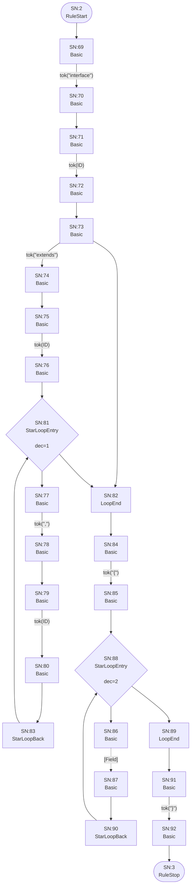

## Field

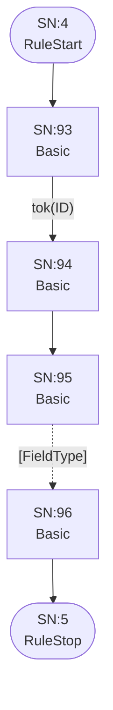

## FieldType

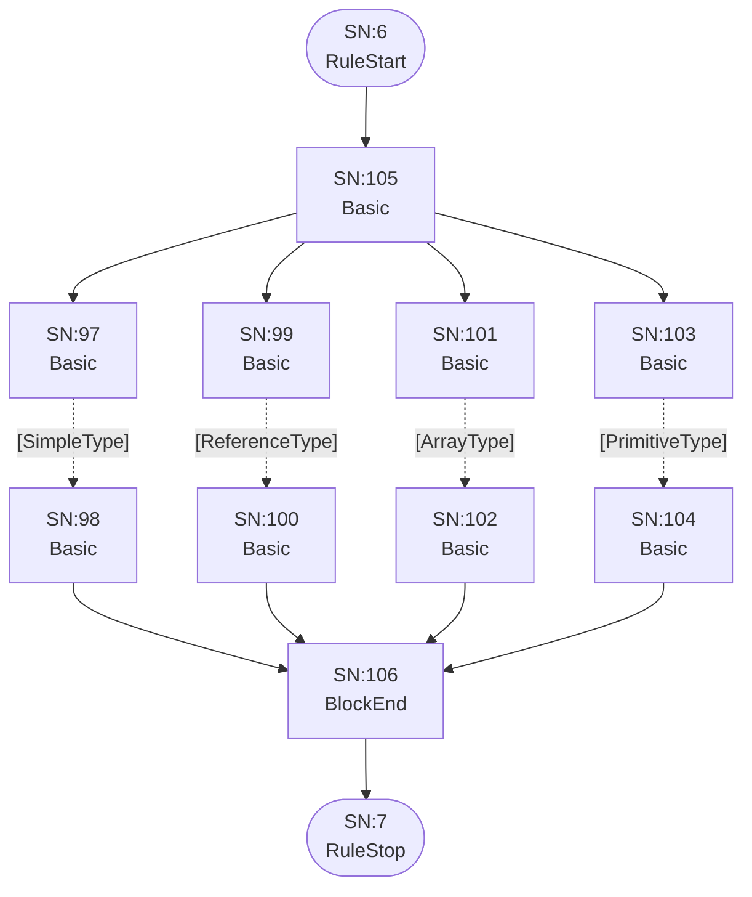

## ArrayType

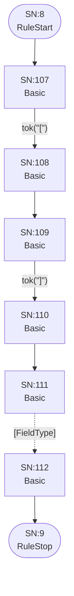

## ReferenceType

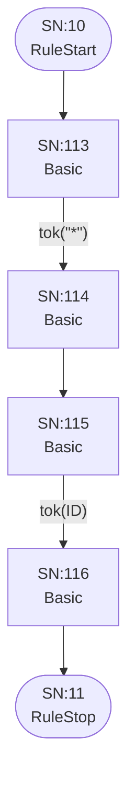

## SimpleType

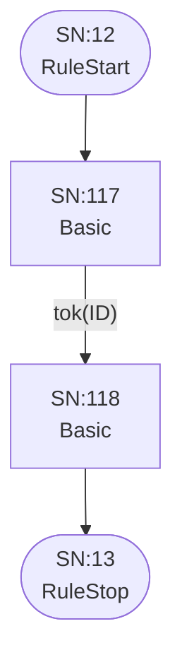

## PrimitiveType

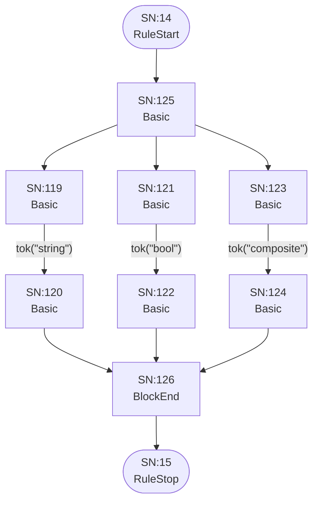

## ParserRule

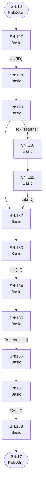

## Token

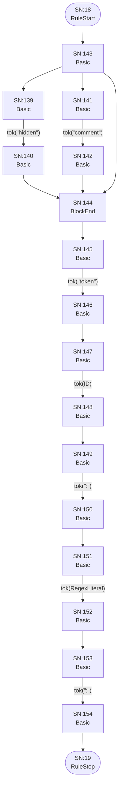

## Alternatives

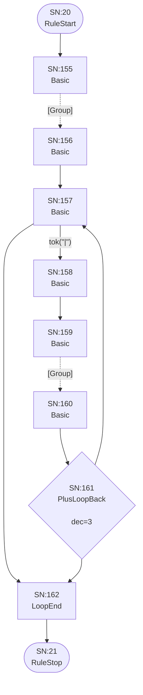

## Group

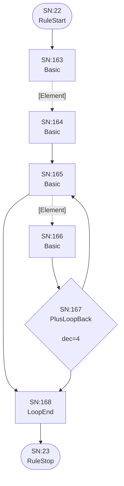

## Element

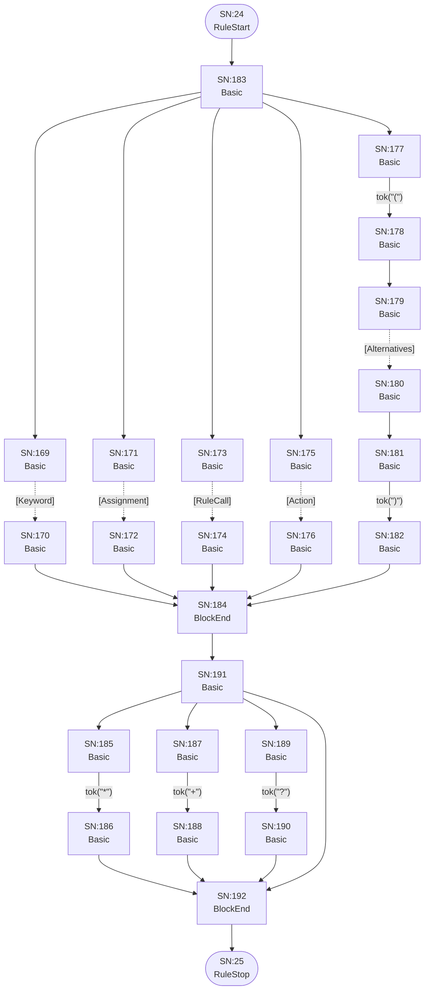

## Keyword


## Assignment

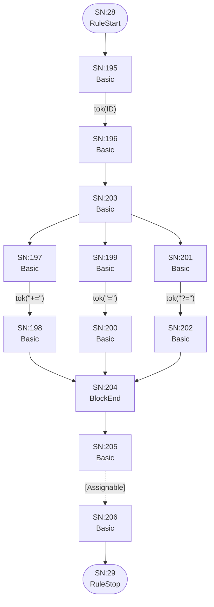

## Assignable


## AssignableWithoutAlts

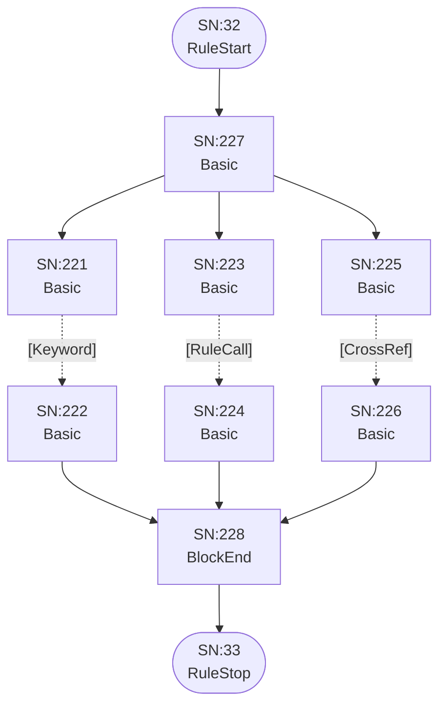

## AssignableAlternatives

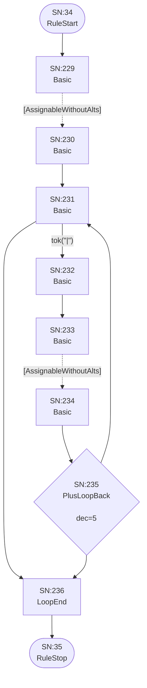

## CrossRef

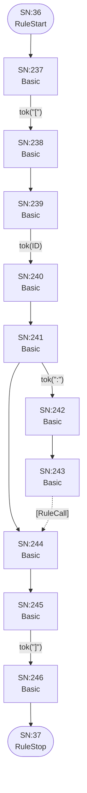

## RuleCall

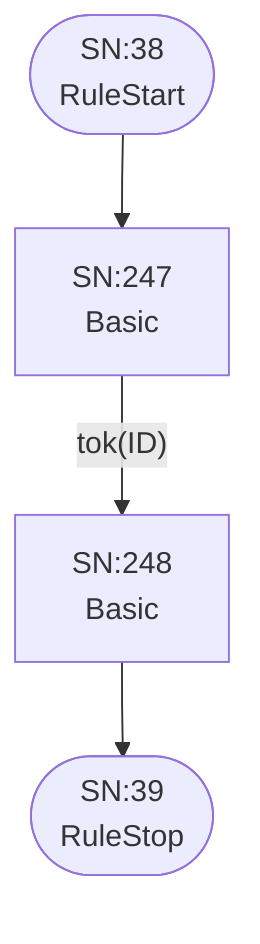

## Action

```mermaid
flowchart TD
    q40(["SN:40<br/>RuleStart"])
    q41(["SN:41<br/>RuleStop"])
    q249["SN:249<br/>Basic<br/>"]
    q250["SN:250<br/>Basic<br/>"]
    q251["SN:251<br/>Basic<br/>"]
    q252["SN:252<br/>Basic<br/>"]
    q253["SN:253<br/>Basic<br/>"]
    q254["SN:254<br/>Basic<br/>"]
    q255["SN:255<br/>Basic<br/>"]
    q256["SN:256<br/>Basic<br/>"]
    q257["SN:257<br/>Basic<br/>"]
    q258["SN:258<br/>Basic<br/>"]
    q259["SN:259<br/>Basic<br/>"]
    q260["SN:260<br/>Basic<br/>"]
    q261["SN:261<br/>Basic<br/>"]
    q262["SN:262<br/>BlockEnd<br/>"]
    q263["SN:263<br/>Basic<br/>"]
    q264["SN:264<br/>Basic<br/>"]
    q265["SN:265<br/>Basic<br/>"]
    q266["SN:266<br/>Basic<br/>"]

    q40 --> q249
    q249 -->|"tok(&quot;{&quot;)"| q250
    q250 --> q251
    q251 -->|"tok(ID)"| q252
    q252 --> q253
    q253 -->|"tok(&quot;.&quot;)"| q254
    q253 --> q264
    q254 --> q255
    q255 -->|"tok(ID)"| q256
    q256 --> q261
    q257 -->|"tok(&quot;+=&quot;)"| q258
    q258 --> q262
    q259 -->|"tok(&quot;=&quot;)"| q260
    q260 --> q262
    q261 --> q257
    q261 --> q259
    q262 --> q263
    q263 -->|"tok(&quot;current&quot;)"| q264
    q264 --> q265
    q265 -->|"tok(&quot;}&quot;)"| q266
    q266 --> q41
```

## CompositeRule

```mermaid
flowchart TD
    q42(["SN:42<br/>RuleStart"])
    q43(["SN:43<br/>RuleStop"])
    q267["SN:267<br/>Basic<br/>"]
    q268["SN:268<br/>Basic<br/>"]
    q269["SN:269<br/>Basic<br/>"]
    q270["SN:270<br/>Basic<br/>"]
    q271["SN:271<br/>Basic<br/>"]
    q272["SN:272<br/>Basic<br/>"]
    q273["SN:273<br/>Basic<br/>"]
    q274["SN:274<br/>Basic<br/>"]
    q275["SN:275<br/>Basic<br/>"]
    q276["SN:276<br/>Basic<br/>"]

    q42 --> q267
    q267 -->|"tok(&quot;composite&quot;)"| q268
    q268 --> q269
    q269 -->|"tok(ID)"| q270
    q270 --> q271
    q271 -->|"tok(&quot;:&quot;)"| q272
    q272 --> q273
    q273 -.->|"[CompositeAlternatives]"| q274
    q274 --> q275
    q275 -->|"tok(&quot;;&quot;)"| q276
    q276 --> q43
```

## CompositeAlternatives

```mermaid
flowchart TD
    q44(["SN:44<br/>RuleStart"])
    q45(["SN:45<br/>RuleStop"])
    q277["SN:277<br/>Basic<br/>"]
    q278["SN:278<br/>Basic<br/>"]
    q279["SN:279<br/>Basic<br/>"]
    q280["SN:280<br/>Basic<br/>"]
    q281["SN:281<br/>Basic<br/>"]
    q282["SN:282<br/>Basic<br/>"]
    q283{"SN:283<br/>PlusLoopBack<br/><br/>dec=6"}
    q284["SN:284<br/>LoopEnd<br/>"]

    q44 --> q277
    q277 -.->|"[CompositeGroup]"| q278
    q278 --> q279
    q279 -->|"tok(&quot;|&quot;)"| q280
    q279 --> q284
    q280 --> q281
    q281 -.->|"[CompositeGroup]"| q282
    q282 --> q283
    q283 --> q279
    q283 --> q284
    q284 --> q45
```

## CompositeGroup

```mermaid
flowchart TD
    q46(["SN:46<br/>RuleStart"])
    q47(["SN:47<br/>RuleStop"])
    q285["SN:285<br/>Basic<br/>"]
    q286["SN:286<br/>Basic<br/>"]
    q287["SN:287<br/>Basic<br/>"]
    q288["SN:288<br/>Basic<br/>"]
    q289{"SN:289<br/>PlusLoopBack<br/><br/>dec=7"}
    q290["SN:290<br/>LoopEnd<br/>"]

    q46 --> q285
    q285 -.->|"[CompositeElement]"| q286
    q286 --> q287
    q287 -.->|"[CompositeElement]"| q288
    q287 --> q290
    q288 --> q289
    q289 --> q287
    q289 --> q290
    q290 --> q47
```

## CompositeElement

```mermaid
flowchart TD
    q48(["SN:48<br/>RuleStart"])
    q49(["SN:49<br/>RuleStop"])
    q291["SN:291<br/>Basic<br/>"]
    q292["SN:292<br/>Basic<br/>"]
    q293["SN:293<br/>Basic<br/>"]
    q294["SN:294<br/>Basic<br/>"]
    q295["SN:295<br/>Basic<br/>"]
    q296["SN:296<br/>Basic<br/>"]
    q297["SN:297<br/>Basic<br/>"]
    q298["SN:298<br/>Basic<br/>"]
    q299["SN:299<br/>Basic<br/>"]
    q300["SN:300<br/>Basic<br/>"]
    q301["SN:301<br/>Basic<br/>"]
    q302["SN:302<br/>BlockEnd<br/>"]
    q303["SN:303<br/>Basic<br/>"]
    q304["SN:304<br/>Basic<br/>"]
    q305["SN:305<br/>Basic<br/>"]
    q306["SN:306<br/>Basic<br/>"]
    q307["SN:307<br/>Basic<br/>"]
    q308["SN:308<br/>Basic<br/>"]
    q309["SN:309<br/>Basic<br/>"]
    q310["SN:310<br/>BlockEnd<br/>"]

    q48 --> q301
    q291 -.->|"[Keyword]"| q292
    q292 --> q302
    q293 -.->|"[RuleCall]"| q294
    q294 --> q302
    q295 -->|"tok(&quot;(&quot;)"| q296
    q296 --> q297
    q297 -.->|"[CompositeAlternatives]"| q298
    q298 --> q299
    q299 -->|"tok(&quot;)&quot;)"| q300
    q300 --> q302
    q301 --> q291
    q301 --> q293
    q301 --> q295
    q302 --> q309
    q303 -->|"tok(&quot;*&quot;)"| q304
    q304 --> q310
    q305 -->|"tok(&quot;+&quot;)"| q306
    q306 --> q310
    q307 -->|"tok(&quot;?&quot;)"| q308
    q308 --> q310
    q309 --> q303
    q309 --> q305
    q309 --> q307
    q309 --> q310
    q310 --> q49
```

