# Runtime ATN for grammar

## Grammar

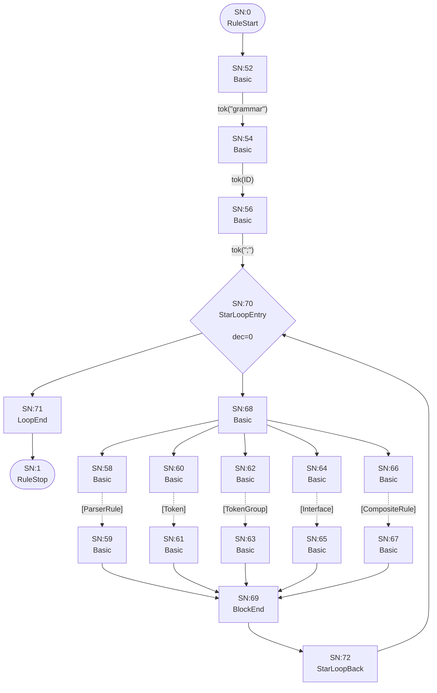

## Interface

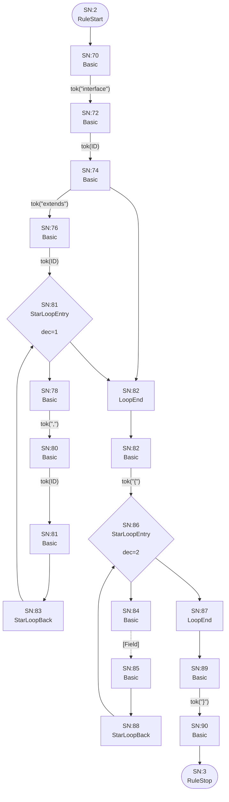

## Field


## FieldType

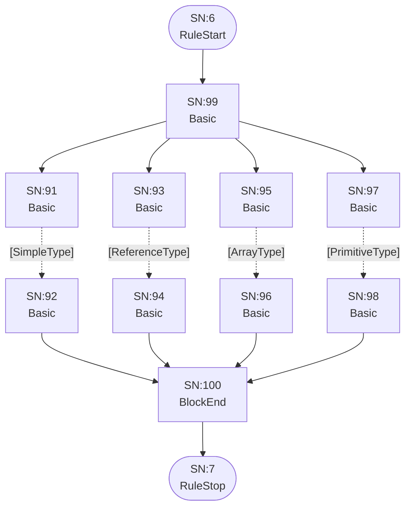

## ArrayType

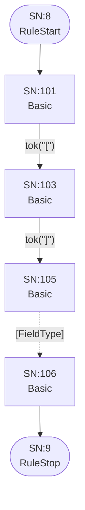

## ReferenceType

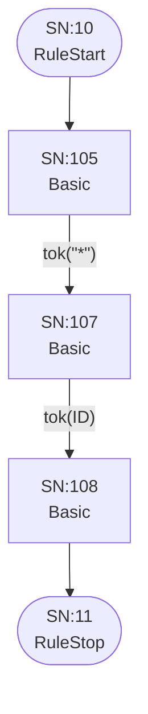

## SimpleType


## PrimitiveType

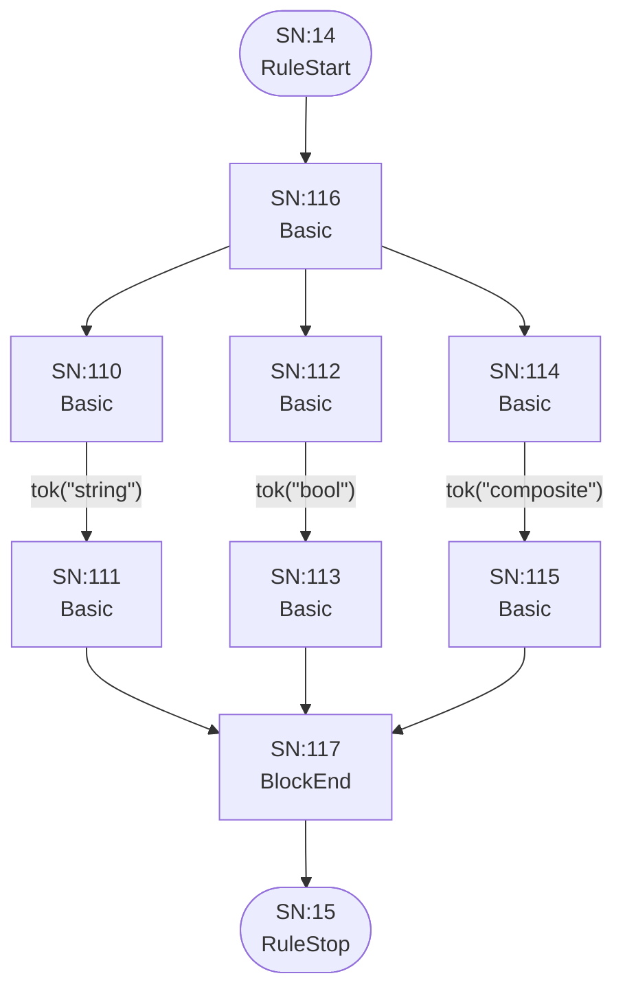

## ParserRule

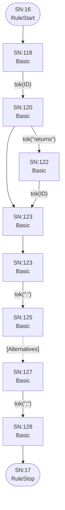

## Token

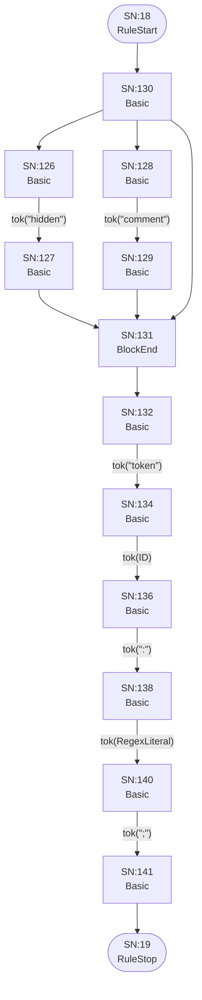

## TokenGroup

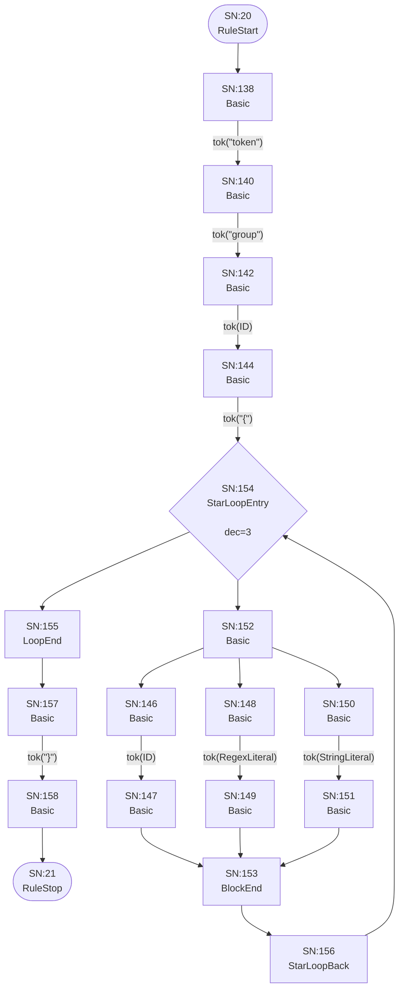

## Alternatives

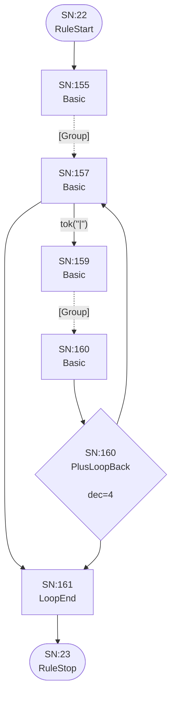

## Group

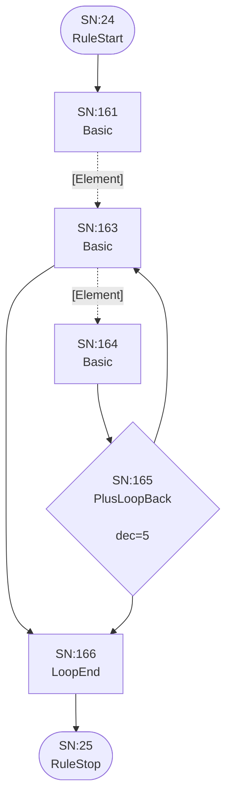

## Element

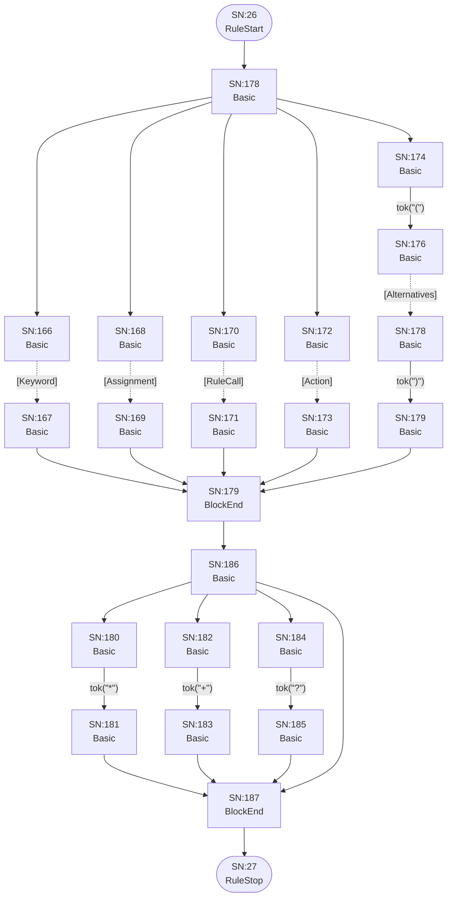

## Keyword

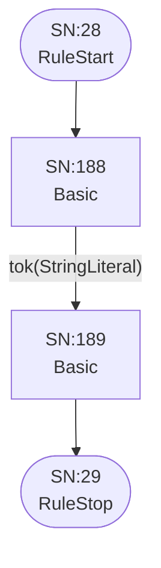

## Assignment

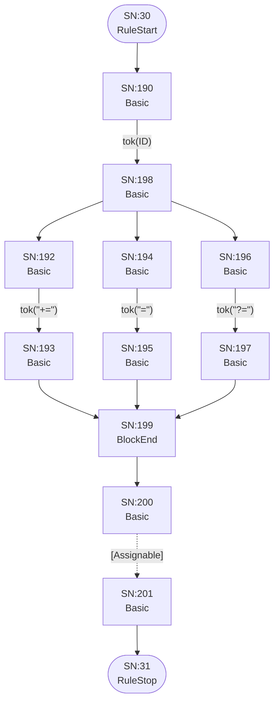

## Assignable

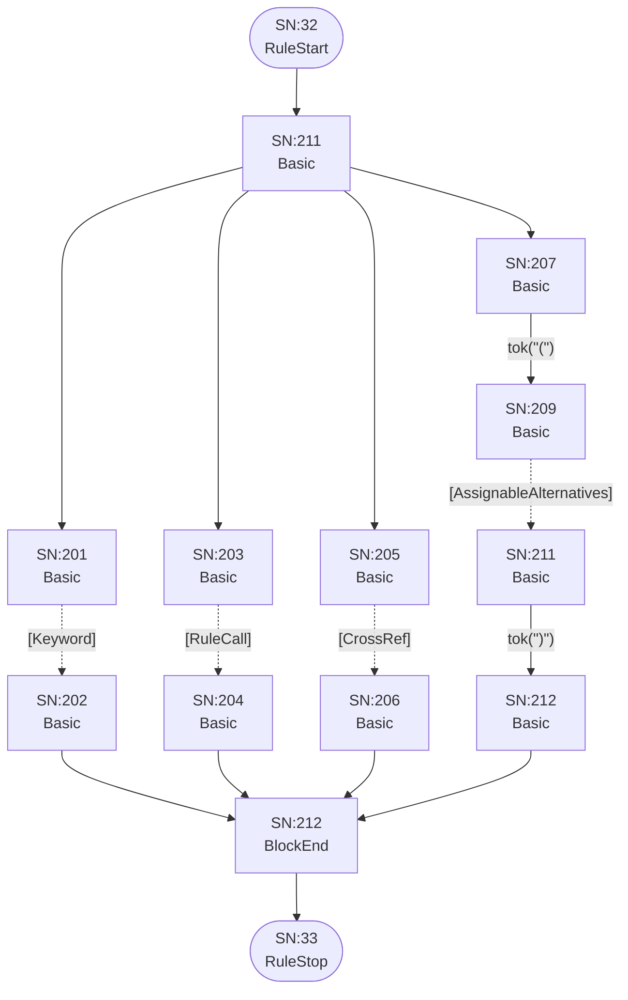

## AssignableWithoutAlts

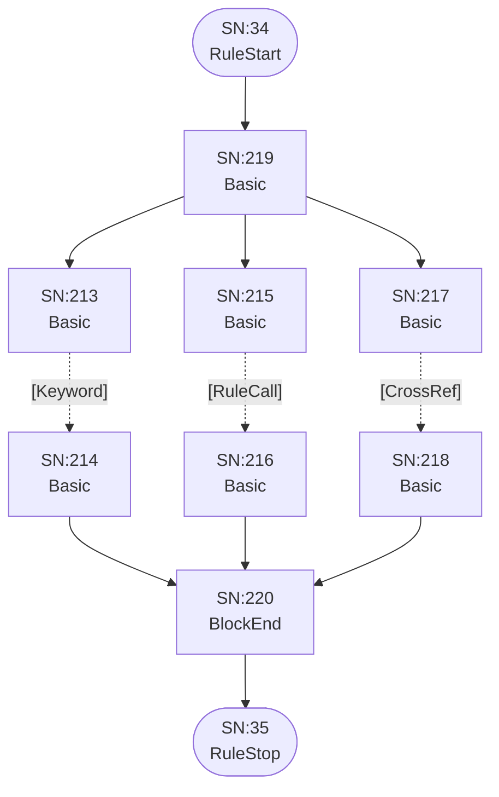

## AssignableAlternatives

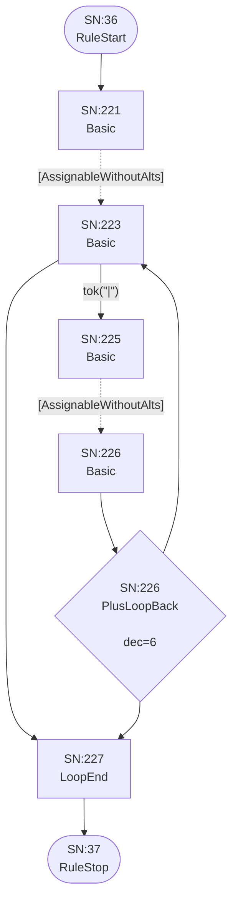

## CrossRef

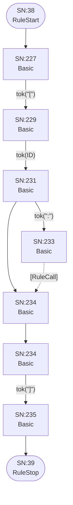

## RuleCall

```mermaid
flowchart TD
    q40(["SN:40<br/>RuleStart"])
    q41(["SN:41<br/>RuleStop"])
    q234["SN:234<br/>Basic<br/>"]
    q235["SN:235<br/>Basic<br/>"]

    q40 --> q234
    q234 -->|"tok(ID)"| q235
    q235 --> q41
```

## Action

```mermaid
flowchart TD
    q42(["SN:42<br/>RuleStart"])
    q43(["SN:43<br/>RuleStop"])
    q236["SN:236<br/>Basic<br/>"]
    q237["SN:238<br/>Basic<br/>"]
    q238["SN:240<br/>Basic<br/>"]
    q239["SN:242<br/>Basic<br/>"]
    q240["SN:244<br/>Basic<br/>"]
    q241["SN:245<br/>Basic<br/>"]
    q242["SN:246<br/>Basic<br/>"]
    q243["SN:247<br/>Basic<br/>"]
    q244["SN:248<br/>Basic<br/>"]
    q245["SN:249<br/>BlockEnd<br/>"]
    q246["SN:250<br/>Basic<br/>"]
    q247["SN:251<br/>Basic<br/>"]
    q248["SN:250<br/>Basic<br/>"]
    q249["SN:251<br/>Basic<br/>"]

    q42 --> q236
    q236 -->|"tok(&quot;{&quot;)"| q237
    q237 -->|"tok(ID)"| q238
    q238 -->|"tok(&quot;.&quot;)"| q239
    q238 --> q247
    q239 -->|"tok(ID)"| q244
    q240 -->|"tok(&quot;+=&quot;)"| q241
    q241 --> q245
    q242 -->|"tok(&quot;=&quot;)"| q243
    q243 --> q245
    q244 --> q240
    q244 --> q242
    q245 --> q246
    q246 -->|"tok(&quot;current&quot;)"| q247
    q247 --> q248
    q248 -->|"tok(&quot;}&quot;)"| q249
    q249 --> q43
```

## CompositeRule

```mermaid
flowchart TD
    q44(["SN:44<br/>RuleStart"])
    q45(["SN:45<br/>RuleStop"])
    q250["SN:250<br/>Basic<br/>"]
    q251["SN:252<br/>Basic<br/>"]
    q252["SN:254<br/>Basic<br/>"]
    q253["SN:256<br/>Basic<br/>"]
    q254["SN:258<br/>Basic<br/>"]
    q255["SN:259<br/>Basic<br/>"]

    q44 --> q250
    q250 -->|"tok(&quot;composite&quot;)"| q251
    q251 -->|"tok(ID)"| q252
    q252 -->|"tok(&quot;:&quot;)"| q253
    q253 -.->|"[CompositeAlternatives]"| q254
    q254 -->|"tok(&quot;;&quot;)"| q255
    q255 --> q45
```

## CompositeAlternatives

```mermaid
flowchart TD
    q46(["SN:46<br/>RuleStart"])
    q47(["SN:47<br/>RuleStop"])
    q256["SN:256<br/>Basic<br/>"]
    q257["SN:258<br/>Basic<br/>"]
    q258["SN:260<br/>Basic<br/>"]
    q259["SN:261<br/>Basic<br/>"]
    q260{"SN:261<br/>PlusLoopBack<br/><br/>dec=7"}
    q261["SN:262<br/>LoopEnd<br/>"]

    q46 --> q256
    q256 -.->|"[CompositeGroup]"| q257
    q257 -->|"tok(&quot;|&quot;)"| q258
    q257 --> q261
    q258 -.->|"[CompositeGroup]"| q259
    q259 --> q260
    q260 --> q257
    q260 --> q261
    q261 --> q47
```

## CompositeGroup

```mermaid
flowchart TD
    q48(["SN:48<br/>RuleStart"])
    q49(["SN:49<br/>RuleStop"])
    q262["SN:262<br/>Basic<br/>"]
    q263["SN:264<br/>Basic<br/>"]
    q264["SN:265<br/>Basic<br/>"]
    q265{"SN:266<br/>PlusLoopBack<br/><br/>dec=8"}
    q266["SN:267<br/>LoopEnd<br/>"]

    q48 --> q262
    q262 -.->|"[CompositeElement]"| q263
    q263 -.->|"[CompositeElement]"| q264
    q263 --> q266
    q264 --> q265
    q265 --> q263
    q265 --> q266
    q266 --> q49
```

## CompositeElement

```mermaid
flowchart TD
    q50(["SN:50<br/>RuleStart"])
    q51(["SN:51<br/>RuleStop"])
    q267["SN:267<br/>Basic<br/>"]
    q268["SN:268<br/>Basic<br/>"]
    q269["SN:269<br/>Basic<br/>"]
    q270["SN:270<br/>Basic<br/>"]
    q271["SN:271<br/>Basic<br/>"]
    q272["SN:273<br/>Basic<br/>"]
    q273["SN:275<br/>Basic<br/>"]
    q274["SN:276<br/>Basic<br/>"]
    q275["SN:275<br/>Basic<br/>"]
    q276["SN:276<br/>BlockEnd<br/>"]
    q277["SN:277<br/>Basic<br/>"]
    q278["SN:278<br/>Basic<br/>"]
    q279["SN:279<br/>Basic<br/>"]
    q280["SN:280<br/>Basic<br/>"]
    q281["SN:281<br/>Basic<br/>"]
    q282["SN:282<br/>Basic<br/>"]
    q283["SN:283<br/>Basic<br/>"]
    q284["SN:284<br/>BlockEnd<br/>"]

    q50 --> q275
    q267 -.->|"[Keyword]"| q268
    q268 --> q276
    q269 -.->|"[RuleCall]"| q270
    q270 --> q276
    q271 -->|"tok(&quot;(&quot;)"| q272
    q272 -.->|"[CompositeAlternatives]"| q273
    q273 -->|"tok(&quot;)&quot;)"| q274
    q274 --> q276
    q275 --> q267
    q275 --> q269
    q275 --> q271
    q276 --> q283
    q277 -->|"tok(&quot;*&quot;)"| q278
    q278 --> q284
    q279 -->|"tok(&quot;+&quot;)"| q280
    q280 --> q284
    q281 -->|"tok(&quot;?&quot;)"| q282
    q282 --> q284
    q283 --> q277
    q283 --> q279
    q283 --> q281
    q283 --> q284
    q284 --> q51
```

