# Runtime ATN for grammar

## Grammar

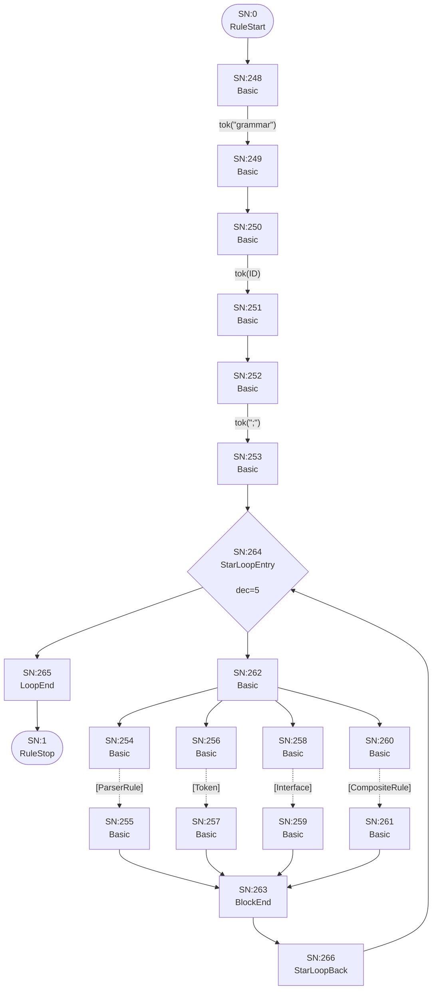

## Interface

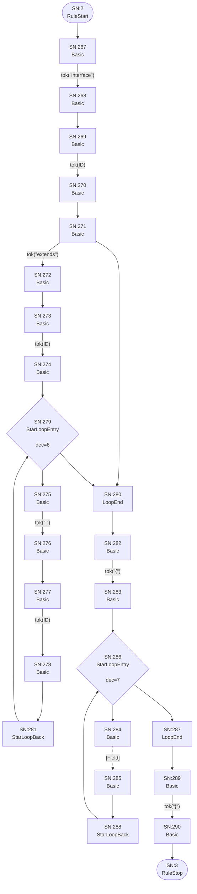

## Field

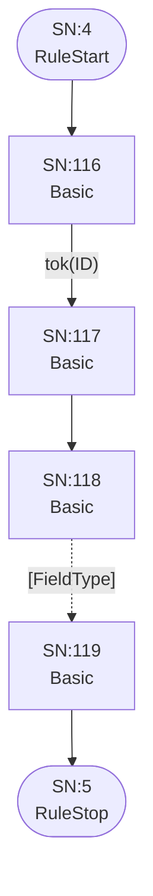

## FieldType

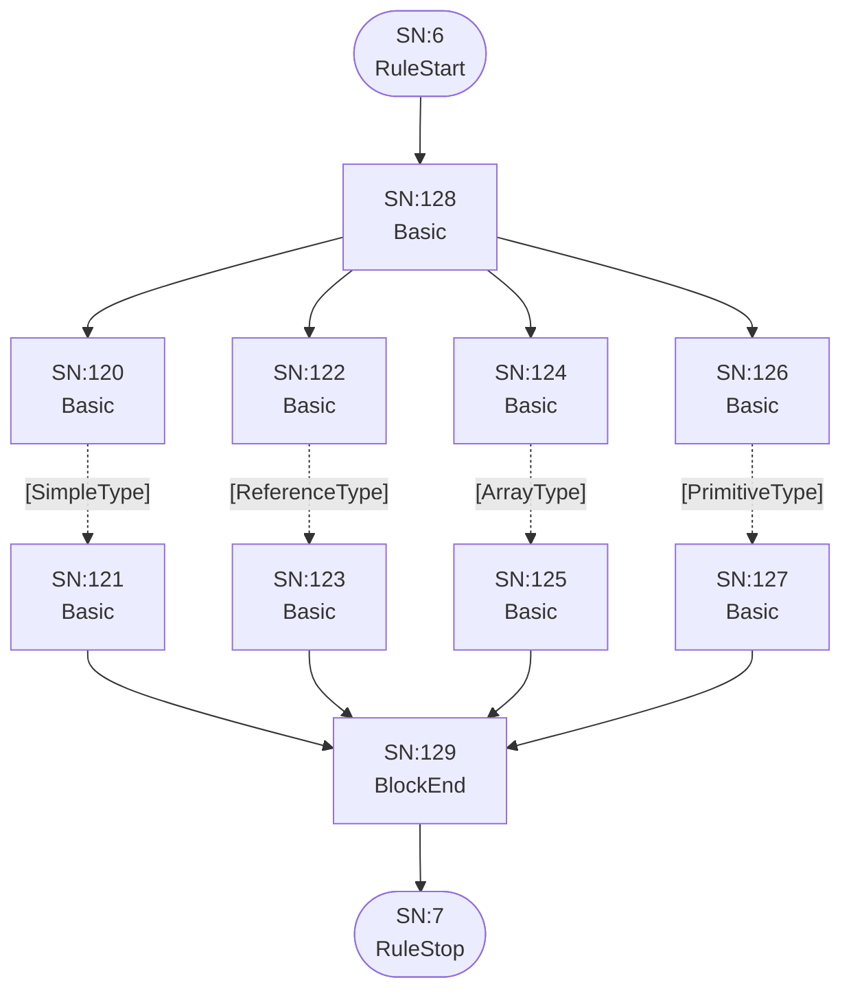

## ArrayType

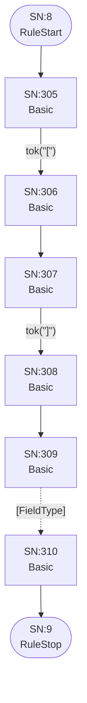

## ReferenceType

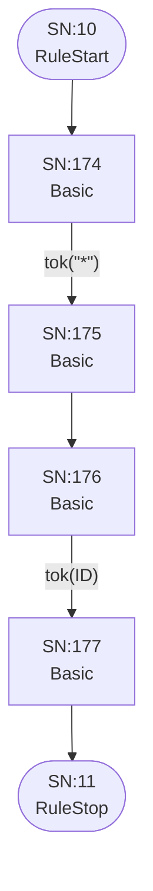

## SimpleType

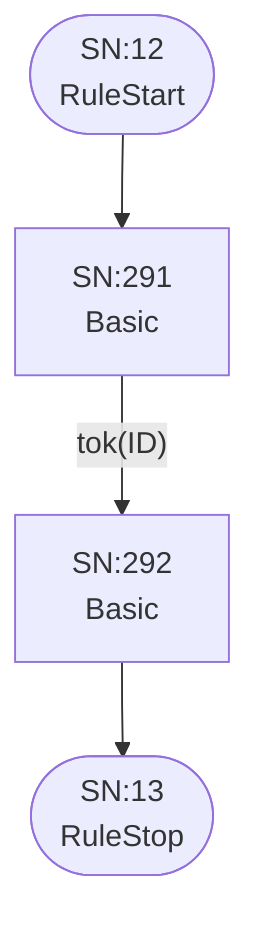

## PrimitiveType

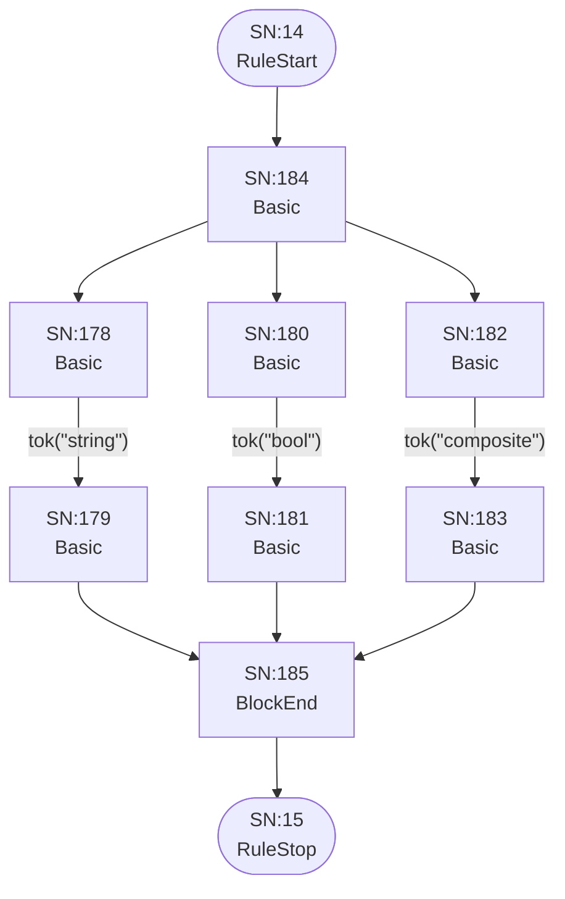

## ParserRule

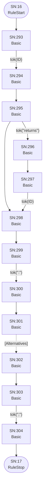

## Token

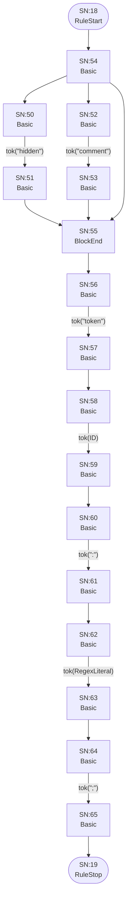

## Alternatives

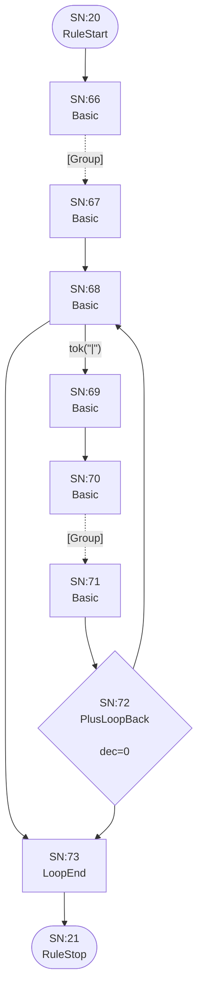

## Group

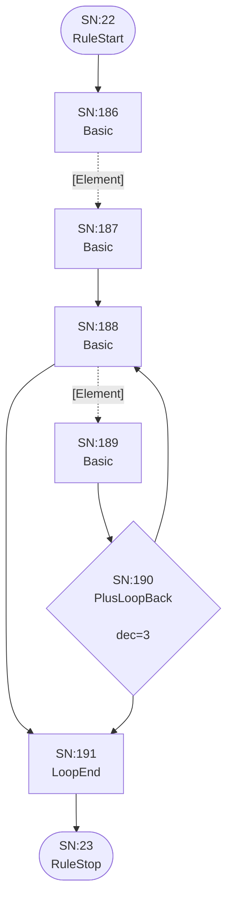

## Element

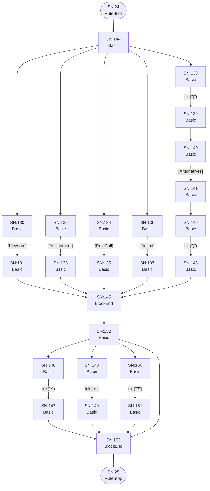

## Keyword

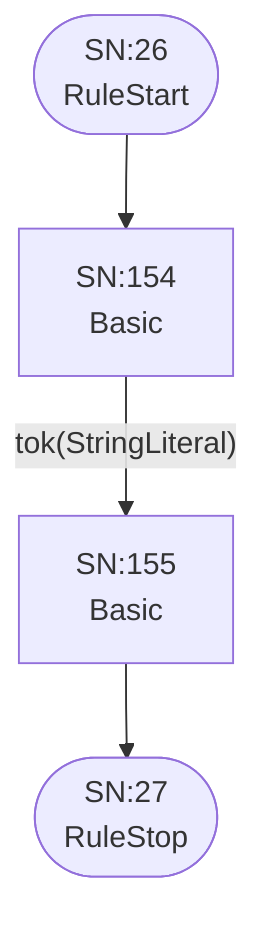

## Assignment

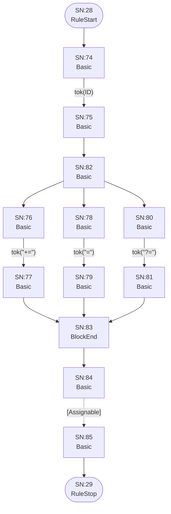

## Assignable

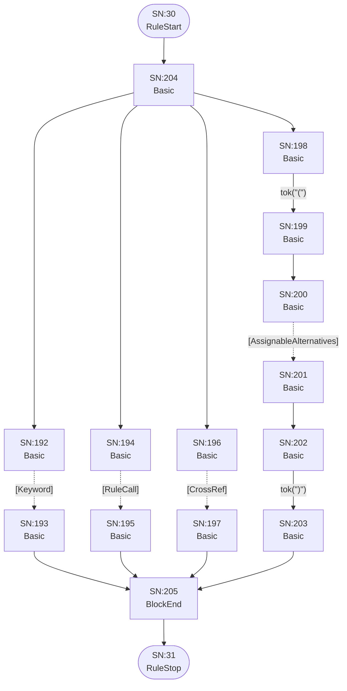

## AssignableWithoutAlts

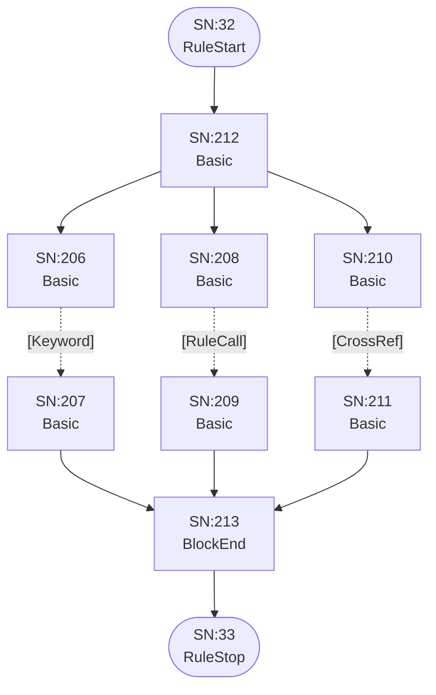

## AssignableAlternatives

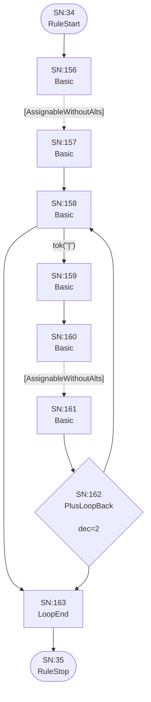

## CrossRef


## RuleCall

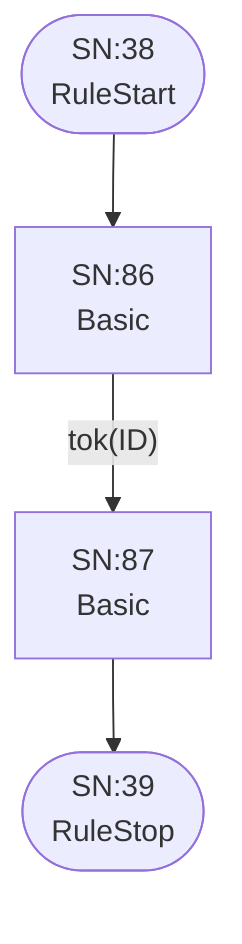

## Action

```mermaid
flowchart TD
    q40(["SN:40<br/>RuleStart"])
    q41(["SN:41<br/>RuleStop"])
    q224["SN:224<br/>Basic<br/>"]
    q225["SN:225<br/>Basic<br/>"]
    q226["SN:226<br/>Basic<br/>"]
    q227["SN:227<br/>Basic<br/>"]
    q228["SN:228<br/>Basic<br/>"]
    q229["SN:229<br/>Basic<br/>"]
    q230["SN:230<br/>Basic<br/>"]
    q231["SN:231<br/>Basic<br/>"]
    q232["SN:232<br/>Basic<br/>"]
    q233["SN:233<br/>Basic<br/>"]
    q234["SN:234<br/>Basic<br/>"]
    q235["SN:235<br/>Basic<br/>"]
    q236["SN:236<br/>Basic<br/>"]
    q237["SN:237<br/>BlockEnd<br/>"]
    q238["SN:238<br/>Basic<br/>"]
    q239["SN:239<br/>Basic<br/>"]
    q240["SN:240<br/>Basic<br/>"]
    q241["SN:241<br/>Basic<br/>"]

    q40 --> q224
    q224 -->|"tok(&quot;{&quot;)"| q225
    q225 --> q226
    q226 -->|"tok(ID)"| q227
    q227 --> q228
    q228 -->|"tok(&quot;.&quot;)"| q229
    q228 --> q239
    q229 --> q230
    q230 -->|"tok(ID)"| q231
    q231 --> q236
    q232 -->|"tok(&quot;+=&quot;)"| q233
    q233 --> q237
    q234 -->|"tok(&quot;=&quot;)"| q235
    q235 --> q237
    q236 --> q232
    q236 --> q234
    q237 --> q238
    q238 -->|"tok(&quot;current&quot;)"| q239
    q239 --> q240
    q240 -->|"tok(&quot;}&quot;)"| q241
    q241 --> q41
```

## CompositeRule

```mermaid
flowchart TD
    q42(["SN:42<br/>RuleStart"])
    q43(["SN:43<br/>RuleStop"])
    q164["SN:164<br/>Basic<br/>"]
    q165["SN:165<br/>Basic<br/>"]
    q166["SN:166<br/>Basic<br/>"]
    q167["SN:167<br/>Basic<br/>"]
    q168["SN:168<br/>Basic<br/>"]
    q169["SN:169<br/>Basic<br/>"]
    q170["SN:170<br/>Basic<br/>"]
    q171["SN:171<br/>Basic<br/>"]
    q172["SN:172<br/>Basic<br/>"]
    q173["SN:173<br/>Basic<br/>"]

    q42 --> q164
    q164 -->|"tok(&quot;composite&quot;)"| q165
    q165 --> q166
    q166 -->|"tok(ID)"| q167
    q167 --> q168
    q168 -->|"tok(&quot;:&quot;)"| q169
    q169 --> q170
    q170 -.->|"[CompositeAlternatives]"| q171
    q171 --> q172
    q172 -->|"tok(&quot;;&quot;)"| q173
    q173 --> q43
```

## CompositeAlternatives

```mermaid
flowchart TD
    q44(["SN:44<br/>RuleStart"])
    q45(["SN:45<br/>RuleStop"])
    q88["SN:88<br/>Basic<br/>"]
    q89["SN:89<br/>Basic<br/>"]
    q90["SN:90<br/>Basic<br/>"]
    q91["SN:91<br/>Basic<br/>"]
    q92["SN:92<br/>Basic<br/>"]
    q93["SN:93<br/>Basic<br/>"]
    q94{"SN:94<br/>PlusLoopBack<br/><br/>dec=1"}
    q95["SN:95<br/>LoopEnd<br/>"]

    q44 --> q88
    q88 -.->|"[CompositeGroup]"| q89
    q89 --> q90
    q90 -->|"tok(&quot;|&quot;)"| q91
    q90 --> q95
    q91 --> q92
    q92 -.->|"[CompositeGroup]"| q93
    q93 --> q94
    q94 --> q90
    q94 --> q95
    q95 --> q45
```

## CompositeGroup

```mermaid
flowchart TD
    q46(["SN:46<br/>RuleStart"])
    q47(["SN:47<br/>RuleStop"])
    q242["SN:242<br/>Basic<br/>"]
    q243["SN:243<br/>Basic<br/>"]
    q244["SN:244<br/>Basic<br/>"]
    q245["SN:245<br/>Basic<br/>"]
    q246{"SN:246<br/>PlusLoopBack<br/><br/>dec=4"}
    q247["SN:247<br/>LoopEnd<br/>"]

    q46 --> q242
    q242 -.->|"[CompositeElement]"| q243
    q243 --> q244
    q244 -.->|"[CompositeElement]"| q245
    q244 --> q247
    q245 --> q246
    q246 --> q244
    q246 --> q247
    q247 --> q47
```

## CompositeElement

```mermaid
flowchart TD
    q48(["SN:48<br/>RuleStart"])
    q49(["SN:49<br/>RuleStop"])
    q96["SN:96<br/>Basic<br/>"]
    q97["SN:97<br/>Basic<br/>"]
    q98["SN:98<br/>Basic<br/>"]
    q99["SN:99<br/>Basic<br/>"]
    q100["SN:100<br/>Basic<br/>"]
    q101["SN:101<br/>Basic<br/>"]
    q102["SN:102<br/>Basic<br/>"]
    q103["SN:103<br/>Basic<br/>"]
    q104["SN:104<br/>Basic<br/>"]
    q105["SN:105<br/>Basic<br/>"]
    q106["SN:106<br/>Basic<br/>"]
    q107["SN:107<br/>BlockEnd<br/>"]
    q108["SN:108<br/>Basic<br/>"]
    q109["SN:109<br/>Basic<br/>"]
    q110["SN:110<br/>Basic<br/>"]
    q111["SN:111<br/>Basic<br/>"]
    q112["SN:112<br/>Basic<br/>"]
    q113["SN:113<br/>Basic<br/>"]
    q114["SN:114<br/>Basic<br/>"]
    q115["SN:115<br/>BlockEnd<br/>"]

    q48 --> q106
    q96 -.->|"[Keyword]"| q97
    q97 --> q107
    q98 -.->|"[RuleCall]"| q99
    q99 --> q107
    q100 -->|"tok(&quot;(&quot;)"| q101
    q101 --> q102
    q102 -.->|"[CompositeAlternatives]"| q103
    q103 --> q104
    q104 -->|"tok(&quot;)&quot;)"| q105
    q105 --> q107
    q106 --> q96
    q106 --> q98
    q106 --> q100
    q107 --> q114
    q108 -->|"tok(&quot;*&quot;)"| q109
    q109 --> q115
    q110 -->|"tok(&quot;+&quot;)"| q111
    q111 --> q115
    q112 -->|"tok(&quot;?&quot;)"| q113
    q113 --> q115
    q114 --> q108
    q114 --> q110
    q114 --> q112
    q114 --> q115
    q115 --> q49
```

