# Runtime ATN for grammar

## Grammar

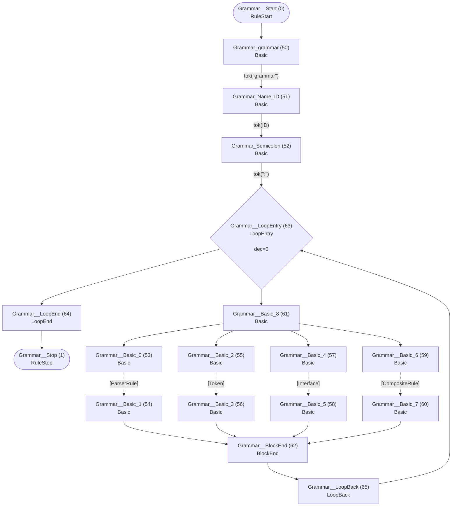

## Interface


## Field

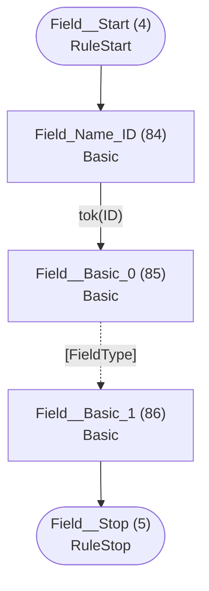

## FieldType

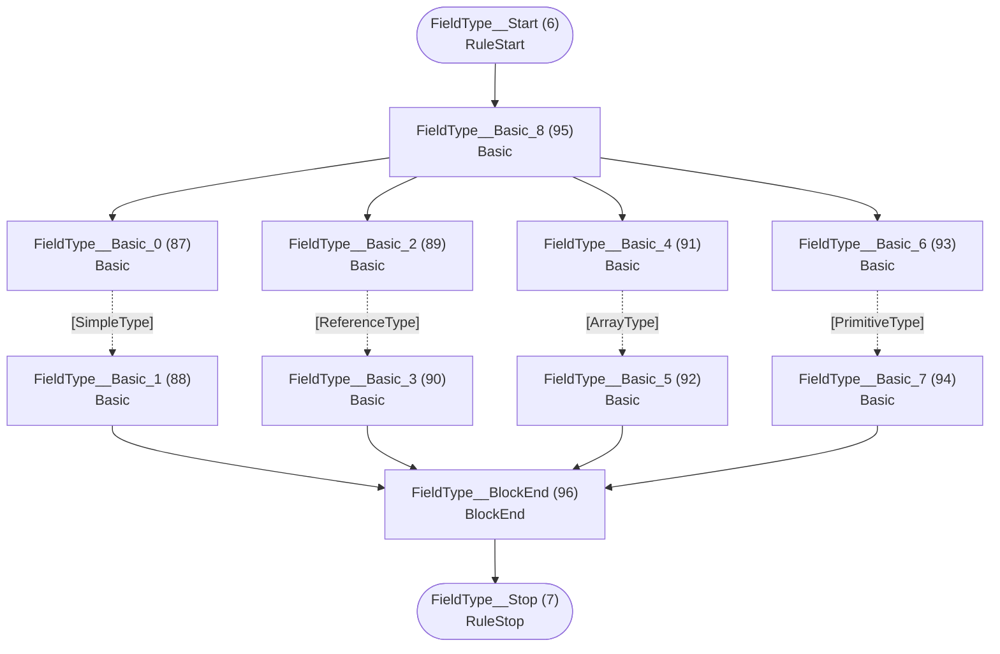

## ArrayType

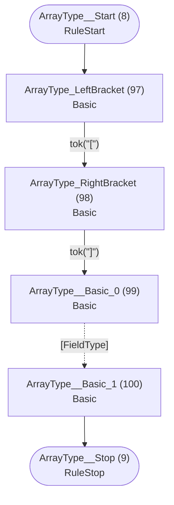

## ReferenceType


## SimpleType

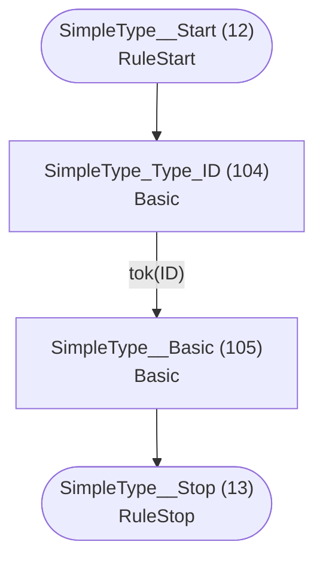

## PrimitiveType


## ParserRule

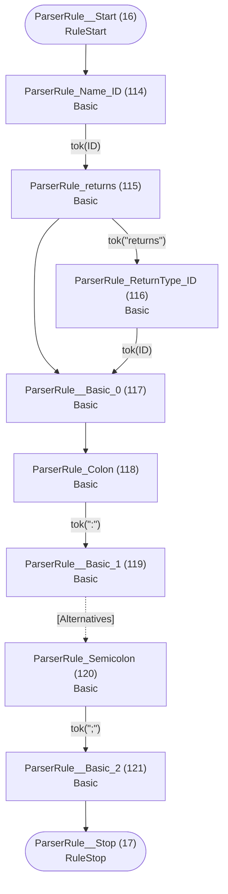

## Token

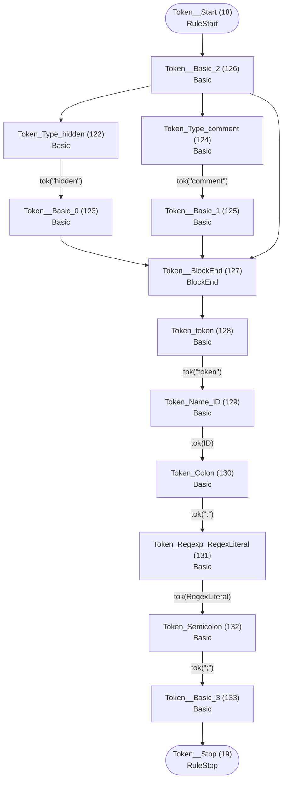

## Alternatives

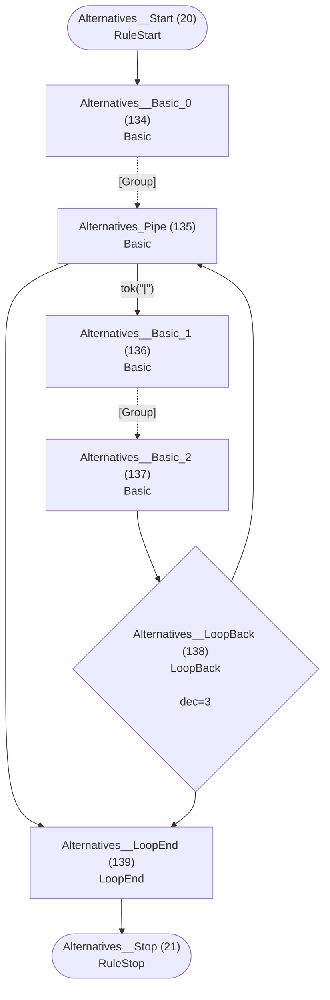

## Group

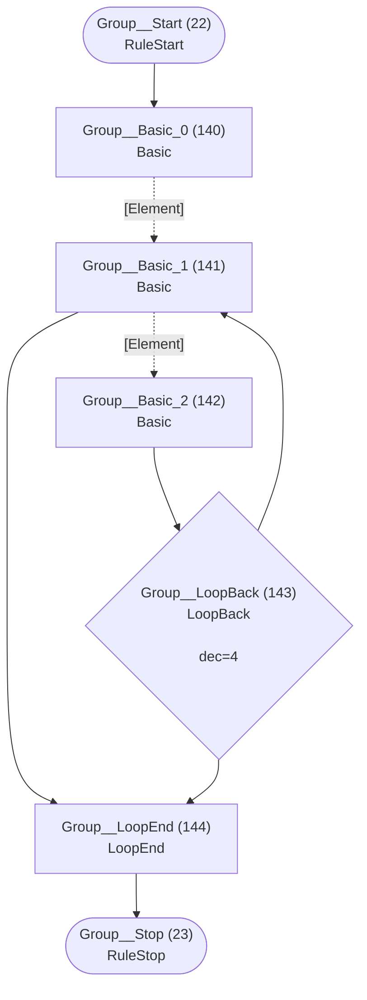

## Element

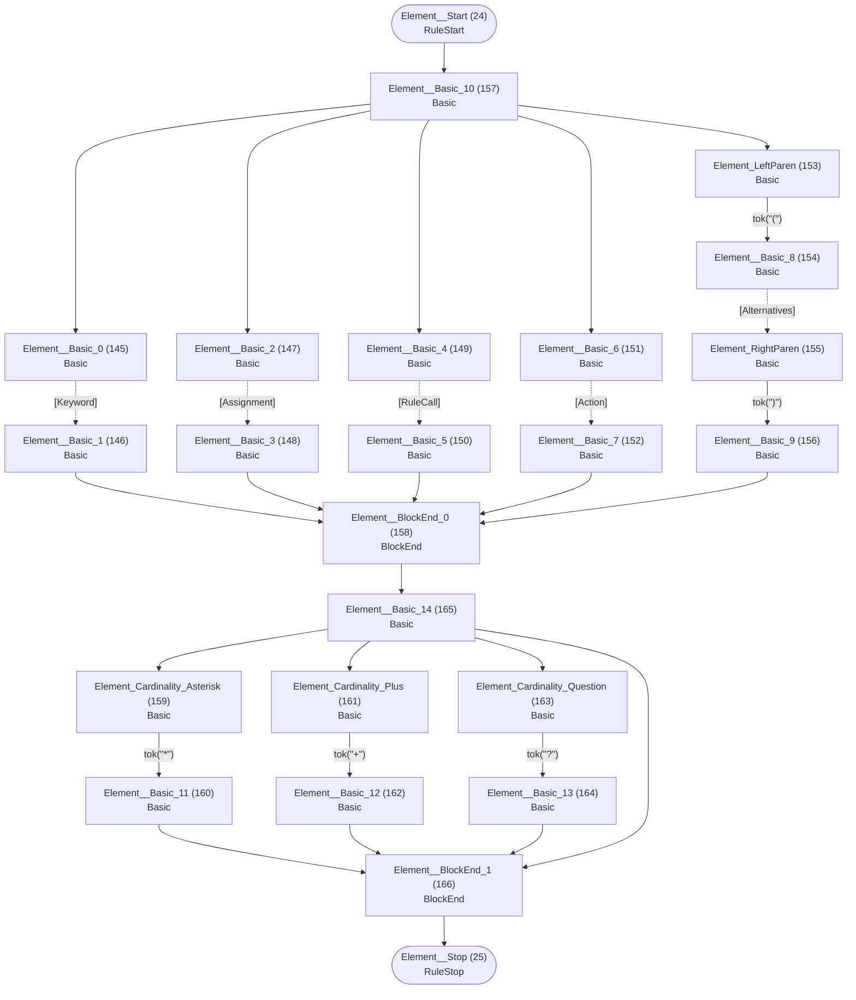

## Keyword

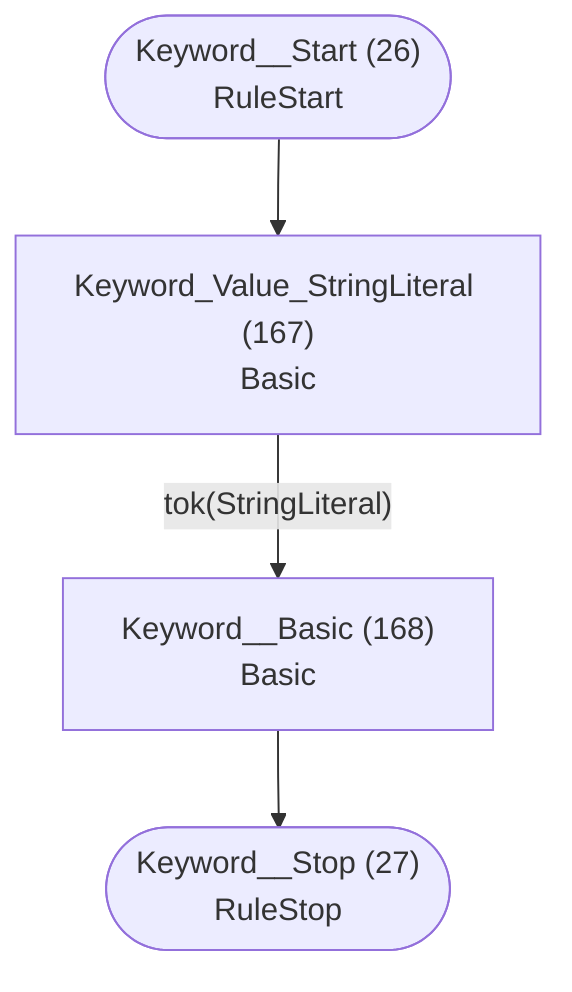

## Assignment


## Assignable


## AssignableWithoutAlts

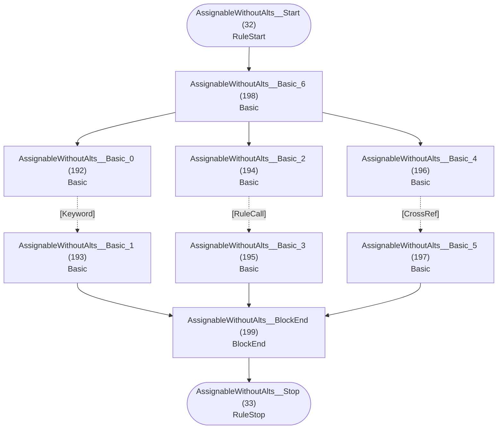

## AssignableAlternatives


## CrossRef

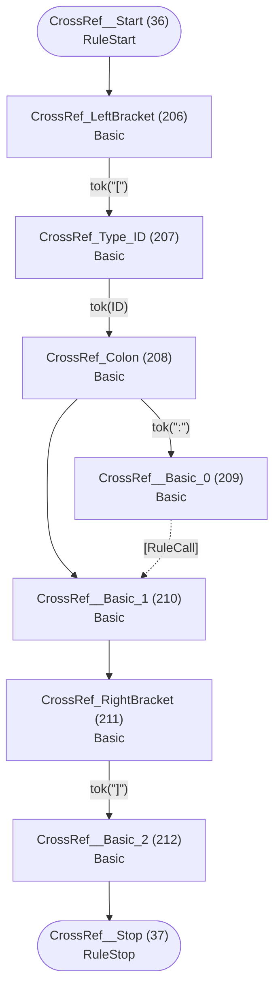

## RuleCall

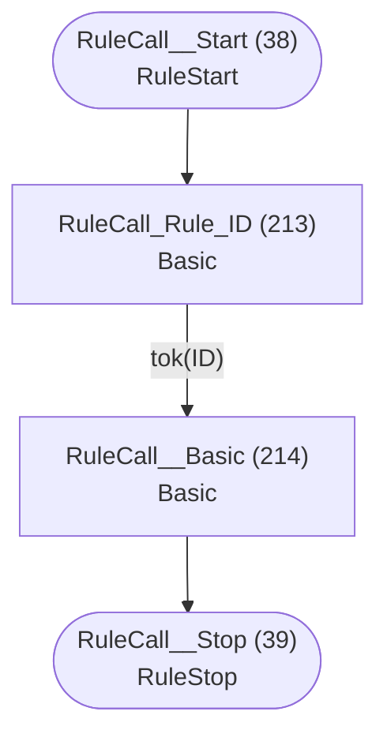

## Action

```mermaid
flowchart TD
    q40(["Action__Start (40)<br/>RuleStart"])
    q41(["Action__Stop (41)<br/>RuleStop"])
    q215["Action_LeftBrace (215)<br/>Basic<br/>"]
    q216["Action_Type_ID (216)<br/>Basic<br/>"]
    q217["Action_Dot (217)<br/>Basic<br/>"]
    q218["Action_Property_ID (218)<br/>Basic<br/>"]
    q219["Action_Operator_PlusEquals (219)<br/>Basic<br/>"]
    q220["Action__Basic_0 (220)<br/>Basic<br/>"]
    q221["Action_Operator_Equals (221)<br/>Basic<br/>"]
    q222["Action__Basic_1 (222)<br/>Basic<br/>"]
    q223["Action__Basic_2 (223)<br/>Basic<br/>"]
    q224["Action__BlockEnd (224)<br/>BlockEnd<br/>"]
    q225["Action_current (225)<br/>Basic<br/>"]
    q226["Action__Basic_3 (226)<br/>Basic<br/>"]
    q227["Action_RightBrace (227)<br/>Basic<br/>"]
    q228["Action__Basic_4 (228)<br/>Basic<br/>"]

    q40 --> q215
    q215 -->|"tok(&quot;{&quot;)"| q216
    q216 -->|"tok(ID)"| q217
    q217 -->|"tok(&quot;.&quot;)"| q218
    q217 --> q226
    q218 -->|"tok(ID)"| q223
    q219 -->|"tok(&quot;+=&quot;)"| q220
    q220 --> q224
    q221 -->|"tok(&quot;=&quot;)"| q222
    q222 --> q224
    q223 --> q219
    q223 --> q221
    q224 --> q225
    q225 -->|"tok(&quot;current&quot;)"| q226
    q226 --> q227
    q227 -->|"tok(&quot;}&quot;)"| q228
    q228 --> q41
```

## CompositeRule

```mermaid
flowchart TD
    q42(["CompositeRule__Start (42)<br/>RuleStart"])
    q43(["CompositeRule__Stop (43)<br/>RuleStop"])
    q229["CompositeRule_composite (229)<br/>Basic<br/>"]
    q230["CompositeRule_Name_ID (230)<br/>Basic<br/>"]
    q231["CompositeRule_Colon (231)<br/>Basic<br/>"]
    q232["CompositeRule__Basic_0 (232)<br/>Basic<br/>"]
    q233["CompositeRule_Semicolon (233)<br/>Basic<br/>"]
    q234["CompositeRule__Basic_1 (234)<br/>Basic<br/>"]

    q42 --> q229
    q229 -->|"tok(&quot;composite&quot;)"| q230
    q230 -->|"tok(ID)"| q231
    q231 -->|"tok(&quot;:&quot;)"| q232
    q232 -.->|"[CompositeAlternatives]"| q233
    q233 -->|"tok(&quot;;&quot;)"| q234
    q234 --> q43
```

## CompositeAlternatives

```mermaid
flowchart TD
    q44(["CompositeAlternatives__Start (44)<br/>RuleStart"])
    q45(["CompositeAlternatives__Stop (45)<br/>RuleStop"])
    q235["CompositeAlternatives__Basic_0 (235)<br/>Basic<br/>"]
    q236["CompositeAlternatives_Pipe (236)<br/>Basic<br/>"]
    q237["CompositeAlternatives__Basic_1 (237)<br/>Basic<br/>"]
    q238["CompositeAlternatives__Basic_2 (238)<br/>Basic<br/>"]
    q239{"CompositeAlternatives__LoopBack (239)<br/>LoopBack<br/><br/>dec=6"}
    q240["CompositeAlternatives__LoopEnd (240)<br/>LoopEnd<br/>"]

    q44 --> q235
    q235 -.->|"[CompositeGroup]"| q236
    q236 -->|"tok(&quot;|&quot;)"| q237
    q236 --> q240
    q237 -.->|"[CompositeGroup]"| q238
    q238 --> q239
    q239 --> q236
    q239 --> q240
    q240 --> q45
```

## CompositeGroup

```mermaid
flowchart TD
    q46(["CompositeGroup__Start (46)<br/>RuleStart"])
    q47(["CompositeGroup__Stop (47)<br/>RuleStop"])
    q241["CompositeGroup__Basic_0 (241)<br/>Basic<br/>"]
    q242["CompositeGroup__Basic_1 (242)<br/>Basic<br/>"]
    q243["CompositeGroup__Basic_2 (243)<br/>Basic<br/>"]
    q244{"CompositeGroup__LoopBack (244)<br/>LoopBack<br/><br/>dec=7"}
    q245["CompositeGroup__LoopEnd (245)<br/>LoopEnd<br/>"]

    q46 --> q241
    q241 -.->|"[CompositeElement]"| q242
    q242 -.->|"[CompositeElement]"| q243
    q242 --> q245
    q243 --> q244
    q244 --> q242
    q244 --> q245
    q245 --> q47
```

## CompositeElement

```mermaid
flowchart TD
    q48(["CompositeElement__Start (48)<br/>RuleStart"])
    q49(["CompositeElement__Stop (49)<br/>RuleStop"])
    q246["CompositeElement__Basic_0 (246)<br/>Basic<br/>"]
    q247["CompositeElement__Basic_1 (247)<br/>Basic<br/>"]
    q248["CompositeElement__Basic_2 (248)<br/>Basic<br/>"]
    q249["CompositeElement__Basic_3 (249)<br/>Basic<br/>"]
    q250["CompositeElement_LeftParen (250)<br/>Basic<br/>"]
    q251["CompositeElement__Basic_4 (251)<br/>Basic<br/>"]
    q252["CompositeElement_RightParen (252)<br/>Basic<br/>"]
    q253["CompositeElement__Basic_5 (253)<br/>Basic<br/>"]
    q254["CompositeElement__Basic_6 (254)<br/>Basic<br/>"]
    q255["CompositeElement__BlockEnd_0 (255)<br/>BlockEnd<br/>"]
    q256["CompositeElement_Cardinality_Asterisk (256)<br/>Basic<br/>"]
    q257["CompositeElement__Basic_7 (257)<br/>Basic<br/>"]
    q258["CompositeElement_Cardinality_Plus (258)<br/>Basic<br/>"]
    q259["CompositeElement__Basic_8 (259)<br/>Basic<br/>"]
    q260["CompositeElement_Cardinality_Question (260)<br/>Basic<br/>"]
    q261["CompositeElement__Basic_9 (261)<br/>Basic<br/>"]
    q262["CompositeElement__Basic_10 (262)<br/>Basic<br/>"]
    q263["CompositeElement__BlockEnd_1 (263)<br/>BlockEnd<br/>"]

    q48 --> q254
    q246 -.->|"[Keyword]"| q247
    q247 --> q255
    q248 -.->|"[RuleCall]"| q249
    q249 --> q255
    q250 -->|"tok(&quot;(&quot;)"| q251
    q251 -.->|"[CompositeAlternatives]"| q252
    q252 -->|"tok(&quot;)&quot;)"| q253
    q253 --> q255
    q254 --> q246
    q254 --> q248
    q254 --> q250
    q255 --> q262
    q256 -->|"tok(&quot;*&quot;)"| q257
    q257 --> q263
    q258 -->|"tok(&quot;+&quot;)"| q259
    q259 --> q263
    q260 -->|"tok(&quot;?&quot;)"| q261
    q261 --> q263
    q262 --> q256
    q262 --> q258
    q262 --> q260
    q262 --> q263
    q263 --> q49
```

