# Runtime ATN for grammar

## Grammar

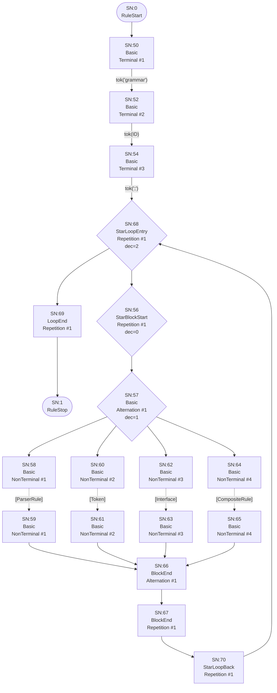

## Interface


## Field

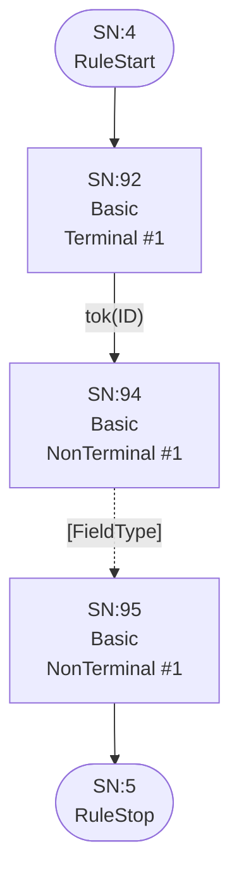

## FieldType

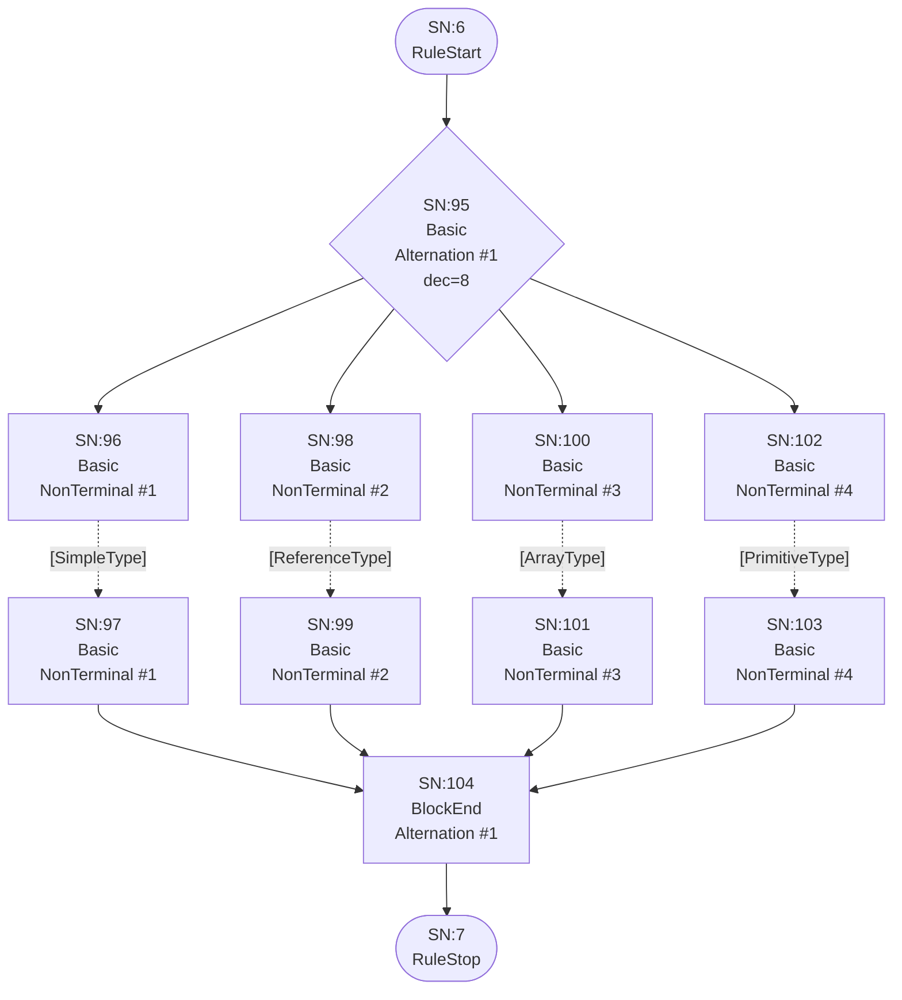

## ArrayType


## ReferenceType

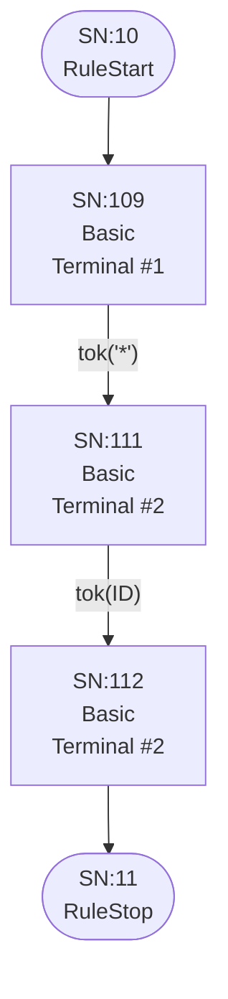

## SimpleType

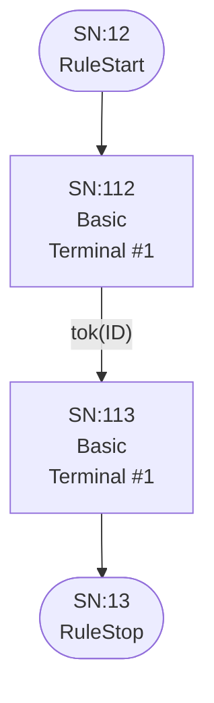

## PrimitiveType

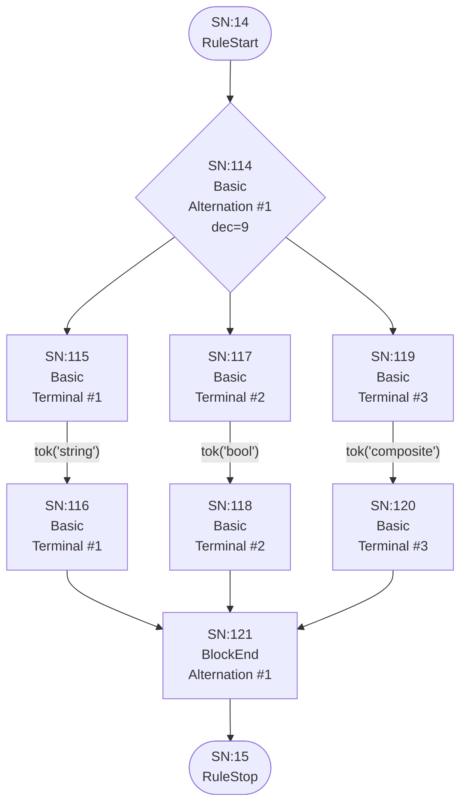

## ParserRule


## Token

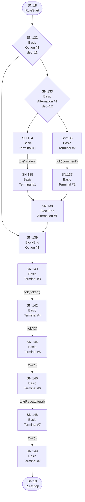

## Alternatives


## Group


## Element

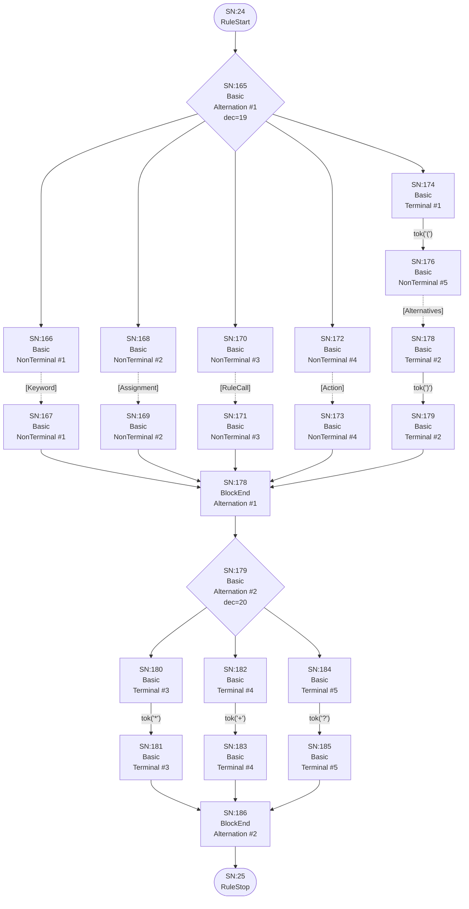

## Keyword

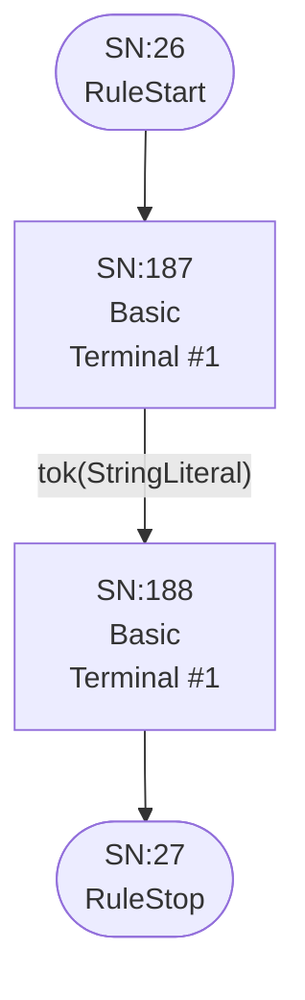

## Assignment

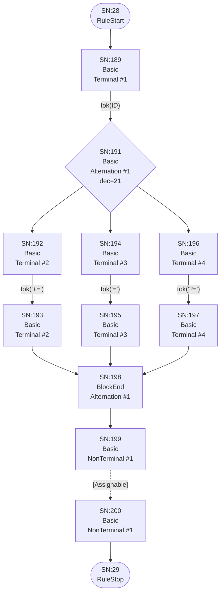

## Assignable

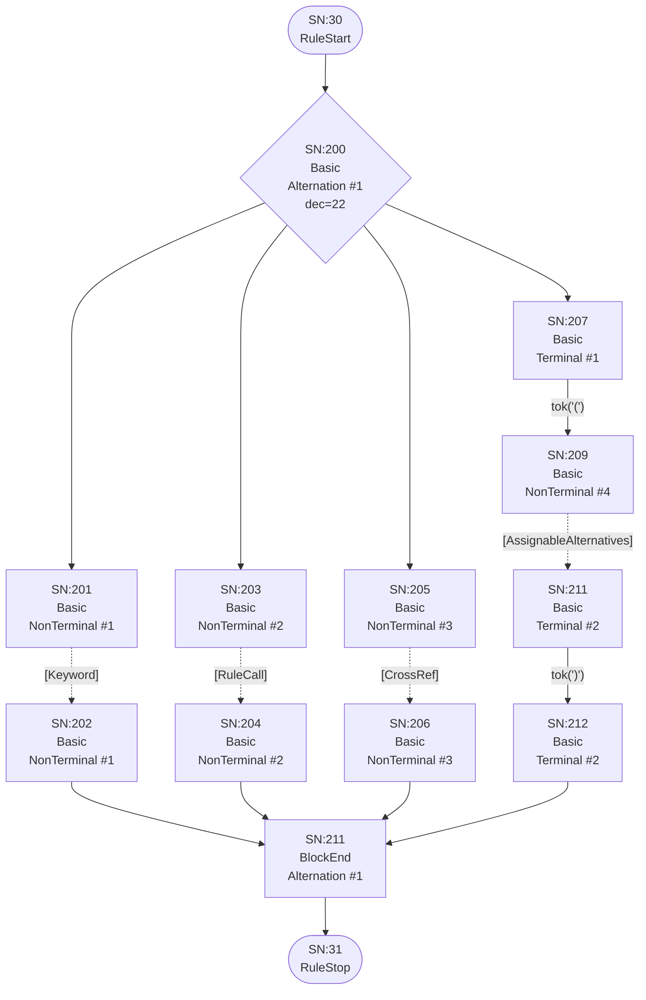

## AssignableWithoutAlts


## AssignableAlternatives

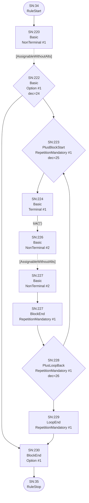

## CrossRef

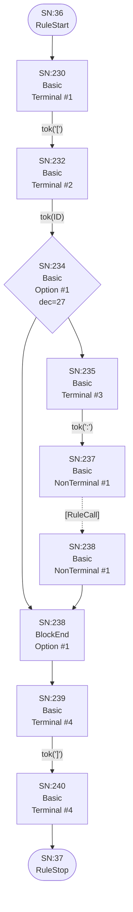

## RuleCall

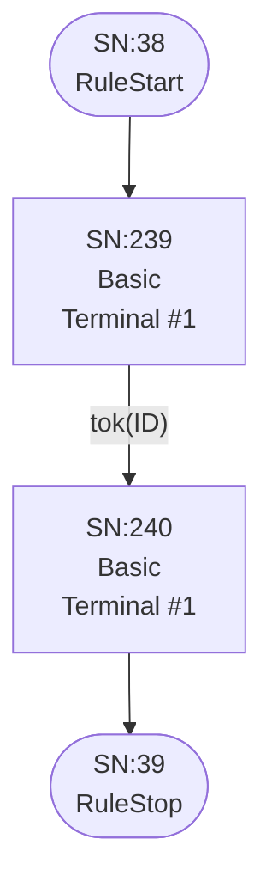

## Action

```mermaid
flowchart TD
    q40(["SN:40<br/>RuleStart"])
    q41(["SN:41<br/>RuleStop"])
    q241["SN:241<br/>Basic<br/>Terminal #1"]
    q242["SN:243<br/>Basic<br/>Terminal #2"]
    q243{"SN:245<br/>Basic<br/>Option #1<br/>dec=28"}
    q244["SN:246<br/>Basic<br/>Terminal #3"]
    q245["SN:248<br/>Basic<br/>Terminal #4"]
    q246{"SN:250<br/>Basic<br/>Alternation #1<br/>dec=29"}
    q247["SN:251<br/>Basic<br/>Terminal #5"]
    q248["SN:252<br/>Basic<br/>Terminal #5"]
    q249["SN:253<br/>Basic<br/>Terminal #6"]
    q250["SN:254<br/>Basic<br/>Terminal #6"]
    q251["SN:255<br/>BlockEnd<br/>Alternation #1"]
    q252["SN:256<br/>Basic<br/>Terminal #7"]
    q253["SN:257<br/>Basic<br/>Terminal #7"]
    q254["SN:256<br/>BlockEnd<br/>Option #1"]
    q255["SN:257<br/>Basic<br/>Terminal #8"]
    q256["SN:258<br/>Basic<br/>Terminal #8"]

    q40 --> q241
    q241 -->|"tok('{')"| q242
    q242 -->|"tok(ID)"| q243
    q243 --> q244
    q243 --> q254
    q244 -->|"tok('.')"| q245
    q245 -->|"tok(ID)"| q246
    q246 --> q247
    q246 --> q249
    q247 -->|"tok('+=')"| q248
    q248 --> q251
    q249 -->|"tok('=')"| q250
    q250 --> q251
    q251 --> q252
    q252 -->|"tok('current')"| q253
    q253 --> q254
    q254 --> q255
    q255 -->|"tok('}')"| q256
    q256 --> q41
```

## CompositeRule

```mermaid
flowchart TD
    q42(["SN:42<br/>RuleStart"])
    q43(["SN:43<br/>RuleStop"])
    q257["SN:257<br/>Basic<br/>Terminal #1"]
    q258["SN:259<br/>Basic<br/>Terminal #2"]
    q259["SN:261<br/>Basic<br/>Terminal #3"]
    q260["SN:263<br/>Basic<br/>NonTerminal #1"]
    q261["SN:265<br/>Basic<br/>Terminal #4"]
    q262["SN:266<br/>Basic<br/>Terminal #4"]

    q42 --> q257
    q257 -->|"tok('composite')"| q258
    q258 -->|"tok(ID)"| q259
    q259 -->|"tok(':')"| q260
    q260 -.->|"[CompositeAlternatives]"| q261
    q261 -->|"tok(';')"| q262
    q262 --> q43
```

## CompositeAlternatives

```mermaid
flowchart TD
    q44(["SN:44<br/>RuleStart"])
    q45(["SN:45<br/>RuleStop"])
    q263["SN:263<br/>Basic<br/>NonTerminal #1"]
    q264{"SN:265<br/>Basic<br/>Option #1<br/>dec=30"}
    q265{"SN:266<br/>PlusBlockStart<br/>RepetitionMandatory #1<br/>dec=31"}
    q266["SN:267<br/>Basic<br/>Terminal #1"]
    q267["SN:269<br/>Basic<br/>NonTerminal #2"]
    q268["SN:270<br/>Basic<br/>NonTerminal #2"]
    q269["SN:270<br/>BlockEnd<br/>RepetitionMandatory #1"]
    q270{"SN:271<br/>PlusLoopBack<br/>RepetitionMandatory #1<br/>dec=32"}
    q271["SN:272<br/>LoopEnd<br/>RepetitionMandatory #1"]
    q272["SN:273<br/>BlockEnd<br/>Option #1"]

    q44 --> q263
    q263 -.->|"[CompositeGroup]"| q264
    q264 --> q265
    q264 --> q272
    q265 --> q266
    q266 -->|"tok('|')"| q267
    q267 -.->|"[CompositeGroup]"| q268
    q268 --> q269
    q269 --> q270
    q270 --> q265
    q270 --> q271
    q271 --> q272
    q272 --> q45
```

## CompositeGroup

```mermaid
flowchart TD
    q46(["SN:46<br/>RuleStart"])
    q47(["SN:47<br/>RuleStop"])
    q273["SN:273<br/>Basic<br/>NonTerminal #1"]
    q274{"SN:275<br/>Basic<br/>Option #1<br/>dec=33"}
    q275{"SN:276<br/>PlusBlockStart<br/>RepetitionMandatory #1<br/>dec=34"}
    q276["SN:277<br/>Basic<br/>NonTerminal #2"]
    q277["SN:278<br/>Basic<br/>NonTerminal #2"]
    q278["SN:279<br/>BlockEnd<br/>RepetitionMandatory #1"]
    q279{"SN:280<br/>PlusLoopBack<br/>RepetitionMandatory #1<br/>dec=35"}
    q280["SN:281<br/>LoopEnd<br/>RepetitionMandatory #1"]
    q281["SN:282<br/>BlockEnd<br/>Option #1"]

    q46 --> q273
    q273 -.->|"[CompositeElement]"| q274
    q274 --> q275
    q274 --> q281
    q275 --> q276
    q276 -.->|"[CompositeElement]"| q277
    q277 --> q278
    q278 --> q279
    q279 --> q275
    q279 --> q280
    q280 --> q281
    q281 --> q47
```

## CompositeElement

```mermaid
flowchart TD
    q48(["SN:48<br/>RuleStart"])
    q49(["SN:49<br/>RuleStop"])
    q282{"SN:282<br/>Basic<br/>Alternation #1<br/>dec=36"}
    q283["SN:283<br/>Basic<br/>NonTerminal #1"]
    q284["SN:284<br/>Basic<br/>NonTerminal #1"]
    q285["SN:285<br/>Basic<br/>NonTerminal #2"]
    q286["SN:286<br/>Basic<br/>NonTerminal #2"]
    q287["SN:287<br/>Basic<br/>Terminal #1"]
    q288["SN:289<br/>Basic<br/>NonTerminal #3"]
    q289["SN:291<br/>Basic<br/>Terminal #2"]
    q290["SN:292<br/>Basic<br/>Terminal #2"]
    q291["SN:291<br/>BlockEnd<br/>Alternation #1"]
    q292{"SN:292<br/>Basic<br/>Alternation #2<br/>dec=37"}
    q293["SN:293<br/>Basic<br/>Terminal #3"]
    q294["SN:294<br/>Basic<br/>Terminal #3"]
    q295["SN:295<br/>Basic<br/>Terminal #4"]
    q296["SN:296<br/>Basic<br/>Terminal #4"]
    q297["SN:297<br/>Basic<br/>Terminal #5"]
    q298["SN:298<br/>Basic<br/>Terminal #5"]
    q299["SN:299<br/>BlockEnd<br/>Alternation #2"]

    q48 --> q282
    q282 --> q283
    q282 --> q285
    q282 --> q287
    q283 -.->|"[Keyword]"| q284
    q284 --> q291
    q285 -.->|"[RuleCall]"| q286
    q286 --> q291
    q287 -->|"tok('(')"| q288
    q288 -.->|"[CompositeAlternatives]"| q289
    q289 -->|"tok(')')"| q290
    q290 --> q291
    q291 --> q292
    q292 --> q293
    q292 --> q295
    q292 --> q297
    q293 -->|"tok('*')"| q294
    q294 --> q299
    q295 -->|"tok('+')"| q296
    q296 --> q299
    q297 -->|"tok('?')"| q298
    q298 --> q299
    q299 --> q49
```

