# Runtime ATN for grammar

## Grammar

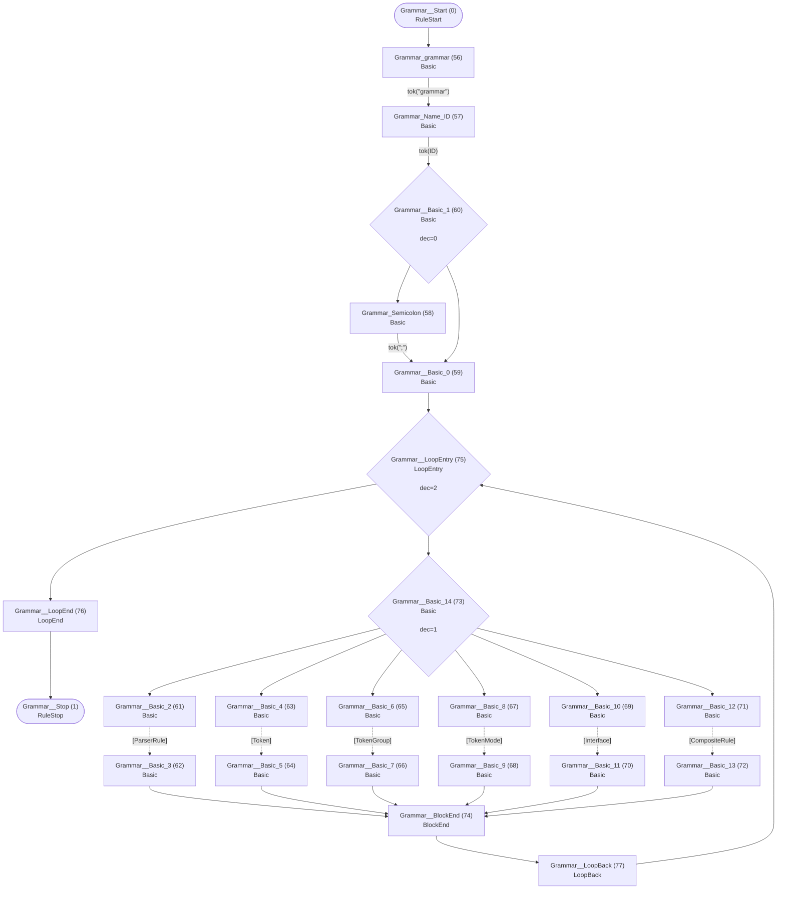

## Interface

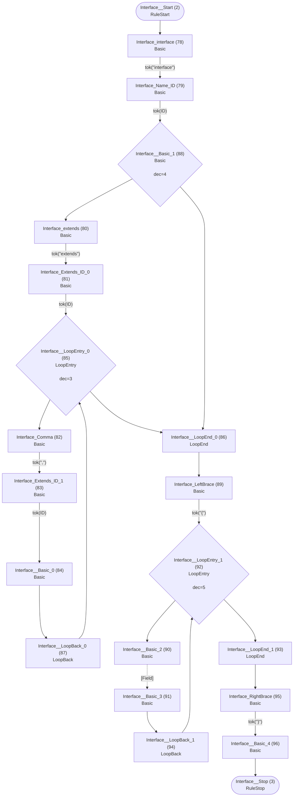

## Field

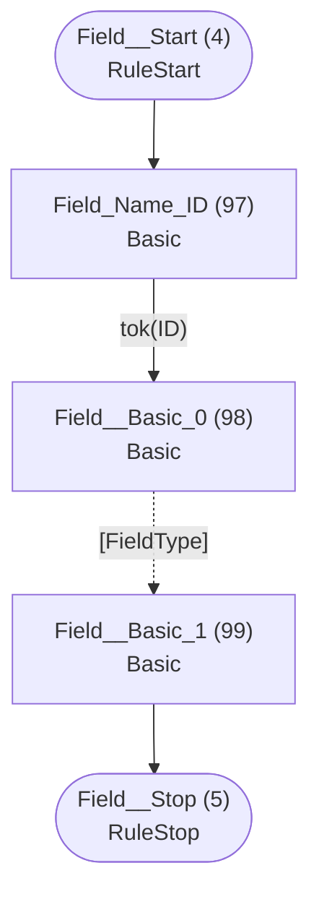

## FieldType

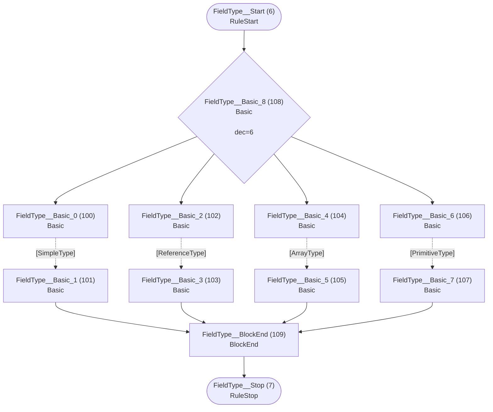

## ArrayType

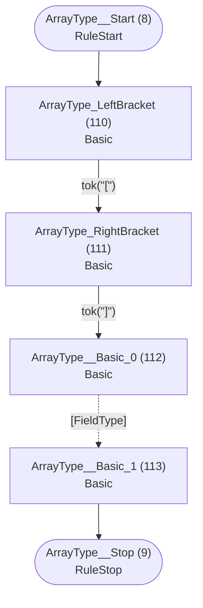

## ReferenceType

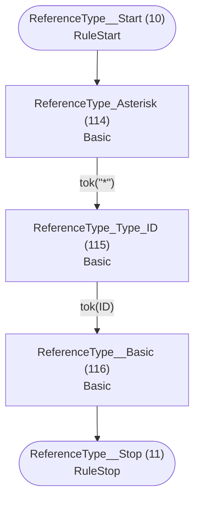

## SimpleType

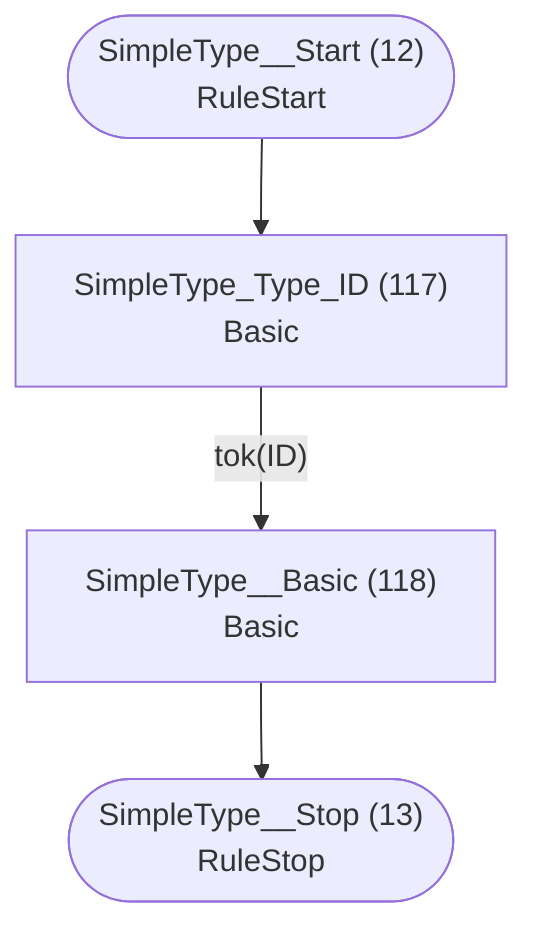

## PrimitiveType

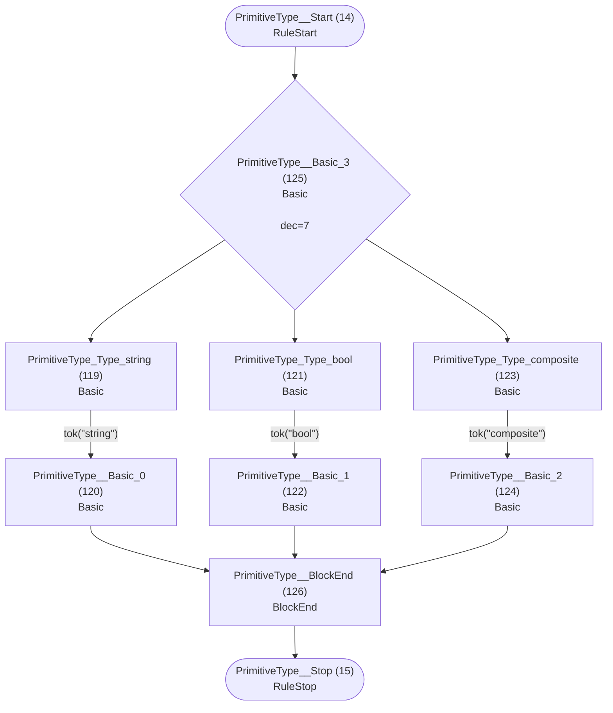

## ParserRule

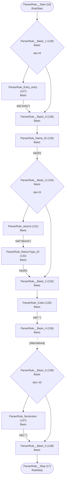

## Token

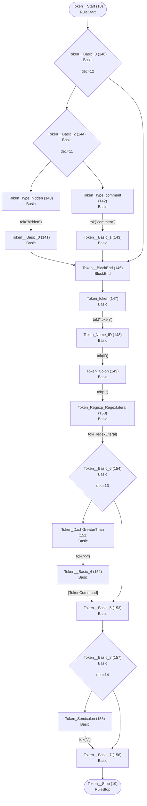

## TokenCommand

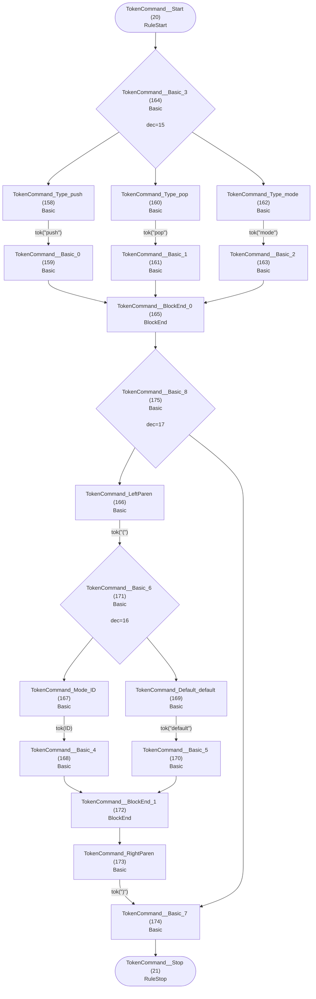

## TokenGroup

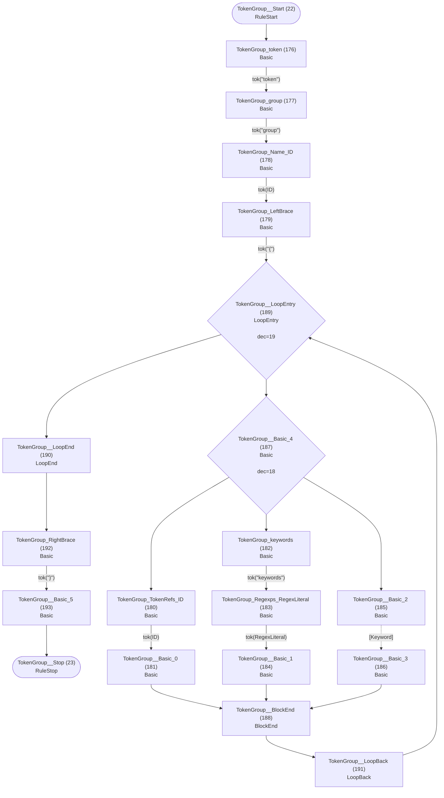

## TokenMode

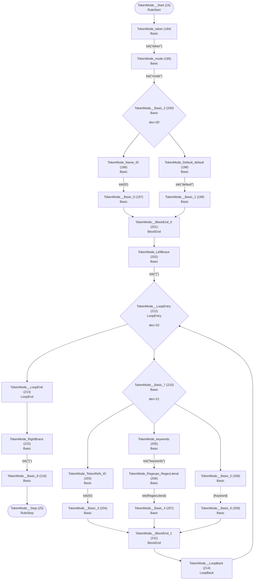

## Alternatives


## Group

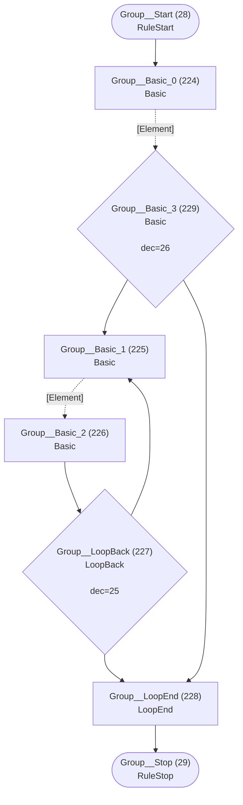

## Element


## Keyword

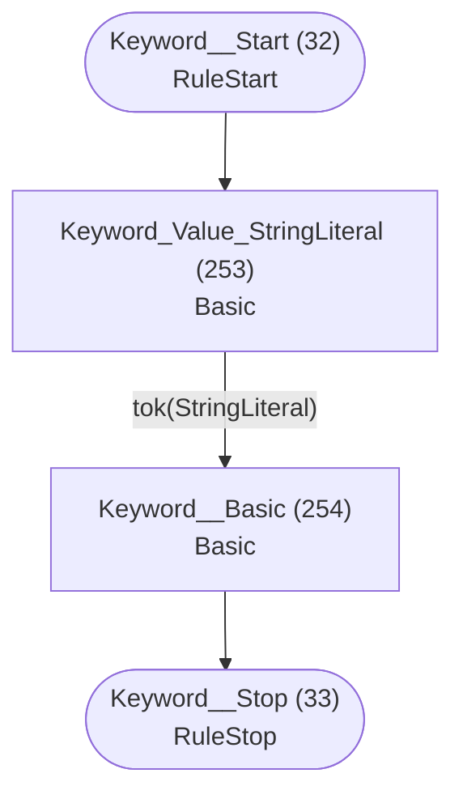

## Assignment


## Assignable


## AssignableWithoutAlts


## AssignableAlternatives

```mermaid
flowchart TD
    q40(["AssignableAlternatives__Start (40)<br/>RuleStart"])
    q41(["AssignableAlternatives__Stop (41)<br/>RuleStop"])
    q286["AssignableAlternatives__Basic_0 (286)<br/>Basic<br/>"]
    q287["AssignableAlternatives_Pipe (287)<br/>Basic<br/>"]
    q288["AssignableAlternatives__Basic_1 (288)<br/>Basic<br/>"]
    q289["AssignableAlternatives__Basic_2 (289)<br/>Basic<br/>"]
    q290{"AssignableAlternatives__LoopBack (290)<br/>LoopBack<br/><br/>dec=33"}
    q291["AssignableAlternatives__LoopEnd (291)<br/>LoopEnd<br/>"]
    q292{"AssignableAlternatives__Basic_3 (292)<br/>Basic<br/><br/>dec=34"}

    q40 --> q286
    q286 -.->|"[AssignableWithoutAlts]"| q292
    q287 -->|"tok(&quot;|&quot;)"| q288
    q288 -.->|"[AssignableWithoutAlts]"| q289
    q289 --> q290
    q290 --> q287
    q290 --> q291
    q291 --> q41
    q292 --> q287
    q292 --> q291
```

## CrossRef

```mermaid
flowchart TD
    q42(["CrossRef__Start (42)<br/>RuleStart"])
    q43(["CrossRef__Stop (43)<br/>RuleStop"])
    q293["CrossRef_LeftBracket (293)<br/>Basic<br/>"]
    q294["CrossRef_Type_ID (294)<br/>Basic<br/>"]
    q295["CrossRef_Colon (295)<br/>Basic<br/>"]
    q296["CrossRef__Basic_0 (296)<br/>Basic<br/>"]
    q297["CrossRef__Basic_1 (297)<br/>Basic<br/>"]
    q298{"CrossRef__Basic_2 (298)<br/>Basic<br/><br/>dec=35"}
    q299["CrossRef_RightBracket (299)<br/>Basic<br/>"]
    q300["CrossRef__Basic_3 (300)<br/>Basic<br/>"]

    q42 --> q293
    q293 -->|"tok(&quot;[&quot;)"| q294
    q294 -->|"tok(ID)"| q298
    q295 -->|"tok(&quot;:&quot;)"| q296
    q296 -.->|"[RuleCall]"| q297
    q297 --> q299
    q298 --> q295
    q298 --> q297
    q299 -->|"tok(&quot;]&quot;)"| q300
    q300 --> q43
```

## RuleCall

```mermaid
flowchart TD
    q44(["RuleCall__Start (44)<br/>RuleStart"])
    q45(["RuleCall__Stop (45)<br/>RuleStop"])
    q301["RuleCall_Rule_ID (301)<br/>Basic<br/>"]
    q302["RuleCall__Basic (302)<br/>Basic<br/>"]

    q44 --> q301
    q301 -->|"tok(ID)"| q302
    q302 --> q45
```

## Action

```mermaid
flowchart TD
    q46(["Action__Start (46)<br/>RuleStart"])
    q47(["Action__Stop (47)<br/>RuleStop"])
    q303["Action_LeftBrace (303)<br/>Basic<br/>"]
    q304["Action_Type_ID (304)<br/>Basic<br/>"]
    q305["Action_Dot (305)<br/>Basic<br/>"]
    q306["Action_Property_ID (306)<br/>Basic<br/>"]
    q307["Action_Operator_PlusEquals (307)<br/>Basic<br/>"]
    q308["Action__Basic_0 (308)<br/>Basic<br/>"]
    q309["Action_Operator_Equals (309)<br/>Basic<br/>"]
    q310["Action__Basic_1 (310)<br/>Basic<br/>"]
    q311{"Action__Basic_2 (311)<br/>Basic<br/><br/>dec=36"}
    q312["Action__BlockEnd (312)<br/>BlockEnd<br/>"]
    q313["Action_current (313)<br/>Basic<br/>"]
    q314["Action__Basic_3 (314)<br/>Basic<br/>"]
    q315{"Action__Basic_4 (315)<br/>Basic<br/><br/>dec=37"}
    q316["Action_RightBrace (316)<br/>Basic<br/>"]
    q317["Action__Basic_5 (317)<br/>Basic<br/>"]

    q46 --> q303
    q303 -->|"tok(&quot;{&quot;)"| q304
    q304 -->|"tok(ID)"| q315
    q305 -->|"tok(&quot;.&quot;)"| q306
    q306 -->|"tok(ID)"| q311
    q307 -->|"tok(&quot;+=&quot;)"| q308
    q308 --> q312
    q309 -->|"tok(&quot;=&quot;)"| q310
    q310 --> q312
    q311 --> q307
    q311 --> q309
    q312 --> q313
    q313 -->|"tok(&quot;current&quot;)"| q314
    q314 --> q316
    q315 --> q305
    q315 --> q314
    q316 -->|"tok(&quot;}&quot;)"| q317
    q317 --> q47
```

## CompositeRule

```mermaid
flowchart TD
    q48(["CompositeRule__Start (48)<br/>RuleStart"])
    q49(["CompositeRule__Stop (49)<br/>RuleStop"])
    q318["CompositeRule_composite (318)<br/>Basic<br/>"]
    q319["CompositeRule_Name_ID (319)<br/>Basic<br/>"]
    q320["CompositeRule_Colon (320)<br/>Basic<br/>"]
    q321["CompositeRule__Basic_0 (321)<br/>Basic<br/>"]
    q322["CompositeRule_Semicolon (322)<br/>Basic<br/>"]
    q323["CompositeRule__Basic_1 (323)<br/>Basic<br/>"]
    q324{"CompositeRule__Basic_2 (324)<br/>Basic<br/><br/>dec=38"}

    q48 --> q318
    q318 -->|"tok(&quot;composite&quot;)"| q319
    q319 -->|"tok(ID)"| q320
    q320 -->|"tok(&quot;:&quot;)"| q321
    q321 -.->|"[CompositeAlternatives]"| q324
    q322 -->|"tok(&quot;;&quot;)"| q323
    q323 --> q49
    q324 --> q322
    q324 --> q323
```

## CompositeAlternatives

```mermaid
flowchart TD
    q50(["CompositeAlternatives__Start (50)<br/>RuleStart"])
    q51(["CompositeAlternatives__Stop (51)<br/>RuleStop"])
    q325["CompositeAlternatives__Basic_0 (325)<br/>Basic<br/>"]
    q326["CompositeAlternatives_Pipe (326)<br/>Basic<br/>"]
    q327["CompositeAlternatives__Basic_1 (327)<br/>Basic<br/>"]
    q328["CompositeAlternatives__Basic_2 (328)<br/>Basic<br/>"]
    q329{"CompositeAlternatives__LoopBack (329)<br/>LoopBack<br/><br/>dec=39"}
    q330["CompositeAlternatives__LoopEnd (330)<br/>LoopEnd<br/>"]
    q331{"CompositeAlternatives__Basic_3 (331)<br/>Basic<br/><br/>dec=40"}

    q50 --> q325
    q325 -.->|"[CompositeGroup]"| q331
    q326 -->|"tok(&quot;|&quot;)"| q327
    q327 -.->|"[CompositeGroup]"| q328
    q328 --> q329
    q329 --> q326
    q329 --> q330
    q330 --> q51
    q331 --> q326
    q331 --> q330
```

## CompositeGroup

```mermaid
flowchart TD
    q52(["CompositeGroup__Start (52)<br/>RuleStart"])
    q53(["CompositeGroup__Stop (53)<br/>RuleStop"])
    q332["CompositeGroup__Basic_0 (332)<br/>Basic<br/>"]
    q333["CompositeGroup__Basic_1 (333)<br/>Basic<br/>"]
    q334["CompositeGroup__Basic_2 (334)<br/>Basic<br/>"]
    q335{"CompositeGroup__LoopBack (335)<br/>LoopBack<br/><br/>dec=41"}
    q336["CompositeGroup__LoopEnd (336)<br/>LoopEnd<br/>"]
    q337{"CompositeGroup__Basic_3 (337)<br/>Basic<br/><br/>dec=42"}

    q52 --> q332
    q332 -.->|"[CompositeElement]"| q337
    q333 -.->|"[CompositeElement]"| q334
    q334 --> q335
    q335 --> q333
    q335 --> q336
    q336 --> q53
    q337 --> q333
    q337 --> q336
```

## CompositeElement

```mermaid
flowchart TD
    q54(["CompositeElement__Start (54)<br/>RuleStart"])
    q55(["CompositeElement__Stop (55)<br/>RuleStop"])
    q338["CompositeElement__Basic_0 (338)<br/>Basic<br/>"]
    q339["CompositeElement__Basic_1 (339)<br/>Basic<br/>"]
    q340["CompositeElement__Basic_2 (340)<br/>Basic<br/>"]
    q341["CompositeElement__Basic_3 (341)<br/>Basic<br/>"]
    q342["CompositeElement_LeftParen (342)<br/>Basic<br/>"]
    q343["CompositeElement__Basic_4 (343)<br/>Basic<br/>"]
    q344["CompositeElement_RightParen (344)<br/>Basic<br/>"]
    q345["CompositeElement__Basic_5 (345)<br/>Basic<br/>"]
    q346{"CompositeElement__Basic_6 (346)<br/>Basic<br/><br/>dec=43"}
    q347["CompositeElement__BlockEnd_0 (347)<br/>BlockEnd<br/>"]
    q348["CompositeElement_Cardinality_Asterisk (348)<br/>Basic<br/>"]
    q349["CompositeElement__Basic_7 (349)<br/>Basic<br/>"]
    q350["CompositeElement_Cardinality_Plus (350)<br/>Basic<br/>"]
    q351["CompositeElement__Basic_8 (351)<br/>Basic<br/>"]
    q352["CompositeElement_Cardinality_Question (352)<br/>Basic<br/>"]
    q353["CompositeElement__Basic_9 (353)<br/>Basic<br/>"]
    q354{"CompositeElement__Basic_10 (354)<br/>Basic<br/><br/>dec=44"}
    q355["CompositeElement__BlockEnd_1 (355)<br/>BlockEnd<br/>"]
    q356{"CompositeElement__Basic_11 (356)<br/>Basic<br/><br/>dec=45"}

    q54 --> q346
    q338 -.->|"[Keyword]"| q339
    q339 --> q347
    q340 -.->|"[RuleCall]"| q341
    q341 --> q347
    q342 -->|"tok(&quot;(&quot;)"| q343
    q343 -.->|"[CompositeAlternatives]"| q344
    q344 -->|"tok(&quot;)&quot;)"| q345
    q345 --> q347
    q346 --> q338
    q346 --> q340
    q346 --> q342
    q347 --> q356
    q348 -->|"tok(&quot;*&quot;)"| q349
    q349 --> q355
    q350 -->|"tok(&quot;+&quot;)"| q351
    q351 --> q355
    q352 -->|"tok(&quot;?&quot;)"| q353
    q353 --> q355
    q354 --> q348
    q354 --> q350
    q354 --> q352
    q355 --> q55
    q356 --> q354
    q356 --> q355
```

