# Runtime ATN for grammar

## Grammar

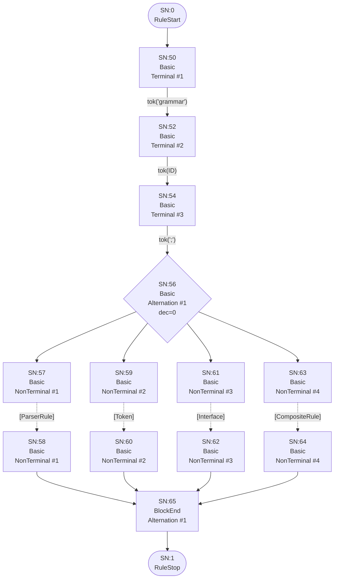

## Interface

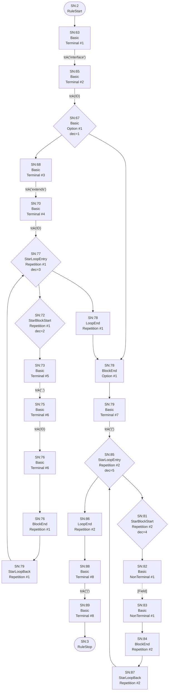

## Field

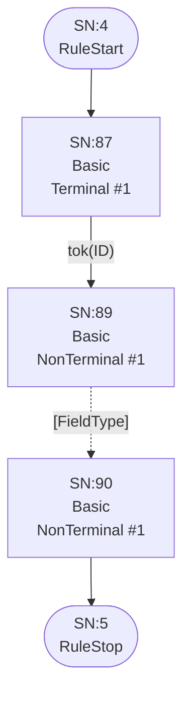

## FieldType


## ArrayType

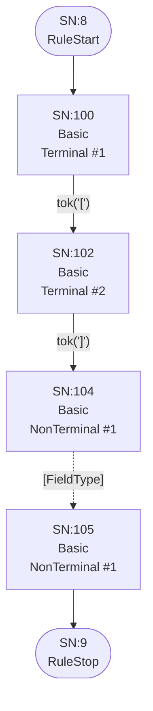

## ReferenceType


## SimpleType

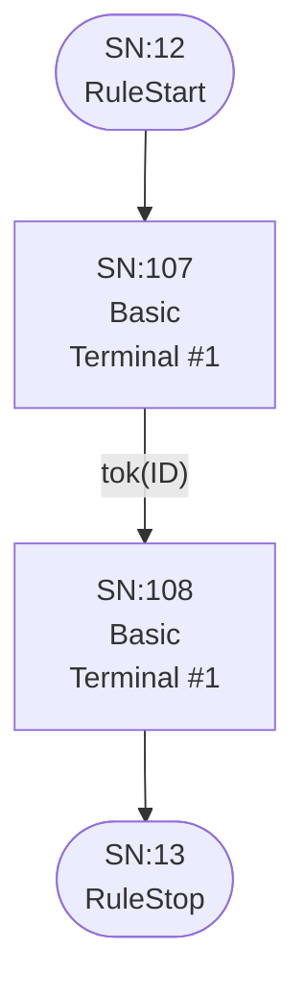

## PrimitiveType

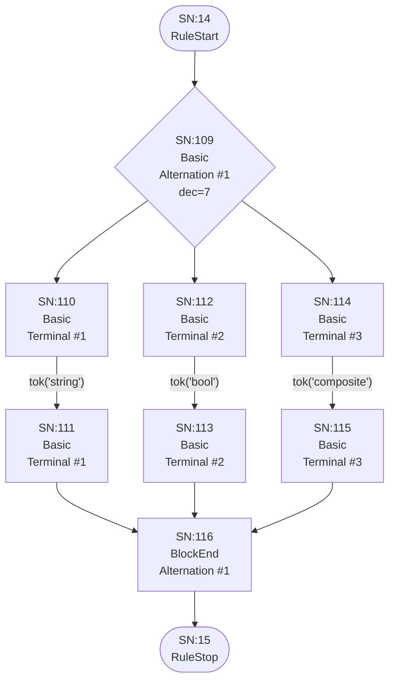

## ParserRule

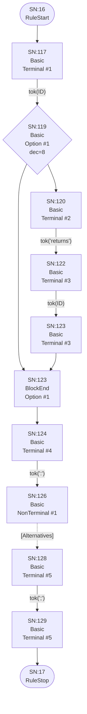

## Token

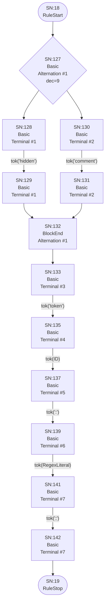

## Alternatives

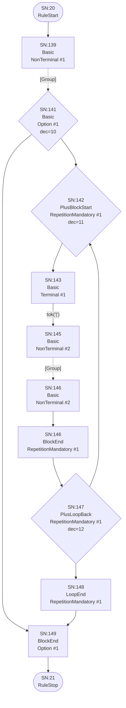

## Group

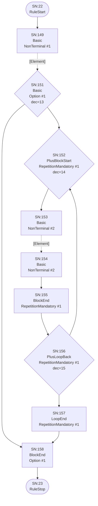

## Element

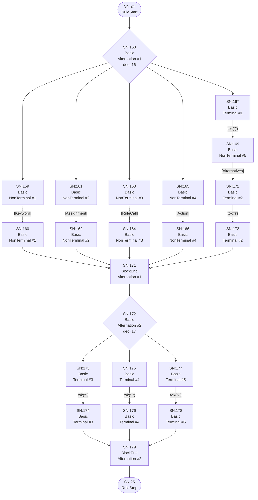

## Keyword

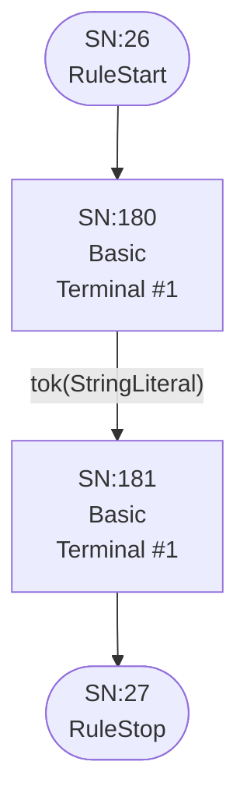

## Assignment

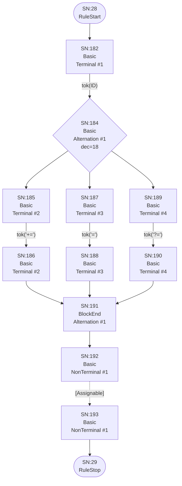

## Assignable

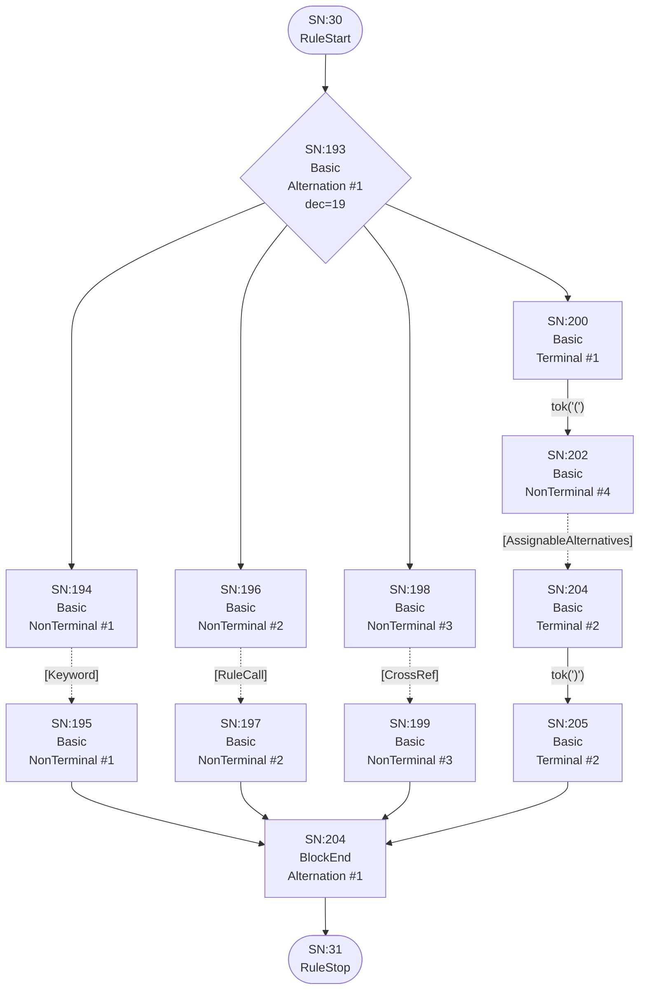

## AssignableWithoutAlts

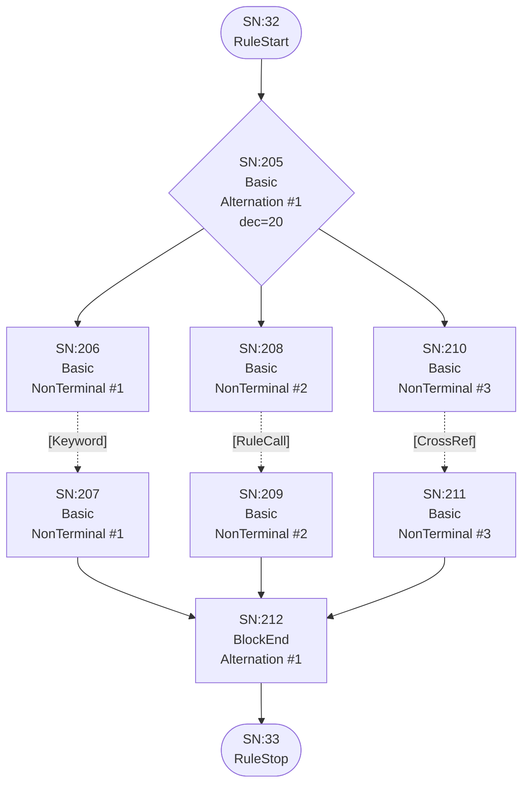

## AssignableAlternatives

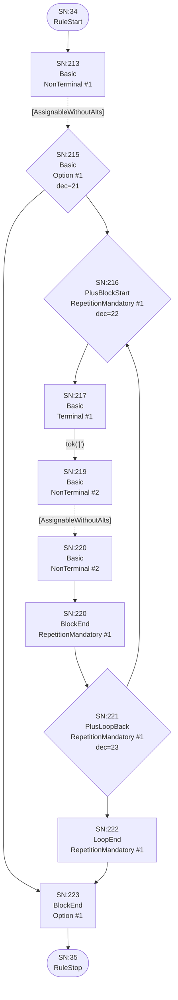

## CrossRef


## RuleCall


## Action

```mermaid
flowchart TD
    q40(["SN:40<br/>RuleStart"])
    q41(["SN:41<br/>RuleStop"])
    q234["SN:234<br/>Basic<br/>Terminal #1"]
    q235["SN:236<br/>Basic<br/>Terminal #2"]
    q236{"SN:238<br/>Basic<br/>Option #1<br/>dec=25"}
    q237["SN:239<br/>Basic<br/>Terminal #3"]
    q238["SN:241<br/>Basic<br/>Terminal #4"]
    q239{"SN:243<br/>Basic<br/>Alternation #1<br/>dec=26"}
    q240["SN:244<br/>Basic<br/>Terminal #5"]
    q241["SN:245<br/>Basic<br/>Terminal #5"]
    q242["SN:246<br/>Basic<br/>Terminal #6"]
    q243["SN:247<br/>Basic<br/>Terminal #6"]
    q244["SN:248<br/>BlockEnd<br/>Alternation #1"]
    q245["SN:249<br/>Basic<br/>Terminal #7"]
    q246["SN:250<br/>Basic<br/>Terminal #7"]
    q247["SN:249<br/>BlockEnd<br/>Option #1"]
    q248["SN:250<br/>Basic<br/>Terminal #8"]
    q249["SN:251<br/>Basic<br/>Terminal #8"]

    q40 --> q234
    q234 -->|"tok('{')"| q235
    q235 -->|"tok(ID)"| q236
    q236 --> q237
    q236 --> q247
    q237 -->|"tok('.')"| q238
    q238 -->|"tok(ID)"| q239
    q239 --> q240
    q239 --> q242
    q240 -->|"tok('+=')"| q241
    q241 --> q244
    q242 -->|"tok('=')"| q243
    q243 --> q244
    q244 --> q245
    q245 -->|"tok('current')"| q246
    q246 --> q247
    q247 --> q248
    q248 -->|"tok('}')"| q249
    q249 --> q41
```

## CompositeRule

```mermaid
flowchart TD
    q42(["SN:42<br/>RuleStart"])
    q43(["SN:43<br/>RuleStop"])
    q250["SN:250<br/>Basic<br/>Terminal #1"]
    q251["SN:252<br/>Basic<br/>Terminal #2"]
    q252["SN:254<br/>Basic<br/>Terminal #3"]
    q253["SN:256<br/>Basic<br/>NonTerminal #1"]
    q254["SN:258<br/>Basic<br/>Terminal #4"]
    q255["SN:259<br/>Basic<br/>Terminal #4"]

    q42 --> q250
    q250 -->|"tok('composite')"| q251
    q251 -->|"tok(ID)"| q252
    q252 -->|"tok(':')"| q253
    q253 -.->|"[CompositeAlternatives]"| q254
    q254 -->|"tok(';')"| q255
    q255 --> q43
```

## CompositeAlternatives

```mermaid
flowchart TD
    q44(["SN:44<br/>RuleStart"])
    q45(["SN:45<br/>RuleStop"])
    q256["SN:256<br/>Basic<br/>NonTerminal #1"]
    q257{"SN:258<br/>Basic<br/>Option #1<br/>dec=27"}
    q258{"SN:259<br/>PlusBlockStart<br/>RepetitionMandatory #1<br/>dec=28"}
    q259["SN:260<br/>Basic<br/>Terminal #1"]
    q260["SN:262<br/>Basic<br/>NonTerminal #2"]
    q261["SN:263<br/>Basic<br/>NonTerminal #2"]
    q262["SN:263<br/>BlockEnd<br/>RepetitionMandatory #1"]
    q263{"SN:264<br/>PlusLoopBack<br/>RepetitionMandatory #1<br/>dec=29"}
    q264["SN:265<br/>LoopEnd<br/>RepetitionMandatory #1"]
    q265["SN:266<br/>BlockEnd<br/>Option #1"]

    q44 --> q256
    q256 -.->|"[CompositeGroup]"| q257
    q257 --> q258
    q257 --> q265
    q258 --> q259
    q259 -->|"tok('|')"| q260
    q260 -.->|"[CompositeGroup]"| q261
    q261 --> q262
    q262 --> q263
    q263 --> q258
    q263 --> q264
    q264 --> q265
    q265 --> q45
```

## CompositeGroup

```mermaid
flowchart TD
    q46(["SN:46<br/>RuleStart"])
    q47(["SN:47<br/>RuleStop"])
    q266["SN:266<br/>Basic<br/>NonTerminal #1"]
    q267{"SN:268<br/>Basic<br/>Option #1<br/>dec=30"}
    q268{"SN:269<br/>PlusBlockStart<br/>RepetitionMandatory #1<br/>dec=31"}
    q269["SN:270<br/>Basic<br/>NonTerminal #2"]
    q270["SN:271<br/>Basic<br/>NonTerminal #2"]
    q271["SN:272<br/>BlockEnd<br/>RepetitionMandatory #1"]
    q272{"SN:273<br/>PlusLoopBack<br/>RepetitionMandatory #1<br/>dec=32"}
    q273["SN:274<br/>LoopEnd<br/>RepetitionMandatory #1"]
    q274["SN:275<br/>BlockEnd<br/>Option #1"]

    q46 --> q266
    q266 -.->|"[CompositeElement]"| q267
    q267 --> q268
    q267 --> q274
    q268 --> q269
    q269 -.->|"[CompositeElement]"| q270
    q270 --> q271
    q271 --> q272
    q272 --> q268
    q272 --> q273
    q273 --> q274
    q274 --> q47
```

## CompositeElement

```mermaid
flowchart TD
    q48(["SN:48<br/>RuleStart"])
    q49(["SN:49<br/>RuleStop"])
    q275{"SN:275<br/>Basic<br/>Alternation #1<br/>dec=33"}
    q276["SN:276<br/>Basic<br/>NonTerminal #1"]
    q277["SN:277<br/>Basic<br/>NonTerminal #1"]
    q278["SN:278<br/>Basic<br/>NonTerminal #2"]
    q279["SN:279<br/>Basic<br/>NonTerminal #2"]
    q280["SN:280<br/>Basic<br/>Terminal #1"]
    q281["SN:282<br/>Basic<br/>NonTerminal #3"]
    q282["SN:284<br/>Basic<br/>Terminal #2"]
    q283["SN:285<br/>Basic<br/>Terminal #2"]
    q284["SN:284<br/>BlockEnd<br/>Alternation #1"]
    q285{"SN:285<br/>Basic<br/>Alternation #2<br/>dec=34"}
    q286["SN:286<br/>Basic<br/>Terminal #3"]
    q287["SN:287<br/>Basic<br/>Terminal #3"]
    q288["SN:288<br/>Basic<br/>Terminal #4"]
    q289["SN:289<br/>Basic<br/>Terminal #4"]
    q290["SN:290<br/>Basic<br/>Terminal #5"]
    q291["SN:291<br/>Basic<br/>Terminal #5"]
    q292["SN:292<br/>BlockEnd<br/>Alternation #2"]

    q48 --> q275
    q275 --> q276
    q275 --> q278
    q275 --> q280
    q276 -.->|"[Keyword]"| q277
    q277 --> q284
    q278 -.->|"[RuleCall]"| q279
    q279 --> q284
    q280 -->|"tok('(')"| q281
    q281 -.->|"[CompositeAlternatives]"| q282
    q282 -->|"tok(')')"| q283
    q283 --> q284
    q284 --> q285
    q285 --> q286
    q285 --> q288
    q285 --> q290
    q286 -->|"tok('*')"| q287
    q287 --> q292
    q288 -->|"tok('+')"| q289
    q289 --> q292
    q290 -->|"tok('?')"| q291
    q291 --> q292
    q292 --> q49
```

