# Runtime ATN for grammar

## Grammar

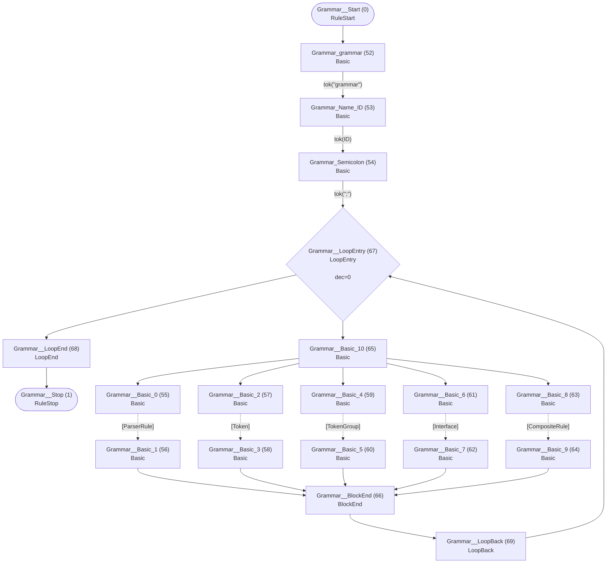

## Interface

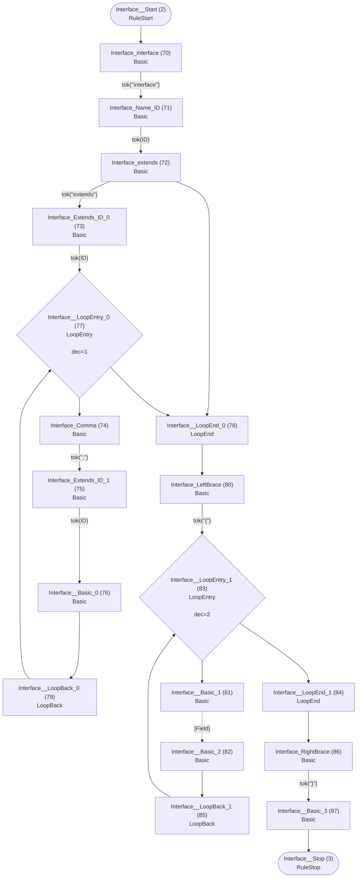

## Field

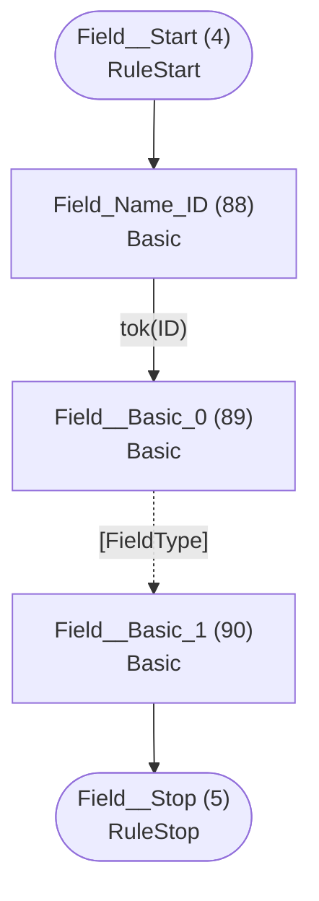

## FieldType

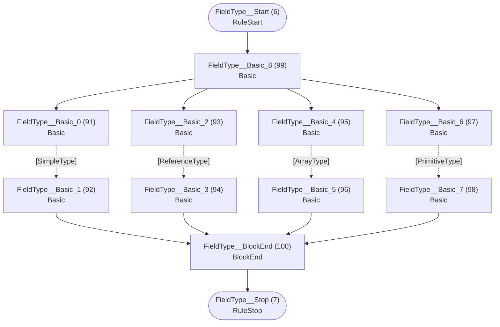

## ArrayType


## ReferenceType

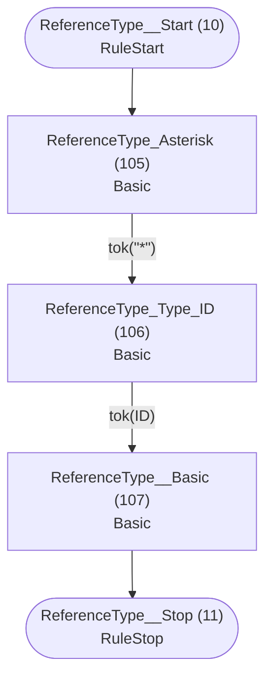

## SimpleType

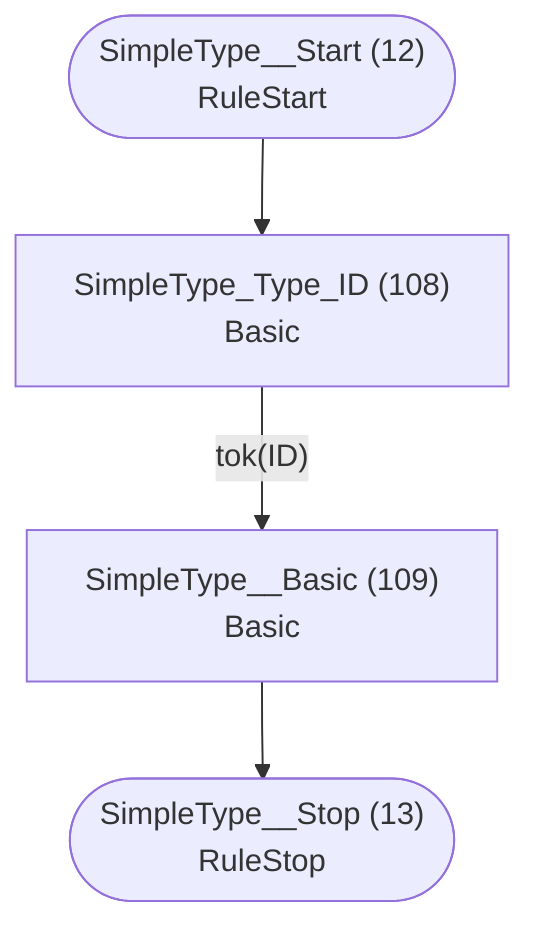

## PrimitiveType

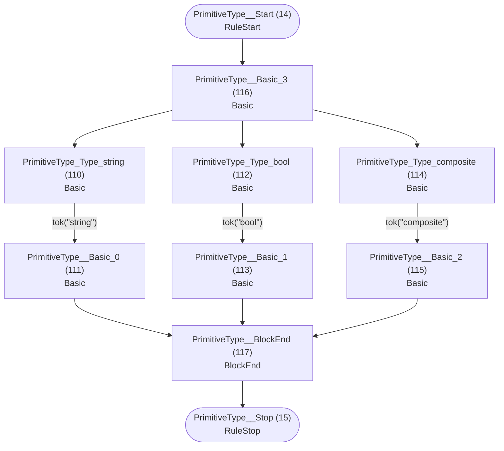

## ParserRule


## Token

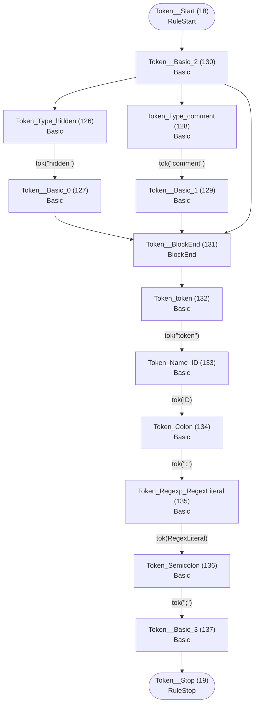

## TokenGroup

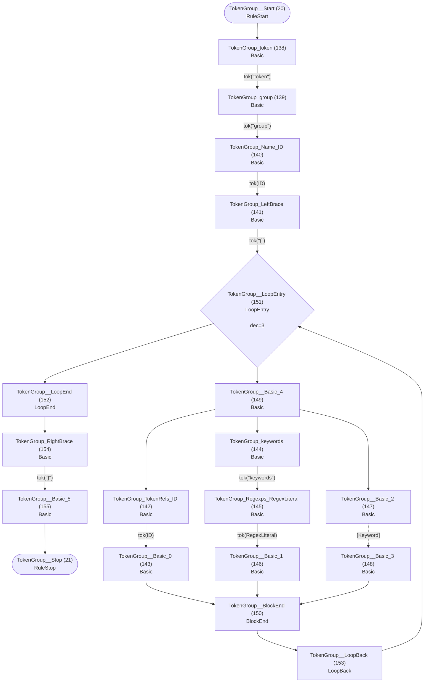

## Alternatives


## Group


## Element


## Keyword

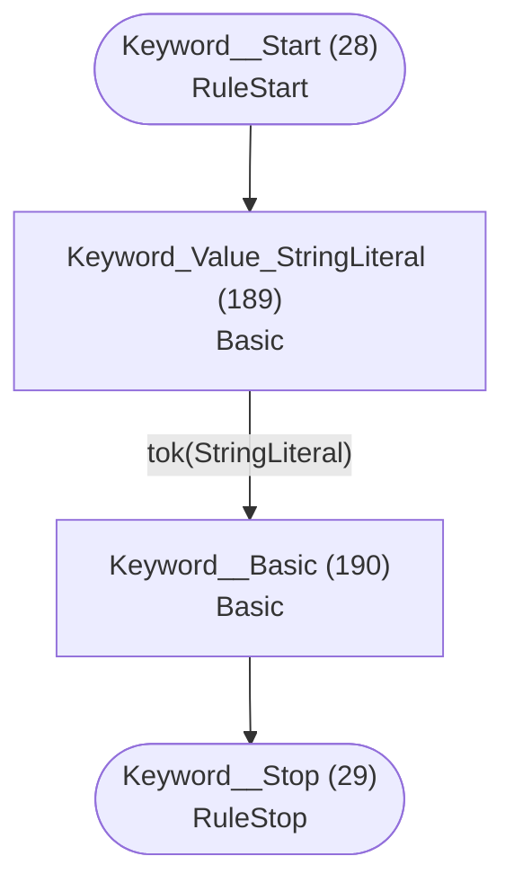

## Assignment

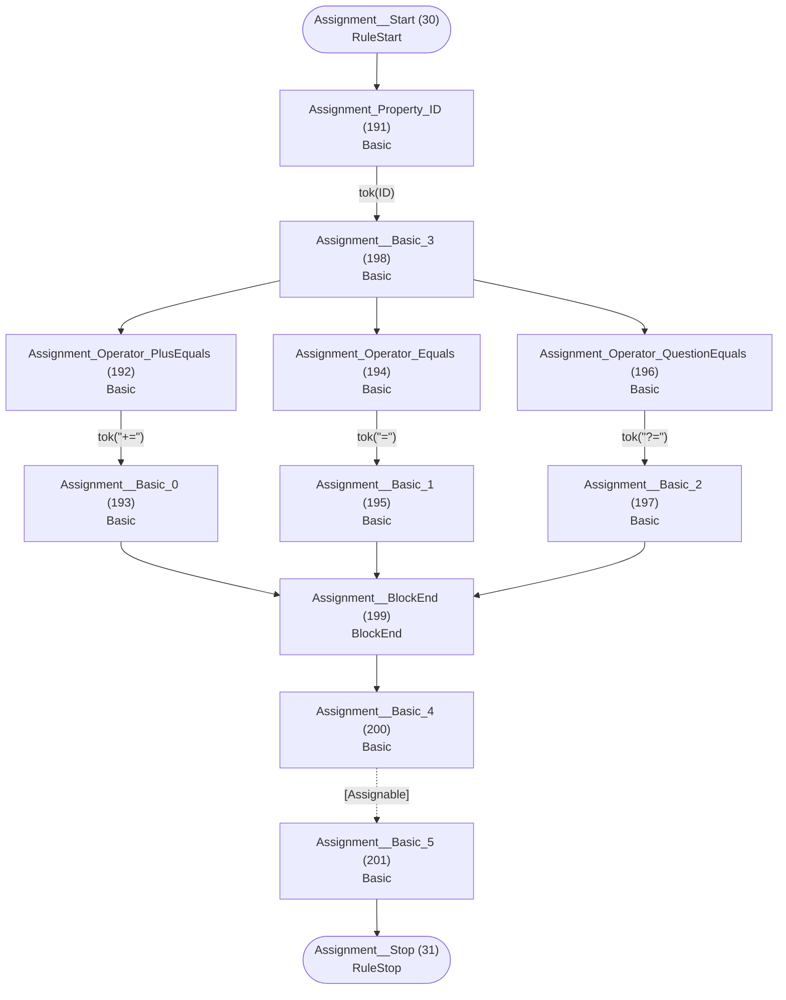

## Assignable

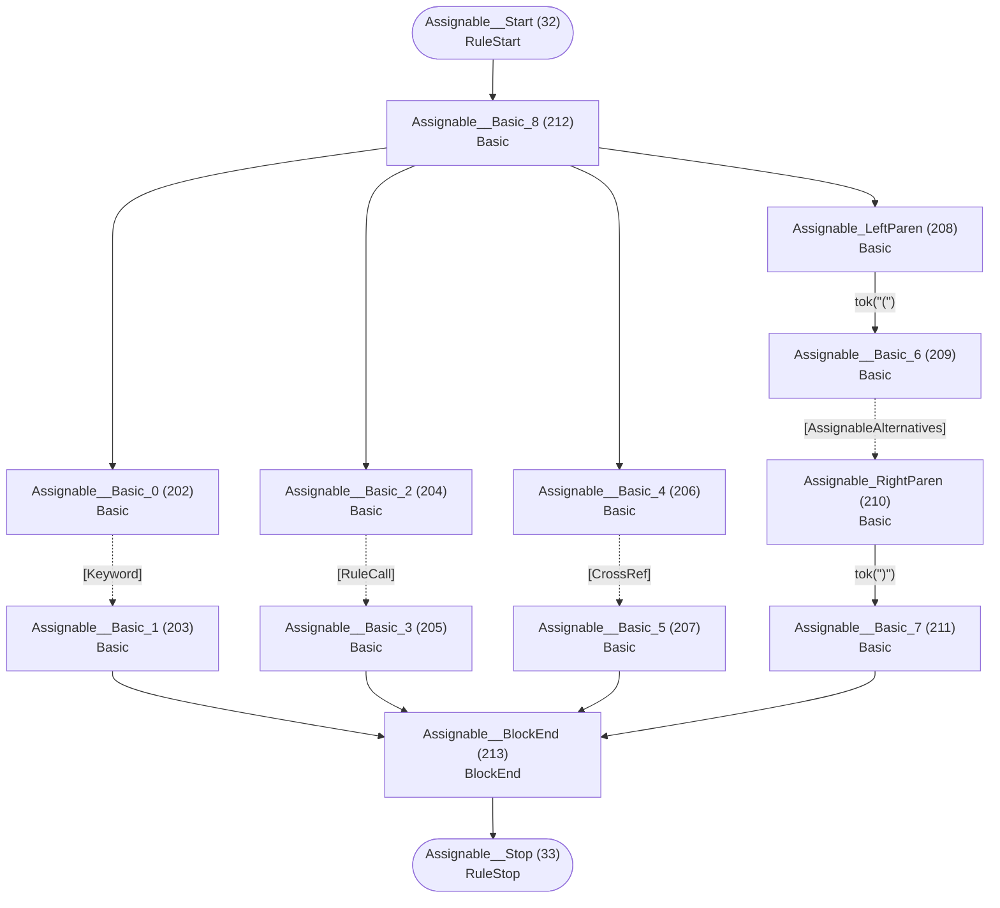

## AssignableWithoutAlts

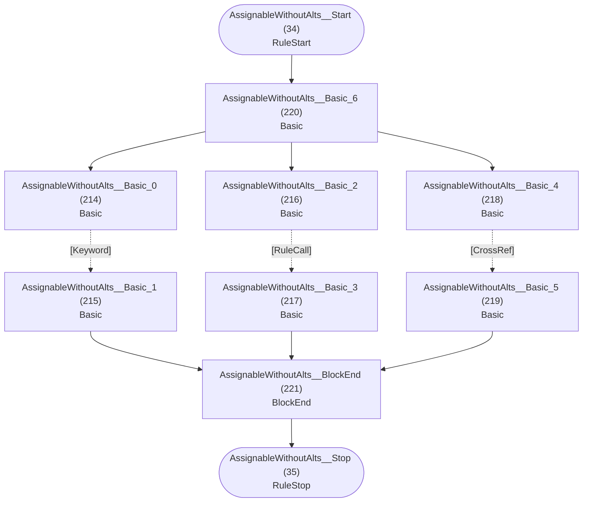

## AssignableAlternatives

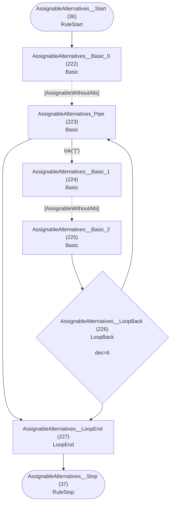

## CrossRef


## RuleCall

```mermaid
flowchart TD
    q40(["RuleCall__Start (40)<br/>RuleStart"])
    q41(["RuleCall__Stop (41)<br/>RuleStop"])
    q235["RuleCall_Rule_ID (235)<br/>Basic<br/>"]
    q236["RuleCall__Basic (236)<br/>Basic<br/>"]

    q40 --> q235
    q235 -->|"tok(ID)"| q236
    q236 --> q41
```

## Action

```mermaid
flowchart TD
    q42(["Action__Start (42)<br/>RuleStart"])
    q43(["Action__Stop (43)<br/>RuleStop"])
    q237["Action_LeftBrace (237)<br/>Basic<br/>"]
    q238["Action_Type_ID (238)<br/>Basic<br/>"]
    q239["Action_Dot (239)<br/>Basic<br/>"]
    q240["Action_Property_ID (240)<br/>Basic<br/>"]
    q241["Action_Operator_PlusEquals (241)<br/>Basic<br/>"]
    q242["Action__Basic_0 (242)<br/>Basic<br/>"]
    q243["Action_Operator_Equals (243)<br/>Basic<br/>"]
    q244["Action__Basic_1 (244)<br/>Basic<br/>"]
    q245["Action__Basic_2 (245)<br/>Basic<br/>"]
    q246["Action__BlockEnd (246)<br/>BlockEnd<br/>"]
    q247["Action_current (247)<br/>Basic<br/>"]
    q248["Action__Basic_3 (248)<br/>Basic<br/>"]
    q249["Action_RightBrace (249)<br/>Basic<br/>"]
    q250["Action__Basic_4 (250)<br/>Basic<br/>"]

    q42 --> q237
    q237 -->|"tok(&quot;{&quot;)"| q238
    q238 -->|"tok(ID)"| q239
    q239 -->|"tok(&quot;.&quot;)"| q240
    q239 --> q248
    q240 -->|"tok(ID)"| q245
    q241 -->|"tok(&quot;+=&quot;)"| q242
    q242 --> q246
    q243 -->|"tok(&quot;=&quot;)"| q244
    q244 --> q246
    q245 --> q241
    q245 --> q243
    q246 --> q247
    q247 -->|"tok(&quot;current&quot;)"| q248
    q248 --> q249
    q249 -->|"tok(&quot;}&quot;)"| q250
    q250 --> q43
```

## CompositeRule

```mermaid
flowchart TD
    q44(["CompositeRule__Start (44)<br/>RuleStart"])
    q45(["CompositeRule__Stop (45)<br/>RuleStop"])
    q251["CompositeRule_composite (251)<br/>Basic<br/>"]
    q252["CompositeRule_Name_ID (252)<br/>Basic<br/>"]
    q253["CompositeRule_Colon (253)<br/>Basic<br/>"]
    q254["CompositeRule__Basic_0 (254)<br/>Basic<br/>"]
    q255["CompositeRule_Semicolon (255)<br/>Basic<br/>"]
    q256["CompositeRule__Basic_1 (256)<br/>Basic<br/>"]

    q44 --> q251
    q251 -->|"tok(&quot;composite&quot;)"| q252
    q252 -->|"tok(ID)"| q253
    q253 -->|"tok(&quot;:&quot;)"| q254
    q254 -.->|"[CompositeAlternatives]"| q255
    q255 -->|"tok(&quot;;&quot;)"| q256
    q256 --> q45
```

## CompositeAlternatives

```mermaid
flowchart TD
    q46(["CompositeAlternatives__Start (46)<br/>RuleStart"])
    q47(["CompositeAlternatives__Stop (47)<br/>RuleStop"])
    q257["CompositeAlternatives__Basic_0 (257)<br/>Basic<br/>"]
    q258["CompositeAlternatives_Pipe (258)<br/>Basic<br/>"]
    q259["CompositeAlternatives__Basic_1 (259)<br/>Basic<br/>"]
    q260["CompositeAlternatives__Basic_2 (260)<br/>Basic<br/>"]
    q261{"CompositeAlternatives__LoopBack (261)<br/>LoopBack<br/><br/>dec=7"}
    q262["CompositeAlternatives__LoopEnd (262)<br/>LoopEnd<br/>"]

    q46 --> q257
    q257 -.->|"[CompositeGroup]"| q258
    q258 -->|"tok(&quot;|&quot;)"| q259
    q258 --> q262
    q259 -.->|"[CompositeGroup]"| q260
    q260 --> q261
    q261 --> q258
    q261 --> q262
    q262 --> q47
```

## CompositeGroup

```mermaid
flowchart TD
    q48(["CompositeGroup__Start (48)<br/>RuleStart"])
    q49(["CompositeGroup__Stop (49)<br/>RuleStop"])
    q263["CompositeGroup__Basic_0 (263)<br/>Basic<br/>"]
    q264["CompositeGroup__Basic_1 (264)<br/>Basic<br/>"]
    q265["CompositeGroup__Basic_2 (265)<br/>Basic<br/>"]
    q266{"CompositeGroup__LoopBack (266)<br/>LoopBack<br/><br/>dec=8"}
    q267["CompositeGroup__LoopEnd (267)<br/>LoopEnd<br/>"]

    q48 --> q263
    q263 -.->|"[CompositeElement]"| q264
    q264 -.->|"[CompositeElement]"| q265
    q264 --> q267
    q265 --> q266
    q266 --> q264
    q266 --> q267
    q267 --> q49
```

## CompositeElement

```mermaid
flowchart TD
    q50(["CompositeElement__Start (50)<br/>RuleStart"])
    q51(["CompositeElement__Stop (51)<br/>RuleStop"])
    q268["CompositeElement__Basic_0 (268)<br/>Basic<br/>"]
    q269["CompositeElement__Basic_1 (269)<br/>Basic<br/>"]
    q270["CompositeElement__Basic_2 (270)<br/>Basic<br/>"]
    q271["CompositeElement__Basic_3 (271)<br/>Basic<br/>"]
    q272["CompositeElement_LeftParen (272)<br/>Basic<br/>"]
    q273["CompositeElement__Basic_4 (273)<br/>Basic<br/>"]
    q274["CompositeElement_RightParen (274)<br/>Basic<br/>"]
    q275["CompositeElement__Basic_5 (275)<br/>Basic<br/>"]
    q276["CompositeElement__Basic_6 (276)<br/>Basic<br/>"]
    q277["CompositeElement__BlockEnd_0 (277)<br/>BlockEnd<br/>"]
    q278["CompositeElement_Cardinality_Asterisk (278)<br/>Basic<br/>"]
    q279["CompositeElement__Basic_7 (279)<br/>Basic<br/>"]
    q280["CompositeElement_Cardinality_Plus (280)<br/>Basic<br/>"]
    q281["CompositeElement__Basic_8 (281)<br/>Basic<br/>"]
    q282["CompositeElement_Cardinality_Question (282)<br/>Basic<br/>"]
    q283["CompositeElement__Basic_9 (283)<br/>Basic<br/>"]
    q284["CompositeElement__Basic_10 (284)<br/>Basic<br/>"]
    q285["CompositeElement__BlockEnd_1 (285)<br/>BlockEnd<br/>"]

    q50 --> q276
    q268 -.->|"[Keyword]"| q269
    q269 --> q277
    q270 -.->|"[RuleCall]"| q271
    q271 --> q277
    q272 -->|"tok(&quot;(&quot;)"| q273
    q273 -.->|"[CompositeAlternatives]"| q274
    q274 -->|"tok(&quot;)&quot;)"| q275
    q275 --> q277
    q276 --> q268
    q276 --> q270
    q276 --> q272
    q277 --> q284
    q278 -->|"tok(&quot;*&quot;)"| q279
    q279 --> q285
    q280 -->|"tok(&quot;+&quot;)"| q281
    q281 --> q285
    q282 -->|"tok(&quot;?&quot;)"| q283
    q283 --> q285
    q284 --> q278
    q284 --> q280
    q284 --> q282
    q284 --> q285
    q285 --> q51
```

