# Runtime ATN for grammar

## Grammar

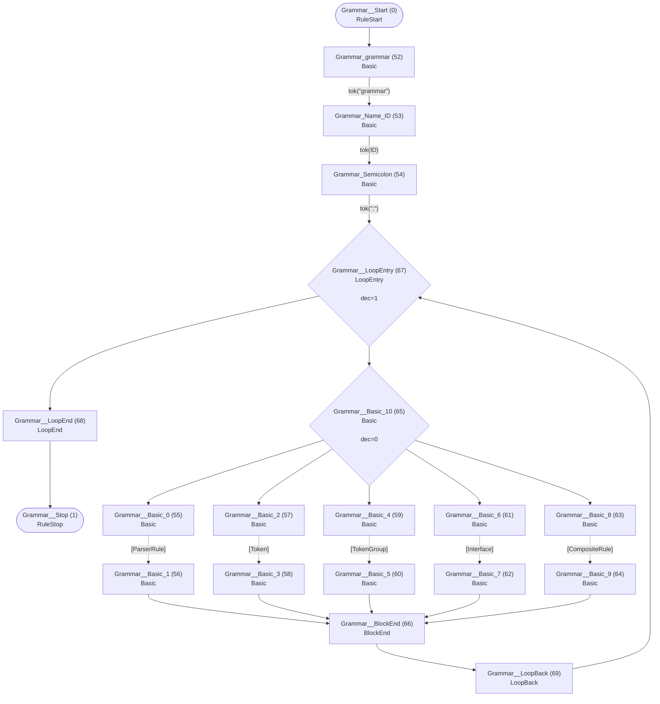

## Interface


## Field

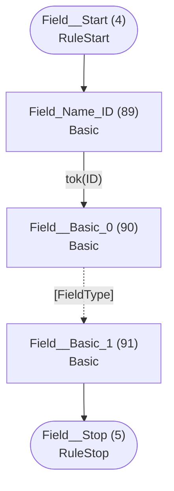

## FieldType

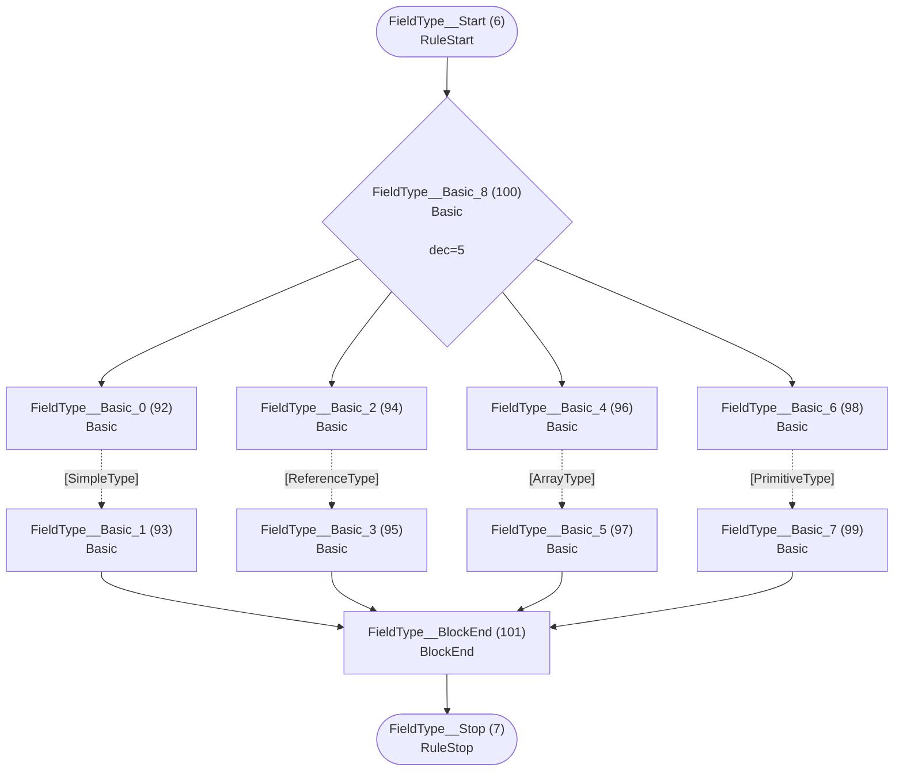

## ArrayType

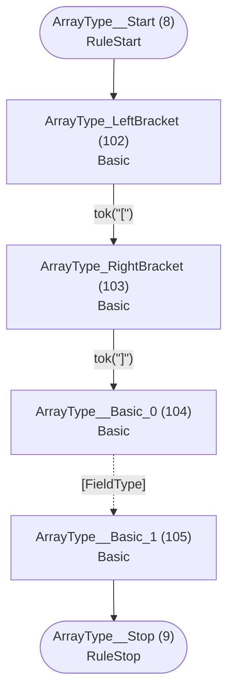

## ReferenceType

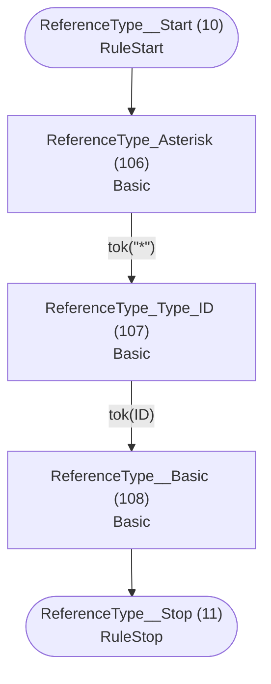

## SimpleType

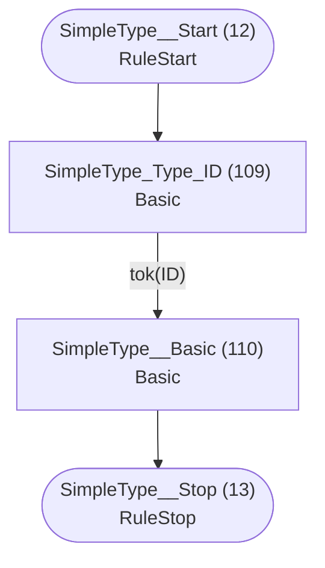

## PrimitiveType


## ParserRule

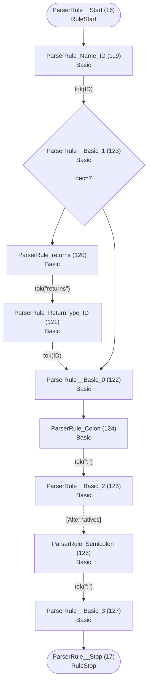

## Token

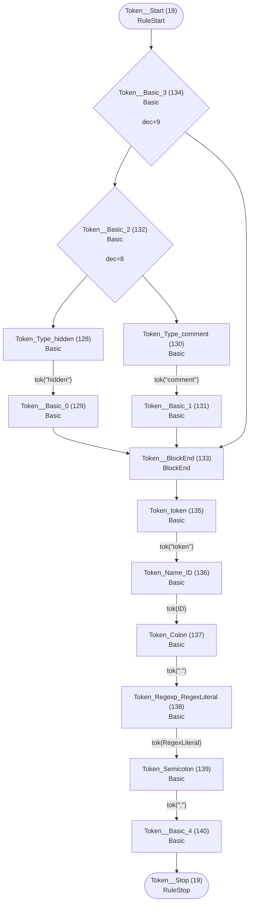

## TokenGroup


## Alternatives

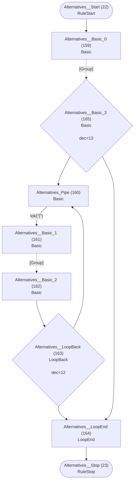

## Group


## Element


## Keyword


## Assignment

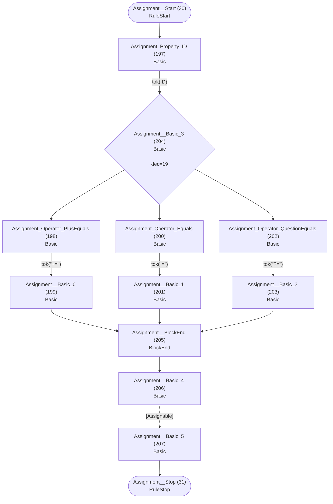

## Assignable


## AssignableWithoutAlts

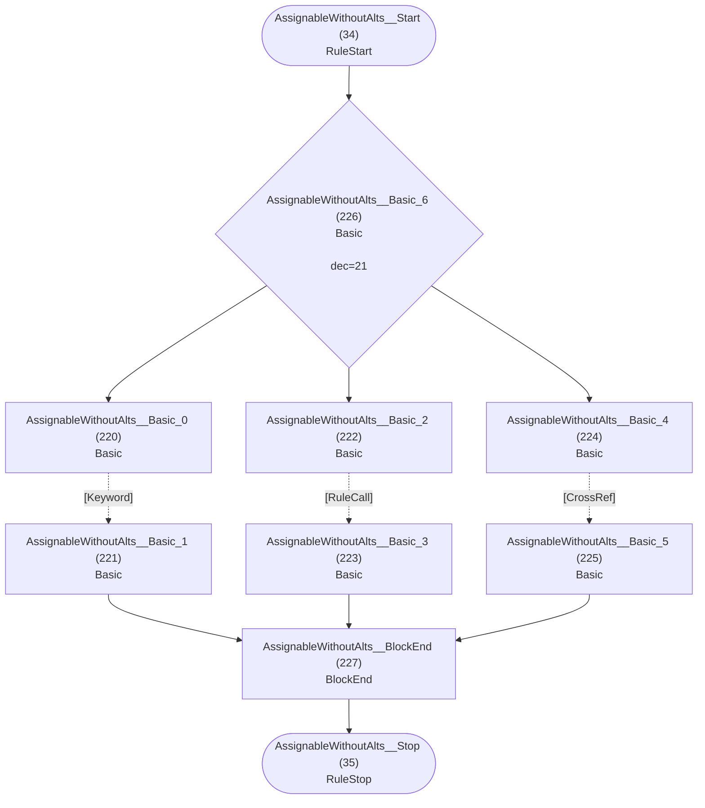

## AssignableAlternatives


## CrossRef


## RuleCall

```mermaid
flowchart TD
    q40(["RuleCall__Start (40)<br/>RuleStart"])
    q41(["RuleCall__Stop (41)<br/>RuleStop"])
    q243["RuleCall_Rule_ID (243)<br/>Basic<br/>"]
    q244["RuleCall__Basic (244)<br/>Basic<br/>"]

    q40 --> q243
    q243 -->|"tok(ID)"| q244
    q244 --> q41
```

## Action

```mermaid
flowchart TD
    q42(["Action__Start (42)<br/>RuleStart"])
    q43(["Action__Stop (43)<br/>RuleStop"])
    q245["Action_LeftBrace (245)<br/>Basic<br/>"]
    q246["Action_Type_ID (246)<br/>Basic<br/>"]
    q247["Action_Dot (247)<br/>Basic<br/>"]
    q248["Action_Property_ID (248)<br/>Basic<br/>"]
    q249["Action_Operator_PlusEquals (249)<br/>Basic<br/>"]
    q250["Action__Basic_0 (250)<br/>Basic<br/>"]
    q251["Action_Operator_Equals (251)<br/>Basic<br/>"]
    q252["Action__Basic_1 (252)<br/>Basic<br/>"]
    q253{"Action__Basic_2 (253)<br/>Basic<br/><br/>dec=25"}
    q254["Action__BlockEnd (254)<br/>BlockEnd<br/>"]
    q255["Action_current (255)<br/>Basic<br/>"]
    q256["Action__Basic_3 (256)<br/>Basic<br/>"]
    q257{"Action__Basic_4 (257)<br/>Basic<br/><br/>dec=26"}
    q258["Action_RightBrace (258)<br/>Basic<br/>"]
    q259["Action__Basic_5 (259)<br/>Basic<br/>"]

    q42 --> q245
    q245 -->|"tok(&quot;{&quot;)"| q246
    q246 -->|"tok(ID)"| q257
    q247 -->|"tok(&quot;.&quot;)"| q248
    q248 -->|"tok(ID)"| q253
    q249 -->|"tok(&quot;+=&quot;)"| q250
    q250 --> q254
    q251 -->|"tok(&quot;=&quot;)"| q252
    q252 --> q254
    q253 --> q249
    q253 --> q251
    q254 --> q255
    q255 -->|"tok(&quot;current&quot;)"| q256
    q256 --> q258
    q257 --> q247
    q257 --> q256
    q258 -->|"tok(&quot;}&quot;)"| q259
    q259 --> q43
```

## CompositeRule

```mermaid
flowchart TD
    q44(["CompositeRule__Start (44)<br/>RuleStart"])
    q45(["CompositeRule__Stop (45)<br/>RuleStop"])
    q260["CompositeRule_composite (260)<br/>Basic<br/>"]
    q261["CompositeRule_Name_ID (261)<br/>Basic<br/>"]
    q262["CompositeRule_Colon (262)<br/>Basic<br/>"]
    q263["CompositeRule__Basic_0 (263)<br/>Basic<br/>"]
    q264["CompositeRule_Semicolon (264)<br/>Basic<br/>"]
    q265["CompositeRule__Basic_1 (265)<br/>Basic<br/>"]

    q44 --> q260
    q260 -->|"tok(&quot;composite&quot;)"| q261
    q261 -->|"tok(ID)"| q262
    q262 -->|"tok(&quot;:&quot;)"| q263
    q263 -.->|"[CompositeAlternatives]"| q264
    q264 -->|"tok(&quot;;&quot;)"| q265
    q265 --> q45
```

## CompositeAlternatives

```mermaid
flowchart TD
    q46(["CompositeAlternatives__Start (46)<br/>RuleStart"])
    q47(["CompositeAlternatives__Stop (47)<br/>RuleStop"])
    q266["CompositeAlternatives__Basic_0 (266)<br/>Basic<br/>"]
    q267["CompositeAlternatives_Pipe (267)<br/>Basic<br/>"]
    q268["CompositeAlternatives__Basic_1 (268)<br/>Basic<br/>"]
    q269["CompositeAlternatives__Basic_2 (269)<br/>Basic<br/>"]
    q270{"CompositeAlternatives__LoopBack (270)<br/>LoopBack<br/><br/>dec=27"}
    q271["CompositeAlternatives__LoopEnd (271)<br/>LoopEnd<br/>"]
    q272{"CompositeAlternatives__Basic_3 (272)<br/>Basic<br/><br/>dec=28"}

    q46 --> q266
    q266 -.->|"[CompositeGroup]"| q272
    q267 -->|"tok(&quot;|&quot;)"| q268
    q268 -.->|"[CompositeGroup]"| q269
    q269 --> q270
    q270 --> q267
    q270 --> q271
    q271 --> q47
    q272 --> q267
    q272 --> q271
```

## CompositeGroup

```mermaid
flowchart TD
    q48(["CompositeGroup__Start (48)<br/>RuleStart"])
    q49(["CompositeGroup__Stop (49)<br/>RuleStop"])
    q273["CompositeGroup__Basic_0 (273)<br/>Basic<br/>"]
    q274["CompositeGroup__Basic_1 (274)<br/>Basic<br/>"]
    q275["CompositeGroup__Basic_2 (275)<br/>Basic<br/>"]
    q276{"CompositeGroup__LoopBack (276)<br/>LoopBack<br/><br/>dec=29"}
    q277["CompositeGroup__LoopEnd (277)<br/>LoopEnd<br/>"]
    q278{"CompositeGroup__Basic_3 (278)<br/>Basic<br/><br/>dec=30"}

    q48 --> q273
    q273 -.->|"[CompositeElement]"| q278
    q274 -.->|"[CompositeElement]"| q275
    q275 --> q276
    q276 --> q274
    q276 --> q277
    q277 --> q49
    q278 --> q274
    q278 --> q277
```

## CompositeElement

```mermaid
flowchart TD
    q50(["CompositeElement__Start (50)<br/>RuleStart"])
    q51(["CompositeElement__Stop (51)<br/>RuleStop"])
    q279["CompositeElement__Basic_0 (279)<br/>Basic<br/>"]
    q280["CompositeElement__Basic_1 (280)<br/>Basic<br/>"]
    q281["CompositeElement__Basic_2 (281)<br/>Basic<br/>"]
    q282["CompositeElement__Basic_3 (282)<br/>Basic<br/>"]
    q283["CompositeElement_LeftParen (283)<br/>Basic<br/>"]
    q284["CompositeElement__Basic_4 (284)<br/>Basic<br/>"]
    q285["CompositeElement_RightParen (285)<br/>Basic<br/>"]
    q286["CompositeElement__Basic_5 (286)<br/>Basic<br/>"]
    q287{"CompositeElement__Basic_6 (287)<br/>Basic<br/><br/>dec=31"}
    q288["CompositeElement__BlockEnd_0 (288)<br/>BlockEnd<br/>"]
    q289["CompositeElement_Cardinality_Asterisk (289)<br/>Basic<br/>"]
    q290["CompositeElement__Basic_7 (290)<br/>Basic<br/>"]
    q291["CompositeElement_Cardinality_Plus (291)<br/>Basic<br/>"]
    q292["CompositeElement__Basic_8 (292)<br/>Basic<br/>"]
    q293["CompositeElement_Cardinality_Question (293)<br/>Basic<br/>"]
    q294["CompositeElement__Basic_9 (294)<br/>Basic<br/>"]
    q295{"CompositeElement__Basic_10 (295)<br/>Basic<br/><br/>dec=32"}
    q296["CompositeElement__BlockEnd_1 (296)<br/>BlockEnd<br/>"]
    q297{"CompositeElement__Basic_11 (297)<br/>Basic<br/><br/>dec=33"}

    q50 --> q287
    q279 -.->|"[Keyword]"| q280
    q280 --> q288
    q281 -.->|"[RuleCall]"| q282
    q282 --> q288
    q283 -->|"tok(&quot;(&quot;)"| q284
    q284 -.->|"[CompositeAlternatives]"| q285
    q285 -->|"tok(&quot;)&quot;)"| q286
    q286 --> q288
    q287 --> q279
    q287 --> q281
    q287 --> q283
    q288 --> q297
    q289 -->|"tok(&quot;*&quot;)"| q290
    q290 --> q296
    q291 -->|"tok(&quot;+&quot;)"| q292
    q292 --> q296
    q293 -->|"tok(&quot;?&quot;)"| q294
    q294 --> q296
    q295 --> q289
    q295 --> q291
    q295 --> q293
    q296 --> q51
    q297 --> q295
    q297 --> q296
```

