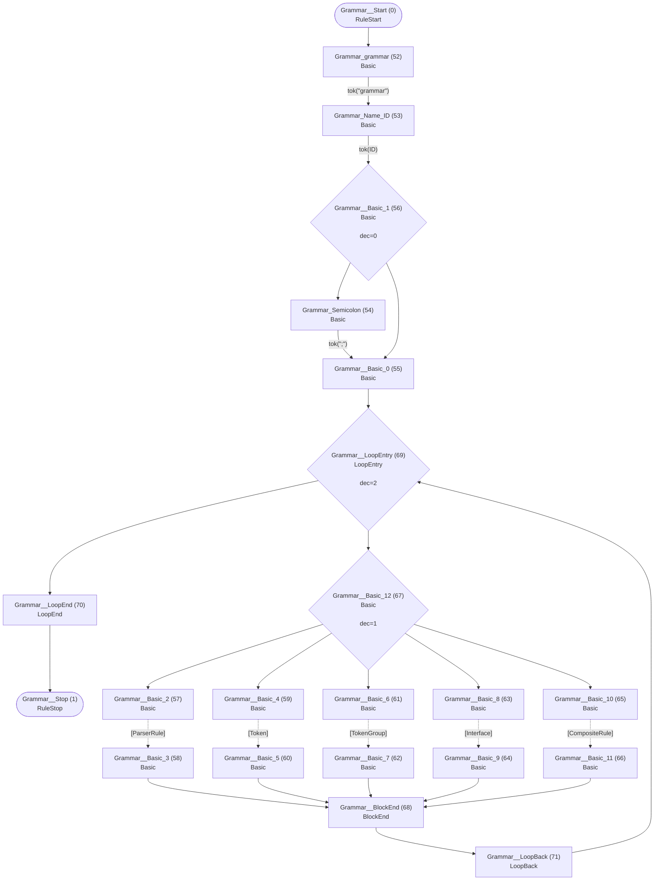
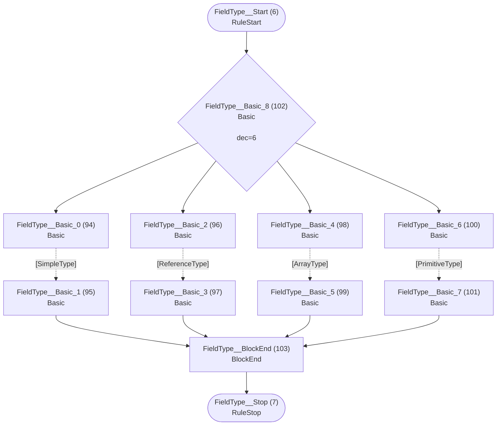
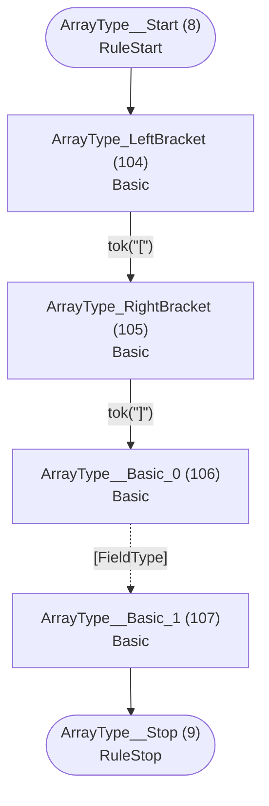
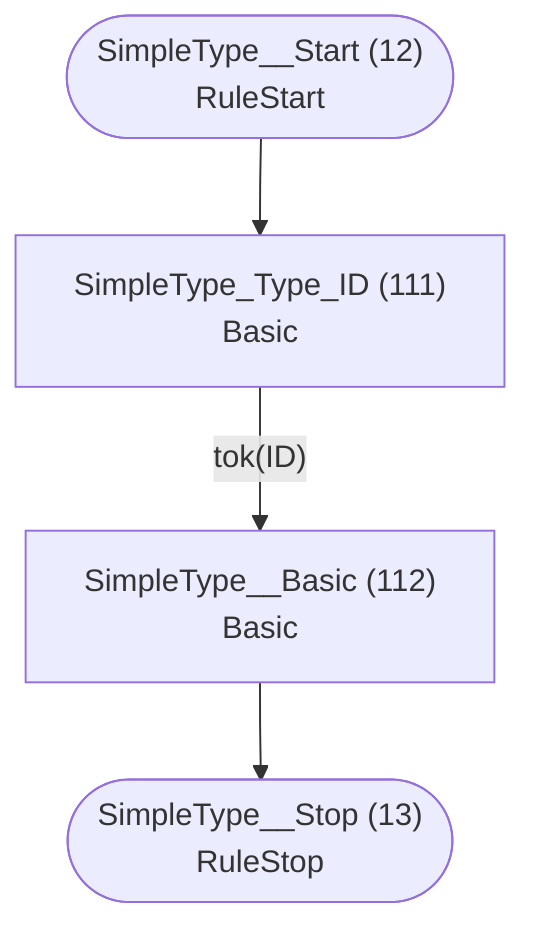
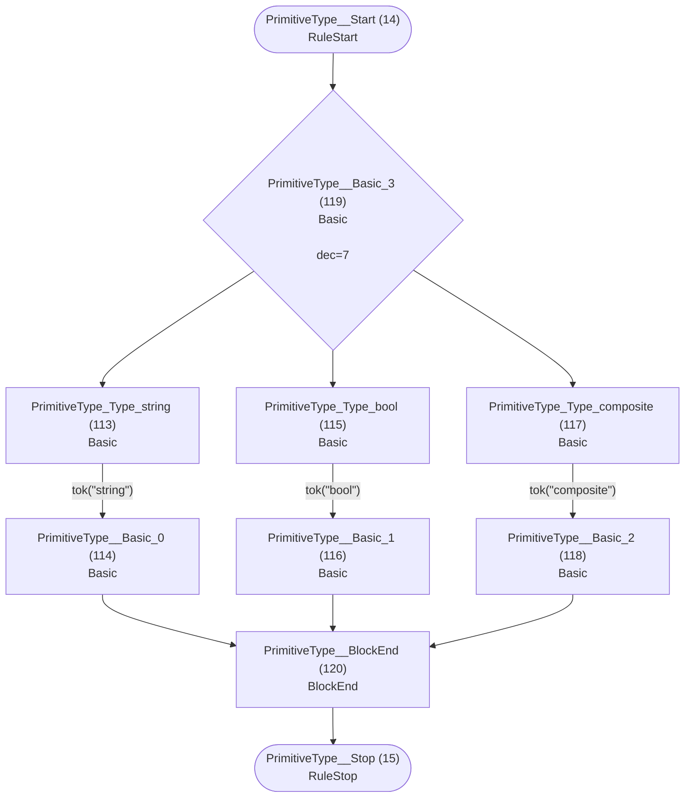
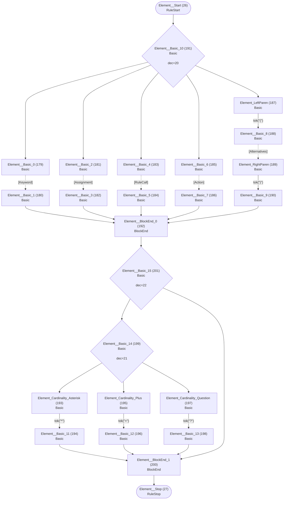
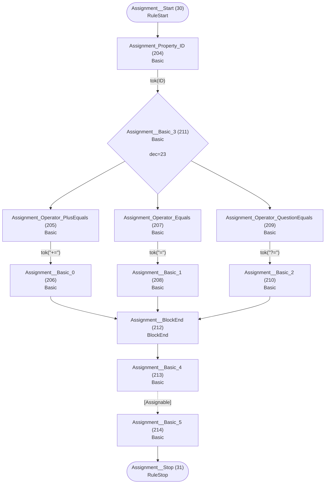
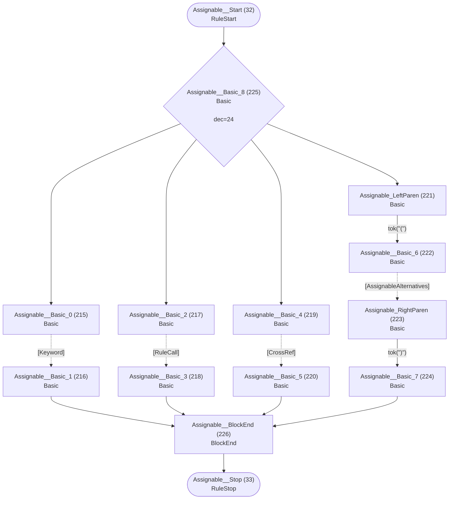
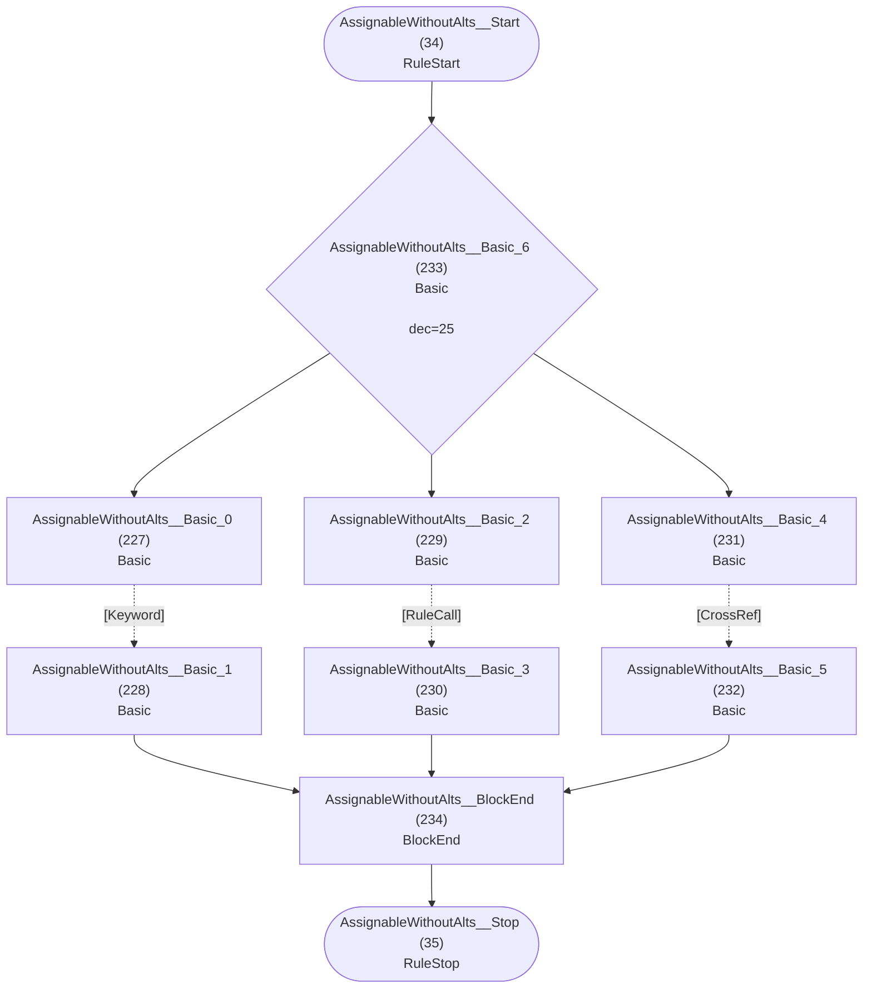
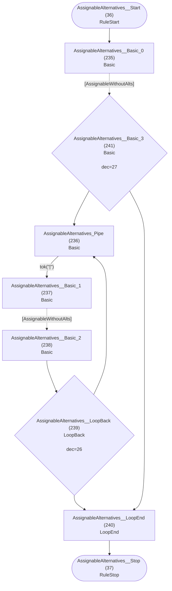

# Runtime ATN for grammar

## Grammar



## Interface


## Field


## FieldType



## ArrayType



## ReferenceType


## SimpleType



## PrimitiveType



## ParserRule


## Token


## TokenGroup


## Alternatives


## Group


## Element



## Keyword


## Assignment



## Assignable



## AssignableWithoutAlts



## AssignableAlternatives



## CrossRef


## RuleCall

```mermaid
flowchart TD
    q40(["RuleCall__Start (40)<br/>RuleStart"])
    q41(["RuleCall__Stop (41)<br/>RuleStop"])
    q250["RuleCall_Rule_ID (250)<br/>Basic<br/>"]
    q251["RuleCall__Basic (251)<br/>Basic<br/>"]

    q40 --> q250
    q250 -->|"tok(ID)"| q251
    q251 --> q41
```

## Action

```mermaid
flowchart TD
    q42(["Action__Start (42)<br/>RuleStart"])
    q43(["Action__Stop (43)<br/>RuleStop"])
    q252["Action_LeftBrace (252)<br/>Basic<br/>"]
    q253["Action_Type_ID (253)<br/>Basic<br/>"]
    q254["Action_Dot (254)<br/>Basic<br/>"]
    q255["Action_Property_ID (255)<br/>Basic<br/>"]
    q256["Action_Operator_PlusEquals (256)<br/>Basic<br/>"]
    q257["Action__Basic_0 (257)<br/>Basic<br/>"]
    q258["Action_Operator_Equals (258)<br/>Basic<br/>"]
    q259["Action__Basic_1 (259)<br/>Basic<br/>"]
    q260{"Action__Basic_2 (260)<br/>Basic<br/><br/>dec=29"}
    q261["Action__BlockEnd (261)<br/>BlockEnd<br/>"]
    q262["Action_current (262)<br/>Basic<br/>"]
    q263["Action__Basic_3 (263)<br/>Basic<br/>"]
    q264{"Action__Basic_4 (264)<br/>Basic<br/><br/>dec=30"}
    q265["Action_RightBrace (265)<br/>Basic<br/>"]
    q266["Action__Basic_5 (266)<br/>Basic<br/>"]

    q42 --> q252
    q252 -->|"tok(&quot;{&quot;)"| q253
    q253 -->|"tok(ID)"| q264
    q254 -->|"tok(&quot;.&quot;)"| q255
    q255 -->|"tok(ID)"| q260
    q256 -->|"tok(&quot;+=&quot;)"| q257
    q257 --> q261
    q258 -->|"tok(&quot;=&quot;)"| q259
    q259 --> q261
    q260 --> q256
    q260 --> q258
    q261 --> q262
    q262 -->|"tok(&quot;current&quot;)"| q263
    q263 --> q265
    q264 --> q254
    q264 --> q263
    q265 -->|"tok(&quot;}&quot;)"| q266
    q266 --> q43
```

## CompositeRule

```mermaid
flowchart TD
    q44(["CompositeRule__Start (44)<br/>RuleStart"])
    q45(["CompositeRule__Stop (45)<br/>RuleStop"])
    q267["CompositeRule_composite (267)<br/>Basic<br/>"]
    q268["CompositeRule_Name_ID (268)<br/>Basic<br/>"]
    q269["CompositeRule_Colon (269)<br/>Basic<br/>"]
    q270["CompositeRule__Basic_0 (270)<br/>Basic<br/>"]
    q271["CompositeRule_Semicolon (271)<br/>Basic<br/>"]
    q272["CompositeRule__Basic_1 (272)<br/>Basic<br/>"]
    q273{"CompositeRule__Basic_2 (273)<br/>Basic<br/><br/>dec=31"}

    q44 --> q267
    q267 -->|"tok(&quot;composite&quot;)"| q268
    q268 -->|"tok(ID)"| q269
    q269 -->|"tok(&quot;:&quot;)"| q270
    q270 -.->|"[CompositeAlternatives]"| q273
    q271 -->|"tok(&quot;;&quot;)"| q272
    q272 --> q45
    q273 --> q271
    q273 --> q272
```

## CompositeAlternatives

```mermaid
flowchart TD
    q46(["CompositeAlternatives__Start (46)<br/>RuleStart"])
    q47(["CompositeAlternatives__Stop (47)<br/>RuleStop"])
    q274["CompositeAlternatives__Basic_0 (274)<br/>Basic<br/>"]
    q275["CompositeAlternatives_Pipe (275)<br/>Basic<br/>"]
    q276["CompositeAlternatives__Basic_1 (276)<br/>Basic<br/>"]
    q277["CompositeAlternatives__Basic_2 (277)<br/>Basic<br/>"]
    q278{"CompositeAlternatives__LoopBack (278)<br/>LoopBack<br/><br/>dec=32"}
    q279["CompositeAlternatives__LoopEnd (279)<br/>LoopEnd<br/>"]
    q280{"CompositeAlternatives__Basic_3 (280)<br/>Basic<br/><br/>dec=33"}

    q46 --> q274
    q274 -.->|"[CompositeGroup]"| q280
    q275 -->|"tok(&quot;|&quot;)"| q276
    q276 -.->|"[CompositeGroup]"| q277
    q277 --> q278
    q278 --> q275
    q278 --> q279
    q279 --> q47
    q280 --> q275
    q280 --> q279
```

## CompositeGroup

```mermaid
flowchart TD
    q48(["CompositeGroup__Start (48)<br/>RuleStart"])
    q49(["CompositeGroup__Stop (49)<br/>RuleStop"])
    q281["CompositeGroup__Basic_0 (281)<br/>Basic<br/>"]
    q282["CompositeGroup__Basic_1 (282)<br/>Basic<br/>"]
    q283["CompositeGroup__Basic_2 (283)<br/>Basic<br/>"]
    q284{"CompositeGroup__LoopBack (284)<br/>LoopBack<br/><br/>dec=34"}
    q285["CompositeGroup__LoopEnd (285)<br/>LoopEnd<br/>"]
    q286{"CompositeGroup__Basic_3 (286)<br/>Basic<br/><br/>dec=35"}

    q48 --> q281
    q281 -.->|"[CompositeElement]"| q286
    q282 -.->|"[CompositeElement]"| q283
    q283 --> q284
    q284 --> q282
    q284 --> q285
    q285 --> q49
    q286 --> q282
    q286 --> q285
```

## CompositeElement

```mermaid
flowchart TD
    q50(["CompositeElement__Start (50)<br/>RuleStart"])
    q51(["CompositeElement__Stop (51)<br/>RuleStop"])
    q287["CompositeElement__Basic_0 (287)<br/>Basic<br/>"]
    q288["CompositeElement__Basic_1 (288)<br/>Basic<br/>"]
    q289["CompositeElement__Basic_2 (289)<br/>Basic<br/>"]
    q290["CompositeElement__Basic_3 (290)<br/>Basic<br/>"]
    q291["CompositeElement_LeftParen (291)<br/>Basic<br/>"]
    q292["CompositeElement__Basic_4 (292)<br/>Basic<br/>"]
    q293["CompositeElement_RightParen (293)<br/>Basic<br/>"]
    q294["CompositeElement__Basic_5 (294)<br/>Basic<br/>"]
    q295{"CompositeElement__Basic_6 (295)<br/>Basic<br/><br/>dec=36"}
    q296["CompositeElement__BlockEnd_0 (296)<br/>BlockEnd<br/>"]
    q297["CompositeElement_Cardinality_Asterisk (297)<br/>Basic<br/>"]
    q298["CompositeElement__Basic_7 (298)<br/>Basic<br/>"]
    q299["CompositeElement_Cardinality_Plus (299)<br/>Basic<br/>"]
    q300["CompositeElement__Basic_8 (300)<br/>Basic<br/>"]
    q301["CompositeElement_Cardinality_Question (301)<br/>Basic<br/>"]
    q302["CompositeElement__Basic_9 (302)<br/>Basic<br/>"]
    q303{"CompositeElement__Basic_10 (303)<br/>Basic<br/><br/>dec=37"}
    q304["CompositeElement__BlockEnd_1 (304)<br/>BlockEnd<br/>"]
    q305{"CompositeElement__Basic_11 (305)<br/>Basic<br/><br/>dec=38"}

    q50 --> q295
    q287 -.->|"[Keyword]"| q288
    q288 --> q296
    q289 -.->|"[RuleCall]"| q290
    q290 --> q296
    q291 -->|"tok(&quot;(&quot;)"| q292
    q292 -.->|"[CompositeAlternatives]"| q293
    q293 -->|"tok(&quot;)&quot;)"| q294
    q294 --> q296
    q295 --> q287
    q295 --> q289
    q295 --> q291
    q296 --> q305
    q297 -->|"tok(&quot;*&quot;)"| q298
    q298 --> q304
    q299 -->|"tok(&quot;+&quot;)"| q300
    q300 --> q304
    q301 -->|"tok(&quot;?&quot;)"| q302
    q302 --> q304
    q303 --> q297
    q303 --> q299
    q303 --> q301
    q304 --> q51
    q305 --> q303
    q305 --> q304
```

