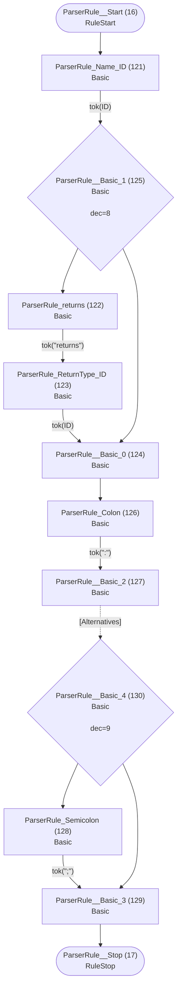
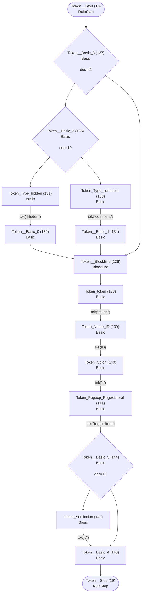
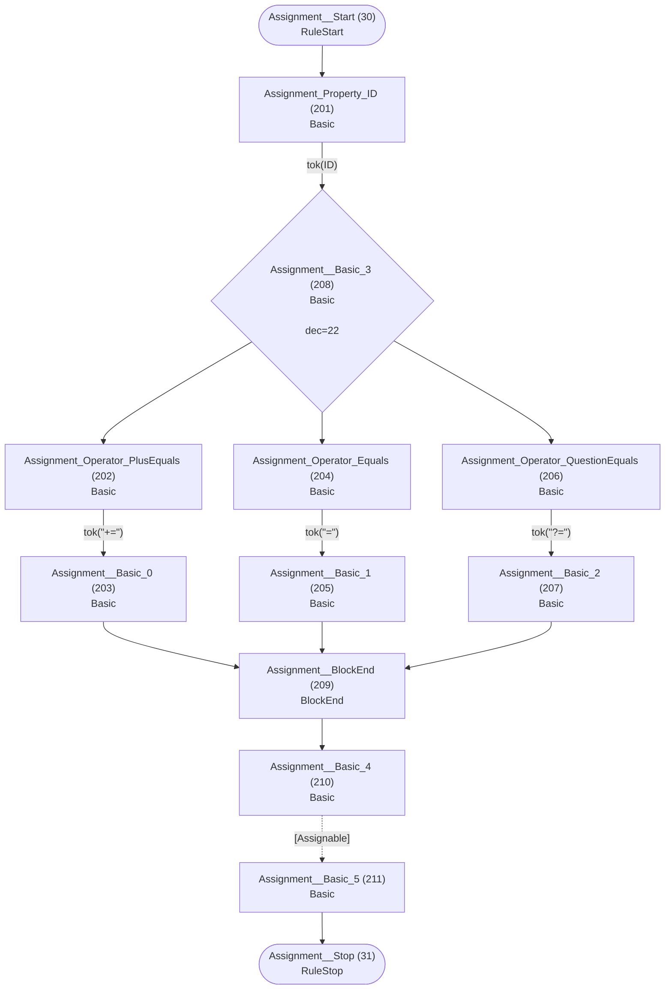
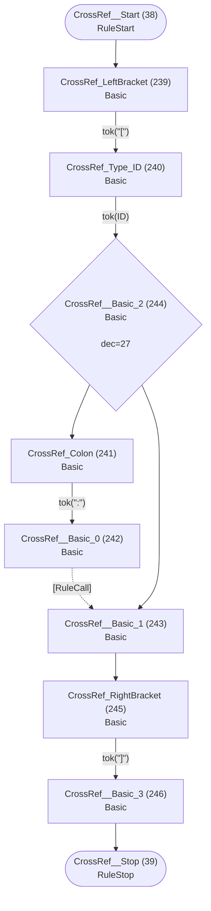

# Runtime ATN for grammar

## Grammar


## Interface


## Field


## FieldType


## ArrayType


## ReferenceType


## SimpleType


## PrimitiveType


## ParserRule



## Token



## TokenGroup


## Alternatives


## Group


## Element


## Keyword


## Assignment



## Assignable


## AssignableWithoutAlts


## AssignableAlternatives


## CrossRef



## RuleCall

```mermaid
flowchart TD
    q40(["RuleCall__Start (40)<br/>RuleStart"])
    q41(["RuleCall__Stop (41)<br/>RuleStop"])
    q247["RuleCall_Rule_ID (247)<br/>Basic<br/>"]
    q248["RuleCall__Basic (248)<br/>Basic<br/>"]

    q40 --> q247
    q247 -->|"tok(ID)"| q248
    q248 --> q41
```

## Action

```mermaid
flowchart TD
    q42(["Action__Start (42)<br/>RuleStart"])
    q43(["Action__Stop (43)<br/>RuleStop"])
    q249["Action_LeftBrace (249)<br/>Basic<br/>"]
    q250["Action_Type_ID (250)<br/>Basic<br/>"]
    q251["Action_Dot (251)<br/>Basic<br/>"]
    q252["Action_Property_ID (252)<br/>Basic<br/>"]
    q253["Action_Operator_PlusEquals (253)<br/>Basic<br/>"]
    q254["Action__Basic_0 (254)<br/>Basic<br/>"]
    q255["Action_Operator_Equals (255)<br/>Basic<br/>"]
    q256["Action__Basic_1 (256)<br/>Basic<br/>"]
    q257{"Action__Basic_2 (257)<br/>Basic<br/><br/>dec=28"}
    q258["Action__BlockEnd (258)<br/>BlockEnd<br/>"]
    q259["Action_current (259)<br/>Basic<br/>"]
    q260["Action__Basic_3 (260)<br/>Basic<br/>"]
    q261{"Action__Basic_4 (261)<br/>Basic<br/><br/>dec=29"}
    q262["Action_RightBrace (262)<br/>Basic<br/>"]
    q263["Action__Basic_5 (263)<br/>Basic<br/>"]

    q42 --> q249
    q249 -->|"tok(&quot;{&quot;)"| q250
    q250 -->|"tok(ID)"| q261
    q251 -->|"tok(&quot;.&quot;)"| q252
    q252 -->|"tok(ID)"| q257
    q253 -->|"tok(&quot;+=&quot;)"| q254
    q254 --> q258
    q255 -->|"tok(&quot;=&quot;)"| q256
    q256 --> q258
    q257 --> q253
    q257 --> q255
    q258 --> q259
    q259 -->|"tok(&quot;current&quot;)"| q260
    q260 --> q262
    q261 --> q251
    q261 --> q260
    q262 -->|"tok(&quot;}&quot;)"| q263
    q263 --> q43
```

## CompositeRule

```mermaid
flowchart TD
    q44(["CompositeRule__Start (44)<br/>RuleStart"])
    q45(["CompositeRule__Stop (45)<br/>RuleStop"])
    q264["CompositeRule_composite (264)<br/>Basic<br/>"]
    q265["CompositeRule_Name_ID (265)<br/>Basic<br/>"]
    q266["CompositeRule_Colon (266)<br/>Basic<br/>"]
    q267["CompositeRule__Basic_0 (267)<br/>Basic<br/>"]
    q268["CompositeRule_Semicolon (268)<br/>Basic<br/>"]
    q269["CompositeRule__Basic_1 (269)<br/>Basic<br/>"]
    q270{"CompositeRule__Basic_2 (270)<br/>Basic<br/><br/>dec=30"}

    q44 --> q264
    q264 -->|"tok(&quot;composite&quot;)"| q265
    q265 -->|"tok(ID)"| q266
    q266 -->|"tok(&quot;:&quot;)"| q267
    q267 -.->|"[CompositeAlternatives]"| q270
    q268 -->|"tok(&quot;;&quot;)"| q269
    q269 --> q45
    q270 --> q268
    q270 --> q269
```

## CompositeAlternatives

```mermaid
flowchart TD
    q46(["CompositeAlternatives__Start (46)<br/>RuleStart"])
    q47(["CompositeAlternatives__Stop (47)<br/>RuleStop"])
    q271["CompositeAlternatives__Basic_0 (271)<br/>Basic<br/>"]
    q272["CompositeAlternatives_Pipe (272)<br/>Basic<br/>"]
    q273["CompositeAlternatives__Basic_1 (273)<br/>Basic<br/>"]
    q274["CompositeAlternatives__Basic_2 (274)<br/>Basic<br/>"]
    q275{"CompositeAlternatives__LoopBack (275)<br/>LoopBack<br/><br/>dec=31"}
    q276["CompositeAlternatives__LoopEnd (276)<br/>LoopEnd<br/>"]
    q277{"CompositeAlternatives__Basic_3 (277)<br/>Basic<br/><br/>dec=32"}

    q46 --> q271
    q271 -.->|"[CompositeGroup]"| q277
    q272 -->|"tok(&quot;|&quot;)"| q273
    q273 -.->|"[CompositeGroup]"| q274
    q274 --> q275
    q275 --> q272
    q275 --> q276
    q276 --> q47
    q277 --> q272
    q277 --> q276
```

## CompositeGroup

```mermaid
flowchart TD
    q48(["CompositeGroup__Start (48)<br/>RuleStart"])
    q49(["CompositeGroup__Stop (49)<br/>RuleStop"])
    q278["CompositeGroup__Basic_0 (278)<br/>Basic<br/>"]
    q279["CompositeGroup__Basic_1 (279)<br/>Basic<br/>"]
    q280["CompositeGroup__Basic_2 (280)<br/>Basic<br/>"]
    q281{"CompositeGroup__LoopBack (281)<br/>LoopBack<br/><br/>dec=33"}
    q282["CompositeGroup__LoopEnd (282)<br/>LoopEnd<br/>"]
    q283{"CompositeGroup__Basic_3 (283)<br/>Basic<br/><br/>dec=34"}

    q48 --> q278
    q278 -.->|"[CompositeElement]"| q283
    q279 -.->|"[CompositeElement]"| q280
    q280 --> q281
    q281 --> q279
    q281 --> q282
    q282 --> q49
    q283 --> q279
    q283 --> q282
```

## CompositeElement

```mermaid
flowchart TD
    q50(["CompositeElement__Start (50)<br/>RuleStart"])
    q51(["CompositeElement__Stop (51)<br/>RuleStop"])
    q284["CompositeElement__Basic_0 (284)<br/>Basic<br/>"]
    q285["CompositeElement__Basic_1 (285)<br/>Basic<br/>"]
    q286["CompositeElement__Basic_2 (286)<br/>Basic<br/>"]
    q287["CompositeElement__Basic_3 (287)<br/>Basic<br/>"]
    q288["CompositeElement_LeftParen (288)<br/>Basic<br/>"]
    q289["CompositeElement__Basic_4 (289)<br/>Basic<br/>"]
    q290["CompositeElement_RightParen (290)<br/>Basic<br/>"]
    q291["CompositeElement__Basic_5 (291)<br/>Basic<br/>"]
    q292{"CompositeElement__Basic_6 (292)<br/>Basic<br/><br/>dec=35"}
    q293["CompositeElement__BlockEnd_0 (293)<br/>BlockEnd<br/>"]
    q294["CompositeElement_Cardinality_Asterisk (294)<br/>Basic<br/>"]
    q295["CompositeElement__Basic_7 (295)<br/>Basic<br/>"]
    q296["CompositeElement_Cardinality_Plus (296)<br/>Basic<br/>"]
    q297["CompositeElement__Basic_8 (297)<br/>Basic<br/>"]
    q298["CompositeElement_Cardinality_Question (298)<br/>Basic<br/>"]
    q299["CompositeElement__Basic_9 (299)<br/>Basic<br/>"]
    q300{"CompositeElement__Basic_10 (300)<br/>Basic<br/><br/>dec=36"}
    q301["CompositeElement__BlockEnd_1 (301)<br/>BlockEnd<br/>"]
    q302{"CompositeElement__Basic_11 (302)<br/>Basic<br/><br/>dec=37"}

    q50 --> q292
    q284 -.->|"[Keyword]"| q285
    q285 --> q293
    q286 -.->|"[RuleCall]"| q287
    q287 --> q293
    q288 -->|"tok(&quot;(&quot;)"| q289
    q289 -.->|"[CompositeAlternatives]"| q290
    q290 -->|"tok(&quot;)&quot;)"| q291
    q291 --> q293
    q292 --> q284
    q292 --> q286
    q292 --> q288
    q293 --> q302
    q294 -->|"tok(&quot;*&quot;)"| q295
    q295 --> q301
    q296 -->|"tok(&quot;+&quot;)"| q297
    q297 --> q301
    q298 -->|"tok(&quot;?&quot;)"| q299
    q299 --> q301
    q300 --> q294
    q300 --> q296
    q300 --> q298
    q301 --> q51
    q302 --> q300
    q302 --> q301
```

