# Runtime ATN for grammar

## Grammar

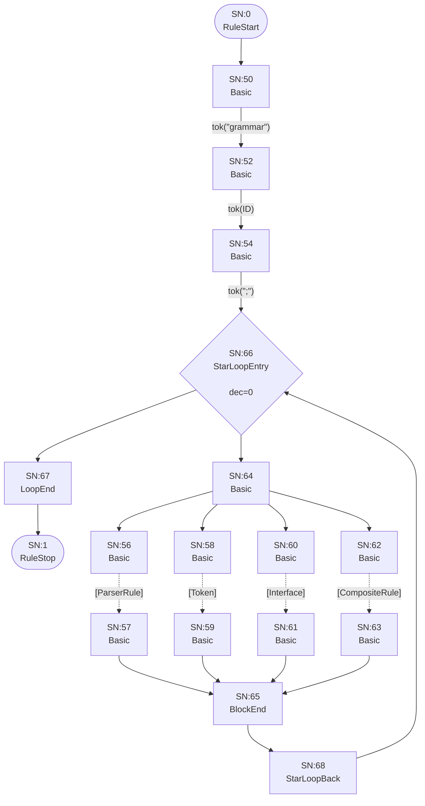

## Interface

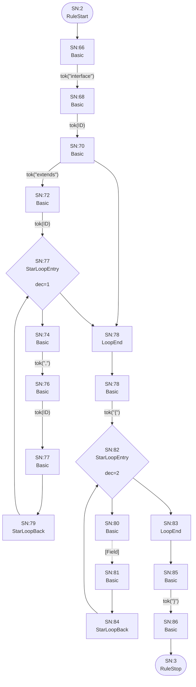

## Field

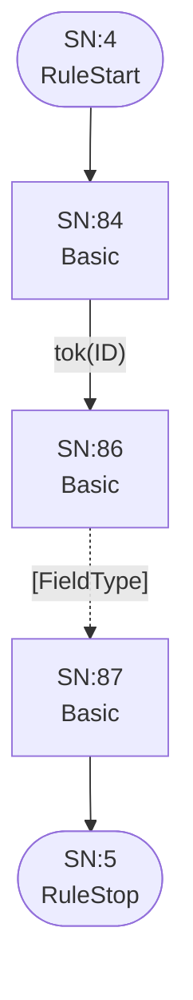

## FieldType

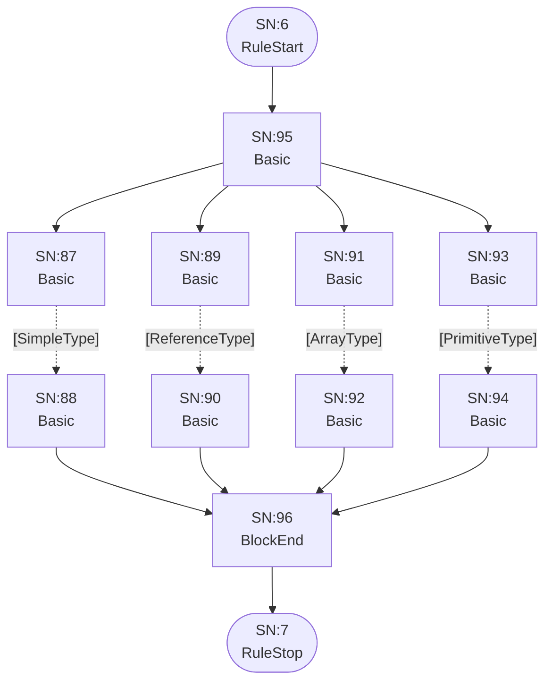

## ArrayType

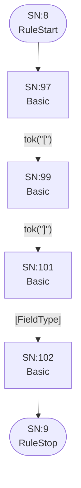

## ReferenceType

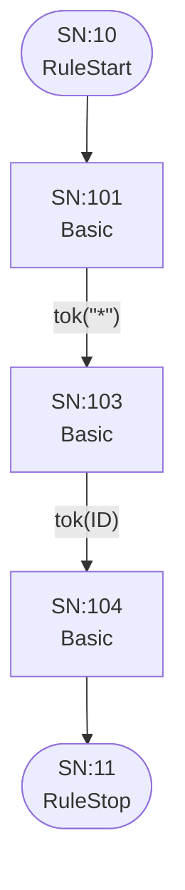

## SimpleType

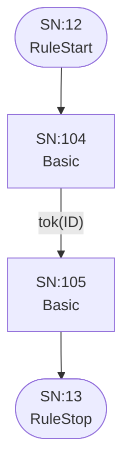

## PrimitiveType

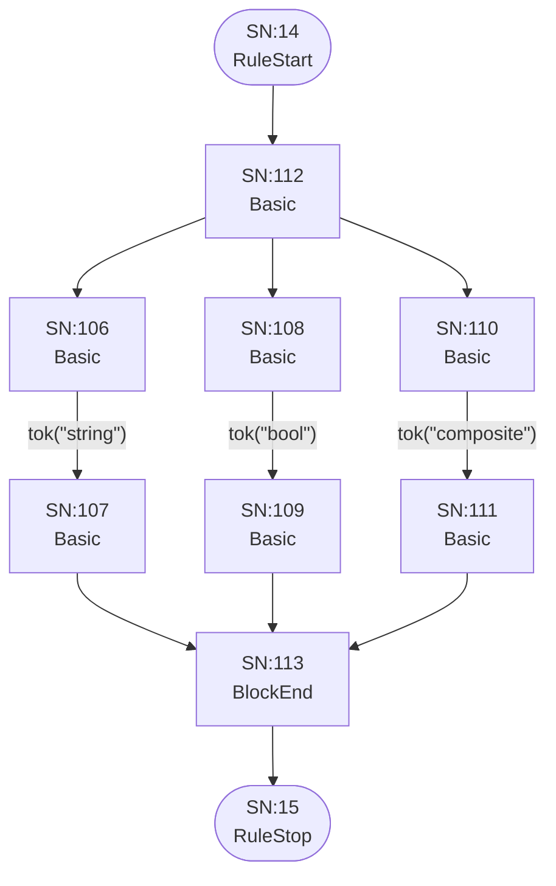

## ParserRule

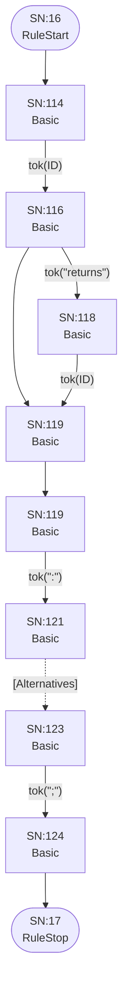

## Token


## Alternatives


## Group

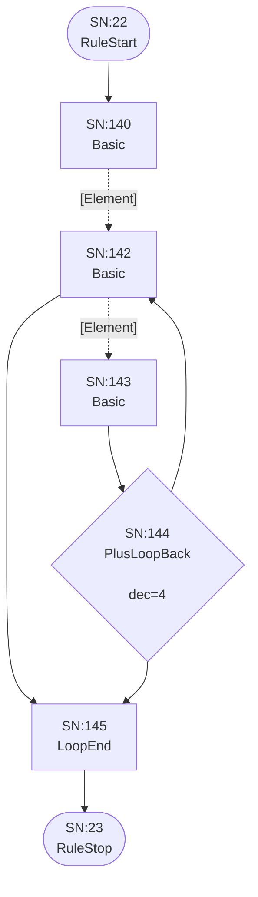

## Element


## Keyword

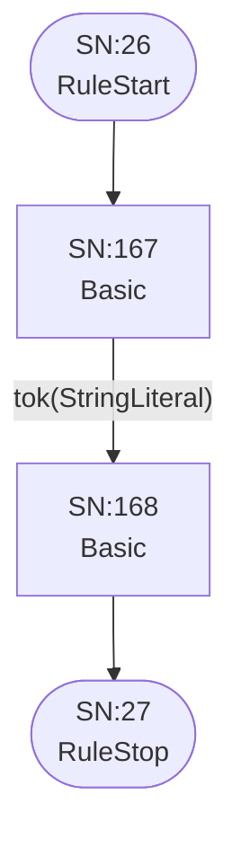

## Assignment

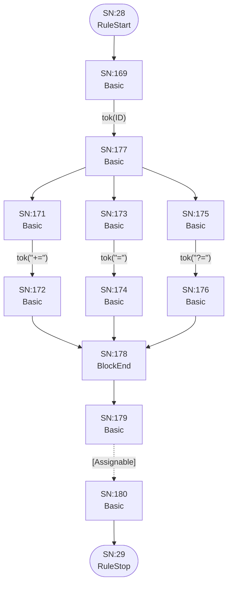

## Assignable


## AssignableWithoutAlts

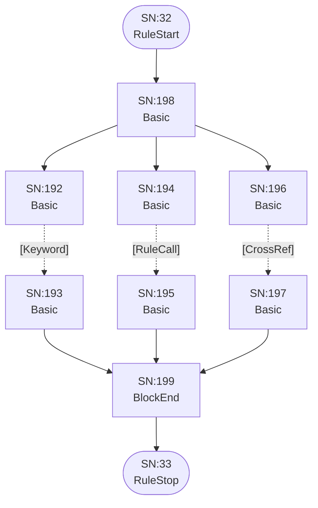

## AssignableAlternatives

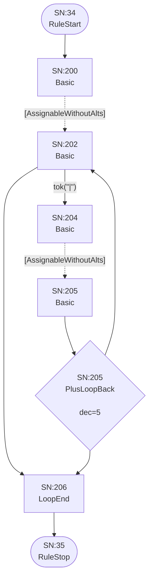

## CrossRef

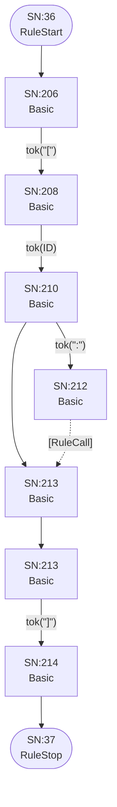

## RuleCall


## Action

```mermaid
flowchart TD
    q40(["SN:40<br/>RuleStart"])
    q41(["SN:41<br/>RuleStop"])
    q215["SN:215<br/>Basic<br/>"]
    q216["SN:217<br/>Basic<br/>"]
    q217["SN:219<br/>Basic<br/>"]
    q218["SN:221<br/>Basic<br/>"]
    q219["SN:223<br/>Basic<br/>"]
    q220["SN:224<br/>Basic<br/>"]
    q221["SN:225<br/>Basic<br/>"]
    q222["SN:226<br/>Basic<br/>"]
    q223["SN:227<br/>Basic<br/>"]
    q224["SN:228<br/>BlockEnd<br/>"]
    q225["SN:229<br/>Basic<br/>"]
    q226["SN:230<br/>Basic<br/>"]
    q227["SN:229<br/>Basic<br/>"]
    q228["SN:230<br/>Basic<br/>"]

    q40 --> q215
    q215 -->|"tok(&quot;{&quot;)"| q216
    q216 -->|"tok(ID)"| q217
    q217 -->|"tok(&quot;.&quot;)"| q218
    q217 --> q226
    q218 -->|"tok(ID)"| q223
    q219 -->|"tok(&quot;+=&quot;)"| q220
    q220 --> q224
    q221 -->|"tok(&quot;=&quot;)"| q222
    q222 --> q224
    q223 --> q219
    q223 --> q221
    q224 --> q225
    q225 -->|"tok(&quot;current&quot;)"| q226
    q226 --> q227
    q227 -->|"tok(&quot;}&quot;)"| q228
    q228 --> q41
```

## CompositeRule

```mermaid
flowchart TD
    q42(["SN:42<br/>RuleStart"])
    q43(["SN:43<br/>RuleStop"])
    q229["SN:229<br/>Basic<br/>"]
    q230["SN:231<br/>Basic<br/>"]
    q231["SN:233<br/>Basic<br/>"]
    q232["SN:235<br/>Basic<br/>"]
    q233["SN:237<br/>Basic<br/>"]
    q234["SN:238<br/>Basic<br/>"]

    q42 --> q229
    q229 -->|"tok(&quot;composite&quot;)"| q230
    q230 -->|"tok(ID)"| q231
    q231 -->|"tok(&quot;:&quot;)"| q232
    q232 -.->|"[CompositeAlternatives]"| q233
    q233 -->|"tok(&quot;;&quot;)"| q234
    q234 --> q43
```

## CompositeAlternatives

```mermaid
flowchart TD
    q44(["SN:44<br/>RuleStart"])
    q45(["SN:45<br/>RuleStop"])
    q235["SN:235<br/>Basic<br/>"]
    q236["SN:237<br/>Basic<br/>"]
    q237["SN:239<br/>Basic<br/>"]
    q238["SN:240<br/>Basic<br/>"]
    q239{"SN:240<br/>PlusLoopBack<br/><br/>dec=6"}
    q240["SN:241<br/>LoopEnd<br/>"]

    q44 --> q235
    q235 -.->|"[CompositeGroup]"| q236
    q236 -->|"tok(&quot;|&quot;)"| q237
    q236 --> q240
    q237 -.->|"[CompositeGroup]"| q238
    q238 --> q239
    q239 --> q236
    q239 --> q240
    q240 --> q45
```

## CompositeGroup

```mermaid
flowchart TD
    q46(["SN:46<br/>RuleStart"])
    q47(["SN:47<br/>RuleStop"])
    q241["SN:241<br/>Basic<br/>"]
    q242["SN:243<br/>Basic<br/>"]
    q243["SN:244<br/>Basic<br/>"]
    q244{"SN:245<br/>PlusLoopBack<br/><br/>dec=7"}
    q245["SN:246<br/>LoopEnd<br/>"]

    q46 --> q241
    q241 -.->|"[CompositeElement]"| q242
    q242 -.->|"[CompositeElement]"| q243
    q242 --> q245
    q243 --> q244
    q244 --> q242
    q244 --> q245
    q245 --> q47
```

## CompositeElement

```mermaid
flowchart TD
    q48(["SN:48<br/>RuleStart"])
    q49(["SN:49<br/>RuleStop"])
    q246["SN:246<br/>Basic<br/>"]
    q247["SN:247<br/>Basic<br/>"]
    q248["SN:248<br/>Basic<br/>"]
    q249["SN:249<br/>Basic<br/>"]
    q250["SN:250<br/>Basic<br/>"]
    q251["SN:252<br/>Basic<br/>"]
    q252["SN:254<br/>Basic<br/>"]
    q253["SN:255<br/>Basic<br/>"]
    q254["SN:254<br/>Basic<br/>"]
    q255["SN:255<br/>BlockEnd<br/>"]
    q256["SN:256<br/>Basic<br/>"]
    q257["SN:257<br/>Basic<br/>"]
    q258["SN:258<br/>Basic<br/>"]
    q259["SN:259<br/>Basic<br/>"]
    q260["SN:260<br/>Basic<br/>"]
    q261["SN:261<br/>Basic<br/>"]
    q262["SN:262<br/>Basic<br/>"]
    q263["SN:263<br/>BlockEnd<br/>"]

    q48 --> q254
    q246 -.->|"[Keyword]"| q247
    q247 --> q255
    q248 -.->|"[RuleCall]"| q249
    q249 --> q255
    q250 -->|"tok(&quot;(&quot;)"| q251
    q251 -.->|"[CompositeAlternatives]"| q252
    q252 -->|"tok(&quot;)&quot;)"| q253
    q253 --> q255
    q254 --> q246
    q254 --> q248
    q254 --> q250
    q255 --> q262
    q256 -->|"tok(&quot;*&quot;)"| q257
    q257 --> q263
    q258 -->|"tok(&quot;+&quot;)"| q259
    q259 --> q263
    q260 -->|"tok(&quot;?&quot;)"| q261
    q261 --> q263
    q262 --> q256
    q262 --> q258
    q262 --> q260
    q262 --> q263
    q263 --> q49
```

