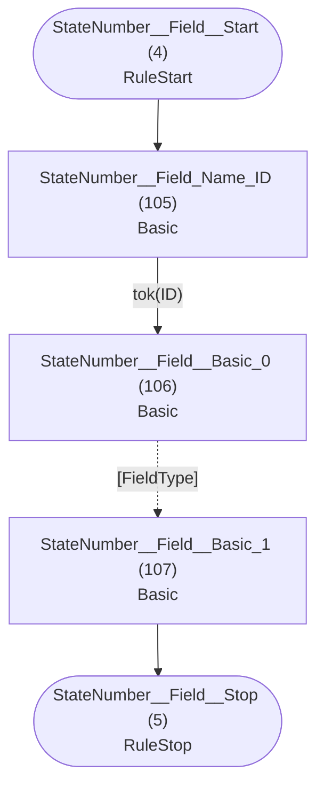
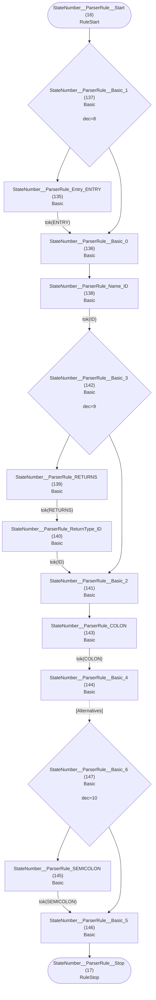
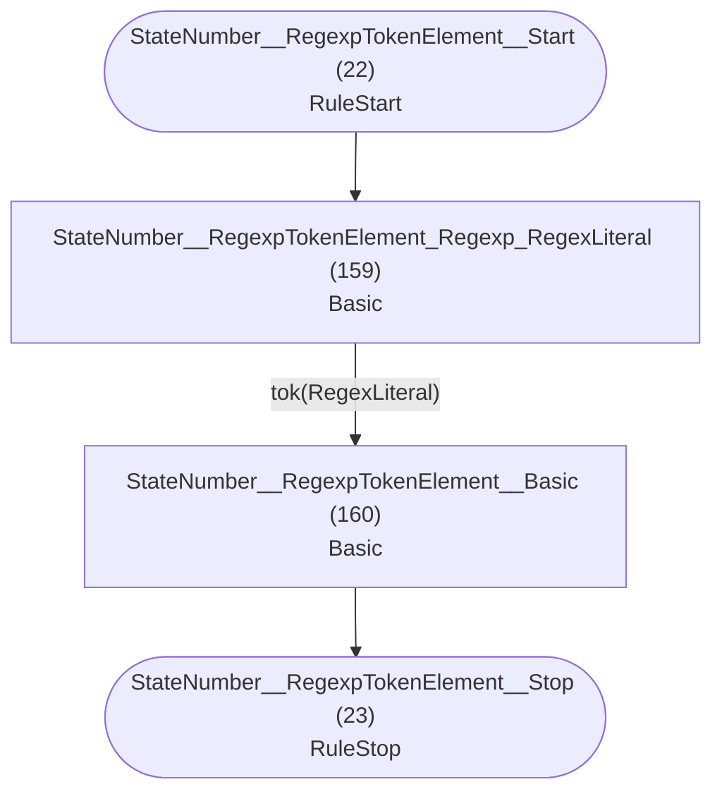
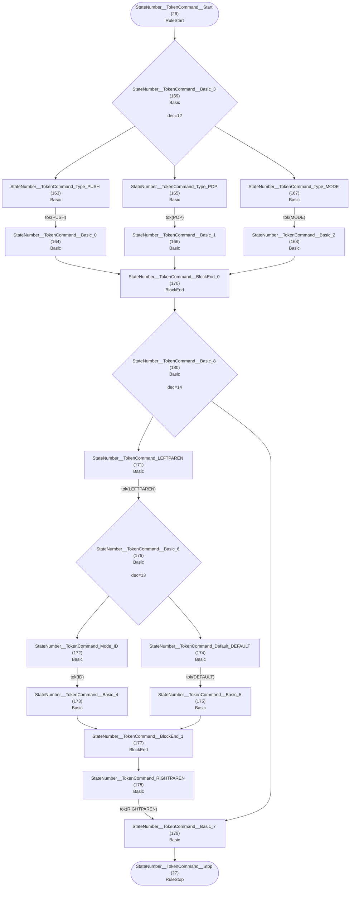
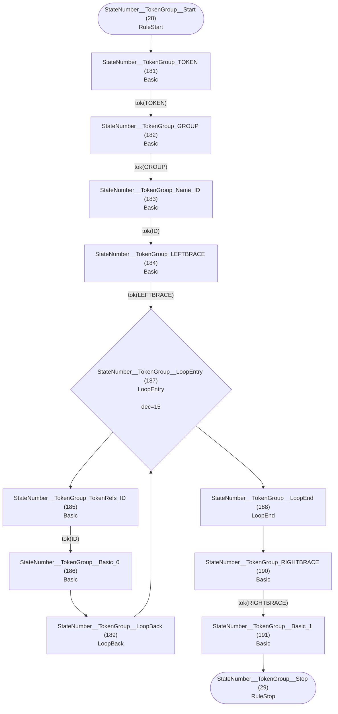
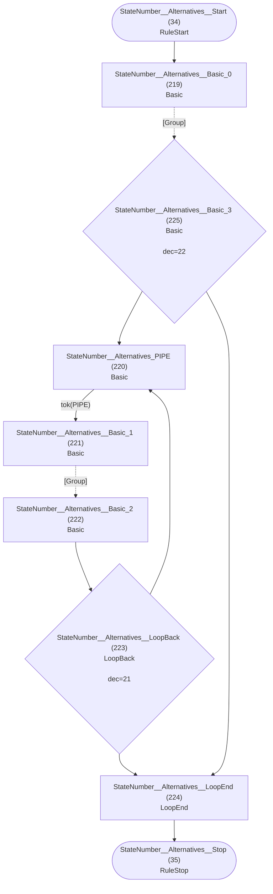
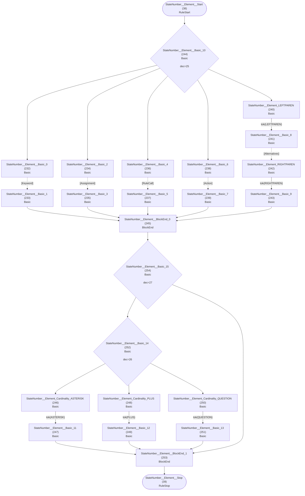

# Runtime ATN for grammar

## Grammar

```mermaid
flowchart TD
    q0(["StateNumber__Grammar__Start (0)<br/>RuleStart"])
    q1(["StateNumber__Grammar__Stop (1)<br/>RuleStop"])
    q64["StateNumber__Grammar_GRAMMAR (64)<br/>Basic<br/>"]
    q65["StateNumber__Grammar_Name_ID (65)<br/>Basic<br/>"]
    q66["StateNumber__Grammar_SEMICOLON (66)<br/>Basic<br/>"]
    q67["StateNumber__Grammar__Basic_0 (67)<br/>Basic<br/>"]
    q68{"StateNumber__Grammar__Basic_1 (68)<br/>Basic<br/><br/>dec=0"}
    q69["StateNumber__Grammar__Basic_2 (69)<br/>Basic<br/>"]
    q70["StateNumber__Grammar__Basic_3 (70)<br/>Basic<br/>"]
    q71["StateNumber__Grammar__Basic_4 (71)<br/>Basic<br/>"]
    q72["StateNumber__Grammar__Basic_5 (72)<br/>Basic<br/>"]
    q73["StateNumber__Grammar__Basic_6 (73)<br/>Basic<br/>"]
    q74["StateNumber__Grammar__Basic_7 (74)<br/>Basic<br/>"]
    q75["StateNumber__Grammar__Basic_8 (75)<br/>Basic<br/>"]
    q76["StateNumber__Grammar__Basic_9 (76)<br/>Basic<br/>"]
    q77["StateNumber__Grammar__Basic_10 (77)<br/>Basic<br/>"]
    q78["StateNumber__Grammar__Basic_11 (78)<br/>Basic<br/>"]
    q79["StateNumber__Grammar__Basic_12 (79)<br/>Basic<br/>"]
    q80["StateNumber__Grammar__Basic_13 (80)<br/>Basic<br/>"]
    q81{"StateNumber__Grammar__Basic_14 (81)<br/>Basic<br/><br/>dec=1"}
    q82["StateNumber__Grammar__BlockEnd (82)<br/>BlockEnd<br/>"]
    q83{"StateNumber__Grammar__LoopEntry (83)<br/>LoopEntry<br/><br/>dec=2"}
    q84["StateNumber__Grammar__LoopEnd (84)<br/>LoopEnd<br/>"]
    q85["StateNumber__Grammar__LoopBack (85)<br/>LoopBack<br/>"]

    q0 --> q64
    q64 -->|"tok(GRAMMAR)"| q65
    q65 -->|"tok(ID)"| q68
    q66 -->|"tok(SEMICOLON)"| q67
    q67 --> q83
    q68 --> q66
    q68 --> q67
    q69 -.->|"[ParserRule]"| q70
    q70 --> q82
    q71 -.->|"[Token]"| q72
    q72 --> q82
    q73 -.->|"[TokenGroup]"| q74
    q74 --> q82
    q75 -.->|"[TokenMode]"| q76
    q76 --> q82
    q77 -.->|"[Interface]"| q78
    q78 --> q82
    q79 -.->|"[CompositeRule]"| q80
    q80 --> q82
    q81 --> q69
    q81 --> q71
    q81 --> q73
    q81 --> q75
    q81 --> q77
    q81 --> q79
    q82 --> q85
    q83 --> q81
    q83 --> q84
    q84 --> q1
    q85 --> q83
```

## Interface

```mermaid
flowchart TD
    q2(["StateNumber__Interface__Start (2)<br/>RuleStart"])
    q3(["StateNumber__Interface__Stop (3)<br/>RuleStop"])
    q86["StateNumber__Interface_INTERFACE (86)<br/>Basic<br/>"]
    q87["StateNumber__Interface_Name_ID (87)<br/>Basic<br/>"]
    q88["StateNumber__Interface_EXTENDS (88)<br/>Basic<br/>"]
    q89["StateNumber__Interface_Extends_ID_0 (89)<br/>Basic<br/>"]
    q90["StateNumber__Interface_COMMA (90)<br/>Basic<br/>"]
    q91["StateNumber__Interface_Extends_ID_1 (91)<br/>Basic<br/>"]
    q92["StateNumber__Interface__Basic_0 (92)<br/>Basic<br/>"]
    q93{"StateNumber__Interface__LoopEntry_0 (93)<br/>LoopEntry<br/><br/>dec=3"}
    q94["StateNumber__Interface__LoopEnd_0 (94)<br/>LoopEnd<br/>"]
    q95["StateNumber__Interface__LoopBack_0 (95)<br/>LoopBack<br/>"]
    q96{"StateNumber__Interface__Basic_1 (96)<br/>Basic<br/><br/>dec=4"}
    q97["StateNumber__Interface_LEFTBRACE (97)<br/>Basic<br/>"]
    q98["StateNumber__Interface__Basic_2 (98)<br/>Basic<br/>"]
    q99["StateNumber__Interface__Basic_3 (99)<br/>Basic<br/>"]
    q100{"StateNumber__Interface__LoopEntry_1 (100)<br/>LoopEntry<br/><br/>dec=5"}
    q101["StateNumber__Interface__LoopEnd_1 (101)<br/>LoopEnd<br/>"]
    q102["StateNumber__Interface__LoopBack_1 (102)<br/>LoopBack<br/>"]
    q103["StateNumber__Interface_RIGHTBRACE (103)<br/>Basic<br/>"]
    q104["StateNumber__Interface__Basic_4 (104)<br/>Basic<br/>"]

    q2 --> q86
    q86 -->|"tok(INTERFACE)"| q87
    q87 -->|"tok(ID)"| q96
    q88 -->|"tok(EXTENDS)"| q89
    q89 -->|"tok(ID)"| q93
    q90 -->|"tok(COMMA)"| q91
    q91 -->|"tok(ID)"| q92
    q92 --> q95
    q93 --> q90
    q93 --> q94
    q94 --> q97
    q95 --> q93
    q96 --> q88
    q96 --> q94
    q97 -->|"tok(LEFTBRACE)"| q100
    q98 -.->|"[Field]"| q99
    q99 --> q102
    q100 --> q98
    q100 --> q101
    q101 --> q103
    q102 --> q100
    q103 -->|"tok(RIGHTBRACE)"| q104
    q104 --> q3
```

## Field

```mermaid
flowchart TD
    q4(["StateNumber__Field__Start (4)<br/>RuleStart"])
    q5(["StateNumber__Field__Stop (5)<br/>RuleStop"])
    q105["StateNumber__Field_Name_ID (105)<br/>Basic<br/>"]
    q106["StateNumber__Field__Basic_0 (106)<br/>Basic<br/>"]
    q107["StateNumber__Field__Basic_1 (107)<br/>Basic<br/>"]

    q4 --> q105
    q105 -->|"tok(ID)"| q106
    q106 -.->|"[FieldType]"| q107
    q107 --> q5
```

## FieldType

```mermaid
flowchart TD
    q6(["StateNumber__FieldType__Start (6)<br/>RuleStart"])
    q7(["StateNumber__FieldType__Stop (7)<br/>RuleStop"])
    q108["StateNumber__FieldType__Basic_0 (108)<br/>Basic<br/>"]
    q109["StateNumber__FieldType__Basic_1 (109)<br/>Basic<br/>"]
    q110["StateNumber__FieldType__Basic_2 (110)<br/>Basic<br/>"]
    q111["StateNumber__FieldType__Basic_3 (111)<br/>Basic<br/>"]
    q112["StateNumber__FieldType__Basic_4 (112)<br/>Basic<br/>"]
    q113["StateNumber__FieldType__Basic_5 (113)<br/>Basic<br/>"]
    q114["StateNumber__FieldType__Basic_6 (114)<br/>Basic<br/>"]
    q115["StateNumber__FieldType__Basic_7 (115)<br/>Basic<br/>"]
    q116{"StateNumber__FieldType__Basic_8 (116)<br/>Basic<br/><br/>dec=6"}
    q117["StateNumber__FieldType__BlockEnd (117)<br/>BlockEnd<br/>"]

    q6 --> q116
    q108 -.->|"[SimpleType]"| q109
    q109 --> q117
    q110 -.->|"[ReferenceType]"| q111
    q111 --> q117
    q112 -.->|"[ArrayType]"| q113
    q113 --> q117
    q114 -.->|"[PrimitiveType]"| q115
    q115 --> q117
    q116 --> q108
    q116 --> q110
    q116 --> q112
    q116 --> q114
    q117 --> q7
```

## ArrayType

```mermaid
flowchart TD
    q8(["StateNumber__ArrayType__Start (8)<br/>RuleStart"])
    q9(["StateNumber__ArrayType__Stop (9)<br/>RuleStop"])
    q118["StateNumber__ArrayType_LEFTBRACKET (118)<br/>Basic<br/>"]
    q119["StateNumber__ArrayType_RIGHTBRACKET (119)<br/>Basic<br/>"]
    q120["StateNumber__ArrayType__Basic_0 (120)<br/>Basic<br/>"]
    q121["StateNumber__ArrayType__Basic_1 (121)<br/>Basic<br/>"]

    q8 --> q118
    q118 -->|"tok(LEFTBRACKET)"| q119
    q119 -->|"tok(RIGHTBRACKET)"| q120
    q120 -.->|"[FieldType]"| q121
    q121 --> q9
```

## ReferenceType

```mermaid
flowchart TD
    q10(["StateNumber__ReferenceType__Start (10)<br/>RuleStart"])
    q11(["StateNumber__ReferenceType__Stop (11)<br/>RuleStop"])
    q122["StateNumber__ReferenceType_ASTERISK (122)<br/>Basic<br/>"]
    q123["StateNumber__ReferenceType_Type_ID (123)<br/>Basic<br/>"]
    q124["StateNumber__ReferenceType__Basic (124)<br/>Basic<br/>"]

    q10 --> q122
    q122 -->|"tok(ASTERISK)"| q123
    q123 -->|"tok(ID)"| q124
    q124 --> q11
```

## SimpleType

```mermaid
flowchart TD
    q12(["StateNumber__SimpleType__Start (12)<br/>RuleStart"])
    q13(["StateNumber__SimpleType__Stop (13)<br/>RuleStop"])
    q125["StateNumber__SimpleType_Type_ID (125)<br/>Basic<br/>"]
    q126["StateNumber__SimpleType__Basic (126)<br/>Basic<br/>"]

    q12 --> q125
    q125 -->|"tok(ID)"| q126
    q126 --> q13
```

## PrimitiveType

```mermaid
flowchart TD
    q14(["StateNumber__PrimitiveType__Start (14)<br/>RuleStart"])
    q15(["StateNumber__PrimitiveType__Stop (15)<br/>RuleStop"])
    q127["StateNumber__PrimitiveType_Type_STRING (127)<br/>Basic<br/>"]
    q128["StateNumber__PrimitiveType__Basic_0 (128)<br/>Basic<br/>"]
    q129["StateNumber__PrimitiveType_Type_BOOL (129)<br/>Basic<br/>"]
    q130["StateNumber__PrimitiveType__Basic_1 (130)<br/>Basic<br/>"]
    q131["StateNumber__PrimitiveType_Type_COMPOSITE (131)<br/>Basic<br/>"]
    q132["StateNumber__PrimitiveType__Basic_2 (132)<br/>Basic<br/>"]
    q133{"StateNumber__PrimitiveType__Basic_3 (133)<br/>Basic<br/><br/>dec=7"}
    q134["StateNumber__PrimitiveType__BlockEnd (134)<br/>BlockEnd<br/>"]

    q14 --> q133
    q127 -->|"tok(STRING)"| q128
    q128 --> q134
    q129 -->|"tok(BOOL)"| q130
    q130 --> q134
    q131 -->|"tok(COMPOSITE)"| q132
    q132 --> q134
    q133 --> q127
    q133 --> q129
    q133 --> q131
    q134 --> q15
```

## ParserRule

```mermaid
flowchart TD
    q16(["StateNumber__ParserRule__Start (16)<br/>RuleStart"])
    q17(["StateNumber__ParserRule__Stop (17)<br/>RuleStop"])
    q135["StateNumber__ParserRule_Entry_ENTRY (135)<br/>Basic<br/>"]
    q136["StateNumber__ParserRule__Basic_0 (136)<br/>Basic<br/>"]
    q137{"StateNumber__ParserRule__Basic_1 (137)<br/>Basic<br/><br/>dec=8"}
    q138["StateNumber__ParserRule_Name_ID (138)<br/>Basic<br/>"]
    q139["StateNumber__ParserRule_RETURNS (139)<br/>Basic<br/>"]
    q140["StateNumber__ParserRule_ReturnType_ID (140)<br/>Basic<br/>"]
    q141["StateNumber__ParserRule__Basic_2 (141)<br/>Basic<br/>"]
    q142{"StateNumber__ParserRule__Basic_3 (142)<br/>Basic<br/><br/>dec=9"}
    q143["StateNumber__ParserRule_COLON (143)<br/>Basic<br/>"]
    q144["StateNumber__ParserRule__Basic_4 (144)<br/>Basic<br/>"]
    q145["StateNumber__ParserRule_SEMICOLON (145)<br/>Basic<br/>"]
    q146["StateNumber__ParserRule__Basic_5 (146)<br/>Basic<br/>"]
    q147{"StateNumber__ParserRule__Basic_6 (147)<br/>Basic<br/><br/>dec=10"}

    q16 --> q137
    q135 -->|"tok(ENTRY)"| q136
    q136 --> q138
    q137 --> q135
    q137 --> q136
    q138 -->|"tok(ID)"| q142
    q139 -->|"tok(RETURNS)"| q140
    q140 -->|"tok(ID)"| q141
    q141 --> q143
    q142 --> q139
    q142 --> q141
    q143 -->|"tok(COLON)"| q144
    q144 -.->|"[Alternatives]"| q147
    q145 -->|"tok(SEMICOLON)"| q146
    q146 --> q17
    q147 --> q145
    q147 --> q146
```

## Token

```mermaid
flowchart TD
    q18(["StateNumber__Token__Start (18)<br/>RuleStart"])
    q19(["StateNumber__Token__Stop (19)<br/>RuleStop"])
    q148["StateNumber__Token_TOKEN (148)<br/>Basic<br/>"]
    q149["StateNumber__Token_Name_ID (149)<br/>Basic<br/>"]
    q150["StateNumber__Token_COLON (150)<br/>Basic<br/>"]
    q151["StateNumber__Token__Basic_0 (151)<br/>Basic<br/>"]
    q152["StateNumber__Token__Basic_1 (152)<br/>Basic<br/>"]

    q18 --> q148
    q148 -->|"tok(TOKEN)"| q149
    q149 -->|"tok(ID)"| q150
    q150 -->|"tok(COLON)"| q151
    q151 -.->|"[TokenElement]"| q152
    q152 --> q19
```

## TokenElement

```mermaid
flowchart TD
    q20(["StateNumber__TokenElement__Start (20)<br/>RuleStart"])
    q21(["StateNumber__TokenElement__Stop (21)<br/>RuleStop"])
    q153["StateNumber__TokenElement__Basic_0 (153)<br/>Basic<br/>"]
    q154["StateNumber__TokenElement__Basic_1 (154)<br/>Basic<br/>"]
    q155["StateNumber__TokenElement__Basic_2 (155)<br/>Basic<br/>"]
    q156["StateNumber__TokenElement__Basic_3 (156)<br/>Basic<br/>"]
    q157{"StateNumber__TokenElement__Basic_4 (157)<br/>Basic<br/><br/>dec=11"}
    q158["StateNumber__TokenElement__BlockEnd (158)<br/>BlockEnd<br/>"]

    q20 --> q157
    q153 -.->|"[RegexpTokenElement]"| q154
    q154 --> q158
    q155 -.->|"[KeywordTokenElement]"| q156
    q156 --> q158
    q157 --> q153
    q157 --> q155
    q158 --> q21
```

## RegexpTokenElement

```mermaid
flowchart TD
    q22(["StateNumber__RegexpTokenElement__Start (22)<br/>RuleStart"])
    q23(["StateNumber__RegexpTokenElement__Stop (23)<br/>RuleStop"])
    q159["StateNumber__RegexpTokenElement_Regexp_RegexLiteral (159)<br/>Basic<br/>"]
    q160["StateNumber__RegexpTokenElement__Basic (160)<br/>Basic<br/>"]

    q22 --> q159
    q159 -->|"tok(RegexLiteral)"| q160
    q160 --> q23
```

## KeywordTokenElement

```mermaid
flowchart TD
    q24(["StateNumber__KeywordTokenElement__Start (24)<br/>RuleStart"])
    q25(["StateNumber__KeywordTokenElement__Stop (25)<br/>RuleStop"])
    q161["StateNumber__KeywordTokenElement__Basic_0 (161)<br/>Basic<br/>"]
    q162["StateNumber__KeywordTokenElement__Basic_1 (162)<br/>Basic<br/>"]

    q24 --> q161
    q161 -.->|"[Keyword]"| q162
    q162 --> q25
```

## TokenCommand

```mermaid
flowchart TD
    q26(["StateNumber__TokenCommand__Start (26)<br/>RuleStart"])
    q27(["StateNumber__TokenCommand__Stop (27)<br/>RuleStop"])
    q163["StateNumber__TokenCommand_Type_PUSH (163)<br/>Basic<br/>"]
    q164["StateNumber__TokenCommand__Basic_0 (164)<br/>Basic<br/>"]
    q165["StateNumber__TokenCommand_Type_POP (165)<br/>Basic<br/>"]
    q166["StateNumber__TokenCommand__Basic_1 (166)<br/>Basic<br/>"]
    q167["StateNumber__TokenCommand_Type_MODE (167)<br/>Basic<br/>"]
    q168["StateNumber__TokenCommand__Basic_2 (168)<br/>Basic<br/>"]
    q169{"StateNumber__TokenCommand__Basic_3 (169)<br/>Basic<br/><br/>dec=12"}
    q170["StateNumber__TokenCommand__BlockEnd_0 (170)<br/>BlockEnd<br/>"]
    q171["StateNumber__TokenCommand_LEFTPAREN (171)<br/>Basic<br/>"]
    q172["StateNumber__TokenCommand_Mode_ID (172)<br/>Basic<br/>"]
    q173["StateNumber__TokenCommand__Basic_4 (173)<br/>Basic<br/>"]
    q174["StateNumber__TokenCommand_Default_DEFAULT (174)<br/>Basic<br/>"]
    q175["StateNumber__TokenCommand__Basic_5 (175)<br/>Basic<br/>"]
    q176{"StateNumber__TokenCommand__Basic_6 (176)<br/>Basic<br/><br/>dec=13"}
    q177["StateNumber__TokenCommand__BlockEnd_1 (177)<br/>BlockEnd<br/>"]
    q178["StateNumber__TokenCommand_RIGHTPAREN (178)<br/>Basic<br/>"]
    q179["StateNumber__TokenCommand__Basic_7 (179)<br/>Basic<br/>"]
    q180{"StateNumber__TokenCommand__Basic_8 (180)<br/>Basic<br/><br/>dec=14"}

    q26 --> q169
    q163 -->|"tok(PUSH)"| q164
    q164 --> q170
    q165 -->|"tok(POP)"| q166
    q166 --> q170
    q167 -->|"tok(MODE)"| q168
    q168 --> q170
    q169 --> q163
    q169 --> q165
    q169 --> q167
    q170 --> q180
    q171 -->|"tok(LEFTPAREN)"| q176
    q172 -->|"tok(ID)"| q173
    q173 --> q177
    q174 -->|"tok(DEFAULT)"| q175
    q175 --> q177
    q176 --> q172
    q176 --> q174
    q177 --> q178
    q178 -->|"tok(RIGHTPAREN)"| q179
    q179 --> q27
    q180 --> q171
    q180 --> q179
```

## TokenGroup

```mermaid
flowchart TD
    q28(["StateNumber__TokenGroup__Start (28)<br/>RuleStart"])
    q29(["StateNumber__TokenGroup__Stop (29)<br/>RuleStop"])
    q181["StateNumber__TokenGroup_TOKEN (181)<br/>Basic<br/>"]
    q182["StateNumber__TokenGroup_GROUP (182)<br/>Basic<br/>"]
    q183["StateNumber__TokenGroup_Name_ID (183)<br/>Basic<br/>"]
    q184["StateNumber__TokenGroup_LEFTBRACE (184)<br/>Basic<br/>"]
    q185["StateNumber__TokenGroup_TokenRefs_ID (185)<br/>Basic<br/>"]
    q186["StateNumber__TokenGroup__Basic_0 (186)<br/>Basic<br/>"]
    q187{"StateNumber__TokenGroup__LoopEntry (187)<br/>LoopEntry<br/><br/>dec=15"}
    q188["StateNumber__TokenGroup__LoopEnd (188)<br/>LoopEnd<br/>"]
    q189["StateNumber__TokenGroup__LoopBack (189)<br/>LoopBack<br/>"]
    q190["StateNumber__TokenGroup_RIGHTBRACE (190)<br/>Basic<br/>"]
    q191["StateNumber__TokenGroup__Basic_1 (191)<br/>Basic<br/>"]

    q28 --> q181
    q181 -->|"tok(TOKEN)"| q182
    q182 -->|"tok(GROUP)"| q183
    q183 -->|"tok(ID)"| q184
    q184 -->|"tok(LEFTBRACE)"| q187
    q185 -->|"tok(ID)"| q186
    q186 --> q189
    q187 --> q185
    q187 --> q188
    q188 --> q190
    q189 --> q187
    q190 -->|"tok(RIGHTBRACE)"| q191
    q191 --> q29
```

## TokenMode

```mermaid
flowchart TD
    q30(["StateNumber__TokenMode__Start (30)<br/>RuleStart"])
    q31(["StateNumber__TokenMode__Stop (31)<br/>RuleStop"])
    q192["StateNumber__TokenMode_TOKEN (192)<br/>Basic<br/>"]
    q193["StateNumber__TokenMode_MODE (193)<br/>Basic<br/>"]
    q194["StateNumber__TokenMode_Name_ID (194)<br/>Basic<br/>"]
    q195["StateNumber__TokenMode__Basic_0 (195)<br/>Basic<br/>"]
    q196["StateNumber__TokenMode_Default_DEFAULT (196)<br/>Basic<br/>"]
    q197["StateNumber__TokenMode__Basic_1 (197)<br/>Basic<br/>"]
    q198{"StateNumber__TokenMode__Basic_2 (198)<br/>Basic<br/><br/>dec=16"}
    q199["StateNumber__TokenMode__BlockEnd (199)<br/>BlockEnd<br/>"]
    q200["StateNumber__TokenMode_LEFTBRACE (200)<br/>Basic<br/>"]
    q201["StateNumber__TokenMode__Basic_3 (201)<br/>Basic<br/>"]
    q202["StateNumber__TokenMode__Basic_4 (202)<br/>Basic<br/>"]
    q203{"StateNumber__TokenMode__LoopEntry (203)<br/>LoopEntry<br/><br/>dec=17"}
    q204["StateNumber__TokenMode__LoopEnd (204)<br/>LoopEnd<br/>"]
    q205["StateNumber__TokenMode__LoopBack (205)<br/>LoopBack<br/>"]
    q206["StateNumber__TokenMode_RIGHTBRACE (206)<br/>Basic<br/>"]
    q207["StateNumber__TokenMode__Basic_5 (207)<br/>Basic<br/>"]

    q30 --> q192
    q192 -->|"tok(TOKEN)"| q193
    q193 -->|"tok(MODE)"| q198
    q194 -->|"tok(ID)"| q195
    q195 --> q199
    q196 -->|"tok(DEFAULT)"| q197
    q197 --> q199
    q198 --> q194
    q198 --> q196
    q199 --> q200
    q200 -->|"tok(LEFTBRACE)"| q203
    q201 -.->|"[TokenUsage]"| q202
    q202 --> q205
    q203 --> q201
    q203 --> q204
    q204 --> q206
    q205 --> q203
    q206 -->|"tok(RIGHTBRACE)"| q207
    q207 --> q31
```

## TokenUsage

```mermaid
flowchart TD
    q32(["StateNumber__TokenUsage__Start (32)<br/>RuleStart"])
    q33(["StateNumber__TokenUsage__Stop (33)<br/>RuleStop"])
    q208["StateNumber__TokenUsage_Type_HIDDEN (208)<br/>Basic<br/>"]
    q209["StateNumber__TokenUsage__Basic_0 (209)<br/>Basic<br/>"]
    q210["StateNumber__TokenUsage_Type_COMMENT (210)<br/>Basic<br/>"]
    q211["StateNumber__TokenUsage__Basic_1 (211)<br/>Basic<br/>"]
    q212{"StateNumber__TokenUsage__Basic_2 (212)<br/>Basic<br/><br/>dec=18"}
    q213["StateNumber__TokenUsage__BlockEnd (213)<br/>BlockEnd<br/>"]
    q214{"StateNumber__TokenUsage__Basic_3 (214)<br/>Basic<br/><br/>dec=19"}
    q215["StateNumber__TokenUsage_TokenRef_ID (215)<br/>Basic<br/>"]
    q216["StateNumber__TokenUsage__Basic_4 (216)<br/>Basic<br/>"]
    q217["StateNumber__TokenUsage__Basic_5 (217)<br/>Basic<br/>"]
    q218{"StateNumber__TokenUsage__Basic_6 (218)<br/>Basic<br/><br/>dec=20"}

    q32 --> q214
    q208 -->|"tok(HIDDEN)"| q209
    q209 --> q213
    q210 -->|"tok(COMMENT)"| q211
    q211 --> q213
    q212 --> q208
    q212 --> q210
    q213 --> q215
    q214 --> q212
    q214 --> q213
    q215 -->|"tok(ID)"| q218
    q216 -.->|"[TokenCommand]"| q217
    q217 --> q33
    q218 --> q216
    q218 --> q217
```

## Alternatives

```mermaid
flowchart TD
    q34(["StateNumber__Alternatives__Start (34)<br/>RuleStart"])
    q35(["StateNumber__Alternatives__Stop (35)<br/>RuleStop"])
    q219["StateNumber__Alternatives__Basic_0 (219)<br/>Basic<br/>"]
    q220["StateNumber__Alternatives_PIPE (220)<br/>Basic<br/>"]
    q221["StateNumber__Alternatives__Basic_1 (221)<br/>Basic<br/>"]
    q222["StateNumber__Alternatives__Basic_2 (222)<br/>Basic<br/>"]
    q223{"StateNumber__Alternatives__LoopBack (223)<br/>LoopBack<br/><br/>dec=21"}
    q224["StateNumber__Alternatives__LoopEnd (224)<br/>LoopEnd<br/>"]
    q225{"StateNumber__Alternatives__Basic_3 (225)<br/>Basic<br/><br/>dec=22"}

    q34 --> q219
    q219 -.->|"[Group]"| q225
    q220 -->|"tok(PIPE)"| q221
    q221 -.->|"[Group]"| q222
    q222 --> q223
    q223 --> q220
    q223 --> q224
    q224 --> q35
    q225 --> q220
    q225 --> q224
```

## Group

```mermaid
flowchart TD
    q36(["StateNumber__Group__Start (36)<br/>RuleStart"])
    q37(["StateNumber__Group__Stop (37)<br/>RuleStop"])
    q226["StateNumber__Group__Basic_0 (226)<br/>Basic<br/>"]
    q227["StateNumber__Group__Basic_1 (227)<br/>Basic<br/>"]
    q228["StateNumber__Group__Basic_2 (228)<br/>Basic<br/>"]
    q229{"StateNumber__Group__LoopBack (229)<br/>LoopBack<br/><br/>dec=23"}
    q230["StateNumber__Group__LoopEnd (230)<br/>LoopEnd<br/>"]
    q231{"StateNumber__Group__Basic_3 (231)<br/>Basic<br/><br/>dec=24"}

    q36 --> q226
    q226 -.->|"[Element]"| q231
    q227 -.->|"[Element]"| q228
    q228 --> q229
    q229 --> q227
    q229 --> q230
    q230 --> q37
    q231 --> q227
    q231 --> q230
```

## Element

```mermaid
flowchart TD
    q38(["StateNumber__Element__Start (38)<br/>RuleStart"])
    q39(["StateNumber__Element__Stop (39)<br/>RuleStop"])
    q232["StateNumber__Element__Basic_0 (232)<br/>Basic<br/>"]
    q233["StateNumber__Element__Basic_1 (233)<br/>Basic<br/>"]
    q234["StateNumber__Element__Basic_2 (234)<br/>Basic<br/>"]
    q235["StateNumber__Element__Basic_3 (235)<br/>Basic<br/>"]
    q236["StateNumber__Element__Basic_4 (236)<br/>Basic<br/>"]
    q237["StateNumber__Element__Basic_5 (237)<br/>Basic<br/>"]
    q238["StateNumber__Element__Basic_6 (238)<br/>Basic<br/>"]
    q239["StateNumber__Element__Basic_7 (239)<br/>Basic<br/>"]
    q240["StateNumber__Element_LEFTPAREN (240)<br/>Basic<br/>"]
    q241["StateNumber__Element__Basic_8 (241)<br/>Basic<br/>"]
    q242["StateNumber__Element_RIGHTPAREN (242)<br/>Basic<br/>"]
    q243["StateNumber__Element__Basic_9 (243)<br/>Basic<br/>"]
    q244{"StateNumber__Element__Basic_10 (244)<br/>Basic<br/><br/>dec=25"}
    q245["StateNumber__Element__BlockEnd_0 (245)<br/>BlockEnd<br/>"]
    q246["StateNumber__Element_Cardinality_ASTERISK (246)<br/>Basic<br/>"]
    q247["StateNumber__Element__Basic_11 (247)<br/>Basic<br/>"]
    q248["StateNumber__Element_Cardinality_PLUS (248)<br/>Basic<br/>"]
    q249["StateNumber__Element__Basic_12 (249)<br/>Basic<br/>"]
    q250["StateNumber__Element_Cardinality_QUESTION (250)<br/>Basic<br/>"]
    q251["StateNumber__Element__Basic_13 (251)<br/>Basic<br/>"]
    q252{"StateNumber__Element__Basic_14 (252)<br/>Basic<br/><br/>dec=26"}
    q253["StateNumber__Element__BlockEnd_1 (253)<br/>BlockEnd<br/>"]
    q254{"StateNumber__Element__Basic_15 (254)<br/>Basic<br/><br/>dec=27"}

    q38 --> q244
    q232 -.->|"[Keyword]"| q233
    q233 --> q245
    q234 -.->|"[Assignment]"| q235
    q235 --> q245
    q236 -.->|"[RuleCall]"| q237
    q237 --> q245
    q238 -.->|"[Action]"| q239
    q239 --> q245
    q240 -->|"tok(LEFTPAREN)"| q241
    q241 -.->|"[Alternatives]"| q242
    q242 -->|"tok(RIGHTPAREN)"| q243
    q243 --> q245
    q244 --> q232
    q244 --> q234
    q244 --> q236
    q244 --> q238
    q244 --> q240
    q245 --> q254
    q246 -->|"tok(ASTERISK)"| q247
    q247 --> q253
    q248 -->|"tok(PLUS)"| q249
    q249 --> q253
    q250 -->|"tok(QUESTION)"| q251
    q251 --> q253
    q252 --> q246
    q252 --> q248
    q252 --> q250
    q253 --> q39
    q254 --> q252
    q254 --> q253
```

## Keyword

```mermaid
flowchart TD
    q40(["StateNumber__Keyword__Start (40)<br/>RuleStart"])
    q41(["StateNumber__Keyword__Stop (41)<br/>RuleStop"])
    q255["StateNumber__Keyword_Value_StringLiteral (255)<br/>Basic<br/>"]
    q256["StateNumber__Keyword__Basic (256)<br/>Basic<br/>"]

    q40 --> q255
    q255 -->|"tok(StringLiteral)"| q256
    q256 --> q41
```

## Assignment

```mermaid
flowchart TD
    q42(["StateNumber__Assignment__Start (42)<br/>RuleStart"])
    q43(["StateNumber__Assignment__Stop (43)<br/>RuleStop"])
    q257["StateNumber__Assignment_Property_ID (257)<br/>Basic<br/>"]
    q258["StateNumber__Assignment_Operator_PLUS_EQUALS (258)<br/>Basic<br/>"]
    q259["StateNumber__Assignment__Basic_0 (259)<br/>Basic<br/>"]
    q260["StateNumber__Assignment_Operator_EQUALS (260)<br/>Basic<br/>"]
    q261["StateNumber__Assignment__Basic_1 (261)<br/>Basic<br/>"]
    q262["StateNumber__Assignment_Operator_QUESTION_EQUALS (262)<br/>Basic<br/>"]
    q263["StateNumber__Assignment__Basic_2 (263)<br/>Basic<br/>"]
    q264{"StateNumber__Assignment__Basic_3 (264)<br/>Basic<br/><br/>dec=28"}
    q265["StateNumber__Assignment__BlockEnd (265)<br/>BlockEnd<br/>"]
    q266["StateNumber__Assignment__Basic_4 (266)<br/>Basic<br/>"]
    q267["StateNumber__Assignment__Basic_5 (267)<br/>Basic<br/>"]

    q42 --> q257
    q257 -->|"tok(ID)"| q264
    q258 -->|"tok(PLUS_EQUALS)"| q259
    q259 --> q265
    q260 -->|"tok(EQUALS)"| q261
    q261 --> q265
    q262 -->|"tok(QUESTION_EQUALS)"| q263
    q263 --> q265
    q264 --> q258
    q264 --> q260
    q264 --> q262
    q265 --> q266
    q266 -.->|"[Assignable]"| q267
    q267 --> q43
```

## Assignable

```mermaid
flowchart TD
    q44(["StateNumber__Assignable__Start (44)<br/>RuleStart"])
    q45(["StateNumber__Assignable__Stop (45)<br/>RuleStop"])
    q268["StateNumber__Assignable__Basic_0 (268)<br/>Basic<br/>"]
    q269["StateNumber__Assignable__Basic_1 (269)<br/>Basic<br/>"]
    q270["StateNumber__Assignable__Basic_2 (270)<br/>Basic<br/>"]
    q271["StateNumber__Assignable__Basic_3 (271)<br/>Basic<br/>"]
    q272["StateNumber__Assignable_LEFTPAREN (272)<br/>Basic<br/>"]
    q273["StateNumber__Assignable__Basic_4 (273)<br/>Basic<br/>"]
    q274["StateNumber__Assignable_RIGHTPAREN (274)<br/>Basic<br/>"]
    q275["StateNumber__Assignable__Basic_5 (275)<br/>Basic<br/>"]
    q276{"StateNumber__Assignable__Basic_6 (276)<br/>Basic<br/><br/>dec=29"}
    q277["StateNumber__Assignable__BlockEnd (277)<br/>BlockEnd<br/>"]

    q44 --> q276
    q268 -.->|"[RuleCall]"| q269
    q269 --> q277
    q270 -.->|"[CrossRef]"| q271
    q271 --> q277
    q272 -->|"tok(LEFTPAREN)"| q273
    q273 -.->|"[AssignableAlternatives]"| q274
    q274 -->|"tok(RIGHTPAREN)"| q275
    q275 --> q277
    q276 --> q268
    q276 --> q270
    q276 --> q272
    q277 --> q45
```

## AssignableWithoutAlts

```mermaid
flowchart TD
    q46(["StateNumber__AssignableWithoutAlts__Start (46)<br/>RuleStart"])
    q47(["StateNumber__AssignableWithoutAlts__Stop (47)<br/>RuleStop"])
    q278["StateNumber__AssignableWithoutAlts__Basic_0 (278)<br/>Basic<br/>"]
    q279["StateNumber__AssignableWithoutAlts__Basic_1 (279)<br/>Basic<br/>"]
    q280["StateNumber__AssignableWithoutAlts__Basic_2 (280)<br/>Basic<br/>"]
    q281["StateNumber__AssignableWithoutAlts__Basic_3 (281)<br/>Basic<br/>"]
    q282{"StateNumber__AssignableWithoutAlts__Basic_4 (282)<br/>Basic<br/><br/>dec=30"}
    q283["StateNumber__AssignableWithoutAlts__BlockEnd (283)<br/>BlockEnd<br/>"]

    q46 --> q282
    q278 -.->|"[RuleCall]"| q279
    q279 --> q283
    q280 -.->|"[CrossRef]"| q281
    q281 --> q283
    q282 --> q278
    q282 --> q280
    q283 --> q47
```

## AssignableAlternatives

```mermaid
flowchart TD
    q48(["StateNumber__AssignableAlternatives__Start (48)<br/>RuleStart"])
    q49(["StateNumber__AssignableAlternatives__Stop (49)<br/>RuleStop"])
    q284["StateNumber__AssignableAlternatives__Basic_0 (284)<br/>Basic<br/>"]
    q285["StateNumber__AssignableAlternatives_PIPE (285)<br/>Basic<br/>"]
    q286["StateNumber__AssignableAlternatives__Basic_1 (286)<br/>Basic<br/>"]
    q287["StateNumber__AssignableAlternatives__Basic_2 (287)<br/>Basic<br/>"]
    q288{"StateNumber__AssignableAlternatives__LoopBack (288)<br/>LoopBack<br/><br/>dec=31"}
    q289["StateNumber__AssignableAlternatives__LoopEnd (289)<br/>LoopEnd<br/>"]
    q290{"StateNumber__AssignableAlternatives__Basic_3 (290)<br/>Basic<br/><br/>dec=32"}

    q48 --> q284
    q284 -.->|"[AssignableWithoutAlts]"| q290
    q285 -->|"tok(PIPE)"| q286
    q286 -.->|"[AssignableWithoutAlts]"| q287
    q287 --> q288
    q288 --> q285
    q288 --> q289
    q289 --> q49
    q290 --> q285
    q290 --> q289
```

## CrossRef

```mermaid
flowchart TD
    q50(["StateNumber__CrossRef__Start (50)<br/>RuleStart"])
    q51(["StateNumber__CrossRef__Stop (51)<br/>RuleStop"])
    q291["StateNumber__CrossRef_LEFTBRACKET (291)<br/>Basic<br/>"]
    q292["StateNumber__CrossRef_Type_ID (292)<br/>Basic<br/>"]
    q293["StateNumber__CrossRef_COLON (293)<br/>Basic<br/>"]
    q294["StateNumber__CrossRef__Basic_0 (294)<br/>Basic<br/>"]
    q295["StateNumber__CrossRef__Basic_1 (295)<br/>Basic<br/>"]
    q296{"StateNumber__CrossRef__Basic_2 (296)<br/>Basic<br/><br/>dec=33"}
    q297["StateNumber__CrossRef_RIGHTBRACKET (297)<br/>Basic<br/>"]
    q298["StateNumber__CrossRef__Basic_3 (298)<br/>Basic<br/>"]

    q50 --> q291
    q291 -->|"tok(LEFTBRACKET)"| q292
    q292 -->|"tok(ID)"| q296
    q293 -->|"tok(COLON)"| q294
    q294 -.->|"[RuleCall]"| q295
    q295 --> q297
    q296 --> q293
    q296 --> q295
    q297 -->|"tok(RIGHTBRACKET)"| q298
    q298 --> q51
```

## RuleCall

```mermaid
flowchart TD
    q52(["StateNumber__RuleCall__Start (52)<br/>RuleStart"])
    q53(["StateNumber__RuleCall__Stop (53)<br/>RuleStop"])
    q299["StateNumber__RuleCall_Rule_ID (299)<br/>Basic<br/>"]
    q300["StateNumber__RuleCall__Basic (300)<br/>Basic<br/>"]

    q52 --> q299
    q299 -->|"tok(ID)"| q300
    q300 --> q53
```

## Action

```mermaid
flowchart TD
    q54(["StateNumber__Action__Start (54)<br/>RuleStart"])
    q55(["StateNumber__Action__Stop (55)<br/>RuleStop"])
    q301["StateNumber__Action_LEFTBRACE (301)<br/>Basic<br/>"]
    q302["StateNumber__Action_Type_ID (302)<br/>Basic<br/>"]
    q303["StateNumber__Action_DOT (303)<br/>Basic<br/>"]
    q304["StateNumber__Action_Property_ID (304)<br/>Basic<br/>"]
    q305["StateNumber__Action_Operator_PLUS_EQUALS (305)<br/>Basic<br/>"]
    q306["StateNumber__Action__Basic_0 (306)<br/>Basic<br/>"]
    q307["StateNumber__Action_Operator_EQUALS (307)<br/>Basic<br/>"]
    q308["StateNumber__Action__Basic_1 (308)<br/>Basic<br/>"]
    q309{"StateNumber__Action__Basic_2 (309)<br/>Basic<br/><br/>dec=34"}
    q310["StateNumber__Action__BlockEnd (310)<br/>BlockEnd<br/>"]
    q311["StateNumber__Action_CURRENT (311)<br/>Basic<br/>"]
    q312["StateNumber__Action__Basic_3 (312)<br/>Basic<br/>"]
    q313{"StateNumber__Action__Basic_4 (313)<br/>Basic<br/><br/>dec=35"}
    q314["StateNumber__Action_RIGHTBRACE (314)<br/>Basic<br/>"]
    q315["StateNumber__Action__Basic_5 (315)<br/>Basic<br/>"]

    q54 --> q301
    q301 -->|"tok(LEFTBRACE)"| q302
    q302 -->|"tok(ID)"| q313
    q303 -->|"tok(DOT)"| q304
    q304 -->|"tok(ID)"| q309
    q305 -->|"tok(PLUS_EQUALS)"| q306
    q306 --> q310
    q307 -->|"tok(EQUALS)"| q308
    q308 --> q310
    q309 --> q305
    q309 --> q307
    q310 --> q311
    q311 -->|"tok(CURRENT)"| q312
    q312 --> q314
    q313 --> q303
    q313 --> q312
    q314 -->|"tok(RIGHTBRACE)"| q315
    q315 --> q55
```

## CompositeRule

```mermaid
flowchart TD
    q56(["StateNumber__CompositeRule__Start (56)<br/>RuleStart"])
    q57(["StateNumber__CompositeRule__Stop (57)<br/>RuleStop"])
    q316["StateNumber__CompositeRule_COMPOSITE (316)<br/>Basic<br/>"]
    q317["StateNumber__CompositeRule_Name_ID (317)<br/>Basic<br/>"]
    q318["StateNumber__CompositeRule_COLON (318)<br/>Basic<br/>"]
    q319["StateNumber__CompositeRule__Basic_0 (319)<br/>Basic<br/>"]
    q320["StateNumber__CompositeRule_SEMICOLON (320)<br/>Basic<br/>"]
    q321["StateNumber__CompositeRule__Basic_1 (321)<br/>Basic<br/>"]
    q322{"StateNumber__CompositeRule__Basic_2 (322)<br/>Basic<br/><br/>dec=36"}

    q56 --> q316
    q316 -->|"tok(COMPOSITE)"| q317
    q317 -->|"tok(ID)"| q318
    q318 -->|"tok(COLON)"| q319
    q319 -.->|"[CompositeAlternatives]"| q322
    q320 -->|"tok(SEMICOLON)"| q321
    q321 --> q57
    q322 --> q320
    q322 --> q321
```

## CompositeAlternatives

```mermaid
flowchart TD
    q58(["StateNumber__CompositeAlternatives__Start (58)<br/>RuleStart"])
    q59(["StateNumber__CompositeAlternatives__Stop (59)<br/>RuleStop"])
    q323["StateNumber__CompositeAlternatives__Basic_0 (323)<br/>Basic<br/>"]
    q324["StateNumber__CompositeAlternatives_PIPE (324)<br/>Basic<br/>"]
    q325["StateNumber__CompositeAlternatives__Basic_1 (325)<br/>Basic<br/>"]
    q326["StateNumber__CompositeAlternatives__Basic_2 (326)<br/>Basic<br/>"]
    q327{"StateNumber__CompositeAlternatives__LoopBack (327)<br/>LoopBack<br/><br/>dec=37"}
    q328["StateNumber__CompositeAlternatives__LoopEnd (328)<br/>LoopEnd<br/>"]
    q329{"StateNumber__CompositeAlternatives__Basic_3 (329)<br/>Basic<br/><br/>dec=38"}

    q58 --> q323
    q323 -.->|"[CompositeGroup]"| q329
    q324 -->|"tok(PIPE)"| q325
    q325 -.->|"[CompositeGroup]"| q326
    q326 --> q327
    q327 --> q324
    q327 --> q328
    q328 --> q59
    q329 --> q324
    q329 --> q328
```

## CompositeGroup

```mermaid
flowchart TD
    q60(["StateNumber__CompositeGroup__Start (60)<br/>RuleStart"])
    q61(["StateNumber__CompositeGroup__Stop (61)<br/>RuleStop"])
    q330["StateNumber__CompositeGroup__Basic_0 (330)<br/>Basic<br/>"]
    q331["StateNumber__CompositeGroup__Basic_1 (331)<br/>Basic<br/>"]
    q332["StateNumber__CompositeGroup__Basic_2 (332)<br/>Basic<br/>"]
    q333{"StateNumber__CompositeGroup__LoopBack (333)<br/>LoopBack<br/><br/>dec=39"}
    q334["StateNumber__CompositeGroup__LoopEnd (334)<br/>LoopEnd<br/>"]
    q335{"StateNumber__CompositeGroup__Basic_3 (335)<br/>Basic<br/><br/>dec=40"}

    q60 --> q330
    q330 -.->|"[CompositeElement]"| q335
    q331 -.->|"[CompositeElement]"| q332
    q332 --> q333
    q333 --> q331
    q333 --> q334
    q334 --> q61
    q335 --> q331
    q335 --> q334
```

## CompositeElement

```mermaid
flowchart TD
    q62(["StateNumber__CompositeElement__Start (62)<br/>RuleStart"])
    q63(["StateNumber__CompositeElement__Stop (63)<br/>RuleStop"])
    q336["StateNumber__CompositeElement__Basic_0 (336)<br/>Basic<br/>"]
    q337["StateNumber__CompositeElement__Basic_1 (337)<br/>Basic<br/>"]
    q338["StateNumber__CompositeElement_LEFTPAREN (338)<br/>Basic<br/>"]
    q339["StateNumber__CompositeElement__Basic_2 (339)<br/>Basic<br/>"]
    q340["StateNumber__CompositeElement_RIGHTPAREN (340)<br/>Basic<br/>"]
    q341["StateNumber__CompositeElement__Basic_3 (341)<br/>Basic<br/>"]
    q342{"StateNumber__CompositeElement__Basic_4 (342)<br/>Basic<br/><br/>dec=41"}
    q343["StateNumber__CompositeElement__BlockEnd_0 (343)<br/>BlockEnd<br/>"]
    q344["StateNumber__CompositeElement_Cardinality_ASTERISK (344)<br/>Basic<br/>"]
    q345["StateNumber__CompositeElement__Basic_5 (345)<br/>Basic<br/>"]
    q346["StateNumber__CompositeElement_Cardinality_PLUS (346)<br/>Basic<br/>"]
    q347["StateNumber__CompositeElement__Basic_6 (347)<br/>Basic<br/>"]
    q348["StateNumber__CompositeElement_Cardinality_QUESTION (348)<br/>Basic<br/>"]
    q349["StateNumber__CompositeElement__Basic_7 (349)<br/>Basic<br/>"]
    q350{"StateNumber__CompositeElement__Basic_8 (350)<br/>Basic<br/><br/>dec=42"}
    q351["StateNumber__CompositeElement__BlockEnd_1 (351)<br/>BlockEnd<br/>"]
    q352{"StateNumber__CompositeElement__Basic_9 (352)<br/>Basic<br/><br/>dec=43"}

    q62 --> q342
    q336 -.->|"[RuleCall]"| q337
    q337 --> q343
    q338 -->|"tok(LEFTPAREN)"| q339
    q339 -.->|"[CompositeAlternatives]"| q340
    q340 -->|"tok(RIGHTPAREN)"| q341
    q341 --> q343
    q342 --> q336
    q342 --> q338
    q343 --> q352
    q344 -->|"tok(ASTERISK)"| q345
    q345 --> q351
    q346 -->|"tok(PLUS)"| q347
    q347 --> q351
    q348 -->|"tok(QUESTION)"| q349
    q349 --> q351
    q350 --> q344
    q350 --> q346
    q350 --> q348
    q351 --> q63
    q352 --> q350
    q352 --> q351
```

