# Runtime ATN for grammar

## Grammar

```mermaid
flowchart TD
    q0(["StateNumber__Grammar__Start (0)<br/>RuleStart"])
    q1(["StateNumber__Grammar__Stop (1)<br/>RuleStop"])
    q64["StateNumber__Grammar_GRAMMAR (64)<br/>Basic<br/>"]
    q65["StateNumber__Grammar_Name_ID (65)<br/>Basic<br/>"]
    q66["StateNumber__Grammar_SEMICOLON (66)<br/>Basic<br/>"]
    q67["StateNumber__Grammar__Basic_0 (67)<br/>Basic<br/>"]
    q68{"StateNumber__Grammar__Basic_1 (68)<br/>Basic<br/><br/>dec=0"}
    q69["StateNumber__Grammar__Basic_2 (69)<br/>Basic<br/>"]
    q70["StateNumber__Grammar__Basic_3 (70)<br/>Basic<br/>"]
    q71["StateNumber__Grammar__Basic_4 (71)<br/>Basic<br/>"]
    q72["StateNumber__Grammar__Basic_5 (72)<br/>Basic<br/>"]
    q73["StateNumber__Grammar__Basic_6 (73)<br/>Basic<br/>"]
    q74["StateNumber__Grammar__Basic_7 (74)<br/>Basic<br/>"]
    q75["StateNumber__Grammar__Basic_8 (75)<br/>Basic<br/>"]
    q76["StateNumber__Grammar__Basic_9 (76)<br/>Basic<br/>"]
    q77["StateNumber__Grammar__Basic_10 (77)<br/>Basic<br/>"]
    q78["StateNumber__Grammar__Basic_11 (78)<br/>Basic<br/>"]
    q79["StateNumber__Grammar__Basic_12 (79)<br/>Basic<br/>"]
    q80["StateNumber__Grammar__Basic_13 (80)<br/>Basic<br/>"]
    q81{"StateNumber__Grammar__Basic_14 (81)<br/>Basic<br/><br/>dec=1"}
    q82["StateNumber__Grammar__BlockEnd (82)<br/>BlockEnd<br/>"]
    q83{"StateNumber__Grammar__LoopEntry (83)<br/>LoopEntry<br/><br/>dec=2"}
    q84["StateNumber__Grammar__LoopEnd (84)<br/>LoopEnd<br/>"]
    q85["StateNumber__Grammar__LoopBack (85)<br/>LoopBack<br/>"]

    q0 --> q64
    q64 -->|"tok(GRAMMAR)"| q65
    q65 -->|"tok(ID)"| q68
    q66 -->|"tok(SEMICOLON)"| q67
    q67 --> q83
    q68 --> q66
    q68 --> q67
    q69 -.->|"[ParserRule]"| q70
    q70 --> q82
    q71 -.->|"[Token]"| q72
    q72 --> q82
    q73 -.->|"[TokenGroup]"| q74
    q74 --> q82
    q75 -.->|"[TokenMode]"| q76
    q76 --> q82
    q77 -.->|"[Interface]"| q78
    q78 --> q82
    q79 -.->|"[CompositeRule]"| q80
    q80 --> q82
    q81 --> q69
    q81 --> q71
    q81 --> q73
    q81 --> q75
    q81 --> q77
    q81 --> q79
    q82 --> q85
    q83 --> q81
    q83 --> q84
    q84 --> q1
    q85 --> q83
```

## Interface

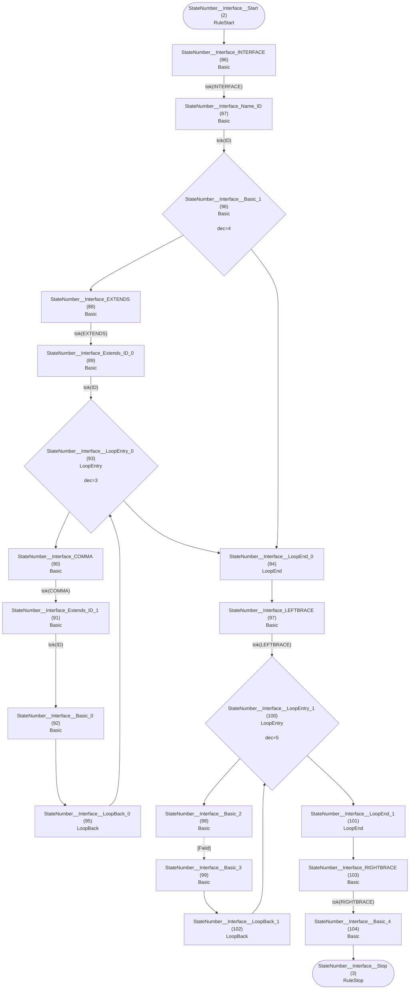
```mermaid
flowchart TD
    q2(["StateNumber__Interface__Start (2)<br/>RuleStart"])
    q3(["StateNumber__Interface__Stop (3)<br/>RuleStop"])
    q86["StateNumber__Interface_INTERFACE (86)<br/>Basic<br/>"]
    q87["StateNumber__Interface_Name_ID (87)<br/>Basic<br/>"]
    q88["StateNumber__Interface_EXTENDS (88)<br/>Basic<br/>"]
    q89["StateNumber__Interface_Extends_ID_0 (89)<br/>Basic<br/>"]
    q90["StateNumber__Interface_COMMA (90)<br/>Basic<br/>"]
    q91["StateNumber__Interface_Extends_ID_1 (91)<br/>Basic<br/>"]
    q92["StateNumber__Interface__Basic_0 (92)<br/>Basic<br/>"]
    q93{"StateNumber__Interface__LoopEntry_0 (93)<br/>LoopEntry<br/><br/>dec=3"}
    q94["StateNumber__Interface__LoopEnd_0 (94)<br/>LoopEnd<br/>"]
    q95["StateNumber__Interface__LoopBack_0 (95)<br/>LoopBack<br/>"]
    q96{"StateNumber__Interface__Basic_1 (96)<br/>Basic<br/><br/>dec=4"}
    q97["StateNumber__Interface_LEFTBRACE (97)<br/>Basic<br/>"]
    q98["StateNumber__Interface__Basic_2 (98)<br/>Basic<br/>"]
    q99["StateNumber__Interface__Basic_3 (99)<br/>Basic<br/>"]
    q100{"StateNumber__Interface__LoopEntry_1 (100)<br/>LoopEntry<br/><br/>dec=5"}
    q101["StateNumber__Interface__LoopEnd_1 (101)<br/>LoopEnd<br/>"]
    q102["StateNumber__Interface__LoopBack_1 (102)<br/>LoopBack<br/>"]
    q103["StateNumber__Interface_RIGHTBRACE (103)<br/>Basic<br/>"]
    q104["StateNumber__Interface__Basic_4 (104)<br/>Basic<br/>"]

    q2 --> q86
    q86 -->|"tok(INTERFACE)"| q87
    q87 -->|"tok(ID)"| q96
    q88 -->|"tok(EXTENDS)"| q89
    q89 -->|"tok(ID)"| q93
    q90 -->|"tok(COMMA)"| q91
    q91 -->|"tok(ID)"| q92
    q92 --> q95
    q93 --> q90
    q93 --> q94
    q94 --> q97
    q95 --> q93
    q96 --> q88
    q96 --> q94
    q97 -->|"tok(LEFTBRACE)"| q100
    q98 -.->|"[Field]"| q99
    q99 --> q102
    q100 --> q98
    q100 --> q101
    q101 --> q103
    q102 --> q100
    q103 -->|"tok(RIGHTBRACE)"| q104
    q104 --> q3
```

## Field

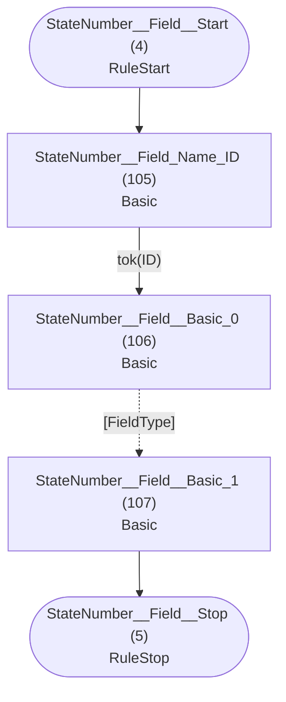
```mermaid
flowchart TD
    q4(["StateNumber__Field__Start (4)<br/>RuleStart"])
    q5(["StateNumber__Field__Stop (5)<br/>RuleStop"])
    q105["StateNumber__Field_Name_ID (105)<br/>Basic<br/>"]
    q106["StateNumber__Field__Basic_0 (106)<br/>Basic<br/>"]
    q107["StateNumber__Field__Basic_1 (107)<br/>Basic<br/>"]

    q4 --> q105
    q105 -->|"tok(ID)"| q106
    q106 -.->|"[FieldType]"| q107
    q107 --> q5
```

## FieldType

```mermaid
flowchart TD
    q6(["StateNumber__FieldType__Start (6)<br/>RuleStart"])
    q7(["StateNumber__FieldType__Stop (7)<br/>RuleStop"])
    q108["StateNumber__FieldType__Basic_0 (108)<br/>Basic<br/>"]
    q109["StateNumber__FieldType__Basic_1 (109)<br/>Basic<br/>"]
    q110["StateNumber__FieldType__Basic_2 (110)<br/>Basic<br/>"]
    q111["StateNumber__FieldType__Basic_3 (111)<br/>Basic<br/>"]
    q112["StateNumber__FieldType__Basic_4 (112)<br/>Basic<br/>"]
    q113["StateNumber__FieldType__Basic_5 (113)<br/>Basic<br/>"]
    q114["StateNumber__FieldType__Basic_6 (114)<br/>Basic<br/>"]
    q115["StateNumber__FieldType__Basic_7 (115)<br/>Basic<br/>"]
    q116{"StateNumber__FieldType__Basic_8 (116)<br/>Basic<br/><br/>dec=6"}
    q117["StateNumber__FieldType__BlockEnd (117)<br/>BlockEnd<br/>"]

    q6 --> q116
    q108 -.->|"[SimpleType]"| q109
    q109 --> q117
    q110 -.->|"[ReferenceType]"| q111
    q111 --> q117
    q112 -.->|"[ArrayType]"| q113
    q113 --> q117
    q114 -.->|"[PrimitiveType]"| q115
    q115 --> q117
    q116 --> q108
    q116 --> q110
    q116 --> q112
    q116 --> q114
    q117 --> q7
```

## ArrayType

```mermaid
flowchart TD
    q8(["StateNumber__ArrayType__Start (8)<br/>RuleStart"])
    q9(["StateNumber__ArrayType__Stop (9)<br/>RuleStop"])
    q118["StateNumber__ArrayType_LEFTBRACKET (118)<br/>Basic<br/>"]
    q119["StateNumber__ArrayType_RIGHTBRACKET (119)<br/>Basic<br/>"]
    q120["StateNumber__ArrayType__Basic_0 (120)<br/>Basic<br/>"]
    q121["StateNumber__ArrayType__Basic_1 (121)<br/>Basic<br/>"]

    q8 --> q118
    q118 -->|"tok(LEFTBRACKET)"| q119
    q119 -->|"tok(RIGHTBRACKET)"| q120
    q120 -.->|"[FieldType]"| q121
    q121 --> q9
```

## ReferenceType

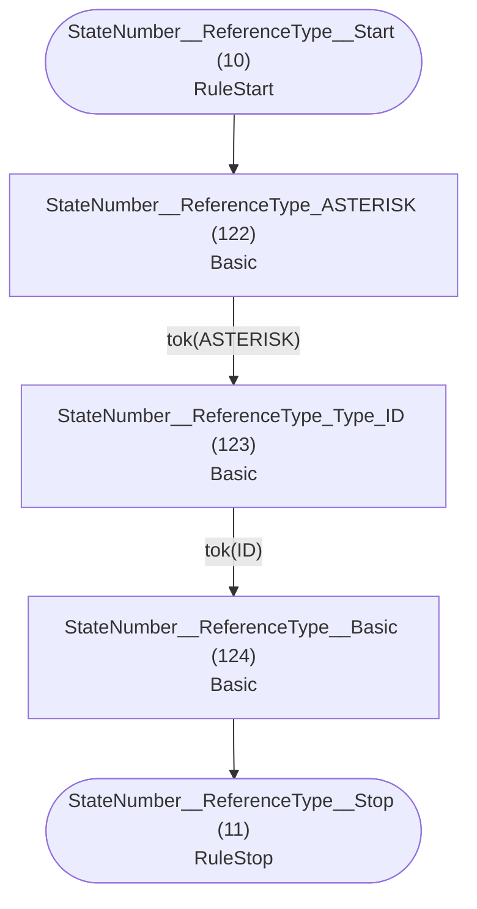
```mermaid
flowchart TD
    q10(["StateNumber__ReferenceType__Start (10)<br/>RuleStart"])
    q11(["StateNumber__ReferenceType__Stop (11)<br/>RuleStop"])
    q122["StateNumber__ReferenceType_ASTERISK (122)<br/>Basic<br/>"]
    q123["StateNumber__ReferenceType_Type_ID (123)<br/>Basic<br/>"]
    q124["StateNumber__ReferenceType__Basic (124)<br/>Basic<br/>"]

    q10 --> q122
    q122 -->|"tok(ASTERISK)"| q123
    q123 -->|"tok(ID)"| q124
    q124 --> q11
```

## SimpleType

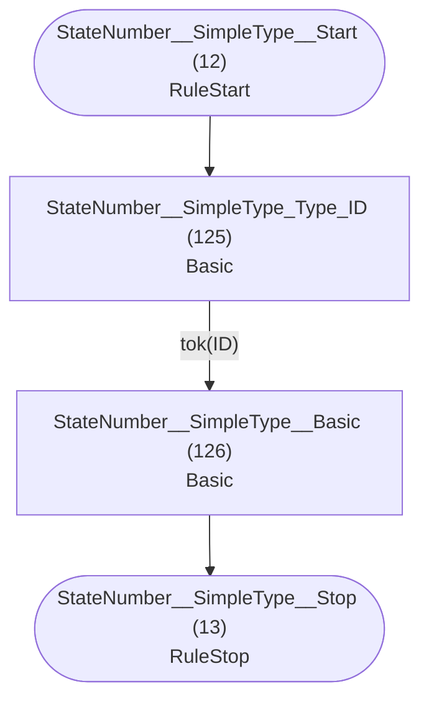
```mermaid
flowchart TD
    q12(["StateNumber__SimpleType__Start (12)<br/>RuleStart"])
    q13(["StateNumber__SimpleType__Stop (13)<br/>RuleStop"])
    q125["StateNumber__SimpleType_Type_ID (125)<br/>Basic<br/>"]
    q126["StateNumber__SimpleType__Basic (126)<br/>Basic<br/>"]

    q12 --> q125
    q125 -->|"tok(ID)"| q126
    q126 --> q13
```

## PrimitiveType

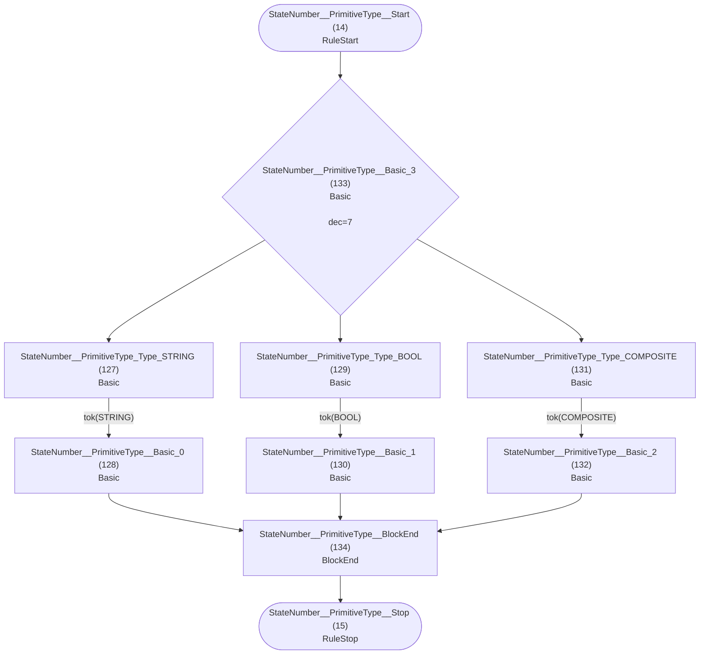
```mermaid
flowchart TD
    q14(["StateNumber__PrimitiveType__Start (14)<br/>RuleStart"])
    q15(["StateNumber__PrimitiveType__Stop (15)<br/>RuleStop"])
    q127["StateNumber__PrimitiveType_Type_STRING (127)<br/>Basic<br/>"]
    q128["StateNumber__PrimitiveType__Basic_0 (128)<br/>Basic<br/>"]
    q129["StateNumber__PrimitiveType_Type_BOOL (129)<br/>Basic<br/>"]
    q130["StateNumber__PrimitiveType__Basic_1 (130)<br/>Basic<br/>"]
    q131["StateNumber__PrimitiveType_Type_COMPOSITE (131)<br/>Basic<br/>"]
    q132["StateNumber__PrimitiveType__Basic_2 (132)<br/>Basic<br/>"]
    q133{"StateNumber__PrimitiveType__Basic_3 (133)<br/>Basic<br/><br/>dec=7"}
    q134["StateNumber__PrimitiveType__BlockEnd (134)<br/>BlockEnd<br/>"]

    q14 --> q133
    q127 -->|"tok(STRING)"| q128
    q128 --> q134
    q129 -->|"tok(BOOL)"| q130
    q130 --> q134
    q131 -->|"tok(COMPOSITE)"| q132
    q132 --> q134
    q133 --> q127
    q133 --> q129
    q133 --> q131
    q134 --> q15
```

## ParserRule

```mermaid
flowchart TD
    q16(["StateNumber__ParserRule__Start (16)<br/>RuleStart"])
    q17(["StateNumber__ParserRule__Stop (17)<br/>RuleStop"])
    q135["StateNumber__ParserRule_Entry_ENTRY (135)<br/>Basic<br/>"]
    q136["StateNumber__ParserRule__Basic_0 (136)<br/>Basic<br/>"]
    q137{"StateNumber__ParserRule__Basic_1 (137)<br/>Basic<br/><br/>dec=8"}
    q138["StateNumber__ParserRule_Name_ID (138)<br/>Basic<br/>"]
    q139["StateNumber__ParserRule_RETURNS (139)<br/>Basic<br/>"]
    q140["StateNumber__ParserRule_ReturnType_ID (140)<br/>Basic<br/>"]
    q141["StateNumber__ParserRule__Basic_2 (141)<br/>Basic<br/>"]
    q142{"StateNumber__ParserRule__Basic_3 (142)<br/>Basic<br/><br/>dec=9"}
    q143["StateNumber__ParserRule_COLON (143)<br/>Basic<br/>"]
    q144["StateNumber__ParserRule__Basic_4 (144)<br/>Basic<br/>"]
    q145["StateNumber__ParserRule_SEMICOLON (145)<br/>Basic<br/>"]
    q146["StateNumber__ParserRule__Basic_5 (146)<br/>Basic<br/>"]
    q147{"StateNumber__ParserRule__Basic_6 (147)<br/>Basic<br/><br/>dec=10"}

    q16 --> q137
    q135 -->|"tok(ENTRY)"| q136
    q136 --> q138
    q137 --> q135
    q137 --> q136
    q138 -->|"tok(ID)"| q142
    q139 -->|"tok(RETURNS)"| q140
    q140 -->|"tok(ID)"| q141
    q141 --> q143
    q142 --> q139
    q142 --> q141
    q143 -->|"tok(COLON)"| q144
    q144 -.->|"[Alternatives]"| q147
    q145 -->|"tok(SEMICOLON)"| q146
    q146 --> q17
    q147 --> q145
    q147 --> q146
```

## Token

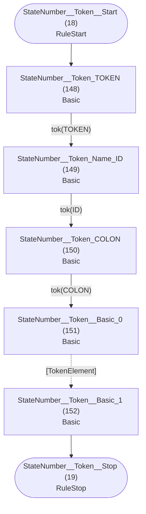
```mermaid
flowchart TD
    q18(["StateNumber__Token__Start (18)<br/>RuleStart"])
    q19(["StateNumber__Token__Stop (19)<br/>RuleStop"])
    q148["StateNumber__Token_TOKEN (148)<br/>Basic<br/>"]
    q149["StateNumber__Token_Name_ID (149)<br/>Basic<br/>"]
    q150["StateNumber__Token_COLON (150)<br/>Basic<br/>"]
    q151["StateNumber__Token__Basic_0 (151)<br/>Basic<br/>"]
    q152["StateNumber__Token__Basic_1 (152)<br/>Basic<br/>"]

    q18 --> q148
    q148 -->|"tok(TOKEN)"| q149
    q149 -->|"tok(ID)"| q150
    q150 -->|"tok(COLON)"| q151
    q151 -.->|"[TokenElement]"| q152
    q152 --> q19
```

## TokenElement

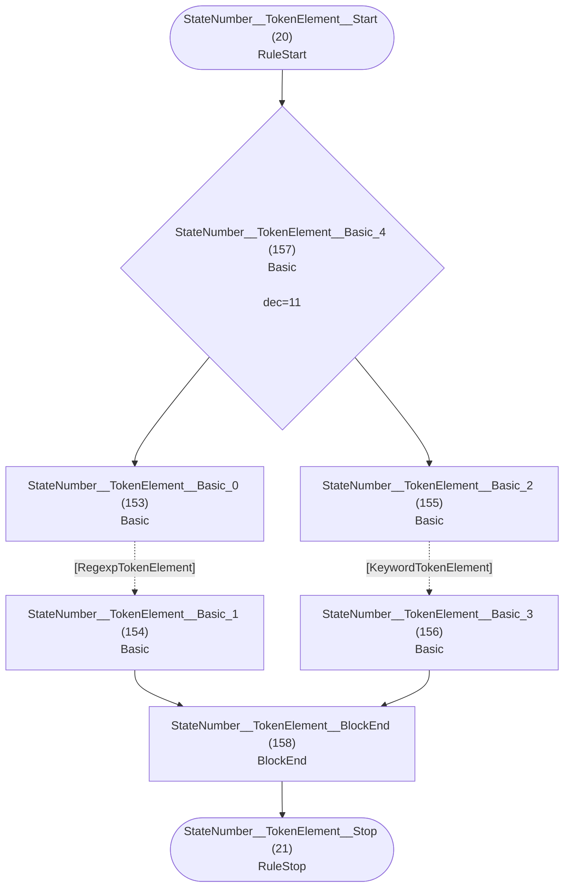
```mermaid
flowchart TD
    q20(["StateNumber__TokenElement__Start (20)<br/>RuleStart"])
    q21(["StateNumber__TokenElement__Stop (21)<br/>RuleStop"])
    q153["StateNumber__TokenElement__Basic_0 (153)<br/>Basic<br/>"]
    q154["StateNumber__TokenElement__Basic_1 (154)<br/>Basic<br/>"]
    q155["StateNumber__TokenElement__Basic_2 (155)<br/>Basic<br/>"]
    q156["StateNumber__TokenElement__Basic_3 (156)<br/>Basic<br/>"]
    q157{"StateNumber__TokenElement__Basic_4 (157)<br/>Basic<br/><br/>dec=11"}
    q158["StateNumber__TokenElement__BlockEnd (158)<br/>BlockEnd<br/>"]

    q20 --> q157
    q153 -.->|"[RegexpTokenElement]"| q154
    q154 --> q158
    q155 -.->|"[KeywordTokenElement]"| q156
    q156 --> q158
    q157 --> q153
    q157 --> q155
    q158 --> q21
```

## RegexpTokenElement

```mermaid
flowchart TD
    q22(["StateNumber__RegexpTokenElement__Start (22)<br/>RuleStart"])
    q23(["StateNumber__RegexpTokenElement__Stop (23)<br/>RuleStop"])
    q159["StateNumber__RegexpTokenElement_Regexp_RegexLiteral (159)<br/>Basic<br/>"]
    q160["StateNumber__RegexpTokenElement__Basic (160)<br/>Basic<br/>"]

    q22 --> q159
    q159 -->|"tok(RegexLiteral)"| q160
    q160 --> q23
```

## KeywordTokenElement

```mermaid
flowchart TD
    q24(["StateNumber__KeywordTokenElement__Start (24)<br/>RuleStart"])
    q25(["StateNumber__KeywordTokenElement__Stop (25)<br/>RuleStop"])
    q161["StateNumber__KeywordTokenElement__Basic_0 (161)<br/>Basic<br/>"]
    q162["StateNumber__KeywordTokenElement__Basic_1 (162)<br/>Basic<br/>"]

    q24 --> q161
    q161 -.->|"[Keyword]"| q162
    q162 --> q25
```

## TokenCommand

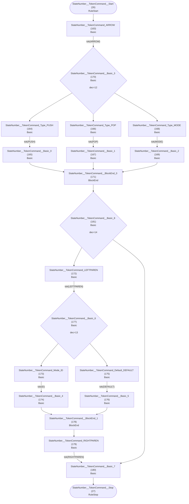
```mermaid
flowchart TD
    q26(["StateNumber__TokenCommand__Start (26)<br/>RuleStart"])
    q27(["StateNumber__TokenCommand__Stop (27)<br/>RuleStop"])
    q163["StateNumber__TokenCommand_ARROW (163)<br/>Basic<br/>"]
    q164["StateNumber__TokenCommand_Type_PUSH (164)<br/>Basic<br/>"]
    q165["StateNumber__TokenCommand__Basic_0 (165)<br/>Basic<br/>"]
    q166["StateNumber__TokenCommand_Type_POP (166)<br/>Basic<br/>"]
    q167["StateNumber__TokenCommand__Basic_1 (167)<br/>Basic<br/>"]
    q168["StateNumber__TokenCommand_Type_MODE (168)<br/>Basic<br/>"]
    q169["StateNumber__TokenCommand__Basic_2 (169)<br/>Basic<br/>"]
    q170{"StateNumber__TokenCommand__Basic_3 (170)<br/>Basic<br/><br/>dec=12"}
    q171["StateNumber__TokenCommand__BlockEnd_0 (171)<br/>BlockEnd<br/>"]
    q172["StateNumber__TokenCommand_LEFTPAREN (172)<br/>Basic<br/>"]
    q173["StateNumber__TokenCommand_Mode_ID (173)<br/>Basic<br/>"]
    q174["StateNumber__TokenCommand__Basic_4 (174)<br/>Basic<br/>"]
    q175["StateNumber__TokenCommand_Default_DEFAULT (175)<br/>Basic<br/>"]
    q176["StateNumber__TokenCommand__Basic_5 (176)<br/>Basic<br/>"]
    q177{"StateNumber__TokenCommand__Basic_6 (177)<br/>Basic<br/><br/>dec=13"}
    q178["StateNumber__TokenCommand__BlockEnd_1 (178)<br/>BlockEnd<br/>"]
    q179["StateNumber__TokenCommand_RIGHTPAREN (179)<br/>Basic<br/>"]
    q180["StateNumber__TokenCommand__Basic_7 (180)<br/>Basic<br/>"]
    q181{"StateNumber__TokenCommand__Basic_8 (181)<br/>Basic<br/><br/>dec=14"}

    q26 --> q163
    q163 -->|"tok(ARROW)"| q170
    q164 -->|"tok(PUSH)"| q165
    q165 --> q171
    q166 -->|"tok(POP)"| q167
    q167 --> q171
    q168 -->|"tok(MODE)"| q169
    q169 --> q171
    q170 --> q164
    q170 --> q166
    q170 --> q168
    q171 --> q181
    q172 -->|"tok(LEFTPAREN)"| q177
    q173 -->|"tok(ID)"| q174
    q174 --> q178
    q175 -->|"tok(DEFAULT)"| q176
    q176 --> q178
    q177 --> q173
    q177 --> q175
    q178 --> q179
    q179 -->|"tok(RIGHTPAREN)"| q180
    q180 --> q27
    q181 --> q172
    q181 --> q180
```

## TokenGroup

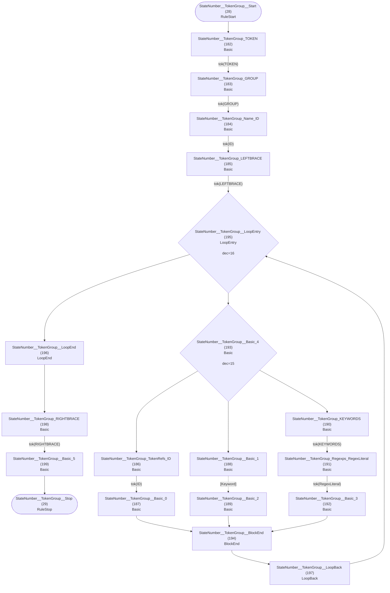
```mermaid
flowchart TD
    q28(["StateNumber__TokenGroup__Start (28)<br/>RuleStart"])
    q29(["StateNumber__TokenGroup__Stop (29)<br/>RuleStop"])
    q182["StateNumber__TokenGroup_TOKEN (182)<br/>Basic<br/>"]
    q183["StateNumber__TokenGroup_GROUP (183)<br/>Basic<br/>"]
    q184["StateNumber__TokenGroup_Name_ID (184)<br/>Basic<br/>"]
    q185["StateNumber__TokenGroup_LEFTBRACE (185)<br/>Basic<br/>"]
    q186["StateNumber__TokenGroup_TokenRefs_ID (186)<br/>Basic<br/>"]
    q187["StateNumber__TokenGroup__Basic_0 (187)<br/>Basic<br/>"]
    q188["StateNumber__TokenGroup__Basic_1 (188)<br/>Basic<br/>"]
    q189["StateNumber__TokenGroup__Basic_2 (189)<br/>Basic<br/>"]
    q190["StateNumber__TokenGroup_KEYWORDS (190)<br/>Basic<br/>"]
    q191["StateNumber__TokenGroup_Regexps_RegexLiteral (191)<br/>Basic<br/>"]
    q192["StateNumber__TokenGroup__Basic_3 (192)<br/>Basic<br/>"]
    q193{"StateNumber__TokenGroup__Basic_4 (193)<br/>Basic<br/><br/>dec=15"}
    q194["StateNumber__TokenGroup__BlockEnd (194)<br/>BlockEnd<br/>"]
    q195{"StateNumber__TokenGroup__LoopEntry (195)<br/>LoopEntry<br/><br/>dec=16"}
    q196["StateNumber__TokenGroup__LoopEnd (196)<br/>LoopEnd<br/>"]
    q197["StateNumber__TokenGroup__LoopBack (197)<br/>LoopBack<br/>"]
    q198["StateNumber__TokenGroup_RIGHTBRACE (198)<br/>Basic<br/>"]
    q199["StateNumber__TokenGroup__Basic_5 (199)<br/>Basic<br/>"]

    q28 --> q182
    q182 -->|"tok(TOKEN)"| q183
    q183 -->|"tok(GROUP)"| q184
    q184 -->|"tok(ID)"| q185
    q185 -->|"tok(LEFTBRACE)"| q195
    q186 -->|"tok(ID)"| q187
    q187 --> q194
    q188 -.->|"[Keyword]"| q189
    q189 --> q194
    q190 -->|"tok(KEYWORDS)"| q191
    q191 -->|"tok(RegexLiteral)"| q192
    q192 --> q194
    q193 --> q186
    q193 --> q188
    q193 --> q190
    q194 --> q197
    q195 --> q193
    q195 --> q196
    q196 --> q198
    q197 --> q195
    q198 -->|"tok(RIGHTBRACE)"| q199
    q199 --> q29
```

## TokenMode

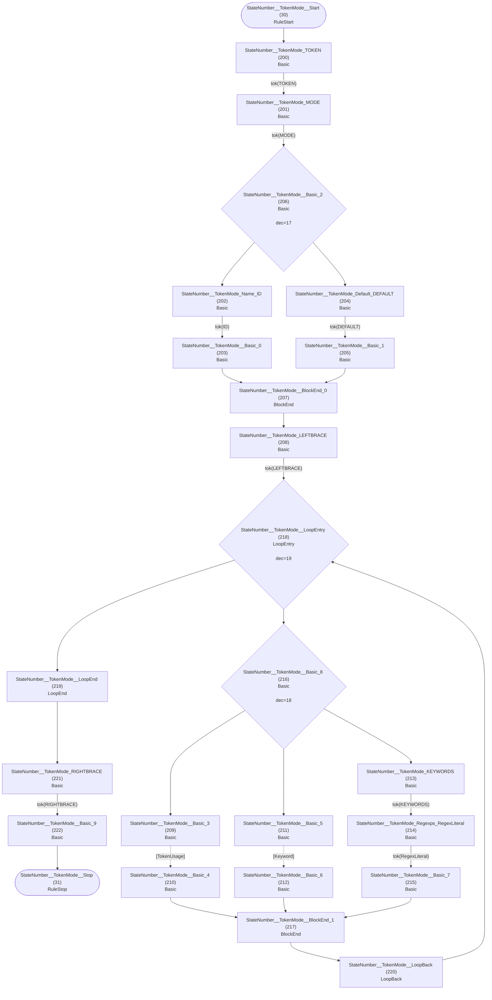
```mermaid
flowchart TD
    q30(["StateNumber__TokenMode__Start (30)<br/>RuleStart"])
    q31(["StateNumber__TokenMode__Stop (31)<br/>RuleStop"])
    q200["StateNumber__TokenMode_TOKEN (200)<br/>Basic<br/>"]
    q201["StateNumber__TokenMode_MODE (201)<br/>Basic<br/>"]
    q202["StateNumber__TokenMode_Name_ID (202)<br/>Basic<br/>"]
    q203["StateNumber__TokenMode__Basic_0 (203)<br/>Basic<br/>"]
    q204["StateNumber__TokenMode_Default_DEFAULT (204)<br/>Basic<br/>"]
    q205["StateNumber__TokenMode__Basic_1 (205)<br/>Basic<br/>"]
    q206{"StateNumber__TokenMode__Basic_2 (206)<br/>Basic<br/><br/>dec=17"}
    q207["StateNumber__TokenMode__BlockEnd_0 (207)<br/>BlockEnd<br/>"]
    q208["StateNumber__TokenMode_LEFTBRACE (208)<br/>Basic<br/>"]
    q209["StateNumber__TokenMode__Basic_3 (209)<br/>Basic<br/>"]
    q210["StateNumber__TokenMode__Basic_4 (210)<br/>Basic<br/>"]
    q211["StateNumber__TokenMode__Basic_5 (211)<br/>Basic<br/>"]
    q212["StateNumber__TokenMode__Basic_6 (212)<br/>Basic<br/>"]
    q213["StateNumber__TokenMode_KEYWORDS (213)<br/>Basic<br/>"]
    q214["StateNumber__TokenMode_Regexps_RegexLiteral (214)<br/>Basic<br/>"]
    q215["StateNumber__TokenMode__Basic_7 (215)<br/>Basic<br/>"]
    q216{"StateNumber__TokenMode__Basic_8 (216)<br/>Basic<br/><br/>dec=18"}
    q217["StateNumber__TokenMode__BlockEnd_1 (217)<br/>BlockEnd<br/>"]
    q218{"StateNumber__TokenMode__LoopEntry (218)<br/>LoopEntry<br/><br/>dec=19"}
    q219["StateNumber__TokenMode__LoopEnd (219)<br/>LoopEnd<br/>"]
    q220["StateNumber__TokenMode__LoopBack (220)<br/>LoopBack<br/>"]
    q221["StateNumber__TokenMode_RIGHTBRACE (221)<br/>Basic<br/>"]
    q222["StateNumber__TokenMode__Basic_9 (222)<br/>Basic<br/>"]

    q30 --> q200
    q200 -->|"tok(TOKEN)"| q201
    q201 -->|"tok(MODE)"| q206
    q202 -->|"tok(ID)"| q203
    q203 --> q207
    q204 -->|"tok(DEFAULT)"| q205
    q205 --> q207
    q206 --> q202
    q206 --> q204
    q207 --> q208
    q208 -->|"tok(LEFTBRACE)"| q218
    q209 -.->|"[TokenUsage]"| q210
    q210 --> q217
    q211 -.->|"[Keyword]"| q212
    q212 --> q217
    q213 -->|"tok(KEYWORDS)"| q214
    q214 -->|"tok(RegexLiteral)"| q215
    q215 --> q217
    q216 --> q209
    q216 --> q211
    q216 --> q213
    q217 --> q220
    q218 --> q216
    q218 --> q219
    q219 --> q221
    q220 --> q218
    q221 -->|"tok(RIGHTBRACE)"| q222
    q222 --> q31
```

## TokenUsage

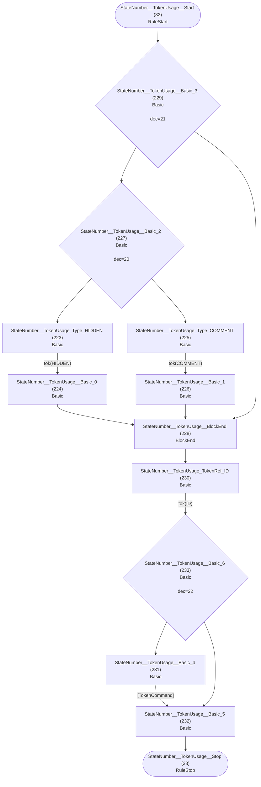
```mermaid
flowchart TD
    q32(["StateNumber__TokenUsage__Start (32)<br/>RuleStart"])
    q33(["StateNumber__TokenUsage__Stop (33)<br/>RuleStop"])
    q223["StateNumber__TokenUsage_Type_HIDDEN (223)<br/>Basic<br/>"]
    q224["StateNumber__TokenUsage__Basic_0 (224)<br/>Basic<br/>"]
    q225["StateNumber__TokenUsage_Type_COMMENT (225)<br/>Basic<br/>"]
    q226["StateNumber__TokenUsage__Basic_1 (226)<br/>Basic<br/>"]
    q227{"StateNumber__TokenUsage__Basic_2 (227)<br/>Basic<br/><br/>dec=20"}
    q228["StateNumber__TokenUsage__BlockEnd (228)<br/>BlockEnd<br/>"]
    q229{"StateNumber__TokenUsage__Basic_3 (229)<br/>Basic<br/><br/>dec=21"}
    q230["StateNumber__TokenUsage_TokenRef_ID (230)<br/>Basic<br/>"]
    q231["StateNumber__TokenUsage__Basic_4 (231)<br/>Basic<br/>"]
    q232["StateNumber__TokenUsage__Basic_5 (232)<br/>Basic<br/>"]
    q233{"StateNumber__TokenUsage__Basic_6 (233)<br/>Basic<br/><br/>dec=22"}

    q32 --> q229
    q223 -->|"tok(HIDDEN)"| q224
    q224 --> q228
    q225 -->|"tok(COMMENT)"| q226
    q226 --> q228
    q227 --> q223
    q227 --> q225
    q228 --> q230
    q229 --> q227
    q229 --> q228
    q230 -->|"tok(ID)"| q233
    q231 -.->|"[TokenCommand]"| q232
    q232 --> q33
    q233 --> q231
    q233 --> q232
```

## Alternatives

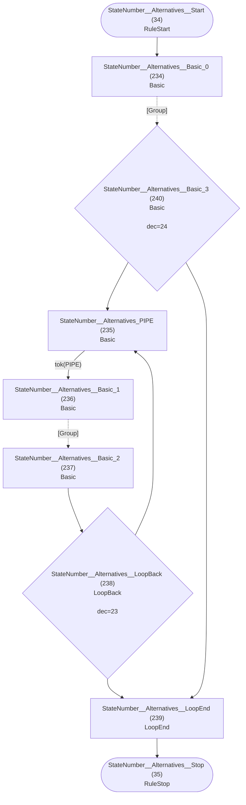
```mermaid
flowchart TD
    q34(["StateNumber__Alternatives__Start (34)<br/>RuleStart"])
    q35(["StateNumber__Alternatives__Stop (35)<br/>RuleStop"])
    q234["StateNumber__Alternatives__Basic_0 (234)<br/>Basic<br/>"]
    q235["StateNumber__Alternatives_PIPE (235)<br/>Basic<br/>"]
    q236["StateNumber__Alternatives__Basic_1 (236)<br/>Basic<br/>"]
    q237["StateNumber__Alternatives__Basic_2 (237)<br/>Basic<br/>"]
    q238{"StateNumber__Alternatives__LoopBack (238)<br/>LoopBack<br/><br/>dec=23"}
    q239["StateNumber__Alternatives__LoopEnd (239)<br/>LoopEnd<br/>"]
    q240{"StateNumber__Alternatives__Basic_3 (240)<br/>Basic<br/><br/>dec=24"}

    q34 --> q234
    q234 -.->|"[Group]"| q240
    q235 -->|"tok(PIPE)"| q236
    q236 -.->|"[Group]"| q237
    q237 --> q238
    q238 --> q235
    q238 --> q239
    q239 --> q35
    q240 --> q235
    q240 --> q239
```

## Group

```mermaid
flowchart TD
    q36(["StateNumber__Group__Start (36)<br/>RuleStart"])
    q37(["StateNumber__Group__Stop (37)<br/>RuleStop"])
    q241["StateNumber__Group__Basic_0 (241)<br/>Basic<br/>"]
    q242["StateNumber__Group__Basic_1 (242)<br/>Basic<br/>"]
    q243["StateNumber__Group__Basic_2 (243)<br/>Basic<br/>"]
    q244{"StateNumber__Group__LoopBack (244)<br/>LoopBack<br/><br/>dec=25"}
    q245["StateNumber__Group__LoopEnd (245)<br/>LoopEnd<br/>"]
    q246{"StateNumber__Group__Basic_3 (246)<br/>Basic<br/><br/>dec=26"}

    q36 --> q241
    q241 -.->|"[Element]"| q246
    q242 -.->|"[Element]"| q243
    q243 --> q244
    q244 --> q242
    q244 --> q245
    q245 --> q37
    q246 --> q242
    q246 --> q245
```

## Element

```mermaid
flowchart TD
    q38(["StateNumber__Element__Start (38)<br/>RuleStart"])
    q39(["StateNumber__Element__Stop (39)<br/>RuleStop"])
    q247["StateNumber__Element__Basic_0 (247)<br/>Basic<br/>"]
    q248["StateNumber__Element__Basic_1 (248)<br/>Basic<br/>"]
    q249["StateNumber__Element__Basic_2 (249)<br/>Basic<br/>"]
    q250["StateNumber__Element__Basic_3 (250)<br/>Basic<br/>"]
    q251["StateNumber__Element__Basic_4 (251)<br/>Basic<br/>"]
    q252["StateNumber__Element__Basic_5 (252)<br/>Basic<br/>"]
    q253["StateNumber__Element__Basic_6 (253)<br/>Basic<br/>"]
    q254["StateNumber__Element__Basic_7 (254)<br/>Basic<br/>"]
    q255["StateNumber__Element_LEFTPAREN (255)<br/>Basic<br/>"]
    q256["StateNumber__Element__Basic_8 (256)<br/>Basic<br/>"]
    q257["StateNumber__Element_RIGHTPAREN (257)<br/>Basic<br/>"]
    q258["StateNumber__Element__Basic_9 (258)<br/>Basic<br/>"]
    q259{"StateNumber__Element__Basic_10 (259)<br/>Basic<br/><br/>dec=27"}
    q260["StateNumber__Element__BlockEnd_0 (260)<br/>BlockEnd<br/>"]
    q261["StateNumber__Element_Cardinality_ASTERISK (261)<br/>Basic<br/>"]
    q262["StateNumber__Element__Basic_11 (262)<br/>Basic<br/>"]
    q263["StateNumber__Element_Cardinality_PLUS (263)<br/>Basic<br/>"]
    q264["StateNumber__Element__Basic_12 (264)<br/>Basic<br/>"]
    q265["StateNumber__Element_Cardinality_QUESTION (265)<br/>Basic<br/>"]
    q266["StateNumber__Element__Basic_13 (266)<br/>Basic<br/>"]
    q267{"StateNumber__Element__Basic_14 (267)<br/>Basic<br/><br/>dec=28"}
    q268["StateNumber__Element__BlockEnd_1 (268)<br/>BlockEnd<br/>"]
    q269{"StateNumber__Element__Basic_15 (269)<br/>Basic<br/><br/>dec=29"}

    q38 --> q259
    q247 -.->|"[Keyword]"| q248
    q248 --> q260
    q249 -.->|"[Assignment]"| q250
    q250 --> q260
    q251 -.->|"[RuleCall]"| q252
    q252 --> q260
    q253 -.->|"[Action]"| q254
    q254 --> q260
    q255 -->|"tok(LEFTPAREN)"| q256
    q256 -.->|"[Alternatives]"| q257
    q257 -->|"tok(RIGHTPAREN)"| q258
    q258 --> q260
    q259 --> q247
    q259 --> q249
    q259 --> q251
    q259 --> q253
    q259 --> q255
    q260 --> q269
    q261 -->|"tok(ASTERISK)"| q262
    q262 --> q268
    q263 -->|"tok(PLUS)"| q264
    q264 --> q268
    q265 -->|"tok(QUESTION)"| q266
    q266 --> q268
    q267 --> q261
    q267 --> q263
    q267 --> q265
    q268 --> q39
    q269 --> q267
    q269 --> q268
```

## Keyword

```mermaid
flowchart TD
    q40(["StateNumber__Keyword__Start (40)<br/>RuleStart"])
    q41(["StateNumber__Keyword__Stop (41)<br/>RuleStop"])
    q270["StateNumber__Keyword_Value_StringLiteral (270)<br/>Basic<br/>"]
    q271["StateNumber__Keyword__Basic (271)<br/>Basic<br/>"]

    q40 --> q270
    q270 -->|"tok(StringLiteral)"| q271
    q271 --> q41
```

## Assignment

```mermaid
flowchart TD
    q42(["StateNumber__Assignment__Start (42)<br/>RuleStart"])
    q43(["StateNumber__Assignment__Stop (43)<br/>RuleStop"])
    q272["StateNumber__Assignment_Property_ID (272)<br/>Basic<br/>"]
    q273["StateNumber__Assignment_Operator_PLUS_EQUALS (273)<br/>Basic<br/>"]
    q274["StateNumber__Assignment__Basic_0 (274)<br/>Basic<br/>"]
    q275["StateNumber__Assignment_Operator_EQUALS (275)<br/>Basic<br/>"]
    q276["StateNumber__Assignment__Basic_1 (276)<br/>Basic<br/>"]
    q277["StateNumber__Assignment_Operator_QUESTION_EQUALS (277)<br/>Basic<br/>"]
    q278["StateNumber__Assignment__Basic_2 (278)<br/>Basic<br/>"]
    q279{"StateNumber__Assignment__Basic_3 (279)<br/>Basic<br/><br/>dec=30"}
    q280["StateNumber__Assignment__BlockEnd (280)<br/>BlockEnd<br/>"]
    q281["StateNumber__Assignment__Basic_4 (281)<br/>Basic<br/>"]
    q282["StateNumber__Assignment__Basic_5 (282)<br/>Basic<br/>"]

    q42 --> q272
    q272 -->|"tok(ID)"| q279
    q273 -->|"tok(PLUS_EQUALS)"| q274
    q274 --> q280
    q275 -->|"tok(EQUALS)"| q276
    q276 --> q280
    q277 -->|"tok(QUESTION_EQUALS)"| q278
    q278 --> q280
    q279 --> q273
    q279 --> q275
    q279 --> q277
    q280 --> q281
    q281 -.->|"[Assignable]"| q282
    q282 --> q43
```

## Assignable

```mermaid
flowchart TD
    q44(["StateNumber__Assignable__Start (44)<br/>RuleStart"])
    q45(["StateNumber__Assignable__Stop (45)<br/>RuleStop"])
    q283["StateNumber__Assignable__Basic_0 (283)<br/>Basic<br/>"]
    q284["StateNumber__Assignable__Basic_1 (284)<br/>Basic<br/>"]
    q285["StateNumber__Assignable__Basic_2 (285)<br/>Basic<br/>"]
    q286["StateNumber__Assignable__Basic_3 (286)<br/>Basic<br/>"]
    q287["StateNumber__Assignable_LEFTPAREN (287)<br/>Basic<br/>"]
    q288["StateNumber__Assignable__Basic_4 (288)<br/>Basic<br/>"]
    q289["StateNumber__Assignable_RIGHTPAREN (289)<br/>Basic<br/>"]
    q290["StateNumber__Assignable__Basic_5 (290)<br/>Basic<br/>"]
    q291{"StateNumber__Assignable__Basic_6 (291)<br/>Basic<br/><br/>dec=31"}
    q292["StateNumber__Assignable__BlockEnd (292)<br/>BlockEnd<br/>"]

    q44 --> q291
    q283 -.->|"[RuleCall]"| q284
    q284 --> q292
    q285 -.->|"[CrossRef]"| q286
    q286 --> q292
    q287 -->|"tok(LEFTPAREN)"| q288
    q288 -.->|"[AssignableAlternatives]"| q289
    q289 -->|"tok(RIGHTPAREN)"| q290
    q290 --> q292
    q291 --> q283
    q291 --> q285
    q291 --> q287
    q292 --> q45
```

## AssignableWithoutAlts

```mermaid
flowchart TD
    q46(["StateNumber__AssignableWithoutAlts__Start (46)<br/>RuleStart"])
    q47(["StateNumber__AssignableWithoutAlts__Stop (47)<br/>RuleStop"])
    q293["StateNumber__AssignableWithoutAlts__Basic_0 (293)<br/>Basic<br/>"]
    q294["StateNumber__AssignableWithoutAlts__Basic_1 (294)<br/>Basic<br/>"]
    q295["StateNumber__AssignableWithoutAlts__Basic_2 (295)<br/>Basic<br/>"]
    q296["StateNumber__AssignableWithoutAlts__Basic_3 (296)<br/>Basic<br/>"]
    q297{"StateNumber__AssignableWithoutAlts__Basic_4 (297)<br/>Basic<br/><br/>dec=32"}
    q298["StateNumber__AssignableWithoutAlts__BlockEnd (298)<br/>BlockEnd<br/>"]

    q46 --> q297
    q293 -.->|"[RuleCall]"| q294
    q294 --> q298
    q295 -.->|"[CrossRef]"| q296
    q296 --> q298
    q297 --> q293
    q297 --> q295
    q298 --> q47
```

## AssignableAlternatives

```mermaid
flowchart TD
    q48(["StateNumber__AssignableAlternatives__Start (48)<br/>RuleStart"])
    q49(["StateNumber__AssignableAlternatives__Stop (49)<br/>RuleStop"])
    q299["StateNumber__AssignableAlternatives__Basic_0 (299)<br/>Basic<br/>"]
    q300["StateNumber__AssignableAlternatives_PIPE (300)<br/>Basic<br/>"]
    q301["StateNumber__AssignableAlternatives__Basic_1 (301)<br/>Basic<br/>"]
    q302["StateNumber__AssignableAlternatives__Basic_2 (302)<br/>Basic<br/>"]
    q303{"StateNumber__AssignableAlternatives__LoopBack (303)<br/>LoopBack<br/><br/>dec=33"}
    q304["StateNumber__AssignableAlternatives__LoopEnd (304)<br/>LoopEnd<br/>"]
    q305{"StateNumber__AssignableAlternatives__Basic_3 (305)<br/>Basic<br/><br/>dec=34"}

    q48 --> q299
    q299 -.->|"[AssignableWithoutAlts]"| q305
    q300 -->|"tok(PIPE)"| q301
    q301 -.->|"[AssignableWithoutAlts]"| q302
    q302 --> q303
    q303 --> q300
    q303 --> q304
    q304 --> q49
    q305 --> q300
    q305 --> q304
```

## CrossRef

```mermaid
flowchart TD
    q50(["StateNumber__CrossRef__Start (50)<br/>RuleStart"])
    q51(["StateNumber__CrossRef__Stop (51)<br/>RuleStop"])
    q306["StateNumber__CrossRef_LEFTBRACKET (306)<br/>Basic<br/>"]
    q307["StateNumber__CrossRef_Type_ID (307)<br/>Basic<br/>"]
    q308["StateNumber__CrossRef_COLON (308)<br/>Basic<br/>"]
    q309["StateNumber__CrossRef__Basic_0 (309)<br/>Basic<br/>"]
    q310["StateNumber__CrossRef__Basic_1 (310)<br/>Basic<br/>"]
    q311{"StateNumber__CrossRef__Basic_2 (311)<br/>Basic<br/><br/>dec=35"}
    q312["StateNumber__CrossRef_RIGHTBRACKET (312)<br/>Basic<br/>"]
    q313["StateNumber__CrossRef__Basic_3 (313)<br/>Basic<br/>"]

    q50 --> q306
    q306 -->|"tok(LEFTBRACKET)"| q307
    q307 -->|"tok(ID)"| q311
    q308 -->|"tok(COLON)"| q309
    q309 -.->|"[RuleCall]"| q310
    q310 --> q312
    q311 --> q308
    q311 --> q310
    q312 -->|"tok(RIGHTBRACKET)"| q313
    q313 --> q51
```

## RuleCall

```mermaid
flowchart TD
    q52(["StateNumber__RuleCall__Start (52)<br/>RuleStart"])
    q53(["StateNumber__RuleCall__Stop (53)<br/>RuleStop"])
    q314["StateNumber__RuleCall_Rule_ID (314)<br/>Basic<br/>"]
    q315["StateNumber__RuleCall__Basic (315)<br/>Basic<br/>"]

    q52 --> q314
    q314 -->|"tok(ID)"| q315
    q315 --> q53
```

## Action

```mermaid
flowchart TD
    q54(["StateNumber__Action__Start (54)<br/>RuleStart"])
    q55(["StateNumber__Action__Stop (55)<br/>RuleStop"])
    q316["StateNumber__Action_LEFTBRACE (316)<br/>Basic<br/>"]
    q317["StateNumber__Action_Type_ID (317)<br/>Basic<br/>"]
    q318["StateNumber__Action_DOT (318)<br/>Basic<br/>"]
    q319["StateNumber__Action_Property_ID (319)<br/>Basic<br/>"]
    q320["StateNumber__Action_Operator_PLUS_EQUALS (320)<br/>Basic<br/>"]
    q321["StateNumber__Action__Basic_0 (321)<br/>Basic<br/>"]
    q322["StateNumber__Action_Operator_EQUALS (322)<br/>Basic<br/>"]
    q323["StateNumber__Action__Basic_1 (323)<br/>Basic<br/>"]
    q324{"StateNumber__Action__Basic_2 (324)<br/>Basic<br/><br/>dec=36"}
    q325["StateNumber__Action__BlockEnd (325)<br/>BlockEnd<br/>"]
    q326["StateNumber__Action_CURRENT (326)<br/>Basic<br/>"]
    q327["StateNumber__Action__Basic_3 (327)<br/>Basic<br/>"]
    q328{"StateNumber__Action__Basic_4 (328)<br/>Basic<br/><br/>dec=37"}
    q329["StateNumber__Action_RIGHTBRACE (329)<br/>Basic<br/>"]
    q330["StateNumber__Action__Basic_5 (330)<br/>Basic<br/>"]

    q54 --> q316
    q316 -->|"tok(LEFTBRACE)"| q317
    q317 -->|"tok(ID)"| q328
    q318 -->|"tok(DOT)"| q319
    q319 -->|"tok(ID)"| q324
    q320 -->|"tok(PLUS_EQUALS)"| q321
    q321 --> q325
    q322 -->|"tok(EQUALS)"| q323
    q323 --> q325
    q324 --> q320
    q324 --> q322
    q325 --> q326
    q326 -->|"tok(CURRENT)"| q327
    q327 --> q329
    q328 --> q318
    q328 --> q327
    q329 -->|"tok(RIGHTBRACE)"| q330
    q330 --> q55
```

## CompositeRule

```mermaid
flowchart TD
    q56(["StateNumber__CompositeRule__Start (56)<br/>RuleStart"])
    q57(["StateNumber__CompositeRule__Stop (57)<br/>RuleStop"])
    q331["StateNumber__CompositeRule_COMPOSITE (331)<br/>Basic<br/>"]
    q332["StateNumber__CompositeRule_Name_ID (332)<br/>Basic<br/>"]
    q333["StateNumber__CompositeRule_COLON (333)<br/>Basic<br/>"]
    q334["StateNumber__CompositeRule__Basic_0 (334)<br/>Basic<br/>"]
    q335["StateNumber__CompositeRule_SEMICOLON (335)<br/>Basic<br/>"]
    q336["StateNumber__CompositeRule__Basic_1 (336)<br/>Basic<br/>"]
    q337{"StateNumber__CompositeRule__Basic_2 (337)<br/>Basic<br/><br/>dec=38"}

    q56 --> q331
    q331 -->|"tok(COMPOSITE)"| q332
    q332 -->|"tok(ID)"| q333
    q333 -->|"tok(COLON)"| q334
    q334 -.->|"[CompositeAlternatives]"| q337
    q335 -->|"tok(SEMICOLON)"| q336
    q336 --> q57
    q337 --> q335
    q337 --> q336
```

## CompositeAlternatives

```mermaid
flowchart TD
    q58(["StateNumber__CompositeAlternatives__Start (58)<br/>RuleStart"])
    q59(["StateNumber__CompositeAlternatives__Stop (59)<br/>RuleStop"])
    q338["StateNumber__CompositeAlternatives__Basic_0 (338)<br/>Basic<br/>"]
    q339["StateNumber__CompositeAlternatives_PIPE (339)<br/>Basic<br/>"]
    q340["StateNumber__CompositeAlternatives__Basic_1 (340)<br/>Basic<br/>"]
    q341["StateNumber__CompositeAlternatives__Basic_2 (341)<br/>Basic<br/>"]
    q342{"StateNumber__CompositeAlternatives__LoopBack (342)<br/>LoopBack<br/><br/>dec=39"}
    q343["StateNumber__CompositeAlternatives__LoopEnd (343)<br/>LoopEnd<br/>"]
    q344{"StateNumber__CompositeAlternatives__Basic_3 (344)<br/>Basic<br/><br/>dec=40"}

    q58 --> q338
    q338 -.->|"[CompositeGroup]"| q344
    q339 -->|"tok(PIPE)"| q340
    q340 -.->|"[CompositeGroup]"| q341
    q341 --> q342
    q342 --> q339
    q342 --> q343
    q343 --> q59
    q344 --> q339
    q344 --> q343
```

## CompositeGroup

```mermaid
flowchart TD
    q60(["StateNumber__CompositeGroup__Start (60)<br/>RuleStart"])
    q61(["StateNumber__CompositeGroup__Stop (61)<br/>RuleStop"])
    q345["StateNumber__CompositeGroup__Basic_0 (345)<br/>Basic<br/>"]
    q346["StateNumber__CompositeGroup__Basic_1 (346)<br/>Basic<br/>"]
    q347["StateNumber__CompositeGroup__Basic_2 (347)<br/>Basic<br/>"]
    q348{"StateNumber__CompositeGroup__LoopBack (348)<br/>LoopBack<br/><br/>dec=41"}
    q349["StateNumber__CompositeGroup__LoopEnd (349)<br/>LoopEnd<br/>"]
    q350{"StateNumber__CompositeGroup__Basic_3 (350)<br/>Basic<br/><br/>dec=42"}

    q60 --> q345
    q345 -.->|"[CompositeElement]"| q350
    q346 -.->|"[CompositeElement]"| q347
    q347 --> q348
    q348 --> q346
    q348 --> q349
    q349 --> q61
    q350 --> q346
    q350 --> q349
```

## CompositeElement

```mermaid
flowchart TD
    q62(["StateNumber__CompositeElement__Start (62)<br/>RuleStart"])
    q63(["StateNumber__CompositeElement__Stop (63)<br/>RuleStop"])
    q351["StateNumber__CompositeElement__Basic_0 (351)<br/>Basic<br/>"]
    q352["StateNumber__CompositeElement__Basic_1 (352)<br/>Basic<br/>"]
    q353["StateNumber__CompositeElement_LEFTPAREN (353)<br/>Basic<br/>"]
    q354["StateNumber__CompositeElement__Basic_2 (354)<br/>Basic<br/>"]
    q355["StateNumber__CompositeElement_RIGHTPAREN (355)<br/>Basic<br/>"]
    q356["StateNumber__CompositeElement__Basic_3 (356)<br/>Basic<br/>"]
    q357{"StateNumber__CompositeElement__Basic_4 (357)<br/>Basic<br/><br/>dec=43"}
    q358["StateNumber__CompositeElement__BlockEnd_0 (358)<br/>BlockEnd<br/>"]
    q359["StateNumber__CompositeElement_Cardinality_ASTERISK (359)<br/>Basic<br/>"]
    q360["StateNumber__CompositeElement__Basic_5 (360)<br/>Basic<br/>"]
    q361["StateNumber__CompositeElement_Cardinality_PLUS (361)<br/>Basic<br/>"]
    q362["StateNumber__CompositeElement__Basic_6 (362)<br/>Basic<br/>"]
    q363["StateNumber__CompositeElement_Cardinality_QUESTION (363)<br/>Basic<br/>"]
    q364["StateNumber__CompositeElement__Basic_7 (364)<br/>Basic<br/>"]
    q365{"StateNumber__CompositeElement__Basic_8 (365)<br/>Basic<br/><br/>dec=44"}
    q366["StateNumber__CompositeElement__BlockEnd_1 (366)<br/>BlockEnd<br/>"]
    q367{"StateNumber__CompositeElement__Basic_9 (367)<br/>Basic<br/><br/>dec=45"}

    q62 --> q357
    q351 -.->|"[RuleCall]"| q352
    q352 --> q358
    q353 -->|"tok(LEFTPAREN)"| q354
    q354 -.->|"[CompositeAlternatives]"| q355
    q355 -->|"tok(RIGHTPAREN)"| q356
    q356 --> q358
    q357 --> q351
    q357 --> q353
    q358 --> q367
    q359 -->|"tok(ASTERISK)"| q360
    q360 --> q366
    q361 -->|"tok(PLUS)"| q362
    q362 --> q366
    q363 -->|"tok(QUESTION)"| q364
    q364 --> q366
    q365 --> q359
    q365 --> q361
    q365 --> q363
    q366 --> q63
    q367 --> q365
    q367 --> q366
```

