# Runtime ATN for grammar

## Grammar

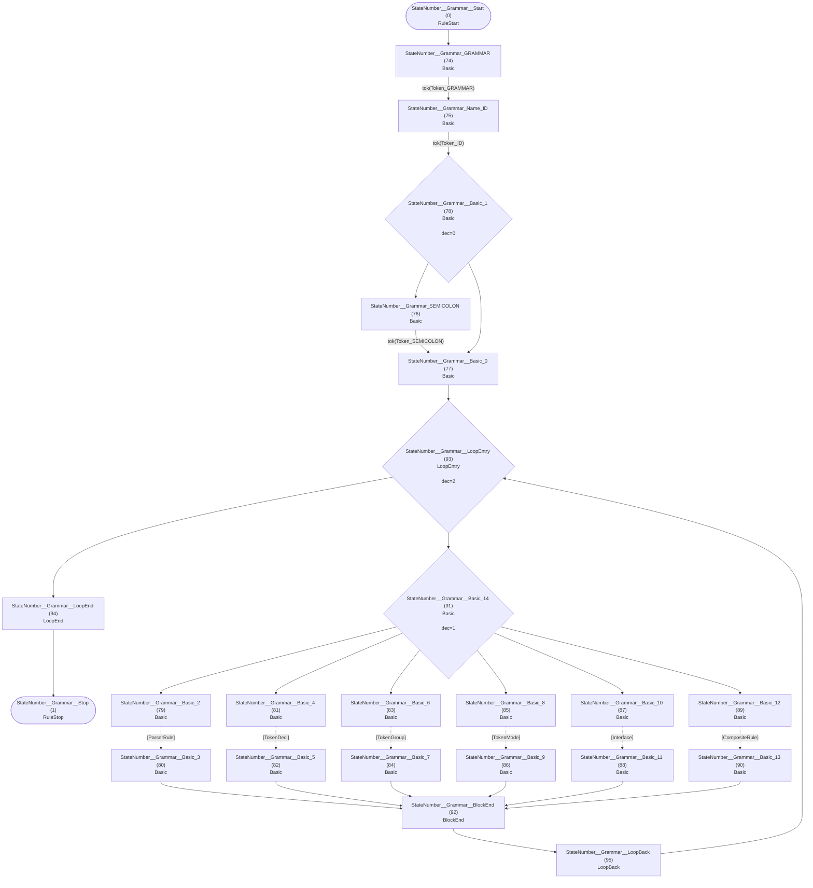
```mermaid
flowchart TD
    q0(["StateNumber__Grammar__Start (0)<br/>RuleStart"])
    q1(["StateNumber__Grammar__Stop (1)<br/>RuleStop"])
    q74["StateNumber__Grammar_GRAMMAR (74)<br/>Basic<br/>"]
    q75["StateNumber__Grammar_Name_ID (75)<br/>Basic<br/>"]
    q76["StateNumber__Grammar_SEMICOLON (76)<br/>Basic<br/>"]
    q77["StateNumber__Grammar__Basic_0 (77)<br/>Basic<br/>"]
    q78{"StateNumber__Grammar__Basic_1 (78)<br/>Basic<br/><br/>dec=0"}
    q79["StateNumber__Grammar__Basic_2 (79)<br/>Basic<br/>"]
    q80["StateNumber__Grammar__Basic_3 (80)<br/>Basic<br/>"]
    q81["StateNumber__Grammar__Basic_4 (81)<br/>Basic<br/>"]
    q82["StateNumber__Grammar__Basic_5 (82)<br/>Basic<br/>"]
    q83["StateNumber__Grammar__Basic_6 (83)<br/>Basic<br/>"]
    q84["StateNumber__Grammar__Basic_7 (84)<br/>Basic<br/>"]
    q85["StateNumber__Grammar__Basic_8 (85)<br/>Basic<br/>"]
    q86["StateNumber__Grammar__Basic_9 (86)<br/>Basic<br/>"]
    q87["StateNumber__Grammar__Basic_10 (87)<br/>Basic<br/>"]
    q88["StateNumber__Grammar__Basic_11 (88)<br/>Basic<br/>"]
    q89["StateNumber__Grammar__Basic_12 (89)<br/>Basic<br/>"]
    q90["StateNumber__Grammar__Basic_13 (90)<br/>Basic<br/>"]
    q91{"StateNumber__Grammar__Basic_14 (91)<br/>Basic<br/><br/>dec=1"}
    q92["StateNumber__Grammar__BlockEnd (92)<br/>BlockEnd<br/>"]
    q93{"StateNumber__Grammar__LoopEntry (93)<br/>LoopEntry<br/><br/>dec=2"}
    q94["StateNumber__Grammar__LoopEnd (94)<br/>LoopEnd<br/>"]
    q95["StateNumber__Grammar__LoopBack (95)<br/>LoopBack<br/>"]

    q0 --> q74
    q74 -->|"tok(Token_GRAMMAR)"| q75
    q75 -->|"tok(Token_ID)"| q78
    q76 -->|"tok(Token_SEMICOLON)"| q77
    q77 --> q93
    q78 --> q76
    q78 --> q77
    q79 -.->|"[ParserRule]"| q80
    q80 --> q92
    q81 -.->|"[TokenDecl]"| q82
    q82 --> q92
    q83 -.->|"[TokenGroup]"| q84
    q84 --> q92
    q85 -.->|"[TokenMode]"| q86
    q86 --> q92
    q87 -.->|"[Interface]"| q88
    q88 --> q92
    q89 -.->|"[CompositeRule]"| q90
    q90 --> q92
    q91 --> q79
    q91 --> q81
    q91 --> q83
    q91 --> q85
    q91 --> q87
    q91 --> q89
    q92 --> q95
    q93 --> q91
    q93 --> q94
    q94 --> q1
    q95 --> q93
```

## Interface

```mermaid
flowchart TD
    q2(["StateNumber__Interface__Start (2)<br/>RuleStart"])
    q3(["StateNumber__Interface__Stop (3)<br/>RuleStop"])
    q96["StateNumber__Interface_INTERFACE (96)<br/>Basic<br/>"]
    q97["StateNumber__Interface_Name_ID (97)<br/>Basic<br/>"]
    q98["StateNumber__Interface_EXTENDS (98)<br/>Basic<br/>"]
    q99["StateNumber__Interface_Extends_ID_0 (99)<br/>Basic<br/>"]
    q100["StateNumber__Interface_COMMA (100)<br/>Basic<br/>"]
    q101["StateNumber__Interface_Extends_ID_1 (101)<br/>Basic<br/>"]
    q102["StateNumber__Interface__Basic_0 (102)<br/>Basic<br/>"]
    q103{"StateNumber__Interface__LoopEntry_0 (103)<br/>LoopEntry<br/><br/>dec=3"}
    q104["StateNumber__Interface__LoopEnd_0 (104)<br/>LoopEnd<br/>"]
    q105["StateNumber__Interface__LoopBack_0 (105)<br/>LoopBack<br/>"]
    q106{"StateNumber__Interface__Basic_1 (106)<br/>Basic<br/><br/>dec=4"}
    q107["StateNumber__Interface_LEFTBRACE (107)<br/>Basic<br/>"]
    q108["StateNumber__Interface__Basic_2 (108)<br/>Basic<br/>"]
    q109["StateNumber__Interface__Basic_3 (109)<br/>Basic<br/>"]
    q110{"StateNumber__Interface__LoopEntry_1 (110)<br/>LoopEntry<br/><br/>dec=5"}
    q111["StateNumber__Interface__LoopEnd_1 (111)<br/>LoopEnd<br/>"]
    q112["StateNumber__Interface__LoopBack_1 (112)<br/>LoopBack<br/>"]
    q113["StateNumber__Interface_RIGHTBRACE (113)<br/>Basic<br/>"]
    q114["StateNumber__Interface__Basic_4 (114)<br/>Basic<br/>"]

    q2 --> q96
    q96 -->|"tok(Token_INTERFACE)"| q97
    q97 -->|"tok(Token_ID)"| q106
    q98 -->|"tok(Token_EXTENDS)"| q99
    q99 -->|"tok(Token_ID)"| q103
    q100 -->|"tok(Token_COMMA)"| q101
    q101 -->|"tok(Token_ID)"| q102
    q102 --> q105
    q103 --> q100
    q103 --> q104
    q104 --> q107
    q105 --> q103
    q106 --> q98
    q106 --> q104
    q107 -->|"tok(Token_LEFTBRACE)"| q110
    q108 -.->|"[Field]"| q109
    q109 --> q112
    q110 --> q108
    q110 --> q111
    q111 --> q113
    q112 --> q110
    q113 -->|"tok(Token_RIGHTBRACE)"| q114
    q114 --> q3
```

## Field

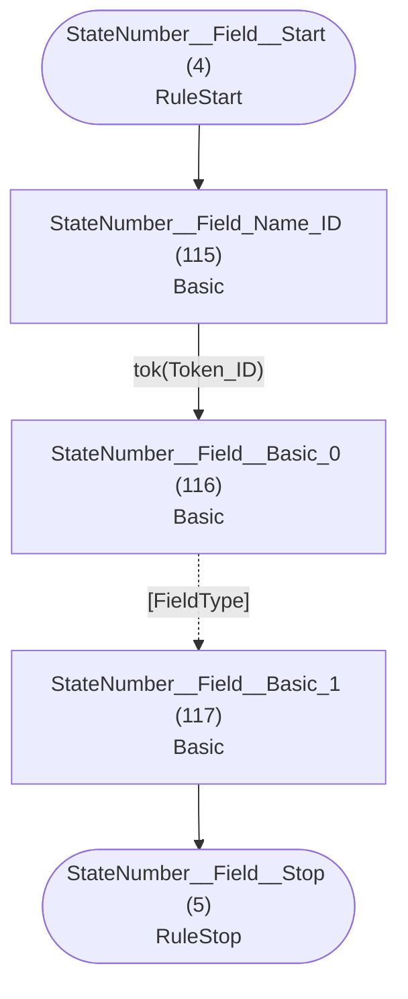
```mermaid
flowchart TD
    q4(["StateNumber__Field__Start (4)<br/>RuleStart"])
    q5(["StateNumber__Field__Stop (5)<br/>RuleStop"])
    q115["StateNumber__Field_Name_ID (115)<br/>Basic<br/>"]
    q116["StateNumber__Field__Basic_0 (116)<br/>Basic<br/>"]
    q117["StateNumber__Field__Basic_1 (117)<br/>Basic<br/>"]

    q4 --> q115
    q115 -->|"tok(Token_ID)"| q116
    q116 -.->|"[FieldType]"| q117
    q117 --> q5
```

## FieldType

```mermaid
flowchart TD
    q6(["StateNumber__FieldType__Start (6)<br/>RuleStart"])
    q7(["StateNumber__FieldType__Stop (7)<br/>RuleStop"])
    q118["StateNumber__FieldType__Basic_0 (118)<br/>Basic<br/>"]
    q119["StateNumber__FieldType__Basic_1 (119)<br/>Basic<br/>"]
    q120["StateNumber__FieldType__Basic_2 (120)<br/>Basic<br/>"]
    q121["StateNumber__FieldType__Basic_3 (121)<br/>Basic<br/>"]
    q122["StateNumber__FieldType__Basic_4 (122)<br/>Basic<br/>"]
    q123["StateNumber__FieldType__Basic_5 (123)<br/>Basic<br/>"]
    q124["StateNumber__FieldType__Basic_6 (124)<br/>Basic<br/>"]
    q125["StateNumber__FieldType__Basic_7 (125)<br/>Basic<br/>"]
    q126{"StateNumber__FieldType__Basic_8 (126)<br/>Basic<br/><br/>dec=6"}
    q127["StateNumber__FieldType__BlockEnd (127)<br/>BlockEnd<br/>"]

    q6 --> q126
    q118 -.->|"[SimpleType]"| q119
    q119 --> q127
    q120 -.->|"[ReferenceType]"| q121
    q121 --> q127
    q122 -.->|"[ArrayType]"| q123
    q123 --> q127
    q124 -.->|"[PrimitiveType]"| q125
    q125 --> q127
    q126 --> q118
    q126 --> q120
    q126 --> q122
    q126 --> q124
    q127 --> q7
```

## ArrayType

```mermaid
flowchart TD
    q8(["StateNumber__ArrayType__Start (8)<br/>RuleStart"])
    q9(["StateNumber__ArrayType__Stop (9)<br/>RuleStop"])
    q128["StateNumber__ArrayType_LEFTBRACKET (128)<br/>Basic<br/>"]
    q129["StateNumber__ArrayType_RIGHTBRACKET (129)<br/>Basic<br/>"]
    q130["StateNumber__ArrayType__Basic_0 (130)<br/>Basic<br/>"]
    q131["StateNumber__ArrayType__Basic_1 (131)<br/>Basic<br/>"]

    q8 --> q128
    q128 -->|"tok(Token_LEFTBRACKET)"| q129
    q129 -->|"tok(Token_RIGHTBRACKET)"| q130
    q130 -.->|"[FieldType]"| q131
    q131 --> q9
```

## ReferenceType

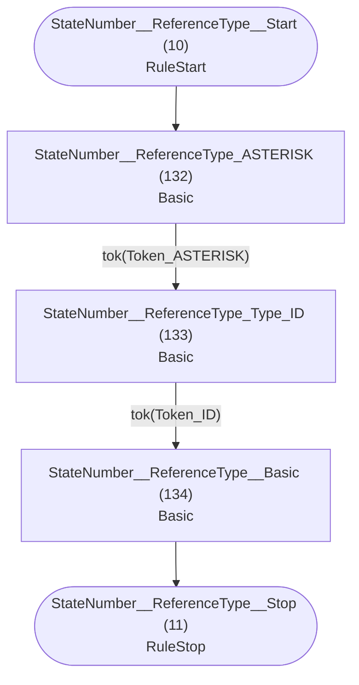
```mermaid
flowchart TD
    q10(["StateNumber__ReferenceType__Start (10)<br/>RuleStart"])
    q11(["StateNumber__ReferenceType__Stop (11)<br/>RuleStop"])
    q132["StateNumber__ReferenceType_ASTERISK (132)<br/>Basic<br/>"]
    q133["StateNumber__ReferenceType_Type_ID (133)<br/>Basic<br/>"]
    q134["StateNumber__ReferenceType__Basic (134)<br/>Basic<br/>"]

    q10 --> q132
    q132 -->|"tok(Token_ASTERISK)"| q133
    q133 -->|"tok(Token_ID)"| q134
    q134 --> q11
```

## SimpleType

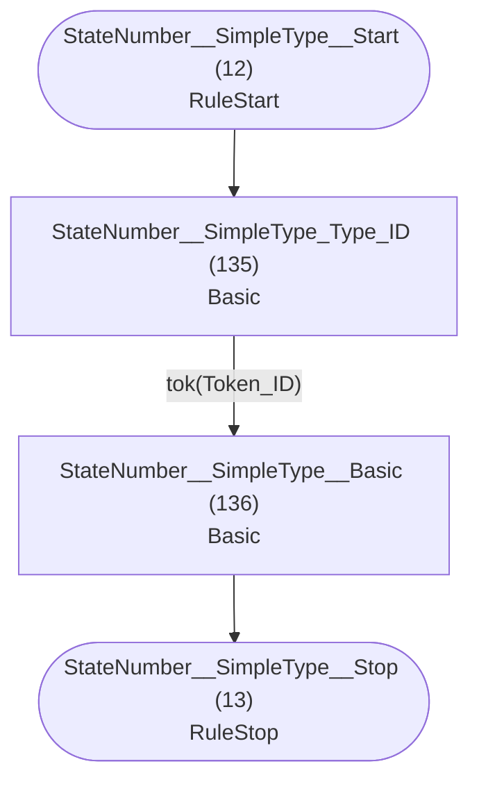
```mermaid
flowchart TD
    q12(["StateNumber__SimpleType__Start (12)<br/>RuleStart"])
    q13(["StateNumber__SimpleType__Stop (13)<br/>RuleStop"])
    q135["StateNumber__SimpleType_Type_ID (135)<br/>Basic<br/>"]
    q136["StateNumber__SimpleType__Basic (136)<br/>Basic<br/>"]

    q12 --> q135
    q135 -->|"tok(Token_ID)"| q136
    q136 --> q13
```

## PrimitiveType

```mermaid
flowchart TD
    q14(["StateNumber__PrimitiveType__Start (14)<br/>RuleStart"])
    q15(["StateNumber__PrimitiveType__Stop (15)<br/>RuleStop"])
    q137["StateNumber__PrimitiveType_Type_STRING (137)<br/>Basic<br/>"]
    q138["StateNumber__PrimitiveType__Basic_0 (138)<br/>Basic<br/>"]
    q139["StateNumber__PrimitiveType_Type_BOOL (139)<br/>Basic<br/>"]
    q140["StateNumber__PrimitiveType__Basic_1 (140)<br/>Basic<br/>"]
    q141["StateNumber__PrimitiveType_Type_COMPOSITE (141)<br/>Basic<br/>"]
    q142["StateNumber__PrimitiveType__Basic_2 (142)<br/>Basic<br/>"]
    q143{"StateNumber__PrimitiveType__Basic_3 (143)<br/>Basic<br/><br/>dec=7"}
    q144["StateNumber__PrimitiveType__BlockEnd (144)<br/>BlockEnd<br/>"]

    q14 --> q143
    q137 -->|"tok(Token_STRING)"| q138
    q138 --> q144
    q139 -->|"tok(Token_BOOL)"| q140
    q140 --> q144
    q141 -->|"tok(Token_COMPOSITE)"| q142
    q142 --> q144
    q143 --> q137
    q143 --> q139
    q143 --> q141
    q144 --> q15
```

## ParserRule

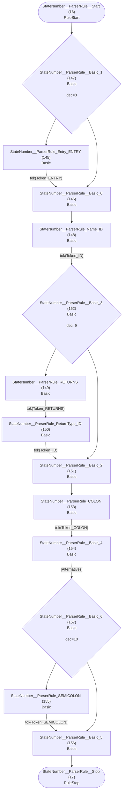
```mermaid
flowchart TD
    q16(["StateNumber__ParserRule__Start (16)<br/>RuleStart"])
    q17(["StateNumber__ParserRule__Stop (17)<br/>RuleStop"])
    q145["StateNumber__ParserRule_Entry_ENTRY (145)<br/>Basic<br/>"]
    q146["StateNumber__ParserRule__Basic_0 (146)<br/>Basic<br/>"]
    q147{"StateNumber__ParserRule__Basic_1 (147)<br/>Basic<br/><br/>dec=8"}
    q148["StateNumber__ParserRule_Name_ID (148)<br/>Basic<br/>"]
    q149["StateNumber__ParserRule_RETURNS (149)<br/>Basic<br/>"]
    q150["StateNumber__ParserRule_ReturnType_ID (150)<br/>Basic<br/>"]
    q151["StateNumber__ParserRule__Basic_2 (151)<br/>Basic<br/>"]
    q152{"StateNumber__ParserRule__Basic_3 (152)<br/>Basic<br/><br/>dec=9"}
    q153["StateNumber__ParserRule_COLON (153)<br/>Basic<br/>"]
    q154["StateNumber__ParserRule__Basic_4 (154)<br/>Basic<br/>"]
    q155["StateNumber__ParserRule_SEMICOLON (155)<br/>Basic<br/>"]
    q156["StateNumber__ParserRule__Basic_5 (156)<br/>Basic<br/>"]
    q157{"StateNumber__ParserRule__Basic_6 (157)<br/>Basic<br/><br/>dec=10"}

    q16 --> q147
    q145 -->|"tok(Token_ENTRY)"| q146
    q146 --> q148
    q147 --> q145
    q147 --> q146
    q148 -->|"tok(Token_ID)"| q152
    q149 -->|"tok(Token_RETURNS)"| q150
    q150 -->|"tok(Token_ID)"| q151
    q151 --> q153
    q152 --> q149
    q152 --> q151
    q153 -->|"tok(Token_COLON)"| q154
    q154 -.->|"[Alternatives]"| q157
    q155 -->|"tok(Token_SEMICOLON)"| q156
    q156 --> q17
    q157 --> q155
    q157 --> q156
```

## TokenDecl

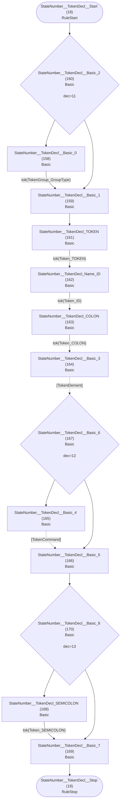
```mermaid
flowchart TD
    q18(["StateNumber__TokenDecl__Start (18)<br/>RuleStart"])
    q19(["StateNumber__TokenDecl__Stop (19)<br/>RuleStop"])
    q158["StateNumber__TokenDecl__Basic_0 (158)<br/>Basic<br/>"]
    q159["StateNumber__TokenDecl__Basic_1 (159)<br/>Basic<br/>"]
    q160{"StateNumber__TokenDecl__Basic_2 (160)<br/>Basic<br/><br/>dec=11"}
    q161["StateNumber__TokenDecl_TOKEN (161)<br/>Basic<br/>"]
    q162["StateNumber__TokenDecl_Name_ID (162)<br/>Basic<br/>"]
    q163["StateNumber__TokenDecl_COLON (163)<br/>Basic<br/>"]
    q164["StateNumber__TokenDecl__Basic_3 (164)<br/>Basic<br/>"]
    q165["StateNumber__TokenDecl__Basic_4 (165)<br/>Basic<br/>"]
    q166["StateNumber__TokenDecl__Basic_5 (166)<br/>Basic<br/>"]
    q167{"StateNumber__TokenDecl__Basic_6 (167)<br/>Basic<br/><br/>dec=12"}
    q168["StateNumber__TokenDecl_SEMICOLON (168)<br/>Basic<br/>"]
    q169["StateNumber__TokenDecl__Basic_7 (169)<br/>Basic<br/>"]
    q170{"StateNumber__TokenDecl__Basic_8 (170)<br/>Basic<br/><br/>dec=13"}

    q18 --> q160
    q158 -->|"tok(TokenGroup_GroupType)"| q159
    q159 --> q161
    q160 --> q158
    q160 --> q159
    q161 -->|"tok(Token_TOKEN)"| q162
    q162 -->|"tok(Token_ID)"| q163
    q163 -->|"tok(Token_COLON)"| q164
    q164 -.->|"[TokenElement]"| q167
    q165 -.->|"[TokenCommand]"| q166
    q166 --> q170
    q167 --> q165
    q167 --> q166
    q168 -->|"tok(Token_SEMICOLON)"| q169
    q169 --> q19
    q170 --> q168
    q170 --> q169
```

## TokenElement

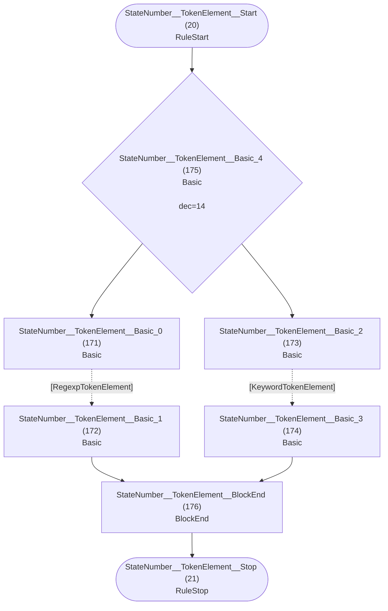
```mermaid
flowchart TD
    q20(["StateNumber__TokenElement__Start (20)<br/>RuleStart"])
    q21(["StateNumber__TokenElement__Stop (21)<br/>RuleStop"])
    q171["StateNumber__TokenElement__Basic_0 (171)<br/>Basic<br/>"]
    q172["StateNumber__TokenElement__Basic_1 (172)<br/>Basic<br/>"]
    q173["StateNumber__TokenElement__Basic_2 (173)<br/>Basic<br/>"]
    q174["StateNumber__TokenElement__Basic_3 (174)<br/>Basic<br/>"]
    q175{"StateNumber__TokenElement__Basic_4 (175)<br/>Basic<br/><br/>dec=14"}
    q176["StateNumber__TokenElement__BlockEnd (176)<br/>BlockEnd<br/>"]

    q20 --> q175
    q171 -.->|"[RegexpTokenElement]"| q172
    q172 --> q176
    q173 -.->|"[KeywordTokenElement]"| q174
    q174 --> q176
    q175 --> q171
    q175 --> q173
    q176 --> q21
```

## RegexpTokenElement

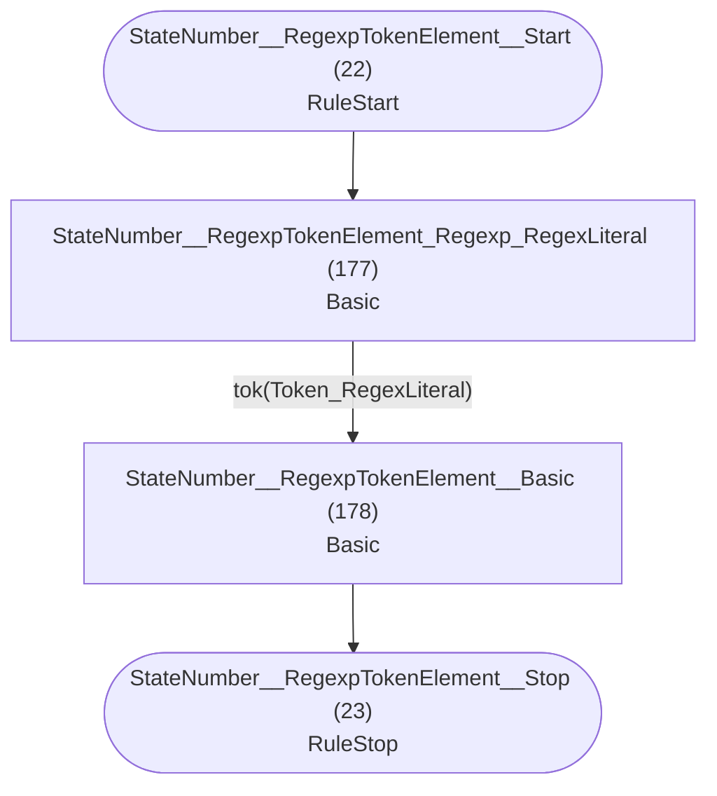
```mermaid
flowchart TD
    q22(["StateNumber__RegexpTokenElement__Start (22)<br/>RuleStart"])
    q23(["StateNumber__RegexpTokenElement__Stop (23)<br/>RuleStop"])
    q177["StateNumber__RegexpTokenElement_Regexp_RegexLiteral (177)<br/>Basic<br/>"]
    q178["StateNumber__RegexpTokenElement__Basic (178)<br/>Basic<br/>"]

    q22 --> q177
    q177 -->|"tok(Token_RegexLiteral)"| q178
    q178 --> q23
```

## KeywordTokenElement

```mermaid
flowchart TD
    q24(["StateNumber__KeywordTokenElement__Start (24)<br/>RuleStart"])
    q25(["StateNumber__KeywordTokenElement__Stop (25)<br/>RuleStop"])
    q179["StateNumber__KeywordTokenElement__Basic_0 (179)<br/>Basic<br/>"]
    q180["StateNumber__KeywordTokenElement__Basic_1 (180)<br/>Basic<br/>"]

    q24 --> q179
    q179 -.->|"[Keyword]"| q180
    q180 --> q25
```

## TokenCommand

```mermaid
flowchart TD
    q26(["StateNumber__TokenCommand__Start (26)<br/>RuleStart"])
    q27(["StateNumber__TokenCommand__Stop (27)<br/>RuleStop"])
    q181["StateNumber__TokenCommand_ARROW (181)<br/>Basic<br/>"]
    q182["StateNumber__TokenCommand_Type_PUSH (182)<br/>Basic<br/>"]
    q183["StateNumber__TokenCommand__Basic_0 (183)<br/>Basic<br/>"]
    q184["StateNumber__TokenCommand_Type_POP (184)<br/>Basic<br/>"]
    q185["StateNumber__TokenCommand__Basic_1 (185)<br/>Basic<br/>"]
    q186["StateNumber__TokenCommand_Type_MODE (186)<br/>Basic<br/>"]
    q187["StateNumber__TokenCommand__Basic_2 (187)<br/>Basic<br/>"]
    q188{"StateNumber__TokenCommand__Basic_3 (188)<br/>Basic<br/><br/>dec=15"}
    q189["StateNumber__TokenCommand__BlockEnd_0 (189)<br/>BlockEnd<br/>"]
    q190["StateNumber__TokenCommand_LEFTPAREN (190)<br/>Basic<br/>"]
    q191["StateNumber__TokenCommand_Mode_ID (191)<br/>Basic<br/>"]
    q192["StateNumber__TokenCommand__Basic_4 (192)<br/>Basic<br/>"]
    q193["StateNumber__TokenCommand_Default_DEFAULT (193)<br/>Basic<br/>"]
    q194["StateNumber__TokenCommand__Basic_5 (194)<br/>Basic<br/>"]
    q195{"StateNumber__TokenCommand__Basic_6 (195)<br/>Basic<br/><br/>dec=16"}
    q196["StateNumber__TokenCommand__BlockEnd_1 (196)<br/>BlockEnd<br/>"]
    q197["StateNumber__TokenCommand_RIGHTPAREN (197)<br/>Basic<br/>"]
    q198["StateNumber__TokenCommand__Basic_7 (198)<br/>Basic<br/>"]
    q199{"StateNumber__TokenCommand__Basic_8 (199)<br/>Basic<br/><br/>dec=17"}

    q26 --> q181
    q181 -->|"tok(Token_ARROW)"| q188
    q182 -->|"tok(Token_PUSH)"| q183
    q183 --> q189
    q184 -->|"tok(Token_POP)"| q185
    q185 --> q189
    q186 -->|"tok(Token_MODE)"| q187
    q187 --> q189
    q188 --> q182
    q188 --> q184
    q188 --> q186
    q189 --> q199
    q190 -->|"tok(Token_LEFTPAREN)"| q195
    q191 -->|"tok(Token_ID)"| q192
    q192 --> q196
    q193 -->|"tok(Token_DEFAULT)"| q194
    q194 --> q196
    q195 --> q191
    q195 --> q193
    q196 --> q197
    q197 -->|"tok(Token_RIGHTPAREN)"| q198
    q198 --> q27
    q199 --> q190
    q199 --> q198
```

## TokenGroup

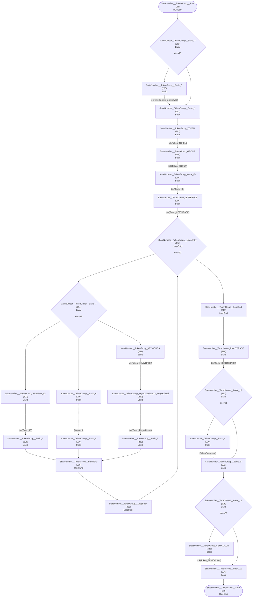
```mermaid
flowchart TD
    q28(["StateNumber__TokenGroup__Start (28)<br/>RuleStart"])
    q29(["StateNumber__TokenGroup__Stop (29)<br/>RuleStop"])
    q200["StateNumber__TokenGroup__Basic_0 (200)<br/>Basic<br/>"]
    q201["StateNumber__TokenGroup__Basic_1 (201)<br/>Basic<br/>"]
    q202{"StateNumber__TokenGroup__Basic_2 (202)<br/>Basic<br/><br/>dec=18"}
    q203["StateNumber__TokenGroup_TOKEN (203)<br/>Basic<br/>"]
    q204["StateNumber__TokenGroup_GROUP (204)<br/>Basic<br/>"]
    q205["StateNumber__TokenGroup_Name_ID (205)<br/>Basic<br/>"]
    q206["StateNumber__TokenGroup_LEFTBRACE (206)<br/>Basic<br/>"]
    q207["StateNumber__TokenGroup_TokenRefs_ID (207)<br/>Basic<br/>"]
    q208["StateNumber__TokenGroup__Basic_3 (208)<br/>Basic<br/>"]
    q209["StateNumber__TokenGroup__Basic_4 (209)<br/>Basic<br/>"]
    q210["StateNumber__TokenGroup__Basic_5 (210)<br/>Basic<br/>"]
    q211["StateNumber__TokenGroup_KEYWORDS (211)<br/>Basic<br/>"]
    q212["StateNumber__TokenGroup_KeywordSelectors_RegexLiteral (212)<br/>Basic<br/>"]
    q213["StateNumber__TokenGroup__Basic_6 (213)<br/>Basic<br/>"]
    q214{"StateNumber__TokenGroup__Basic_7 (214)<br/>Basic<br/><br/>dec=19"}
    q215["StateNumber__TokenGroup__BlockEnd (215)<br/>BlockEnd<br/>"]
    q216{"StateNumber__TokenGroup__LoopEntry (216)<br/>LoopEntry<br/><br/>dec=20"}
    q217["StateNumber__TokenGroup__LoopEnd (217)<br/>LoopEnd<br/>"]
    q218["StateNumber__TokenGroup__LoopBack (218)<br/>LoopBack<br/>"]
    q219["StateNumber__TokenGroup_RIGHTBRACE (219)<br/>Basic<br/>"]
    q220["StateNumber__TokenGroup__Basic_8 (220)<br/>Basic<br/>"]
    q221["StateNumber__TokenGroup__Basic_9 (221)<br/>Basic<br/>"]
    q222{"StateNumber__TokenGroup__Basic_10 (222)<br/>Basic<br/><br/>dec=21"}
    q223["StateNumber__TokenGroup_SEMICOLON (223)<br/>Basic<br/>"]
    q224["StateNumber__TokenGroup__Basic_11 (224)<br/>Basic<br/>"]
    q225{"StateNumber__TokenGroup__Basic_12 (225)<br/>Basic<br/><br/>dec=22"}

    q28 --> q202
    q200 -->|"tok(TokenGroup_GroupType)"| q201
    q201 --> q203
    q202 --> q200
    q202 --> q201
    q203 -->|"tok(Token_TOKEN)"| q204
    q204 -->|"tok(Token_GROUP)"| q205
    q205 -->|"tok(Token_ID)"| q206
    q206 -->|"tok(Token_LEFTBRACE)"| q216
    q207 -->|"tok(Token_ID)"| q208
    q208 --> q215
    q209 -.->|"[Keyword]"| q210
    q210 --> q215
    q211 -->|"tok(Token_KEYWORDS)"| q212
    q212 -->|"tok(Token_RegexLiteral)"| q213
    q213 --> q215
    q214 --> q207
    q214 --> q209
    q214 --> q211
    q215 --> q218
    q216 --> q214
    q216 --> q217
    q217 --> q219
    q218 --> q216
    q219 -->|"tok(Token_RIGHTBRACE)"| q222
    q220 -.->|"[TokenCommand]"| q221
    q221 --> q225
    q222 --> q220
    q222 --> q221
    q223 -->|"tok(Token_SEMICOLON)"| q224
    q224 --> q29
    q225 --> q223
    q225 --> q224
```

## TokenMode

```mermaid
flowchart TD
    q30(["StateNumber__TokenMode__Start (30)<br/>RuleStart"])
    q31(["StateNumber__TokenMode__Stop (31)<br/>RuleStop"])
    q226["StateNumber__TokenMode_TOKEN (226)<br/>Basic<br/>"]
    q227["StateNumber__TokenMode_MODE (227)<br/>Basic<br/>"]
    q228["StateNumber__TokenMode_Name_ID (228)<br/>Basic<br/>"]
    q229["StateNumber__TokenMode__Basic_0 (229)<br/>Basic<br/>"]
    q230["StateNumber__TokenMode_Default_DEFAULT (230)<br/>Basic<br/>"]
    q231["StateNumber__TokenMode__Basic_1 (231)<br/>Basic<br/>"]
    q232{"StateNumber__TokenMode__Basic_2 (232)<br/>Basic<br/><br/>dec=23"}
    q233["StateNumber__TokenMode__BlockEnd (233)<br/>BlockEnd<br/>"]
    q234["StateNumber__TokenMode_LEFTBRACE (234)<br/>Basic<br/>"]
    q235["StateNumber__TokenMode__Basic_3 (235)<br/>Basic<br/>"]
    q236["StateNumber__TokenMode__Basic_4 (236)<br/>Basic<br/>"]
    q237{"StateNumber__TokenMode__LoopEntry (237)<br/>LoopEntry<br/><br/>dec=24"}
    q238["StateNumber__TokenMode__LoopEnd (238)<br/>LoopEnd<br/>"]
    q239["StateNumber__TokenMode__LoopBack (239)<br/>LoopBack<br/>"]
    q240["StateNumber__TokenMode_RIGHTBRACE (240)<br/>Basic<br/>"]
    q241["StateNumber__TokenMode__Basic_5 (241)<br/>Basic<br/>"]

    q30 --> q226
    q226 -->|"tok(Token_TOKEN)"| q227
    q227 -->|"tok(Token_MODE)"| q232
    q228 -->|"tok(Token_ID)"| q229
    q229 --> q233
    q230 -->|"tok(Token_DEFAULT)"| q231
    q231 --> q233
    q232 --> q228
    q232 --> q230
    q233 --> q234
    q234 -->|"tok(Token_LEFTBRACE)"| q237
    q235 -.->|"[TokenModeMember]"| q236
    q236 --> q239
    q237 --> q235
    q237 --> q238
    q238 --> q240
    q239 --> q237
    q240 -->|"tok(Token_RIGHTBRACE)"| q241
    q241 --> q31
```

## TokenModeMember

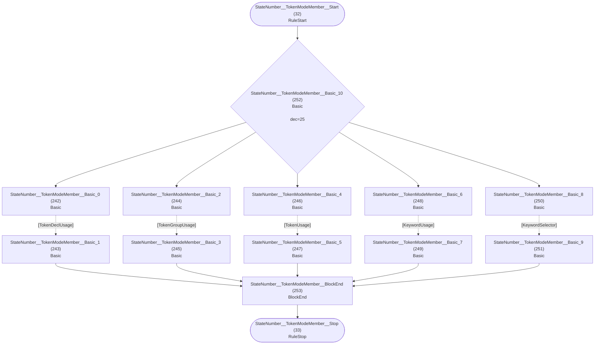
```mermaid
flowchart TD
    q32(["StateNumber__TokenModeMember__Start (32)<br/>RuleStart"])
    q33(["StateNumber__TokenModeMember__Stop (33)<br/>RuleStop"])
    q242["StateNumber__TokenModeMember__Basic_0 (242)<br/>Basic<br/>"]
    q243["StateNumber__TokenModeMember__Basic_1 (243)<br/>Basic<br/>"]
    q244["StateNumber__TokenModeMember__Basic_2 (244)<br/>Basic<br/>"]
    q245["StateNumber__TokenModeMember__Basic_3 (245)<br/>Basic<br/>"]
    q246["StateNumber__TokenModeMember__Basic_4 (246)<br/>Basic<br/>"]
    q247["StateNumber__TokenModeMember__Basic_5 (247)<br/>Basic<br/>"]
    q248["StateNumber__TokenModeMember__Basic_6 (248)<br/>Basic<br/>"]
    q249["StateNumber__TokenModeMember__Basic_7 (249)<br/>Basic<br/>"]
    q250["StateNumber__TokenModeMember__Basic_8 (250)<br/>Basic<br/>"]
    q251["StateNumber__TokenModeMember__Basic_9 (251)<br/>Basic<br/>"]
    q252{"StateNumber__TokenModeMember__Basic_10 (252)<br/>Basic<br/><br/>dec=25"}
    q253["StateNumber__TokenModeMember__BlockEnd (253)<br/>BlockEnd<br/>"]

    q32 --> q252
    q242 -.->|"[TokenDeclUsage]"| q243
    q243 --> q253
    q244 -.->|"[TokenGroupUsage]"| q245
    q245 --> q253
    q246 -.->|"[TokenUsage]"| q247
    q247 --> q253
    q248 -.->|"[KeywordUsage]"| q249
    q249 --> q253
    q250 -.->|"[KeywordSelector]"| q251
    q251 --> q253
    q252 --> q242
    q252 --> q244
    q252 --> q246
    q252 --> q248
    q252 --> q250
    q253 --> q33
```

## TokenDeclUsage

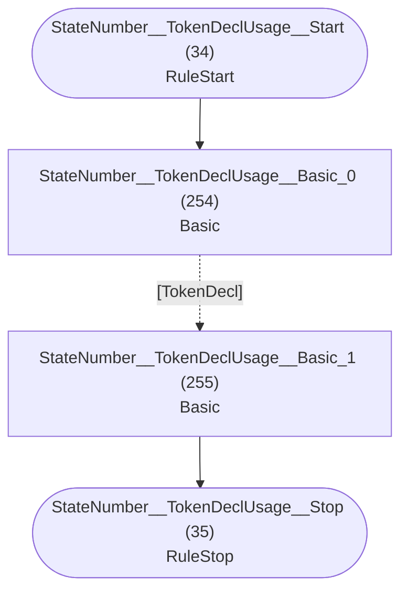
```mermaid
flowchart TD
    q34(["StateNumber__TokenDeclUsage__Start (34)<br/>RuleStart"])
    q35(["StateNumber__TokenDeclUsage__Stop (35)<br/>RuleStop"])
    q254["StateNumber__TokenDeclUsage__Basic_0 (254)<br/>Basic<br/>"]
    q255["StateNumber__TokenDeclUsage__Basic_1 (255)<br/>Basic<br/>"]

    q34 --> q254
    q254 -.->|"[TokenDecl]"| q255
    q255 --> q35
```

## TokenGroupUsage

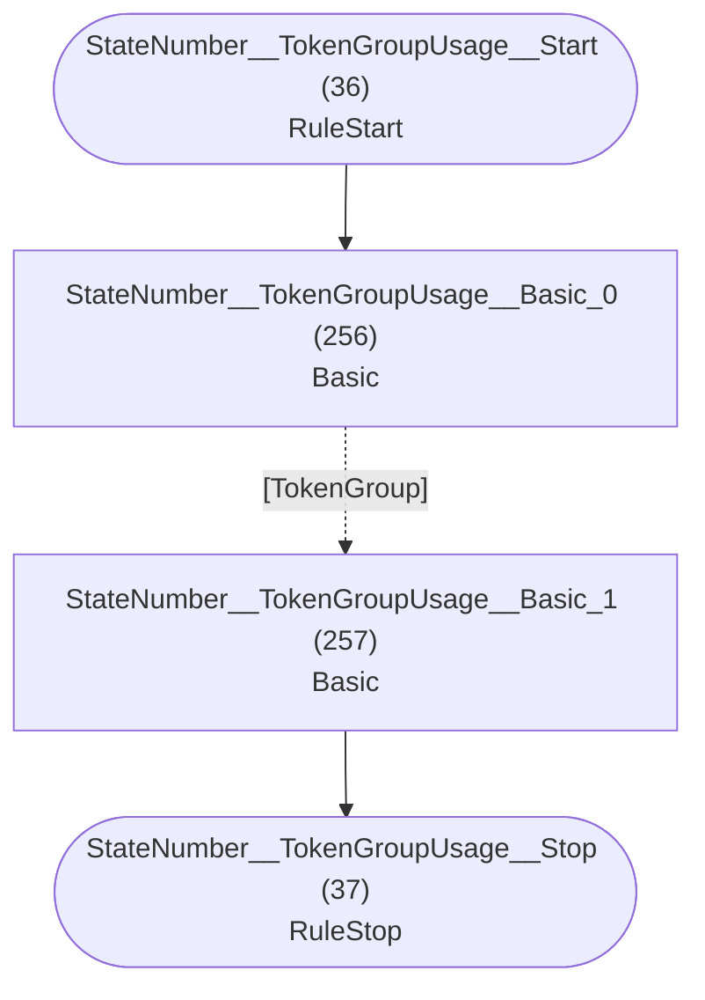
```mermaid
flowchart TD
    q36(["StateNumber__TokenGroupUsage__Start (36)<br/>RuleStart"])
    q37(["StateNumber__TokenGroupUsage__Stop (37)<br/>RuleStop"])
    q256["StateNumber__TokenGroupUsage__Basic_0 (256)<br/>Basic<br/>"]
    q257["StateNumber__TokenGroupUsage__Basic_1 (257)<br/>Basic<br/>"]

    q36 --> q256
    q256 -.->|"[TokenGroup]"| q257
    q257 --> q37
```

## TokenUsage

```mermaid
flowchart TD
    q38(["StateNumber__TokenUsage__Start (38)<br/>RuleStart"])
    q39(["StateNumber__TokenUsage__Stop (39)<br/>RuleStop"])
    q258["StateNumber__TokenUsage__Basic_0 (258)<br/>Basic<br/>"]
    q259["StateNumber__TokenUsage__Basic_1 (259)<br/>Basic<br/>"]
    q260{"StateNumber__TokenUsage__Basic_2 (260)<br/>Basic<br/><br/>dec=26"}
    q261["StateNumber__TokenUsage_TokenRef_ID (261)<br/>Basic<br/>"]
    q262["StateNumber__TokenUsage__Basic_3 (262)<br/>Basic<br/>"]
    q263["StateNumber__TokenUsage__Basic_4 (263)<br/>Basic<br/>"]
    q264{"StateNumber__TokenUsage__Basic_5 (264)<br/>Basic<br/><br/>dec=27"}
    q265["StateNumber__TokenUsage_SEMICOLON (265)<br/>Basic<br/>"]
    q266["StateNumber__TokenUsage__Basic_6 (266)<br/>Basic<br/>"]
    q267{"StateNumber__TokenUsage__Basic_7 (267)<br/>Basic<br/><br/>dec=28"}

    q38 --> q260
    q258 -->|"tok(TokenGroup_GroupType)"| q259
    q259 --> q261
    q260 --> q258
    q260 --> q259
    q261 -->|"tok(Token_ID)"| q264
    q262 -.->|"[TokenCommand]"| q263
    q263 --> q267
    q264 --> q262
    q264 --> q263
    q265 -->|"tok(Token_SEMICOLON)"| q266
    q266 --> q39
    q267 --> q265
    q267 --> q266
```

## KeywordUsage

```mermaid
flowchart TD
    q40(["StateNumber__KeywordUsage__Start (40)<br/>RuleStart"])
    q41(["StateNumber__KeywordUsage__Stop (41)<br/>RuleStop"])
    q268["StateNumber__KeywordUsage__Basic_0 (268)<br/>Basic<br/>"]
    q269["StateNumber__KeywordUsage__Basic_1 (269)<br/>Basic<br/>"]
    q270{"StateNumber__KeywordUsage__Basic_2 (270)<br/>Basic<br/><br/>dec=29"}
    q271["StateNumber__KeywordUsage__Basic_3 (271)<br/>Basic<br/>"]
    q272["StateNumber__KeywordUsage__Basic_4 (272)<br/>Basic<br/>"]
    q273["StateNumber__KeywordUsage__Basic_5 (273)<br/>Basic<br/>"]
    q274{"StateNumber__KeywordUsage__Basic_6 (274)<br/>Basic<br/><br/>dec=30"}
    q275["StateNumber__KeywordUsage_SEMICOLON (275)<br/>Basic<br/>"]
    q276["StateNumber__KeywordUsage__Basic_7 (276)<br/>Basic<br/>"]
    q277{"StateNumber__KeywordUsage__Basic_8 (277)<br/>Basic<br/><br/>dec=31"}

    q40 --> q270
    q268 -->|"tok(TokenGroup_GroupType)"| q269
    q269 --> q271
    q270 --> q268
    q270 --> q269
    q271 -.->|"[Keyword]"| q274
    q272 -.->|"[TokenCommand]"| q273
    q273 --> q277
    q274 --> q272
    q274 --> q273
    q275 -->|"tok(Token_SEMICOLON)"| q276
    q276 --> q41
    q277 --> q275
    q277 --> q276
```

## KeywordSelector

```mermaid
flowchart TD
    q42(["StateNumber__KeywordSelector__Start (42)<br/>RuleStart"])
    q43(["StateNumber__KeywordSelector__Stop (43)<br/>RuleStop"])
    q278["StateNumber__KeywordSelector_KEYWORDS (278)<br/>Basic<br/>"]
    q279["StateNumber__KeywordSelector_Selector_RegexLiteral (279)<br/>Basic<br/>"]
    q280["StateNumber__KeywordSelector_SEMICOLON (280)<br/>Basic<br/>"]
    q281["StateNumber__KeywordSelector__Basic_0 (281)<br/>Basic<br/>"]
    q282{"StateNumber__KeywordSelector__Basic_1 (282)<br/>Basic<br/><br/>dec=32"}

    q42 --> q278
    q278 -->|"tok(Token_KEYWORDS)"| q279
    q279 -->|"tok(Token_RegexLiteral)"| q282
    q280 -->|"tok(Token_SEMICOLON)"| q281
    q281 --> q43
    q282 --> q280
    q282 --> q281
```

## Alternatives

```mermaid
flowchart TD
    q44(["StateNumber__Alternatives__Start (44)<br/>RuleStart"])
    q45(["StateNumber__Alternatives__Stop (45)<br/>RuleStop"])
    q283["StateNumber__Alternatives__Basic_0 (283)<br/>Basic<br/>"]
    q284["StateNumber__Alternatives_PIPE (284)<br/>Basic<br/>"]
    q285["StateNumber__Alternatives__Basic_1 (285)<br/>Basic<br/>"]
    q286["StateNumber__Alternatives__Basic_2 (286)<br/>Basic<br/>"]
    q287{"StateNumber__Alternatives__LoopBack (287)<br/>LoopBack<br/><br/>dec=33"}
    q288["StateNumber__Alternatives__LoopEnd (288)<br/>LoopEnd<br/>"]
    q289{"StateNumber__Alternatives__Basic_3 (289)<br/>Basic<br/><br/>dec=34"}

    q44 --> q283
    q283 -.->|"[Group]"| q289
    q284 -->|"tok(Token_PIPE)"| q285
    q285 -.->|"[Group]"| q286
    q286 --> q287
    q287 --> q284
    q287 --> q288
    q288 --> q45
    q289 --> q284
    q289 --> q288
```

## Group

```mermaid
flowchart TD
    q46(["StateNumber__Group__Start (46)<br/>RuleStart"])
    q47(["StateNumber__Group__Stop (47)<br/>RuleStop"])
    q290["StateNumber__Group__Basic_0 (290)<br/>Basic<br/>"]
    q291["StateNumber__Group__Basic_1 (291)<br/>Basic<br/>"]
    q292["StateNumber__Group__Basic_2 (292)<br/>Basic<br/>"]
    q293{"StateNumber__Group__LoopBack (293)<br/>LoopBack<br/><br/>dec=35"}
    q294["StateNumber__Group__LoopEnd (294)<br/>LoopEnd<br/>"]
    q295{"StateNumber__Group__Basic_3 (295)<br/>Basic<br/><br/>dec=36"}

    q46 --> q290
    q290 -.->|"[Element]"| q295
    q291 -.->|"[Element]"| q292
    q292 --> q293
    q293 --> q291
    q293 --> q294
    q294 --> q47
    q295 --> q291
    q295 --> q294
```

## Element

```mermaid
flowchart TD
    q48(["StateNumber__Element__Start (48)<br/>RuleStart"])
    q49(["StateNumber__Element__Stop (49)<br/>RuleStop"])
    q296["StateNumber__Element__Basic_0 (296)<br/>Basic<br/>"]
    q297["StateNumber__Element__Basic_1 (297)<br/>Basic<br/>"]
    q298["StateNumber__Element__Basic_2 (298)<br/>Basic<br/>"]
    q299["StateNumber__Element__Basic_3 (299)<br/>Basic<br/>"]
    q300["StateNumber__Element__Basic_4 (300)<br/>Basic<br/>"]
    q301["StateNumber__Element__Basic_5 (301)<br/>Basic<br/>"]
    q302["StateNumber__Element__Basic_6 (302)<br/>Basic<br/>"]
    q303["StateNumber__Element__Basic_7 (303)<br/>Basic<br/>"]
    q304["StateNumber__Element_LEFTPAREN (304)<br/>Basic<br/>"]
    q305["StateNumber__Element__Basic_8 (305)<br/>Basic<br/>"]
    q306["StateNumber__Element_RIGHTPAREN (306)<br/>Basic<br/>"]
    q307["StateNumber__Element__Basic_9 (307)<br/>Basic<br/>"]
    q308{"StateNumber__Element__Basic_10 (308)<br/>Basic<br/><br/>dec=37"}
    q309["StateNumber__Element__BlockEnd (309)<br/>BlockEnd<br/>"]
    q310["StateNumber__Element__Basic_11 (310)<br/>Basic<br/>"]
    q311["StateNumber__Element__Basic_12 (311)<br/>Basic<br/>"]
    q312{"StateNumber__Element__Basic_13 (312)<br/>Basic<br/><br/>dec=38"}

    q48 --> q308
    q296 -.->|"[Keyword]"| q297
    q297 --> q309
    q298 -.->|"[Assignment]"| q299
    q299 --> q309
    q300 -.->|"[RuleCall]"| q301
    q301 --> q309
    q302 -.->|"[Action]"| q303
    q303 --> q309
    q304 -->|"tok(Token_LEFTPAREN)"| q305
    q305 -.->|"[Alternatives]"| q306
    q306 -->|"tok(Token_RIGHTPAREN)"| q307
    q307 --> q309
    q308 --> q296
    q308 --> q298
    q308 --> q300
    q308 --> q302
    q308 --> q304
    q309 --> q312
    q310 -->|"tok(TokenGroup_Cardinality)"| q311
    q311 --> q49
    q312 --> q310
    q312 --> q311
```

## Keyword

```mermaid
flowchart TD
    q50(["StateNumber__Keyword__Start (50)<br/>RuleStart"])
    q51(["StateNumber__Keyword__Stop (51)<br/>RuleStop"])
    q313["StateNumber__Keyword_Value_StringLiteral (313)<br/>Basic<br/>"]
    q314["StateNumber__Keyword__Basic (314)<br/>Basic<br/>"]

    q50 --> q313
    q313 -->|"tok(Token_StringLiteral)"| q314
    q314 --> q51
```

## Assignment

```mermaid
flowchart TD
    q52(["StateNumber__Assignment__Start (52)<br/>RuleStart"])
    q53(["StateNumber__Assignment__Stop (53)<br/>RuleStop"])
    q315["StateNumber__Assignment_Property_ID (315)<br/>Basic<br/>"]
    q316["StateNumber__Assignment_Operator_PLUS_EQUALS (316)<br/>Basic<br/>"]
    q317["StateNumber__Assignment__Basic_0 (317)<br/>Basic<br/>"]
    q318["StateNumber__Assignment_Operator_EQUALS (318)<br/>Basic<br/>"]
    q319["StateNumber__Assignment__Basic_1 (319)<br/>Basic<br/>"]
    q320["StateNumber__Assignment_Operator_QUESTION_EQUALS (320)<br/>Basic<br/>"]
    q321["StateNumber__Assignment__Basic_2 (321)<br/>Basic<br/>"]
    q322{"StateNumber__Assignment__Basic_3 (322)<br/>Basic<br/><br/>dec=39"}
    q323["StateNumber__Assignment__BlockEnd (323)<br/>BlockEnd<br/>"]
    q324["StateNumber__Assignment__Basic_4 (324)<br/>Basic<br/>"]
    q325["StateNumber__Assignment__Basic_5 (325)<br/>Basic<br/>"]

    q52 --> q315
    q315 -->|"tok(Token_ID)"| q322
    q316 -->|"tok(Token_PLUS_EQUALS)"| q317
    q317 --> q323
    q318 -->|"tok(Token_EQUALS)"| q319
    q319 --> q323
    q320 -->|"tok(Token_QUESTION_EQUALS)"| q321
    q321 --> q323
    q322 --> q316
    q322 --> q318
    q322 --> q320
    q323 --> q324
    q324 -.->|"[Assignable]"| q325
    q325 --> q53
```

## Assignable

```mermaid
flowchart TD
    q54(["StateNumber__Assignable__Start (54)<br/>RuleStart"])
    q55(["StateNumber__Assignable__Stop (55)<br/>RuleStop"])
    q326["StateNumber__Assignable__Basic_0 (326)<br/>Basic<br/>"]
    q327["StateNumber__Assignable__Basic_1 (327)<br/>Basic<br/>"]
    q328["StateNumber__Assignable__Basic_2 (328)<br/>Basic<br/>"]
    q329["StateNumber__Assignable__Basic_3 (329)<br/>Basic<br/>"]
    q330["StateNumber__Assignable__Basic_4 (330)<br/>Basic<br/>"]
    q331["StateNumber__Assignable__Basic_5 (331)<br/>Basic<br/>"]
    q332["StateNumber__Assignable_LEFTPAREN (332)<br/>Basic<br/>"]
    q333["StateNumber__Assignable__Basic_6 (333)<br/>Basic<br/>"]
    q334["StateNumber__Assignable_RIGHTPAREN (334)<br/>Basic<br/>"]
    q335["StateNumber__Assignable__Basic_7 (335)<br/>Basic<br/>"]
    q336{"StateNumber__Assignable__Basic_8 (336)<br/>Basic<br/><br/>dec=40"}
    q337["StateNumber__Assignable__BlockEnd (337)<br/>BlockEnd<br/>"]

    q54 --> q336
    q326 -.->|"[Keyword]"| q327
    q327 --> q337
    q328 -.->|"[RuleCall]"| q329
    q329 --> q337
    q330 -.->|"[CrossRef]"| q331
    q331 --> q337
    q332 -->|"tok(Token_LEFTPAREN)"| q333
    q333 -.->|"[AssignableAlternatives]"| q334
    q334 -->|"tok(Token_RIGHTPAREN)"| q335
    q335 --> q337
    q336 --> q326
    q336 --> q328
    q336 --> q330
    q336 --> q332
    q337 --> q55
```

## AssignableWithoutAlts

```mermaid
flowchart TD
    q56(["StateNumber__AssignableWithoutAlts__Start (56)<br/>RuleStart"])
    q57(["StateNumber__AssignableWithoutAlts__Stop (57)<br/>RuleStop"])
    q338["StateNumber__AssignableWithoutAlts__Basic_0 (338)<br/>Basic<br/>"]
    q339["StateNumber__AssignableWithoutAlts__Basic_1 (339)<br/>Basic<br/>"]
    q340["StateNumber__AssignableWithoutAlts__Basic_2 (340)<br/>Basic<br/>"]
    q341["StateNumber__AssignableWithoutAlts__Basic_3 (341)<br/>Basic<br/>"]
    q342["StateNumber__AssignableWithoutAlts__Basic_4 (342)<br/>Basic<br/>"]
    q343["StateNumber__AssignableWithoutAlts__Basic_5 (343)<br/>Basic<br/>"]
    q344{"StateNumber__AssignableWithoutAlts__Basic_6 (344)<br/>Basic<br/><br/>dec=41"}
    q345["StateNumber__AssignableWithoutAlts__BlockEnd (345)<br/>BlockEnd<br/>"]

    q56 --> q344
    q338 -.->|"[Keyword]"| q339
    q339 --> q345
    q340 -.->|"[RuleCall]"| q341
    q341 --> q345
    q342 -.->|"[CrossRef]"| q343
    q343 --> q345
    q344 --> q338
    q344 --> q340
    q344 --> q342
    q345 --> q57
```

## AssignableAlternatives

```mermaid
flowchart TD
    q58(["StateNumber__AssignableAlternatives__Start (58)<br/>RuleStart"])
    q59(["StateNumber__AssignableAlternatives__Stop (59)<br/>RuleStop"])
    q346["StateNumber__AssignableAlternatives__Basic_0 (346)<br/>Basic<br/>"]
    q347["StateNumber__AssignableAlternatives_PIPE (347)<br/>Basic<br/>"]
    q348["StateNumber__AssignableAlternatives__Basic_1 (348)<br/>Basic<br/>"]
    q349["StateNumber__AssignableAlternatives__Basic_2 (349)<br/>Basic<br/>"]
    q350{"StateNumber__AssignableAlternatives__LoopBack (350)<br/>LoopBack<br/><br/>dec=42"}
    q351["StateNumber__AssignableAlternatives__LoopEnd (351)<br/>LoopEnd<br/>"]
    q352{"StateNumber__AssignableAlternatives__Basic_3 (352)<br/>Basic<br/><br/>dec=43"}

    q58 --> q346
    q346 -.->|"[AssignableWithoutAlts]"| q352
    q347 -->|"tok(Token_PIPE)"| q348
    q348 -.->|"[AssignableWithoutAlts]"| q349
    q349 --> q350
    q350 --> q347
    q350 --> q351
    q351 --> q59
    q352 --> q347
    q352 --> q351
```

## CrossRef

```mermaid
flowchart TD
    q60(["StateNumber__CrossRef__Start (60)<br/>RuleStart"])
    q61(["StateNumber__CrossRef__Stop (61)<br/>RuleStop"])
    q353["StateNumber__CrossRef_LEFTBRACKET (353)<br/>Basic<br/>"]
    q354["StateNumber__CrossRef_Type_ID (354)<br/>Basic<br/>"]
    q355["StateNumber__CrossRef_COLON (355)<br/>Basic<br/>"]
    q356["StateNumber__CrossRef__Basic_0 (356)<br/>Basic<br/>"]
    q357["StateNumber__CrossRef__Basic_1 (357)<br/>Basic<br/>"]
    q358{"StateNumber__CrossRef__Basic_2 (358)<br/>Basic<br/><br/>dec=44"}
    q359["StateNumber__CrossRef_RIGHTBRACKET (359)<br/>Basic<br/>"]
    q360["StateNumber__CrossRef__Basic_3 (360)<br/>Basic<br/>"]

    q60 --> q353
    q353 -->|"tok(Token_LEFTBRACKET)"| q354
    q354 -->|"tok(Token_ID)"| q358
    q355 -->|"tok(Token_COLON)"| q356
    q356 -.->|"[RuleCall]"| q357
    q357 --> q359
    q358 --> q355
    q358 --> q357
    q359 -->|"tok(Token_RIGHTBRACKET)"| q360
    q360 --> q61
```

## RuleCall

```mermaid
flowchart TD
    q62(["StateNumber__RuleCall__Start (62)<br/>RuleStart"])
    q63(["StateNumber__RuleCall__Stop (63)<br/>RuleStop"])
    q361["StateNumber__RuleCall_Rule_ID (361)<br/>Basic<br/>"]
    q362["StateNumber__RuleCall__Basic (362)<br/>Basic<br/>"]

    q62 --> q361
    q361 -->|"tok(Token_ID)"| q362
    q362 --> q63
```

## Action

```mermaid
flowchart TD
    q64(["StateNumber__Action__Start (64)<br/>RuleStart"])
    q65(["StateNumber__Action__Stop (65)<br/>RuleStop"])
    q363["StateNumber__Action_LEFTBRACE (363)<br/>Basic<br/>"]
    q364["StateNumber__Action_Type_ID (364)<br/>Basic<br/>"]
    q365["StateNumber__Action_DOT (365)<br/>Basic<br/>"]
    q366["StateNumber__Action_Property_ID (366)<br/>Basic<br/>"]
    q367["StateNumber__Action_Operator_PLUS_EQUALS (367)<br/>Basic<br/>"]
    q368["StateNumber__Action__Basic_0 (368)<br/>Basic<br/>"]
    q369["StateNumber__Action_Operator_EQUALS (369)<br/>Basic<br/>"]
    q370["StateNumber__Action__Basic_1 (370)<br/>Basic<br/>"]
    q371{"StateNumber__Action__Basic_2 (371)<br/>Basic<br/><br/>dec=45"}
    q372["StateNumber__Action__BlockEnd (372)<br/>BlockEnd<br/>"]
    q373["StateNumber__Action_CURRENT (373)<br/>Basic<br/>"]
    q374["StateNumber__Action__Basic_3 (374)<br/>Basic<br/>"]
    q375{"StateNumber__Action__Basic_4 (375)<br/>Basic<br/><br/>dec=46"}
    q376["StateNumber__Action_RIGHTBRACE (376)<br/>Basic<br/>"]
    q377["StateNumber__Action__Basic_5 (377)<br/>Basic<br/>"]

    q64 --> q363
    q363 -->|"tok(Token_LEFTBRACE)"| q364
    q364 -->|"tok(Token_ID)"| q375
    q365 -->|"tok(Token_DOT)"| q366
    q366 -->|"tok(Token_ID)"| q371
    q367 -->|"tok(Token_PLUS_EQUALS)"| q368
    q368 --> q372
    q369 -->|"tok(Token_EQUALS)"| q370
    q370 --> q372
    q371 --> q367
    q371 --> q369
    q372 --> q373
    q373 -->|"tok(Token_CURRENT)"| q374
    q374 --> q376
    q375 --> q365
    q375 --> q374
    q376 -->|"tok(Token_RIGHTBRACE)"| q377
    q377 --> q65
```

## CompositeRule

```mermaid
flowchart TD
    q66(["StateNumber__CompositeRule__Start (66)<br/>RuleStart"])
    q67(["StateNumber__CompositeRule__Stop (67)<br/>RuleStop"])
    q378["StateNumber__CompositeRule_COMPOSITE (378)<br/>Basic<br/>"]
    q379["StateNumber__CompositeRule_Name_ID (379)<br/>Basic<br/>"]
    q380["StateNumber__CompositeRule_COLON (380)<br/>Basic<br/>"]
    q381["StateNumber__CompositeRule__Basic_0 (381)<br/>Basic<br/>"]
    q382["StateNumber__CompositeRule_SEMICOLON (382)<br/>Basic<br/>"]
    q383["StateNumber__CompositeRule__Basic_1 (383)<br/>Basic<br/>"]
    q384{"StateNumber__CompositeRule__Basic_2 (384)<br/>Basic<br/><br/>dec=47"}

    q66 --> q378
    q378 -->|"tok(Token_COMPOSITE)"| q379
    q379 -->|"tok(Token_ID)"| q380
    q380 -->|"tok(Token_COLON)"| q381
    q381 -.->|"[CompositeAlternatives]"| q384
    q382 -->|"tok(Token_SEMICOLON)"| q383
    q383 --> q67
    q384 --> q382
    q384 --> q383
```

## CompositeAlternatives

```mermaid
flowchart TD
    q68(["StateNumber__CompositeAlternatives__Start (68)<br/>RuleStart"])
    q69(["StateNumber__CompositeAlternatives__Stop (69)<br/>RuleStop"])
    q385["StateNumber__CompositeAlternatives__Basic_0 (385)<br/>Basic<br/>"]
    q386["StateNumber__CompositeAlternatives_PIPE (386)<br/>Basic<br/>"]
    q387["StateNumber__CompositeAlternatives__Basic_1 (387)<br/>Basic<br/>"]
    q388["StateNumber__CompositeAlternatives__Basic_2 (388)<br/>Basic<br/>"]
    q389{"StateNumber__CompositeAlternatives__LoopBack (389)<br/>LoopBack<br/><br/>dec=48"}
    q390["StateNumber__CompositeAlternatives__LoopEnd (390)<br/>LoopEnd<br/>"]
    q391{"StateNumber__CompositeAlternatives__Basic_3 (391)<br/>Basic<br/><br/>dec=49"}

    q68 --> q385
    q385 -.->|"[CompositeGroup]"| q391
    q386 -->|"tok(Token_PIPE)"| q387
    q387 -.->|"[CompositeGroup]"| q388
    q388 --> q389
    q389 --> q386
    q389 --> q390
    q390 --> q69
    q391 --> q386
    q391 --> q390
```

## CompositeGroup

```mermaid
flowchart TD
    q70(["StateNumber__CompositeGroup__Start (70)<br/>RuleStart"])
    q71(["StateNumber__CompositeGroup__Stop (71)<br/>RuleStop"])
    q392["StateNumber__CompositeGroup__Basic_0 (392)<br/>Basic<br/>"]
    q393["StateNumber__CompositeGroup__Basic_1 (393)<br/>Basic<br/>"]
    q394["StateNumber__CompositeGroup__Basic_2 (394)<br/>Basic<br/>"]
    q395{"StateNumber__CompositeGroup__LoopBack (395)<br/>LoopBack<br/><br/>dec=50"}
    q396["StateNumber__CompositeGroup__LoopEnd (396)<br/>LoopEnd<br/>"]
    q397{"StateNumber__CompositeGroup__Basic_3 (397)<br/>Basic<br/><br/>dec=51"}

    q70 --> q392
    q392 -.->|"[CompositeElement]"| q397
    q393 -.->|"[CompositeElement]"| q394
    q394 --> q395
    q395 --> q393
    q395 --> q396
    q396 --> q71
    q397 --> q393
    q397 --> q396
```

## CompositeElement

```mermaid
flowchart TD
    q72(["StateNumber__CompositeElement__Start (72)<br/>RuleStart"])
    q73(["StateNumber__CompositeElement__Stop (73)<br/>RuleStop"])
    q398["StateNumber__CompositeElement__Basic_0 (398)<br/>Basic<br/>"]
    q399["StateNumber__CompositeElement__Basic_1 (399)<br/>Basic<br/>"]
    q400["StateNumber__CompositeElement__Basic_2 (400)<br/>Basic<br/>"]
    q401["StateNumber__CompositeElement__Basic_3 (401)<br/>Basic<br/>"]
    q402["StateNumber__CompositeElement_LEFTPAREN (402)<br/>Basic<br/>"]
    q403["StateNumber__CompositeElement__Basic_4 (403)<br/>Basic<br/>"]
    q404["StateNumber__CompositeElement_RIGHTPAREN (404)<br/>Basic<br/>"]
    q405["StateNumber__CompositeElement__Basic_5 (405)<br/>Basic<br/>"]
    q406{"StateNumber__CompositeElement__Basic_6 (406)<br/>Basic<br/><br/>dec=52"}
    q407["StateNumber__CompositeElement__BlockEnd (407)<br/>BlockEnd<br/>"]
    q408["StateNumber__CompositeElement__Basic_7 (408)<br/>Basic<br/>"]
    q409["StateNumber__CompositeElement__Basic_8 (409)<br/>Basic<br/>"]
    q410{"StateNumber__CompositeElement__Basic_9 (410)<br/>Basic<br/><br/>dec=53"}

    q72 --> q406
    q398 -.->|"[Keyword]"| q399
    q399 --> q407
    q400 -.->|"[RuleCall]"| q401
    q401 --> q407
    q402 -->|"tok(Token_LEFTPAREN)"| q403
    q403 -.->|"[CompositeAlternatives]"| q404
    q404 -->|"tok(Token_RIGHTPAREN)"| q405
    q405 --> q407
    q406 --> q398
    q406 --> q400
    q406 --> q402
    q407 --> q410
    q408 -->|"tok(TokenGroup_Cardinality)"| q409
    q409 --> q73
    q410 --> q408
    q410 --> q409
```

