# Runtime ATN for grammar

## Grammar

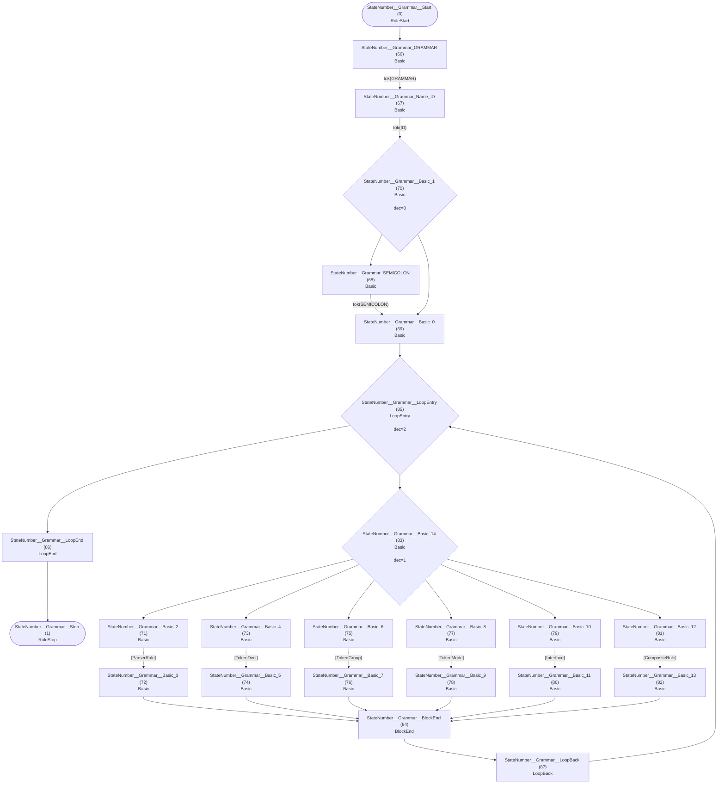
```mermaid
flowchart TD
    q0(["StateNumber__Grammar__Start (0)<br/>RuleStart"])
    q1(["StateNumber__Grammar__Stop (1)<br/>RuleStop"])
    q66["StateNumber__Grammar_GRAMMAR (66)<br/>Basic<br/>"]
    q67["StateNumber__Grammar_Name_ID (67)<br/>Basic<br/>"]
    q68["StateNumber__Grammar_SEMICOLON (68)<br/>Basic<br/>"]
    q69["StateNumber__Grammar__Basic_0 (69)<br/>Basic<br/>"]
    q70{"StateNumber__Grammar__Basic_1 (70)<br/>Basic<br/><br/>dec=0"}
    q71["StateNumber__Grammar__Basic_2 (71)<br/>Basic<br/>"]
    q72["StateNumber__Grammar__Basic_3 (72)<br/>Basic<br/>"]
    q73["StateNumber__Grammar__Basic_4 (73)<br/>Basic<br/>"]
    q74["StateNumber__Grammar__Basic_5 (74)<br/>Basic<br/>"]
    q75["StateNumber__Grammar__Basic_6 (75)<br/>Basic<br/>"]
    q76["StateNumber__Grammar__Basic_7 (76)<br/>Basic<br/>"]
    q77["StateNumber__Grammar__Basic_8 (77)<br/>Basic<br/>"]
    q78["StateNumber__Grammar__Basic_9 (78)<br/>Basic<br/>"]
    q79["StateNumber__Grammar__Basic_10 (79)<br/>Basic<br/>"]
    q80["StateNumber__Grammar__Basic_11 (80)<br/>Basic<br/>"]
    q81["StateNumber__Grammar__Basic_12 (81)<br/>Basic<br/>"]
    q82["StateNumber__Grammar__Basic_13 (82)<br/>Basic<br/>"]
    q83{"StateNumber__Grammar__Basic_14 (83)<br/>Basic<br/><br/>dec=1"}
    q84["StateNumber__Grammar__BlockEnd (84)<br/>BlockEnd<br/>"]
    q85{"StateNumber__Grammar__LoopEntry (85)<br/>LoopEntry<br/><br/>dec=2"}
    q86["StateNumber__Grammar__LoopEnd (86)<br/>LoopEnd<br/>"]
    q87["StateNumber__Grammar__LoopBack (87)<br/>LoopBack<br/>"]

    q0 --> q66
    q66 -->|"tok(GRAMMAR)"| q67
    q67 -->|"tok(ID)"| q70
    q68 -->|"tok(SEMICOLON)"| q69
    q69 --> q85
    q70 --> q68
    q70 --> q69
    q71 -.->|"[ParserRule]"| q72
    q72 --> q84
    q73 -.->|"[TokenDecl]"| q74
    q74 --> q84
    q75 -.->|"[TokenGroup]"| q76
    q76 --> q84
    q77 -.->|"[TokenMode]"| q78
    q78 --> q84
    q79 -.->|"[Interface]"| q80
    q80 --> q84
    q81 -.->|"[CompositeRule]"| q82
    q82 --> q84
    q83 --> q71
    q83 --> q73
    q83 --> q75
    q83 --> q77
    q83 --> q79
    q83 --> q81
    q84 --> q87
    q85 --> q83
    q85 --> q86
    q86 --> q1
    q87 --> q85
```

## Interface

```mermaid
flowchart TD
    q2(["StateNumber__Interface__Start (2)<br/>RuleStart"])
    q3(["StateNumber__Interface__Stop (3)<br/>RuleStop"])
    q88["StateNumber__Interface_INTERFACE (88)<br/>Basic<br/>"]
    q89["StateNumber__Interface_Name_ID (89)<br/>Basic<br/>"]
    q90["StateNumber__Interface_EXTENDS (90)<br/>Basic<br/>"]
    q91["StateNumber__Interface_Extends_ID_0 (91)<br/>Basic<br/>"]
    q92["StateNumber__Interface_COMMA (92)<br/>Basic<br/>"]
    q93["StateNumber__Interface_Extends_ID_1 (93)<br/>Basic<br/>"]
    q94["StateNumber__Interface__Basic_0 (94)<br/>Basic<br/>"]
    q95{"StateNumber__Interface__LoopEntry_0 (95)<br/>LoopEntry<br/><br/>dec=3"}
    q96["StateNumber__Interface__LoopEnd_0 (96)<br/>LoopEnd<br/>"]
    q97["StateNumber__Interface__LoopBack_0 (97)<br/>LoopBack<br/>"]
    q98{"StateNumber__Interface__Basic_1 (98)<br/>Basic<br/><br/>dec=4"}
    q99["StateNumber__Interface_LEFTBRACE (99)<br/>Basic<br/>"]
    q100["StateNumber__Interface__Basic_2 (100)<br/>Basic<br/>"]
    q101["StateNumber__Interface__Basic_3 (101)<br/>Basic<br/>"]
    q102{"StateNumber__Interface__LoopEntry_1 (102)<br/>LoopEntry<br/><br/>dec=5"}
    q103["StateNumber__Interface__LoopEnd_1 (103)<br/>LoopEnd<br/>"]
    q104["StateNumber__Interface__LoopBack_1 (104)<br/>LoopBack<br/>"]
    q105["StateNumber__Interface_RIGHTBRACE (105)<br/>Basic<br/>"]
    q106["StateNumber__Interface__Basic_4 (106)<br/>Basic<br/>"]

    q2 --> q88
    q88 -->|"tok(INTERFACE)"| q89
    q89 -->|"tok(ID)"| q98
    q90 -->|"tok(EXTENDS)"| q91
    q91 -->|"tok(ID)"| q95
    q92 -->|"tok(COMMA)"| q93
    q93 -->|"tok(ID)"| q94
    q94 --> q97
    q95 --> q92
    q95 --> q96
    q96 --> q99
    q97 --> q95
    q98 --> q90
    q98 --> q96
    q99 -->|"tok(LEFTBRACE)"| q102
    q100 -.->|"[Field]"| q101
    q101 --> q104
    q102 --> q100
    q102 --> q103
    q103 --> q105
    q104 --> q102
    q105 -->|"tok(RIGHTBRACE)"| q106
    q106 --> q3
```

## Field

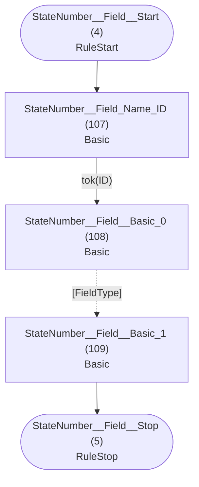
```mermaid
flowchart TD
    q4(["StateNumber__Field__Start (4)<br/>RuleStart"])
    q5(["StateNumber__Field__Stop (5)<br/>RuleStop"])
    q107["StateNumber__Field_Name_ID (107)<br/>Basic<br/>"]
    q108["StateNumber__Field__Basic_0 (108)<br/>Basic<br/>"]
    q109["StateNumber__Field__Basic_1 (109)<br/>Basic<br/>"]

    q4 --> q107
    q107 -->|"tok(ID)"| q108
    q108 -.->|"[FieldType]"| q109
    q109 --> q5
```

## FieldType

```mermaid
flowchart TD
    q6(["StateNumber__FieldType__Start (6)<br/>RuleStart"])
    q7(["StateNumber__FieldType__Stop (7)<br/>RuleStop"])
    q110["StateNumber__FieldType__Basic_0 (110)<br/>Basic<br/>"]
    q111["StateNumber__FieldType__Basic_1 (111)<br/>Basic<br/>"]
    q112["StateNumber__FieldType__Basic_2 (112)<br/>Basic<br/>"]
    q113["StateNumber__FieldType__Basic_3 (113)<br/>Basic<br/>"]
    q114["StateNumber__FieldType__Basic_4 (114)<br/>Basic<br/>"]
    q115["StateNumber__FieldType__Basic_5 (115)<br/>Basic<br/>"]
    q116["StateNumber__FieldType__Basic_6 (116)<br/>Basic<br/>"]
    q117["StateNumber__FieldType__Basic_7 (117)<br/>Basic<br/>"]
    q118{"StateNumber__FieldType__Basic_8 (118)<br/>Basic<br/><br/>dec=6"}
    q119["StateNumber__FieldType__BlockEnd (119)<br/>BlockEnd<br/>"]

    q6 --> q118
    q110 -.->|"[SimpleType]"| q111
    q111 --> q119
    q112 -.->|"[ReferenceType]"| q113
    q113 --> q119
    q114 -.->|"[ArrayType]"| q115
    q115 --> q119
    q116 -.->|"[PrimitiveType]"| q117
    q117 --> q119
    q118 --> q110
    q118 --> q112
    q118 --> q114
    q118 --> q116
    q119 --> q7
```

## ArrayType

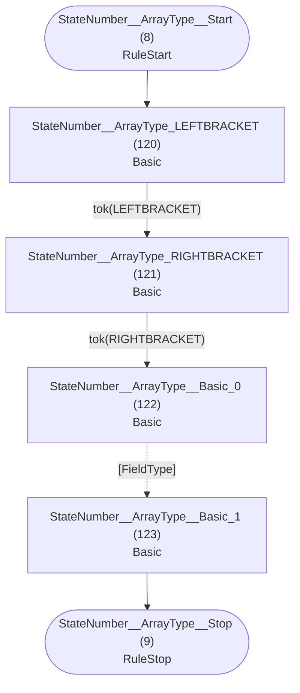
```mermaid
flowchart TD
    q8(["StateNumber__ArrayType__Start (8)<br/>RuleStart"])
    q9(["StateNumber__ArrayType__Stop (9)<br/>RuleStop"])
    q120["StateNumber__ArrayType_LEFTBRACKET (120)<br/>Basic<br/>"]
    q121["StateNumber__ArrayType_RIGHTBRACKET (121)<br/>Basic<br/>"]
    q122["StateNumber__ArrayType__Basic_0 (122)<br/>Basic<br/>"]
    q123["StateNumber__ArrayType__Basic_1 (123)<br/>Basic<br/>"]

    q8 --> q120
    q120 -->|"tok(LEFTBRACKET)"| q121
    q121 -->|"tok(RIGHTBRACKET)"| q122
    q122 -.->|"[FieldType]"| q123
    q123 --> q9
```

## ReferenceType

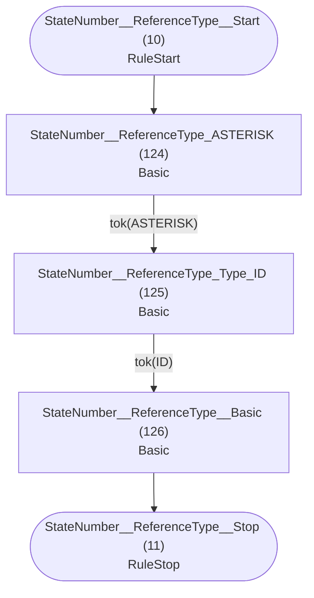
```mermaid
flowchart TD
    q10(["StateNumber__ReferenceType__Start (10)<br/>RuleStart"])
    q11(["StateNumber__ReferenceType__Stop (11)<br/>RuleStop"])
    q124["StateNumber__ReferenceType_ASTERISK (124)<br/>Basic<br/>"]
    q125["StateNumber__ReferenceType_Type_ID (125)<br/>Basic<br/>"]
    q126["StateNumber__ReferenceType__Basic (126)<br/>Basic<br/>"]

    q10 --> q124
    q124 -->|"tok(ASTERISK)"| q125
    q125 -->|"tok(ID)"| q126
    q126 --> q11
```

## SimpleType

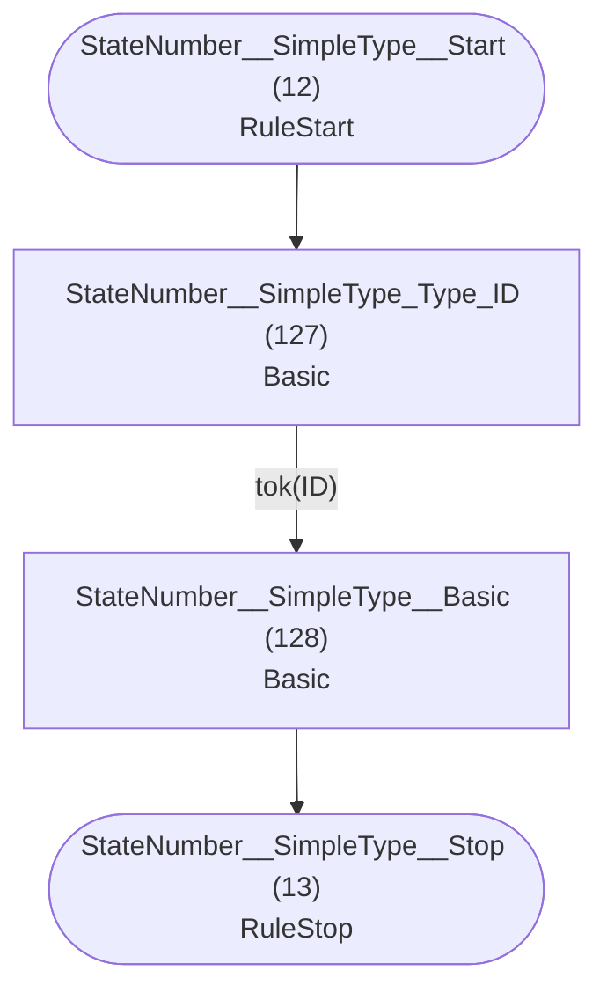
```mermaid
flowchart TD
    q12(["StateNumber__SimpleType__Start (12)<br/>RuleStart"])
    q13(["StateNumber__SimpleType__Stop (13)<br/>RuleStop"])
    q127["StateNumber__SimpleType_Type_ID (127)<br/>Basic<br/>"]
    q128["StateNumber__SimpleType__Basic (128)<br/>Basic<br/>"]

    q12 --> q127
    q127 -->|"tok(ID)"| q128
    q128 --> q13
```

## PrimitiveType

```mermaid
flowchart TD
    q14(["StateNumber__PrimitiveType__Start (14)<br/>RuleStart"])
    q15(["StateNumber__PrimitiveType__Stop (15)<br/>RuleStop"])
    q129["StateNumber__PrimitiveType_Type_STRING (129)<br/>Basic<br/>"]
    q130["StateNumber__PrimitiveType__Basic_0 (130)<br/>Basic<br/>"]
    q131["StateNumber__PrimitiveType_Type_BOOL (131)<br/>Basic<br/>"]
    q132["StateNumber__PrimitiveType__Basic_1 (132)<br/>Basic<br/>"]
    q133["StateNumber__PrimitiveType_Type_COMPOSITE (133)<br/>Basic<br/>"]
    q134["StateNumber__PrimitiveType__Basic_2 (134)<br/>Basic<br/>"]
    q135{"StateNumber__PrimitiveType__Basic_3 (135)<br/>Basic<br/><br/>dec=7"}
    q136["StateNumber__PrimitiveType__BlockEnd (136)<br/>BlockEnd<br/>"]

    q14 --> q135
    q129 -->|"tok(STRING)"| q130
    q130 --> q136
    q131 -->|"tok(BOOL)"| q132
    q132 --> q136
    q133 -->|"tok(COMPOSITE)"| q134
    q134 --> q136
    q135 --> q129
    q135 --> q131
    q135 --> q133
    q136 --> q15
```

## ParserRule

```mermaid
flowchart TD
    q16(["StateNumber__ParserRule__Start (16)<br/>RuleStart"])
    q17(["StateNumber__ParserRule__Stop (17)<br/>RuleStop"])
    q137["StateNumber__ParserRule_Entry_ENTRY (137)<br/>Basic<br/>"]
    q138["StateNumber__ParserRule__Basic_0 (138)<br/>Basic<br/>"]
    q139{"StateNumber__ParserRule__Basic_1 (139)<br/>Basic<br/><br/>dec=8"}
    q140["StateNumber__ParserRule_Name_ID (140)<br/>Basic<br/>"]
    q141["StateNumber__ParserRule_RETURNS (141)<br/>Basic<br/>"]
    q142["StateNumber__ParserRule_ReturnType_ID (142)<br/>Basic<br/>"]
    q143["StateNumber__ParserRule__Basic_2 (143)<br/>Basic<br/>"]
    q144{"StateNumber__ParserRule__Basic_3 (144)<br/>Basic<br/><br/>dec=9"}
    q145["StateNumber__ParserRule_COLON (145)<br/>Basic<br/>"]
    q146["StateNumber__ParserRule__Basic_4 (146)<br/>Basic<br/>"]
    q147["StateNumber__ParserRule_SEMICOLON (147)<br/>Basic<br/>"]
    q148["StateNumber__ParserRule__Basic_5 (148)<br/>Basic<br/>"]
    q149{"StateNumber__ParserRule__Basic_6 (149)<br/>Basic<br/><br/>dec=10"}

    q16 --> q139
    q137 -->|"tok(ENTRY)"| q138
    q138 --> q140
    q139 --> q137
    q139 --> q138
    q140 -->|"tok(ID)"| q144
    q141 -->|"tok(RETURNS)"| q142
    q142 -->|"tok(ID)"| q143
    q143 --> q145
    q144 --> q141
    q144 --> q143
    q145 -->|"tok(COLON)"| q146
    q146 -.->|"[Alternatives]"| q149
    q147 -->|"tok(SEMICOLON)"| q148
    q148 --> q17
    q149 --> q147
    q149 --> q148
```

## TokenDecl

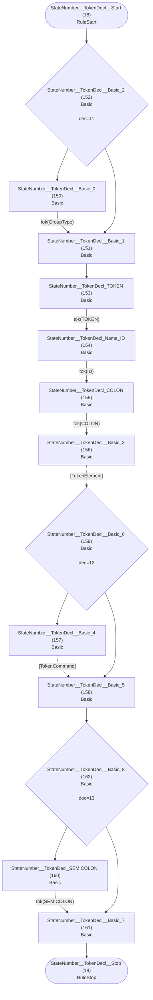
```mermaid
flowchart TD
    q18(["StateNumber__TokenDecl__Start (18)<br/>RuleStart"])
    q19(["StateNumber__TokenDecl__Stop (19)<br/>RuleStop"])
    q150["StateNumber__TokenDecl__Basic_0 (150)<br/>Basic<br/>"]
    q151["StateNumber__TokenDecl__Basic_1 (151)<br/>Basic<br/>"]
    q152{"StateNumber__TokenDecl__Basic_2 (152)<br/>Basic<br/><br/>dec=11"}
    q153["StateNumber__TokenDecl_TOKEN (153)<br/>Basic<br/>"]
    q154["StateNumber__TokenDecl_Name_ID (154)<br/>Basic<br/>"]
    q155["StateNumber__TokenDecl_COLON (155)<br/>Basic<br/>"]
    q156["StateNumber__TokenDecl__Basic_3 (156)<br/>Basic<br/>"]
    q157["StateNumber__TokenDecl__Basic_4 (157)<br/>Basic<br/>"]
    q158["StateNumber__TokenDecl__Basic_5 (158)<br/>Basic<br/>"]
    q159{"StateNumber__TokenDecl__Basic_6 (159)<br/>Basic<br/><br/>dec=12"}
    q160["StateNumber__TokenDecl_SEMICOLON (160)<br/>Basic<br/>"]
    q161["StateNumber__TokenDecl__Basic_7 (161)<br/>Basic<br/>"]
    q162{"StateNumber__TokenDecl__Basic_8 (162)<br/>Basic<br/><br/>dec=13"}

    q18 --> q152
    q150 -->|"tok(GroupType)"| q151
    q151 --> q153
    q152 --> q150
    q152 --> q151
    q153 -->|"tok(TOKEN)"| q154
    q154 -->|"tok(ID)"| q155
    q155 -->|"tok(COLON)"| q156
    q156 -.->|"[TokenElement]"| q159
    q157 -.->|"[TokenCommand]"| q158
    q158 --> q162
    q159 --> q157
    q159 --> q158
    q160 -->|"tok(SEMICOLON)"| q161
    q161 --> q19
    q162 --> q160
    q162 --> q161
```

## TokenElement

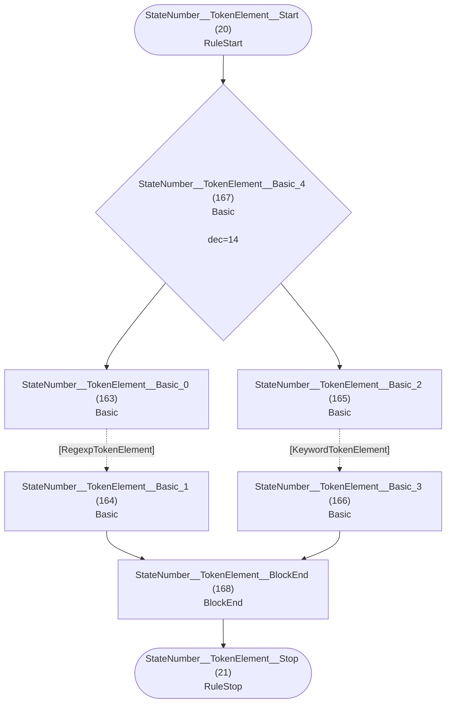
```mermaid
flowchart TD
    q20(["StateNumber__TokenElement__Start (20)<br/>RuleStart"])
    q21(["StateNumber__TokenElement__Stop (21)<br/>RuleStop"])
    q163["StateNumber__TokenElement__Basic_0 (163)<br/>Basic<br/>"]
    q164["StateNumber__TokenElement__Basic_1 (164)<br/>Basic<br/>"]
    q165["StateNumber__TokenElement__Basic_2 (165)<br/>Basic<br/>"]
    q166["StateNumber__TokenElement__Basic_3 (166)<br/>Basic<br/>"]
    q167{"StateNumber__TokenElement__Basic_4 (167)<br/>Basic<br/><br/>dec=14"}
    q168["StateNumber__TokenElement__BlockEnd (168)<br/>BlockEnd<br/>"]

    q20 --> q167
    q163 -.->|"[RegexpTokenElement]"| q164
    q164 --> q168
    q165 -.->|"[KeywordTokenElement]"| q166
    q166 --> q168
    q167 --> q163
    q167 --> q165
    q168 --> q21
```

## RegexpTokenElement

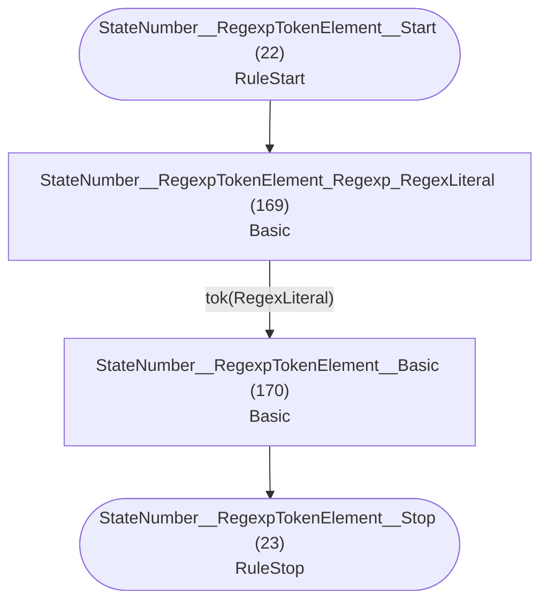
```mermaid
flowchart TD
    q22(["StateNumber__RegexpTokenElement__Start (22)<br/>RuleStart"])
    q23(["StateNumber__RegexpTokenElement__Stop (23)<br/>RuleStop"])
    q169["StateNumber__RegexpTokenElement_Regexp_RegexLiteral (169)<br/>Basic<br/>"]
    q170["StateNumber__RegexpTokenElement__Basic (170)<br/>Basic<br/>"]

    q22 --> q169
    q169 -->|"tok(RegexLiteral)"| q170
    q170 --> q23
```

## KeywordTokenElement

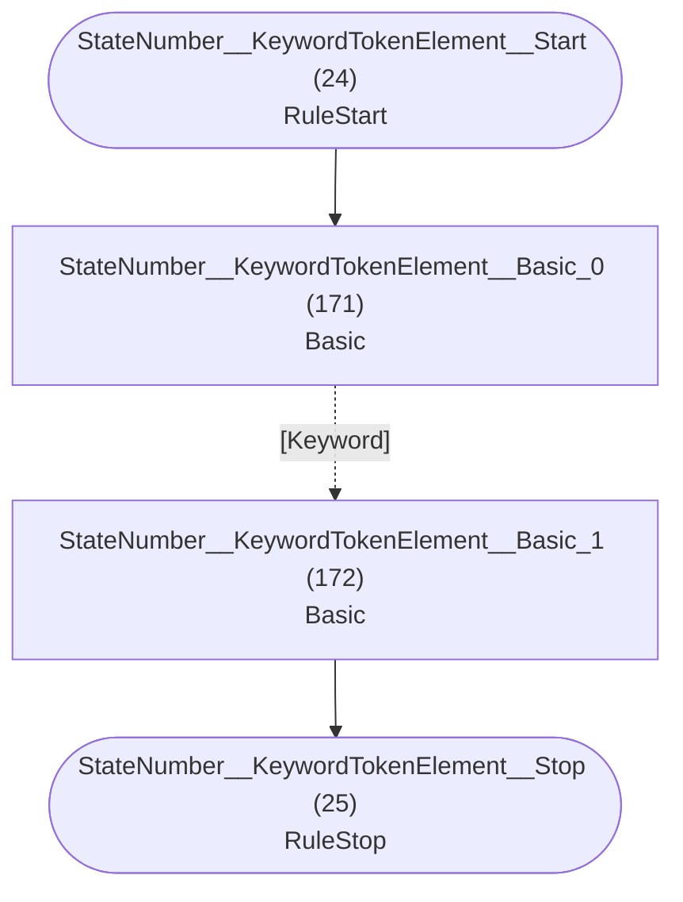
```mermaid
flowchart TD
    q24(["StateNumber__KeywordTokenElement__Start (24)<br/>RuleStart"])
    q25(["StateNumber__KeywordTokenElement__Stop (25)<br/>RuleStop"])
    q171["StateNumber__KeywordTokenElement__Basic_0 (171)<br/>Basic<br/>"]
    q172["StateNumber__KeywordTokenElement__Basic_1 (172)<br/>Basic<br/>"]

    q24 --> q171
    q171 -.->|"[Keyword]"| q172
    q172 --> q25
```

## TokenCommand

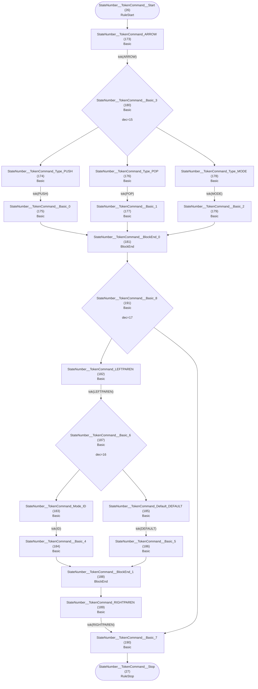
```mermaid
flowchart TD
    q26(["StateNumber__TokenCommand__Start (26)<br/>RuleStart"])
    q27(["StateNumber__TokenCommand__Stop (27)<br/>RuleStop"])
    q173["StateNumber__TokenCommand_ARROW (173)<br/>Basic<br/>"]
    q174["StateNumber__TokenCommand_Type_PUSH (174)<br/>Basic<br/>"]
    q175["StateNumber__TokenCommand__Basic_0 (175)<br/>Basic<br/>"]
    q176["StateNumber__TokenCommand_Type_POP (176)<br/>Basic<br/>"]
    q177["StateNumber__TokenCommand__Basic_1 (177)<br/>Basic<br/>"]
    q178["StateNumber__TokenCommand_Type_MODE (178)<br/>Basic<br/>"]
    q179["StateNumber__TokenCommand__Basic_2 (179)<br/>Basic<br/>"]
    q180{"StateNumber__TokenCommand__Basic_3 (180)<br/>Basic<br/><br/>dec=15"}
    q181["StateNumber__TokenCommand__BlockEnd_0 (181)<br/>BlockEnd<br/>"]
    q182["StateNumber__TokenCommand_LEFTPAREN (182)<br/>Basic<br/>"]
    q183["StateNumber__TokenCommand_Mode_ID (183)<br/>Basic<br/>"]
    q184["StateNumber__TokenCommand__Basic_4 (184)<br/>Basic<br/>"]
    q185["StateNumber__TokenCommand_Default_DEFAULT (185)<br/>Basic<br/>"]
    q186["StateNumber__TokenCommand__Basic_5 (186)<br/>Basic<br/>"]
    q187{"StateNumber__TokenCommand__Basic_6 (187)<br/>Basic<br/><br/>dec=16"}
    q188["StateNumber__TokenCommand__BlockEnd_1 (188)<br/>BlockEnd<br/>"]
    q189["StateNumber__TokenCommand_RIGHTPAREN (189)<br/>Basic<br/>"]
    q190["StateNumber__TokenCommand__Basic_7 (190)<br/>Basic<br/>"]
    q191{"StateNumber__TokenCommand__Basic_8 (191)<br/>Basic<br/><br/>dec=17"}

    q26 --> q173
    q173 -->|"tok(ARROW)"| q180
    q174 -->|"tok(PUSH)"| q175
    q175 --> q181
    q176 -->|"tok(POP)"| q177
    q177 --> q181
    q178 -->|"tok(MODE)"| q179
    q179 --> q181
    q180 --> q174
    q180 --> q176
    q180 --> q178
    q181 --> q191
    q182 -->|"tok(LEFTPAREN)"| q187
    q183 -->|"tok(ID)"| q184
    q184 --> q188
    q185 -->|"tok(DEFAULT)"| q186
    q186 --> q188
    q187 --> q183
    q187 --> q185
    q188 --> q189
    q189 -->|"tok(RIGHTPAREN)"| q190
    q190 --> q27
    q191 --> q182
    q191 --> q190
```

## TokenGroup

```mermaid
flowchart TD
    q28(["StateNumber__TokenGroup__Start (28)<br/>RuleStart"])
    q29(["StateNumber__TokenGroup__Stop (29)<br/>RuleStop"])
    q192["StateNumber__TokenGroup_TOKEN (192)<br/>Basic<br/>"]
    q193["StateNumber__TokenGroup_GROUP (193)<br/>Basic<br/>"]
    q194["StateNumber__TokenGroup_Name_ID (194)<br/>Basic<br/>"]
    q195["StateNumber__TokenGroup_LEFTBRACE (195)<br/>Basic<br/>"]
    q196["StateNumber__TokenGroup_TokenRefs_ID (196)<br/>Basic<br/>"]
    q197["StateNumber__TokenGroup__Basic_0 (197)<br/>Basic<br/>"]
    q198["StateNumber__TokenGroup__Basic_1 (198)<br/>Basic<br/>"]
    q199["StateNumber__TokenGroup__Basic_2 (199)<br/>Basic<br/>"]
    q200["StateNumber__TokenGroup_KEYWORDS (200)<br/>Basic<br/>"]
    q201["StateNumber__TokenGroup_KeywordSelectors_RegexLiteral (201)<br/>Basic<br/>"]
    q202["StateNumber__TokenGroup__Basic_3 (202)<br/>Basic<br/>"]
    q203{"StateNumber__TokenGroup__Basic_4 (203)<br/>Basic<br/><br/>dec=18"}
    q204["StateNumber__TokenGroup__BlockEnd (204)<br/>BlockEnd<br/>"]
    q205{"StateNumber__TokenGroup__LoopEntry (205)<br/>LoopEntry<br/><br/>dec=19"}
    q206["StateNumber__TokenGroup__LoopEnd (206)<br/>LoopEnd<br/>"]
    q207["StateNumber__TokenGroup__LoopBack (207)<br/>LoopBack<br/>"]
    q208["StateNumber__TokenGroup_RIGHTBRACE (208)<br/>Basic<br/>"]
    q209["StateNumber__TokenGroup__Basic_5 (209)<br/>Basic<br/>"]

    q28 --> q192
    q192 -->|"tok(TOKEN)"| q193
    q193 -->|"tok(GROUP)"| q194
    q194 -->|"tok(ID)"| q195
    q195 -->|"tok(LEFTBRACE)"| q205
    q196 -->|"tok(ID)"| q197
    q197 --> q204
    q198 -.->|"[Keyword]"| q199
    q199 --> q204
    q200 -->|"tok(KEYWORDS)"| q201
    q201 -->|"tok(RegexLiteral)"| q202
    q202 --> q204
    q203 --> q196
    q203 --> q198
    q203 --> q200
    q204 --> q207
    q205 --> q203
    q205 --> q206
    q206 --> q208
    q207 --> q205
    q208 -->|"tok(RIGHTBRACE)"| q209
    q209 --> q29
```

## TokenMode

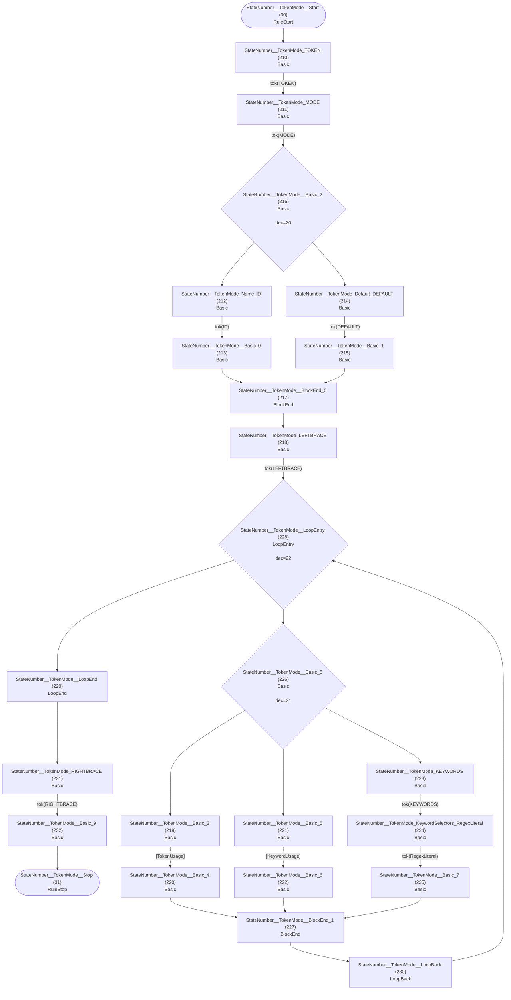
```mermaid
flowchart TD
    q30(["StateNumber__TokenMode__Start (30)<br/>RuleStart"])
    q31(["StateNumber__TokenMode__Stop (31)<br/>RuleStop"])
    q210["StateNumber__TokenMode_TOKEN (210)<br/>Basic<br/>"]
    q211["StateNumber__TokenMode_MODE (211)<br/>Basic<br/>"]
    q212["StateNumber__TokenMode_Name_ID (212)<br/>Basic<br/>"]
    q213["StateNumber__TokenMode__Basic_0 (213)<br/>Basic<br/>"]
    q214["StateNumber__TokenMode_Default_DEFAULT (214)<br/>Basic<br/>"]
    q215["StateNumber__TokenMode__Basic_1 (215)<br/>Basic<br/>"]
    q216{"StateNumber__TokenMode__Basic_2 (216)<br/>Basic<br/><br/>dec=20"}
    q217["StateNumber__TokenMode__BlockEnd_0 (217)<br/>BlockEnd<br/>"]
    q218["StateNumber__TokenMode_LEFTBRACE (218)<br/>Basic<br/>"]
    q219["StateNumber__TokenMode__Basic_3 (219)<br/>Basic<br/>"]
    q220["StateNumber__TokenMode__Basic_4 (220)<br/>Basic<br/>"]
    q221["StateNumber__TokenMode__Basic_5 (221)<br/>Basic<br/>"]
    q222["StateNumber__TokenMode__Basic_6 (222)<br/>Basic<br/>"]
    q223["StateNumber__TokenMode_KEYWORDS (223)<br/>Basic<br/>"]
    q224["StateNumber__TokenMode_KeywordSelectors_RegexLiteral (224)<br/>Basic<br/>"]
    q225["StateNumber__TokenMode__Basic_7 (225)<br/>Basic<br/>"]
    q226{"StateNumber__TokenMode__Basic_8 (226)<br/>Basic<br/><br/>dec=21"}
    q227["StateNumber__TokenMode__BlockEnd_1 (227)<br/>BlockEnd<br/>"]
    q228{"StateNumber__TokenMode__LoopEntry (228)<br/>LoopEntry<br/><br/>dec=22"}
    q229["StateNumber__TokenMode__LoopEnd (229)<br/>LoopEnd<br/>"]
    q230["StateNumber__TokenMode__LoopBack (230)<br/>LoopBack<br/>"]
    q231["StateNumber__TokenMode_RIGHTBRACE (231)<br/>Basic<br/>"]
    q232["StateNumber__TokenMode__Basic_9 (232)<br/>Basic<br/>"]

    q30 --> q210
    q210 -->|"tok(TOKEN)"| q211
    q211 -->|"tok(MODE)"| q216
    q212 -->|"tok(ID)"| q213
    q213 --> q217
    q214 -->|"tok(DEFAULT)"| q215
    q215 --> q217
    q216 --> q212
    q216 --> q214
    q217 --> q218
    q218 -->|"tok(LEFTBRACE)"| q228
    q219 -.->|"[TokenUsage]"| q220
    q220 --> q227
    q221 -.->|"[KeywordUsage]"| q222
    q222 --> q227
    q223 -->|"tok(KEYWORDS)"| q224
    q224 -->|"tok(RegexLiteral)"| q225
    q225 --> q227
    q226 --> q219
    q226 --> q221
    q226 --> q223
    q227 --> q230
    q228 --> q226
    q228 --> q229
    q229 --> q231
    q230 --> q228
    q231 -->|"tok(RIGHTBRACE)"| q232
    q232 --> q31
```

## TokenUsage

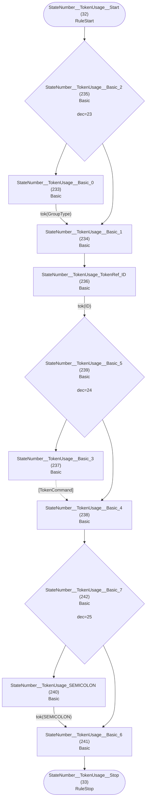
```mermaid
flowchart TD
    q32(["StateNumber__TokenUsage__Start (32)<br/>RuleStart"])
    q33(["StateNumber__TokenUsage__Stop (33)<br/>RuleStop"])
    q233["StateNumber__TokenUsage__Basic_0 (233)<br/>Basic<br/>"]
    q234["StateNumber__TokenUsage__Basic_1 (234)<br/>Basic<br/>"]
    q235{"StateNumber__TokenUsage__Basic_2 (235)<br/>Basic<br/><br/>dec=23"}
    q236["StateNumber__TokenUsage_TokenRef_ID (236)<br/>Basic<br/>"]
    q237["StateNumber__TokenUsage__Basic_3 (237)<br/>Basic<br/>"]
    q238["StateNumber__TokenUsage__Basic_4 (238)<br/>Basic<br/>"]
    q239{"StateNumber__TokenUsage__Basic_5 (239)<br/>Basic<br/><br/>dec=24"}
    q240["StateNumber__TokenUsage_SEMICOLON (240)<br/>Basic<br/>"]
    q241["StateNumber__TokenUsage__Basic_6 (241)<br/>Basic<br/>"]
    q242{"StateNumber__TokenUsage__Basic_7 (242)<br/>Basic<br/><br/>dec=25"}

    q32 --> q235
    q233 -->|"tok(GroupType)"| q234
    q234 --> q236
    q235 --> q233
    q235 --> q234
    q236 -->|"tok(ID)"| q239
    q237 -.->|"[TokenCommand]"| q238
    q238 --> q242
    q239 --> q237
    q239 --> q238
    q240 -->|"tok(SEMICOLON)"| q241
    q241 --> q33
    q242 --> q240
    q242 --> q241
```

## KeywordUsage

```mermaid
flowchart TD
    q34(["StateNumber__KeywordUsage__Start (34)<br/>RuleStart"])
    q35(["StateNumber__KeywordUsage__Stop (35)<br/>RuleStop"])
    q243["StateNumber__KeywordUsage__Basic_0 (243)<br/>Basic<br/>"]
    q244["StateNumber__KeywordUsage__Basic_1 (244)<br/>Basic<br/>"]
    q245{"StateNumber__KeywordUsage__Basic_2 (245)<br/>Basic<br/><br/>dec=26"}
    q246["StateNumber__KeywordUsage__Basic_3 (246)<br/>Basic<br/>"]
    q247["StateNumber__KeywordUsage__Basic_4 (247)<br/>Basic<br/>"]
    q248["StateNumber__KeywordUsage__Basic_5 (248)<br/>Basic<br/>"]
    q249{"StateNumber__KeywordUsage__Basic_6 (249)<br/>Basic<br/><br/>dec=27"}
    q250["StateNumber__KeywordUsage_SEMICOLON (250)<br/>Basic<br/>"]
    q251["StateNumber__KeywordUsage__Basic_7 (251)<br/>Basic<br/>"]
    q252{"StateNumber__KeywordUsage__Basic_8 (252)<br/>Basic<br/><br/>dec=28"}

    q34 --> q245
    q243 -->|"tok(GroupType)"| q244
    q244 --> q246
    q245 --> q243
    q245 --> q244
    q246 -.->|"[Keyword]"| q249
    q247 -.->|"[TokenCommand]"| q248
    q248 --> q252
    q249 --> q247
    q249 --> q248
    q250 -->|"tok(SEMICOLON)"| q251
    q251 --> q35
    q252 --> q250
    q252 --> q251
```

## Alternatives

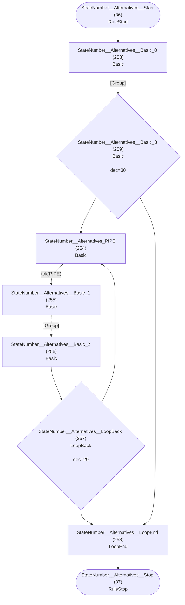
```mermaid
flowchart TD
    q36(["StateNumber__Alternatives__Start (36)<br/>RuleStart"])
    q37(["StateNumber__Alternatives__Stop (37)<br/>RuleStop"])
    q253["StateNumber__Alternatives__Basic_0 (253)<br/>Basic<br/>"]
    q254["StateNumber__Alternatives_PIPE (254)<br/>Basic<br/>"]
    q255["StateNumber__Alternatives__Basic_1 (255)<br/>Basic<br/>"]
    q256["StateNumber__Alternatives__Basic_2 (256)<br/>Basic<br/>"]
    q257{"StateNumber__Alternatives__LoopBack (257)<br/>LoopBack<br/><br/>dec=29"}
    q258["StateNumber__Alternatives__LoopEnd (258)<br/>LoopEnd<br/>"]
    q259{"StateNumber__Alternatives__Basic_3 (259)<br/>Basic<br/><br/>dec=30"}

    q36 --> q253
    q253 -.->|"[Group]"| q259
    q254 -->|"tok(PIPE)"| q255
    q255 -.->|"[Group]"| q256
    q256 --> q257
    q257 --> q254
    q257 --> q258
    q258 --> q37
    q259 --> q254
    q259 --> q258
```

## Group

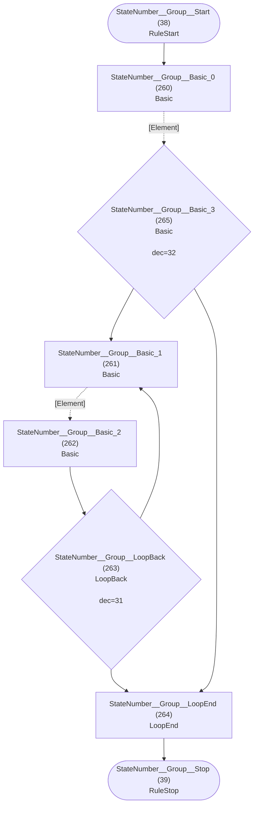
```mermaid
flowchart TD
    q38(["StateNumber__Group__Start (38)<br/>RuleStart"])
    q39(["StateNumber__Group__Stop (39)<br/>RuleStop"])
    q260["StateNumber__Group__Basic_0 (260)<br/>Basic<br/>"]
    q261["StateNumber__Group__Basic_1 (261)<br/>Basic<br/>"]
    q262["StateNumber__Group__Basic_2 (262)<br/>Basic<br/>"]
    q263{"StateNumber__Group__LoopBack (263)<br/>LoopBack<br/><br/>dec=31"}
    q264["StateNumber__Group__LoopEnd (264)<br/>LoopEnd<br/>"]
    q265{"StateNumber__Group__Basic_3 (265)<br/>Basic<br/><br/>dec=32"}

    q38 --> q260
    q260 -.->|"[Element]"| q265
    q261 -.->|"[Element]"| q262
    q262 --> q263
    q263 --> q261
    q263 --> q264
    q264 --> q39
    q265 --> q261
    q265 --> q264
```

## Element

```mermaid
flowchart TD
    q40(["StateNumber__Element__Start (40)<br/>RuleStart"])
    q41(["StateNumber__Element__Stop (41)<br/>RuleStop"])
    q266["StateNumber__Element__Basic_0 (266)<br/>Basic<br/>"]
    q267["StateNumber__Element__Basic_1 (267)<br/>Basic<br/>"]
    q268["StateNumber__Element__Basic_2 (268)<br/>Basic<br/>"]
    q269["StateNumber__Element__Basic_3 (269)<br/>Basic<br/>"]
    q270["StateNumber__Element__Basic_4 (270)<br/>Basic<br/>"]
    q271["StateNumber__Element__Basic_5 (271)<br/>Basic<br/>"]
    q272["StateNumber__Element__Basic_6 (272)<br/>Basic<br/>"]
    q273["StateNumber__Element__Basic_7 (273)<br/>Basic<br/>"]
    q274["StateNumber__Element_LEFTPAREN (274)<br/>Basic<br/>"]
    q275["StateNumber__Element__Basic_8 (275)<br/>Basic<br/>"]
    q276["StateNumber__Element_RIGHTPAREN (276)<br/>Basic<br/>"]
    q277["StateNumber__Element__Basic_9 (277)<br/>Basic<br/>"]
    q278{"StateNumber__Element__Basic_10 (278)<br/>Basic<br/><br/>dec=33"}
    q279["StateNumber__Element__BlockEnd (279)<br/>BlockEnd<br/>"]
    q280["StateNumber__Element__Basic_11 (280)<br/>Basic<br/>"]
    q281["StateNumber__Element__Basic_12 (281)<br/>Basic<br/>"]
    q282{"StateNumber__Element__Basic_13 (282)<br/>Basic<br/><br/>dec=34"}

    q40 --> q278
    q266 -.->|"[Keyword]"| q267
    q267 --> q279
    q268 -.->|"[Assignment]"| q269
    q269 --> q279
    q270 -.->|"[RuleCall]"| q271
    q271 --> q279
    q272 -.->|"[Action]"| q273
    q273 --> q279
    q274 -->|"tok(LEFTPAREN)"| q275
    q275 -.->|"[Alternatives]"| q276
    q276 -->|"tok(RIGHTPAREN)"| q277
    q277 --> q279
    q278 --> q266
    q278 --> q268
    q278 --> q270
    q278 --> q272
    q278 --> q274
    q279 --> q282
    q280 -->|"tok(Cardinality)"| q281
    q281 --> q41
    q282 --> q280
    q282 --> q281
```

## Keyword

```mermaid
flowchart TD
    q42(["StateNumber__Keyword__Start (42)<br/>RuleStart"])
    q43(["StateNumber__Keyword__Stop (43)<br/>RuleStop"])
    q283["StateNumber__Keyword_Value_StringLiteral (283)<br/>Basic<br/>"]
    q284["StateNumber__Keyword__Basic (284)<br/>Basic<br/>"]

    q42 --> q283
    q283 -->|"tok(StringLiteral)"| q284
    q284 --> q43
```

## Assignment

```mermaid
flowchart TD
    q44(["StateNumber__Assignment__Start (44)<br/>RuleStart"])
    q45(["StateNumber__Assignment__Stop (45)<br/>RuleStop"])
    q285["StateNumber__Assignment_Property_ID (285)<br/>Basic<br/>"]
    q286["StateNumber__Assignment_Operator_PLUS_EQUALS (286)<br/>Basic<br/>"]
    q287["StateNumber__Assignment__Basic_0 (287)<br/>Basic<br/>"]
    q288["StateNumber__Assignment_Operator_EQUALS (288)<br/>Basic<br/>"]
    q289["StateNumber__Assignment__Basic_1 (289)<br/>Basic<br/>"]
    q290["StateNumber__Assignment_Operator_QUESTION_EQUALS (290)<br/>Basic<br/>"]
    q291["StateNumber__Assignment__Basic_2 (291)<br/>Basic<br/>"]
    q292{"StateNumber__Assignment__Basic_3 (292)<br/>Basic<br/><br/>dec=35"}
    q293["StateNumber__Assignment__BlockEnd (293)<br/>BlockEnd<br/>"]
    q294["StateNumber__Assignment__Basic_4 (294)<br/>Basic<br/>"]
    q295["StateNumber__Assignment__Basic_5 (295)<br/>Basic<br/>"]

    q44 --> q285
    q285 -->|"tok(ID)"| q292
    q286 -->|"tok(PLUS_EQUALS)"| q287
    q287 --> q293
    q288 -->|"tok(EQUALS)"| q289
    q289 --> q293
    q290 -->|"tok(QUESTION_EQUALS)"| q291
    q291 --> q293
    q292 --> q286
    q292 --> q288
    q292 --> q290
    q293 --> q294
    q294 -.->|"[Assignable]"| q295
    q295 --> q45
```

## Assignable

```mermaid
flowchart TD
    q46(["StateNumber__Assignable__Start (46)<br/>RuleStart"])
    q47(["StateNumber__Assignable__Stop (47)<br/>RuleStop"])
    q296["StateNumber__Assignable__Basic_0 (296)<br/>Basic<br/>"]
    q297["StateNumber__Assignable__Basic_1 (297)<br/>Basic<br/>"]
    q298["StateNumber__Assignable__Basic_2 (298)<br/>Basic<br/>"]
    q299["StateNumber__Assignable__Basic_3 (299)<br/>Basic<br/>"]
    q300["StateNumber__Assignable_LEFTPAREN (300)<br/>Basic<br/>"]
    q301["StateNumber__Assignable__Basic_4 (301)<br/>Basic<br/>"]
    q302["StateNumber__Assignable_RIGHTPAREN (302)<br/>Basic<br/>"]
    q303["StateNumber__Assignable__Basic_5 (303)<br/>Basic<br/>"]
    q304{"StateNumber__Assignable__Basic_6 (304)<br/>Basic<br/><br/>dec=36"}
    q305["StateNumber__Assignable__BlockEnd (305)<br/>BlockEnd<br/>"]

    q46 --> q304
    q296 -.->|"[RuleCall]"| q297
    q297 --> q305
    q298 -.->|"[CrossRef]"| q299
    q299 --> q305
    q300 -->|"tok(LEFTPAREN)"| q301
    q301 -.->|"[AssignableAlternatives]"| q302
    q302 -->|"tok(RIGHTPAREN)"| q303
    q303 --> q305
    q304 --> q296
    q304 --> q298
    q304 --> q300
    q305 --> q47
```

## AssignableWithoutAlts

```mermaid
flowchart TD
    q48(["StateNumber__AssignableWithoutAlts__Start (48)<br/>RuleStart"])
    q49(["StateNumber__AssignableWithoutAlts__Stop (49)<br/>RuleStop"])
    q306["StateNumber__AssignableWithoutAlts__Basic_0 (306)<br/>Basic<br/>"]
    q307["StateNumber__AssignableWithoutAlts__Basic_1 (307)<br/>Basic<br/>"]
    q308["StateNumber__AssignableWithoutAlts__Basic_2 (308)<br/>Basic<br/>"]
    q309["StateNumber__AssignableWithoutAlts__Basic_3 (309)<br/>Basic<br/>"]
    q310{"StateNumber__AssignableWithoutAlts__Basic_4 (310)<br/>Basic<br/><br/>dec=37"}
    q311["StateNumber__AssignableWithoutAlts__BlockEnd (311)<br/>BlockEnd<br/>"]

    q48 --> q310
    q306 -.->|"[RuleCall]"| q307
    q307 --> q311
    q308 -.->|"[CrossRef]"| q309
    q309 --> q311
    q310 --> q306
    q310 --> q308
    q311 --> q49
```

## AssignableAlternatives

```mermaid
flowchart TD
    q50(["StateNumber__AssignableAlternatives__Start (50)<br/>RuleStart"])
    q51(["StateNumber__AssignableAlternatives__Stop (51)<br/>RuleStop"])
    q312["StateNumber__AssignableAlternatives__Basic_0 (312)<br/>Basic<br/>"]
    q313["StateNumber__AssignableAlternatives_PIPE (313)<br/>Basic<br/>"]
    q314["StateNumber__AssignableAlternatives__Basic_1 (314)<br/>Basic<br/>"]
    q315["StateNumber__AssignableAlternatives__Basic_2 (315)<br/>Basic<br/>"]
    q316{"StateNumber__AssignableAlternatives__LoopBack (316)<br/>LoopBack<br/><br/>dec=38"}
    q317["StateNumber__AssignableAlternatives__LoopEnd (317)<br/>LoopEnd<br/>"]
    q318{"StateNumber__AssignableAlternatives__Basic_3 (318)<br/>Basic<br/><br/>dec=39"}

    q50 --> q312
    q312 -.->|"[AssignableWithoutAlts]"| q318
    q313 -->|"tok(PIPE)"| q314
    q314 -.->|"[AssignableWithoutAlts]"| q315
    q315 --> q316
    q316 --> q313
    q316 --> q317
    q317 --> q51
    q318 --> q313
    q318 --> q317
```

## CrossRef

```mermaid
flowchart TD
    q52(["StateNumber__CrossRef__Start (52)<br/>RuleStart"])
    q53(["StateNumber__CrossRef__Stop (53)<br/>RuleStop"])
    q319["StateNumber__CrossRef_LEFTBRACKET (319)<br/>Basic<br/>"]
    q320["StateNumber__CrossRef_Type_ID (320)<br/>Basic<br/>"]
    q321["StateNumber__CrossRef_COLON (321)<br/>Basic<br/>"]
    q322["StateNumber__CrossRef__Basic_0 (322)<br/>Basic<br/>"]
    q323["StateNumber__CrossRef__Basic_1 (323)<br/>Basic<br/>"]
    q324{"StateNumber__CrossRef__Basic_2 (324)<br/>Basic<br/><br/>dec=40"}
    q325["StateNumber__CrossRef_RIGHTBRACKET (325)<br/>Basic<br/>"]
    q326["StateNumber__CrossRef__Basic_3 (326)<br/>Basic<br/>"]

    q52 --> q319
    q319 -->|"tok(LEFTBRACKET)"| q320
    q320 -->|"tok(ID)"| q324
    q321 -->|"tok(COLON)"| q322
    q322 -.->|"[RuleCall]"| q323
    q323 --> q325
    q324 --> q321
    q324 --> q323
    q325 -->|"tok(RIGHTBRACKET)"| q326
    q326 --> q53
```

## RuleCall

```mermaid
flowchart TD
    q54(["StateNumber__RuleCall__Start (54)<br/>RuleStart"])
    q55(["StateNumber__RuleCall__Stop (55)<br/>RuleStop"])
    q327["StateNumber__RuleCall_Rule_ID (327)<br/>Basic<br/>"]
    q328["StateNumber__RuleCall__Basic (328)<br/>Basic<br/>"]

    q54 --> q327
    q327 -->|"tok(ID)"| q328
    q328 --> q55
```

## Action

```mermaid
flowchart TD
    q56(["StateNumber__Action__Start (56)<br/>RuleStart"])
    q57(["StateNumber__Action__Stop (57)<br/>RuleStop"])
    q329["StateNumber__Action_LEFTBRACE (329)<br/>Basic<br/>"]
    q330["StateNumber__Action_Type_ID (330)<br/>Basic<br/>"]
    q331["StateNumber__Action_DOT (331)<br/>Basic<br/>"]
    q332["StateNumber__Action_Property_ID (332)<br/>Basic<br/>"]
    q333["StateNumber__Action_Operator_PLUS_EQUALS (333)<br/>Basic<br/>"]
    q334["StateNumber__Action__Basic_0 (334)<br/>Basic<br/>"]
    q335["StateNumber__Action_Operator_EQUALS (335)<br/>Basic<br/>"]
    q336["StateNumber__Action__Basic_1 (336)<br/>Basic<br/>"]
    q337{"StateNumber__Action__Basic_2 (337)<br/>Basic<br/><br/>dec=41"}
    q338["StateNumber__Action__BlockEnd (338)<br/>BlockEnd<br/>"]
    q339["StateNumber__Action_CURRENT (339)<br/>Basic<br/>"]
    q340["StateNumber__Action__Basic_3 (340)<br/>Basic<br/>"]
    q341{"StateNumber__Action__Basic_4 (341)<br/>Basic<br/><br/>dec=42"}
    q342["StateNumber__Action_RIGHTBRACE (342)<br/>Basic<br/>"]
    q343["StateNumber__Action__Basic_5 (343)<br/>Basic<br/>"]

    q56 --> q329
    q329 -->|"tok(LEFTBRACE)"| q330
    q330 -->|"tok(ID)"| q341
    q331 -->|"tok(DOT)"| q332
    q332 -->|"tok(ID)"| q337
    q333 -->|"tok(PLUS_EQUALS)"| q334
    q334 --> q338
    q335 -->|"tok(EQUALS)"| q336
    q336 --> q338
    q337 --> q333
    q337 --> q335
    q338 --> q339
    q339 -->|"tok(CURRENT)"| q340
    q340 --> q342
    q341 --> q331
    q341 --> q340
    q342 -->|"tok(RIGHTBRACE)"| q343
    q343 --> q57
```

## CompositeRule

```mermaid
flowchart TD
    q58(["StateNumber__CompositeRule__Start (58)<br/>RuleStart"])
    q59(["StateNumber__CompositeRule__Stop (59)<br/>RuleStop"])
    q344["StateNumber__CompositeRule_COMPOSITE (344)<br/>Basic<br/>"]
    q345["StateNumber__CompositeRule_Name_ID (345)<br/>Basic<br/>"]
    q346["StateNumber__CompositeRule_COLON (346)<br/>Basic<br/>"]
    q347["StateNumber__CompositeRule__Basic_0 (347)<br/>Basic<br/>"]
    q348["StateNumber__CompositeRule_SEMICOLON (348)<br/>Basic<br/>"]
    q349["StateNumber__CompositeRule__Basic_1 (349)<br/>Basic<br/>"]
    q350{"StateNumber__CompositeRule__Basic_2 (350)<br/>Basic<br/><br/>dec=43"}

    q58 --> q344
    q344 -->|"tok(COMPOSITE)"| q345
    q345 -->|"tok(ID)"| q346
    q346 -->|"tok(COLON)"| q347
    q347 -.->|"[CompositeAlternatives]"| q350
    q348 -->|"tok(SEMICOLON)"| q349
    q349 --> q59
    q350 --> q348
    q350 --> q349
```

## CompositeAlternatives

```mermaid
flowchart TD
    q60(["StateNumber__CompositeAlternatives__Start (60)<br/>RuleStart"])
    q61(["StateNumber__CompositeAlternatives__Stop (61)<br/>RuleStop"])
    q351["StateNumber__CompositeAlternatives__Basic_0 (351)<br/>Basic<br/>"]
    q352["StateNumber__CompositeAlternatives_PIPE (352)<br/>Basic<br/>"]
    q353["StateNumber__CompositeAlternatives__Basic_1 (353)<br/>Basic<br/>"]
    q354["StateNumber__CompositeAlternatives__Basic_2 (354)<br/>Basic<br/>"]
    q355{"StateNumber__CompositeAlternatives__LoopBack (355)<br/>LoopBack<br/><br/>dec=44"}
    q356["StateNumber__CompositeAlternatives__LoopEnd (356)<br/>LoopEnd<br/>"]
    q357{"StateNumber__CompositeAlternatives__Basic_3 (357)<br/>Basic<br/><br/>dec=45"}

    q60 --> q351
    q351 -.->|"[CompositeGroup]"| q357
    q352 -->|"tok(PIPE)"| q353
    q353 -.->|"[CompositeGroup]"| q354
    q354 --> q355
    q355 --> q352
    q355 --> q356
    q356 --> q61
    q357 --> q352
    q357 --> q356
```

## CompositeGroup

```mermaid
flowchart TD
    q62(["StateNumber__CompositeGroup__Start (62)<br/>RuleStart"])
    q63(["StateNumber__CompositeGroup__Stop (63)<br/>RuleStop"])
    q358["StateNumber__CompositeGroup__Basic_0 (358)<br/>Basic<br/>"]
    q359["StateNumber__CompositeGroup__Basic_1 (359)<br/>Basic<br/>"]
    q360["StateNumber__CompositeGroup__Basic_2 (360)<br/>Basic<br/>"]
    q361{"StateNumber__CompositeGroup__LoopBack (361)<br/>LoopBack<br/><br/>dec=46"}
    q362["StateNumber__CompositeGroup__LoopEnd (362)<br/>LoopEnd<br/>"]
    q363{"StateNumber__CompositeGroup__Basic_3 (363)<br/>Basic<br/><br/>dec=47"}

    q62 --> q358
    q358 -.->|"[CompositeElement]"| q363
    q359 -.->|"[CompositeElement]"| q360
    q360 --> q361
    q361 --> q359
    q361 --> q362
    q362 --> q63
    q363 --> q359
    q363 --> q362
```

## CompositeElement

```mermaid
flowchart TD
    q64(["StateNumber__CompositeElement__Start (64)<br/>RuleStart"])
    q65(["StateNumber__CompositeElement__Stop (65)<br/>RuleStop"])
    q364["StateNumber__CompositeElement__Basic_0 (364)<br/>Basic<br/>"]
    q365["StateNumber__CompositeElement__Basic_1 (365)<br/>Basic<br/>"]
    q366["StateNumber__CompositeElement_LEFTPAREN (366)<br/>Basic<br/>"]
    q367["StateNumber__CompositeElement__Basic_2 (367)<br/>Basic<br/>"]
    q368["StateNumber__CompositeElement_RIGHTPAREN (368)<br/>Basic<br/>"]
    q369["StateNumber__CompositeElement__Basic_3 (369)<br/>Basic<br/>"]
    q370{"StateNumber__CompositeElement__Basic_4 (370)<br/>Basic<br/><br/>dec=48"}
    q371["StateNumber__CompositeElement__BlockEnd (371)<br/>BlockEnd<br/>"]
    q372["StateNumber__CompositeElement__Basic_5 (372)<br/>Basic<br/>"]
    q373["StateNumber__CompositeElement__Basic_6 (373)<br/>Basic<br/>"]
    q374{"StateNumber__CompositeElement__Basic_7 (374)<br/>Basic<br/><br/>dec=49"}

    q64 --> q370
    q364 -.->|"[RuleCall]"| q365
    q365 --> q371
    q366 -->|"tok(LEFTPAREN)"| q367
    q367 -.->|"[CompositeAlternatives]"| q368
    q368 -->|"tok(RIGHTPAREN)"| q369
    q369 --> q371
    q370 --> q364
    q370 --> q366
    q371 --> q374
    q372 -->|"tok(Cardinality)"| q373
    q373 --> q65
    q374 --> q372
    q374 --> q373
```

