# Runtime ATN for grammar

## Grammar

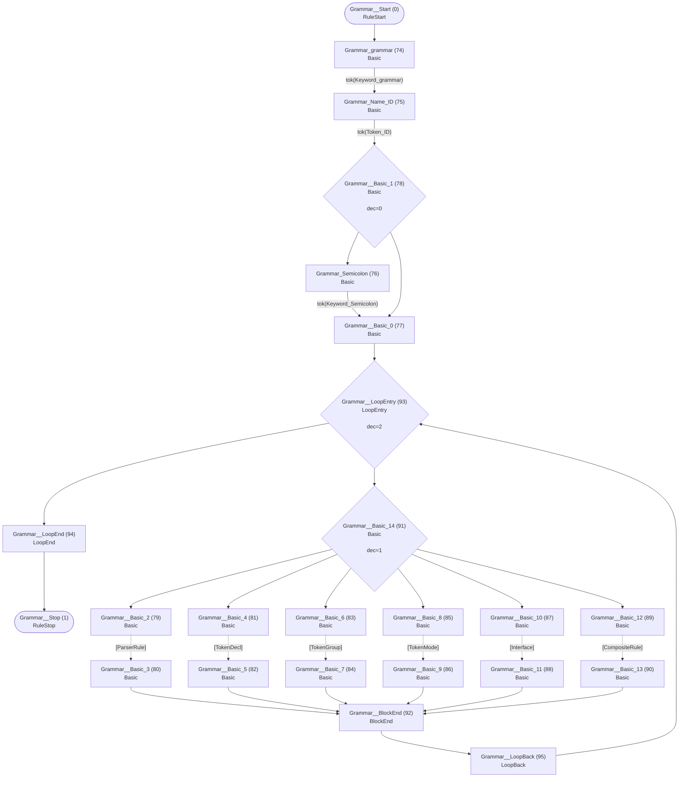
```mermaid
flowchart TD
    q0(["Grammar__Start (0)<br/>RuleStart"])
    q1(["Grammar__Stop (1)<br/>RuleStop"])
    q74["Grammar_grammar (74)<br/>Basic<br/>"]
    q75["Grammar_Name_ID (75)<br/>Basic<br/>"]
    q76["Grammar_Semicolon (76)<br/>Basic<br/>"]
    q77["Grammar__Basic_0 (77)<br/>Basic<br/>"]
    q78{"Grammar__Basic_1 (78)<br/>Basic<br/><br/>dec=0"}
    q79["Grammar__Basic_2 (79)<br/>Basic<br/>"]
    q80["Grammar__Basic_3 (80)<br/>Basic<br/>"]
    q81["Grammar__Basic_4 (81)<br/>Basic<br/>"]
    q82["Grammar__Basic_5 (82)<br/>Basic<br/>"]
    q83["Grammar__Basic_6 (83)<br/>Basic<br/>"]
    q84["Grammar__Basic_7 (84)<br/>Basic<br/>"]
    q85["Grammar__Basic_8 (85)<br/>Basic<br/>"]
    q86["Grammar__Basic_9 (86)<br/>Basic<br/>"]
    q87["Grammar__Basic_10 (87)<br/>Basic<br/>"]
    q88["Grammar__Basic_11 (88)<br/>Basic<br/>"]
    q89["Grammar__Basic_12 (89)<br/>Basic<br/>"]
    q90["Grammar__Basic_13 (90)<br/>Basic<br/>"]
    q91{"Grammar__Basic_14 (91)<br/>Basic<br/><br/>dec=1"}
    q92["Grammar__BlockEnd (92)<br/>BlockEnd<br/>"]
    q93{"Grammar__LoopEntry (93)<br/>LoopEntry<br/><br/>dec=2"}
    q94["Grammar__LoopEnd (94)<br/>LoopEnd<br/>"]
    q95["Grammar__LoopBack (95)<br/>LoopBack<br/>"]

    q0 --> q74
    q74 -->|"tok(Keyword_grammar)"| q75
    q75 -->|"tok(Token_ID)"| q78
    q76 -->|"tok(Keyword_Semicolon)"| q77
    q77 --> q93
    q78 --> q76
    q78 --> q77
    q79 -.->|"[ParserRule]"| q80
    q80 --> q92
    q81 -.->|"[TokenDecl]"| q82
    q82 --> q92
    q83 -.->|"[TokenGroup]"| q84
    q84 --> q92
    q85 -.->|"[TokenMode]"| q86
    q86 --> q92
    q87 -.->|"[Interface]"| q88
    q88 --> q92
    q89 -.->|"[CompositeRule]"| q90
    q90 --> q92
    q91 --> q79
    q91 --> q81
    q91 --> q83
    q91 --> q85
    q91 --> q87
    q91 --> q89
    q92 --> q95
    q93 --> q91
    q93 --> q94
    q94 --> q1
    q95 --> q93
```

## Interface

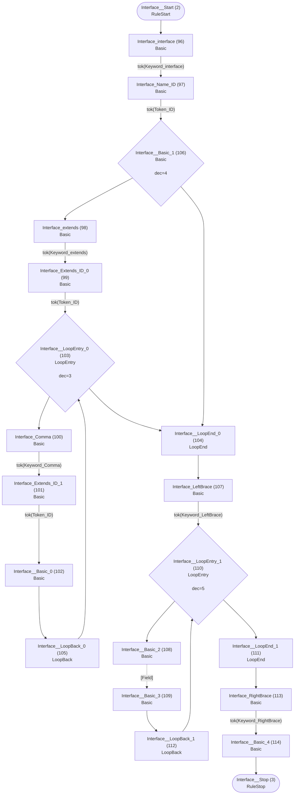
```mermaid
flowchart TD
    q2(["Interface__Start (2)<br/>RuleStart"])
    q3(["Interface__Stop (3)<br/>RuleStop"])
    q96["Interface_interface (96)<br/>Basic<br/>"]
    q97["Interface_Name_ID (97)<br/>Basic<br/>"]
    q98["Interface_extends (98)<br/>Basic<br/>"]
    q99["Interface_Extends_ID_0 (99)<br/>Basic<br/>"]
    q100["Interface_Comma (100)<br/>Basic<br/>"]
    q101["Interface_Extends_ID_1 (101)<br/>Basic<br/>"]
    q102["Interface__Basic_0 (102)<br/>Basic<br/>"]
    q103{"Interface__LoopEntry_0 (103)<br/>LoopEntry<br/><br/>dec=3"}
    q104["Interface__LoopEnd_0 (104)<br/>LoopEnd<br/>"]
    q105["Interface__LoopBack_0 (105)<br/>LoopBack<br/>"]
    q106{"Interface__Basic_1 (106)<br/>Basic<br/><br/>dec=4"}
    q107["Interface_LeftBrace (107)<br/>Basic<br/>"]
    q108["Interface__Basic_2 (108)<br/>Basic<br/>"]
    q109["Interface__Basic_3 (109)<br/>Basic<br/>"]
    q110{"Interface__LoopEntry_1 (110)<br/>LoopEntry<br/><br/>dec=5"}
    q111["Interface__LoopEnd_1 (111)<br/>LoopEnd<br/>"]
    q112["Interface__LoopBack_1 (112)<br/>LoopBack<br/>"]
    q113["Interface_RightBrace (113)<br/>Basic<br/>"]
    q114["Interface__Basic_4 (114)<br/>Basic<br/>"]

    q2 --> q96
    q96 -->|"tok(Keyword_interface)"| q97
    q97 -->|"tok(Token_ID)"| q106
    q98 -->|"tok(Keyword_extends)"| q99
    q99 -->|"tok(Token_ID)"| q103
    q100 -->|"tok(Keyword_Comma)"| q101
    q101 -->|"tok(Token_ID)"| q102
    q102 --> q105
    q103 --> q100
    q103 --> q104
    q104 --> q107
    q105 --> q103
    q106 --> q98
    q106 --> q104
    q107 -->|"tok(Keyword_LeftBrace)"| q110
    q108 -.->|"[Field]"| q109
    q109 --> q112
    q110 --> q108
    q110 --> q111
    q111 --> q113
    q112 --> q110
    q113 -->|"tok(Keyword_RightBrace)"| q114
    q114 --> q3
```

## Field

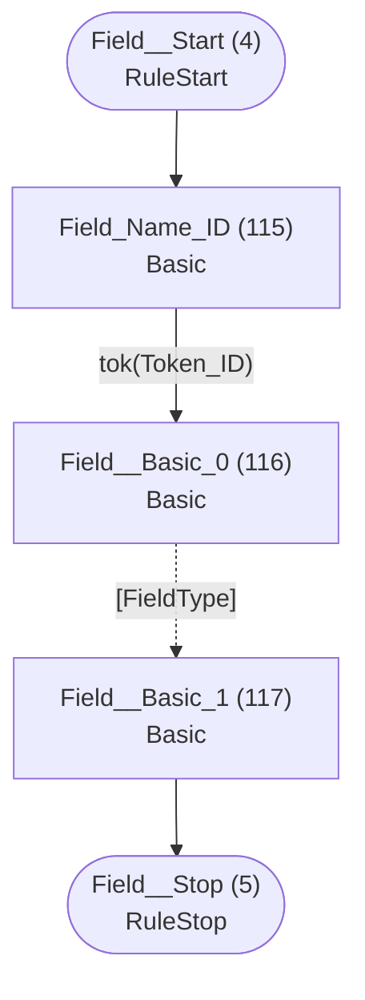
```mermaid
flowchart TD
    q4(["Field__Start (4)<br/>RuleStart"])
    q5(["Field__Stop (5)<br/>RuleStop"])
    q115["Field_Name_ID (115)<br/>Basic<br/>"]
    q116["Field__Basic_0 (116)<br/>Basic<br/>"]
    q117["Field__Basic_1 (117)<br/>Basic<br/>"]

    q4 --> q115
    q115 -->|"tok(Token_ID)"| q116
    q116 -.->|"[FieldType]"| q117
    q117 --> q5
```

## FieldType

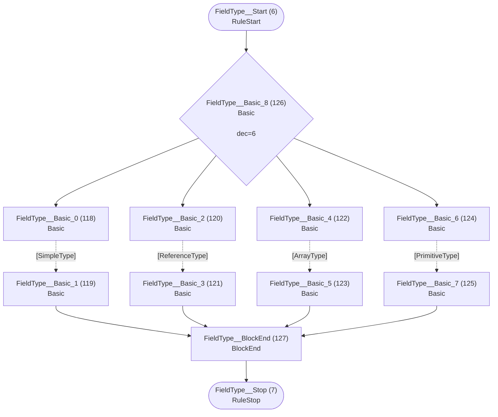
```mermaid
flowchart TD
    q6(["FieldType__Start (6)<br/>RuleStart"])
    q7(["FieldType__Stop (7)<br/>RuleStop"])
    q118["FieldType__Basic_0 (118)<br/>Basic<br/>"]
    q119["FieldType__Basic_1 (119)<br/>Basic<br/>"]
    q120["FieldType__Basic_2 (120)<br/>Basic<br/>"]
    q121["FieldType__Basic_3 (121)<br/>Basic<br/>"]
    q122["FieldType__Basic_4 (122)<br/>Basic<br/>"]
    q123["FieldType__Basic_5 (123)<br/>Basic<br/>"]
    q124["FieldType__Basic_6 (124)<br/>Basic<br/>"]
    q125["FieldType__Basic_7 (125)<br/>Basic<br/>"]
    q126{"FieldType__Basic_8 (126)<br/>Basic<br/><br/>dec=6"}
    q127["FieldType__BlockEnd (127)<br/>BlockEnd<br/>"]

    q6 --> q126
    q118 -.->|"[SimpleType]"| q119
    q119 --> q127
    q120 -.->|"[ReferenceType]"| q121
    q121 --> q127
    q122 -.->|"[ArrayType]"| q123
    q123 --> q127
    q124 -.->|"[PrimitiveType]"| q125
    q125 --> q127
    q126 --> q118
    q126 --> q120
    q126 --> q122
    q126 --> q124
    q127 --> q7
```

## ArrayType

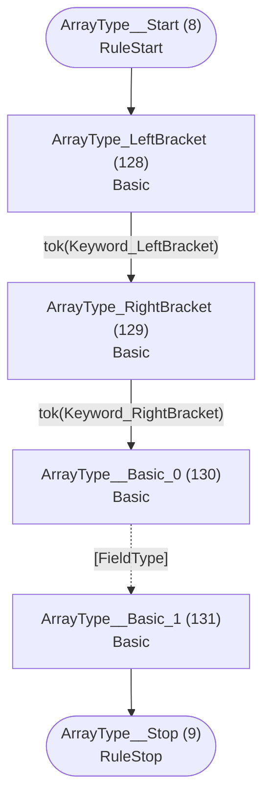
```mermaid
flowchart TD
    q8(["ArrayType__Start (8)<br/>RuleStart"])
    q9(["ArrayType__Stop (9)<br/>RuleStop"])
    q128["ArrayType_LeftBracket (128)<br/>Basic<br/>"]
    q129["ArrayType_RightBracket (129)<br/>Basic<br/>"]
    q130["ArrayType__Basic_0 (130)<br/>Basic<br/>"]
    q131["ArrayType__Basic_1 (131)<br/>Basic<br/>"]

    q8 --> q128
    q128 -->|"tok(Keyword_LeftBracket)"| q129
    q129 -->|"tok(Keyword_RightBracket)"| q130
    q130 -.->|"[FieldType]"| q131
    q131 --> q9
```

## ReferenceType

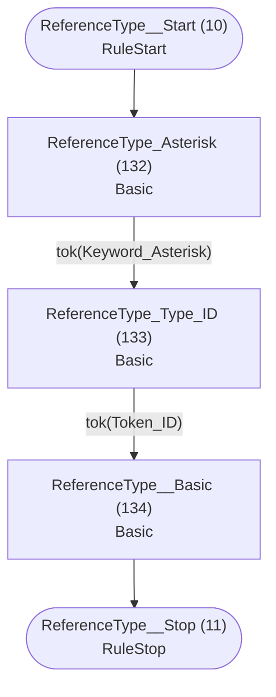
```mermaid
flowchart TD
    q10(["ReferenceType__Start (10)<br/>RuleStart"])
    q11(["ReferenceType__Stop (11)<br/>RuleStop"])
    q132["ReferenceType_Asterisk (132)<br/>Basic<br/>"]
    q133["ReferenceType_Type_ID (133)<br/>Basic<br/>"]
    q134["ReferenceType__Basic (134)<br/>Basic<br/>"]

    q10 --> q132
    q132 -->|"tok(Keyword_Asterisk)"| q133
    q133 -->|"tok(Token_ID)"| q134
    q134 --> q11
```

## SimpleType

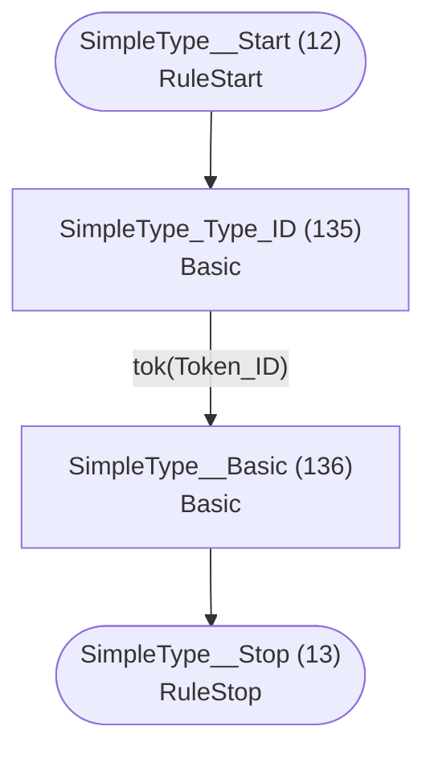
```mermaid
flowchart TD
    q12(["SimpleType__Start (12)<br/>RuleStart"])
    q13(["SimpleType__Stop (13)<br/>RuleStop"])
    q135["SimpleType_Type_ID (135)<br/>Basic<br/>"]
    q136["SimpleType__Basic (136)<br/>Basic<br/>"]

    q12 --> q135
    q135 -->|"tok(Token_ID)"| q136
    q136 --> q13
```

## PrimitiveType

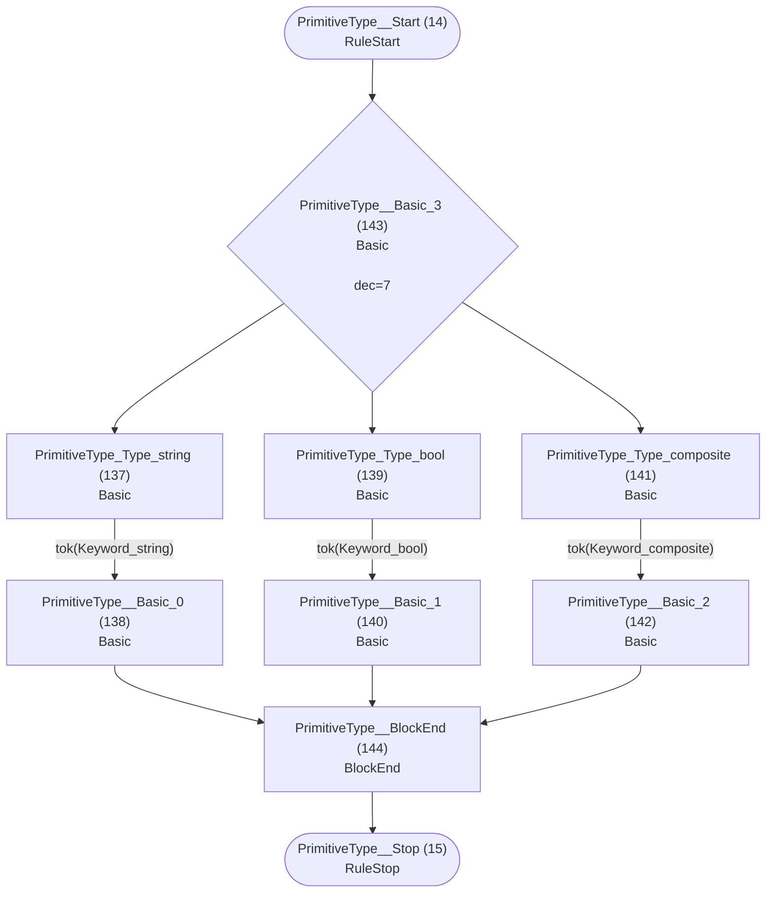
```mermaid
flowchart TD
    q14(["PrimitiveType__Start (14)<br/>RuleStart"])
    q15(["PrimitiveType__Stop (15)<br/>RuleStop"])
    q137["PrimitiveType_Type_string (137)<br/>Basic<br/>"]
    q138["PrimitiveType__Basic_0 (138)<br/>Basic<br/>"]
    q139["PrimitiveType_Type_bool (139)<br/>Basic<br/>"]
    q140["PrimitiveType__Basic_1 (140)<br/>Basic<br/>"]
    q141["PrimitiveType_Type_composite (141)<br/>Basic<br/>"]
    q142["PrimitiveType__Basic_2 (142)<br/>Basic<br/>"]
    q143{"PrimitiveType__Basic_3 (143)<br/>Basic<br/><br/>dec=7"}
    q144["PrimitiveType__BlockEnd (144)<br/>BlockEnd<br/>"]

    q14 --> q143
    q137 -->|"tok(Keyword_string)"| q138
    q138 --> q144
    q139 -->|"tok(Keyword_bool)"| q140
    q140 --> q144
    q141 -->|"tok(Keyword_composite)"| q142
    q142 --> q144
    q143 --> q137
    q143 --> q139
    q143 --> q141
    q144 --> q15
```

## ParserRule

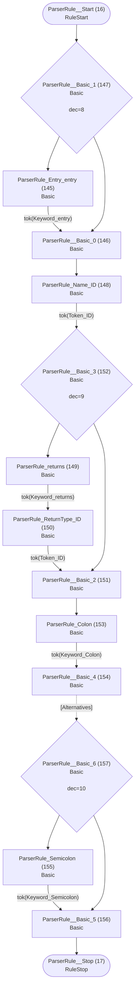
```mermaid
flowchart TD
    q16(["ParserRule__Start (16)<br/>RuleStart"])
    q17(["ParserRule__Stop (17)<br/>RuleStop"])
    q145["ParserRule_Entry_entry (145)<br/>Basic<br/>"]
    q146["ParserRule__Basic_0 (146)<br/>Basic<br/>"]
    q147{"ParserRule__Basic_1 (147)<br/>Basic<br/><br/>dec=8"}
    q148["ParserRule_Name_ID (148)<br/>Basic<br/>"]
    q149["ParserRule_returns (149)<br/>Basic<br/>"]
    q150["ParserRule_ReturnType_ID (150)<br/>Basic<br/>"]
    q151["ParserRule__Basic_2 (151)<br/>Basic<br/>"]
    q152{"ParserRule__Basic_3 (152)<br/>Basic<br/><br/>dec=9"}
    q153["ParserRule_Colon (153)<br/>Basic<br/>"]
    q154["ParserRule__Basic_4 (154)<br/>Basic<br/>"]
    q155["ParserRule_Semicolon (155)<br/>Basic<br/>"]
    q156["ParserRule__Basic_5 (156)<br/>Basic<br/>"]
    q157{"ParserRule__Basic_6 (157)<br/>Basic<br/><br/>dec=10"}

    q16 --> q147
    q145 -->|"tok(Keyword_entry)"| q146
    q146 --> q148
    q147 --> q145
    q147 --> q146
    q148 -->|"tok(Token_ID)"| q152
    q149 -->|"tok(Keyword_returns)"| q150
    q150 -->|"tok(Token_ID)"| q151
    q151 --> q153
    q152 --> q149
    q152 --> q151
    q153 -->|"tok(Keyword_Colon)"| q154
    q154 -.->|"[Alternatives]"| q157
    q155 -->|"tok(Keyword_Semicolon)"| q156
    q156 --> q17
    q157 --> q155
    q157 --> q156
```

## TokenDecl

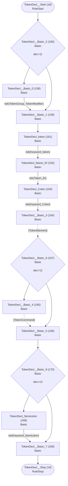
```mermaid
flowchart TD
    q18(["TokenDecl__Start (18)<br/>RuleStart"])
    q19(["TokenDecl__Stop (19)<br/>RuleStop"])
    q158["TokenDecl__Basic_0 (158)<br/>Basic<br/>"]
    q159["TokenDecl__Basic_1 (159)<br/>Basic<br/>"]
    q160{"TokenDecl__Basic_2 (160)<br/>Basic<br/><br/>dec=11"}
    q161["TokenDecl_token (161)<br/>Basic<br/>"]
    q162["TokenDecl_Name_ID (162)<br/>Basic<br/>"]
    q163["TokenDecl_Colon (163)<br/>Basic<br/>"]
    q164["TokenDecl__Basic_3 (164)<br/>Basic<br/>"]
    q165["TokenDecl__Basic_4 (165)<br/>Basic<br/>"]
    q166["TokenDecl__Basic_5 (166)<br/>Basic<br/>"]
    q167{"TokenDecl__Basic_6 (167)<br/>Basic<br/><br/>dec=12"}
    q168["TokenDecl_Semicolon (168)<br/>Basic<br/>"]
    q169["TokenDecl__Basic_7 (169)<br/>Basic<br/>"]
    q170{"TokenDecl__Basic_8 (170)<br/>Basic<br/><br/>dec=13"}

    q18 --> q160
    q158 -->|"tok(TokenGroup_TokenModifier)"| q159
    q159 --> q161
    q160 --> q158
    q160 --> q159
    q161 -->|"tok(Keyword_token)"| q162
    q162 -->|"tok(Token_ID)"| q163
    q163 -->|"tok(Keyword_Colon)"| q164
    q164 -.->|"[TokenElement]"| q167
    q165 -.->|"[TokenCommand]"| q166
    q166 --> q170
    q167 --> q165
    q167 --> q166
    q168 -->|"tok(Keyword_Semicolon)"| q169
    q169 --> q19
    q170 --> q168
    q170 --> q169
```

## TokenElement

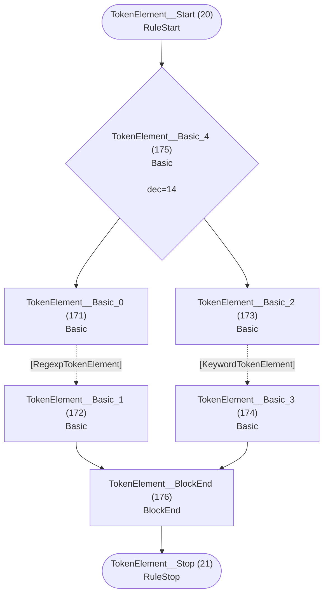
```mermaid
flowchart TD
    q20(["TokenElement__Start (20)<br/>RuleStart"])
    q21(["TokenElement__Stop (21)<br/>RuleStop"])
    q171["TokenElement__Basic_0 (171)<br/>Basic<br/>"]
    q172["TokenElement__Basic_1 (172)<br/>Basic<br/>"]
    q173["TokenElement__Basic_2 (173)<br/>Basic<br/>"]
    q174["TokenElement__Basic_3 (174)<br/>Basic<br/>"]
    q175{"TokenElement__Basic_4 (175)<br/>Basic<br/><br/>dec=14"}
    q176["TokenElement__BlockEnd (176)<br/>BlockEnd<br/>"]

    q20 --> q175
    q171 -.->|"[RegexpTokenElement]"| q172
    q172 --> q176
    q173 -.->|"[KeywordTokenElement]"| q174
    q174 --> q176
    q175 --> q171
    q175 --> q173
    q176 --> q21
```

## RegexpTokenElement

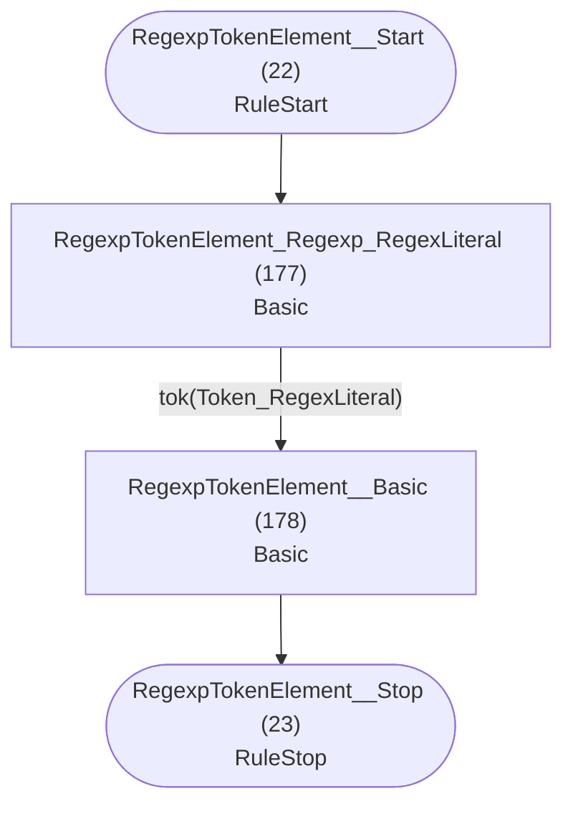
```mermaid
flowchart TD
    q22(["RegexpTokenElement__Start (22)<br/>RuleStart"])
    q23(["RegexpTokenElement__Stop (23)<br/>RuleStop"])
    q177["RegexpTokenElement_Regexp_RegexLiteral (177)<br/>Basic<br/>"]
    q178["RegexpTokenElement__Basic (178)<br/>Basic<br/>"]

    q22 --> q177
    q177 -->|"tok(Token_RegexLiteral)"| q178
    q178 --> q23
```

## KeywordTokenElement

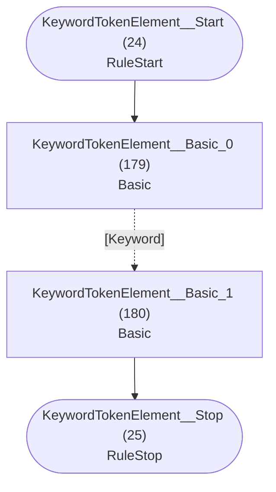
```mermaid
flowchart TD
    q24(["KeywordTokenElement__Start (24)<br/>RuleStart"])
    q25(["KeywordTokenElement__Stop (25)<br/>RuleStop"])
    q179["KeywordTokenElement__Basic_0 (179)<br/>Basic<br/>"]
    q180["KeywordTokenElement__Basic_1 (180)<br/>Basic<br/>"]

    q24 --> q179
    q179 -.->|"[Keyword]"| q180
    q180 --> q25
```

## TokenCommand

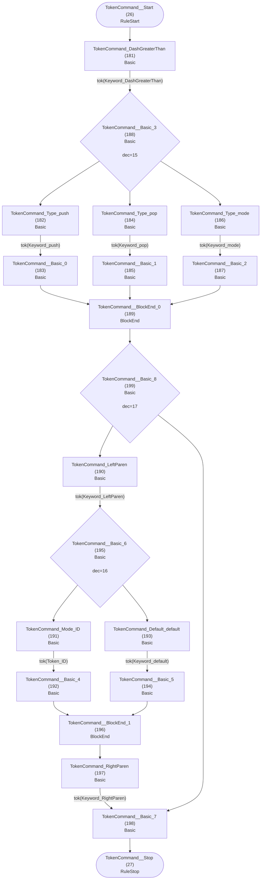
```mermaid
flowchart TD
    q26(["TokenCommand__Start (26)<br/>RuleStart"])
    q27(["TokenCommand__Stop (27)<br/>RuleStop"])
    q181["TokenCommand_DashGreaterThan (181)<br/>Basic<br/>"]
    q182["TokenCommand_Type_push (182)<br/>Basic<br/>"]
    q183["TokenCommand__Basic_0 (183)<br/>Basic<br/>"]
    q184["TokenCommand_Type_pop (184)<br/>Basic<br/>"]
    q185["TokenCommand__Basic_1 (185)<br/>Basic<br/>"]
    q186["TokenCommand_Type_mode (186)<br/>Basic<br/>"]
    q187["TokenCommand__Basic_2 (187)<br/>Basic<br/>"]
    q188{"TokenCommand__Basic_3 (188)<br/>Basic<br/><br/>dec=15"}
    q189["TokenCommand__BlockEnd_0 (189)<br/>BlockEnd<br/>"]
    q190["TokenCommand_LeftParen (190)<br/>Basic<br/>"]
    q191["TokenCommand_Mode_ID (191)<br/>Basic<br/>"]
    q192["TokenCommand__Basic_4 (192)<br/>Basic<br/>"]
    q193["TokenCommand_Default_default (193)<br/>Basic<br/>"]
    q194["TokenCommand__Basic_5 (194)<br/>Basic<br/>"]
    q195{"TokenCommand__Basic_6 (195)<br/>Basic<br/><br/>dec=16"}
    q196["TokenCommand__BlockEnd_1 (196)<br/>BlockEnd<br/>"]
    q197["TokenCommand_RightParen (197)<br/>Basic<br/>"]
    q198["TokenCommand__Basic_7 (198)<br/>Basic<br/>"]
    q199{"TokenCommand__Basic_8 (199)<br/>Basic<br/><br/>dec=17"}

    q26 --> q181
    q181 -->|"tok(Keyword_DashGreaterThan)"| q188
    q182 -->|"tok(Keyword_push)"| q183
    q183 --> q189
    q184 -->|"tok(Keyword_pop)"| q185
    q185 --> q189
    q186 -->|"tok(Keyword_mode)"| q187
    q187 --> q189
    q188 --> q182
    q188 --> q184
    q188 --> q186
    q189 --> q199
    q190 -->|"tok(Keyword_LeftParen)"| q195
    q191 -->|"tok(Token_ID)"| q192
    q192 --> q196
    q193 -->|"tok(Keyword_default)"| q194
    q194 --> q196
    q195 --> q191
    q195 --> q193
    q196 --> q197
    q197 -->|"tok(Keyword_RightParen)"| q198
    q198 --> q27
    q199 --> q190
    q199 --> q198
```

## TokenGroup

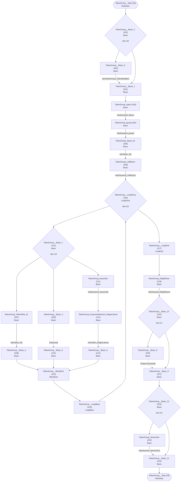
```mermaid
flowchart TD
    q28(["TokenGroup__Start (28)<br/>RuleStart"])
    q29(["TokenGroup__Stop (29)<br/>RuleStop"])
    q200["TokenGroup__Basic_0 (200)<br/>Basic<br/>"]
    q201["TokenGroup__Basic_1 (201)<br/>Basic<br/>"]
    q202{"TokenGroup__Basic_2 (202)<br/>Basic<br/><br/>dec=18"}
    q203["TokenGroup_token (203)<br/>Basic<br/>"]
    q204["TokenGroup_group (204)<br/>Basic<br/>"]
    q205["TokenGroup_Name_ID (205)<br/>Basic<br/>"]
    q206["TokenGroup_LeftBrace (206)<br/>Basic<br/>"]
    q207["TokenGroup_TokenRefs_ID (207)<br/>Basic<br/>"]
    q208["TokenGroup__Basic_3 (208)<br/>Basic<br/>"]
    q209["TokenGroup__Basic_4 (209)<br/>Basic<br/>"]
    q210["TokenGroup__Basic_5 (210)<br/>Basic<br/>"]
    q211["TokenGroup_keywords (211)<br/>Basic<br/>"]
    q212["TokenGroup_KeywordSelectors_RegexLiteral (212)<br/>Basic<br/>"]
    q213["TokenGroup__Basic_6 (213)<br/>Basic<br/>"]
    q214{"TokenGroup__Basic_7 (214)<br/>Basic<br/><br/>dec=19"}
    q215["TokenGroup__BlockEnd (215)<br/>BlockEnd<br/>"]
    q216{"TokenGroup__LoopEntry (216)<br/>LoopEntry<br/><br/>dec=20"}
    q217["TokenGroup__LoopEnd (217)<br/>LoopEnd<br/>"]
    q218["TokenGroup__LoopBack (218)<br/>LoopBack<br/>"]
    q219["TokenGroup_RightBrace (219)<br/>Basic<br/>"]
    q220["TokenGroup__Basic_8 (220)<br/>Basic<br/>"]
    q221["TokenGroup__Basic_9 (221)<br/>Basic<br/>"]
    q222{"TokenGroup__Basic_10 (222)<br/>Basic<br/><br/>dec=21"}
    q223["TokenGroup_Semicolon (223)<br/>Basic<br/>"]
    q224["TokenGroup__Basic_11 (224)<br/>Basic<br/>"]
    q225{"TokenGroup__Basic_12 (225)<br/>Basic<br/><br/>dec=22"}

    q28 --> q202
    q200 -->|"tok(TokenGroup_TokenModifier)"| q201
    q201 --> q203
    q202 --> q200
    q202 --> q201
    q203 -->|"tok(Keyword_token)"| q204
    q204 -->|"tok(Keyword_group)"| q205
    q205 -->|"tok(Token_ID)"| q206
    q206 -->|"tok(Keyword_LeftBrace)"| q216
    q207 -->|"tok(Token_ID)"| q208
    q208 --> q215
    q209 -.->|"[Keyword]"| q210
    q210 --> q215
    q211 -->|"tok(Keyword_keywords)"| q212
    q212 -->|"tok(Token_RegexLiteral)"| q213
    q213 --> q215
    q214 --> q207
    q214 --> q209
    q214 --> q211
    q215 --> q218
    q216 --> q214
    q216 --> q217
    q217 --> q219
    q218 --> q216
    q219 -->|"tok(Keyword_RightBrace)"| q222
    q220 -.->|"[TokenCommand]"| q221
    q221 --> q225
    q222 --> q220
    q222 --> q221
    q223 -->|"tok(Keyword_Semicolon)"| q224
    q224 --> q29
    q225 --> q223
    q225 --> q224
```

## TokenMode

```mermaid
flowchart TD
    q30(["TokenMode__Start (30)<br/>RuleStart"])
    q31(["TokenMode__Stop (31)<br/>RuleStop"])
    q226["TokenMode_token (226)<br/>Basic<br/>"]
    q227["TokenMode_mode (227)<br/>Basic<br/>"]
    q228["TokenMode_Name_ID (228)<br/>Basic<br/>"]
    q229["TokenMode__Basic_0 (229)<br/>Basic<br/>"]
    q230["TokenMode_Default_default (230)<br/>Basic<br/>"]
    q231["TokenMode__Basic_1 (231)<br/>Basic<br/>"]
    q232{"TokenMode__Basic_2 (232)<br/>Basic<br/><br/>dec=23"}
    q233["TokenMode__BlockEnd (233)<br/>BlockEnd<br/>"]
    q234["TokenMode_LeftBrace (234)<br/>Basic<br/>"]
    q235["TokenMode__Basic_3 (235)<br/>Basic<br/>"]
    q236["TokenMode__Basic_4 (236)<br/>Basic<br/>"]
    q237{"TokenMode__LoopEntry (237)<br/>LoopEntry<br/><br/>dec=24"}
    q238["TokenMode__LoopEnd (238)<br/>LoopEnd<br/>"]
    q239["TokenMode__LoopBack (239)<br/>LoopBack<br/>"]
    q240["TokenMode_RightBrace (240)<br/>Basic<br/>"]
    q241["TokenMode__Basic_5 (241)<br/>Basic<br/>"]

    q30 --> q226
    q226 -->|"tok(Keyword_token)"| q227
    q227 -->|"tok(Keyword_mode)"| q232
    q228 -->|"tok(Token_ID)"| q229
    q229 --> q233
    q230 -->|"tok(Keyword_default)"| q231
    q231 --> q233
    q232 --> q228
    q232 --> q230
    q233 --> q234
    q234 -->|"tok(Keyword_LeftBrace)"| q237
    q235 -.->|"[TokenModeMember]"| q236
    q236 --> q239
    q237 --> q235
    q237 --> q238
    q238 --> q240
    q239 --> q237
    q240 -->|"tok(Keyword_RightBrace)"| q241
    q241 --> q31
```

## TokenModeMember

```mermaid
flowchart TD
    q32(["TokenModeMember__Start (32)<br/>RuleStart"])
    q33(["TokenModeMember__Stop (33)<br/>RuleStop"])
    q242["TokenModeMember__Basic_0 (242)<br/>Basic<br/>"]
    q243["TokenModeMember__Basic_1 (243)<br/>Basic<br/>"]
    q244["TokenModeMember__Basic_2 (244)<br/>Basic<br/>"]
    q245["TokenModeMember__Basic_3 (245)<br/>Basic<br/>"]
    q246["TokenModeMember__Basic_4 (246)<br/>Basic<br/>"]
    q247["TokenModeMember__Basic_5 (247)<br/>Basic<br/>"]
    q248["TokenModeMember__Basic_6 (248)<br/>Basic<br/>"]
    q249["TokenModeMember__Basic_7 (249)<br/>Basic<br/>"]
    q250["TokenModeMember__Basic_8 (250)<br/>Basic<br/>"]
    q251["TokenModeMember__Basic_9 (251)<br/>Basic<br/>"]
    q252{"TokenModeMember__Basic_10 (252)<br/>Basic<br/><br/>dec=25"}
    q253["TokenModeMember__BlockEnd (253)<br/>BlockEnd<br/>"]

    q32 --> q252
    q242 -.->|"[TokenDeclUsage]"| q243
    q243 --> q253
    q244 -.->|"[TokenGroupUsage]"| q245
    q245 --> q253
    q246 -.->|"[TokenUsage]"| q247
    q247 --> q253
    q248 -.->|"[KeywordUsage]"| q249
    q249 --> q253
    q250 -.->|"[KeywordSelector]"| q251
    q251 --> q253
    q252 --> q242
    q252 --> q244
    q252 --> q246
    q252 --> q248
    q252 --> q250
    q253 --> q33
```

## TokenDeclUsage

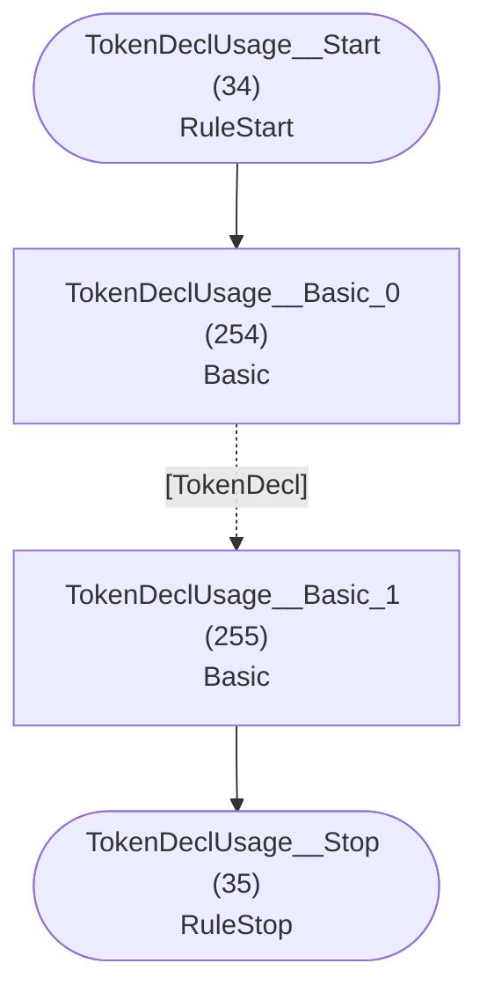
```mermaid
flowchart TD
    q34(["TokenDeclUsage__Start (34)<br/>RuleStart"])
    q35(["TokenDeclUsage__Stop (35)<br/>RuleStop"])
    q254["TokenDeclUsage__Basic_0 (254)<br/>Basic<br/>"]
    q255["TokenDeclUsage__Basic_1 (255)<br/>Basic<br/>"]

    q34 --> q254
    q254 -.->|"[TokenDecl]"| q255
    q255 --> q35
```

## TokenGroupUsage

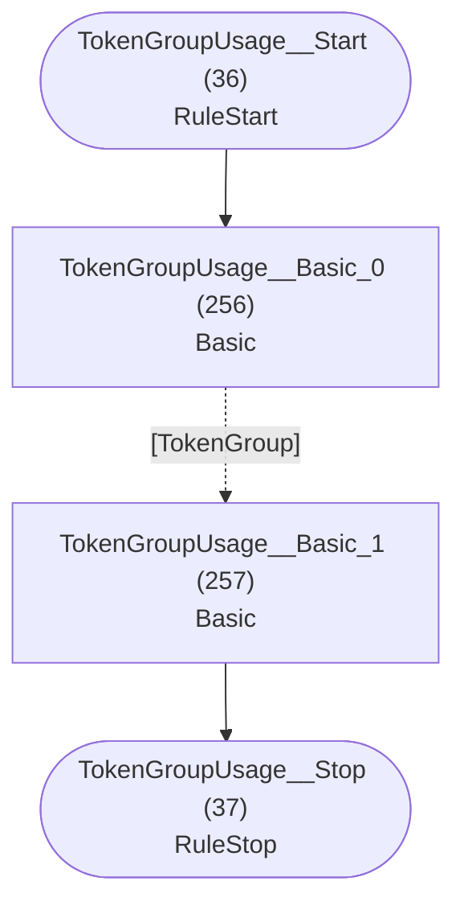
```mermaid
flowchart TD
    q36(["TokenGroupUsage__Start (36)<br/>RuleStart"])
    q37(["TokenGroupUsage__Stop (37)<br/>RuleStop"])
    q256["TokenGroupUsage__Basic_0 (256)<br/>Basic<br/>"]
    q257["TokenGroupUsage__Basic_1 (257)<br/>Basic<br/>"]

    q36 --> q256
    q256 -.->|"[TokenGroup]"| q257
    q257 --> q37
```

## TokenUsage

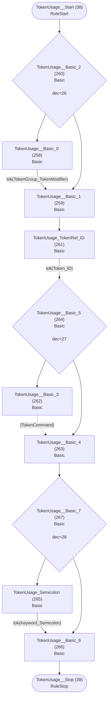
```mermaid
flowchart TD
    q38(["TokenUsage__Start (38)<br/>RuleStart"])
    q39(["TokenUsage__Stop (39)<br/>RuleStop"])
    q258["TokenUsage__Basic_0 (258)<br/>Basic<br/>"]
    q259["TokenUsage__Basic_1 (259)<br/>Basic<br/>"]
    q260{"TokenUsage__Basic_2 (260)<br/>Basic<br/><br/>dec=26"}
    q261["TokenUsage_TokenRef_ID (261)<br/>Basic<br/>"]
    q262["TokenUsage__Basic_3 (262)<br/>Basic<br/>"]
    q263["TokenUsage__Basic_4 (263)<br/>Basic<br/>"]
    q264{"TokenUsage__Basic_5 (264)<br/>Basic<br/><br/>dec=27"}
    q265["TokenUsage_Semicolon (265)<br/>Basic<br/>"]
    q266["TokenUsage__Basic_6 (266)<br/>Basic<br/>"]
    q267{"TokenUsage__Basic_7 (267)<br/>Basic<br/><br/>dec=28"}

    q38 --> q260
    q258 -->|"tok(TokenGroup_TokenModifier)"| q259
    q259 --> q261
    q260 --> q258
    q260 --> q259
    q261 -->|"tok(Token_ID)"| q264
    q262 -.->|"[TokenCommand]"| q263
    q263 --> q267
    q264 --> q262
    q264 --> q263
    q265 -->|"tok(Keyword_Semicolon)"| q266
    q266 --> q39
    q267 --> q265
    q267 --> q266
```

## KeywordUsage

```mermaid
flowchart TD
    q40(["KeywordUsage__Start (40)<br/>RuleStart"])
    q41(["KeywordUsage__Stop (41)<br/>RuleStop"])
    q268["KeywordUsage__Basic_0 (268)<br/>Basic<br/>"]
    q269["KeywordUsage__Basic_1 (269)<br/>Basic<br/>"]
    q270{"KeywordUsage__Basic_2 (270)<br/>Basic<br/><br/>dec=29"}
    q271["KeywordUsage__Basic_3 (271)<br/>Basic<br/>"]
    q272["KeywordUsage__Basic_4 (272)<br/>Basic<br/>"]
    q273["KeywordUsage__Basic_5 (273)<br/>Basic<br/>"]
    q274{"KeywordUsage__Basic_6 (274)<br/>Basic<br/><br/>dec=30"}
    q275["KeywordUsage_Semicolon (275)<br/>Basic<br/>"]
    q276["KeywordUsage__Basic_7 (276)<br/>Basic<br/>"]
    q277{"KeywordUsage__Basic_8 (277)<br/>Basic<br/><br/>dec=31"}

    q40 --> q270
    q268 -->|"tok(TokenGroup_TokenModifier)"| q269
    q269 --> q271
    q270 --> q268
    q270 --> q269
    q271 -.->|"[Keyword]"| q274
    q272 -.->|"[TokenCommand]"| q273
    q273 --> q277
    q274 --> q272
    q274 --> q273
    q275 -->|"tok(Keyword_Semicolon)"| q276
    q276 --> q41
    q277 --> q275
    q277 --> q276
```

## KeywordSelector

```mermaid
flowchart TD
    q42(["KeywordSelector__Start (42)<br/>RuleStart"])
    q43(["KeywordSelector__Stop (43)<br/>RuleStop"])
    q278["KeywordSelector_keywords (278)<br/>Basic<br/>"]
    q279["KeywordSelector_Selector_RegexLiteral (279)<br/>Basic<br/>"]
    q280["KeywordSelector_Semicolon (280)<br/>Basic<br/>"]
    q281["KeywordSelector__Basic_0 (281)<br/>Basic<br/>"]
    q282{"KeywordSelector__Basic_1 (282)<br/>Basic<br/><br/>dec=32"}

    q42 --> q278
    q278 -->|"tok(Keyword_keywords)"| q279
    q279 -->|"tok(Token_RegexLiteral)"| q282
    q280 -->|"tok(Keyword_Semicolon)"| q281
    q281 --> q43
    q282 --> q280
    q282 --> q281
```

## Alternatives

```mermaid
flowchart TD
    q44(["Alternatives__Start (44)<br/>RuleStart"])
    q45(["Alternatives__Stop (45)<br/>RuleStop"])
    q283["Alternatives__Basic_0 (283)<br/>Basic<br/>"]
    q284["Alternatives_Pipe (284)<br/>Basic<br/>"]
    q285["Alternatives__Basic_1 (285)<br/>Basic<br/>"]
    q286["Alternatives__Basic_2 (286)<br/>Basic<br/>"]
    q287{"Alternatives__LoopBack (287)<br/>LoopBack<br/><br/>dec=33"}
    q288["Alternatives__LoopEnd (288)<br/>LoopEnd<br/>"]
    q289{"Alternatives__Basic_3 (289)<br/>Basic<br/><br/>dec=34"}

    q44 --> q283
    q283 -.->|"[Group]"| q289
    q284 -->|"tok(Keyword_Pipe)"| q285
    q285 -.->|"[Group]"| q286
    q286 --> q287
    q287 --> q284
    q287 --> q288
    q288 --> q45
    q289 --> q284
    q289 --> q288
```

## Group

```mermaid
flowchart TD
    q46(["Group__Start (46)<br/>RuleStart"])
    q47(["Group__Stop (47)<br/>RuleStop"])
    q290["Group__Basic_0 (290)<br/>Basic<br/>"]
    q291["Group__Basic_1 (291)<br/>Basic<br/>"]
    q292["Group__Basic_2 (292)<br/>Basic<br/>"]
    q293{"Group__LoopBack (293)<br/>LoopBack<br/><br/>dec=35"}
    q294["Group__LoopEnd (294)<br/>LoopEnd<br/>"]
    q295{"Group__Basic_3 (295)<br/>Basic<br/><br/>dec=36"}

    q46 --> q290
    q290 -.->|"[Element]"| q295
    q291 -.->|"[Element]"| q292
    q292 --> q293
    q293 --> q291
    q293 --> q294
    q294 --> q47
    q295 --> q291
    q295 --> q294
```

## Element

```mermaid
flowchart TD
    q48(["Element__Start (48)<br/>RuleStart"])
    q49(["Element__Stop (49)<br/>RuleStop"])
    q296["Element__Basic_0 (296)<br/>Basic<br/>"]
    q297["Element__Basic_1 (297)<br/>Basic<br/>"]
    q298["Element__Basic_2 (298)<br/>Basic<br/>"]
    q299["Element__Basic_3 (299)<br/>Basic<br/>"]
    q300["Element__Basic_4 (300)<br/>Basic<br/>"]
    q301["Element__Basic_5 (301)<br/>Basic<br/>"]
    q302["Element__Basic_6 (302)<br/>Basic<br/>"]
    q303["Element__Basic_7 (303)<br/>Basic<br/>"]
    q304["Element_LeftParen (304)<br/>Basic<br/>"]
    q305["Element__Basic_8 (305)<br/>Basic<br/>"]
    q306["Element_RightParen (306)<br/>Basic<br/>"]
    q307["Element__Basic_9 (307)<br/>Basic<br/>"]
    q308{"Element__Basic_10 (308)<br/>Basic<br/><br/>dec=37"}
    q309["Element__BlockEnd (309)<br/>BlockEnd<br/>"]
    q310["Element__Basic_11 (310)<br/>Basic<br/>"]
    q311["Element__Basic_12 (311)<br/>Basic<br/>"]
    q312{"Element__Basic_13 (312)<br/>Basic<br/><br/>dec=38"}

    q48 --> q308
    q296 -.->|"[Keyword]"| q297
    q297 --> q309
    q298 -.->|"[Assignment]"| q299
    q299 --> q309
    q300 -.->|"[RuleCall]"| q301
    q301 --> q309
    q302 -.->|"[Action]"| q303
    q303 --> q309
    q304 -->|"tok(Keyword_LeftParen)"| q305
    q305 -.->|"[Alternatives]"| q306
    q306 -->|"tok(Keyword_RightParen)"| q307
    q307 --> q309
    q308 --> q296
    q308 --> q298
    q308 --> q300
    q308 --> q302
    q308 --> q304
    q309 --> q312
    q310 -->|"tok(TokenGroup_Cardinality)"| q311
    q311 --> q49
    q312 --> q310
    q312 --> q311
```

## Keyword

```mermaid
flowchart TD
    q50(["Keyword__Start (50)<br/>RuleStart"])
    q51(["Keyword__Stop (51)<br/>RuleStop"])
    q313["Keyword_Value_StringLiteral (313)<br/>Basic<br/>"]
    q314["Keyword__Basic (314)<br/>Basic<br/>"]

    q50 --> q313
    q313 -->|"tok(Token_StringLiteral)"| q314
    q314 --> q51
```

## Assignment

```mermaid
flowchart TD
    q52(["Assignment__Start (52)<br/>RuleStart"])
    q53(["Assignment__Stop (53)<br/>RuleStop"])
    q315["Assignment_Property_ID (315)<br/>Basic<br/>"]
    q316["Assignment_Operator_PlusEquals (316)<br/>Basic<br/>"]
    q317["Assignment__Basic_0 (317)<br/>Basic<br/>"]
    q318["Assignment_Operator_Equals (318)<br/>Basic<br/>"]
    q319["Assignment__Basic_1 (319)<br/>Basic<br/>"]
    q320["Assignment_Operator_QuestionEquals (320)<br/>Basic<br/>"]
    q321["Assignment__Basic_2 (321)<br/>Basic<br/>"]
    q322{"Assignment__Basic_3 (322)<br/>Basic<br/><br/>dec=39"}
    q323["Assignment__BlockEnd (323)<br/>BlockEnd<br/>"]
    q324["Assignment__Basic_4 (324)<br/>Basic<br/>"]
    q325["Assignment__Basic_5 (325)<br/>Basic<br/>"]

    q52 --> q315
    q315 -->|"tok(Token_ID)"| q322
    q316 -->|"tok(Keyword_PlusEquals)"| q317
    q317 --> q323
    q318 -->|"tok(Keyword_Equals)"| q319
    q319 --> q323
    q320 -->|"tok(Keyword_QuestionEquals)"| q321
    q321 --> q323
    q322 --> q316
    q322 --> q318
    q322 --> q320
    q323 --> q324
    q324 -.->|"[Assignable]"| q325
    q325 --> q53
```

## Assignable

```mermaid
flowchart TD
    q54(["Assignable__Start (54)<br/>RuleStart"])
    q55(["Assignable__Stop (55)<br/>RuleStop"])
    q326["Assignable__Basic_0 (326)<br/>Basic<br/>"]
    q327["Assignable__Basic_1 (327)<br/>Basic<br/>"]
    q328["Assignable__Basic_2 (328)<br/>Basic<br/>"]
    q329["Assignable__Basic_3 (329)<br/>Basic<br/>"]
    q330["Assignable__Basic_4 (330)<br/>Basic<br/>"]
    q331["Assignable__Basic_5 (331)<br/>Basic<br/>"]
    q332["Assignable_LeftParen (332)<br/>Basic<br/>"]
    q333["Assignable__Basic_6 (333)<br/>Basic<br/>"]
    q334["Assignable_RightParen (334)<br/>Basic<br/>"]
    q335["Assignable__Basic_7 (335)<br/>Basic<br/>"]
    q336{"Assignable__Basic_8 (336)<br/>Basic<br/><br/>dec=40"}
    q337["Assignable__BlockEnd (337)<br/>BlockEnd<br/>"]

    q54 --> q336
    q326 -.->|"[Keyword]"| q327
    q327 --> q337
    q328 -.->|"[RuleCall]"| q329
    q329 --> q337
    q330 -.->|"[CrossRef]"| q331
    q331 --> q337
    q332 -->|"tok(Keyword_LeftParen)"| q333
    q333 -.->|"[AssignableAlternatives]"| q334
    q334 -->|"tok(Keyword_RightParen)"| q335
    q335 --> q337
    q336 --> q326
    q336 --> q328
    q336 --> q330
    q336 --> q332
    q337 --> q55
```

## AssignableWithoutAlts

```mermaid
flowchart TD
    q56(["AssignableWithoutAlts__Start (56)<br/>RuleStart"])
    q57(["AssignableWithoutAlts__Stop (57)<br/>RuleStop"])
    q338["AssignableWithoutAlts__Basic_0 (338)<br/>Basic<br/>"]
    q339["AssignableWithoutAlts__Basic_1 (339)<br/>Basic<br/>"]
    q340["AssignableWithoutAlts__Basic_2 (340)<br/>Basic<br/>"]
    q341["AssignableWithoutAlts__Basic_3 (341)<br/>Basic<br/>"]
    q342["AssignableWithoutAlts__Basic_4 (342)<br/>Basic<br/>"]
    q343["AssignableWithoutAlts__Basic_5 (343)<br/>Basic<br/>"]
    q344{"AssignableWithoutAlts__Basic_6 (344)<br/>Basic<br/><br/>dec=41"}
    q345["AssignableWithoutAlts__BlockEnd (345)<br/>BlockEnd<br/>"]

    q56 --> q344
    q338 -.->|"[Keyword]"| q339
    q339 --> q345
    q340 -.->|"[RuleCall]"| q341
    q341 --> q345
    q342 -.->|"[CrossRef]"| q343
    q343 --> q345
    q344 --> q338
    q344 --> q340
    q344 --> q342
    q345 --> q57
```

## AssignableAlternatives

```mermaid
flowchart TD
    q58(["AssignableAlternatives__Start (58)<br/>RuleStart"])
    q59(["AssignableAlternatives__Stop (59)<br/>RuleStop"])
    q346["AssignableAlternatives__Basic_0 (346)<br/>Basic<br/>"]
    q347["AssignableAlternatives_Pipe (347)<br/>Basic<br/>"]
    q348["AssignableAlternatives__Basic_1 (348)<br/>Basic<br/>"]
    q349["AssignableAlternatives__Basic_2 (349)<br/>Basic<br/>"]
    q350{"AssignableAlternatives__LoopBack (350)<br/>LoopBack<br/><br/>dec=42"}
    q351["AssignableAlternatives__LoopEnd (351)<br/>LoopEnd<br/>"]
    q352{"AssignableAlternatives__Basic_3 (352)<br/>Basic<br/><br/>dec=43"}

    q58 --> q346
    q346 -.->|"[AssignableWithoutAlts]"| q352
    q347 -->|"tok(Keyword_Pipe)"| q348
    q348 -.->|"[AssignableWithoutAlts]"| q349
    q349 --> q350
    q350 --> q347
    q350 --> q351
    q351 --> q59
    q352 --> q347
    q352 --> q351
```

## CrossRef

```mermaid
flowchart TD
    q60(["CrossRef__Start (60)<br/>RuleStart"])
    q61(["CrossRef__Stop (61)<br/>RuleStop"])
    q353["CrossRef_LeftBracket (353)<br/>Basic<br/>"]
    q354["CrossRef_Type_ID (354)<br/>Basic<br/>"]
    q355["CrossRef_Colon (355)<br/>Basic<br/>"]
    q356["CrossRef__Basic_0 (356)<br/>Basic<br/>"]
    q357["CrossRef__Basic_1 (357)<br/>Basic<br/>"]
    q358{"CrossRef__Basic_2 (358)<br/>Basic<br/><br/>dec=44"}
    q359["CrossRef_RightBracket (359)<br/>Basic<br/>"]
    q360["CrossRef__Basic_3 (360)<br/>Basic<br/>"]

    q60 --> q353
    q353 -->|"tok(Keyword_LeftBracket)"| q354
    q354 -->|"tok(Token_ID)"| q358
    q355 -->|"tok(Keyword_Colon)"| q356
    q356 -.->|"[RuleCall]"| q357
    q357 --> q359
    q358 --> q355
    q358 --> q357
    q359 -->|"tok(Keyword_RightBracket)"| q360
    q360 --> q61
```

## RuleCall

```mermaid
flowchart TD
    q62(["RuleCall__Start (62)<br/>RuleStart"])
    q63(["RuleCall__Stop (63)<br/>RuleStop"])
    q361["RuleCall_Rule_ID (361)<br/>Basic<br/>"]
    q362["RuleCall__Basic (362)<br/>Basic<br/>"]

    q62 --> q361
    q361 -->|"tok(Token_ID)"| q362
    q362 --> q63
```

## Action

```mermaid
flowchart TD
    q64(["Action__Start (64)<br/>RuleStart"])
    q65(["Action__Stop (65)<br/>RuleStop"])
    q363["Action_LeftBrace (363)<br/>Basic<br/>"]
    q364["Action_Type_ID (364)<br/>Basic<br/>"]
    q365["Action_Dot (365)<br/>Basic<br/>"]
    q366["Action_Property_ID (366)<br/>Basic<br/>"]
    q367["Action_Operator_PlusEquals (367)<br/>Basic<br/>"]
    q368["Action__Basic_0 (368)<br/>Basic<br/>"]
    q369["Action_Operator_Equals (369)<br/>Basic<br/>"]
    q370["Action__Basic_1 (370)<br/>Basic<br/>"]
    q371{"Action__Basic_2 (371)<br/>Basic<br/><br/>dec=45"}
    q372["Action__BlockEnd (372)<br/>BlockEnd<br/>"]
    q373["Action_current (373)<br/>Basic<br/>"]
    q374["Action__Basic_3 (374)<br/>Basic<br/>"]
    q375{"Action__Basic_4 (375)<br/>Basic<br/><br/>dec=46"}
    q376["Action_RightBrace (376)<br/>Basic<br/>"]
    q377["Action__Basic_5 (377)<br/>Basic<br/>"]

    q64 --> q363
    q363 -->|"tok(Keyword_LeftBrace)"| q364
    q364 -->|"tok(Token_ID)"| q375
    q365 -->|"tok(Keyword_Dot)"| q366
    q366 -->|"tok(Token_ID)"| q371
    q367 -->|"tok(Keyword_PlusEquals)"| q368
    q368 --> q372
    q369 -->|"tok(Keyword_Equals)"| q370
    q370 --> q372
    q371 --> q367
    q371 --> q369
    q372 --> q373
    q373 -->|"tok(Keyword_current)"| q374
    q374 --> q376
    q375 --> q365
    q375 --> q374
    q376 -->|"tok(Keyword_RightBrace)"| q377
    q377 --> q65
```

## CompositeRule

```mermaid
flowchart TD
    q66(["CompositeRule__Start (66)<br/>RuleStart"])
    q67(["CompositeRule__Stop (67)<br/>RuleStop"])
    q378["CompositeRule_composite (378)<br/>Basic<br/>"]
    q379["CompositeRule_Name_ID (379)<br/>Basic<br/>"]
    q380["CompositeRule_Colon (380)<br/>Basic<br/>"]
    q381["CompositeRule__Basic_0 (381)<br/>Basic<br/>"]
    q382["CompositeRule_Semicolon (382)<br/>Basic<br/>"]
    q383["CompositeRule__Basic_1 (383)<br/>Basic<br/>"]
    q384{"CompositeRule__Basic_2 (384)<br/>Basic<br/><br/>dec=47"}

    q66 --> q378
    q378 -->|"tok(Keyword_composite)"| q379
    q379 -->|"tok(Token_ID)"| q380
    q380 -->|"tok(Keyword_Colon)"| q381
    q381 -.->|"[CompositeAlternatives]"| q384
    q382 -->|"tok(Keyword_Semicolon)"| q383
    q383 --> q67
    q384 --> q382
    q384 --> q383
```

## CompositeAlternatives

```mermaid
flowchart TD
    q68(["CompositeAlternatives__Start (68)<br/>RuleStart"])
    q69(["CompositeAlternatives__Stop (69)<br/>RuleStop"])
    q385["CompositeAlternatives__Basic_0 (385)<br/>Basic<br/>"]
    q386["CompositeAlternatives_Pipe (386)<br/>Basic<br/>"]
    q387["CompositeAlternatives__Basic_1 (387)<br/>Basic<br/>"]
    q388["CompositeAlternatives__Basic_2 (388)<br/>Basic<br/>"]
    q389{"CompositeAlternatives__LoopBack (389)<br/>LoopBack<br/><br/>dec=48"}
    q390["CompositeAlternatives__LoopEnd (390)<br/>LoopEnd<br/>"]
    q391{"CompositeAlternatives__Basic_3 (391)<br/>Basic<br/><br/>dec=49"}

    q68 --> q385
    q385 -.->|"[CompositeGroup]"| q391
    q386 -->|"tok(Keyword_Pipe)"| q387
    q387 -.->|"[CompositeGroup]"| q388
    q388 --> q389
    q389 --> q386
    q389 --> q390
    q390 --> q69
    q391 --> q386
    q391 --> q390
```

## CompositeGroup

```mermaid
flowchart TD
    q70(["CompositeGroup__Start (70)<br/>RuleStart"])
    q71(["CompositeGroup__Stop (71)<br/>RuleStop"])
    q392["CompositeGroup__Basic_0 (392)<br/>Basic<br/>"]
    q393["CompositeGroup__Basic_1 (393)<br/>Basic<br/>"]
    q394["CompositeGroup__Basic_2 (394)<br/>Basic<br/>"]
    q395{"CompositeGroup__LoopBack (395)<br/>LoopBack<br/><br/>dec=50"}
    q396["CompositeGroup__LoopEnd (396)<br/>LoopEnd<br/>"]
    q397{"CompositeGroup__Basic_3 (397)<br/>Basic<br/><br/>dec=51"}

    q70 --> q392
    q392 -.->|"[CompositeElement]"| q397
    q393 -.->|"[CompositeElement]"| q394
    q394 --> q395
    q395 --> q393
    q395 --> q396
    q396 --> q71
    q397 --> q393
    q397 --> q396
```

## CompositeElement

```mermaid
flowchart TD
    q72(["CompositeElement__Start (72)<br/>RuleStart"])
    q73(["CompositeElement__Stop (73)<br/>RuleStop"])
    q398["CompositeElement__Basic_0 (398)<br/>Basic<br/>"]
    q399["CompositeElement__Basic_1 (399)<br/>Basic<br/>"]
    q400["CompositeElement__Basic_2 (400)<br/>Basic<br/>"]
    q401["CompositeElement__Basic_3 (401)<br/>Basic<br/>"]
    q402["CompositeElement_LeftParen (402)<br/>Basic<br/>"]
    q403["CompositeElement__Basic_4 (403)<br/>Basic<br/>"]
    q404["CompositeElement_RightParen (404)<br/>Basic<br/>"]
    q405["CompositeElement__Basic_5 (405)<br/>Basic<br/>"]
    q406{"CompositeElement__Basic_6 (406)<br/>Basic<br/><br/>dec=52"}
    q407["CompositeElement__BlockEnd (407)<br/>BlockEnd<br/>"]
    q408["CompositeElement__Basic_7 (408)<br/>Basic<br/>"]
    q409["CompositeElement__Basic_8 (409)<br/>Basic<br/>"]
    q410{"CompositeElement__Basic_9 (410)<br/>Basic<br/><br/>dec=53"}

    q72 --> q406
    q398 -.->|"[Keyword]"| q399
    q399 --> q407
    q400 -.->|"[RuleCall]"| q401
    q401 --> q407
    q402 -->|"tok(Keyword_LeftParen)"| q403
    q403 -.->|"[CompositeAlternatives]"| q404
    q404 -->|"tok(Keyword_RightParen)"| q405
    q405 --> q407
    q406 --> q398
    q406 --> q400
    q406 --> q402
    q407 --> q410
    q408 -->|"tok(TokenGroup_Cardinality)"| q409
    q409 --> q73
    q410 --> q408
    q410 --> q409
```

