# Runtime ATN for grammar

## Grammar

```mermaid
flowchart TD
    q0(["StateNumber__Grammar__Start (0)<br/>RuleStart"])
    q1(["StateNumber__Grammar__Stop (1)<br/>RuleStop"])
    q72["StateNumber__Grammar_GRAMMAR (72)<br/>Basic<br/>"]
    q73["StateNumber__Grammar_Name_ID (73)<br/>Basic<br/>"]
    q74["StateNumber__Grammar_SEMICOLON (74)<br/>Basic<br/>"]
    q75["StateNumber__Grammar__Basic_0 (75)<br/>Basic<br/>"]
    q76{"StateNumber__Grammar__Basic_1 (76)<br/>Basic<br/><br/>dec=0"}
    q77["StateNumber__Grammar__Basic_2 (77)<br/>Basic<br/>"]
    q78["StateNumber__Grammar__Basic_3 (78)<br/>Basic<br/>"]
    q79["StateNumber__Grammar__Basic_4 (79)<br/>Basic<br/>"]
    q80["StateNumber__Grammar__Basic_5 (80)<br/>Basic<br/>"]
    q81["StateNumber__Grammar__Basic_6 (81)<br/>Basic<br/>"]
    q82["StateNumber__Grammar__Basic_7 (82)<br/>Basic<br/>"]
    q83["StateNumber__Grammar__Basic_8 (83)<br/>Basic<br/>"]
    q84["StateNumber__Grammar__Basic_9 (84)<br/>Basic<br/>"]
    q85["StateNumber__Grammar__Basic_10 (85)<br/>Basic<br/>"]
    q86["StateNumber__Grammar__Basic_11 (86)<br/>Basic<br/>"]
    q87["StateNumber__Grammar__Basic_12 (87)<br/>Basic<br/>"]
    q88["StateNumber__Grammar__Basic_13 (88)<br/>Basic<br/>"]
    q89{"StateNumber__Grammar__Basic_14 (89)<br/>Basic<br/><br/>dec=1"}
    q90["StateNumber__Grammar__BlockEnd (90)<br/>BlockEnd<br/>"]
    q91{"StateNumber__Grammar__LoopEntry (91)<br/>LoopEntry<br/><br/>dec=2"}
    q92["StateNumber__Grammar__LoopEnd (92)<br/>LoopEnd<br/>"]
    q93["StateNumber__Grammar__LoopBack (93)<br/>LoopBack<br/>"]

    q0 --> q72
    q72 -->|"tok(Token_GRAMMAR)"| q73
    q73 -->|"tok(Token_ID)"| q76
    q74 -->|"tok(Token_SEMICOLON)"| q75
    q75 --> q91
    q76 --> q74
    q76 --> q75
    q77 -.->|"[ParserRule]"| q78
    q78 --> q90
    q79 -.->|"[TokenDecl]"| q80
    q80 --> q90
    q81 -.->|"[TokenGroup]"| q82
    q82 --> q90
    q83 -.->|"[TokenMode]"| q84
    q84 --> q90
    q85 -.->|"[Interface]"| q86
    q86 --> q90
    q87 -.->|"[CompositeRule]"| q88
    q88 --> q90
    q89 --> q77
    q89 --> q79
    q89 --> q81
    q89 --> q83
    q89 --> q85
    q89 --> q87
    q90 --> q93
    q91 --> q89
    q91 --> q92
    q92 --> q1
    q93 --> q91
```

## Interface

```mermaid
flowchart TD
    q2(["StateNumber__Interface__Start (2)<br/>RuleStart"])
    q3(["StateNumber__Interface__Stop (3)<br/>RuleStop"])
    q94["StateNumber__Interface_INTERFACE (94)<br/>Basic<br/>"]
    q95["StateNumber__Interface_Name_ID (95)<br/>Basic<br/>"]
    q96["StateNumber__Interface_EXTENDS (96)<br/>Basic<br/>"]
    q97["StateNumber__Interface_Extends_ID_0 (97)<br/>Basic<br/>"]
    q98["StateNumber__Interface_COMMA (98)<br/>Basic<br/>"]
    q99["StateNumber__Interface_Extends_ID_1 (99)<br/>Basic<br/>"]
    q100["StateNumber__Interface__Basic_0 (100)<br/>Basic<br/>"]
    q101{"StateNumber__Interface__LoopEntry_0 (101)<br/>LoopEntry<br/><br/>dec=3"}
    q102["StateNumber__Interface__LoopEnd_0 (102)<br/>LoopEnd<br/>"]
    q103["StateNumber__Interface__LoopBack_0 (103)<br/>LoopBack<br/>"]
    q104{"StateNumber__Interface__Basic_1 (104)<br/>Basic<br/><br/>dec=4"}
    q105["StateNumber__Interface_LEFTBRACE (105)<br/>Basic<br/>"]
    q106["StateNumber__Interface__Basic_2 (106)<br/>Basic<br/>"]
    q107["StateNumber__Interface__Basic_3 (107)<br/>Basic<br/>"]
    q108{"StateNumber__Interface__LoopEntry_1 (108)<br/>LoopEntry<br/><br/>dec=5"}
    q109["StateNumber__Interface__LoopEnd_1 (109)<br/>LoopEnd<br/>"]
    q110["StateNumber__Interface__LoopBack_1 (110)<br/>LoopBack<br/>"]
    q111["StateNumber__Interface_RIGHTBRACE (111)<br/>Basic<br/>"]
    q112["StateNumber__Interface__Basic_4 (112)<br/>Basic<br/>"]

    q2 --> q94
    q94 -->|"tok(Token_INTERFACE)"| q95
    q95 -->|"tok(Token_ID)"| q104
    q96 -->|"tok(Token_EXTENDS)"| q97
    q97 -->|"tok(Token_ID)"| q101
    q98 -->|"tok(Token_COMMA)"| q99
    q99 -->|"tok(Token_ID)"| q100
    q100 --> q103
    q101 --> q98
    q101 --> q102
    q102 --> q105
    q103 --> q101
    q104 --> q96
    q104 --> q102
    q105 -->|"tok(Token_LEFTBRACE)"| q108
    q106 -.->|"[Field]"| q107
    q107 --> q110
    q108 --> q106
    q108 --> q109
    q109 --> q111
    q110 --> q108
    q111 -->|"tok(Token_RIGHTBRACE)"| q112
    q112 --> q3
```

## Field

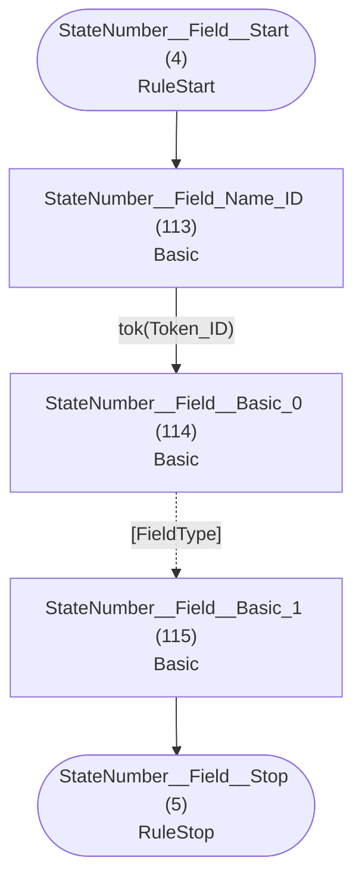
```mermaid
flowchart TD
    q4(["StateNumber__Field__Start (4)<br/>RuleStart"])
    q5(["StateNumber__Field__Stop (5)<br/>RuleStop"])
    q113["StateNumber__Field_Name_ID (113)<br/>Basic<br/>"]
    q114["StateNumber__Field__Basic_0 (114)<br/>Basic<br/>"]
    q115["StateNumber__Field__Basic_1 (115)<br/>Basic<br/>"]

    q4 --> q113
    q113 -->|"tok(Token_ID)"| q114
    q114 -.->|"[FieldType]"| q115
    q115 --> q5
```

## FieldType

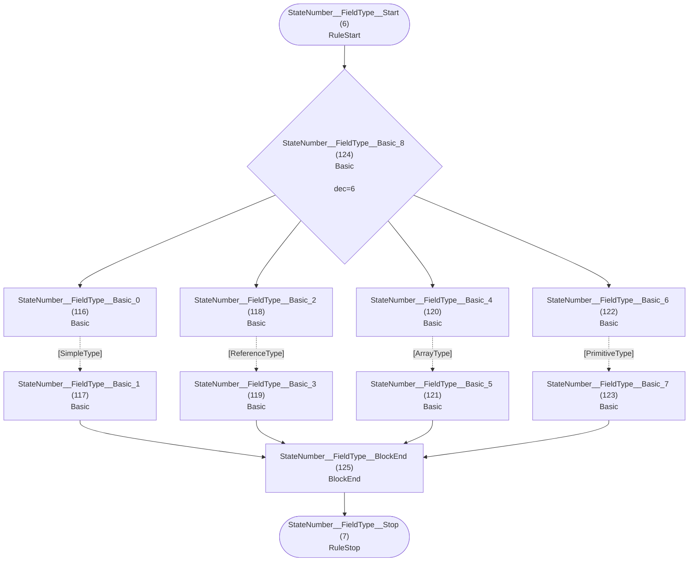
```mermaid
flowchart TD
    q6(["StateNumber__FieldType__Start (6)<br/>RuleStart"])
    q7(["StateNumber__FieldType__Stop (7)<br/>RuleStop"])
    q116["StateNumber__FieldType__Basic_0 (116)<br/>Basic<br/>"]
    q117["StateNumber__FieldType__Basic_1 (117)<br/>Basic<br/>"]
    q118["StateNumber__FieldType__Basic_2 (118)<br/>Basic<br/>"]
    q119["StateNumber__FieldType__Basic_3 (119)<br/>Basic<br/>"]
    q120["StateNumber__FieldType__Basic_4 (120)<br/>Basic<br/>"]
    q121["StateNumber__FieldType__Basic_5 (121)<br/>Basic<br/>"]
    q122["StateNumber__FieldType__Basic_6 (122)<br/>Basic<br/>"]
    q123["StateNumber__FieldType__Basic_7 (123)<br/>Basic<br/>"]
    q124{"StateNumber__FieldType__Basic_8 (124)<br/>Basic<br/><br/>dec=6"}
    q125["StateNumber__FieldType__BlockEnd (125)<br/>BlockEnd<br/>"]

    q6 --> q124
    q116 -.->|"[SimpleType]"| q117
    q117 --> q125
    q118 -.->|"[ReferenceType]"| q119
    q119 --> q125
    q120 -.->|"[ArrayType]"| q121
    q121 --> q125
    q122 -.->|"[PrimitiveType]"| q123
    q123 --> q125
    q124 --> q116
    q124 --> q118
    q124 --> q120
    q124 --> q122
    q125 --> q7
```

## ArrayType

```mermaid
flowchart TD
    q8(["StateNumber__ArrayType__Start (8)<br/>RuleStart"])
    q9(["StateNumber__ArrayType__Stop (9)<br/>RuleStop"])
    q126["StateNumber__ArrayType_LEFTBRACKET (126)<br/>Basic<br/>"]
    q127["StateNumber__ArrayType_RIGHTBRACKET (127)<br/>Basic<br/>"]
    q128["StateNumber__ArrayType__Basic_0 (128)<br/>Basic<br/>"]
    q129["StateNumber__ArrayType__Basic_1 (129)<br/>Basic<br/>"]

    q8 --> q126
    q126 -->|"tok(Token_LEFTBRACKET)"| q127
    q127 -->|"tok(Token_RIGHTBRACKET)"| q128
    q128 -.->|"[FieldType]"| q129
    q129 --> q9
```

## ReferenceType

```mermaid
flowchart TD
    q10(["StateNumber__ReferenceType__Start (10)<br/>RuleStart"])
    q11(["StateNumber__ReferenceType__Stop (11)<br/>RuleStop"])
    q130["StateNumber__ReferenceType_ASTERISK (130)<br/>Basic<br/>"]
    q131["StateNumber__ReferenceType_Type_ID (131)<br/>Basic<br/>"]
    q132["StateNumber__ReferenceType__Basic (132)<br/>Basic<br/>"]

    q10 --> q130
    q130 -->|"tok(Token_ASTERISK)"| q131
    q131 -->|"tok(Token_ID)"| q132
    q132 --> q11
```

## SimpleType

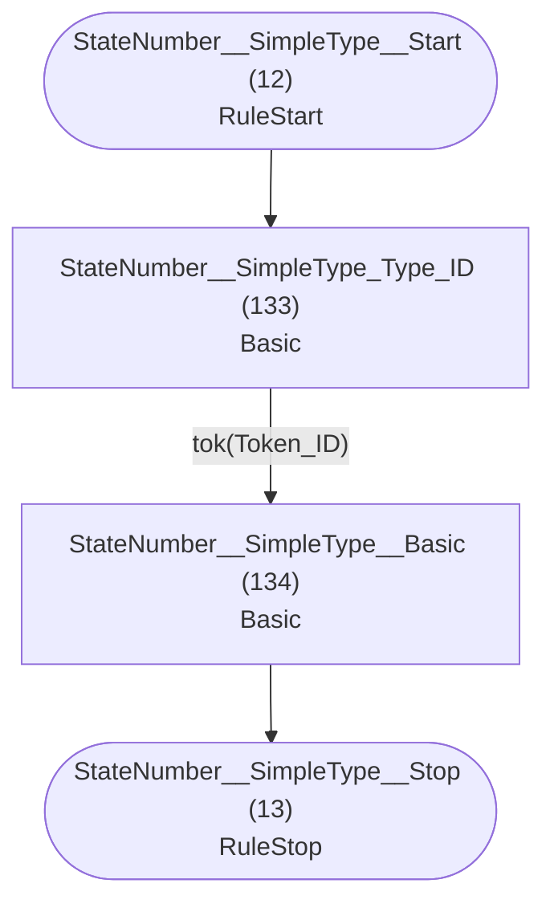
```mermaid
flowchart TD
    q12(["StateNumber__SimpleType__Start (12)<br/>RuleStart"])
    q13(["StateNumber__SimpleType__Stop (13)<br/>RuleStop"])
    q133["StateNumber__SimpleType_Type_ID (133)<br/>Basic<br/>"]
    q134["StateNumber__SimpleType__Basic (134)<br/>Basic<br/>"]

    q12 --> q133
    q133 -->|"tok(Token_ID)"| q134
    q134 --> q13
```

## PrimitiveType

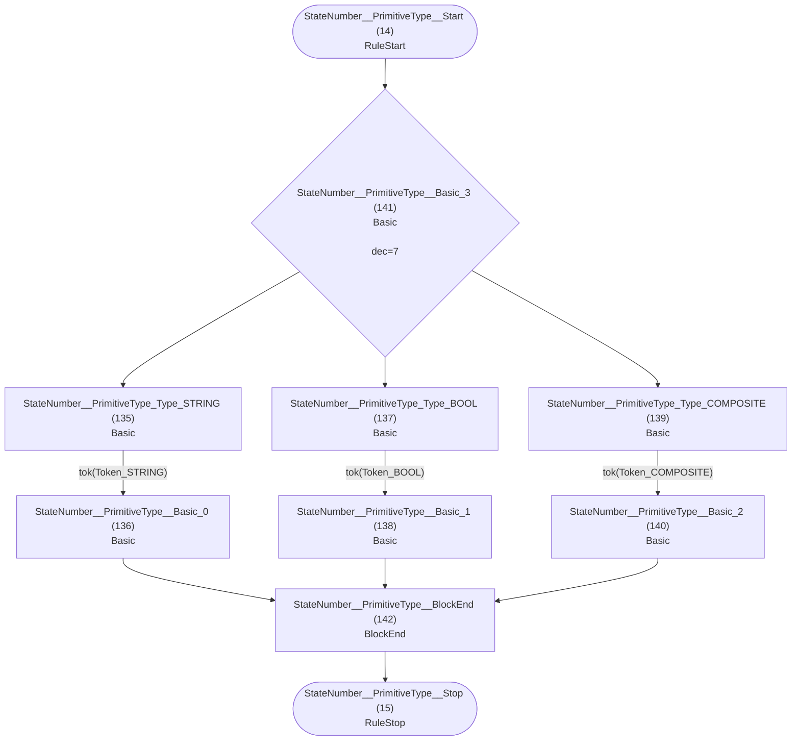
```mermaid
flowchart TD
    q14(["StateNumber__PrimitiveType__Start (14)<br/>RuleStart"])
    q15(["StateNumber__PrimitiveType__Stop (15)<br/>RuleStop"])
    q135["StateNumber__PrimitiveType_Type_STRING (135)<br/>Basic<br/>"]
    q136["StateNumber__PrimitiveType__Basic_0 (136)<br/>Basic<br/>"]
    q137["StateNumber__PrimitiveType_Type_BOOL (137)<br/>Basic<br/>"]
    q138["StateNumber__PrimitiveType__Basic_1 (138)<br/>Basic<br/>"]
    q139["StateNumber__PrimitiveType_Type_COMPOSITE (139)<br/>Basic<br/>"]
    q140["StateNumber__PrimitiveType__Basic_2 (140)<br/>Basic<br/>"]
    q141{"StateNumber__PrimitiveType__Basic_3 (141)<br/>Basic<br/><br/>dec=7"}
    q142["StateNumber__PrimitiveType__BlockEnd (142)<br/>BlockEnd<br/>"]

    q14 --> q141
    q135 -->|"tok(Token_STRING)"| q136
    q136 --> q142
    q137 -->|"tok(Token_BOOL)"| q138
    q138 --> q142
    q139 -->|"tok(Token_COMPOSITE)"| q140
    q140 --> q142
    q141 --> q135
    q141 --> q137
    q141 --> q139
    q142 --> q15
```

## ParserRule

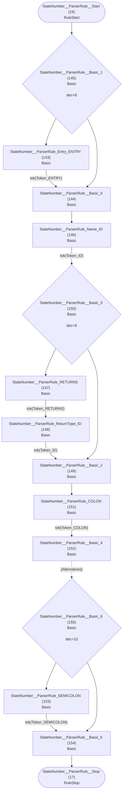
```mermaid
flowchart TD
    q16(["StateNumber__ParserRule__Start (16)<br/>RuleStart"])
    q17(["StateNumber__ParserRule__Stop (17)<br/>RuleStop"])
    q143["StateNumber__ParserRule_Entry_ENTRY (143)<br/>Basic<br/>"]
    q144["StateNumber__ParserRule__Basic_0 (144)<br/>Basic<br/>"]
    q145{"StateNumber__ParserRule__Basic_1 (145)<br/>Basic<br/><br/>dec=8"}
    q146["StateNumber__ParserRule_Name_ID (146)<br/>Basic<br/>"]
    q147["StateNumber__ParserRule_RETURNS (147)<br/>Basic<br/>"]
    q148["StateNumber__ParserRule_ReturnType_ID (148)<br/>Basic<br/>"]
    q149["StateNumber__ParserRule__Basic_2 (149)<br/>Basic<br/>"]
    q150{"StateNumber__ParserRule__Basic_3 (150)<br/>Basic<br/><br/>dec=9"}
    q151["StateNumber__ParserRule_COLON (151)<br/>Basic<br/>"]
    q152["StateNumber__ParserRule__Basic_4 (152)<br/>Basic<br/>"]
    q153["StateNumber__ParserRule_SEMICOLON (153)<br/>Basic<br/>"]
    q154["StateNumber__ParserRule__Basic_5 (154)<br/>Basic<br/>"]
    q155{"StateNumber__ParserRule__Basic_6 (155)<br/>Basic<br/><br/>dec=10"}

    q16 --> q145
    q143 -->|"tok(Token_ENTRY)"| q144
    q144 --> q146
    q145 --> q143
    q145 --> q144
    q146 -->|"tok(Token_ID)"| q150
    q147 -->|"tok(Token_RETURNS)"| q148
    q148 -->|"tok(Token_ID)"| q149
    q149 --> q151
    q150 --> q147
    q150 --> q149
    q151 -->|"tok(Token_COLON)"| q152
    q152 -.->|"[Alternatives]"| q155
    q153 -->|"tok(Token_SEMICOLON)"| q154
    q154 --> q17
    q155 --> q153
    q155 --> q154
```

## TokenDecl

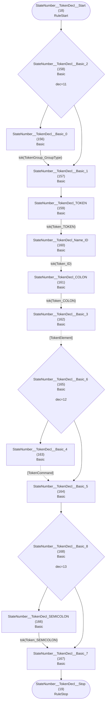
```mermaid
flowchart TD
    q18(["StateNumber__TokenDecl__Start (18)<br/>RuleStart"])
    q19(["StateNumber__TokenDecl__Stop (19)<br/>RuleStop"])
    q156["StateNumber__TokenDecl__Basic_0 (156)<br/>Basic<br/>"]
    q157["StateNumber__TokenDecl__Basic_1 (157)<br/>Basic<br/>"]
    q158{"StateNumber__TokenDecl__Basic_2 (158)<br/>Basic<br/><br/>dec=11"}
    q159["StateNumber__TokenDecl_TOKEN (159)<br/>Basic<br/>"]
    q160["StateNumber__TokenDecl_Name_ID (160)<br/>Basic<br/>"]
    q161["StateNumber__TokenDecl_COLON (161)<br/>Basic<br/>"]
    q162["StateNumber__TokenDecl__Basic_3 (162)<br/>Basic<br/>"]
    q163["StateNumber__TokenDecl__Basic_4 (163)<br/>Basic<br/>"]
    q164["StateNumber__TokenDecl__Basic_5 (164)<br/>Basic<br/>"]
    q165{"StateNumber__TokenDecl__Basic_6 (165)<br/>Basic<br/><br/>dec=12"}
    q166["StateNumber__TokenDecl_SEMICOLON (166)<br/>Basic<br/>"]
    q167["StateNumber__TokenDecl__Basic_7 (167)<br/>Basic<br/>"]
    q168{"StateNumber__TokenDecl__Basic_8 (168)<br/>Basic<br/><br/>dec=13"}

    q18 --> q158
    q156 -->|"tok(TokenGroup_GroupType)"| q157
    q157 --> q159
    q158 --> q156
    q158 --> q157
    q159 -->|"tok(Token_TOKEN)"| q160
    q160 -->|"tok(Token_ID)"| q161
    q161 -->|"tok(Token_COLON)"| q162
    q162 -.->|"[TokenElement]"| q165
    q163 -.->|"[TokenCommand]"| q164
    q164 --> q168
    q165 --> q163
    q165 --> q164
    q166 -->|"tok(Token_SEMICOLON)"| q167
    q167 --> q19
    q168 --> q166
    q168 --> q167
```

## TokenElement

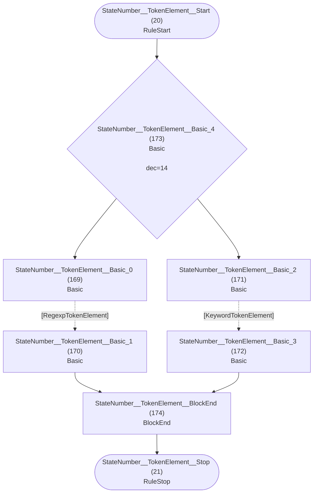
```mermaid
flowchart TD
    q20(["StateNumber__TokenElement__Start (20)<br/>RuleStart"])
    q21(["StateNumber__TokenElement__Stop (21)<br/>RuleStop"])
    q169["StateNumber__TokenElement__Basic_0 (169)<br/>Basic<br/>"]
    q170["StateNumber__TokenElement__Basic_1 (170)<br/>Basic<br/>"]
    q171["StateNumber__TokenElement__Basic_2 (171)<br/>Basic<br/>"]
    q172["StateNumber__TokenElement__Basic_3 (172)<br/>Basic<br/>"]
    q173{"StateNumber__TokenElement__Basic_4 (173)<br/>Basic<br/><br/>dec=14"}
    q174["StateNumber__TokenElement__BlockEnd (174)<br/>BlockEnd<br/>"]

    q20 --> q173
    q169 -.->|"[RegexpTokenElement]"| q170
    q170 --> q174
    q171 -.->|"[KeywordTokenElement]"| q172
    q172 --> q174
    q173 --> q169
    q173 --> q171
    q174 --> q21
```

## RegexpTokenElement

```mermaid
flowchart TD
    q22(["StateNumber__RegexpTokenElement__Start (22)<br/>RuleStart"])
    q23(["StateNumber__RegexpTokenElement__Stop (23)<br/>RuleStop"])
    q175["StateNumber__RegexpTokenElement_Regexp_RegexLiteral (175)<br/>Basic<br/>"]
    q176["StateNumber__RegexpTokenElement__Basic (176)<br/>Basic<br/>"]

    q22 --> q175
    q175 -->|"tok(Token_RegexLiteral)"| q176
    q176 --> q23
```

## KeywordTokenElement

```mermaid
flowchart TD
    q24(["StateNumber__KeywordTokenElement__Start (24)<br/>RuleStart"])
    q25(["StateNumber__KeywordTokenElement__Stop (25)<br/>RuleStop"])
    q177["StateNumber__KeywordTokenElement__Basic_0 (177)<br/>Basic<br/>"]
    q178["StateNumber__KeywordTokenElement__Basic_1 (178)<br/>Basic<br/>"]

    q24 --> q177
    q177 -.->|"[Keyword]"| q178
    q178 --> q25
```

## TokenCommand

```mermaid
flowchart TD
    q26(["StateNumber__TokenCommand__Start (26)<br/>RuleStart"])
    q27(["StateNumber__TokenCommand__Stop (27)<br/>RuleStop"])
    q179["StateNumber__TokenCommand_ARROW (179)<br/>Basic<br/>"]
    q180["StateNumber__TokenCommand_Type_PUSH (180)<br/>Basic<br/>"]
    q181["StateNumber__TokenCommand__Basic_0 (181)<br/>Basic<br/>"]
    q182["StateNumber__TokenCommand_Type_POP (182)<br/>Basic<br/>"]
    q183["StateNumber__TokenCommand__Basic_1 (183)<br/>Basic<br/>"]
    q184["StateNumber__TokenCommand_Type_MODE (184)<br/>Basic<br/>"]
    q185["StateNumber__TokenCommand__Basic_2 (185)<br/>Basic<br/>"]
    q186{"StateNumber__TokenCommand__Basic_3 (186)<br/>Basic<br/><br/>dec=15"}
    q187["StateNumber__TokenCommand__BlockEnd_0 (187)<br/>BlockEnd<br/>"]
    q188["StateNumber__TokenCommand_LEFTPAREN (188)<br/>Basic<br/>"]
    q189["StateNumber__TokenCommand_Mode_ID (189)<br/>Basic<br/>"]
    q190["StateNumber__TokenCommand__Basic_4 (190)<br/>Basic<br/>"]
    q191["StateNumber__TokenCommand_Default_DEFAULT (191)<br/>Basic<br/>"]
    q192["StateNumber__TokenCommand__Basic_5 (192)<br/>Basic<br/>"]
    q193{"StateNumber__TokenCommand__Basic_6 (193)<br/>Basic<br/><br/>dec=16"}
    q194["StateNumber__TokenCommand__BlockEnd_1 (194)<br/>BlockEnd<br/>"]
    q195["StateNumber__TokenCommand_RIGHTPAREN (195)<br/>Basic<br/>"]
    q196["StateNumber__TokenCommand__Basic_7 (196)<br/>Basic<br/>"]
    q197{"StateNumber__TokenCommand__Basic_8 (197)<br/>Basic<br/><br/>dec=17"}

    q26 --> q179
    q179 -->|"tok(Token_ARROW)"| q186
    q180 -->|"tok(Token_PUSH)"| q181
    q181 --> q187
    q182 -->|"tok(Token_POP)"| q183
    q183 --> q187
    q184 -->|"tok(Token_MODE)"| q185
    q185 --> q187
    q186 --> q180
    q186 --> q182
    q186 --> q184
    q187 --> q197
    q188 -->|"tok(Token_LEFTPAREN)"| q193
    q189 -->|"tok(Token_ID)"| q190
    q190 --> q194
    q191 -->|"tok(Token_DEFAULT)"| q192
    q192 --> q194
    q193 --> q189
    q193 --> q191
    q194 --> q195
    q195 -->|"tok(Token_RIGHTPAREN)"| q196
    q196 --> q27
    q197 --> q188
    q197 --> q196
```

## TokenGroup

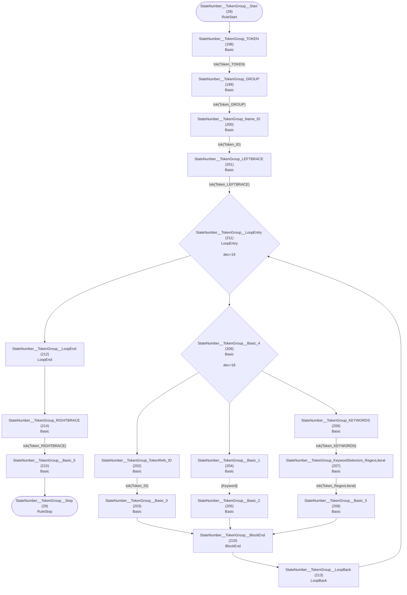
```mermaid
flowchart TD
    q28(["StateNumber__TokenGroup__Start (28)<br/>RuleStart"])
    q29(["StateNumber__TokenGroup__Stop (29)<br/>RuleStop"])
    q198["StateNumber__TokenGroup_TOKEN (198)<br/>Basic<br/>"]
    q199["StateNumber__TokenGroup_GROUP (199)<br/>Basic<br/>"]
    q200["StateNumber__TokenGroup_Name_ID (200)<br/>Basic<br/>"]
    q201["StateNumber__TokenGroup_LEFTBRACE (201)<br/>Basic<br/>"]
    q202["StateNumber__TokenGroup_TokenRefs_ID (202)<br/>Basic<br/>"]
    q203["StateNumber__TokenGroup__Basic_0 (203)<br/>Basic<br/>"]
    q204["StateNumber__TokenGroup__Basic_1 (204)<br/>Basic<br/>"]
    q205["StateNumber__TokenGroup__Basic_2 (205)<br/>Basic<br/>"]
    q206["StateNumber__TokenGroup_KEYWORDS (206)<br/>Basic<br/>"]
    q207["StateNumber__TokenGroup_KeywordSelectors_RegexLiteral (207)<br/>Basic<br/>"]
    q208["StateNumber__TokenGroup__Basic_3 (208)<br/>Basic<br/>"]
    q209{"StateNumber__TokenGroup__Basic_4 (209)<br/>Basic<br/><br/>dec=18"}
    q210["StateNumber__TokenGroup__BlockEnd (210)<br/>BlockEnd<br/>"]
    q211{"StateNumber__TokenGroup__LoopEntry (211)<br/>LoopEntry<br/><br/>dec=19"}
    q212["StateNumber__TokenGroup__LoopEnd (212)<br/>LoopEnd<br/>"]
    q213["StateNumber__TokenGroup__LoopBack (213)<br/>LoopBack<br/>"]
    q214["StateNumber__TokenGroup_RIGHTBRACE (214)<br/>Basic<br/>"]
    q215["StateNumber__TokenGroup__Basic_5 (215)<br/>Basic<br/>"]

    q28 --> q198
    q198 -->|"tok(Token_TOKEN)"| q199
    q199 -->|"tok(Token_GROUP)"| q200
    q200 -->|"tok(Token_ID)"| q201
    q201 -->|"tok(Token_LEFTBRACE)"| q211
    q202 -->|"tok(Token_ID)"| q203
    q203 --> q210
    q204 -.->|"[Keyword]"| q205
    q205 --> q210
    q206 -->|"tok(Token_KEYWORDS)"| q207
    q207 -->|"tok(Token_RegexLiteral)"| q208
    q208 --> q210
    q209 --> q202
    q209 --> q204
    q209 --> q206
    q210 --> q213
    q211 --> q209
    q211 --> q212
    q212 --> q214
    q213 --> q211
    q214 -->|"tok(Token_RIGHTBRACE)"| q215
    q215 --> q29
```

## TokenMode

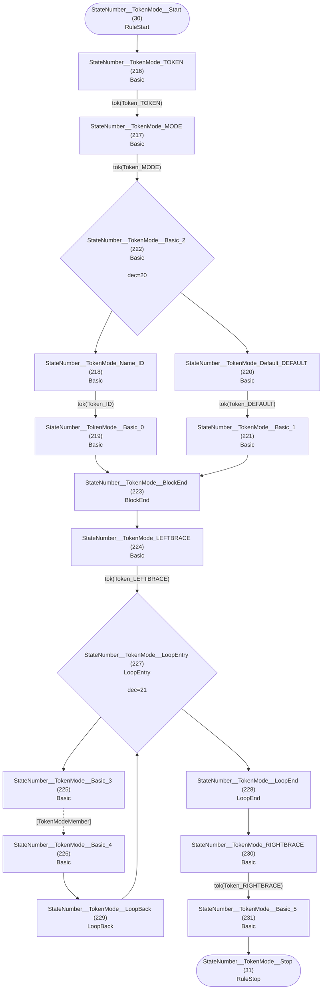
```mermaid
flowchart TD
    q30(["StateNumber__TokenMode__Start (30)<br/>RuleStart"])
    q31(["StateNumber__TokenMode__Stop (31)<br/>RuleStop"])
    q216["StateNumber__TokenMode_TOKEN (216)<br/>Basic<br/>"]
    q217["StateNumber__TokenMode_MODE (217)<br/>Basic<br/>"]
    q218["StateNumber__TokenMode_Name_ID (218)<br/>Basic<br/>"]
    q219["StateNumber__TokenMode__Basic_0 (219)<br/>Basic<br/>"]
    q220["StateNumber__TokenMode_Default_DEFAULT (220)<br/>Basic<br/>"]
    q221["StateNumber__TokenMode__Basic_1 (221)<br/>Basic<br/>"]
    q222{"StateNumber__TokenMode__Basic_2 (222)<br/>Basic<br/><br/>dec=20"}
    q223["StateNumber__TokenMode__BlockEnd (223)<br/>BlockEnd<br/>"]
    q224["StateNumber__TokenMode_LEFTBRACE (224)<br/>Basic<br/>"]
    q225["StateNumber__TokenMode__Basic_3 (225)<br/>Basic<br/>"]
    q226["StateNumber__TokenMode__Basic_4 (226)<br/>Basic<br/>"]
    q227{"StateNumber__TokenMode__LoopEntry (227)<br/>LoopEntry<br/><br/>dec=21"}
    q228["StateNumber__TokenMode__LoopEnd (228)<br/>LoopEnd<br/>"]
    q229["StateNumber__TokenMode__LoopBack (229)<br/>LoopBack<br/>"]
    q230["StateNumber__TokenMode_RIGHTBRACE (230)<br/>Basic<br/>"]
    q231["StateNumber__TokenMode__Basic_5 (231)<br/>Basic<br/>"]

    q30 --> q216
    q216 -->|"tok(Token_TOKEN)"| q217
    q217 -->|"tok(Token_MODE)"| q222
    q218 -->|"tok(Token_ID)"| q219
    q219 --> q223
    q220 -->|"tok(Token_DEFAULT)"| q221
    q221 --> q223
    q222 --> q218
    q222 --> q220
    q223 --> q224
    q224 -->|"tok(Token_LEFTBRACE)"| q227
    q225 -.->|"[TokenModeMember]"| q226
    q226 --> q229
    q227 --> q225
    q227 --> q228
    q228 --> q230
    q229 --> q227
    q230 -->|"tok(Token_RIGHTBRACE)"| q231
    q231 --> q31
```

## TokenModeMember

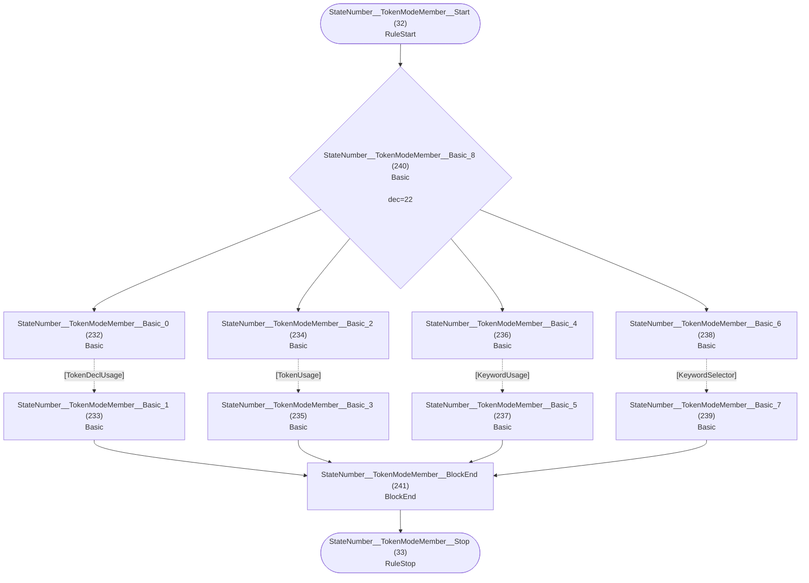
```mermaid
flowchart TD
    q32(["StateNumber__TokenModeMember__Start (32)<br/>RuleStart"])
    q33(["StateNumber__TokenModeMember__Stop (33)<br/>RuleStop"])
    q232["StateNumber__TokenModeMember__Basic_0 (232)<br/>Basic<br/>"]
    q233["StateNumber__TokenModeMember__Basic_1 (233)<br/>Basic<br/>"]
    q234["StateNumber__TokenModeMember__Basic_2 (234)<br/>Basic<br/>"]
    q235["StateNumber__TokenModeMember__Basic_3 (235)<br/>Basic<br/>"]
    q236["StateNumber__TokenModeMember__Basic_4 (236)<br/>Basic<br/>"]
    q237["StateNumber__TokenModeMember__Basic_5 (237)<br/>Basic<br/>"]
    q238["StateNumber__TokenModeMember__Basic_6 (238)<br/>Basic<br/>"]
    q239["StateNumber__TokenModeMember__Basic_7 (239)<br/>Basic<br/>"]
    q240{"StateNumber__TokenModeMember__Basic_8 (240)<br/>Basic<br/><br/>dec=22"}
    q241["StateNumber__TokenModeMember__BlockEnd (241)<br/>BlockEnd<br/>"]

    q32 --> q240
    q232 -.->|"[TokenDeclUsage]"| q233
    q233 --> q241
    q234 -.->|"[TokenUsage]"| q235
    q235 --> q241
    q236 -.->|"[KeywordUsage]"| q237
    q237 --> q241
    q238 -.->|"[KeywordSelector]"| q239
    q239 --> q241
    q240 --> q232
    q240 --> q234
    q240 --> q236
    q240 --> q238
    q241 --> q33
```

## TokenDeclUsage

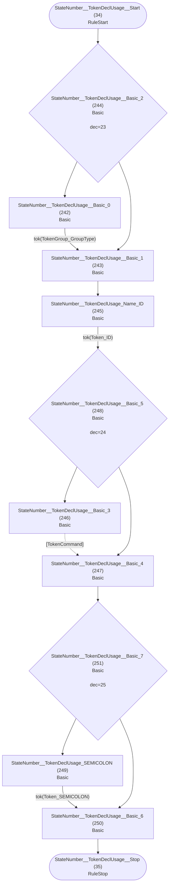
```mermaid
flowchart TD
    q34(["StateNumber__TokenDeclUsage__Start (34)<br/>RuleStart"])
    q35(["StateNumber__TokenDeclUsage__Stop (35)<br/>RuleStop"])
    q242["StateNumber__TokenDeclUsage__Basic_0 (242)<br/>Basic<br/>"]
    q243["StateNumber__TokenDeclUsage__Basic_1 (243)<br/>Basic<br/>"]
    q244{"StateNumber__TokenDeclUsage__Basic_2 (244)<br/>Basic<br/><br/>dec=23"}
    q245["StateNumber__TokenDeclUsage_Name_ID (245)<br/>Basic<br/>"]
    q246["StateNumber__TokenDeclUsage__Basic_3 (246)<br/>Basic<br/>"]
    q247["StateNumber__TokenDeclUsage__Basic_4 (247)<br/>Basic<br/>"]
    q248{"StateNumber__TokenDeclUsage__Basic_5 (248)<br/>Basic<br/><br/>dec=24"}
    q249["StateNumber__TokenDeclUsage_SEMICOLON (249)<br/>Basic<br/>"]
    q250["StateNumber__TokenDeclUsage__Basic_6 (250)<br/>Basic<br/>"]
    q251{"StateNumber__TokenDeclUsage__Basic_7 (251)<br/>Basic<br/><br/>dec=25"}

    q34 --> q244
    q242 -->|"tok(TokenGroup_GroupType)"| q243
    q243 --> q245
    q244 --> q242
    q244 --> q243
    q245 -->|"tok(Token_ID)"| q248
    q246 -.->|"[TokenCommand]"| q247
    q247 --> q251
    q248 --> q246
    q248 --> q247
    q249 -->|"tok(Token_SEMICOLON)"| q250
    q250 --> q35
    q251 --> q249
    q251 --> q250
```

## TokenUsage

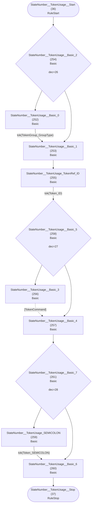
```mermaid
flowchart TD
    q36(["StateNumber__TokenUsage__Start (36)<br/>RuleStart"])
    q37(["StateNumber__TokenUsage__Stop (37)<br/>RuleStop"])
    q252["StateNumber__TokenUsage__Basic_0 (252)<br/>Basic<br/>"]
    q253["StateNumber__TokenUsage__Basic_1 (253)<br/>Basic<br/>"]
    q254{"StateNumber__TokenUsage__Basic_2 (254)<br/>Basic<br/><br/>dec=26"}
    q255["StateNumber__TokenUsage_TokenRef_ID (255)<br/>Basic<br/>"]
    q256["StateNumber__TokenUsage__Basic_3 (256)<br/>Basic<br/>"]
    q257["StateNumber__TokenUsage__Basic_4 (257)<br/>Basic<br/>"]
    q258{"StateNumber__TokenUsage__Basic_5 (258)<br/>Basic<br/><br/>dec=27"}
    q259["StateNumber__TokenUsage_SEMICOLON (259)<br/>Basic<br/>"]
    q260["StateNumber__TokenUsage__Basic_6 (260)<br/>Basic<br/>"]
    q261{"StateNumber__TokenUsage__Basic_7 (261)<br/>Basic<br/><br/>dec=28"}

    q36 --> q254
    q252 -->|"tok(TokenGroup_GroupType)"| q253
    q253 --> q255
    q254 --> q252
    q254 --> q253
    q255 -->|"tok(Token_ID)"| q258
    q256 -.->|"[TokenCommand]"| q257
    q257 --> q261
    q258 --> q256
    q258 --> q257
    q259 -->|"tok(Token_SEMICOLON)"| q260
    q260 --> q37
    q261 --> q259
    q261 --> q260
```

## KeywordUsage

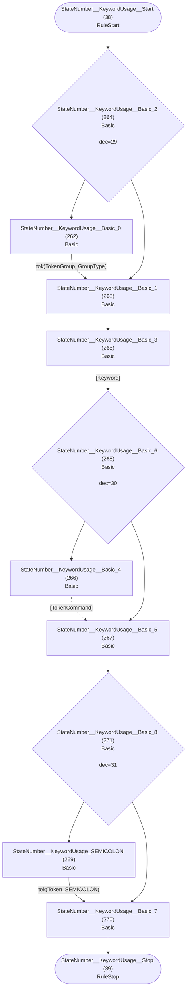
```mermaid
flowchart TD
    q38(["StateNumber__KeywordUsage__Start (38)<br/>RuleStart"])
    q39(["StateNumber__KeywordUsage__Stop (39)<br/>RuleStop"])
    q262["StateNumber__KeywordUsage__Basic_0 (262)<br/>Basic<br/>"]
    q263["StateNumber__KeywordUsage__Basic_1 (263)<br/>Basic<br/>"]
    q264{"StateNumber__KeywordUsage__Basic_2 (264)<br/>Basic<br/><br/>dec=29"}
    q265["StateNumber__KeywordUsage__Basic_3 (265)<br/>Basic<br/>"]
    q266["StateNumber__KeywordUsage__Basic_4 (266)<br/>Basic<br/>"]
    q267["StateNumber__KeywordUsage__Basic_5 (267)<br/>Basic<br/>"]
    q268{"StateNumber__KeywordUsage__Basic_6 (268)<br/>Basic<br/><br/>dec=30"}
    q269["StateNumber__KeywordUsage_SEMICOLON (269)<br/>Basic<br/>"]
    q270["StateNumber__KeywordUsage__Basic_7 (270)<br/>Basic<br/>"]
    q271{"StateNumber__KeywordUsage__Basic_8 (271)<br/>Basic<br/><br/>dec=31"}

    q38 --> q264
    q262 -->|"tok(TokenGroup_GroupType)"| q263
    q263 --> q265
    q264 --> q262
    q264 --> q263
    q265 -.->|"[Keyword]"| q268
    q266 -.->|"[TokenCommand]"| q267
    q267 --> q271
    q268 --> q266
    q268 --> q267
    q269 -->|"tok(Token_SEMICOLON)"| q270
    q270 --> q39
    q271 --> q269
    q271 --> q270
```

## KeywordSelector

```mermaid
flowchart TD
    q40(["StateNumber__KeywordSelector__Start (40)<br/>RuleStart"])
    q41(["StateNumber__KeywordSelector__Stop (41)<br/>RuleStop"])
    q272["StateNumber__KeywordSelector_KEYWORDS (272)<br/>Basic<br/>"]
    q273["StateNumber__KeywordSelector_Selector_RegexLiteral (273)<br/>Basic<br/>"]
    q274["StateNumber__KeywordSelector_SEMICOLON (274)<br/>Basic<br/>"]
    q275["StateNumber__KeywordSelector__Basic_0 (275)<br/>Basic<br/>"]
    q276{"StateNumber__KeywordSelector__Basic_1 (276)<br/>Basic<br/><br/>dec=32"}

    q40 --> q272
    q272 -->|"tok(Token_KEYWORDS)"| q273
    q273 -->|"tok(Token_RegexLiteral)"| q276
    q274 -->|"tok(Token_SEMICOLON)"| q275
    q275 --> q41
    q276 --> q274
    q276 --> q275
```

## Alternatives

```mermaid
flowchart TD
    q42(["StateNumber__Alternatives__Start (42)<br/>RuleStart"])
    q43(["StateNumber__Alternatives__Stop (43)<br/>RuleStop"])
    q277["StateNumber__Alternatives__Basic_0 (277)<br/>Basic<br/>"]
    q278["StateNumber__Alternatives_PIPE (278)<br/>Basic<br/>"]
    q279["StateNumber__Alternatives__Basic_1 (279)<br/>Basic<br/>"]
    q280["StateNumber__Alternatives__Basic_2 (280)<br/>Basic<br/>"]
    q281{"StateNumber__Alternatives__LoopBack (281)<br/>LoopBack<br/><br/>dec=33"}
    q282["StateNumber__Alternatives__LoopEnd (282)<br/>LoopEnd<br/>"]
    q283{"StateNumber__Alternatives__Basic_3 (283)<br/>Basic<br/><br/>dec=34"}

    q42 --> q277
    q277 -.->|"[Group]"| q283
    q278 -->|"tok(Token_PIPE)"| q279
    q279 -.->|"[Group]"| q280
    q280 --> q281
    q281 --> q278
    q281 --> q282
    q282 --> q43
    q283 --> q278
    q283 --> q282
```

## Group

```mermaid
flowchart TD
    q44(["StateNumber__Group__Start (44)<br/>RuleStart"])
    q45(["StateNumber__Group__Stop (45)<br/>RuleStop"])
    q284["StateNumber__Group__Basic_0 (284)<br/>Basic<br/>"]
    q285["StateNumber__Group__Basic_1 (285)<br/>Basic<br/>"]
    q286["StateNumber__Group__Basic_2 (286)<br/>Basic<br/>"]
    q287{"StateNumber__Group__LoopBack (287)<br/>LoopBack<br/><br/>dec=35"}
    q288["StateNumber__Group__LoopEnd (288)<br/>LoopEnd<br/>"]
    q289{"StateNumber__Group__Basic_3 (289)<br/>Basic<br/><br/>dec=36"}

    q44 --> q284
    q284 -.->|"[Element]"| q289
    q285 -.->|"[Element]"| q286
    q286 --> q287
    q287 --> q285
    q287 --> q288
    q288 --> q45
    q289 --> q285
    q289 --> q288
```

## Element

```mermaid
flowchart TD
    q46(["StateNumber__Element__Start (46)<br/>RuleStart"])
    q47(["StateNumber__Element__Stop (47)<br/>RuleStop"])
    q290["StateNumber__Element__Basic_0 (290)<br/>Basic<br/>"]
    q291["StateNumber__Element__Basic_1 (291)<br/>Basic<br/>"]
    q292["StateNumber__Element__Basic_2 (292)<br/>Basic<br/>"]
    q293["StateNumber__Element__Basic_3 (293)<br/>Basic<br/>"]
    q294["StateNumber__Element__Basic_4 (294)<br/>Basic<br/>"]
    q295["StateNumber__Element__Basic_5 (295)<br/>Basic<br/>"]
    q296["StateNumber__Element__Basic_6 (296)<br/>Basic<br/>"]
    q297["StateNumber__Element__Basic_7 (297)<br/>Basic<br/>"]
    q298["StateNumber__Element_LEFTPAREN (298)<br/>Basic<br/>"]
    q299["StateNumber__Element__Basic_8 (299)<br/>Basic<br/>"]
    q300["StateNumber__Element_RIGHTPAREN (300)<br/>Basic<br/>"]
    q301["StateNumber__Element__Basic_9 (301)<br/>Basic<br/>"]
    q302{"StateNumber__Element__Basic_10 (302)<br/>Basic<br/><br/>dec=37"}
    q303["StateNumber__Element__BlockEnd (303)<br/>BlockEnd<br/>"]
    q304["StateNumber__Element__Basic_11 (304)<br/>Basic<br/>"]
    q305["StateNumber__Element__Basic_12 (305)<br/>Basic<br/>"]
    q306{"StateNumber__Element__Basic_13 (306)<br/>Basic<br/><br/>dec=38"}

    q46 --> q302
    q290 -.->|"[Keyword]"| q291
    q291 --> q303
    q292 -.->|"[Assignment]"| q293
    q293 --> q303
    q294 -.->|"[RuleCall]"| q295
    q295 --> q303
    q296 -.->|"[Action]"| q297
    q297 --> q303
    q298 -->|"tok(Token_LEFTPAREN)"| q299
    q299 -.->|"[Alternatives]"| q300
    q300 -->|"tok(Token_RIGHTPAREN)"| q301
    q301 --> q303
    q302 --> q290
    q302 --> q292
    q302 --> q294
    q302 --> q296
    q302 --> q298
    q303 --> q306
    q304 -->|"tok(TokenGroup_Cardinality)"| q305
    q305 --> q47
    q306 --> q304
    q306 --> q305
```

## Keyword

```mermaid
flowchart TD
    q48(["StateNumber__Keyword__Start (48)<br/>RuleStart"])
    q49(["StateNumber__Keyword__Stop (49)<br/>RuleStop"])
    q307["StateNumber__Keyword_Value_StringLiteral (307)<br/>Basic<br/>"]
    q308["StateNumber__Keyword__Basic (308)<br/>Basic<br/>"]

    q48 --> q307
    q307 -->|"tok(Token_StringLiteral)"| q308
    q308 --> q49
```

## Assignment

```mermaid
flowchart TD
    q50(["StateNumber__Assignment__Start (50)<br/>RuleStart"])
    q51(["StateNumber__Assignment__Stop (51)<br/>RuleStop"])
    q309["StateNumber__Assignment_Property_ID (309)<br/>Basic<br/>"]
    q310["StateNumber__Assignment_Operator_PLUS_EQUALS (310)<br/>Basic<br/>"]
    q311["StateNumber__Assignment__Basic_0 (311)<br/>Basic<br/>"]
    q312["StateNumber__Assignment_Operator_EQUALS (312)<br/>Basic<br/>"]
    q313["StateNumber__Assignment__Basic_1 (313)<br/>Basic<br/>"]
    q314["StateNumber__Assignment_Operator_QUESTION_EQUALS (314)<br/>Basic<br/>"]
    q315["StateNumber__Assignment__Basic_2 (315)<br/>Basic<br/>"]
    q316{"StateNumber__Assignment__Basic_3 (316)<br/>Basic<br/><br/>dec=39"}
    q317["StateNumber__Assignment__BlockEnd (317)<br/>BlockEnd<br/>"]
    q318["StateNumber__Assignment__Basic_4 (318)<br/>Basic<br/>"]
    q319["StateNumber__Assignment__Basic_5 (319)<br/>Basic<br/>"]

    q50 --> q309
    q309 -->|"tok(Token_ID)"| q316
    q310 -->|"tok(Token_PLUS_EQUALS)"| q311
    q311 --> q317
    q312 -->|"tok(Token_EQUALS)"| q313
    q313 --> q317
    q314 -->|"tok(Token_QUESTION_EQUALS)"| q315
    q315 --> q317
    q316 --> q310
    q316 --> q312
    q316 --> q314
    q317 --> q318
    q318 -.->|"[Assignable]"| q319
    q319 --> q51
```

## Assignable

```mermaid
flowchart TD
    q52(["StateNumber__Assignable__Start (52)<br/>RuleStart"])
    q53(["StateNumber__Assignable__Stop (53)<br/>RuleStop"])
    q320["StateNumber__Assignable__Basic_0 (320)<br/>Basic<br/>"]
    q321["StateNumber__Assignable__Basic_1 (321)<br/>Basic<br/>"]
    q322["StateNumber__Assignable__Basic_2 (322)<br/>Basic<br/>"]
    q323["StateNumber__Assignable__Basic_3 (323)<br/>Basic<br/>"]
    q324["StateNumber__Assignable__Basic_4 (324)<br/>Basic<br/>"]
    q325["StateNumber__Assignable__Basic_5 (325)<br/>Basic<br/>"]
    q326["StateNumber__Assignable_LEFTPAREN (326)<br/>Basic<br/>"]
    q327["StateNumber__Assignable__Basic_6 (327)<br/>Basic<br/>"]
    q328["StateNumber__Assignable_RIGHTPAREN (328)<br/>Basic<br/>"]
    q329["StateNumber__Assignable__Basic_7 (329)<br/>Basic<br/>"]
    q330{"StateNumber__Assignable__Basic_8 (330)<br/>Basic<br/><br/>dec=40"}
    q331["StateNumber__Assignable__BlockEnd (331)<br/>BlockEnd<br/>"]

    q52 --> q330
    q320 -.->|"[Keyword]"| q321
    q321 --> q331
    q322 -.->|"[RuleCall]"| q323
    q323 --> q331
    q324 -.->|"[CrossRef]"| q325
    q325 --> q331
    q326 -->|"tok(Token_LEFTPAREN)"| q327
    q327 -.->|"[AssignableAlternatives]"| q328
    q328 -->|"tok(Token_RIGHTPAREN)"| q329
    q329 --> q331
    q330 --> q320
    q330 --> q322
    q330 --> q324
    q330 --> q326
    q331 --> q53
```

## AssignableWithoutAlts

```mermaid
flowchart TD
    q54(["StateNumber__AssignableWithoutAlts__Start (54)<br/>RuleStart"])
    q55(["StateNumber__AssignableWithoutAlts__Stop (55)<br/>RuleStop"])
    q332["StateNumber__AssignableWithoutAlts__Basic_0 (332)<br/>Basic<br/>"]
    q333["StateNumber__AssignableWithoutAlts__Basic_1 (333)<br/>Basic<br/>"]
    q334["StateNumber__AssignableWithoutAlts__Basic_2 (334)<br/>Basic<br/>"]
    q335["StateNumber__AssignableWithoutAlts__Basic_3 (335)<br/>Basic<br/>"]
    q336["StateNumber__AssignableWithoutAlts__Basic_4 (336)<br/>Basic<br/>"]
    q337["StateNumber__AssignableWithoutAlts__Basic_5 (337)<br/>Basic<br/>"]
    q338{"StateNumber__AssignableWithoutAlts__Basic_6 (338)<br/>Basic<br/><br/>dec=41"}
    q339["StateNumber__AssignableWithoutAlts__BlockEnd (339)<br/>BlockEnd<br/>"]

    q54 --> q338
    q332 -.->|"[Keyword]"| q333
    q333 --> q339
    q334 -.->|"[RuleCall]"| q335
    q335 --> q339
    q336 -.->|"[CrossRef]"| q337
    q337 --> q339
    q338 --> q332
    q338 --> q334
    q338 --> q336
    q339 --> q55
```

## AssignableAlternatives

```mermaid
flowchart TD
    q56(["StateNumber__AssignableAlternatives__Start (56)<br/>RuleStart"])
    q57(["StateNumber__AssignableAlternatives__Stop (57)<br/>RuleStop"])
    q340["StateNumber__AssignableAlternatives__Basic_0 (340)<br/>Basic<br/>"]
    q341["StateNumber__AssignableAlternatives_PIPE (341)<br/>Basic<br/>"]
    q342["StateNumber__AssignableAlternatives__Basic_1 (342)<br/>Basic<br/>"]
    q343["StateNumber__AssignableAlternatives__Basic_2 (343)<br/>Basic<br/>"]
    q344{"StateNumber__AssignableAlternatives__LoopBack (344)<br/>LoopBack<br/><br/>dec=42"}
    q345["StateNumber__AssignableAlternatives__LoopEnd (345)<br/>LoopEnd<br/>"]
    q346{"StateNumber__AssignableAlternatives__Basic_3 (346)<br/>Basic<br/><br/>dec=43"}

    q56 --> q340
    q340 -.->|"[AssignableWithoutAlts]"| q346
    q341 -->|"tok(Token_PIPE)"| q342
    q342 -.->|"[AssignableWithoutAlts]"| q343
    q343 --> q344
    q344 --> q341
    q344 --> q345
    q345 --> q57
    q346 --> q341
    q346 --> q345
```

## CrossRef

```mermaid
flowchart TD
    q58(["StateNumber__CrossRef__Start (58)<br/>RuleStart"])
    q59(["StateNumber__CrossRef__Stop (59)<br/>RuleStop"])
    q347["StateNumber__CrossRef_LEFTBRACKET (347)<br/>Basic<br/>"]
    q348["StateNumber__CrossRef_Type_ID (348)<br/>Basic<br/>"]
    q349["StateNumber__CrossRef_COLON (349)<br/>Basic<br/>"]
    q350["StateNumber__CrossRef__Basic_0 (350)<br/>Basic<br/>"]
    q351["StateNumber__CrossRef__Basic_1 (351)<br/>Basic<br/>"]
    q352{"StateNumber__CrossRef__Basic_2 (352)<br/>Basic<br/><br/>dec=44"}
    q353["StateNumber__CrossRef_RIGHTBRACKET (353)<br/>Basic<br/>"]
    q354["StateNumber__CrossRef__Basic_3 (354)<br/>Basic<br/>"]

    q58 --> q347
    q347 -->|"tok(Token_LEFTBRACKET)"| q348
    q348 -->|"tok(Token_ID)"| q352
    q349 -->|"tok(Token_COLON)"| q350
    q350 -.->|"[RuleCall]"| q351
    q351 --> q353
    q352 --> q349
    q352 --> q351
    q353 -->|"tok(Token_RIGHTBRACKET)"| q354
    q354 --> q59
```

## RuleCall

```mermaid
flowchart TD
    q60(["StateNumber__RuleCall__Start (60)<br/>RuleStart"])
    q61(["StateNumber__RuleCall__Stop (61)<br/>RuleStop"])
    q355["StateNumber__RuleCall_Rule_ID (355)<br/>Basic<br/>"]
    q356["StateNumber__RuleCall__Basic (356)<br/>Basic<br/>"]

    q60 --> q355
    q355 -->|"tok(Token_ID)"| q356
    q356 --> q61
```

## Action

```mermaid
flowchart TD
    q62(["StateNumber__Action__Start (62)<br/>RuleStart"])
    q63(["StateNumber__Action__Stop (63)<br/>RuleStop"])
    q357["StateNumber__Action_LEFTBRACE (357)<br/>Basic<br/>"]
    q358["StateNumber__Action_Type_ID (358)<br/>Basic<br/>"]
    q359["StateNumber__Action_DOT (359)<br/>Basic<br/>"]
    q360["StateNumber__Action_Property_ID (360)<br/>Basic<br/>"]
    q361["StateNumber__Action_Operator_PLUS_EQUALS (361)<br/>Basic<br/>"]
    q362["StateNumber__Action__Basic_0 (362)<br/>Basic<br/>"]
    q363["StateNumber__Action_Operator_EQUALS (363)<br/>Basic<br/>"]
    q364["StateNumber__Action__Basic_1 (364)<br/>Basic<br/>"]
    q365{"StateNumber__Action__Basic_2 (365)<br/>Basic<br/><br/>dec=45"}
    q366["StateNumber__Action__BlockEnd (366)<br/>BlockEnd<br/>"]
    q367["StateNumber__Action_CURRENT (367)<br/>Basic<br/>"]
    q368["StateNumber__Action__Basic_3 (368)<br/>Basic<br/>"]
    q369{"StateNumber__Action__Basic_4 (369)<br/>Basic<br/><br/>dec=46"}
    q370["StateNumber__Action_RIGHTBRACE (370)<br/>Basic<br/>"]
    q371["StateNumber__Action__Basic_5 (371)<br/>Basic<br/>"]

    q62 --> q357
    q357 -->|"tok(Token_LEFTBRACE)"| q358
    q358 -->|"tok(Token_ID)"| q369
    q359 -->|"tok(Token_DOT)"| q360
    q360 -->|"tok(Token_ID)"| q365
    q361 -->|"tok(Token_PLUS_EQUALS)"| q362
    q362 --> q366
    q363 -->|"tok(Token_EQUALS)"| q364
    q364 --> q366
    q365 --> q361
    q365 --> q363
    q366 --> q367
    q367 -->|"tok(Token_CURRENT)"| q368
    q368 --> q370
    q369 --> q359
    q369 --> q368
    q370 -->|"tok(Token_RIGHTBRACE)"| q371
    q371 --> q63
```

## CompositeRule

```mermaid
flowchart TD
    q64(["StateNumber__CompositeRule__Start (64)<br/>RuleStart"])
    q65(["StateNumber__CompositeRule__Stop (65)<br/>RuleStop"])
    q372["StateNumber__CompositeRule_COMPOSITE (372)<br/>Basic<br/>"]
    q373["StateNumber__CompositeRule_Name_ID (373)<br/>Basic<br/>"]
    q374["StateNumber__CompositeRule_COLON (374)<br/>Basic<br/>"]
    q375["StateNumber__CompositeRule__Basic_0 (375)<br/>Basic<br/>"]
    q376["StateNumber__CompositeRule_SEMICOLON (376)<br/>Basic<br/>"]
    q377["StateNumber__CompositeRule__Basic_1 (377)<br/>Basic<br/>"]
    q378{"StateNumber__CompositeRule__Basic_2 (378)<br/>Basic<br/><br/>dec=47"}

    q64 --> q372
    q372 -->|"tok(Token_COMPOSITE)"| q373
    q373 -->|"tok(Token_ID)"| q374
    q374 -->|"tok(Token_COLON)"| q375
    q375 -.->|"[CompositeAlternatives]"| q378
    q376 -->|"tok(Token_SEMICOLON)"| q377
    q377 --> q65
    q378 --> q376
    q378 --> q377
```

## CompositeAlternatives

```mermaid
flowchart TD
    q66(["StateNumber__CompositeAlternatives__Start (66)<br/>RuleStart"])
    q67(["StateNumber__CompositeAlternatives__Stop (67)<br/>RuleStop"])
    q379["StateNumber__CompositeAlternatives__Basic_0 (379)<br/>Basic<br/>"]
    q380["StateNumber__CompositeAlternatives_PIPE (380)<br/>Basic<br/>"]
    q381["StateNumber__CompositeAlternatives__Basic_1 (381)<br/>Basic<br/>"]
    q382["StateNumber__CompositeAlternatives__Basic_2 (382)<br/>Basic<br/>"]
    q383{"StateNumber__CompositeAlternatives__LoopBack (383)<br/>LoopBack<br/><br/>dec=48"}
    q384["StateNumber__CompositeAlternatives__LoopEnd (384)<br/>LoopEnd<br/>"]
    q385{"StateNumber__CompositeAlternatives__Basic_3 (385)<br/>Basic<br/><br/>dec=49"}

    q66 --> q379
    q379 -.->|"[CompositeGroup]"| q385
    q380 -->|"tok(Token_PIPE)"| q381
    q381 -.->|"[CompositeGroup]"| q382
    q382 --> q383
    q383 --> q380
    q383 --> q384
    q384 --> q67
    q385 --> q380
    q385 --> q384
```

## CompositeGroup

```mermaid
flowchart TD
    q68(["StateNumber__CompositeGroup__Start (68)<br/>RuleStart"])
    q69(["StateNumber__CompositeGroup__Stop (69)<br/>RuleStop"])
    q386["StateNumber__CompositeGroup__Basic_0 (386)<br/>Basic<br/>"]
    q387["StateNumber__CompositeGroup__Basic_1 (387)<br/>Basic<br/>"]
    q388["StateNumber__CompositeGroup__Basic_2 (388)<br/>Basic<br/>"]
    q389{"StateNumber__CompositeGroup__LoopBack (389)<br/>LoopBack<br/><br/>dec=50"}
    q390["StateNumber__CompositeGroup__LoopEnd (390)<br/>LoopEnd<br/>"]
    q391{"StateNumber__CompositeGroup__Basic_3 (391)<br/>Basic<br/><br/>dec=51"}

    q68 --> q386
    q386 -.->|"[CompositeElement]"| q391
    q387 -.->|"[CompositeElement]"| q388
    q388 --> q389
    q389 --> q387
    q389 --> q390
    q390 --> q69
    q391 --> q387
    q391 --> q390
```

## CompositeElement

```mermaid
flowchart TD
    q70(["StateNumber__CompositeElement__Start (70)<br/>RuleStart"])
    q71(["StateNumber__CompositeElement__Stop (71)<br/>RuleStop"])
    q392["StateNumber__CompositeElement__Basic_0 (392)<br/>Basic<br/>"]
    q393["StateNumber__CompositeElement__Basic_1 (393)<br/>Basic<br/>"]
    q394["StateNumber__CompositeElement__Basic_2 (394)<br/>Basic<br/>"]
    q395["StateNumber__CompositeElement__Basic_3 (395)<br/>Basic<br/>"]
    q396["StateNumber__CompositeElement_LEFTPAREN (396)<br/>Basic<br/>"]
    q397["StateNumber__CompositeElement__Basic_4 (397)<br/>Basic<br/>"]
    q398["StateNumber__CompositeElement_RIGHTPAREN (398)<br/>Basic<br/>"]
    q399["StateNumber__CompositeElement__Basic_5 (399)<br/>Basic<br/>"]
    q400{"StateNumber__CompositeElement__Basic_6 (400)<br/>Basic<br/><br/>dec=52"}
    q401["StateNumber__CompositeElement__BlockEnd (401)<br/>BlockEnd<br/>"]
    q402["StateNumber__CompositeElement__Basic_7 (402)<br/>Basic<br/>"]
    q403["StateNumber__CompositeElement__Basic_8 (403)<br/>Basic<br/>"]
    q404{"StateNumber__CompositeElement__Basic_9 (404)<br/>Basic<br/><br/>dec=53"}

    q70 --> q400
    q392 -.->|"[Keyword]"| q393
    q393 --> q401
    q394 -.->|"[RuleCall]"| q395
    q395 --> q401
    q396 -->|"tok(Token_LEFTPAREN)"| q397
    q397 -.->|"[CompositeAlternatives]"| q398
    q398 -->|"tok(Token_RIGHTPAREN)"| q399
    q399 --> q401
    q400 --> q392
    q400 --> q394
    q400 --> q396
    q401 --> q404
    q402 -->|"tok(TokenGroup_Cardinality)"| q403
    q403 --> q71
    q404 --> q402
    q404 --> q403
```

