# Runtime ATN for grammar

## Grammar

```mermaid
flowchart TD
    q0(["Grammar__Start (0)<br/>RuleStart"])
    q1(["Grammar__Stop (1)<br/>RuleStop"])
    q58["Grammar_grammar (58)<br/>Basic<br/>"]
    q59["Grammar_Name_ID (59)<br/>Basic<br/>"]
    q60["Grammar_Semicolon (60)<br/>Basic<br/>"]
    q61["Grammar__Basic_0 (61)<br/>Basic<br/>"]
    q62{"Grammar__Basic_1 (62)<br/>Basic<br/><br/>dec=0"}
    q63["Grammar__Basic_2 (63)<br/>Basic<br/>"]
    q64["Grammar__Basic_3 (64)<br/>Basic<br/>"]
    q65["Grammar__Basic_4 (65)<br/>Basic<br/>"]
    q66["Grammar__Basic_5 (66)<br/>Basic<br/>"]
    q67["Grammar__Basic_6 (67)<br/>Basic<br/>"]
    q68["Grammar__Basic_7 (68)<br/>Basic<br/>"]
    q69["Grammar__Basic_8 (69)<br/>Basic<br/>"]
    q70["Grammar__Basic_9 (70)<br/>Basic<br/>"]
    q71["Grammar__Basic_10 (71)<br/>Basic<br/>"]
    q72["Grammar__Basic_11 (72)<br/>Basic<br/>"]
    q73["Grammar__Basic_12 (73)<br/>Basic<br/>"]
    q74["Grammar__Basic_13 (74)<br/>Basic<br/>"]
    q75{"Grammar__Basic_14 (75)<br/>Basic<br/><br/>dec=1"}
    q76["Grammar__BlockEnd (76)<br/>BlockEnd<br/>"]
    q77{"Grammar__LoopEntry (77)<br/>LoopEntry<br/><br/>dec=2"}
    q78["Grammar__LoopEnd (78)<br/>LoopEnd<br/>"]
    q79["Grammar__LoopBack (79)<br/>LoopBack<br/>"]

    q0 --> q58
    q58 -->|"tok(&quot;grammar&quot;)"| q59
    q59 -->|"tok(ID)"| q62
    q60 -->|"tok(&quot;;&quot;)"| q61
    q61 --> q77
    q62 --> q60
    q62 --> q61
    q63 -.->|"[ParserRule]"| q64
    q64 --> q76
    q65 -.->|"[Token]"| q66
    q66 --> q76
    q67 -.->|"[TokenGroup]"| q68
    q68 --> q76
    q69 -.->|"[Interface]"| q70
    q70 --> q76
    q71 -.->|"[CompositeRule]"| q72
    q72 --> q76
    q73 -.->|"[InfixRule]"| q74
    q74 --> q76
    q75 --> q63
    q75 --> q65
    q75 --> q67
    q75 --> q69
    q75 --> q71
    q75 --> q73
    q76 --> q79
    q77 --> q75
    q77 --> q78
    q78 --> q1
    q79 --> q77
```

## Interface

```mermaid
flowchart TD
    q2(["Interface__Start (2)<br/>RuleStart"])
    q3(["Interface__Stop (3)<br/>RuleStop"])
    q80["Interface_interface (80)<br/>Basic<br/>"]
    q81["Interface_Name_ID (81)<br/>Basic<br/>"]
    q82["Interface_extends (82)<br/>Basic<br/>"]
    q83["Interface_Extends_ID_0 (83)<br/>Basic<br/>"]
    q84["Interface_Comma (84)<br/>Basic<br/>"]
    q85["Interface_Extends_ID_1 (85)<br/>Basic<br/>"]
    q86["Interface__Basic_0 (86)<br/>Basic<br/>"]
    q87{"Interface__LoopEntry_0 (87)<br/>LoopEntry<br/><br/>dec=3"}
    q88["Interface__LoopEnd_0 (88)<br/>LoopEnd<br/>"]
    q89["Interface__LoopBack_0 (89)<br/>LoopBack<br/>"]
    q90{"Interface__Basic_1 (90)<br/>Basic<br/><br/>dec=4"}
    q91["Interface_LeftBrace (91)<br/>Basic<br/>"]
    q92["Interface__Basic_2 (92)<br/>Basic<br/>"]
    q93["Interface__Basic_3 (93)<br/>Basic<br/>"]
    q94{"Interface__LoopEntry_1 (94)<br/>LoopEntry<br/><br/>dec=5"}
    q95["Interface__LoopEnd_1 (95)<br/>LoopEnd<br/>"]
    q96["Interface__LoopBack_1 (96)<br/>LoopBack<br/>"]
    q97["Interface_RightBrace (97)<br/>Basic<br/>"]
    q98["Interface__Basic_4 (98)<br/>Basic<br/>"]

    q2 --> q80
    q80 -->|"tok(&quot;interface&quot;)"| q81
    q81 -->|"tok(ID)"| q90
    q82 -->|"tok(&quot;extends&quot;)"| q83
    q83 -->|"tok(ID)"| q87
    q84 -->|"tok(&quot;,&quot;)"| q85
    q85 -->|"tok(ID)"| q86
    q86 --> q89
    q87 --> q84
    q87 --> q88
    q88 --> q91
    q89 --> q87
    q90 --> q82
    q90 --> q88
    q91 -->|"tok(&quot;{&quot;)"| q94
    q92 -.->|"[Field]"| q93
    q93 --> q96
    q94 --> q92
    q94 --> q95
    q95 --> q97
    q96 --> q94
    q97 -->|"tok(&quot;}&quot;)"| q98
    q98 --> q3
```

## Field

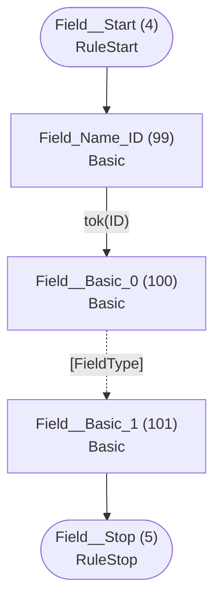
```mermaid
flowchart TD
    q4(["Field__Start (4)<br/>RuleStart"])
    q5(["Field__Stop (5)<br/>RuleStop"])
    q99["Field_Name_ID (99)<br/>Basic<br/>"]
    q100["Field__Basic_0 (100)<br/>Basic<br/>"]
    q101["Field__Basic_1 (101)<br/>Basic<br/>"]

    q4 --> q99
    q99 -->|"tok(ID)"| q100
    q100 -.->|"[FieldType]"| q101
    q101 --> q5
```

## FieldType

```mermaid
flowchart TD
    q6(["FieldType__Start (6)<br/>RuleStart"])
    q7(["FieldType__Stop (7)<br/>RuleStop"])
    q102["FieldType__Basic_0 (102)<br/>Basic<br/>"]
    q103["FieldType__Basic_1 (103)<br/>Basic<br/>"]
    q104["FieldType__Basic_2 (104)<br/>Basic<br/>"]
    q105["FieldType__Basic_3 (105)<br/>Basic<br/>"]
    q106["FieldType__Basic_4 (106)<br/>Basic<br/>"]
    q107["FieldType__Basic_5 (107)<br/>Basic<br/>"]
    q108["FieldType__Basic_6 (108)<br/>Basic<br/>"]
    q109["FieldType__Basic_7 (109)<br/>Basic<br/>"]
    q110{"FieldType__Basic_8 (110)<br/>Basic<br/><br/>dec=6"}
    q111["FieldType__BlockEnd (111)<br/>BlockEnd<br/>"]

    q6 --> q110
    q102 -.->|"[SimpleType]"| q103
    q103 --> q111
    q104 -.->|"[ReferenceType]"| q105
    q105 --> q111
    q106 -.->|"[ArrayType]"| q107
    q107 --> q111
    q108 -.->|"[PrimitiveType]"| q109
    q109 --> q111
    q110 --> q102
    q110 --> q104
    q110 --> q106
    q110 --> q108
    q111 --> q7
```

## ArrayType

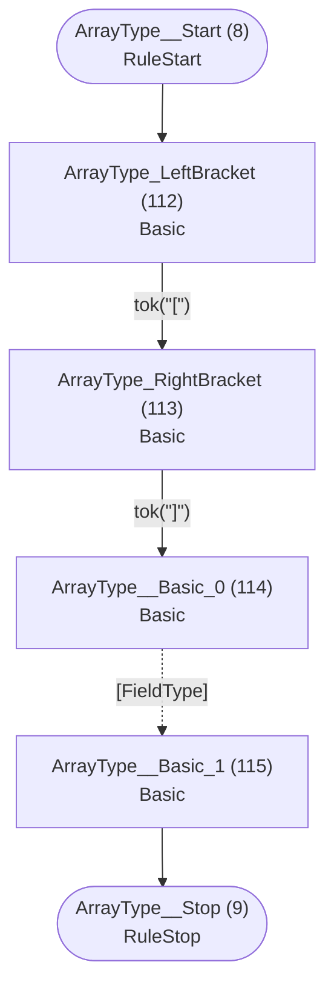
```mermaid
flowchart TD
    q8(["ArrayType__Start (8)<br/>RuleStart"])
    q9(["ArrayType__Stop (9)<br/>RuleStop"])
    q112["ArrayType_LeftBracket (112)<br/>Basic<br/>"]
    q113["ArrayType_RightBracket (113)<br/>Basic<br/>"]
    q114["ArrayType__Basic_0 (114)<br/>Basic<br/>"]
    q115["ArrayType__Basic_1 (115)<br/>Basic<br/>"]

    q8 --> q112
    q112 -->|"tok(&quot;[&quot;)"| q113
    q113 -->|"tok(&quot;]&quot;)"| q114
    q114 -.->|"[FieldType]"| q115
    q115 --> q9
```

## ReferenceType

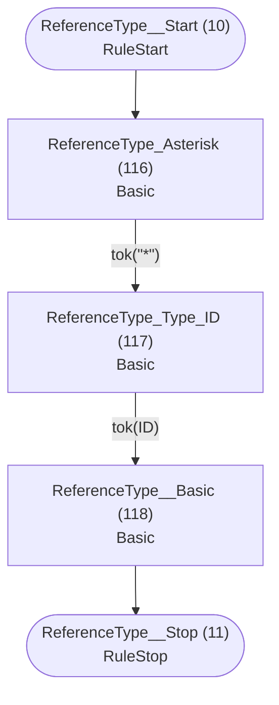
```mermaid
flowchart TD
    q10(["ReferenceType__Start (10)<br/>RuleStart"])
    q11(["ReferenceType__Stop (11)<br/>RuleStop"])
    q116["ReferenceType_Asterisk (116)<br/>Basic<br/>"]
    q117["ReferenceType_Type_ID (117)<br/>Basic<br/>"]
    q118["ReferenceType__Basic (118)<br/>Basic<br/>"]

    q10 --> q116
    q116 -->|"tok(&quot;*&quot;)"| q117
    q117 -->|"tok(ID)"| q118
    q118 --> q11
```

## SimpleType

```mermaid
flowchart TD
    q12(["SimpleType__Start (12)<br/>RuleStart"])
    q13(["SimpleType__Stop (13)<br/>RuleStop"])
    q119["SimpleType_Type_ID (119)<br/>Basic<br/>"]
    q120["SimpleType__Basic (120)<br/>Basic<br/>"]

    q12 --> q119
    q119 -->|"tok(ID)"| q120
    q120 --> q13
```

## PrimitiveType

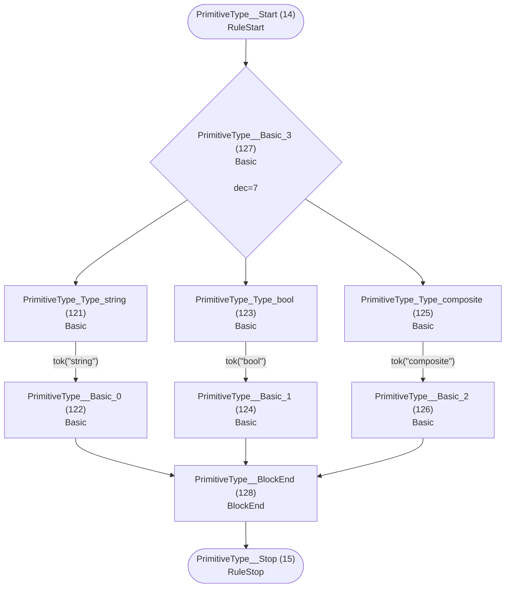
```mermaid
flowchart TD
    q14(["PrimitiveType__Start (14)<br/>RuleStart"])
    q15(["PrimitiveType__Stop (15)<br/>RuleStop"])
    q121["PrimitiveType_Type_string (121)<br/>Basic<br/>"]
    q122["PrimitiveType__Basic_0 (122)<br/>Basic<br/>"]
    q123["PrimitiveType_Type_bool (123)<br/>Basic<br/>"]
    q124["PrimitiveType__Basic_1 (124)<br/>Basic<br/>"]
    q125["PrimitiveType_Type_composite (125)<br/>Basic<br/>"]
    q126["PrimitiveType__Basic_2 (126)<br/>Basic<br/>"]
    q127{"PrimitiveType__Basic_3 (127)<br/>Basic<br/><br/>dec=7"}
    q128["PrimitiveType__BlockEnd (128)<br/>BlockEnd<br/>"]

    q14 --> q127
    q121 -->|"tok(&quot;string&quot;)"| q122
    q122 --> q128
    q123 -->|"tok(&quot;bool&quot;)"| q124
    q124 --> q128
    q125 -->|"tok(&quot;composite&quot;)"| q126
    q126 --> q128
    q127 --> q121
    q127 --> q123
    q127 --> q125
    q128 --> q15
```

## ParserRule

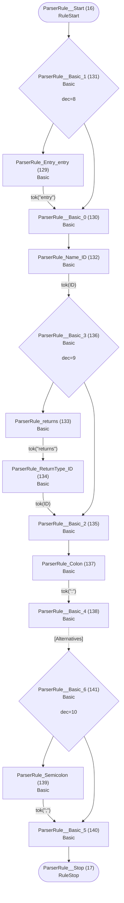
```mermaid
flowchart TD
    q16(["ParserRule__Start (16)<br/>RuleStart"])
    q17(["ParserRule__Stop (17)<br/>RuleStop"])
    q129["ParserRule_Entry_entry (129)<br/>Basic<br/>"]
    q130["ParserRule__Basic_0 (130)<br/>Basic<br/>"]
    q131{"ParserRule__Basic_1 (131)<br/>Basic<br/><br/>dec=8"}
    q132["ParserRule_Name_ID (132)<br/>Basic<br/>"]
    q133["ParserRule_returns (133)<br/>Basic<br/>"]
    q134["ParserRule_ReturnType_ID (134)<br/>Basic<br/>"]
    q135["ParserRule__Basic_2 (135)<br/>Basic<br/>"]
    q136{"ParserRule__Basic_3 (136)<br/>Basic<br/><br/>dec=9"}
    q137["ParserRule_Colon (137)<br/>Basic<br/>"]
    q138["ParserRule__Basic_4 (138)<br/>Basic<br/>"]
    q139["ParserRule_Semicolon (139)<br/>Basic<br/>"]
    q140["ParserRule__Basic_5 (140)<br/>Basic<br/>"]
    q141{"ParserRule__Basic_6 (141)<br/>Basic<br/><br/>dec=10"}

    q16 --> q131
    q129 -->|"tok(&quot;entry&quot;)"| q130
    q130 --> q132
    q131 --> q129
    q131 --> q130
    q132 -->|"tok(ID)"| q136
    q133 -->|"tok(&quot;returns&quot;)"| q134
    q134 -->|"tok(ID)"| q135
    q135 --> q137
    q136 --> q133
    q136 --> q135
    q137 -->|"tok(&quot;:&quot;)"| q138
    q138 -.->|"[Alternatives]"| q141
    q139 -->|"tok(&quot;;&quot;)"| q140
    q140 --> q17
    q141 --> q139
    q141 --> q140
```

## Token

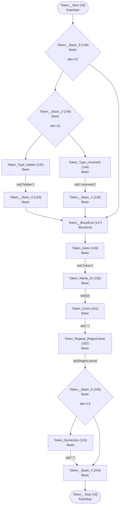
```mermaid
flowchart TD
    q18(["Token__Start (18)<br/>RuleStart"])
    q19(["Token__Stop (19)<br/>RuleStop"])
    q142["Token_Type_hidden (142)<br/>Basic<br/>"]
    q143["Token__Basic_0 (143)<br/>Basic<br/>"]
    q144["Token_Type_comment (144)<br/>Basic<br/>"]
    q145["Token__Basic_1 (145)<br/>Basic<br/>"]
    q146{"Token__Basic_2 (146)<br/>Basic<br/><br/>dec=11"}
    q147["Token__BlockEnd (147)<br/>BlockEnd<br/>"]
    q148{"Token__Basic_3 (148)<br/>Basic<br/><br/>dec=12"}
    q149["Token_token (149)<br/>Basic<br/>"]
    q150["Token_Name_ID (150)<br/>Basic<br/>"]
    q151["Token_Colon (151)<br/>Basic<br/>"]
    q152["Token_Regexp_RegexLiteral (152)<br/>Basic<br/>"]
    q153["Token_Semicolon (153)<br/>Basic<br/>"]
    q154["Token__Basic_4 (154)<br/>Basic<br/>"]
    q155{"Token__Basic_5 (155)<br/>Basic<br/><br/>dec=13"}

    q18 --> q148
    q142 -->|"tok(&quot;hidden&quot;)"| q143
    q143 --> q147
    q144 -->|"tok(&quot;comment&quot;)"| q145
    q145 --> q147
    q146 --> q142
    q146 --> q144
    q147 --> q149
    q148 --> q146
    q148 --> q147
    q149 -->|"tok(&quot;token&quot;)"| q150
    q150 -->|"tok(ID)"| q151
    q151 -->|"tok(&quot;:&quot;)"| q152
    q152 -->|"tok(RegexLiteral)"| q155
    q153 -->|"tok(&quot;;&quot;)"| q154
    q154 --> q19
    q155 --> q153
    q155 --> q154
```

## TokenGroup

```mermaid
flowchart TD
    q20(["TokenGroup__Start (20)<br/>RuleStart"])
    q21(["TokenGroup__Stop (21)<br/>RuleStop"])
    q156["TokenGroup_token (156)<br/>Basic<br/>"]
    q157["TokenGroup_group (157)<br/>Basic<br/>"]
    q158["TokenGroup_Name_ID (158)<br/>Basic<br/>"]
    q159["TokenGroup_LeftBrace (159)<br/>Basic<br/>"]
    q160["TokenGroup_TokenRefs_ID (160)<br/>Basic<br/>"]
    q161["TokenGroup__Basic_0 (161)<br/>Basic<br/>"]
    q162["TokenGroup_keywords (162)<br/>Basic<br/>"]
    q163["TokenGroup_Regexps_RegexLiteral (163)<br/>Basic<br/>"]
    q164["TokenGroup__Basic_1 (164)<br/>Basic<br/>"]
    q165["TokenGroup__Basic_2 (165)<br/>Basic<br/>"]
    q166["TokenGroup__Basic_3 (166)<br/>Basic<br/>"]
    q167{"TokenGroup__Basic_4 (167)<br/>Basic<br/><br/>dec=14"}
    q168["TokenGroup__BlockEnd (168)<br/>BlockEnd<br/>"]
    q169{"TokenGroup__LoopEntry (169)<br/>LoopEntry<br/><br/>dec=15"}
    q170["TokenGroup__LoopEnd (170)<br/>LoopEnd<br/>"]
    q171["TokenGroup__LoopBack (171)<br/>LoopBack<br/>"]
    q172["TokenGroup_RightBrace (172)<br/>Basic<br/>"]
    q173["TokenGroup__Basic_5 (173)<br/>Basic<br/>"]

    q20 --> q156
    q156 -->|"tok(&quot;token&quot;)"| q157
    q157 -->|"tok(&quot;group&quot;)"| q158
    q158 -->|"tok(ID)"| q159
    q159 -->|"tok(&quot;{&quot;)"| q169
    q160 -->|"tok(ID)"| q161
    q161 --> q168
    q162 -->|"tok(&quot;keywords&quot;)"| q163
    q163 -->|"tok(RegexLiteral)"| q164
    q164 --> q168
    q165 -.->|"[Keyword]"| q166
    q166 --> q168
    q167 --> q160
    q167 --> q162
    q167 --> q165
    q168 --> q171
    q169 --> q167
    q169 --> q170
    q170 --> q172
    q171 --> q169
    q172 -->|"tok(&quot;}&quot;)"| q173
    q173 --> q21
```

## Alternatives

```mermaid
flowchart TD
    q22(["Alternatives__Start (22)<br/>RuleStart"])
    q23(["Alternatives__Stop (23)<br/>RuleStop"])
    q174["Alternatives__Basic_0 (174)<br/>Basic<br/>"]
    q175["Alternatives_Pipe (175)<br/>Basic<br/>"]
    q176["Alternatives__Basic_1 (176)<br/>Basic<br/>"]
    q177["Alternatives__Basic_2 (177)<br/>Basic<br/>"]
    q178{"Alternatives__LoopBack (178)<br/>LoopBack<br/><br/>dec=16"}
    q179["Alternatives__LoopEnd (179)<br/>LoopEnd<br/>"]
    q180{"Alternatives__Basic_3 (180)<br/>Basic<br/><br/>dec=17"}

    q22 --> q174
    q174 -.->|"[Group]"| q180
    q175 -->|"tok(&quot;|&quot;)"| q176
    q176 -.->|"[Group]"| q177
    q177 --> q178
    q178 --> q175
    q178 --> q179
    q179 --> q23
    q180 --> q175
    q180 --> q179
```

## Group

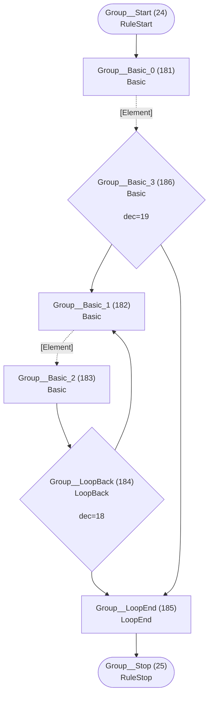
```mermaid
flowchart TD
    q24(["Group__Start (24)<br/>RuleStart"])
    q25(["Group__Stop (25)<br/>RuleStop"])
    q181["Group__Basic_0 (181)<br/>Basic<br/>"]
    q182["Group__Basic_1 (182)<br/>Basic<br/>"]
    q183["Group__Basic_2 (183)<br/>Basic<br/>"]
    q184{"Group__LoopBack (184)<br/>LoopBack<br/><br/>dec=18"}
    q185["Group__LoopEnd (185)<br/>LoopEnd<br/>"]
    q186{"Group__Basic_3 (186)<br/>Basic<br/><br/>dec=19"}

    q24 --> q181
    q181 -.->|"[Element]"| q186
    q182 -.->|"[Element]"| q183
    q183 --> q184
    q184 --> q182
    q184 --> q185
    q185 --> q25
    q186 --> q182
    q186 --> q185
```

## Element

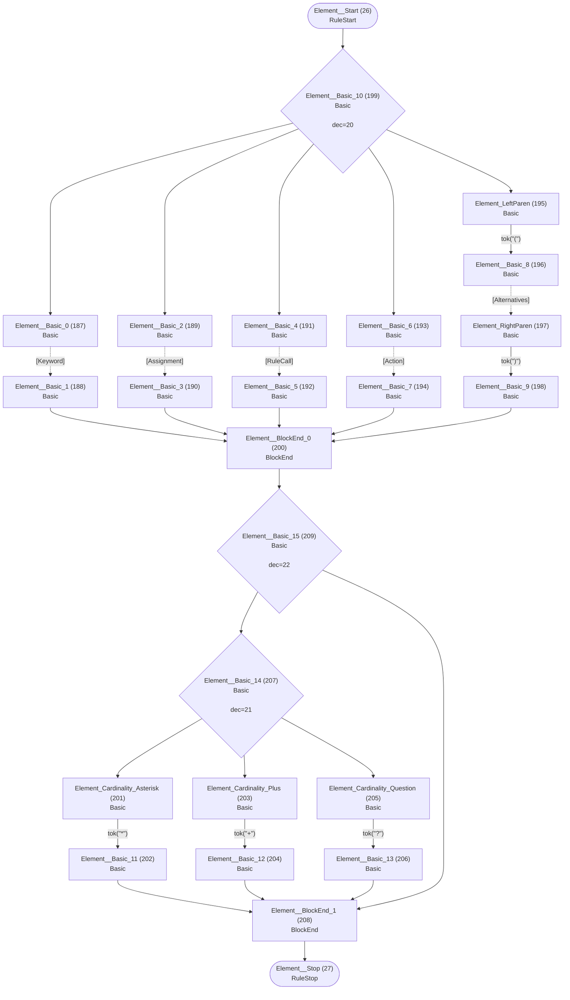
```mermaid
flowchart TD
    q26(["Element__Start (26)<br/>RuleStart"])
    q27(["Element__Stop (27)<br/>RuleStop"])
    q187["Element__Basic_0 (187)<br/>Basic<br/>"]
    q188["Element__Basic_1 (188)<br/>Basic<br/>"]
    q189["Element__Basic_2 (189)<br/>Basic<br/>"]
    q190["Element__Basic_3 (190)<br/>Basic<br/>"]
    q191["Element__Basic_4 (191)<br/>Basic<br/>"]
    q192["Element__Basic_5 (192)<br/>Basic<br/>"]
    q193["Element__Basic_6 (193)<br/>Basic<br/>"]
    q194["Element__Basic_7 (194)<br/>Basic<br/>"]
    q195["Element_LeftParen (195)<br/>Basic<br/>"]
    q196["Element__Basic_8 (196)<br/>Basic<br/>"]
    q197["Element_RightParen (197)<br/>Basic<br/>"]
    q198["Element__Basic_9 (198)<br/>Basic<br/>"]
    q199{"Element__Basic_10 (199)<br/>Basic<br/><br/>dec=20"}
    q200["Element__BlockEnd_0 (200)<br/>BlockEnd<br/>"]
    q201["Element_Cardinality_Asterisk (201)<br/>Basic<br/>"]
    q202["Element__Basic_11 (202)<br/>Basic<br/>"]
    q203["Element_Cardinality_Plus (203)<br/>Basic<br/>"]
    q204["Element__Basic_12 (204)<br/>Basic<br/>"]
    q205["Element_Cardinality_Question (205)<br/>Basic<br/>"]
    q206["Element__Basic_13 (206)<br/>Basic<br/>"]
    q207{"Element__Basic_14 (207)<br/>Basic<br/><br/>dec=21"}
    q208["Element__BlockEnd_1 (208)<br/>BlockEnd<br/>"]
    q209{"Element__Basic_15 (209)<br/>Basic<br/><br/>dec=22"}

    q26 --> q199
    q187 -.->|"[Keyword]"| q188
    q188 --> q200
    q189 -.->|"[Assignment]"| q190
    q190 --> q200
    q191 -.->|"[RuleCall]"| q192
    q192 --> q200
    q193 -.->|"[Action]"| q194
    q194 --> q200
    q195 -->|"tok(&quot;(&quot;)"| q196
    q196 -.->|"[Alternatives]"| q197
    q197 -->|"tok(&quot;)&quot;)"| q198
    q198 --> q200
    q199 --> q187
    q199 --> q189
    q199 --> q191
    q199 --> q193
    q199 --> q195
    q200 --> q209
    q201 -->|"tok(&quot;*&quot;)"| q202
    q202 --> q208
    q203 -->|"tok(&quot;+&quot;)"| q204
    q204 --> q208
    q205 -->|"tok(&quot;?&quot;)"| q206
    q206 --> q208
    q207 --> q201
    q207 --> q203
    q207 --> q205
    q208 --> q27
    q209 --> q207
    q209 --> q208
```

## Keyword

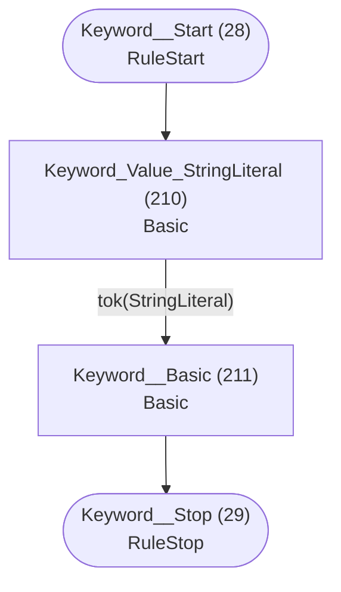
```mermaid
flowchart TD
    q28(["Keyword__Start (28)<br/>RuleStart"])
    q29(["Keyword__Stop (29)<br/>RuleStop"])
    q210["Keyword_Value_StringLiteral (210)<br/>Basic<br/>"]
    q211["Keyword__Basic (211)<br/>Basic<br/>"]

    q28 --> q210
    q210 -->|"tok(StringLiteral)"| q211
    q211 --> q29
```

## Assignment

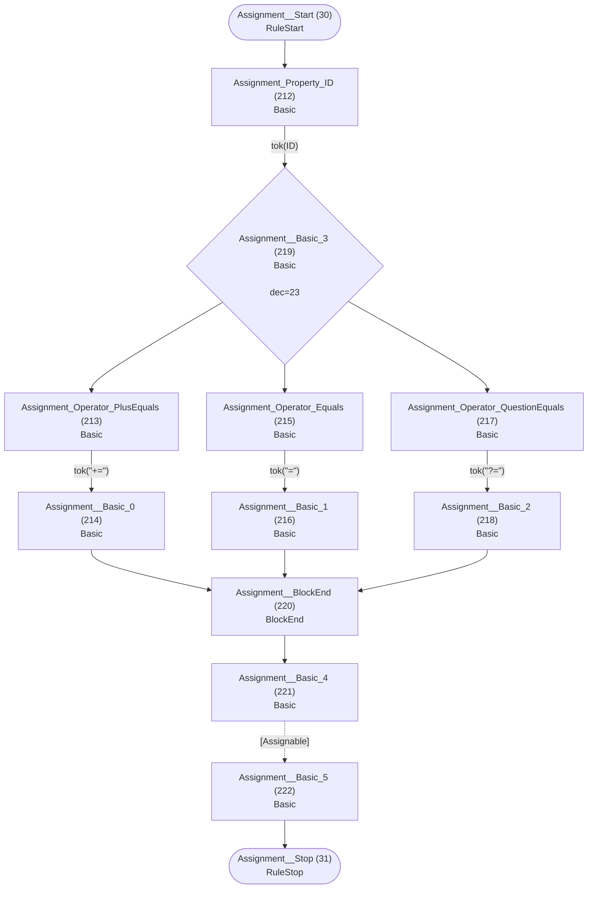
```mermaid
flowchart TD
    q30(["Assignment__Start (30)<br/>RuleStart"])
    q31(["Assignment__Stop (31)<br/>RuleStop"])
    q212["Assignment_Property_ID (212)<br/>Basic<br/>"]
    q213["Assignment_Operator_PlusEquals (213)<br/>Basic<br/>"]
    q214["Assignment__Basic_0 (214)<br/>Basic<br/>"]
    q215["Assignment_Operator_Equals (215)<br/>Basic<br/>"]
    q216["Assignment__Basic_1 (216)<br/>Basic<br/>"]
    q217["Assignment_Operator_QuestionEquals (217)<br/>Basic<br/>"]
    q218["Assignment__Basic_2 (218)<br/>Basic<br/>"]
    q219{"Assignment__Basic_3 (219)<br/>Basic<br/><br/>dec=23"}
    q220["Assignment__BlockEnd (220)<br/>BlockEnd<br/>"]
    q221["Assignment__Basic_4 (221)<br/>Basic<br/>"]
    q222["Assignment__Basic_5 (222)<br/>Basic<br/>"]

    q30 --> q212
    q212 -->|"tok(ID)"| q219
    q213 -->|"tok(&quot;+=&quot;)"| q214
    q214 --> q220
    q215 -->|"tok(&quot;=&quot;)"| q216
    q216 --> q220
    q217 -->|"tok(&quot;?=&quot;)"| q218
    q218 --> q220
    q219 --> q213
    q219 --> q215
    q219 --> q217
    q220 --> q221
    q221 -.->|"[Assignable]"| q222
    q222 --> q31
```

## Assignable

```mermaid
flowchart TD
    q32(["Assignable__Start (32)<br/>RuleStart"])
    q33(["Assignable__Stop (33)<br/>RuleStop"])
    q223["Assignable__Basic_0 (223)<br/>Basic<br/>"]
    q224["Assignable__Basic_1 (224)<br/>Basic<br/>"]
    q225["Assignable__Basic_2 (225)<br/>Basic<br/>"]
    q226["Assignable__Basic_3 (226)<br/>Basic<br/>"]
    q227["Assignable__Basic_4 (227)<br/>Basic<br/>"]
    q228["Assignable__Basic_5 (228)<br/>Basic<br/>"]
    q229["Assignable_LeftParen (229)<br/>Basic<br/>"]
    q230["Assignable__Basic_6 (230)<br/>Basic<br/>"]
    q231["Assignable_RightParen (231)<br/>Basic<br/>"]
    q232["Assignable__Basic_7 (232)<br/>Basic<br/>"]
    q233{"Assignable__Basic_8 (233)<br/>Basic<br/><br/>dec=24"}
    q234["Assignable__BlockEnd (234)<br/>BlockEnd<br/>"]

    q32 --> q233
    q223 -.->|"[Keyword]"| q224
    q224 --> q234
    q225 -.->|"[RuleCall]"| q226
    q226 --> q234
    q227 -.->|"[CrossRef]"| q228
    q228 --> q234
    q229 -->|"tok(&quot;(&quot;)"| q230
    q230 -.->|"[AssignableAlternatives]"| q231
    q231 -->|"tok(&quot;)&quot;)"| q232
    q232 --> q234
    q233 --> q223
    q233 --> q225
    q233 --> q227
    q233 --> q229
    q234 --> q33
```

## AssignableWithoutAlts

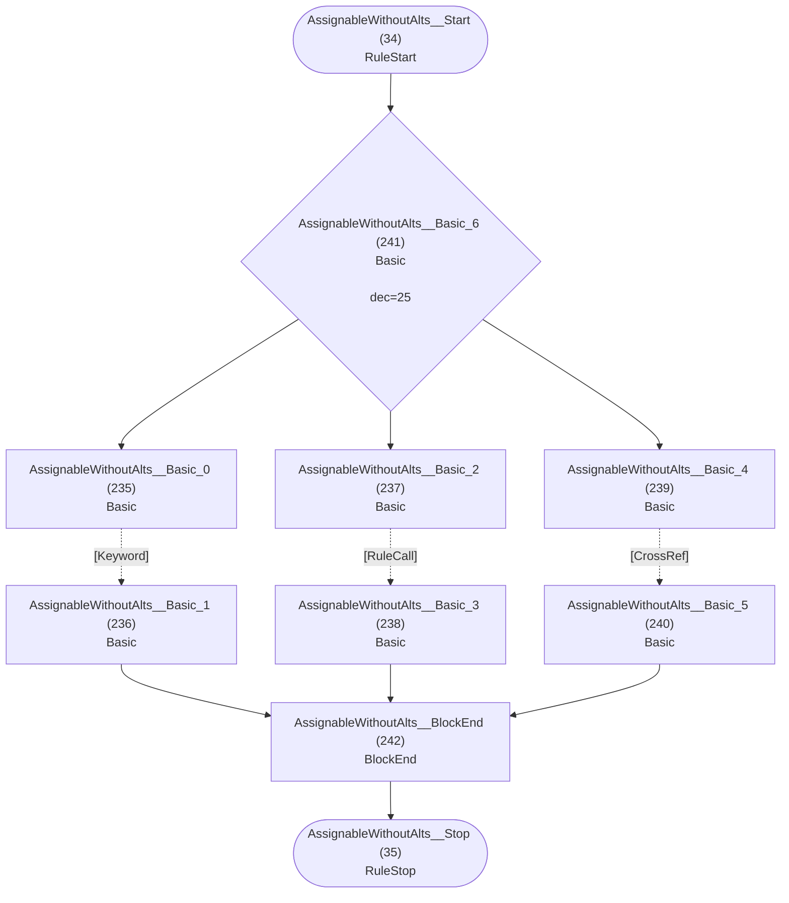
```mermaid
flowchart TD
    q34(["AssignableWithoutAlts__Start (34)<br/>RuleStart"])
    q35(["AssignableWithoutAlts__Stop (35)<br/>RuleStop"])
    q235["AssignableWithoutAlts__Basic_0 (235)<br/>Basic<br/>"]
    q236["AssignableWithoutAlts__Basic_1 (236)<br/>Basic<br/>"]
    q237["AssignableWithoutAlts__Basic_2 (237)<br/>Basic<br/>"]
    q238["AssignableWithoutAlts__Basic_3 (238)<br/>Basic<br/>"]
    q239["AssignableWithoutAlts__Basic_4 (239)<br/>Basic<br/>"]
    q240["AssignableWithoutAlts__Basic_5 (240)<br/>Basic<br/>"]
    q241{"AssignableWithoutAlts__Basic_6 (241)<br/>Basic<br/><br/>dec=25"}
    q242["AssignableWithoutAlts__BlockEnd (242)<br/>BlockEnd<br/>"]

    q34 --> q241
    q235 -.->|"[Keyword]"| q236
    q236 --> q242
    q237 -.->|"[RuleCall]"| q238
    q238 --> q242
    q239 -.->|"[CrossRef]"| q240
    q240 --> q242
    q241 --> q235
    q241 --> q237
    q241 --> q239
    q242 --> q35
```

## AssignableAlternatives

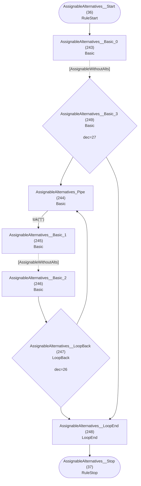
```mermaid
flowchart TD
    q36(["AssignableAlternatives__Start (36)<br/>RuleStart"])
    q37(["AssignableAlternatives__Stop (37)<br/>RuleStop"])
    q243["AssignableAlternatives__Basic_0 (243)<br/>Basic<br/>"]
    q244["AssignableAlternatives_Pipe (244)<br/>Basic<br/>"]
    q245["AssignableAlternatives__Basic_1 (245)<br/>Basic<br/>"]
    q246["AssignableAlternatives__Basic_2 (246)<br/>Basic<br/>"]
    q247{"AssignableAlternatives__LoopBack (247)<br/>LoopBack<br/><br/>dec=26"}
    q248["AssignableAlternatives__LoopEnd (248)<br/>LoopEnd<br/>"]
    q249{"AssignableAlternatives__Basic_3 (249)<br/>Basic<br/><br/>dec=27"}

    q36 --> q243
    q243 -.->|"[AssignableWithoutAlts]"| q249
    q244 -->|"tok(&quot;|&quot;)"| q245
    q245 -.->|"[AssignableWithoutAlts]"| q246
    q246 --> q247
    q247 --> q244
    q247 --> q248
    q248 --> q37
    q249 --> q244
    q249 --> q248
```

## CrossRef

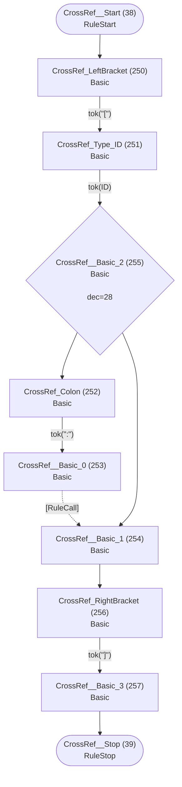
```mermaid
flowchart TD
    q38(["CrossRef__Start (38)<br/>RuleStart"])
    q39(["CrossRef__Stop (39)<br/>RuleStop"])
    q250["CrossRef_LeftBracket (250)<br/>Basic<br/>"]
    q251["CrossRef_Type_ID (251)<br/>Basic<br/>"]
    q252["CrossRef_Colon (252)<br/>Basic<br/>"]
    q253["CrossRef__Basic_0 (253)<br/>Basic<br/>"]
    q254["CrossRef__Basic_1 (254)<br/>Basic<br/>"]
    q255{"CrossRef__Basic_2 (255)<br/>Basic<br/><br/>dec=28"}
    q256["CrossRef_RightBracket (256)<br/>Basic<br/>"]
    q257["CrossRef__Basic_3 (257)<br/>Basic<br/>"]

    q38 --> q250
    q250 -->|"tok(&quot;[&quot;)"| q251
    q251 -->|"tok(ID)"| q255
    q252 -->|"tok(&quot;:&quot;)"| q253
    q253 -.->|"[RuleCall]"| q254
    q254 --> q256
    q255 --> q252
    q255 --> q254
    q256 -->|"tok(&quot;]&quot;)"| q257
    q257 --> q39
```

## RuleCall

```mermaid
flowchart TD
    q40(["RuleCall__Start (40)<br/>RuleStart"])
    q41(["RuleCall__Stop (41)<br/>RuleStop"])
    q258["RuleCall_Rule_ID (258)<br/>Basic<br/>"]
    q259["RuleCall__Basic (259)<br/>Basic<br/>"]

    q40 --> q258
    q258 -->|"tok(ID)"| q259
    q259 --> q41
```

## Action

```mermaid
flowchart TD
    q42(["Action__Start (42)<br/>RuleStart"])
    q43(["Action__Stop (43)<br/>RuleStop"])
    q260["Action_LeftBrace (260)<br/>Basic<br/>"]
    q261["Action_Type_ID (261)<br/>Basic<br/>"]
    q262["Action_Dot (262)<br/>Basic<br/>"]
    q263["Action_Property_ID (263)<br/>Basic<br/>"]
    q264["Action_Operator_PlusEquals (264)<br/>Basic<br/>"]
    q265["Action__Basic_0 (265)<br/>Basic<br/>"]
    q266["Action_Operator_Equals (266)<br/>Basic<br/>"]
    q267["Action__Basic_1 (267)<br/>Basic<br/>"]
    q268{"Action__Basic_2 (268)<br/>Basic<br/><br/>dec=29"}
    q269["Action__BlockEnd (269)<br/>BlockEnd<br/>"]
    q270["Action_current (270)<br/>Basic<br/>"]
    q271["Action__Basic_3 (271)<br/>Basic<br/>"]
    q272{"Action__Basic_4 (272)<br/>Basic<br/><br/>dec=30"}
    q273["Action_RightBrace (273)<br/>Basic<br/>"]
    q274["Action__Basic_5 (274)<br/>Basic<br/>"]

    q42 --> q260
    q260 -->|"tok(&quot;{&quot;)"| q261
    q261 -->|"tok(ID)"| q272
    q262 -->|"tok(&quot;.&quot;)"| q263
    q263 -->|"tok(ID)"| q268
    q264 -->|"tok(&quot;+=&quot;)"| q265
    q265 --> q269
    q266 -->|"tok(&quot;=&quot;)"| q267
    q267 --> q269
    q268 --> q264
    q268 --> q266
    q269 --> q270
    q270 -->|"tok(&quot;current&quot;)"| q271
    q271 --> q273
    q272 --> q262
    q272 --> q271
    q273 -->|"tok(&quot;}&quot;)"| q274
    q274 --> q43
```

## CompositeRule

```mermaid
flowchart TD
    q44(["CompositeRule__Start (44)<br/>RuleStart"])
    q45(["CompositeRule__Stop (45)<br/>RuleStop"])
    q275["CompositeRule_composite (275)<br/>Basic<br/>"]
    q276["CompositeRule_Name_ID (276)<br/>Basic<br/>"]
    q277["CompositeRule_Colon (277)<br/>Basic<br/>"]
    q278["CompositeRule__Basic_0 (278)<br/>Basic<br/>"]
    q279["CompositeRule_Semicolon (279)<br/>Basic<br/>"]
    q280["CompositeRule__Basic_1 (280)<br/>Basic<br/>"]
    q281{"CompositeRule__Basic_2 (281)<br/>Basic<br/><br/>dec=31"}

    q44 --> q275
    q275 -->|"tok(&quot;composite&quot;)"| q276
    q276 -->|"tok(ID)"| q277
    q277 -->|"tok(&quot;:&quot;)"| q278
    q278 -.->|"[CompositeAlternatives]"| q281
    q279 -->|"tok(&quot;;&quot;)"| q280
    q280 --> q45
    q281 --> q279
    q281 --> q280
```

## CompositeAlternatives

```mermaid
flowchart TD
    q46(["CompositeAlternatives__Start (46)<br/>RuleStart"])
    q47(["CompositeAlternatives__Stop (47)<br/>RuleStop"])
    q282["CompositeAlternatives__Basic_0 (282)<br/>Basic<br/>"]
    q283["CompositeAlternatives_Pipe (283)<br/>Basic<br/>"]
    q284["CompositeAlternatives__Basic_1 (284)<br/>Basic<br/>"]
    q285["CompositeAlternatives__Basic_2 (285)<br/>Basic<br/>"]
    q286{"CompositeAlternatives__LoopBack (286)<br/>LoopBack<br/><br/>dec=32"}
    q287["CompositeAlternatives__LoopEnd (287)<br/>LoopEnd<br/>"]
    q288{"CompositeAlternatives__Basic_3 (288)<br/>Basic<br/><br/>dec=33"}

    q46 --> q282
    q282 -.->|"[CompositeGroup]"| q288
    q283 -->|"tok(&quot;|&quot;)"| q284
    q284 -.->|"[CompositeGroup]"| q285
    q285 --> q286
    q286 --> q283
    q286 --> q287
    q287 --> q47
    q288 --> q283
    q288 --> q287
```

## CompositeGroup

```mermaid
flowchart TD
    q48(["CompositeGroup__Start (48)<br/>RuleStart"])
    q49(["CompositeGroup__Stop (49)<br/>RuleStop"])
    q289["CompositeGroup__Basic_0 (289)<br/>Basic<br/>"]
    q290["CompositeGroup__Basic_1 (290)<br/>Basic<br/>"]
    q291["CompositeGroup__Basic_2 (291)<br/>Basic<br/>"]
    q292{"CompositeGroup__LoopBack (292)<br/>LoopBack<br/><br/>dec=34"}
    q293["CompositeGroup__LoopEnd (293)<br/>LoopEnd<br/>"]
    q294{"CompositeGroup__Basic_3 (294)<br/>Basic<br/><br/>dec=35"}

    q48 --> q289
    q289 -.->|"[CompositeElement]"| q294
    q290 -.->|"[CompositeElement]"| q291
    q291 --> q292
    q292 --> q290
    q292 --> q293
    q293 --> q49
    q294 --> q290
    q294 --> q293
```

## CompositeElement

```mermaid
flowchart TD
    q50(["CompositeElement__Start (50)<br/>RuleStart"])
    q51(["CompositeElement__Stop (51)<br/>RuleStop"])
    q295["CompositeElement__Basic_0 (295)<br/>Basic<br/>"]
    q296["CompositeElement__Basic_1 (296)<br/>Basic<br/>"]
    q297["CompositeElement__Basic_2 (297)<br/>Basic<br/>"]
    q298["CompositeElement__Basic_3 (298)<br/>Basic<br/>"]
    q299["CompositeElement_LeftParen (299)<br/>Basic<br/>"]
    q300["CompositeElement__Basic_4 (300)<br/>Basic<br/>"]
    q301["CompositeElement_RightParen (301)<br/>Basic<br/>"]
    q302["CompositeElement__Basic_5 (302)<br/>Basic<br/>"]
    q303{"CompositeElement__Basic_6 (303)<br/>Basic<br/><br/>dec=36"}
    q304["CompositeElement__BlockEnd_0 (304)<br/>BlockEnd<br/>"]
    q305["CompositeElement_Cardinality_Asterisk (305)<br/>Basic<br/>"]
    q306["CompositeElement__Basic_7 (306)<br/>Basic<br/>"]
    q307["CompositeElement_Cardinality_Plus (307)<br/>Basic<br/>"]
    q308["CompositeElement__Basic_8 (308)<br/>Basic<br/>"]
    q309["CompositeElement_Cardinality_Question (309)<br/>Basic<br/>"]
    q310["CompositeElement__Basic_9 (310)<br/>Basic<br/>"]
    q311{"CompositeElement__Basic_10 (311)<br/>Basic<br/><br/>dec=37"}
    q312["CompositeElement__BlockEnd_1 (312)<br/>BlockEnd<br/>"]
    q313{"CompositeElement__Basic_11 (313)<br/>Basic<br/><br/>dec=38"}

    q50 --> q303
    q295 -.->|"[Keyword]"| q296
    q296 --> q304
    q297 -.->|"[RuleCall]"| q298
    q298 --> q304
    q299 -->|"tok(&quot;(&quot;)"| q300
    q300 -.->|"[CompositeAlternatives]"| q301
    q301 -->|"tok(&quot;)&quot;)"| q302
    q302 --> q304
    q303 --> q295
    q303 --> q297
    q303 --> q299
    q304 --> q313
    q305 -->|"tok(&quot;*&quot;)"| q306
    q306 --> q312
    q307 -->|"tok(&quot;+&quot;)"| q308
    q308 --> q312
    q309 -->|"tok(&quot;?&quot;)"| q310
    q310 --> q312
    q311 --> q305
    q311 --> q307
    q311 --> q309
    q312 --> q51
    q313 --> q311
    q313 --> q312
```

## InfixRule

```mermaid
flowchart TD
    q52(["InfixRule__Start (52)<br/>RuleStart"])
    q53(["InfixRule__Stop (53)<br/>RuleStop"])
    q314["InfixRule_infix (314)<br/>Basic<br/>"]
    q315["InfixRule_Name_ID (315)<br/>Basic<br/>"]
    q316["InfixRule_on (316)<br/>Basic<br/>"]
    q317["InfixRule__Basic_0 (317)<br/>Basic<br/>"]
    q318["InfixRule_returns (318)<br/>Basic<br/>"]
    q319["InfixRule_ReturnType_ID (319)<br/>Basic<br/>"]
    q320["InfixRule__Basic_1 (320)<br/>Basic<br/>"]
    q321{"InfixRule__Basic_2 (321)<br/>Basic<br/><br/>dec=39"}
    q322["InfixRule_Colon (322)<br/>Basic<br/>"]
    q323["InfixRule__Basic_3 (323)<br/>Basic<br/>"]
    q324["InfixRule_GreaterThan (324)<br/>Basic<br/>"]
    q325["InfixRule__Basic_4 (325)<br/>Basic<br/>"]
    q326["InfixRule__Basic_5 (326)<br/>Basic<br/>"]
    q327{"InfixRule__LoopEntry (327)<br/>LoopEntry<br/><br/>dec=40"}
    q328["InfixRule__LoopEnd (328)<br/>LoopEnd<br/>"]
    q329["InfixRule__LoopBack (329)<br/>LoopBack<br/>"]
    q330["InfixRule_Semicolon (330)<br/>Basic<br/>"]
    q331["InfixRule__Basic_6 (331)<br/>Basic<br/>"]
    q332{"InfixRule__Basic_7 (332)<br/>Basic<br/><br/>dec=41"}

    q52 --> q314
    q314 -->|"tok(&quot;infix&quot;)"| q315
    q315 -->|"tok(ID)"| q316
    q316 -->|"tok(&quot;on&quot;)"| q317
    q317 -.->|"[RuleCall]"| q321
    q318 -->|"tok(&quot;returns&quot;)"| q319
    q319 -->|"tok(ID)"| q320
    q320 --> q322
    q321 --> q318
    q321 --> q320
    q322 -->|"tok(&quot;:&quot;)"| q323
    q323 -.->|"[PrecedenceGroup]"| q327
    q324 -->|"tok(&quot;>&quot;)"| q325
    q325 -.->|"[PrecedenceGroup]"| q326
    q326 --> q329
    q327 --> q324
    q327 --> q328
    q328 --> q332
    q329 --> q327
    q330 -->|"tok(&quot;;&quot;)"| q331
    q331 --> q53
    q332 --> q330
    q332 --> q331
```

## PrecedenceGroup

```mermaid
flowchart TD
    q54(["PrecedenceGroup__Start (54)<br/>RuleStart"])
    q55(["PrecedenceGroup__Stop (55)<br/>RuleStop"])
    q333["PrecedenceGroup_Associativity_left (333)<br/>Basic<br/>"]
    q334["PrecedenceGroup__Basic_0 (334)<br/>Basic<br/>"]
    q335["PrecedenceGroup_Associativity_right (335)<br/>Basic<br/>"]
    q336["PrecedenceGroup__Basic_1 (336)<br/>Basic<br/>"]
    q337{"PrecedenceGroup__Basic_2 (337)<br/>Basic<br/><br/>dec=42"}
    q338["PrecedenceGroup__BlockEnd (338)<br/>BlockEnd<br/>"]
    q339{"PrecedenceGroup__Basic_3 (339)<br/>Basic<br/><br/>dec=43"}
    q340["PrecedenceGroup__Basic_4 (340)<br/>Basic<br/>"]
    q341["PrecedenceGroup_Pipe (341)<br/>Basic<br/>"]
    q342["PrecedenceGroup__Basic_5 (342)<br/>Basic<br/>"]
    q343["PrecedenceGroup__Basic_6 (343)<br/>Basic<br/>"]
    q344{"PrecedenceGroup__LoopEntry (344)<br/>LoopEntry<br/><br/>dec=44"}
    q345["PrecedenceGroup__LoopEnd (345)<br/>LoopEnd<br/>"]
    q346["PrecedenceGroup__LoopBack (346)<br/>LoopBack<br/>"]

    q54 --> q339
    q333 -->|"tok(&quot;left&quot;)"| q334
    q334 --> q338
    q335 -->|"tok(&quot;right&quot;)"| q336
    q336 --> q338
    q337 --> q333
    q337 --> q335
    q338 --> q340
    q339 --> q337
    q339 --> q338
    q340 -.->|"[InfixOperator]"| q344
    q341 -->|"tok(&quot;|&quot;)"| q342
    q342 -.->|"[InfixOperator]"| q343
    q343 --> q346
    q344 --> q341
    q344 --> q345
    q345 --> q55
    q346 --> q344
```

## InfixOperator

```mermaid
flowchart TD
    q56(["InfixOperator__Start (56)<br/>RuleStart"])
    q57(["InfixOperator__Stop (57)<br/>RuleStop"])
    q347["InfixOperator__Basic_0 (347)<br/>Basic<br/>"]
    q348["InfixOperator__Basic_1 (348)<br/>Basic<br/>"]
    q349["InfixOperator__Basic_2 (349)<br/>Basic<br/>"]
    q350["InfixOperator__Basic_3 (350)<br/>Basic<br/>"]
    q351{"InfixOperator__Basic_4 (351)<br/>Basic<br/><br/>dec=45"}
    q352["InfixOperator__BlockEnd (352)<br/>BlockEnd<br/>"]

    q56 --> q351
    q347 -.->|"[Keyword]"| q348
    q348 --> q352
    q349 -.->|"[RuleCall]"| q350
    q350 --> q352
    q351 --> q347
    q351 --> q349
    q352 --> q57
```

