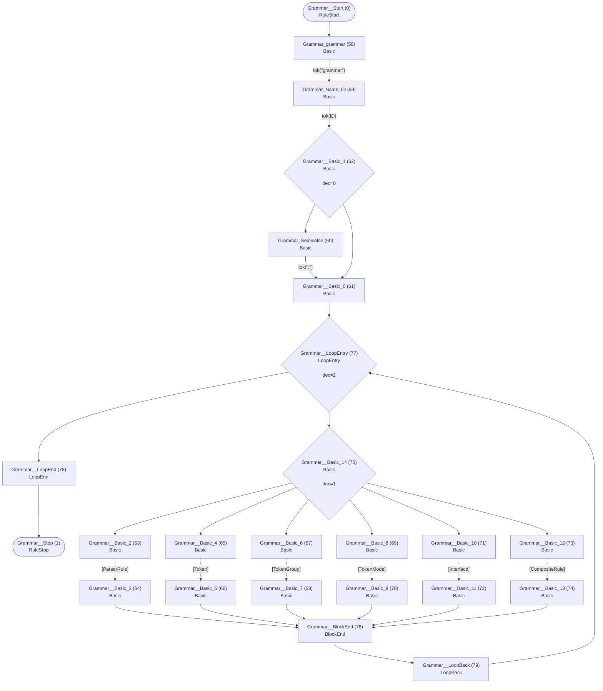
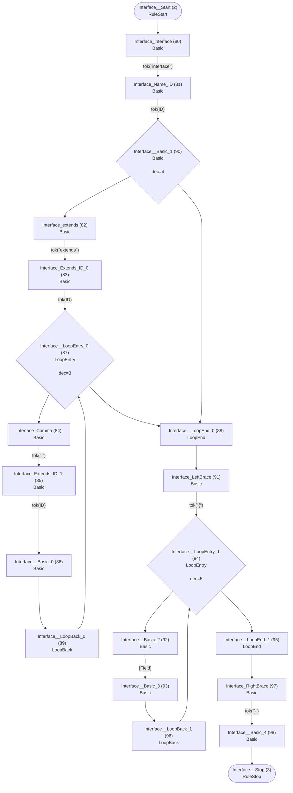
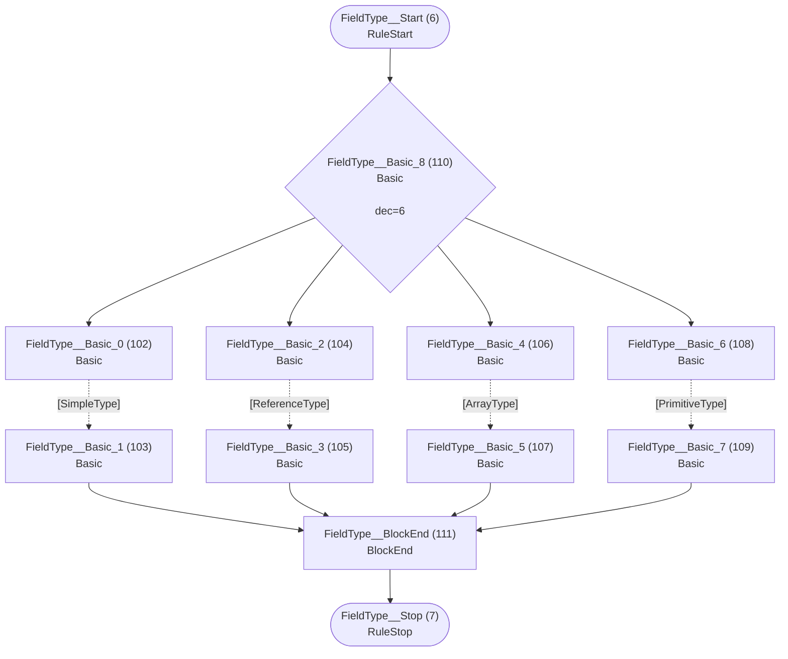
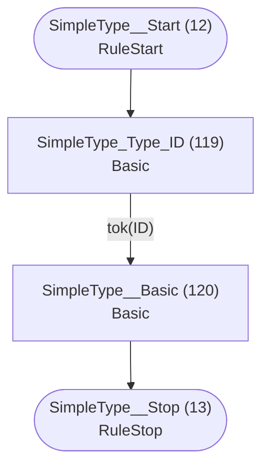
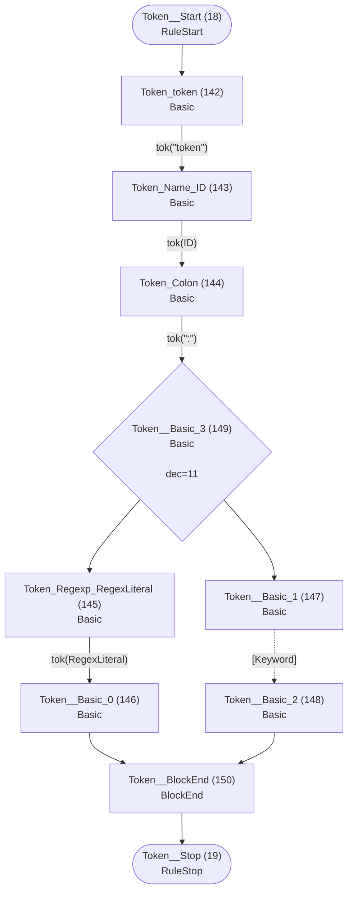
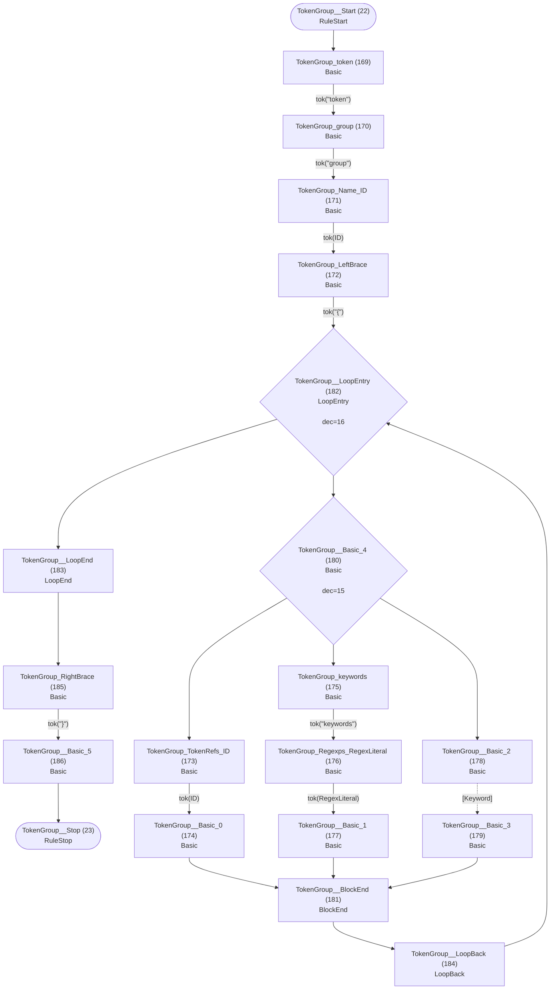
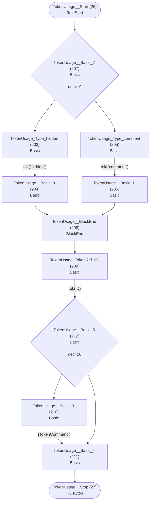
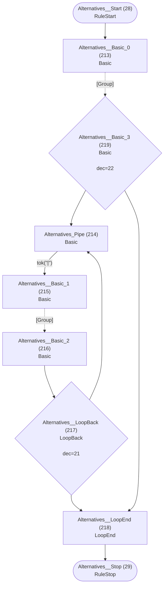
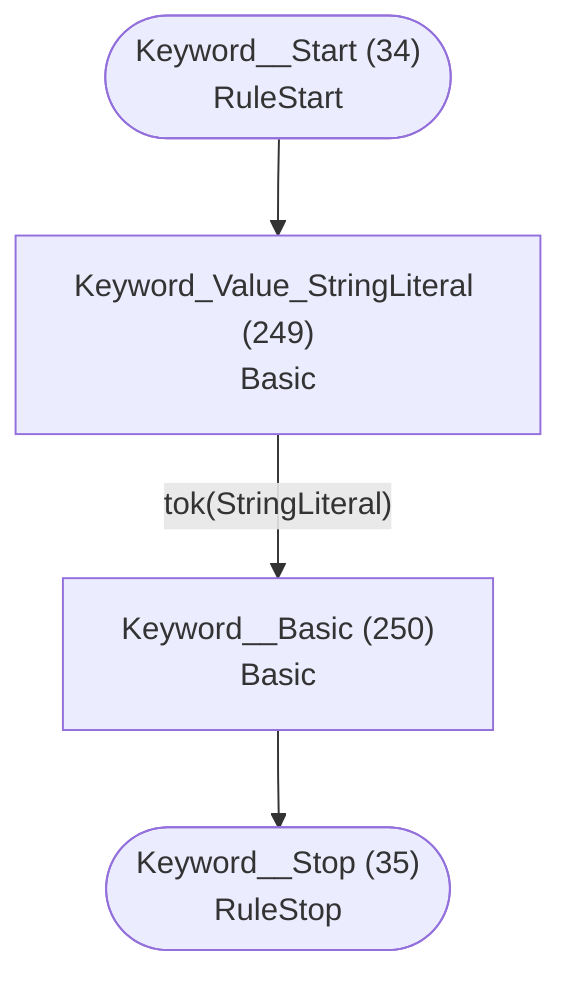
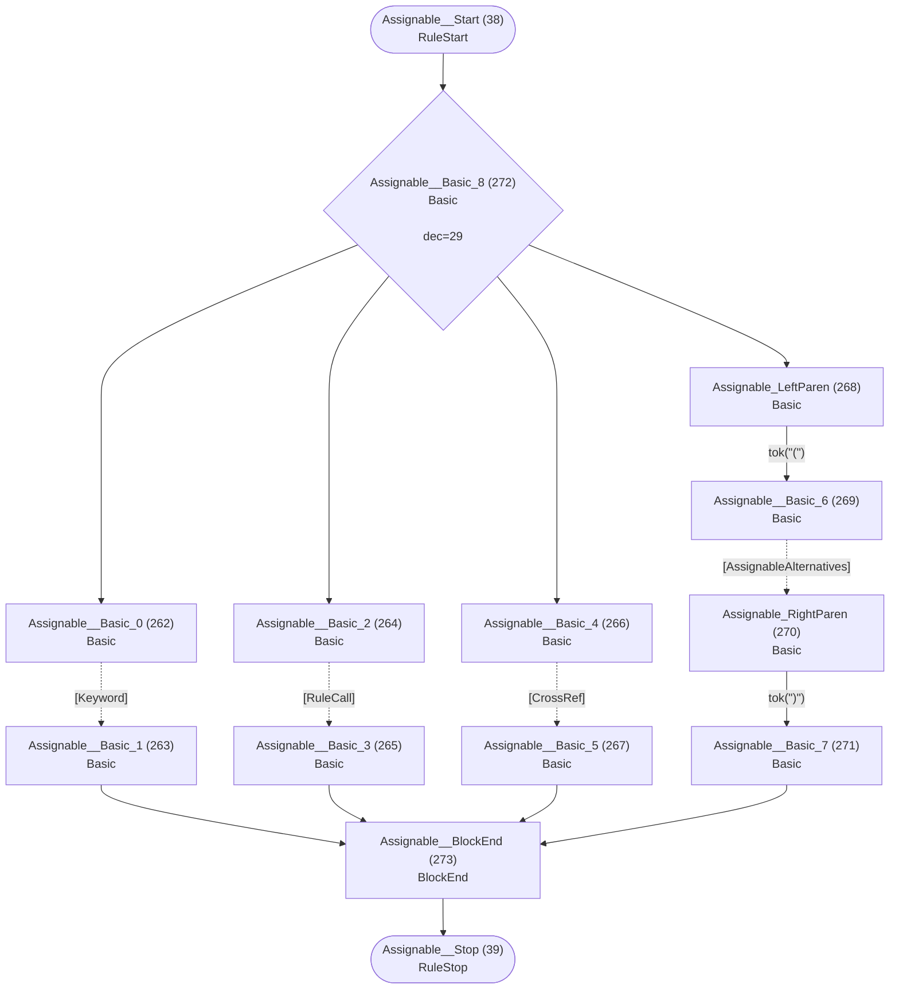

# Runtime ATN for grammar

## Grammar

```mermaid
flowchart TD
    q0(["Grammar__Start (0)<br/>RuleStart"])
    q1(["Grammar__Stop (1)<br/>RuleStop"])
    q58["Grammar_grammar (58)<br/>Basic<br/>"]
    q59["Grammar_Name_ID (59)<br/>Basic<br/>"]
    q60["Grammar_Semicolon (60)<br/>Basic<br/>"]
    q61["Grammar__Basic_0 (61)<br/>Basic<br/>"]
    q62{"Grammar__Basic_1 (62)<br/>Basic<br/><br/>dec=0"}
    q63["Grammar__Basic_2 (63)<br/>Basic<br/>"]
    q64["Grammar__Basic_3 (64)<br/>Basic<br/>"]
    q65["Grammar__Basic_4 (65)<br/>Basic<br/>"]
    q66["Grammar__Basic_5 (66)<br/>Basic<br/>"]
    q67["Grammar__Basic_6 (67)<br/>Basic<br/>"]
    q68["Grammar__Basic_7 (68)<br/>Basic<br/>"]
    q69["Grammar__Basic_8 (69)<br/>Basic<br/>"]
    q70["Grammar__Basic_9 (70)<br/>Basic<br/>"]
    q71["Grammar__Basic_10 (71)<br/>Basic<br/>"]
    q72["Grammar__Basic_11 (72)<br/>Basic<br/>"]
    q73["Grammar__Basic_12 (73)<br/>Basic<br/>"]
    q74["Grammar__Basic_13 (74)<br/>Basic<br/>"]
    q75{"Grammar__Basic_14 (75)<br/>Basic<br/><br/>dec=1"}
    q76["Grammar__BlockEnd (76)<br/>BlockEnd<br/>"]
    q77{"Grammar__LoopEntry (77)<br/>LoopEntry<br/><br/>dec=2"}
    q78["Grammar__LoopEnd (78)<br/>LoopEnd<br/>"]
    q79["Grammar__LoopBack (79)<br/>LoopBack<br/>"]

    q0 --> q58
    q58 -->|"tok(&quot;grammar&quot;)"| q59
    q59 -->|"tok(ID)"| q62
    q60 -->|"tok(&quot;;&quot;)"| q61
    q61 --> q77
    q62 --> q60
    q62 --> q61
    q63 -.->|"[ParserRule]"| q64
    q64 --> q76
    q65 -.->|"[Token]"| q66
    q66 --> q76
    q67 -.->|"[TokenGroup]"| q68
    q68 --> q76
    q69 -.->|"[TokenMode]"| q70
    q70 --> q76
    q71 -.->|"[Interface]"| q72
    q72 --> q76
    q73 -.->|"[CompositeRule]"| q74
    q74 --> q76
    q75 --> q63
    q75 --> q65
    q75 --> q67
    q75 --> q69
    q75 --> q71
    q75 --> q73
    q76 --> q79
    q77 --> q75
    q77 --> q78
    q78 --> q1
    q79 --> q77
```

## Interface

```mermaid
flowchart TD
    q2(["Interface__Start (2)<br/>RuleStart"])
    q3(["Interface__Stop (3)<br/>RuleStop"])
    q80["Interface_interface (80)<br/>Basic<br/>"]
    q81["Interface_Name_ID (81)<br/>Basic<br/>"]
    q82["Interface_extends (82)<br/>Basic<br/>"]
    q83["Interface_Extends_ID_0 (83)<br/>Basic<br/>"]
    q84["Interface_Comma (84)<br/>Basic<br/>"]
    q85["Interface_Extends_ID_1 (85)<br/>Basic<br/>"]
    q86["Interface__Basic_0 (86)<br/>Basic<br/>"]
    q87{"Interface__LoopEntry_0 (87)<br/>LoopEntry<br/><br/>dec=3"}
    q88["Interface__LoopEnd_0 (88)<br/>LoopEnd<br/>"]
    q89["Interface__LoopBack_0 (89)<br/>LoopBack<br/>"]
    q90{"Interface__Basic_1 (90)<br/>Basic<br/><br/>dec=4"}
    q91["Interface_LeftBrace (91)<br/>Basic<br/>"]
    q92["Interface__Basic_2 (92)<br/>Basic<br/>"]
    q93["Interface__Basic_3 (93)<br/>Basic<br/>"]
    q94{"Interface__LoopEntry_1 (94)<br/>LoopEntry<br/><br/>dec=5"}
    q95["Interface__LoopEnd_1 (95)<br/>LoopEnd<br/>"]
    q96["Interface__LoopBack_1 (96)<br/>LoopBack<br/>"]
    q97["Interface_RightBrace (97)<br/>Basic<br/>"]
    q98["Interface__Basic_4 (98)<br/>Basic<br/>"]

    q2 --> q80
    q80 -->|"tok(&quot;interface&quot;)"| q81
    q81 -->|"tok(ID)"| q90
    q82 -->|"tok(&quot;extends&quot;)"| q83
    q83 -->|"tok(ID)"| q87
    q84 -->|"tok(&quot;,&quot;)"| q85
    q85 -->|"tok(ID)"| q86
    q86 --> q89
    q87 --> q84
    q87 --> q88
    q88 --> q91
    q89 --> q87
    q90 --> q82
    q90 --> q88
    q91 -->|"tok(&quot;{&quot;)"| q94
    q92 -.->|"[Field]"| q93
    q93 --> q96
    q94 --> q92
    q94 --> q95
    q95 --> q97
    q96 --> q94
    q97 -->|"tok(&quot;}&quot;)"| q98
    q98 --> q3
```

## Field

```mermaid
flowchart TD
    q4(["Field__Start (4)<br/>RuleStart"])
    q5(["Field__Stop (5)<br/>RuleStop"])
    q99["Field_Name_ID (99)<br/>Basic<br/>"]
    q100["Field__Basic_0 (100)<br/>Basic<br/>"]
    q101["Field__Basic_1 (101)<br/>Basic<br/>"]

    q4 --> q99
    q99 -->|"tok(ID)"| q100
    q100 -.->|"[FieldType]"| q101
    q101 --> q5
```

## FieldType

```mermaid
flowchart TD
    q6(["FieldType__Start (6)<br/>RuleStart"])
    q7(["FieldType__Stop (7)<br/>RuleStop"])
    q102["FieldType__Basic_0 (102)<br/>Basic<br/>"]
    q103["FieldType__Basic_1 (103)<br/>Basic<br/>"]
    q104["FieldType__Basic_2 (104)<br/>Basic<br/>"]
    q105["FieldType__Basic_3 (105)<br/>Basic<br/>"]
    q106["FieldType__Basic_4 (106)<br/>Basic<br/>"]
    q107["FieldType__Basic_5 (107)<br/>Basic<br/>"]
    q108["FieldType__Basic_6 (108)<br/>Basic<br/>"]
    q109["FieldType__Basic_7 (109)<br/>Basic<br/>"]
    q110{"FieldType__Basic_8 (110)<br/>Basic<br/><br/>dec=6"}
    q111["FieldType__BlockEnd (111)<br/>BlockEnd<br/>"]

    q6 --> q110
    q102 -.->|"[SimpleType]"| q103
    q103 --> q111
    q104 -.->|"[ReferenceType]"| q105
    q105 --> q111
    q106 -.->|"[ArrayType]"| q107
    q107 --> q111
    q108 -.->|"[PrimitiveType]"| q109
    q109 --> q111
    q110 --> q102
    q110 --> q104
    q110 --> q106
    q110 --> q108
    q111 --> q7
```

## ArrayType

```mermaid
flowchart TD
    q8(["ArrayType__Start (8)<br/>RuleStart"])
    q9(["ArrayType__Stop (9)<br/>RuleStop"])
    q112["ArrayType_LeftBracket (112)<br/>Basic<br/>"]
    q113["ArrayType_RightBracket (113)<br/>Basic<br/>"]
    q114["ArrayType__Basic_0 (114)<br/>Basic<br/>"]
    q115["ArrayType__Basic_1 (115)<br/>Basic<br/>"]

    q8 --> q112
    q112 -->|"tok(&quot;[&quot;)"| q113
    q113 -->|"tok(&quot;]&quot;)"| q114
    q114 -.->|"[FieldType]"| q115
    q115 --> q9
```

## ReferenceType

```mermaid
flowchart TD
    q10(["ReferenceType__Start (10)<br/>RuleStart"])
    q11(["ReferenceType__Stop (11)<br/>RuleStop"])
    q116["ReferenceType_Asterisk (116)<br/>Basic<br/>"]
    q117["ReferenceType_Type_ID (117)<br/>Basic<br/>"]
    q118["ReferenceType__Basic (118)<br/>Basic<br/>"]

    q10 --> q116
    q116 -->|"tok(&quot;*&quot;)"| q117
    q117 -->|"tok(ID)"| q118
    q118 --> q11
```

## SimpleType

```mermaid
flowchart TD
    q12(["SimpleType__Start (12)<br/>RuleStart"])
    q13(["SimpleType__Stop (13)<br/>RuleStop"])
    q119["SimpleType_Type_ID (119)<br/>Basic<br/>"]
    q120["SimpleType__Basic (120)<br/>Basic<br/>"]

    q12 --> q119
    q119 -->|"tok(ID)"| q120
    q120 --> q13
```

## PrimitiveType

```mermaid
flowchart TD
    q14(["PrimitiveType__Start (14)<br/>RuleStart"])
    q15(["PrimitiveType__Stop (15)<br/>RuleStop"])
    q121["PrimitiveType_Type_string (121)<br/>Basic<br/>"]
    q122["PrimitiveType__Basic_0 (122)<br/>Basic<br/>"]
    q123["PrimitiveType_Type_bool (123)<br/>Basic<br/>"]
    q124["PrimitiveType__Basic_1 (124)<br/>Basic<br/>"]
    q125["PrimitiveType_Type_composite (125)<br/>Basic<br/>"]
    q126["PrimitiveType__Basic_2 (126)<br/>Basic<br/>"]
    q127{"PrimitiveType__Basic_3 (127)<br/>Basic<br/><br/>dec=7"}
    q128["PrimitiveType__BlockEnd (128)<br/>BlockEnd<br/>"]

    q14 --> q127
    q121 -->|"tok(&quot;string&quot;)"| q122
    q122 --> q128
    q123 -->|"tok(&quot;bool&quot;)"| q124
    q124 --> q128
    q125 -->|"tok(&quot;composite&quot;)"| q126
    q126 --> q128
    q127 --> q121
    q127 --> q123
    q127 --> q125
    q128 --> q15
```

## ParserRule

```mermaid
flowchart TD
    q16(["ParserRule__Start (16)<br/>RuleStart"])
    q17(["ParserRule__Stop (17)<br/>RuleStop"])
    q129["ParserRule_Entry_entry (129)<br/>Basic<br/>"]
    q130["ParserRule__Basic_0 (130)<br/>Basic<br/>"]
    q131{"ParserRule__Basic_1 (131)<br/>Basic<br/><br/>dec=8"}
    q132["ParserRule_Name_ID (132)<br/>Basic<br/>"]
    q133["ParserRule_returns (133)<br/>Basic<br/>"]
    q134["ParserRule_ReturnType_ID (134)<br/>Basic<br/>"]
    q135["ParserRule__Basic_2 (135)<br/>Basic<br/>"]
    q136{"ParserRule__Basic_3 (136)<br/>Basic<br/><br/>dec=9"}
    q137["ParserRule_Colon (137)<br/>Basic<br/>"]
    q138["ParserRule__Basic_4 (138)<br/>Basic<br/>"]
    q139["ParserRule_Semicolon (139)<br/>Basic<br/>"]
    q140["ParserRule__Basic_5 (140)<br/>Basic<br/>"]
    q141{"ParserRule__Basic_6 (141)<br/>Basic<br/><br/>dec=10"}

    q16 --> q131
    q129 -->|"tok(&quot;entry&quot;)"| q130
    q130 --> q132
    q131 --> q129
    q131 --> q130
    q132 -->|"tok(ID)"| q136
    q133 -->|"tok(&quot;returns&quot;)"| q134
    q134 -->|"tok(ID)"| q135
    q135 --> q137
    q136 --> q133
    q136 --> q135
    q137 -->|"tok(&quot;:&quot;)"| q138
    q138 -.->|"[Alternatives]"| q141
    q139 -->|"tok(&quot;;&quot;)"| q140
    q140 --> q17
    q141 --> q139
    q141 --> q140
```

## Token

```mermaid
flowchart TD
    q18(["Token__Start (18)<br/>RuleStart"])
    q19(["Token__Stop (19)<br/>RuleStop"])
    q142["Token_token (142)<br/>Basic<br/>"]
    q143["Token_Name_ID (143)<br/>Basic<br/>"]
    q144["Token_Colon (144)<br/>Basic<br/>"]
    q145["Token_Regexp_RegexLiteral (145)<br/>Basic<br/>"]
    q146["Token__Basic_0 (146)<br/>Basic<br/>"]
    q147["Token__Basic_1 (147)<br/>Basic<br/>"]
    q148["Token__Basic_2 (148)<br/>Basic<br/>"]
    q149{"Token__Basic_3 (149)<br/>Basic<br/><br/>dec=11"}
    q150["Token__BlockEnd (150)<br/>BlockEnd<br/>"]

    q18 --> q142
    q142 -->|"tok(&quot;token&quot;)"| q143
    q143 -->|"tok(ID)"| q144
    q144 -->|"tok(&quot;:&quot;)"| q149
    q145 -->|"tok(RegexLiteral)"| q146
    q146 --> q150
    q147 -.->|"[Keyword]"| q148
    q148 --> q150
    q149 --> q145
    q149 --> q147
    q150 --> q19
```

## TokenCommand

```mermaid
flowchart TD
    q20(["TokenCommand__Start (20)<br/>RuleStart"])
    q21(["TokenCommand__Stop (21)<br/>RuleStop"])
    q151["TokenCommand_Type_push (151)<br/>Basic<br/>"]
    q152["TokenCommand__Basic_0 (152)<br/>Basic<br/>"]
    q153["TokenCommand_Type_pop (153)<br/>Basic<br/>"]
    q154["TokenCommand__Basic_1 (154)<br/>Basic<br/>"]
    q155["TokenCommand_Type_mode (155)<br/>Basic<br/>"]
    q156["TokenCommand__Basic_2 (156)<br/>Basic<br/>"]
    q157{"TokenCommand__Basic_3 (157)<br/>Basic<br/><br/>dec=12"}
    q158["TokenCommand__BlockEnd_0 (158)<br/>BlockEnd<br/>"]
    q159["TokenCommand_LeftParen (159)<br/>Basic<br/>"]
    q160["TokenCommand_Mode_ID (160)<br/>Basic<br/>"]
    q161["TokenCommand__Basic_4 (161)<br/>Basic<br/>"]
    q162["TokenCommand_Default_default (162)<br/>Basic<br/>"]
    q163["TokenCommand__Basic_5 (163)<br/>Basic<br/>"]
    q164{"TokenCommand__Basic_6 (164)<br/>Basic<br/><br/>dec=13"}
    q165["TokenCommand__BlockEnd_1 (165)<br/>BlockEnd<br/>"]
    q166["TokenCommand_RightParen (166)<br/>Basic<br/>"]
    q167["TokenCommand__Basic_7 (167)<br/>Basic<br/>"]
    q168{"TokenCommand__Basic_8 (168)<br/>Basic<br/><br/>dec=14"}

    q20 --> q157
    q151 -->|"tok(&quot;push&quot;)"| q152
    q152 --> q158
    q153 -->|"tok(&quot;pop&quot;)"| q154
    q154 --> q158
    q155 -->|"tok(&quot;mode&quot;)"| q156
    q156 --> q158
    q157 --> q151
    q157 --> q153
    q157 --> q155
    q158 --> q168
    q159 -->|"tok(&quot;(&quot;)"| q164
    q160 -->|"tok(ID)"| q161
    q161 --> q165
    q162 -->|"tok(&quot;default&quot;)"| q163
    q163 --> q165
    q164 --> q160
    q164 --> q162
    q165 --> q166
    q166 -->|"tok(&quot;)&quot;)"| q167
    q167 --> q21
    q168 --> q159
    q168 --> q167
```

## TokenGroup

```mermaid
flowchart TD
    q22(["TokenGroup__Start (22)<br/>RuleStart"])
    q23(["TokenGroup__Stop (23)<br/>RuleStop"])
    q169["TokenGroup_token (169)<br/>Basic<br/>"]
    q170["TokenGroup_group (170)<br/>Basic<br/>"]
    q171["TokenGroup_Name_ID (171)<br/>Basic<br/>"]
    q172["TokenGroup_LeftBrace (172)<br/>Basic<br/>"]
    q173["TokenGroup_TokenRefs_ID (173)<br/>Basic<br/>"]
    q174["TokenGroup__Basic_0 (174)<br/>Basic<br/>"]
    q175["TokenGroup_keywords (175)<br/>Basic<br/>"]
    q176["TokenGroup_Regexps_RegexLiteral (176)<br/>Basic<br/>"]
    q177["TokenGroup__Basic_1 (177)<br/>Basic<br/>"]
    q178["TokenGroup__Basic_2 (178)<br/>Basic<br/>"]
    q179["TokenGroup__Basic_3 (179)<br/>Basic<br/>"]
    q180{"TokenGroup__Basic_4 (180)<br/>Basic<br/><br/>dec=15"}
    q181["TokenGroup__BlockEnd (181)<br/>BlockEnd<br/>"]
    q182{"TokenGroup__LoopEntry (182)<br/>LoopEntry<br/><br/>dec=16"}
    q183["TokenGroup__LoopEnd (183)<br/>LoopEnd<br/>"]
    q184["TokenGroup__LoopBack (184)<br/>LoopBack<br/>"]
    q185["TokenGroup_RightBrace (185)<br/>Basic<br/>"]
    q186["TokenGroup__Basic_5 (186)<br/>Basic<br/>"]

    q22 --> q169
    q169 -->|"tok(&quot;token&quot;)"| q170
    q170 -->|"tok(&quot;group&quot;)"| q171
    q171 -->|"tok(ID)"| q172
    q172 -->|"tok(&quot;{&quot;)"| q182
    q173 -->|"tok(ID)"| q174
    q174 --> q181
    q175 -->|"tok(&quot;keywords&quot;)"| q176
    q176 -->|"tok(RegexLiteral)"| q177
    q177 --> q181
    q178 -.->|"[Keyword]"| q179
    q179 --> q181
    q180 --> q173
    q180 --> q175
    q180 --> q178
    q181 --> q184
    q182 --> q180
    q182 --> q183
    q183 --> q185
    q184 --> q182
    q185 -->|"tok(&quot;}&quot;)"| q186
    q186 --> q23
```

## TokenMode

```mermaid
flowchart TD
    q24(["TokenMode__Start (24)<br/>RuleStart"])
    q25(["TokenMode__Stop (25)<br/>RuleStop"])
    q187["TokenMode_token (187)<br/>Basic<br/>"]
    q188["TokenMode_mode (188)<br/>Basic<br/>"]
    q189["TokenMode_Name_ID (189)<br/>Basic<br/>"]
    q190["TokenMode__Basic_0 (190)<br/>Basic<br/>"]
    q191["TokenMode_Default_default (191)<br/>Basic<br/>"]
    q192["TokenMode__Basic_1 (192)<br/>Basic<br/>"]
    q193{"TokenMode__Basic_2 (193)<br/>Basic<br/><br/>dec=17"}
    q194["TokenMode__BlockEnd (194)<br/>BlockEnd<br/>"]
    q195["TokenMode_LeftBrace (195)<br/>Basic<br/>"]
    q196["TokenMode__Basic_3 (196)<br/>Basic<br/>"]
    q197["TokenMode__Basic_4 (197)<br/>Basic<br/>"]
    q198{"TokenMode__LoopEntry (198)<br/>LoopEntry<br/><br/>dec=18"}
    q199["TokenMode__LoopEnd (199)<br/>LoopEnd<br/>"]
    q200["TokenMode__LoopBack (200)<br/>LoopBack<br/>"]
    q201["TokenMode_RightBrace (201)<br/>Basic<br/>"]
    q202["TokenMode__Basic_5 (202)<br/>Basic<br/>"]

    q24 --> q187
    q187 -->|"tok(&quot;token&quot;)"| q188
    q188 -->|"tok(&quot;mode&quot;)"| q193
    q189 -->|"tok(ID)"| q190
    q190 --> q194
    q191 -->|"tok(&quot;default&quot;)"| q192
    q192 --> q194
    q193 --> q189
    q193 --> q191
    q194 --> q195
    q195 -->|"tok(&quot;{&quot;)"| q198
    q196 -.->|"[TokenUsage]"| q197
    q197 --> q200
    q198 --> q196
    q198 --> q199
    q199 --> q201
    q200 --> q198
    q201 -->|"tok(&quot;}&quot;)"| q202
    q202 --> q25
```

## TokenUsage

```mermaid
flowchart TD
    q26(["TokenUsage__Start (26)<br/>RuleStart"])
    q27(["TokenUsage__Stop (27)<br/>RuleStop"])
    q203["TokenUsage_Type_hidden (203)<br/>Basic<br/>"]
    q204["TokenUsage__Basic_0 (204)<br/>Basic<br/>"]
    q205["TokenUsage_Type_comment (205)<br/>Basic<br/>"]
    q206["TokenUsage__Basic_1 (206)<br/>Basic<br/>"]
    q207{"TokenUsage__Basic_2 (207)<br/>Basic<br/><br/>dec=19"}
    q208["TokenUsage__BlockEnd (208)<br/>BlockEnd<br/>"]
    q209["TokenUsage_TokenRef_ID (209)<br/>Basic<br/>"]
    q210["TokenUsage__Basic_3 (210)<br/>Basic<br/>"]
    q211["TokenUsage__Basic_4 (211)<br/>Basic<br/>"]
    q212{"TokenUsage__Basic_5 (212)<br/>Basic<br/><br/>dec=20"}

    q26 --> q207
    q203 -->|"tok(&quot;hidden&quot;)"| q204
    q204 --> q208
    q205 -->|"tok(&quot;comment&quot;)"| q206
    q206 --> q208
    q207 --> q203
    q207 --> q205
    q208 --> q209
    q209 -->|"tok(ID)"| q212
    q210 -.->|"[TokenCommand]"| q211
    q211 --> q27
    q212 --> q210
    q212 --> q211
```

## Alternatives

```mermaid
flowchart TD
    q28(["Alternatives__Start (28)<br/>RuleStart"])
    q29(["Alternatives__Stop (29)<br/>RuleStop"])
    q213["Alternatives__Basic_0 (213)<br/>Basic<br/>"]
    q214["Alternatives_Pipe (214)<br/>Basic<br/>"]
    q215["Alternatives__Basic_1 (215)<br/>Basic<br/>"]
    q216["Alternatives__Basic_2 (216)<br/>Basic<br/>"]
    q217{"Alternatives__LoopBack (217)<br/>LoopBack<br/><br/>dec=21"}
    q218["Alternatives__LoopEnd (218)<br/>LoopEnd<br/>"]
    q219{"Alternatives__Basic_3 (219)<br/>Basic<br/><br/>dec=22"}

    q28 --> q213
    q213 -.->|"[Group]"| q219
    q214 -->|"tok(&quot;|&quot;)"| q215
    q215 -.->|"[Group]"| q216
    q216 --> q217
    q217 --> q214
    q217 --> q218
    q218 --> q29
    q219 --> q214
    q219 --> q218
```

## Group

```mermaid
flowchart TD
    q30(["Group__Start (30)<br/>RuleStart"])
    q31(["Group__Stop (31)<br/>RuleStop"])
    q220["Group__Basic_0 (220)<br/>Basic<br/>"]
    q221["Group__Basic_1 (221)<br/>Basic<br/>"]
    q222["Group__Basic_2 (222)<br/>Basic<br/>"]
    q223{"Group__LoopBack (223)<br/>LoopBack<br/><br/>dec=23"}
    q224["Group__LoopEnd (224)<br/>LoopEnd<br/>"]
    q225{"Group__Basic_3 (225)<br/>Basic<br/><br/>dec=24"}

    q30 --> q220
    q220 -.->|"[Element]"| q225
    q221 -.->|"[Element]"| q222
    q222 --> q223
    q223 --> q221
    q223 --> q224
    q224 --> q31
    q225 --> q221
    q225 --> q224
```

## Element

```mermaid
flowchart TD
    q32(["Element__Start (32)<br/>RuleStart"])
    q33(["Element__Stop (33)<br/>RuleStop"])
    q226["Element__Basic_0 (226)<br/>Basic<br/>"]
    q227["Element__Basic_1 (227)<br/>Basic<br/>"]
    q228["Element__Basic_2 (228)<br/>Basic<br/>"]
    q229["Element__Basic_3 (229)<br/>Basic<br/>"]
    q230["Element__Basic_4 (230)<br/>Basic<br/>"]
    q231["Element__Basic_5 (231)<br/>Basic<br/>"]
    q232["Element__Basic_6 (232)<br/>Basic<br/>"]
    q233["Element__Basic_7 (233)<br/>Basic<br/>"]
    q234["Element_LeftParen (234)<br/>Basic<br/>"]
    q235["Element__Basic_8 (235)<br/>Basic<br/>"]
    q236["Element_RightParen (236)<br/>Basic<br/>"]
    q237["Element__Basic_9 (237)<br/>Basic<br/>"]
    q238{"Element__Basic_10 (238)<br/>Basic<br/><br/>dec=25"}
    q239["Element__BlockEnd_0 (239)<br/>BlockEnd<br/>"]
    q240["Element_Cardinality_Asterisk (240)<br/>Basic<br/>"]
    q241["Element__Basic_11 (241)<br/>Basic<br/>"]
    q242["Element_Cardinality_Plus (242)<br/>Basic<br/>"]
    q243["Element__Basic_12 (243)<br/>Basic<br/>"]
    q244["Element_Cardinality_Question (244)<br/>Basic<br/>"]
    q245["Element__Basic_13 (245)<br/>Basic<br/>"]
    q246{"Element__Basic_14 (246)<br/>Basic<br/><br/>dec=26"}
    q247["Element__BlockEnd_1 (247)<br/>BlockEnd<br/>"]
    q248{"Element__Basic_15 (248)<br/>Basic<br/><br/>dec=27"}

    q32 --> q238
    q226 -.->|"[Keyword]"| q227
    q227 --> q239
    q228 -.->|"[Assignment]"| q229
    q229 --> q239
    q230 -.->|"[RuleCall]"| q231
    q231 --> q239
    q232 -.->|"[Action]"| q233
    q233 --> q239
    q234 -->|"tok(&quot;(&quot;)"| q235
    q235 -.->|"[Alternatives]"| q236
    q236 -->|"tok(&quot;)&quot;)"| q237
    q237 --> q239
    q238 --> q226
    q238 --> q228
    q238 --> q230
    q238 --> q232
    q238 --> q234
    q239 --> q248
    q240 -->|"tok(&quot;*&quot;)"| q241
    q241 --> q247
    q242 -->|"tok(&quot;+&quot;)"| q243
    q243 --> q247
    q244 -->|"tok(&quot;?&quot;)"| q245
    q245 --> q247
    q246 --> q240
    q246 --> q242
    q246 --> q244
    q247 --> q33
    q248 --> q246
    q248 --> q247
```

## Keyword

```mermaid
flowchart TD
    q34(["Keyword__Start (34)<br/>RuleStart"])
    q35(["Keyword__Stop (35)<br/>RuleStop"])
    q249["Keyword_Value_StringLiteral (249)<br/>Basic<br/>"]
    q250["Keyword__Basic (250)<br/>Basic<br/>"]

    q34 --> q249
    q249 -->|"tok(StringLiteral)"| q250
    q250 --> q35
```

## Assignment

```mermaid
flowchart TD
    q36(["Assignment__Start (36)<br/>RuleStart"])
    q37(["Assignment__Stop (37)<br/>RuleStop"])
    q251["Assignment_Property_ID (251)<br/>Basic<br/>"]
    q252["Assignment_Operator_PlusEquals (252)<br/>Basic<br/>"]
    q253["Assignment__Basic_0 (253)<br/>Basic<br/>"]
    q254["Assignment_Operator_Equals (254)<br/>Basic<br/>"]
    q255["Assignment__Basic_1 (255)<br/>Basic<br/>"]
    q256["Assignment_Operator_QuestionEquals (256)<br/>Basic<br/>"]
    q257["Assignment__Basic_2 (257)<br/>Basic<br/>"]
    q258{"Assignment__Basic_3 (258)<br/>Basic<br/><br/>dec=28"}
    q259["Assignment__BlockEnd (259)<br/>BlockEnd<br/>"]
    q260["Assignment__Basic_4 (260)<br/>Basic<br/>"]
    q261["Assignment__Basic_5 (261)<br/>Basic<br/>"]

    q36 --> q251
    q251 -->|"tok(ID)"| q258
    q252 -->|"tok(&quot;+=&quot;)"| q253
    q253 --> q259
    q254 -->|"tok(&quot;=&quot;)"| q255
    q255 --> q259
    q256 -->|"tok(&quot;?=&quot;)"| q257
    q257 --> q259
    q258 --> q252
    q258 --> q254
    q258 --> q256
    q259 --> q260
    q260 -.->|"[Assignable]"| q261
    q261 --> q37
```

## Assignable

```mermaid
flowchart TD
    q38(["Assignable__Start (38)<br/>RuleStart"])
    q39(["Assignable__Stop (39)<br/>RuleStop"])
    q262["Assignable__Basic_0 (262)<br/>Basic<br/>"]
    q263["Assignable__Basic_1 (263)<br/>Basic<br/>"]
    q264["Assignable__Basic_2 (264)<br/>Basic<br/>"]
    q265["Assignable__Basic_3 (265)<br/>Basic<br/>"]
    q266["Assignable__Basic_4 (266)<br/>Basic<br/>"]
    q267["Assignable__Basic_5 (267)<br/>Basic<br/>"]
    q268["Assignable_LeftParen (268)<br/>Basic<br/>"]
    q269["Assignable__Basic_6 (269)<br/>Basic<br/>"]
    q270["Assignable_RightParen (270)<br/>Basic<br/>"]
    q271["Assignable__Basic_7 (271)<br/>Basic<br/>"]
    q272{"Assignable__Basic_8 (272)<br/>Basic<br/><br/>dec=29"}
    q273["Assignable__BlockEnd (273)<br/>BlockEnd<br/>"]

    q38 --> q272
    q262 -.->|"[Keyword]"| q263
    q263 --> q273
    q264 -.->|"[RuleCall]"| q265
    q265 --> q273
    q266 -.->|"[CrossRef]"| q267
    q267 --> q273
    q268 -->|"tok(&quot;(&quot;)"| q269
    q269 -.->|"[AssignableAlternatives]"| q270
    q270 -->|"tok(&quot;)&quot;)"| q271
    q271 --> q273
    q272 --> q262
    q272 --> q264
    q272 --> q266
    q272 --> q268
    q273 --> q39
```

## AssignableWithoutAlts

```mermaid
flowchart TD
    q40(["AssignableWithoutAlts__Start (40)<br/>RuleStart"])
    q41(["AssignableWithoutAlts__Stop (41)<br/>RuleStop"])
    q274["AssignableWithoutAlts__Basic_0 (274)<br/>Basic<br/>"]
    q275["AssignableWithoutAlts__Basic_1 (275)<br/>Basic<br/>"]
    q276["AssignableWithoutAlts__Basic_2 (276)<br/>Basic<br/>"]
    q277["AssignableWithoutAlts__Basic_3 (277)<br/>Basic<br/>"]
    q278["AssignableWithoutAlts__Basic_4 (278)<br/>Basic<br/>"]
    q279["AssignableWithoutAlts__Basic_5 (279)<br/>Basic<br/>"]
    q280{"AssignableWithoutAlts__Basic_6 (280)<br/>Basic<br/><br/>dec=30"}
    q281["AssignableWithoutAlts__BlockEnd (281)<br/>BlockEnd<br/>"]

    q40 --> q280
    q274 -.->|"[Keyword]"| q275
    q275 --> q281
    q276 -.->|"[RuleCall]"| q277
    q277 --> q281
    q278 -.->|"[CrossRef]"| q279
    q279 --> q281
    q280 --> q274
    q280 --> q276
    q280 --> q278
    q281 --> q41
```

## AssignableAlternatives

```mermaid
flowchart TD
    q42(["AssignableAlternatives__Start (42)<br/>RuleStart"])
    q43(["AssignableAlternatives__Stop (43)<br/>RuleStop"])
    q282["AssignableAlternatives__Basic_0 (282)<br/>Basic<br/>"]
    q283["AssignableAlternatives_Pipe (283)<br/>Basic<br/>"]
    q284["AssignableAlternatives__Basic_1 (284)<br/>Basic<br/>"]
    q285["AssignableAlternatives__Basic_2 (285)<br/>Basic<br/>"]
    q286{"AssignableAlternatives__LoopBack (286)<br/>LoopBack<br/><br/>dec=31"}
    q287["AssignableAlternatives__LoopEnd (287)<br/>LoopEnd<br/>"]
    q288{"AssignableAlternatives__Basic_3 (288)<br/>Basic<br/><br/>dec=32"}

    q42 --> q282
    q282 -.->|"[AssignableWithoutAlts]"| q288
    q283 -->|"tok(&quot;|&quot;)"| q284
    q284 -.->|"[AssignableWithoutAlts]"| q285
    q285 --> q286
    q286 --> q283
    q286 --> q287
    q287 --> q43
    q288 --> q283
    q288 --> q287
```

## CrossRef

```mermaid
flowchart TD
    q44(["CrossRef__Start (44)<br/>RuleStart"])
    q45(["CrossRef__Stop (45)<br/>RuleStop"])
    q289["CrossRef_LeftBracket (289)<br/>Basic<br/>"]
    q290["CrossRef_Type_ID (290)<br/>Basic<br/>"]
    q291["CrossRef_Colon (291)<br/>Basic<br/>"]
    q292["CrossRef__Basic_0 (292)<br/>Basic<br/>"]
    q293["CrossRef__Basic_1 (293)<br/>Basic<br/>"]
    q294{"CrossRef__Basic_2 (294)<br/>Basic<br/><br/>dec=33"}
    q295["CrossRef_RightBracket (295)<br/>Basic<br/>"]
    q296["CrossRef__Basic_3 (296)<br/>Basic<br/>"]

    q44 --> q289
    q289 -->|"tok(&quot;[&quot;)"| q290
    q290 -->|"tok(ID)"| q294
    q291 -->|"tok(&quot;:&quot;)"| q292
    q292 -.->|"[RuleCall]"| q293
    q293 --> q295
    q294 --> q291
    q294 --> q293
    q295 -->|"tok(&quot;]&quot;)"| q296
    q296 --> q45
```

## RuleCall

```mermaid
flowchart TD
    q46(["RuleCall__Start (46)<br/>RuleStart"])
    q47(["RuleCall__Stop (47)<br/>RuleStop"])
    q297["RuleCall_Rule_ID (297)<br/>Basic<br/>"]
    q298["RuleCall__Basic (298)<br/>Basic<br/>"]

    q46 --> q297
    q297 -->|"tok(ID)"| q298
    q298 --> q47
```

## Action

```mermaid
flowchart TD
    q48(["Action__Start (48)<br/>RuleStart"])
    q49(["Action__Stop (49)<br/>RuleStop"])
    q299["Action_LeftBrace (299)<br/>Basic<br/>"]
    q300["Action_Type_ID (300)<br/>Basic<br/>"]
    q301["Action_Dot (301)<br/>Basic<br/>"]
    q302["Action_Property_ID (302)<br/>Basic<br/>"]
    q303["Action_Operator_PlusEquals (303)<br/>Basic<br/>"]
    q304["Action__Basic_0 (304)<br/>Basic<br/>"]
    q305["Action_Operator_Equals (305)<br/>Basic<br/>"]
    q306["Action__Basic_1 (306)<br/>Basic<br/>"]
    q307{"Action__Basic_2 (307)<br/>Basic<br/><br/>dec=34"}
    q308["Action__BlockEnd (308)<br/>BlockEnd<br/>"]
    q309["Action_current (309)<br/>Basic<br/>"]
    q310["Action__Basic_3 (310)<br/>Basic<br/>"]
    q311{"Action__Basic_4 (311)<br/>Basic<br/><br/>dec=35"}
    q312["Action_RightBrace (312)<br/>Basic<br/>"]
    q313["Action__Basic_5 (313)<br/>Basic<br/>"]

    q48 --> q299
    q299 -->|"tok(&quot;{&quot;)"| q300
    q300 -->|"tok(ID)"| q311
    q301 -->|"tok(&quot;.&quot;)"| q302
    q302 -->|"tok(ID)"| q307
    q303 -->|"tok(&quot;+=&quot;)"| q304
    q304 --> q308
    q305 -->|"tok(&quot;=&quot;)"| q306
    q306 --> q308
    q307 --> q303
    q307 --> q305
    q308 --> q309
    q309 -->|"tok(&quot;current&quot;)"| q310
    q310 --> q312
    q311 --> q301
    q311 --> q310
    q312 -->|"tok(&quot;}&quot;)"| q313
    q313 --> q49
```

## CompositeRule

```mermaid
flowchart TD
    q50(["CompositeRule__Start (50)<br/>RuleStart"])
    q51(["CompositeRule__Stop (51)<br/>RuleStop"])
    q314["CompositeRule_composite (314)<br/>Basic<br/>"]
    q315["CompositeRule_Name_ID (315)<br/>Basic<br/>"]
    q316["CompositeRule_Colon (316)<br/>Basic<br/>"]
    q317["CompositeRule__Basic_0 (317)<br/>Basic<br/>"]
    q318["CompositeRule_Semicolon (318)<br/>Basic<br/>"]
    q319["CompositeRule__Basic_1 (319)<br/>Basic<br/>"]
    q320{"CompositeRule__Basic_2 (320)<br/>Basic<br/><br/>dec=36"}

    q50 --> q314
    q314 -->|"tok(&quot;composite&quot;)"| q315
    q315 -->|"tok(ID)"| q316
    q316 -->|"tok(&quot;:&quot;)"| q317
    q317 -.->|"[CompositeAlternatives]"| q320
    q318 -->|"tok(&quot;;&quot;)"| q319
    q319 --> q51
    q320 --> q318
    q320 --> q319
```

## CompositeAlternatives

```mermaid
flowchart TD
    q52(["CompositeAlternatives__Start (52)<br/>RuleStart"])
    q53(["CompositeAlternatives__Stop (53)<br/>RuleStop"])
    q321["CompositeAlternatives__Basic_0 (321)<br/>Basic<br/>"]
    q322["CompositeAlternatives_Pipe (322)<br/>Basic<br/>"]
    q323["CompositeAlternatives__Basic_1 (323)<br/>Basic<br/>"]
    q324["CompositeAlternatives__Basic_2 (324)<br/>Basic<br/>"]
    q325{"CompositeAlternatives__LoopBack (325)<br/>LoopBack<br/><br/>dec=37"}
    q326["CompositeAlternatives__LoopEnd (326)<br/>LoopEnd<br/>"]
    q327{"CompositeAlternatives__Basic_3 (327)<br/>Basic<br/><br/>dec=38"}

    q52 --> q321
    q321 -.->|"[CompositeGroup]"| q327
    q322 -->|"tok(&quot;|&quot;)"| q323
    q323 -.->|"[CompositeGroup]"| q324
    q324 --> q325
    q325 --> q322
    q325 --> q326
    q326 --> q53
    q327 --> q322
    q327 --> q326
```

## CompositeGroup

```mermaid
flowchart TD
    q54(["CompositeGroup__Start (54)<br/>RuleStart"])
    q55(["CompositeGroup__Stop (55)<br/>RuleStop"])
    q328["CompositeGroup__Basic_0 (328)<br/>Basic<br/>"]
    q329["CompositeGroup__Basic_1 (329)<br/>Basic<br/>"]
    q330["CompositeGroup__Basic_2 (330)<br/>Basic<br/>"]
    q331{"CompositeGroup__LoopBack (331)<br/>LoopBack<br/><br/>dec=39"}
    q332["CompositeGroup__LoopEnd (332)<br/>LoopEnd<br/>"]
    q333{"CompositeGroup__Basic_3 (333)<br/>Basic<br/><br/>dec=40"}

    q54 --> q328
    q328 -.->|"[CompositeElement]"| q333
    q329 -.->|"[CompositeElement]"| q330
    q330 --> q331
    q331 --> q329
    q331 --> q332
    q332 --> q55
    q333 --> q329
    q333 --> q332
```

## CompositeElement

```mermaid
flowchart TD
    q56(["CompositeElement__Start (56)<br/>RuleStart"])
    q57(["CompositeElement__Stop (57)<br/>RuleStop"])
    q334["CompositeElement__Basic_0 (334)<br/>Basic<br/>"]
    q335["CompositeElement__Basic_1 (335)<br/>Basic<br/>"]
    q336["CompositeElement__Basic_2 (336)<br/>Basic<br/>"]
    q337["CompositeElement__Basic_3 (337)<br/>Basic<br/>"]
    q338["CompositeElement_LeftParen (338)<br/>Basic<br/>"]
    q339["CompositeElement__Basic_4 (339)<br/>Basic<br/>"]
    q340["CompositeElement_RightParen (340)<br/>Basic<br/>"]
    q341["CompositeElement__Basic_5 (341)<br/>Basic<br/>"]
    q342{"CompositeElement__Basic_6 (342)<br/>Basic<br/><br/>dec=41"}
    q343["CompositeElement__BlockEnd_0 (343)<br/>BlockEnd<br/>"]
    q344["CompositeElement_Cardinality_Asterisk (344)<br/>Basic<br/>"]
    q345["CompositeElement__Basic_7 (345)<br/>Basic<br/>"]
    q346["CompositeElement_Cardinality_Plus (346)<br/>Basic<br/>"]
    q347["CompositeElement__Basic_8 (347)<br/>Basic<br/>"]
    q348["CompositeElement_Cardinality_Question (348)<br/>Basic<br/>"]
    q349["CompositeElement__Basic_9 (349)<br/>Basic<br/>"]
    q350{"CompositeElement__Basic_10 (350)<br/>Basic<br/><br/>dec=42"}
    q351["CompositeElement__BlockEnd_1 (351)<br/>BlockEnd<br/>"]
    q352{"CompositeElement__Basic_11 (352)<br/>Basic<br/><br/>dec=43"}

    q56 --> q342
    q334 -.->|"[Keyword]"| q335
    q335 --> q343
    q336 -.->|"[RuleCall]"| q337
    q337 --> q343
    q338 -->|"tok(&quot;(&quot;)"| q339
    q339 -.->|"[CompositeAlternatives]"| q340
    q340 -->|"tok(&quot;)&quot;)"| q341
    q341 --> q343
    q342 --> q334
    q342 --> q336
    q342 --> q338
    q343 --> q352
    q344 -->|"tok(&quot;*&quot;)"| q345
    q345 --> q351
    q346 -->|"tok(&quot;+&quot;)"| q347
    q347 --> q351
    q348 -->|"tok(&quot;?&quot;)"| q349
    q349 --> q351
    q350 --> q344
    q350 --> q346
    q350 --> q348
    q351 --> q57
    q352 --> q350
    q352 --> q351
```

