# Runtime ATN for grammar

## Grammar

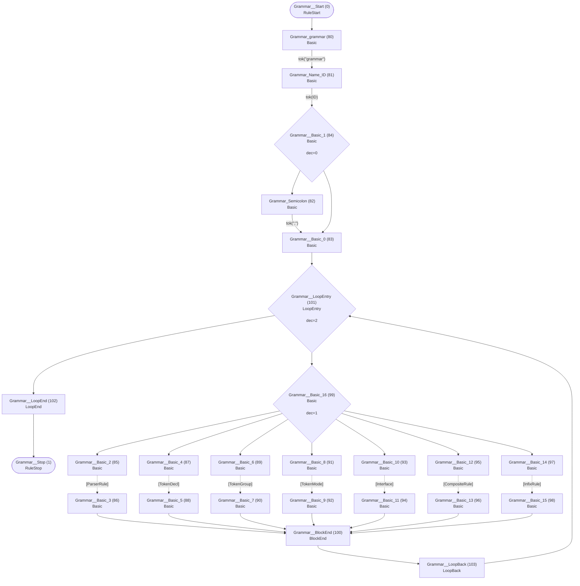
```mermaid
flowchart TD
    q0(["Grammar__Start (0)<br/>RuleStart"])
    q1(["Grammar__Stop (1)<br/>RuleStop"])
    q80["Grammar_grammar (80)<br/>Basic<br/>"]
    q81["Grammar_Name_ID (81)<br/>Basic<br/>"]
    q82["Grammar_Semicolon (82)<br/>Basic<br/>"]
    q83["Grammar__Basic_0 (83)<br/>Basic<br/>"]
    q84{"Grammar__Basic_1 (84)<br/>Basic<br/><br/>dec=0"}
    q85["Grammar__Basic_2 (85)<br/>Basic<br/>"]
    q86["Grammar__Basic_3 (86)<br/>Basic<br/>"]
    q87["Grammar__Basic_4 (87)<br/>Basic<br/>"]
    q88["Grammar__Basic_5 (88)<br/>Basic<br/>"]
    q89["Grammar__Basic_6 (89)<br/>Basic<br/>"]
    q90["Grammar__Basic_7 (90)<br/>Basic<br/>"]
    q91["Grammar__Basic_8 (91)<br/>Basic<br/>"]
    q92["Grammar__Basic_9 (92)<br/>Basic<br/>"]
    q93["Grammar__Basic_10 (93)<br/>Basic<br/>"]
    q94["Grammar__Basic_11 (94)<br/>Basic<br/>"]
    q95["Grammar__Basic_12 (95)<br/>Basic<br/>"]
    q96["Grammar__Basic_13 (96)<br/>Basic<br/>"]
    q97["Grammar__Basic_14 (97)<br/>Basic<br/>"]
    q98["Grammar__Basic_15 (98)<br/>Basic<br/>"]
    q99{"Grammar__Basic_16 (99)<br/>Basic<br/><br/>dec=1"}
    q100["Grammar__BlockEnd (100)<br/>BlockEnd<br/>"]
    q101{"Grammar__LoopEntry (101)<br/>LoopEntry<br/><br/>dec=2"}
    q102["Grammar__LoopEnd (102)<br/>LoopEnd<br/>"]
    q103["Grammar__LoopBack (103)<br/>LoopBack<br/>"]

    q0 --> q80
    q80 -->|"tok(&quot;grammar&quot;)"| q81
    q81 -->|"tok(ID)"| q84
    q82 -->|"tok(&quot;;&quot;)"| q83
    q83 --> q101
    q84 --> q82
    q84 --> q83
    q85 -.->|"[ParserRule]"| q86
    q86 --> q100
    q87 -.->|"[TokenDecl]"| q88
    q88 --> q100
    q89 -.->|"[TokenGroup]"| q90
    q90 --> q100
    q91 -.->|"[TokenMode]"| q92
    q92 --> q100
    q93 -.->|"[Interface]"| q94
    q94 --> q100
    q95 -.->|"[CompositeRule]"| q96
    q96 --> q100
    q97 -.->|"[InfixRule]"| q98
    q98 --> q100
    q99 --> q85
    q99 --> q87
    q99 --> q89
    q99 --> q91
    q99 --> q93
    q99 --> q95
    q99 --> q97
    q100 --> q103
    q101 --> q99
    q101 --> q102
    q102 --> q1
    q103 --> q101
```

## Interface

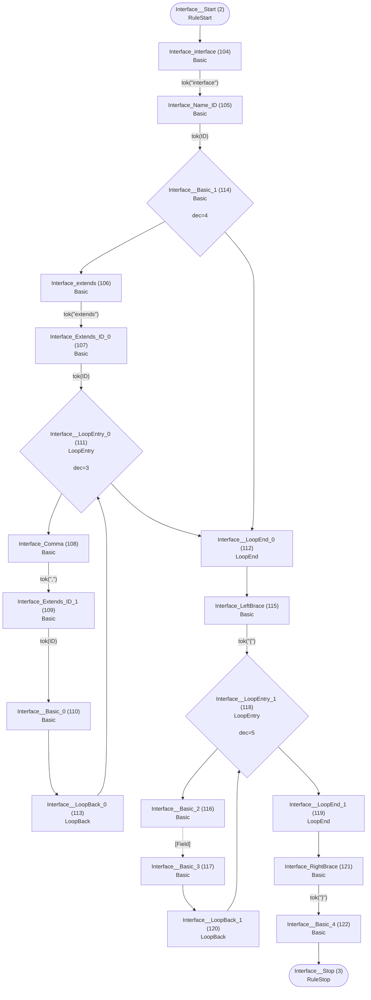
```mermaid
flowchart TD
    q2(["Interface__Start (2)<br/>RuleStart"])
    q3(["Interface__Stop (3)<br/>RuleStop"])
    q104["Interface_interface (104)<br/>Basic<br/>"]
    q105["Interface_Name_ID (105)<br/>Basic<br/>"]
    q106["Interface_extends (106)<br/>Basic<br/>"]
    q107["Interface_Extends_ID_0 (107)<br/>Basic<br/>"]
    q108["Interface_Comma (108)<br/>Basic<br/>"]
    q109["Interface_Extends_ID_1 (109)<br/>Basic<br/>"]
    q110["Interface__Basic_0 (110)<br/>Basic<br/>"]
    q111{"Interface__LoopEntry_0 (111)<br/>LoopEntry<br/><br/>dec=3"}
    q112["Interface__LoopEnd_0 (112)<br/>LoopEnd<br/>"]
    q113["Interface__LoopBack_0 (113)<br/>LoopBack<br/>"]
    q114{"Interface__Basic_1 (114)<br/>Basic<br/><br/>dec=4"}
    q115["Interface_LeftBrace (115)<br/>Basic<br/>"]
    q116["Interface__Basic_2 (116)<br/>Basic<br/>"]
    q117["Interface__Basic_3 (117)<br/>Basic<br/>"]
    q118{"Interface__LoopEntry_1 (118)<br/>LoopEntry<br/><br/>dec=5"}
    q119["Interface__LoopEnd_1 (119)<br/>LoopEnd<br/>"]
    q120["Interface__LoopBack_1 (120)<br/>LoopBack<br/>"]
    q121["Interface_RightBrace (121)<br/>Basic<br/>"]
    q122["Interface__Basic_4 (122)<br/>Basic<br/>"]

    q2 --> q104
    q104 -->|"tok(&quot;interface&quot;)"| q105
    q105 -->|"tok(ID)"| q114
    q106 -->|"tok(&quot;extends&quot;)"| q107
    q107 -->|"tok(ID)"| q111
    q108 -->|"tok(&quot;,&quot;)"| q109
    q109 -->|"tok(ID)"| q110
    q110 --> q113
    q111 --> q108
    q111 --> q112
    q112 --> q115
    q113 --> q111
    q114 --> q106
    q114 --> q112
    q115 -->|"tok(&quot;{&quot;)"| q118
    q116 -.->|"[Field]"| q117
    q117 --> q120
    q118 --> q116
    q118 --> q119
    q119 --> q121
    q120 --> q118
    q121 -->|"tok(&quot;}&quot;)"| q122
    q122 --> q3
```

## Field

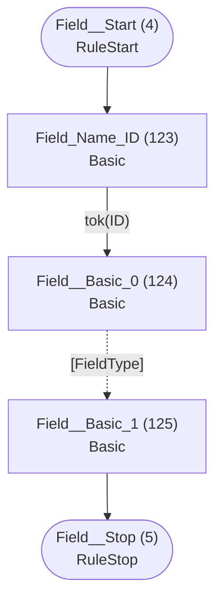
```mermaid
flowchart TD
    q4(["Field__Start (4)<br/>RuleStart"])
    q5(["Field__Stop (5)<br/>RuleStop"])
    q123["Field_Name_ID (123)<br/>Basic<br/>"]
    q124["Field__Basic_0 (124)<br/>Basic<br/>"]
    q125["Field__Basic_1 (125)<br/>Basic<br/>"]

    q4 --> q123
    q123 -->|"tok(ID)"| q124
    q124 -.->|"[FieldType]"| q125
    q125 --> q5
```

## FieldType

```mermaid
flowchart TD
    q6(["FieldType__Start (6)<br/>RuleStart"])
    q7(["FieldType__Stop (7)<br/>RuleStop"])
    q126["FieldType__Basic_0 (126)<br/>Basic<br/>"]
    q127["FieldType__Basic_1 (127)<br/>Basic<br/>"]
    q128["FieldType__Basic_2 (128)<br/>Basic<br/>"]
    q129["FieldType__Basic_3 (129)<br/>Basic<br/>"]
    q130["FieldType__Basic_4 (130)<br/>Basic<br/>"]
    q131["FieldType__Basic_5 (131)<br/>Basic<br/>"]
    q132["FieldType__Basic_6 (132)<br/>Basic<br/>"]
    q133["FieldType__Basic_7 (133)<br/>Basic<br/>"]
    q134{"FieldType__Basic_8 (134)<br/>Basic<br/><br/>dec=6"}
    q135["FieldType__BlockEnd (135)<br/>BlockEnd<br/>"]

    q6 --> q134
    q126 -.->|"[SimpleType]"| q127
    q127 --> q135
    q128 -.->|"[ReferenceType]"| q129
    q129 --> q135
    q130 -.->|"[ArrayType]"| q131
    q131 --> q135
    q132 -.->|"[PrimitiveType]"| q133
    q133 --> q135
    q134 --> q126
    q134 --> q128
    q134 --> q130
    q134 --> q132
    q135 --> q7
```

## ArrayType

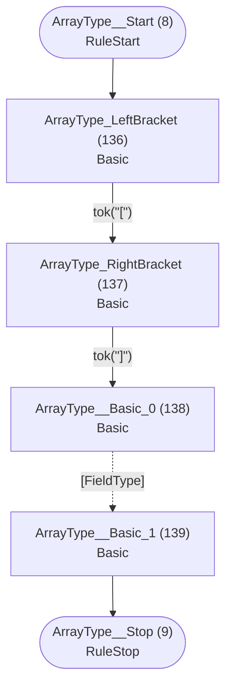
```mermaid
flowchart TD
    q8(["ArrayType__Start (8)<br/>RuleStart"])
    q9(["ArrayType__Stop (9)<br/>RuleStop"])
    q136["ArrayType_LeftBracket (136)<br/>Basic<br/>"]
    q137["ArrayType_RightBracket (137)<br/>Basic<br/>"]
    q138["ArrayType__Basic_0 (138)<br/>Basic<br/>"]
    q139["ArrayType__Basic_1 (139)<br/>Basic<br/>"]

    q8 --> q136
    q136 -->|"tok(&quot;[&quot;)"| q137
    q137 -->|"tok(&quot;]&quot;)"| q138
    q138 -.->|"[FieldType]"| q139
    q139 --> q9
```

## ReferenceType

```mermaid
flowchart TD
    q10(["ReferenceType__Start (10)<br/>RuleStart"])
    q11(["ReferenceType__Stop (11)<br/>RuleStop"])
    q140["ReferenceType_Asterisk (140)<br/>Basic<br/>"]
    q141["ReferenceType_Type_ID (141)<br/>Basic<br/>"]
    q142["ReferenceType__Basic (142)<br/>Basic<br/>"]

    q10 --> q140
    q140 -->|"tok(&quot;*&quot;)"| q141
    q141 -->|"tok(ID)"| q142
    q142 --> q11
```

## SimpleType

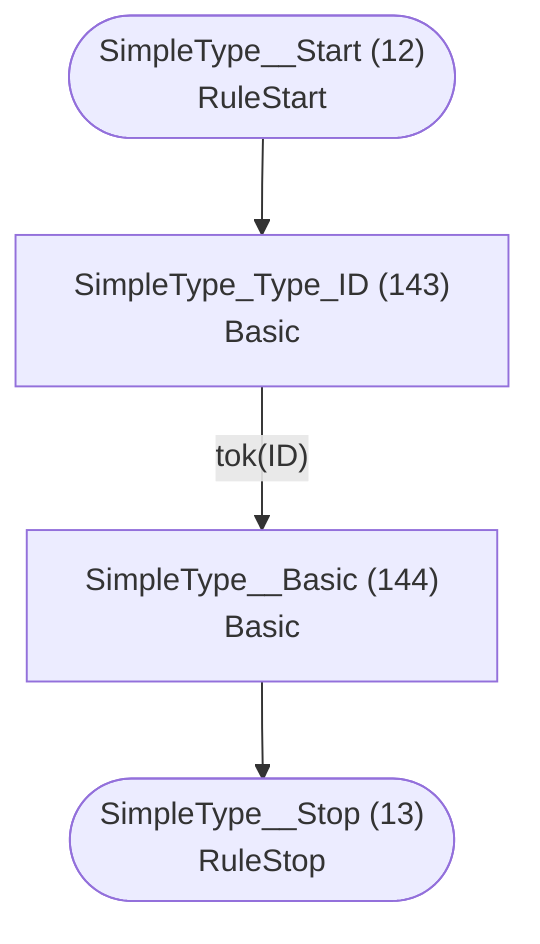
```mermaid
flowchart TD
    q12(["SimpleType__Start (12)<br/>RuleStart"])
    q13(["SimpleType__Stop (13)<br/>RuleStop"])
    q143["SimpleType_Type_ID (143)<br/>Basic<br/>"]
    q144["SimpleType__Basic (144)<br/>Basic<br/>"]

    q12 --> q143
    q143 -->|"tok(ID)"| q144
    q144 --> q13
```

## PrimitiveType

```mermaid
flowchart TD
    q14(["PrimitiveType__Start (14)<br/>RuleStart"])
    q15(["PrimitiveType__Stop (15)<br/>RuleStop"])
    q145["PrimitiveType_Type_string (145)<br/>Basic<br/>"]
    q146["PrimitiveType__Basic_0 (146)<br/>Basic<br/>"]
    q147["PrimitiveType_Type_bool (147)<br/>Basic<br/>"]
    q148["PrimitiveType__Basic_1 (148)<br/>Basic<br/>"]
    q149["PrimitiveType_Type_composite (149)<br/>Basic<br/>"]
    q150["PrimitiveType__Basic_2 (150)<br/>Basic<br/>"]
    q151{"PrimitiveType__Basic_3 (151)<br/>Basic<br/><br/>dec=7"}
    q152["PrimitiveType__BlockEnd (152)<br/>BlockEnd<br/>"]

    q14 --> q151
    q145 -->|"tok(&quot;string&quot;)"| q146
    q146 --> q152
    q147 -->|"tok(&quot;bool&quot;)"| q148
    q148 --> q152
    q149 -->|"tok(&quot;composite&quot;)"| q150
    q150 --> q152
    q151 --> q145
    q151 --> q147
    q151 --> q149
    q152 --> q15
```

## ParserRule

```mermaid
flowchart TD
    q16(["ParserRule__Start (16)<br/>RuleStart"])
    q17(["ParserRule__Stop (17)<br/>RuleStop"])
    q153["ParserRule_Entry_entry (153)<br/>Basic<br/>"]
    q154["ParserRule__Basic_0 (154)<br/>Basic<br/>"]
    q155{"ParserRule__Basic_1 (155)<br/>Basic<br/><br/>dec=8"}
    q156["ParserRule_Name_ID (156)<br/>Basic<br/>"]
    q157["ParserRule_returns (157)<br/>Basic<br/>"]
    q158["ParserRule_ReturnType_ID (158)<br/>Basic<br/>"]
    q159["ParserRule__Basic_2 (159)<br/>Basic<br/>"]
    q160{"ParserRule__Basic_3 (160)<br/>Basic<br/><br/>dec=9"}
    q161["ParserRule_Colon (161)<br/>Basic<br/>"]
    q162["ParserRule__Basic_4 (162)<br/>Basic<br/>"]
    q163["ParserRule_Semicolon (163)<br/>Basic<br/>"]
    q164["ParserRule__Basic_5 (164)<br/>Basic<br/>"]
    q165{"ParserRule__Basic_6 (165)<br/>Basic<br/><br/>dec=10"}

    q16 --> q155
    q153 -->|"tok(&quot;entry&quot;)"| q154
    q154 --> q156
    q155 --> q153
    q155 --> q154
    q156 -->|"tok(ID)"| q160
    q157 -->|"tok(&quot;returns&quot;)"| q158
    q158 -->|"tok(ID)"| q159
    q159 --> q161
    q160 --> q157
    q160 --> q159
    q161 -->|"tok(&quot;:&quot;)"| q162
    q162 -.->|"[Alternatives]"| q165
    q163 -->|"tok(&quot;;&quot;)"| q164
    q164 --> q17
    q165 --> q163
    q165 --> q164
```

## TokenDecl

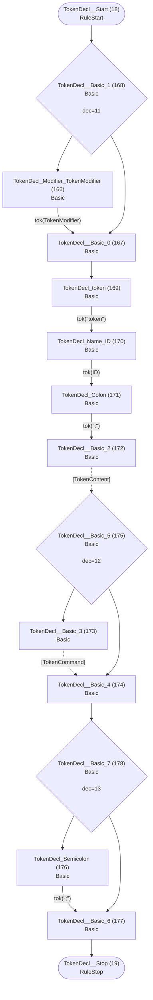
```mermaid
flowchart TD
    q18(["TokenDecl__Start (18)<br/>RuleStart"])
    q19(["TokenDecl__Stop (19)<br/>RuleStop"])
    q166["TokenDecl_Modifier_TokenModifier (166)<br/>Basic<br/>"]
    q167["TokenDecl__Basic_0 (167)<br/>Basic<br/>"]
    q168{"TokenDecl__Basic_1 (168)<br/>Basic<br/><br/>dec=11"}
    q169["TokenDecl_token (169)<br/>Basic<br/>"]
    q170["TokenDecl_Name_ID (170)<br/>Basic<br/>"]
    q171["TokenDecl_Colon (171)<br/>Basic<br/>"]
    q172["TokenDecl__Basic_2 (172)<br/>Basic<br/>"]
    q173["TokenDecl__Basic_3 (173)<br/>Basic<br/>"]
    q174["TokenDecl__Basic_4 (174)<br/>Basic<br/>"]
    q175{"TokenDecl__Basic_5 (175)<br/>Basic<br/><br/>dec=12"}
    q176["TokenDecl_Semicolon (176)<br/>Basic<br/>"]
    q177["TokenDecl__Basic_6 (177)<br/>Basic<br/>"]
    q178{"TokenDecl__Basic_7 (178)<br/>Basic<br/><br/>dec=13"}

    q18 --> q168
    q166 -->|"tok(TokenModifier)"| q167
    q167 --> q169
    q168 --> q166
    q168 --> q167
    q169 -->|"tok(&quot;token&quot;)"| q170
    q170 -->|"tok(ID)"| q171
    q171 -->|"tok(&quot;:&quot;)"| q172
    q172 -.->|"[TokenContent]"| q175
    q173 -.->|"[TokenCommand]"| q174
    q174 --> q178
    q175 --> q173
    q175 --> q174
    q176 -->|"tok(&quot;;&quot;)"| q177
    q177 --> q19
    q178 --> q176
    q178 --> q177
```

## TokenContent

```mermaid
flowchart TD
    q20(["TokenContent__Start (20)<br/>RuleStart"])
    q21(["TokenContent__Stop (21)<br/>RuleStop"])
    q179["TokenContent__Basic_0 (179)<br/>Basic<br/>"]
    q180["TokenContent__Basic_1 (180)<br/>Basic<br/>"]
    q181["TokenContent__Basic_2 (181)<br/>Basic<br/>"]
    q182["TokenContent__Basic_3 (182)<br/>Basic<br/>"]
    q183{"TokenContent__Basic_4 (183)<br/>Basic<br/><br/>dec=14"}
    q184["TokenContent__BlockEnd (184)<br/>BlockEnd<br/>"]

    q20 --> q183
    q179 -.->|"[RegexpTokenContent]"| q180
    q180 --> q184
    q181 -.->|"[KeywordTokenContent]"| q182
    q182 --> q184
    q183 --> q179
    q183 --> q181
    q184 --> q21
```

## RegexpTokenContent

```mermaid
flowchart TD
    q22(["RegexpTokenContent__Start (22)<br/>RuleStart"])
    q23(["RegexpTokenContent__Stop (23)<br/>RuleStop"])
    q185["RegexpTokenContent_Regexp_RegexLiteral (185)<br/>Basic<br/>"]
    q186["RegexpTokenContent__Basic (186)<br/>Basic<br/>"]

    q22 --> q185
    q185 -->|"tok(RegexLiteral)"| q186
    q186 --> q23
```

## KeywordTokenContent

```mermaid
flowchart TD
    q24(["KeywordTokenContent__Start (24)<br/>RuleStart"])
    q25(["KeywordTokenContent__Stop (25)<br/>RuleStop"])
    q187["KeywordTokenContent__Basic_0 (187)<br/>Basic<br/>"]
    q188["KeywordTokenContent__Basic_1 (188)<br/>Basic<br/>"]

    q24 --> q187
    q187 -.->|"[Keyword]"| q188
    q188 --> q25
```

## TokenCommand

```mermaid
flowchart TD
    q26(["TokenCommand__Start (26)<br/>RuleStart"])
    q27(["TokenCommand__Stop (27)<br/>RuleStop"])
    q189["TokenCommand_DashGreaterThan (189)<br/>Basic<br/>"]
    q190["TokenCommand_Type_push (190)<br/>Basic<br/>"]
    q191["TokenCommand__Basic_0 (191)<br/>Basic<br/>"]
    q192["TokenCommand_Type_pop (192)<br/>Basic<br/>"]
    q193["TokenCommand__Basic_1 (193)<br/>Basic<br/>"]
    q194["TokenCommand_Type_mode (194)<br/>Basic<br/>"]
    q195["TokenCommand__Basic_2 (195)<br/>Basic<br/>"]
    q196{"TokenCommand__Basic_3 (196)<br/>Basic<br/><br/>dec=15"}
    q197["TokenCommand__BlockEnd_0 (197)<br/>BlockEnd<br/>"]
    q198["TokenCommand_LeftParen (198)<br/>Basic<br/>"]
    q199["TokenCommand_Mode_ID (199)<br/>Basic<br/>"]
    q200["TokenCommand__Basic_4 (200)<br/>Basic<br/>"]
    q201["TokenCommand_Default_default (201)<br/>Basic<br/>"]
    q202["TokenCommand__Basic_5 (202)<br/>Basic<br/>"]
    q203{"TokenCommand__Basic_6 (203)<br/>Basic<br/><br/>dec=16"}
    q204["TokenCommand__BlockEnd_1 (204)<br/>BlockEnd<br/>"]
    q205["TokenCommand_RightParen (205)<br/>Basic<br/>"]
    q206["TokenCommand__Basic_7 (206)<br/>Basic<br/>"]
    q207{"TokenCommand__Basic_8 (207)<br/>Basic<br/><br/>dec=17"}

    q26 --> q189
    q189 -->|"tok(&quot;->&quot;)"| q196
    q190 -->|"tok(&quot;push&quot;)"| q191
    q191 --> q197
    q192 -->|"tok(&quot;pop&quot;)"| q193
    q193 --> q197
    q194 -->|"tok(&quot;mode&quot;)"| q195
    q195 --> q197
    q196 --> q190
    q196 --> q192
    q196 --> q194
    q197 --> q207
    q198 -->|"tok(&quot;(&quot;)"| q203
    q199 -->|"tok(ID)"| q200
    q200 --> q204
    q201 -->|"tok(&quot;default&quot;)"| q202
    q202 --> q204
    q203 --> q199
    q203 --> q201
    q204 --> q205
    q205 -->|"tok(&quot;)&quot;)"| q206
    q206 --> q27
    q207 --> q198
    q207 --> q206
```

## TokenGroup

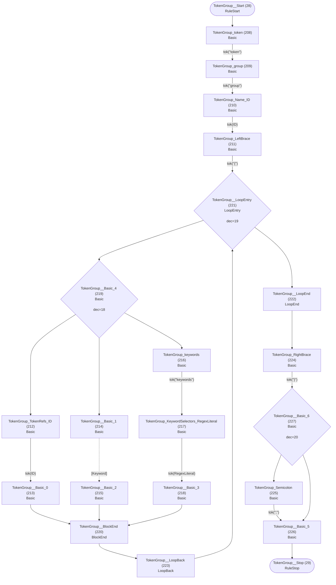
```mermaid
flowchart TD
    q28(["TokenGroup__Start (28)<br/>RuleStart"])
    q29(["TokenGroup__Stop (29)<br/>RuleStop"])
    q208["TokenGroup_token (208)<br/>Basic<br/>"]
    q209["TokenGroup_group (209)<br/>Basic<br/>"]
    q210["TokenGroup_Name_ID (210)<br/>Basic<br/>"]
    q211["TokenGroup_LeftBrace (211)<br/>Basic<br/>"]
    q212["TokenGroup_TokenRefs_ID (212)<br/>Basic<br/>"]
    q213["TokenGroup__Basic_0 (213)<br/>Basic<br/>"]
    q214["TokenGroup__Basic_1 (214)<br/>Basic<br/>"]
    q215["TokenGroup__Basic_2 (215)<br/>Basic<br/>"]
    q216["TokenGroup_keywords (216)<br/>Basic<br/>"]
    q217["TokenGroup_KeywordSelectors_RegexLiteral (217)<br/>Basic<br/>"]
    q218["TokenGroup__Basic_3 (218)<br/>Basic<br/>"]
    q219{"TokenGroup__Basic_4 (219)<br/>Basic<br/><br/>dec=18"}
    q220["TokenGroup__BlockEnd (220)<br/>BlockEnd<br/>"]
    q221{"TokenGroup__LoopEntry (221)<br/>LoopEntry<br/><br/>dec=19"}
    q222["TokenGroup__LoopEnd (222)<br/>LoopEnd<br/>"]
    q223["TokenGroup__LoopBack (223)<br/>LoopBack<br/>"]
    q224["TokenGroup_RightBrace (224)<br/>Basic<br/>"]
    q225["TokenGroup_Semicolon (225)<br/>Basic<br/>"]
    q226["TokenGroup__Basic_5 (226)<br/>Basic<br/>"]
    q227{"TokenGroup__Basic_6 (227)<br/>Basic<br/><br/>dec=20"}

    q28 --> q208
    q208 -->|"tok(&quot;token&quot;)"| q209
    q209 -->|"tok(&quot;group&quot;)"| q210
    q210 -->|"tok(ID)"| q211
    q211 -->|"tok(&quot;{&quot;)"| q221
    q212 -->|"tok(ID)"| q213
    q213 --> q220
    q214 -.->|"[Keyword]"| q215
    q215 --> q220
    q216 -->|"tok(&quot;keywords&quot;)"| q217
    q217 -->|"tok(RegexLiteral)"| q218
    q218 --> q220
    q219 --> q212
    q219 --> q214
    q219 --> q216
    q220 --> q223
    q221 --> q219
    q221 --> q222
    q222 --> q224
    q223 --> q221
    q224 -->|"tok(&quot;}&quot;)"| q227
    q225 -->|"tok(&quot;;&quot;)"| q226
    q226 --> q29
    q227 --> q225
    q227 --> q226
```

## TokenMode

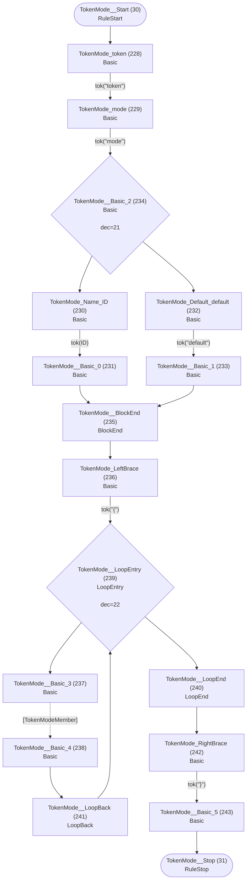
```mermaid
flowchart TD
    q30(["TokenMode__Start (30)<br/>RuleStart"])
    q31(["TokenMode__Stop (31)<br/>RuleStop"])
    q228["TokenMode_token (228)<br/>Basic<br/>"]
    q229["TokenMode_mode (229)<br/>Basic<br/>"]
    q230["TokenMode_Name_ID (230)<br/>Basic<br/>"]
    q231["TokenMode__Basic_0 (231)<br/>Basic<br/>"]
    q232["TokenMode_Default_default (232)<br/>Basic<br/>"]
    q233["TokenMode__Basic_1 (233)<br/>Basic<br/>"]
    q234{"TokenMode__Basic_2 (234)<br/>Basic<br/><br/>dec=21"}
    q235["TokenMode__BlockEnd (235)<br/>BlockEnd<br/>"]
    q236["TokenMode_LeftBrace (236)<br/>Basic<br/>"]
    q237["TokenMode__Basic_3 (237)<br/>Basic<br/>"]
    q238["TokenMode__Basic_4 (238)<br/>Basic<br/>"]
    q239{"TokenMode__LoopEntry (239)<br/>LoopEntry<br/><br/>dec=22"}
    q240["TokenMode__LoopEnd (240)<br/>LoopEnd<br/>"]
    q241["TokenMode__LoopBack (241)<br/>LoopBack<br/>"]
    q242["TokenMode_RightBrace (242)<br/>Basic<br/>"]
    q243["TokenMode__Basic_5 (243)<br/>Basic<br/>"]

    q30 --> q228
    q228 -->|"tok(&quot;token&quot;)"| q229
    q229 -->|"tok(&quot;mode&quot;)"| q234
    q230 -->|"tok(ID)"| q231
    q231 --> q235
    q232 -->|"tok(&quot;default&quot;)"| q233
    q233 --> q235
    q234 --> q230
    q234 --> q232
    q235 --> q236
    q236 -->|"tok(&quot;{&quot;)"| q239
    q237 -.->|"[TokenModeMember]"| q238
    q238 --> q241
    q239 --> q237
    q239 --> q240
    q240 --> q242
    q241 --> q239
    q242 -->|"tok(&quot;}&quot;)"| q243
    q243 --> q31
```

## TokenModeMember

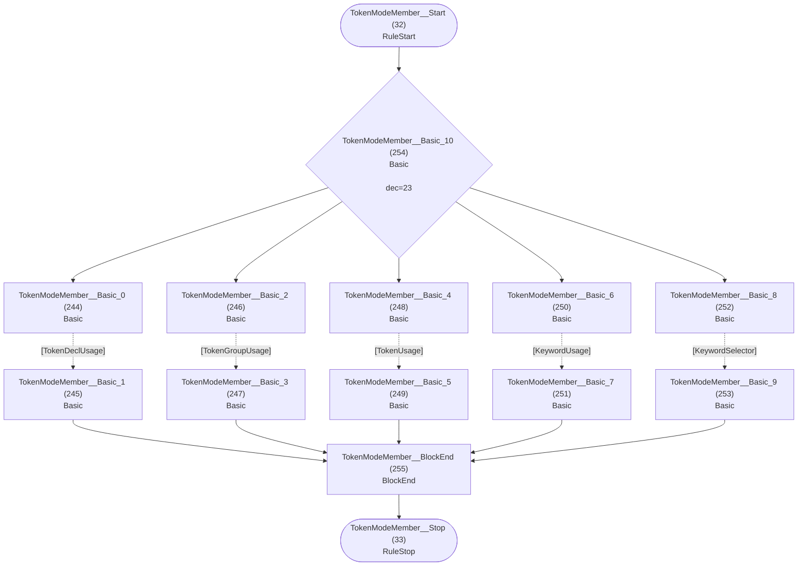
```mermaid
flowchart TD
    q32(["TokenModeMember__Start (32)<br/>RuleStart"])
    q33(["TokenModeMember__Stop (33)<br/>RuleStop"])
    q244["TokenModeMember__Basic_0 (244)<br/>Basic<br/>"]
    q245["TokenModeMember__Basic_1 (245)<br/>Basic<br/>"]
    q246["TokenModeMember__Basic_2 (246)<br/>Basic<br/>"]
    q247["TokenModeMember__Basic_3 (247)<br/>Basic<br/>"]
    q248["TokenModeMember__Basic_4 (248)<br/>Basic<br/>"]
    q249["TokenModeMember__Basic_5 (249)<br/>Basic<br/>"]
    q250["TokenModeMember__Basic_6 (250)<br/>Basic<br/>"]
    q251["TokenModeMember__Basic_7 (251)<br/>Basic<br/>"]
    q252["TokenModeMember__Basic_8 (252)<br/>Basic<br/>"]
    q253["TokenModeMember__Basic_9 (253)<br/>Basic<br/>"]
    q254{"TokenModeMember__Basic_10 (254)<br/>Basic<br/><br/>dec=23"}
    q255["TokenModeMember__BlockEnd (255)<br/>BlockEnd<br/>"]

    q32 --> q254
    q244 -.->|"[TokenDeclUsage]"| q245
    q245 --> q255
    q246 -.->|"[TokenGroupUsage]"| q247
    q247 --> q255
    q248 -.->|"[TokenUsage]"| q249
    q249 --> q255
    q250 -.->|"[KeywordUsage]"| q251
    q251 --> q255
    q252 -.->|"[KeywordSelector]"| q253
    q253 --> q255
    q254 --> q244
    q254 --> q246
    q254 --> q248
    q254 --> q250
    q254 --> q252
    q255 --> q33
```

## TokenDeclUsage

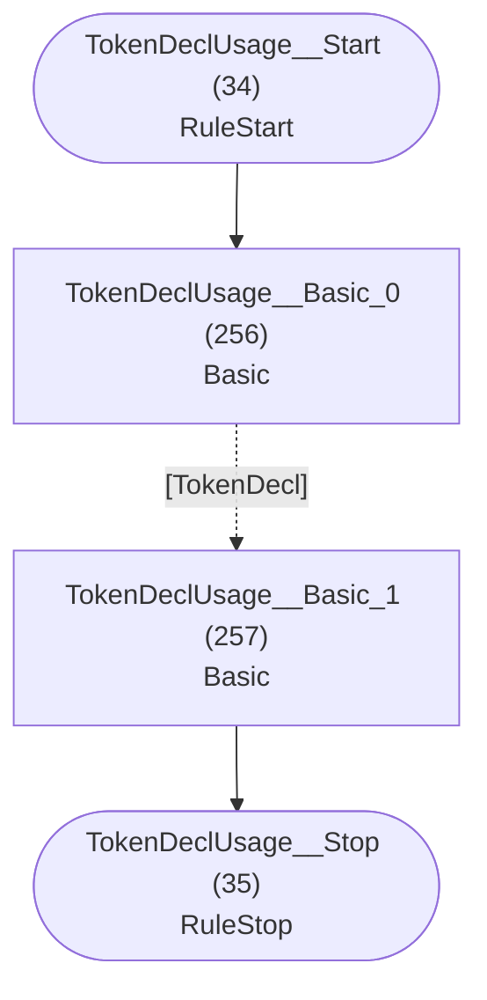
```mermaid
flowchart TD
    q34(["TokenDeclUsage__Start (34)<br/>RuleStart"])
    q35(["TokenDeclUsage__Stop (35)<br/>RuleStop"])
    q256["TokenDeclUsage__Basic_0 (256)<br/>Basic<br/>"]
    q257["TokenDeclUsage__Basic_1 (257)<br/>Basic<br/>"]

    q34 --> q256
    q256 -.->|"[TokenDecl]"| q257
    q257 --> q35
```

## TokenGroupUsage

```mermaid
flowchart TD
    q36(["TokenGroupUsage__Start (36)<br/>RuleStart"])
    q37(["TokenGroupUsage__Stop (37)<br/>RuleStop"])
    q258["TokenGroupUsage__Basic_0 (258)<br/>Basic<br/>"]
    q259["TokenGroupUsage__Basic_1 (259)<br/>Basic<br/>"]

    q36 --> q258
    q258 -.->|"[TokenGroup]"| q259
    q259 --> q37
```

## TokenUsage

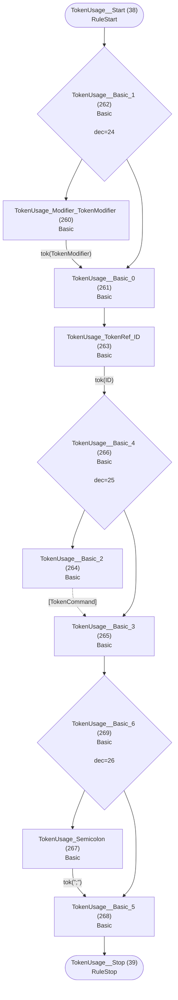
```mermaid
flowchart TD
    q38(["TokenUsage__Start (38)<br/>RuleStart"])
    q39(["TokenUsage__Stop (39)<br/>RuleStop"])
    q260["TokenUsage_Modifier_TokenModifier (260)<br/>Basic<br/>"]
    q261["TokenUsage__Basic_0 (261)<br/>Basic<br/>"]
    q262{"TokenUsage__Basic_1 (262)<br/>Basic<br/><br/>dec=24"}
    q263["TokenUsage_TokenRef_ID (263)<br/>Basic<br/>"]
    q264["TokenUsage__Basic_2 (264)<br/>Basic<br/>"]
    q265["TokenUsage__Basic_3 (265)<br/>Basic<br/>"]
    q266{"TokenUsage__Basic_4 (266)<br/>Basic<br/><br/>dec=25"}
    q267["TokenUsage_Semicolon (267)<br/>Basic<br/>"]
    q268["TokenUsage__Basic_5 (268)<br/>Basic<br/>"]
    q269{"TokenUsage__Basic_6 (269)<br/>Basic<br/><br/>dec=26"}

    q38 --> q262
    q260 -->|"tok(TokenModifier)"| q261
    q261 --> q263
    q262 --> q260
    q262 --> q261
    q263 -->|"tok(ID)"| q266
    q264 -.->|"[TokenCommand]"| q265
    q265 --> q269
    q266 --> q264
    q266 --> q265
    q267 -->|"tok(&quot;;&quot;)"| q268
    q268 --> q39
    q269 --> q267
    q269 --> q268
```

## KeywordUsage

```mermaid
flowchart TD
    q40(["KeywordUsage__Start (40)<br/>RuleStart"])
    q41(["KeywordUsage__Stop (41)<br/>RuleStop"])
    q270["KeywordUsage_Modifier_TokenModifier (270)<br/>Basic<br/>"]
    q271["KeywordUsage__Basic_0 (271)<br/>Basic<br/>"]
    q272{"KeywordUsage__Basic_1 (272)<br/>Basic<br/><br/>dec=27"}
    q273["KeywordUsage__Basic_2 (273)<br/>Basic<br/>"]
    q274["KeywordUsage__Basic_3 (274)<br/>Basic<br/>"]
    q275["KeywordUsage__Basic_4 (275)<br/>Basic<br/>"]
    q276{"KeywordUsage__Basic_5 (276)<br/>Basic<br/><br/>dec=28"}
    q277["KeywordUsage_Semicolon (277)<br/>Basic<br/>"]
    q278["KeywordUsage__Basic_6 (278)<br/>Basic<br/>"]
    q279{"KeywordUsage__Basic_7 (279)<br/>Basic<br/><br/>dec=29"}

    q40 --> q272
    q270 -->|"tok(TokenModifier)"| q271
    q271 --> q273
    q272 --> q270
    q272 --> q271
    q273 -.->|"[Keyword]"| q276
    q274 -.->|"[TokenCommand]"| q275
    q275 --> q279
    q276 --> q274
    q276 --> q275
    q277 -->|"tok(&quot;;&quot;)"| q278
    q278 --> q41
    q279 --> q277
    q279 --> q278
```

## KeywordSelector

```mermaid
flowchart TD
    q42(["KeywordSelector__Start (42)<br/>RuleStart"])
    q43(["KeywordSelector__Stop (43)<br/>RuleStop"])
    q280["KeywordSelector_keywords (280)<br/>Basic<br/>"]
    q281["KeywordSelector_Selector_RegexLiteral (281)<br/>Basic<br/>"]
    q282["KeywordSelector_Semicolon (282)<br/>Basic<br/>"]
    q283["KeywordSelector__Basic_0 (283)<br/>Basic<br/>"]
    q284{"KeywordSelector__Basic_1 (284)<br/>Basic<br/><br/>dec=30"}

    q42 --> q280
    q280 -->|"tok(&quot;keywords&quot;)"| q281
    q281 -->|"tok(RegexLiteral)"| q284
    q282 -->|"tok(&quot;;&quot;)"| q283
    q283 --> q43
    q284 --> q282
    q284 --> q283
```

## Alternatives

```mermaid
flowchart TD
    q44(["Alternatives__Start (44)<br/>RuleStart"])
    q45(["Alternatives__Stop (45)<br/>RuleStop"])
    q285["Alternatives__Basic_0 (285)<br/>Basic<br/>"]
    q286["Alternatives_Pipe (286)<br/>Basic<br/>"]
    q287["Alternatives__Basic_1 (287)<br/>Basic<br/>"]
    q288["Alternatives__Basic_2 (288)<br/>Basic<br/>"]
    q289{"Alternatives__LoopBack (289)<br/>LoopBack<br/><br/>dec=31"}
    q290["Alternatives__LoopEnd (290)<br/>LoopEnd<br/>"]
    q291{"Alternatives__Basic_3 (291)<br/>Basic<br/><br/>dec=32"}

    q44 --> q285
    q285 -.->|"[Group]"| q291
    q286 -->|"tok(&quot;|&quot;)"| q287
    q287 -.->|"[Group]"| q288
    q288 --> q289
    q289 --> q286
    q289 --> q290
    q290 --> q45
    q291 --> q286
    q291 --> q290
```

## Group

```mermaid
flowchart TD
    q46(["Group__Start (46)<br/>RuleStart"])
    q47(["Group__Stop (47)<br/>RuleStop"])
    q292["Group__Basic_0 (292)<br/>Basic<br/>"]
    q293["Group__Basic_1 (293)<br/>Basic<br/>"]
    q294["Group__Basic_2 (294)<br/>Basic<br/>"]
    q295{"Group__LoopBack (295)<br/>LoopBack<br/><br/>dec=33"}
    q296["Group__LoopEnd (296)<br/>LoopEnd<br/>"]
    q297{"Group__Basic_3 (297)<br/>Basic<br/><br/>dec=34"}

    q46 --> q292
    q292 -.->|"[Element]"| q297
    q293 -.->|"[Element]"| q294
    q294 --> q295
    q295 --> q293
    q295 --> q296
    q296 --> q47
    q297 --> q293
    q297 --> q296
```

## Element

```mermaid
flowchart TD
    q48(["Element__Start (48)<br/>RuleStart"])
    q49(["Element__Stop (49)<br/>RuleStop"])
    q298["Element__Basic_0 (298)<br/>Basic<br/>"]
    q299["Element__Basic_1 (299)<br/>Basic<br/>"]
    q300["Element__Basic_2 (300)<br/>Basic<br/>"]
    q301["Element__Basic_3 (301)<br/>Basic<br/>"]
    q302["Element__Basic_4 (302)<br/>Basic<br/>"]
    q303["Element__Basic_5 (303)<br/>Basic<br/>"]
    q304["Element__Basic_6 (304)<br/>Basic<br/>"]
    q305["Element__Basic_7 (305)<br/>Basic<br/>"]
    q306["Element_LeftParen (306)<br/>Basic<br/>"]
    q307["Element__Basic_8 (307)<br/>Basic<br/>"]
    q308["Element_RightParen (308)<br/>Basic<br/>"]
    q309["Element__Basic_9 (309)<br/>Basic<br/>"]
    q310{"Element__Basic_10 (310)<br/>Basic<br/><br/>dec=35"}
    q311["Element__BlockEnd (311)<br/>BlockEnd<br/>"]
    q312["Element_Cardinality_Cardinality (312)<br/>Basic<br/>"]
    q313["Element__Basic_11 (313)<br/>Basic<br/>"]
    q314{"Element__Basic_12 (314)<br/>Basic<br/><br/>dec=36"}

    q48 --> q310
    q298 -.->|"[Keyword]"| q299
    q299 --> q311
    q300 -.->|"[Assignment]"| q301
    q301 --> q311
    q302 -.->|"[RuleCall]"| q303
    q303 --> q311
    q304 -.->|"[Action]"| q305
    q305 --> q311
    q306 -->|"tok(&quot;(&quot;)"| q307
    q307 -.->|"[Alternatives]"| q308
    q308 -->|"tok(&quot;)&quot;)"| q309
    q309 --> q311
    q310 --> q298
    q310 --> q300
    q310 --> q302
    q310 --> q304
    q310 --> q306
    q311 --> q314
    q312 -->|"tok(Cardinality)"| q313
    q313 --> q49
    q314 --> q312
    q314 --> q313
```

## Keyword

```mermaid
flowchart TD
    q50(["Keyword__Start (50)<br/>RuleStart"])
    q51(["Keyword__Stop (51)<br/>RuleStop"])
    q315["Keyword_Value_StringLiteral (315)<br/>Basic<br/>"]
    q316["Keyword__Basic (316)<br/>Basic<br/>"]

    q50 --> q315
    q315 -->|"tok(StringLiteral)"| q316
    q316 --> q51
```

## Assignment

```mermaid
flowchart TD
    q52(["Assignment__Start (52)<br/>RuleStart"])
    q53(["Assignment__Stop (53)<br/>RuleStop"])
    q317["Assignment_Property_ID (317)<br/>Basic<br/>"]
    q318["Assignment_Operator_PlusEquals (318)<br/>Basic<br/>"]
    q319["Assignment__Basic_0 (319)<br/>Basic<br/>"]
    q320["Assignment_Operator_Equals (320)<br/>Basic<br/>"]
    q321["Assignment__Basic_1 (321)<br/>Basic<br/>"]
    q322["Assignment_Operator_QuestionEquals (322)<br/>Basic<br/>"]
    q323["Assignment__Basic_2 (323)<br/>Basic<br/>"]
    q324{"Assignment__Basic_3 (324)<br/>Basic<br/><br/>dec=37"}
    q325["Assignment__BlockEnd (325)<br/>BlockEnd<br/>"]
    q326["Assignment__Basic_4 (326)<br/>Basic<br/>"]
    q327["Assignment__Basic_5 (327)<br/>Basic<br/>"]

    q52 --> q317
    q317 -->|"tok(ID)"| q324
    q318 -->|"tok(&quot;+=&quot;)"| q319
    q319 --> q325
    q320 -->|"tok(&quot;=&quot;)"| q321
    q321 --> q325
    q322 -->|"tok(&quot;?=&quot;)"| q323
    q323 --> q325
    q324 --> q318
    q324 --> q320
    q324 --> q322
    q325 --> q326
    q326 -.->|"[Assignable]"| q327
    q327 --> q53
```

## Assignable

```mermaid
flowchart TD
    q54(["Assignable__Start (54)<br/>RuleStart"])
    q55(["Assignable__Stop (55)<br/>RuleStop"])
    q328["Assignable__Basic_0 (328)<br/>Basic<br/>"]
    q329["Assignable__Basic_1 (329)<br/>Basic<br/>"]
    q330["Assignable__Basic_2 (330)<br/>Basic<br/>"]
    q331["Assignable__Basic_3 (331)<br/>Basic<br/>"]
    q332["Assignable__Basic_4 (332)<br/>Basic<br/>"]
    q333["Assignable__Basic_5 (333)<br/>Basic<br/>"]
    q334["Assignable_LeftParen (334)<br/>Basic<br/>"]
    q335["Assignable__Basic_6 (335)<br/>Basic<br/>"]
    q336["Assignable_RightParen (336)<br/>Basic<br/>"]
    q337["Assignable__Basic_7 (337)<br/>Basic<br/>"]
    q338{"Assignable__Basic_8 (338)<br/>Basic<br/><br/>dec=38"}
    q339["Assignable__BlockEnd (339)<br/>BlockEnd<br/>"]

    q54 --> q338
    q328 -.->|"[Keyword]"| q329
    q329 --> q339
    q330 -.->|"[RuleCall]"| q331
    q331 --> q339
    q332 -.->|"[CrossRef]"| q333
    q333 --> q339
    q334 -->|"tok(&quot;(&quot;)"| q335
    q335 -.->|"[AssignableAlternatives]"| q336
    q336 -->|"tok(&quot;)&quot;)"| q337
    q337 --> q339
    q338 --> q328
    q338 --> q330
    q338 --> q332
    q338 --> q334
    q339 --> q55
```

## AssignableWithoutAlts

```mermaid
flowchart TD
    q56(["AssignableWithoutAlts__Start (56)<br/>RuleStart"])
    q57(["AssignableWithoutAlts__Stop (57)<br/>RuleStop"])
    q340["AssignableWithoutAlts__Basic_0 (340)<br/>Basic<br/>"]
    q341["AssignableWithoutAlts__Basic_1 (341)<br/>Basic<br/>"]
    q342["AssignableWithoutAlts__Basic_2 (342)<br/>Basic<br/>"]
    q343["AssignableWithoutAlts__Basic_3 (343)<br/>Basic<br/>"]
    q344["AssignableWithoutAlts__Basic_4 (344)<br/>Basic<br/>"]
    q345["AssignableWithoutAlts__Basic_5 (345)<br/>Basic<br/>"]
    q346{"AssignableWithoutAlts__Basic_6 (346)<br/>Basic<br/><br/>dec=39"}
    q347["AssignableWithoutAlts__BlockEnd (347)<br/>BlockEnd<br/>"]

    q56 --> q346
    q340 -.->|"[Keyword]"| q341
    q341 --> q347
    q342 -.->|"[RuleCall]"| q343
    q343 --> q347
    q344 -.->|"[CrossRef]"| q345
    q345 --> q347
    q346 --> q340
    q346 --> q342
    q346 --> q344
    q347 --> q57
```

## AssignableAlternatives

```mermaid
flowchart TD
    q58(["AssignableAlternatives__Start (58)<br/>RuleStart"])
    q59(["AssignableAlternatives__Stop (59)<br/>RuleStop"])
    q348["AssignableAlternatives__Basic_0 (348)<br/>Basic<br/>"]
    q349["AssignableAlternatives_Pipe (349)<br/>Basic<br/>"]
    q350["AssignableAlternatives__Basic_1 (350)<br/>Basic<br/>"]
    q351["AssignableAlternatives__Basic_2 (351)<br/>Basic<br/>"]
    q352{"AssignableAlternatives__LoopBack (352)<br/>LoopBack<br/><br/>dec=40"}
    q353["AssignableAlternatives__LoopEnd (353)<br/>LoopEnd<br/>"]
    q354{"AssignableAlternatives__Basic_3 (354)<br/>Basic<br/><br/>dec=41"}

    q58 --> q348
    q348 -.->|"[AssignableWithoutAlts]"| q354
    q349 -->|"tok(&quot;|&quot;)"| q350
    q350 -.->|"[AssignableWithoutAlts]"| q351
    q351 --> q352
    q352 --> q349
    q352 --> q353
    q353 --> q59
    q354 --> q349
    q354 --> q353
```

## CrossRef

```mermaid
flowchart TD
    q60(["CrossRef__Start (60)<br/>RuleStart"])
    q61(["CrossRef__Stop (61)<br/>RuleStop"])
    q355["CrossRef_LeftBracket (355)<br/>Basic<br/>"]
    q356["CrossRef_Type_ID (356)<br/>Basic<br/>"]
    q357["CrossRef_Colon (357)<br/>Basic<br/>"]
    q358["CrossRef__Basic_0 (358)<br/>Basic<br/>"]
    q359["CrossRef__Basic_1 (359)<br/>Basic<br/>"]
    q360{"CrossRef__Basic_2 (360)<br/>Basic<br/><br/>dec=42"}
    q361["CrossRef_RightBracket (361)<br/>Basic<br/>"]
    q362["CrossRef__Basic_3 (362)<br/>Basic<br/>"]

    q60 --> q355
    q355 -->|"tok(&quot;[&quot;)"| q356
    q356 -->|"tok(ID)"| q360
    q357 -->|"tok(&quot;:&quot;)"| q358
    q358 -.->|"[RuleCall]"| q359
    q359 --> q361
    q360 --> q357
    q360 --> q359
    q361 -->|"tok(&quot;]&quot;)"| q362
    q362 --> q61
```

## RuleCall

```mermaid
flowchart TD
    q62(["RuleCall__Start (62)<br/>RuleStart"])
    q63(["RuleCall__Stop (63)<br/>RuleStop"])
    q363["RuleCall_Rule_ID (363)<br/>Basic<br/>"]
    q364["RuleCall__Basic (364)<br/>Basic<br/>"]

    q62 --> q363
    q363 -->|"tok(ID)"| q364
    q364 --> q63
```

## Action

```mermaid
flowchart TD
    q64(["Action__Start (64)<br/>RuleStart"])
    q65(["Action__Stop (65)<br/>RuleStop"])
    q365["Action_LeftBrace (365)<br/>Basic<br/>"]
    q366["Action_Type_ID (366)<br/>Basic<br/>"]
    q367["Action_Dot (367)<br/>Basic<br/>"]
    q368["Action_Property_ID (368)<br/>Basic<br/>"]
    q369["Action_Operator_PlusEquals (369)<br/>Basic<br/>"]
    q370["Action__Basic_0 (370)<br/>Basic<br/>"]
    q371["Action_Operator_Equals (371)<br/>Basic<br/>"]
    q372["Action__Basic_1 (372)<br/>Basic<br/>"]
    q373{"Action__Basic_2 (373)<br/>Basic<br/><br/>dec=43"}
    q374["Action__BlockEnd (374)<br/>BlockEnd<br/>"]
    q375["Action_current (375)<br/>Basic<br/>"]
    q376["Action__Basic_3 (376)<br/>Basic<br/>"]
    q377{"Action__Basic_4 (377)<br/>Basic<br/><br/>dec=44"}
    q378["Action_RightBrace (378)<br/>Basic<br/>"]
    q379["Action__Basic_5 (379)<br/>Basic<br/>"]

    q64 --> q365
    q365 -->|"tok(&quot;{&quot;)"| q366
    q366 -->|"tok(ID)"| q377
    q367 -->|"tok(&quot;.&quot;)"| q368
    q368 -->|"tok(ID)"| q373
    q369 -->|"tok(&quot;+=&quot;)"| q370
    q370 --> q374
    q371 -->|"tok(&quot;=&quot;)"| q372
    q372 --> q374
    q373 --> q369
    q373 --> q371
    q374 --> q375
    q375 -->|"tok(&quot;current&quot;)"| q376
    q376 --> q378
    q377 --> q367
    q377 --> q376
    q378 -->|"tok(&quot;}&quot;)"| q379
    q379 --> q65
```

## CompositeRule

```mermaid
flowchart TD
    q66(["CompositeRule__Start (66)<br/>RuleStart"])
    q67(["CompositeRule__Stop (67)<br/>RuleStop"])
    q380["CompositeRule_composite (380)<br/>Basic<br/>"]
    q381["CompositeRule_Name_ID (381)<br/>Basic<br/>"]
    q382["CompositeRule_Colon (382)<br/>Basic<br/>"]
    q383["CompositeRule__Basic_0 (383)<br/>Basic<br/>"]
    q384["CompositeRule_Semicolon (384)<br/>Basic<br/>"]
    q385["CompositeRule__Basic_1 (385)<br/>Basic<br/>"]
    q386{"CompositeRule__Basic_2 (386)<br/>Basic<br/><br/>dec=45"}

    q66 --> q380
    q380 -->|"tok(&quot;composite&quot;)"| q381
    q381 -->|"tok(ID)"| q382
    q382 -->|"tok(&quot;:&quot;)"| q383
    q383 -.->|"[CompositeAlternatives]"| q386
    q384 -->|"tok(&quot;;&quot;)"| q385
    q385 --> q67
    q386 --> q384
    q386 --> q385
```

## CompositeAlternatives

```mermaid
flowchart TD
    q68(["CompositeAlternatives__Start (68)<br/>RuleStart"])
    q69(["CompositeAlternatives__Stop (69)<br/>RuleStop"])
    q387["CompositeAlternatives__Basic_0 (387)<br/>Basic<br/>"]
    q388["CompositeAlternatives_Pipe (388)<br/>Basic<br/>"]
    q389["CompositeAlternatives__Basic_1 (389)<br/>Basic<br/>"]
    q390["CompositeAlternatives__Basic_2 (390)<br/>Basic<br/>"]
    q391{"CompositeAlternatives__LoopBack (391)<br/>LoopBack<br/><br/>dec=46"}
    q392["CompositeAlternatives__LoopEnd (392)<br/>LoopEnd<br/>"]
    q393{"CompositeAlternatives__Basic_3 (393)<br/>Basic<br/><br/>dec=47"}

    q68 --> q387
    q387 -.->|"[CompositeGroup]"| q393
    q388 -->|"tok(&quot;|&quot;)"| q389
    q389 -.->|"[CompositeGroup]"| q390
    q390 --> q391
    q391 --> q388
    q391 --> q392
    q392 --> q69
    q393 --> q388
    q393 --> q392
```

## CompositeGroup

```mermaid
flowchart TD
    q70(["CompositeGroup__Start (70)<br/>RuleStart"])
    q71(["CompositeGroup__Stop (71)<br/>RuleStop"])
    q394["CompositeGroup__Basic_0 (394)<br/>Basic<br/>"]
    q395["CompositeGroup__Basic_1 (395)<br/>Basic<br/>"]
    q396["CompositeGroup__Basic_2 (396)<br/>Basic<br/>"]
    q397{"CompositeGroup__LoopBack (397)<br/>LoopBack<br/><br/>dec=48"}
    q398["CompositeGroup__LoopEnd (398)<br/>LoopEnd<br/>"]
    q399{"CompositeGroup__Basic_3 (399)<br/>Basic<br/><br/>dec=49"}

    q70 --> q394
    q394 -.->|"[CompositeElement]"| q399
    q395 -.->|"[CompositeElement]"| q396
    q396 --> q397
    q397 --> q395
    q397 --> q398
    q398 --> q71
    q399 --> q395
    q399 --> q398
```

## CompositeElement

```mermaid
flowchart TD
    q72(["CompositeElement__Start (72)<br/>RuleStart"])
    q73(["CompositeElement__Stop (73)<br/>RuleStop"])
    q400["CompositeElement__Basic_0 (400)<br/>Basic<br/>"]
    q401["CompositeElement__Basic_1 (401)<br/>Basic<br/>"]
    q402["CompositeElement__Basic_2 (402)<br/>Basic<br/>"]
    q403["CompositeElement__Basic_3 (403)<br/>Basic<br/>"]
    q404["CompositeElement_LeftParen (404)<br/>Basic<br/>"]
    q405["CompositeElement__Basic_4 (405)<br/>Basic<br/>"]
    q406["CompositeElement_RightParen (406)<br/>Basic<br/>"]
    q407["CompositeElement__Basic_5 (407)<br/>Basic<br/>"]
    q408{"CompositeElement__Basic_6 (408)<br/>Basic<br/><br/>dec=50"}
    q409["CompositeElement__BlockEnd (409)<br/>BlockEnd<br/>"]
    q410["CompositeElement_Cardinality_Cardinality (410)<br/>Basic<br/>"]
    q411["CompositeElement__Basic_7 (411)<br/>Basic<br/>"]
    q412{"CompositeElement__Basic_8 (412)<br/>Basic<br/><br/>dec=51"}

    q72 --> q408
    q400 -.->|"[Keyword]"| q401
    q401 --> q409
    q402 -.->|"[RuleCall]"| q403
    q403 --> q409
    q404 -->|"tok(&quot;(&quot;)"| q405
    q405 -.->|"[CompositeAlternatives]"| q406
    q406 -->|"tok(&quot;)&quot;)"| q407
    q407 --> q409
    q408 --> q400
    q408 --> q402
    q408 --> q404
    q409 --> q412
    q410 -->|"tok(Cardinality)"| q411
    q411 --> q73
    q412 --> q410
    q412 --> q411
```

## InfixRule

```mermaid
flowchart TD
    q74(["InfixRule__Start (74)<br/>RuleStart"])
    q75(["InfixRule__Stop (75)<br/>RuleStop"])
    q413["InfixRule_infix (413)<br/>Basic<br/>"]
    q414["InfixRule_Name_ID (414)<br/>Basic<br/>"]
    q415["InfixRule_on (415)<br/>Basic<br/>"]
    q416["InfixRule__Basic_0 (416)<br/>Basic<br/>"]
    q417["InfixRule_returns (417)<br/>Basic<br/>"]
    q418["InfixRule_ReturnType_ID (418)<br/>Basic<br/>"]
    q419["InfixRule__Basic_1 (419)<br/>Basic<br/>"]
    q420{"InfixRule__Basic_2 (420)<br/>Basic<br/><br/>dec=52"}
    q421["InfixRule_Colon (421)<br/>Basic<br/>"]
    q422["InfixRule__Basic_3 (422)<br/>Basic<br/>"]
    q423["InfixRule_GreaterThan (423)<br/>Basic<br/>"]
    q424["InfixRule__Basic_4 (424)<br/>Basic<br/>"]
    q425["InfixRule__Basic_5 (425)<br/>Basic<br/>"]
    q426{"InfixRule__LoopEntry (426)<br/>LoopEntry<br/><br/>dec=53"}
    q427["InfixRule__LoopEnd (427)<br/>LoopEnd<br/>"]
    q428["InfixRule__LoopBack (428)<br/>LoopBack<br/>"]
    q429["InfixRule_Semicolon (429)<br/>Basic<br/>"]
    q430["InfixRule__Basic_6 (430)<br/>Basic<br/>"]
    q431{"InfixRule__Basic_7 (431)<br/>Basic<br/><br/>dec=54"}

    q74 --> q413
    q413 -->|"tok(&quot;infix&quot;)"| q414
    q414 -->|"tok(ID)"| q415
    q415 -->|"tok(&quot;on&quot;)"| q416
    q416 -.->|"[RuleCall]"| q420
    q417 -->|"tok(&quot;returns&quot;)"| q418
    q418 -->|"tok(ID)"| q419
    q419 --> q421
    q420 --> q417
    q420 --> q419
    q421 -->|"tok(&quot;:&quot;)"| q422
    q422 -.->|"[PrecedenceGroup]"| q426
    q423 -->|"tok(&quot;>&quot;)"| q424
    q424 -.->|"[PrecedenceGroup]"| q425
    q425 --> q428
    q426 --> q423
    q426 --> q427
    q427 --> q431
    q428 --> q426
    q429 -->|"tok(&quot;;&quot;)"| q430
    q430 --> q75
    q431 --> q429
    q431 --> q430
```

## PrecedenceGroup

```mermaid
flowchart TD
    q76(["PrecedenceGroup__Start (76)<br/>RuleStart"])
    q77(["PrecedenceGroup__Stop (77)<br/>RuleStop"])
    q432["PrecedenceGroup_Associativity_left (432)<br/>Basic<br/>"]
    q433["PrecedenceGroup__Basic_0 (433)<br/>Basic<br/>"]
    q434["PrecedenceGroup_Associativity_right (434)<br/>Basic<br/>"]
    q435["PrecedenceGroup__Basic_1 (435)<br/>Basic<br/>"]
    q436{"PrecedenceGroup__Basic_2 (436)<br/>Basic<br/><br/>dec=55"}
    q437["PrecedenceGroup__BlockEnd (437)<br/>BlockEnd<br/>"]
    q438{"PrecedenceGroup__Basic_3 (438)<br/>Basic<br/><br/>dec=56"}
    q439["PrecedenceGroup__Basic_4 (439)<br/>Basic<br/>"]
    q440["PrecedenceGroup_Pipe (440)<br/>Basic<br/>"]
    q441["PrecedenceGroup__Basic_5 (441)<br/>Basic<br/>"]
    q442["PrecedenceGroup__Basic_6 (442)<br/>Basic<br/>"]
    q443{"PrecedenceGroup__LoopEntry (443)<br/>LoopEntry<br/><br/>dec=57"}
    q444["PrecedenceGroup__LoopEnd (444)<br/>LoopEnd<br/>"]
    q445["PrecedenceGroup__LoopBack (445)<br/>LoopBack<br/>"]

    q76 --> q438
    q432 -->|"tok(&quot;left&quot;)"| q433
    q433 --> q437
    q434 -->|"tok(&quot;right&quot;)"| q435
    q435 --> q437
    q436 --> q432
    q436 --> q434
    q437 --> q439
    q438 --> q436
    q438 --> q437
    q439 -.->|"[InfixOperator]"| q443
    q440 -->|"tok(&quot;|&quot;)"| q441
    q441 -.->|"[InfixOperator]"| q442
    q442 --> q445
    q443 --> q440
    q443 --> q444
    q444 --> q77
    q445 --> q443
```

## InfixOperator

```mermaid
flowchart TD
    q78(["InfixOperator__Start (78)<br/>RuleStart"])
    q79(["InfixOperator__Stop (79)<br/>RuleStop"])
    q446["InfixOperator__Basic_0 (446)<br/>Basic<br/>"]
    q447["InfixOperator__Basic_1 (447)<br/>Basic<br/>"]
    q448["InfixOperator__Basic_2 (448)<br/>Basic<br/>"]
    q449["InfixOperator__Basic_3 (449)<br/>Basic<br/>"]
    q450{"InfixOperator__Basic_4 (450)<br/>Basic<br/><br/>dec=58"}
    q451["InfixOperator__BlockEnd (451)<br/>BlockEnd<br/>"]

    q78 --> q450
    q446 -.->|"[Keyword]"| q447
    q447 --> q451
    q448 -.->|"[RuleCall]"| q449
    q449 --> q451
    q450 --> q446
    q450 --> q448
    q451 --> q79
```

