# Runtime ATN for completion

## Root

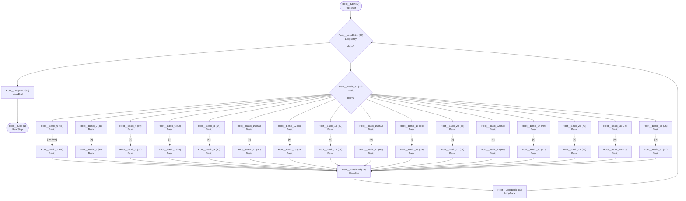

## Declare

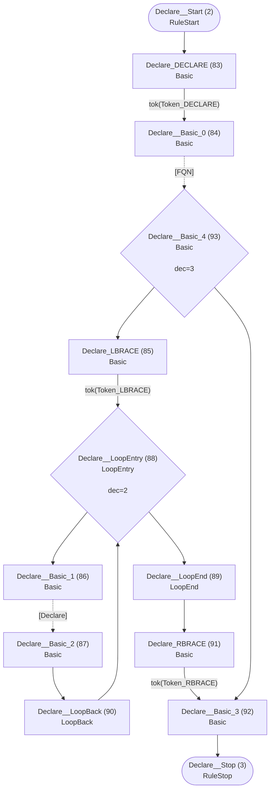

## A

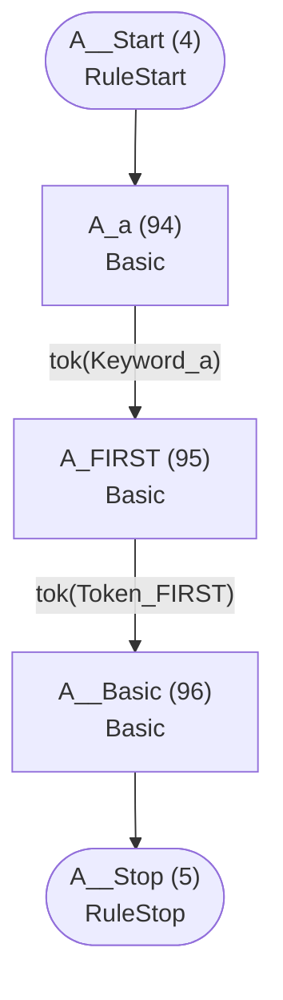

## B

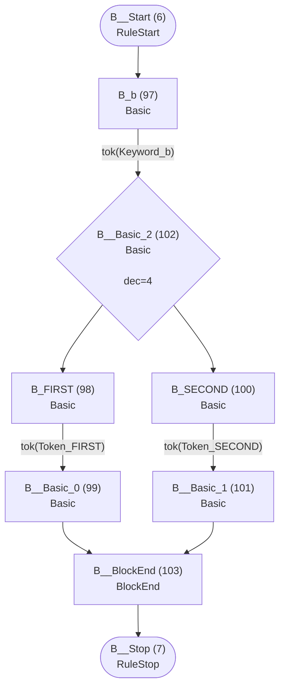

## C

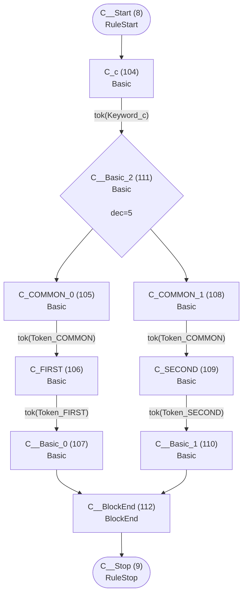

## D

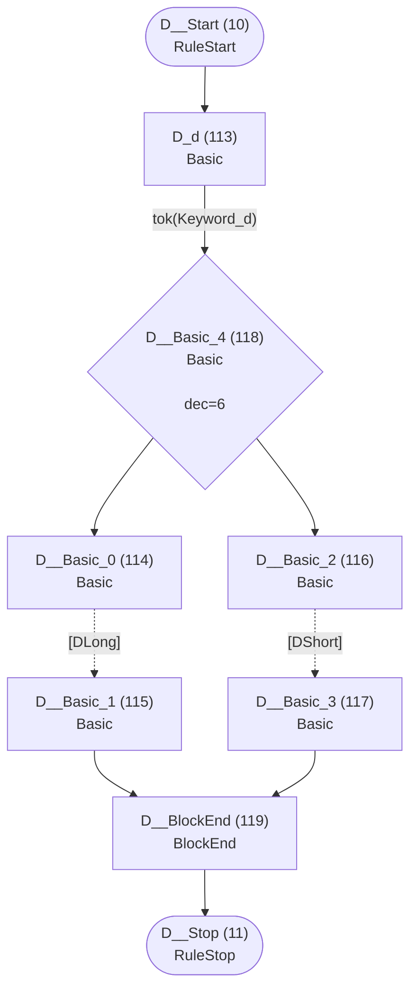

## E

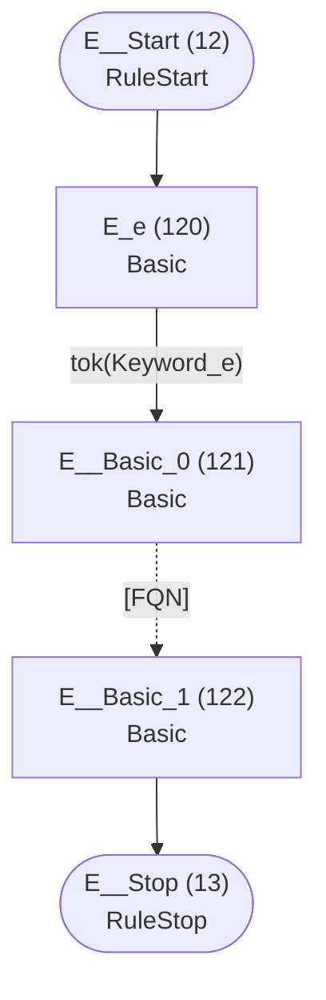

## DLong

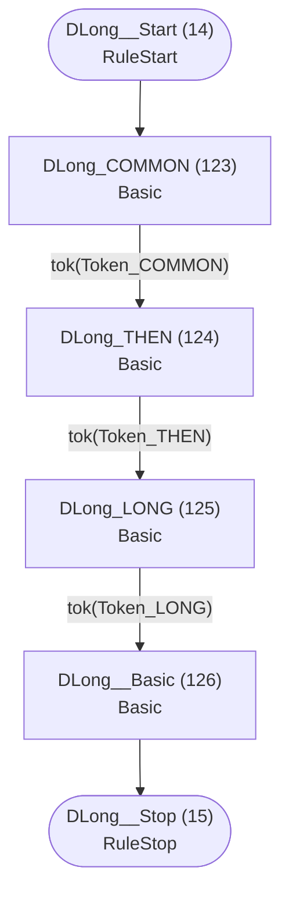

## DShort

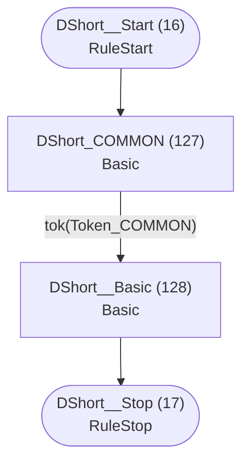

## F

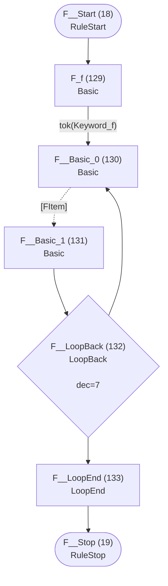

## FItem

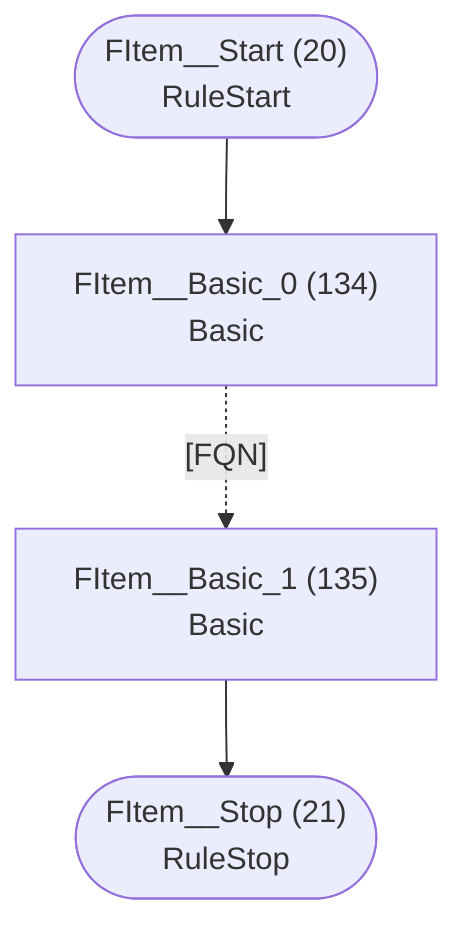

## G

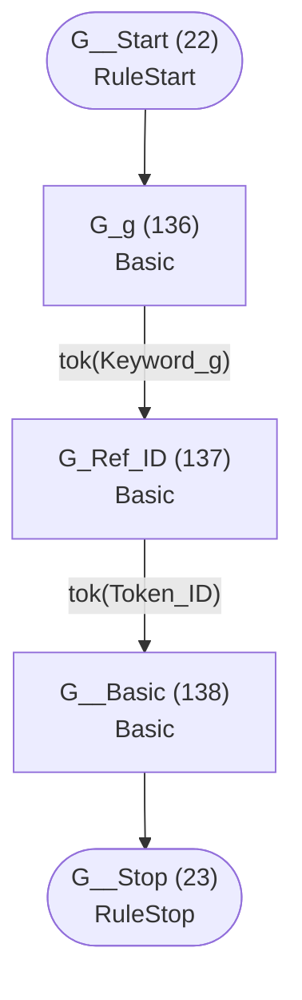

## H

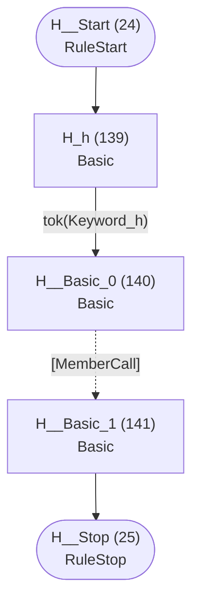

## I

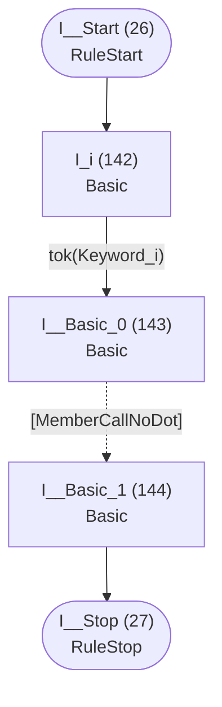

## MemberCall

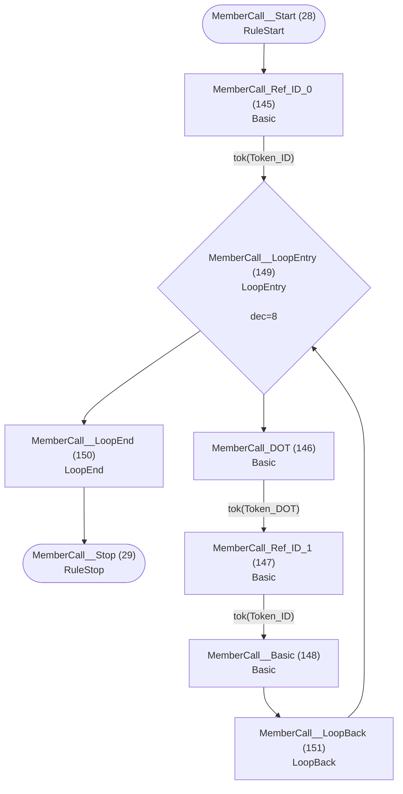

## MemberCallNoDot

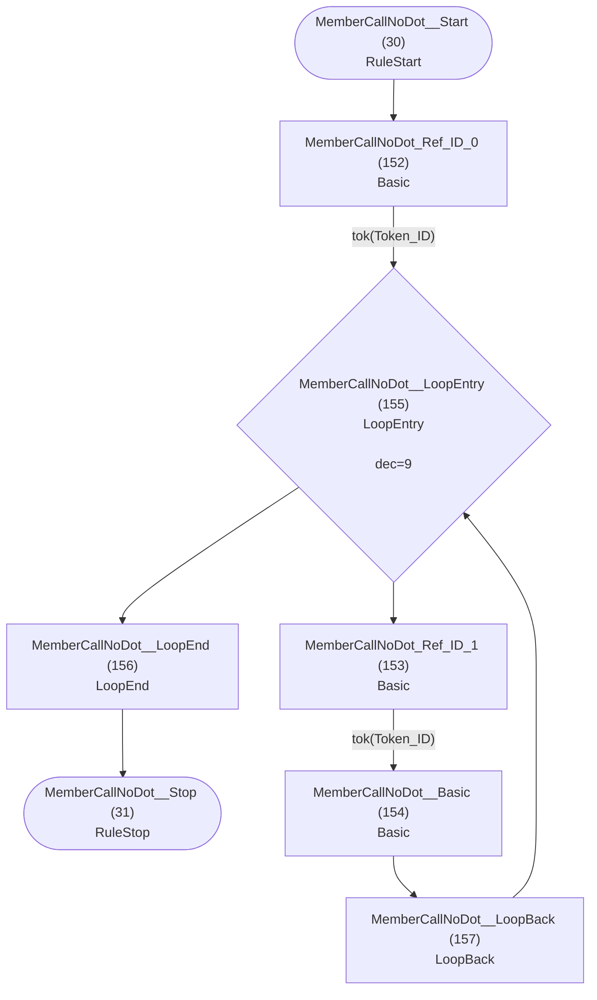

## J

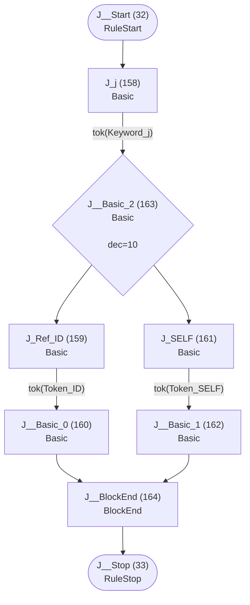

## K

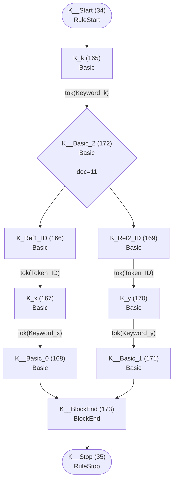

## L

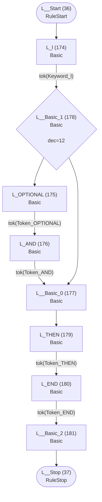

## M

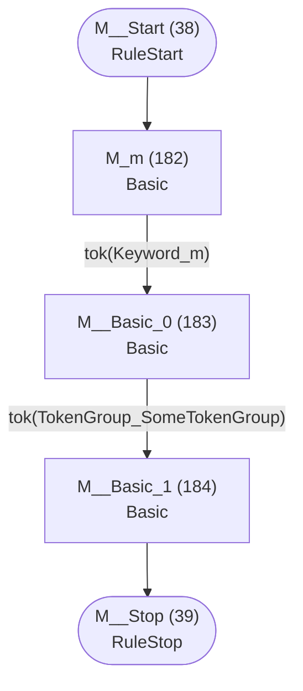

## N

```mermaid
flowchart TD
    q40(["N__Start (40)<br/>RuleStart"])
    q41(["N__Stop (41)<br/>RuleStop"])
    q185["N_n (185)<br/>Basic<br/>"]
    q186["N__Basic_0 (186)<br/>Basic<br/>"]
    q187["N__Basic_1 (187)<br/>Basic<br/>"]

    q40 --> q185
    q185 -->|"tok(Keyword_n)"| q186
    q186 -->|"tok(TokenGroup_SomeTokenGroup)"| q187
    q187 --> q41
```

## O

```mermaid
flowchart TD
    q42(["O__Start (42)<br/>RuleStart"])
    q43(["O__Stop (43)<br/>RuleStop"])
    q188["O_o (188)<br/>Basic<br/>"]
    q189["O_Ref_ID (189)<br/>Basic<br/>"]
    q190["O__Basic (190)<br/>Basic<br/>"]

    q42 --> q188
    q188 -->|"tok(Keyword_o)"| q189
    q189 -->|"tok(Token_ID)"| q190
    q190 --> q43
```

## FQN

```mermaid
flowchart TD
    q44(["FQN__Start (44)<br/>RuleStart"])
    q45(["FQN__Stop (45)<br/>RuleStop"])
    q191["FQN_ID_0 (191)<br/>Basic<br/>"]
    q192["FQN_DOT (192)<br/>Basic<br/>"]
    q193["FQN_ID_1 (193)<br/>Basic<br/>"]
    q194["FQN__Basic (194)<br/>Basic<br/>"]
    q195{"FQN__LoopEntry (195)<br/>LoopEntry<br/><br/>dec=13"}
    q196["FQN__LoopEnd (196)<br/>LoopEnd<br/>"]
    q197["FQN__LoopBack (197)<br/>LoopBack<br/>"]

    q44 --> q191
    q191 -->|"tok(Token_ID)"| q195
    q192 -->|"tok(Token_DOT)"| q193
    q193 -->|"tok(Token_ID)"| q194
    q194 --> q197
    q195 --> q192
    q195 --> q196
    q196 --> q45
    q197 --> q195
```

