# Runtime ATN for completion

## Root

```mermaid
flowchart TD
    q0(["Root__Start (0)<br/>RuleStart"])
    q1(["Root__Stop (1)<br/>RuleStop"])
    q82["Root__Basic_0 (82)<br/>Basic<br/>"]
    q83["Root__Basic_1 (83)<br/>Basic<br/>"]
    q84["Root__Basic_2 (84)<br/>Basic<br/>"]
    q85["Root__Basic_3 (85)<br/>Basic<br/>"]
    q86["Root__Basic_4 (86)<br/>Basic<br/>"]
    q87["Root__Basic_5 (87)<br/>Basic<br/>"]
    q88["Root__Basic_6 (88)<br/>Basic<br/>"]
    q89["Root__Basic_7 (89)<br/>Basic<br/>"]
    q90["Root__Basic_8 (90)<br/>Basic<br/>"]
    q91["Root__Basic_9 (91)<br/>Basic<br/>"]
    q92["Root__Basic_10 (92)<br/>Basic<br/>"]
    q93["Root__Basic_11 (93)<br/>Basic<br/>"]
    q94["Root__Basic_12 (94)<br/>Basic<br/>"]
    q95["Root__Basic_13 (95)<br/>Basic<br/>"]
    q96["Root__Basic_14 (96)<br/>Basic<br/>"]
    q97["Root__Basic_15 (97)<br/>Basic<br/>"]
    q98["Root__Basic_16 (98)<br/>Basic<br/>"]
    q99["Root__Basic_17 (99)<br/>Basic<br/>"]
    q100["Root__Basic_18 (100)<br/>Basic<br/>"]
    q101["Root__Basic_19 (101)<br/>Basic<br/>"]
    q102["Root__Basic_20 (102)<br/>Basic<br/>"]
    q103["Root__Basic_21 (103)<br/>Basic<br/>"]
    q104["Root__Basic_22 (104)<br/>Basic<br/>"]
    q105["Root__Basic_23 (105)<br/>Basic<br/>"]
    q106["Root__Basic_24 (106)<br/>Basic<br/>"]
    q107["Root__Basic_25 (107)<br/>Basic<br/>"]
    q108["Root__Basic_26 (108)<br/>Basic<br/>"]
    q109["Root__Basic_27 (109)<br/>Basic<br/>"]
    q110["Root__Basic_28 (110)<br/>Basic<br/>"]
    q111["Root__Basic_29 (111)<br/>Basic<br/>"]
    q112["Root__Basic_30 (112)<br/>Basic<br/>"]
    q113["Root__Basic_31 (113)<br/>Basic<br/>"]
    q114["Root__Basic_32 (114)<br/>Basic<br/>"]
    q115["Root__Basic_33 (115)<br/>Basic<br/>"]
    q116["Root__Basic_34 (116)<br/>Basic<br/>"]
    q117["Root__Basic_35 (117)<br/>Basic<br/>"]
    q118["Root__Basic_36 (118)<br/>Basic<br/>"]
    q119["Root__Basic_37 (119)<br/>Basic<br/>"]
    q120["Root__Basic_38 (120)<br/>Basic<br/>"]
    q121["Root__Basic_39 (121)<br/>Basic<br/>"]
    q122["Root__Basic_40 (122)<br/>Basic<br/>"]
    q123["Root__Basic_41 (123)<br/>Basic<br/>"]
    q124["Root__Basic_42 (124)<br/>Basic<br/>"]
    q125["Root__Basic_43 (125)<br/>Basic<br/>"]
    q126["Root__Basic_44 (126)<br/>Basic<br/>"]
    q127["Root__Basic_45 (127)<br/>Basic<br/>"]
    q128["Root__Basic_46 (128)<br/>Basic<br/>"]
    q129["Root__Basic_47 (129)<br/>Basic<br/>"]
    q130["Root__Basic_48 (130)<br/>Basic<br/>"]
    q131["Root__Basic_49 (131)<br/>Basic<br/>"]
    q132{"Root__Basic_50 (132)<br/>Basic<br/><br/>dec=0"}
    q133["Root__BlockEnd (133)<br/>BlockEnd<br/>"]
    q134{"Root__LoopEntry (134)<br/>LoopEntry<br/><br/>dec=1"}
    q135["Root__LoopEnd (135)<br/>LoopEnd<br/>"]
    q136["Root__LoopBack (136)<br/>LoopBack<br/>"]

    q0 --> q134
    q82 -.->|"[Declare]"| q83
    q83 --> q133
    q84 -.->|"[A]"| q85
    q85 --> q133
    q86 -.->|"[B]"| q87
    q87 --> q133
    q88 -.->|"[C]"| q89
    q89 --> q133
    q90 -.->|"[D]"| q91
    q91 --> q133
    q92 -.->|"[E]"| q93
    q93 --> q133
    q94 -.->|"[F]"| q95
    q95 --> q133
    q96 -.->|"[G]"| q97
    q97 --> q133
    q98 -.->|"[H]"| q99
    q99 --> q133
    q100 -.->|"[I]"| q101
    q101 --> q133
    q102 -.->|"[J]"| q103
    q103 --> q133
    q104 -.->|"[K]"| q105
    q105 --> q133
    q106 -.->|"[L]"| q107
    q107 --> q133
    q108 -.->|"[M]"| q109
    q109 --> q133
    q110 -.->|"[N]"| q111
    q111 --> q133
    q112 -.->|"[O]"| q113
    q113 --> q133
    q114 -.->|"[P]"| q115
    q115 --> q133
    q116 -.->|"[Q]"| q117
    q117 --> q133
    q118 -.->|"[R]"| q119
    q119 --> q133
    q120 -.->|"[S]"| q121
    q121 --> q133
    q122 -.->|"[T]"| q123
    q123 --> q133
    q124 -.->|"[U]"| q125
    q125 --> q133
    q126 -.->|"[V]"| q127
    q127 --> q133
    q128 -.->|"[W]"| q129
    q129 --> q133
    q130 -.->|"[Z]"| q131
    q131 --> q133
    q132 --> q82
    q132 --> q84
    q132 --> q86
    q132 --> q88
    q132 --> q90
    q132 --> q92
    q132 --> q94
    q132 --> q96
    q132 --> q98
    q132 --> q100
    q132 --> q102
    q132 --> q104
    q132 --> q106
    q132 --> q108
    q132 --> q110
    q132 --> q112
    q132 --> q114
    q132 --> q116
    q132 --> q118
    q132 --> q120
    q132 --> q122
    q132 --> q124
    q132 --> q126
    q132 --> q128
    q132 --> q130
    q133 --> q136
    q134 --> q132
    q134 --> q135
    q135 --> q1
    q136 --> q134
```

## Declare

```mermaid
flowchart TD
    q2(["Declare__Start (2)<br/>RuleStart"])
    q3(["Declare__Stop (3)<br/>RuleStop"])
    q137["Declare_DECLARE (137)<br/>Basic<br/>"]
    q138["Declare__Basic_0 (138)<br/>Basic<br/>"]
    q139["Declare_LBRACE (139)<br/>Basic<br/>"]
    q140["Declare__Basic_1 (140)<br/>Basic<br/>"]
    q141["Declare__Basic_2 (141)<br/>Basic<br/>"]
    q142{"Declare__LoopEntry (142)<br/>LoopEntry<br/><br/>dec=2"}
    q143["Declare__LoopEnd (143)<br/>LoopEnd<br/>"]
    q144["Declare__LoopBack (144)<br/>LoopBack<br/>"]
    q145["Declare_RBRACE (145)<br/>Basic<br/>"]
    q146["Declare__Basic_3 (146)<br/>Basic<br/>"]
    q147{"Declare__Basic_4 (147)<br/>Basic<br/><br/>dec=3"}

    q2 --> q137
    q137 -->|"tok(DECLARE)"| q138
    q138 -.->|"[FQN]"| q147
    q139 -->|"tok(LBRACE)"| q142
    q140 -.->|"[Declare]"| q141
    q141 --> q144
    q142 --> q140
    q142 --> q143
    q143 --> q145
    q144 --> q142
    q145 -->|"tok(RBRACE)"| q146
    q146 --> q3
    q147 --> q139
    q147 --> q146
```

## A

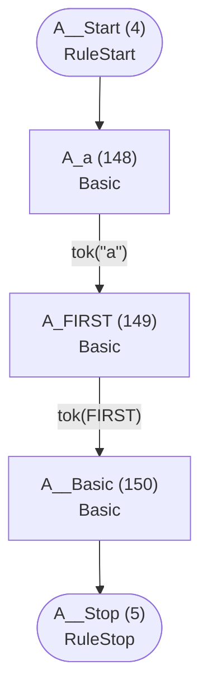
```mermaid
flowchart TD
    q4(["A__Start (4)<br/>RuleStart"])
    q5(["A__Stop (5)<br/>RuleStop"])
    q148["A_a (148)<br/>Basic<br/>"]
    q149["A_FIRST (149)<br/>Basic<br/>"]
    q150["A__Basic (150)<br/>Basic<br/>"]

    q4 --> q148
    q148 -->|"tok(&quot;a&quot;)"| q149
    q149 -->|"tok(FIRST)"| q150
    q150 --> q5
```

## B

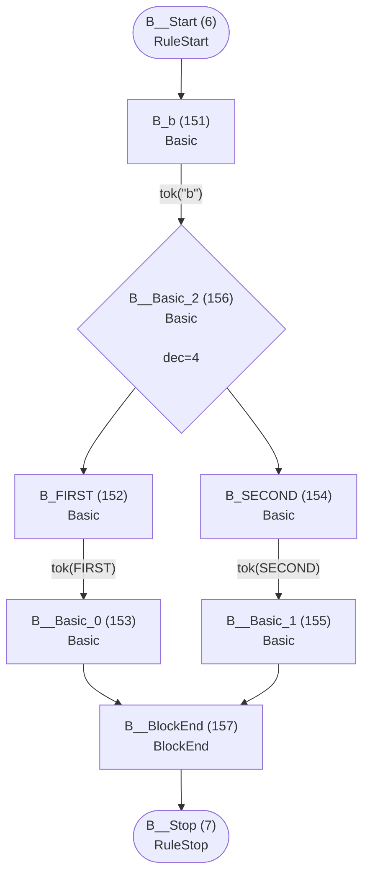
```mermaid
flowchart TD
    q6(["B__Start (6)<br/>RuleStart"])
    q7(["B__Stop (7)<br/>RuleStop"])
    q151["B_b (151)<br/>Basic<br/>"]
    q152["B_FIRST (152)<br/>Basic<br/>"]
    q153["B__Basic_0 (153)<br/>Basic<br/>"]
    q154["B_SECOND (154)<br/>Basic<br/>"]
    q155["B__Basic_1 (155)<br/>Basic<br/>"]
    q156{"B__Basic_2 (156)<br/>Basic<br/><br/>dec=4"}
    q157["B__BlockEnd (157)<br/>BlockEnd<br/>"]

    q6 --> q151
    q151 -->|"tok(&quot;b&quot;)"| q156
    q152 -->|"tok(FIRST)"| q153
    q153 --> q157
    q154 -->|"tok(SECOND)"| q155
    q155 --> q157
    q156 --> q152
    q156 --> q154
    q157 --> q7
```

## C

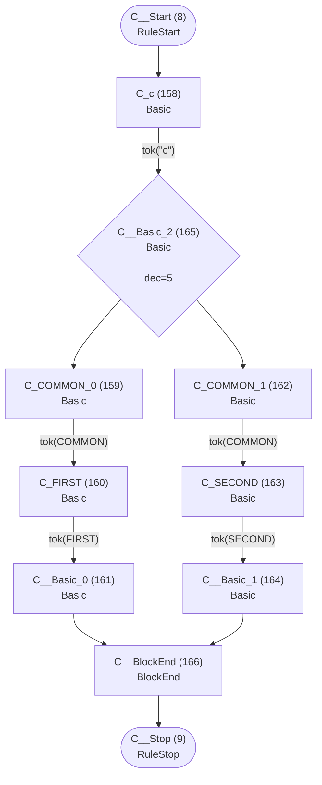
```mermaid
flowchart TD
    q8(["C__Start (8)<br/>RuleStart"])
    q9(["C__Stop (9)<br/>RuleStop"])
    q158["C_c (158)<br/>Basic<br/>"]
    q159["C_COMMON_0 (159)<br/>Basic<br/>"]
    q160["C_FIRST (160)<br/>Basic<br/>"]
    q161["C__Basic_0 (161)<br/>Basic<br/>"]
    q162["C_COMMON_1 (162)<br/>Basic<br/>"]
    q163["C_SECOND (163)<br/>Basic<br/>"]
    q164["C__Basic_1 (164)<br/>Basic<br/>"]
    q165{"C__Basic_2 (165)<br/>Basic<br/><br/>dec=5"}
    q166["C__BlockEnd (166)<br/>BlockEnd<br/>"]

    q8 --> q158
    q158 -->|"tok(&quot;c&quot;)"| q165
    q159 -->|"tok(COMMON)"| q160
    q160 -->|"tok(FIRST)"| q161
    q161 --> q166
    q162 -->|"tok(COMMON)"| q163
    q163 -->|"tok(SECOND)"| q164
    q164 --> q166
    q165 --> q159
    q165 --> q162
    q166 --> q9
```

## D

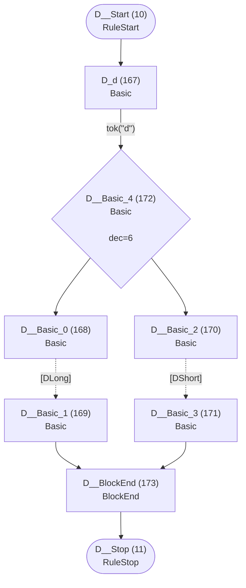
```mermaid
flowchart TD
    q10(["D__Start (10)<br/>RuleStart"])
    q11(["D__Stop (11)<br/>RuleStop"])
    q167["D_d (167)<br/>Basic<br/>"]
    q168["D__Basic_0 (168)<br/>Basic<br/>"]
    q169["D__Basic_1 (169)<br/>Basic<br/>"]
    q170["D__Basic_2 (170)<br/>Basic<br/>"]
    q171["D__Basic_3 (171)<br/>Basic<br/>"]
    q172{"D__Basic_4 (172)<br/>Basic<br/><br/>dec=6"}
    q173["D__BlockEnd (173)<br/>BlockEnd<br/>"]

    q10 --> q167
    q167 -->|"tok(&quot;d&quot;)"| q172
    q168 -.->|"[DLong]"| q169
    q169 --> q173
    q170 -.->|"[DShort]"| q171
    q171 --> q173
    q172 --> q168
    q172 --> q170
    q173 --> q11
```

## E

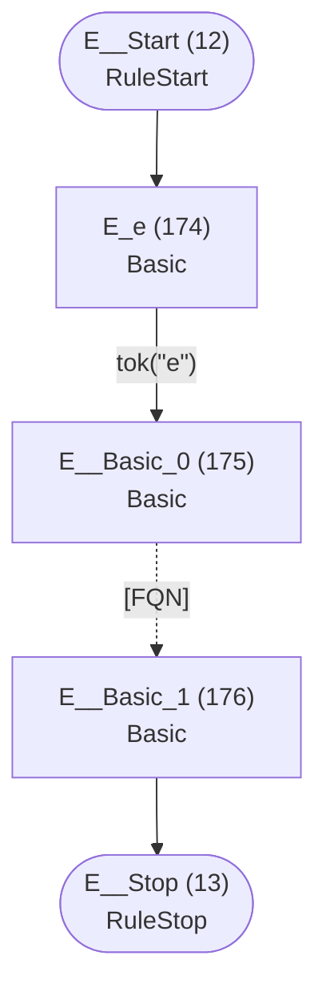
```mermaid
flowchart TD
    q12(["E__Start (12)<br/>RuleStart"])
    q13(["E__Stop (13)<br/>RuleStop"])
    q174["E_e (174)<br/>Basic<br/>"]
    q175["E__Basic_0 (175)<br/>Basic<br/>"]
    q176["E__Basic_1 (176)<br/>Basic<br/>"]

    q12 --> q174
    q174 -->|"tok(&quot;e&quot;)"| q175
    q175 -.->|"[FQN]"| q176
    q176 --> q13
```

## DLong

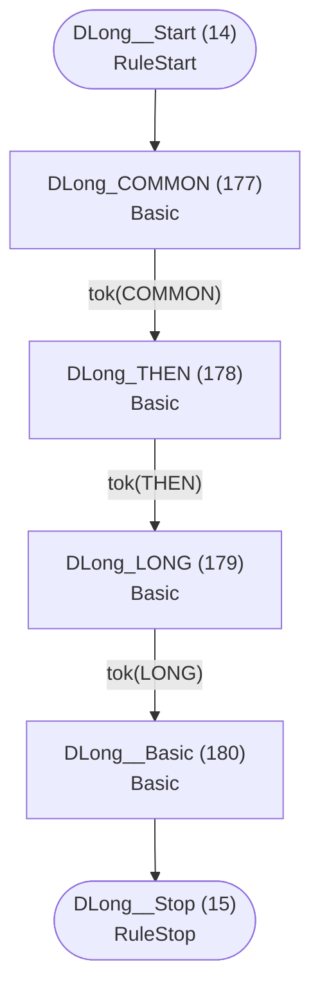
```mermaid
flowchart TD
    q14(["DLong__Start (14)<br/>RuleStart"])
    q15(["DLong__Stop (15)<br/>RuleStop"])
    q177["DLong_COMMON (177)<br/>Basic<br/>"]
    q178["DLong_THEN (178)<br/>Basic<br/>"]
    q179["DLong_LONG (179)<br/>Basic<br/>"]
    q180["DLong__Basic (180)<br/>Basic<br/>"]

    q14 --> q177
    q177 -->|"tok(COMMON)"| q178
    q178 -->|"tok(THEN)"| q179
    q179 -->|"tok(LONG)"| q180
    q180 --> q15
```

## DShort

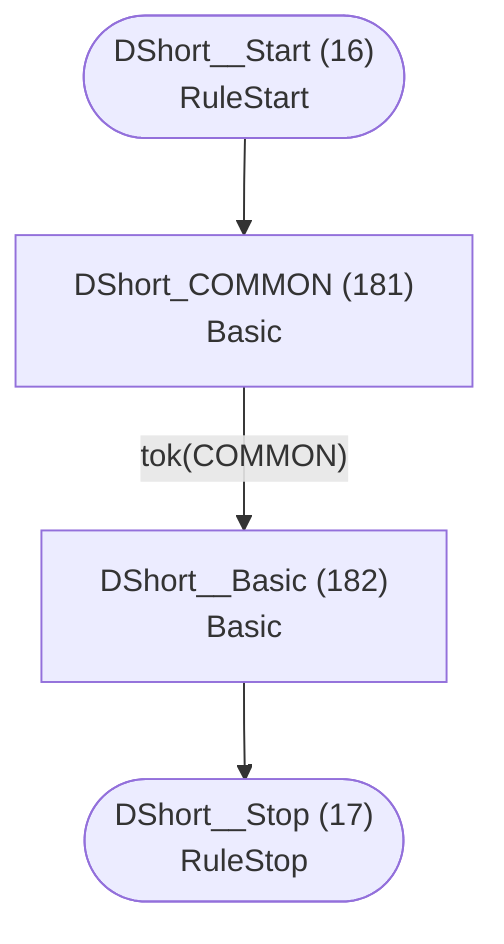
```mermaid
flowchart TD
    q16(["DShort__Start (16)<br/>RuleStart"])
    q17(["DShort__Stop (17)<br/>RuleStop"])
    q181["DShort_COMMON (181)<br/>Basic<br/>"]
    q182["DShort__Basic (182)<br/>Basic<br/>"]

    q16 --> q181
    q181 -->|"tok(COMMON)"| q182
    q182 --> q17
```

## F

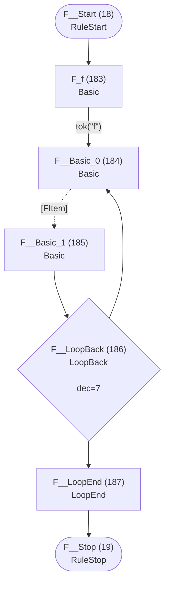
```mermaid
flowchart TD
    q18(["F__Start (18)<br/>RuleStart"])
    q19(["F__Stop (19)<br/>RuleStop"])
    q183["F_f (183)<br/>Basic<br/>"]
    q184["F__Basic_0 (184)<br/>Basic<br/>"]
    q185["F__Basic_1 (185)<br/>Basic<br/>"]
    q186{"F__LoopBack (186)<br/>LoopBack<br/><br/>dec=7"}
    q187["F__LoopEnd (187)<br/>LoopEnd<br/>"]

    q18 --> q183
    q183 -->|"tok(&quot;f&quot;)"| q184
    q184 -.->|"[FItem]"| q185
    q185 --> q186
    q186 --> q184
    q186 --> q187
    q187 --> q19
```

## FItem

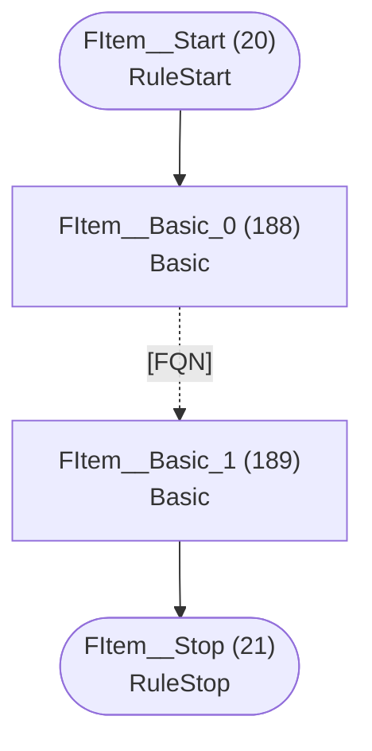
```mermaid
flowchart TD
    q20(["FItem__Start (20)<br/>RuleStart"])
    q21(["FItem__Stop (21)<br/>RuleStop"])
    q188["FItem__Basic_0 (188)<br/>Basic<br/>"]
    q189["FItem__Basic_1 (189)<br/>Basic<br/>"]

    q20 --> q188
    q188 -.->|"[FQN]"| q189
    q189 --> q21
```

## G

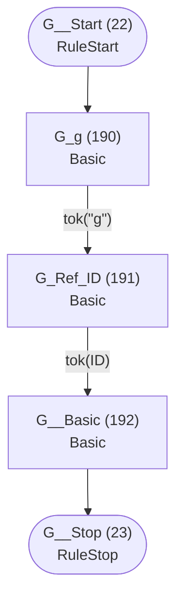
```mermaid
flowchart TD
    q22(["G__Start (22)<br/>RuleStart"])
    q23(["G__Stop (23)<br/>RuleStop"])
    q190["G_g (190)<br/>Basic<br/>"]
    q191["G_Ref_ID (191)<br/>Basic<br/>"]
    q192["G__Basic (192)<br/>Basic<br/>"]

    q22 --> q190
    q190 -->|"tok(&quot;g&quot;)"| q191
    q191 -->|"tok(ID)"| q192
    q192 --> q23
```

## H

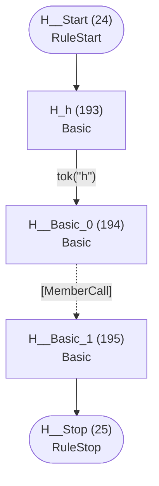
```mermaid
flowchart TD
    q24(["H__Start (24)<br/>RuleStart"])
    q25(["H__Stop (25)<br/>RuleStop"])
    q193["H_h (193)<br/>Basic<br/>"]
    q194["H__Basic_0 (194)<br/>Basic<br/>"]
    q195["H__Basic_1 (195)<br/>Basic<br/>"]

    q24 --> q193
    q193 -->|"tok(&quot;h&quot;)"| q194
    q194 -.->|"[MemberCall]"| q195
    q195 --> q25
```

## I

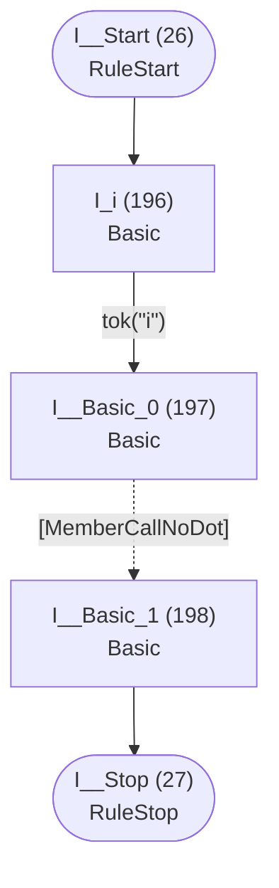
```mermaid
flowchart TD
    q26(["I__Start (26)<br/>RuleStart"])
    q27(["I__Stop (27)<br/>RuleStop"])
    q196["I_i (196)<br/>Basic<br/>"]
    q197["I__Basic_0 (197)<br/>Basic<br/>"]
    q198["I__Basic_1 (198)<br/>Basic<br/>"]

    q26 --> q196
    q196 -->|"tok(&quot;i&quot;)"| q197
    q197 -.->|"[MemberCallNoDot]"| q198
    q198 --> q27
```

## MemberCall

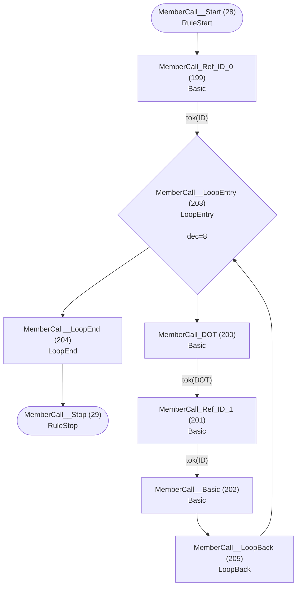
```mermaid
flowchart TD
    q28(["MemberCall__Start (28)<br/>RuleStart"])
    q29(["MemberCall__Stop (29)<br/>RuleStop"])
    q199["MemberCall_Ref_ID_0 (199)<br/>Basic<br/>"]
    q200["MemberCall_DOT (200)<br/>Basic<br/>"]
    q201["MemberCall_Ref_ID_1 (201)<br/>Basic<br/>"]
    q202["MemberCall__Basic (202)<br/>Basic<br/>"]
    q203{"MemberCall__LoopEntry (203)<br/>LoopEntry<br/><br/>dec=8"}
    q204["MemberCall__LoopEnd (204)<br/>LoopEnd<br/>"]
    q205["MemberCall__LoopBack (205)<br/>LoopBack<br/>"]

    q28 --> q199
    q199 -->|"tok(ID)"| q203
    q200 -->|"tok(DOT)"| q201
    q201 -->|"tok(ID)"| q202
    q202 --> q205
    q203 --> q200
    q203 --> q204
    q204 --> q29
    q205 --> q203
```

## MemberCallNoDot

```mermaid
flowchart TD
    q30(["MemberCallNoDot__Start (30)<br/>RuleStart"])
    q31(["MemberCallNoDot__Stop (31)<br/>RuleStop"])
    q206["MemberCallNoDot_Ref_ID_0 (206)<br/>Basic<br/>"]
    q207["MemberCallNoDot_Ref_ID_1 (207)<br/>Basic<br/>"]
    q208["MemberCallNoDot__Basic (208)<br/>Basic<br/>"]
    q209{"MemberCallNoDot__LoopEntry (209)<br/>LoopEntry<br/><br/>dec=9"}
    q210["MemberCallNoDot__LoopEnd (210)<br/>LoopEnd<br/>"]
    q211["MemberCallNoDot__LoopBack (211)<br/>LoopBack<br/>"]

    q30 --> q206
    q206 -->|"tok(ID)"| q209
    q207 -->|"tok(ID)"| q208
    q208 --> q211
    q209 --> q207
    q209 --> q210
    q210 --> q31
    q211 --> q209
```

## J

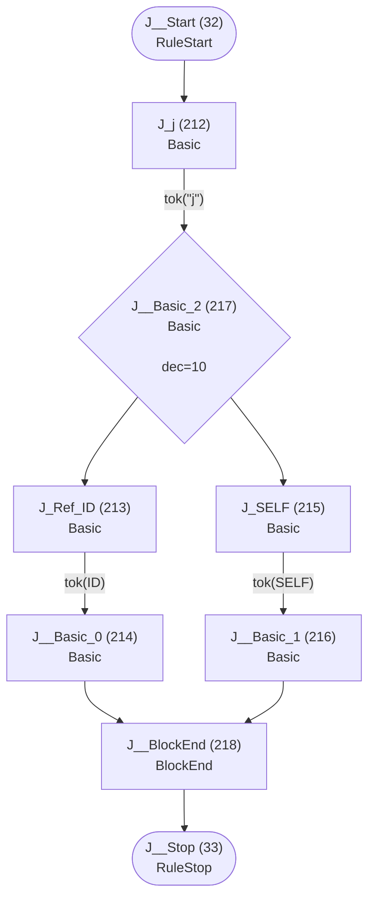
```mermaid
flowchart TD
    q32(["J__Start (32)<br/>RuleStart"])
    q33(["J__Stop (33)<br/>RuleStop"])
    q212["J_j (212)<br/>Basic<br/>"]
    q213["J_Ref_ID (213)<br/>Basic<br/>"]
    q214["J__Basic_0 (214)<br/>Basic<br/>"]
    q215["J_SELF (215)<br/>Basic<br/>"]
    q216["J__Basic_1 (216)<br/>Basic<br/>"]
    q217{"J__Basic_2 (217)<br/>Basic<br/><br/>dec=10"}
    q218["J__BlockEnd (218)<br/>BlockEnd<br/>"]

    q32 --> q212
    q212 -->|"tok(&quot;j&quot;)"| q217
    q213 -->|"tok(ID)"| q214
    q214 --> q218
    q215 -->|"tok(SELF)"| q216
    q216 --> q218
    q217 --> q213
    q217 --> q215
    q218 --> q33
```

## K

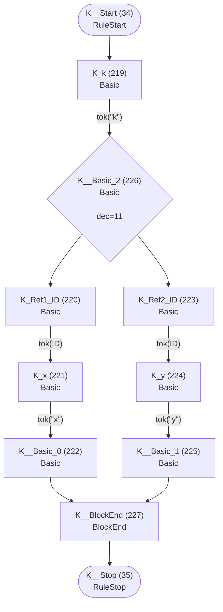
```mermaid
flowchart TD
    q34(["K__Start (34)<br/>RuleStart"])
    q35(["K__Stop (35)<br/>RuleStop"])
    q219["K_k (219)<br/>Basic<br/>"]
    q220["K_Ref1_ID (220)<br/>Basic<br/>"]
    q221["K_x (221)<br/>Basic<br/>"]
    q222["K__Basic_0 (222)<br/>Basic<br/>"]
    q223["K_Ref2_ID (223)<br/>Basic<br/>"]
    q224["K_y (224)<br/>Basic<br/>"]
    q225["K__Basic_1 (225)<br/>Basic<br/>"]
    q226{"K__Basic_2 (226)<br/>Basic<br/><br/>dec=11"}
    q227["K__BlockEnd (227)<br/>BlockEnd<br/>"]

    q34 --> q219
    q219 -->|"tok(&quot;k&quot;)"| q226
    q220 -->|"tok(ID)"| q221
    q221 -->|"tok(&quot;x&quot;)"| q222
    q222 --> q227
    q223 -->|"tok(ID)"| q224
    q224 -->|"tok(&quot;y&quot;)"| q225
    q225 --> q227
    q226 --> q220
    q226 --> q223
    q227 --> q35
```

## L

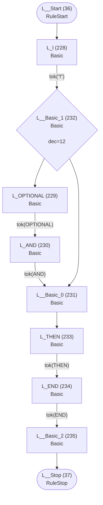
```mermaid
flowchart TD
    q36(["L__Start (36)<br/>RuleStart"])
    q37(["L__Stop (37)<br/>RuleStop"])
    q228["L_l (228)<br/>Basic<br/>"]
    q229["L_OPTIONAL (229)<br/>Basic<br/>"]
    q230["L_AND (230)<br/>Basic<br/>"]
    q231["L__Basic_0 (231)<br/>Basic<br/>"]
    q232{"L__Basic_1 (232)<br/>Basic<br/><br/>dec=12"}
    q233["L_THEN (233)<br/>Basic<br/>"]
    q234["L_END (234)<br/>Basic<br/>"]
    q235["L__Basic_2 (235)<br/>Basic<br/>"]

    q36 --> q228
    q228 -->|"tok(&quot;l&quot;)"| q232
    q229 -->|"tok(OPTIONAL)"| q230
    q230 -->|"tok(AND)"| q231
    q231 --> q233
    q232 --> q229
    q232 --> q231
    q233 -->|"tok(THEN)"| q234
    q234 -->|"tok(END)"| q235
    q235 --> q37
```

## M

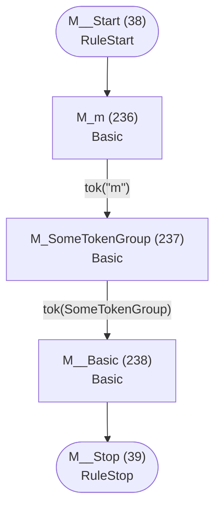
```mermaid
flowchart TD
    q38(["M__Start (38)<br/>RuleStart"])
    q39(["M__Stop (39)<br/>RuleStop"])
    q236["M_m (236)<br/>Basic<br/>"]
    q237["M_SomeTokenGroup (237)<br/>Basic<br/>"]
    q238["M__Basic (238)<br/>Basic<br/>"]

    q38 --> q236
    q236 -->|"tok(&quot;m&quot;)"| q237
    q237 -->|"tok(SomeTokenGroup)"| q238
    q238 --> q39
```

## N

```mermaid
flowchart TD
    q40(["N__Start (40)<br/>RuleStart"])
    q41(["N__Stop (41)<br/>RuleStop"])
    q239["N_n (239)<br/>Basic<br/>"]
    q240["N_Ref_SomeTokenGroup (240)<br/>Basic<br/>"]
    q241["N__Basic (241)<br/>Basic<br/>"]

    q40 --> q239
    q239 -->|"tok(&quot;n&quot;)"| q240
    q240 -->|"tok(SomeTokenGroup)"| q241
    q241 --> q41
```

## O

```mermaid
flowchart TD
    q42(["O__Start (42)<br/>RuleStart"])
    q43(["O__Stop (43)<br/>RuleStop"])
    q242["O_o (242)<br/>Basic<br/>"]
    q243["O_Ref_ID (243)<br/>Basic<br/>"]
    q244["O__Basic (244)<br/>Basic<br/>"]

    q42 --> q242
    q242 -->|"tok(&quot;o&quot;)"| q243
    q243 -->|"tok(ID)"| q244
    q244 --> q43
```

## P

```mermaid
flowchart TD
    q44(["P__Start (44)<br/>RuleStart"])
    q45(["P__Stop (45)<br/>RuleStop"])
    q245["P_p (245)<br/>Basic<br/>"]
    q246["P_LBRACE (246)<br/>Basic<br/>"]
    q247["P__Basic_0 (247)<br/>Basic<br/>"]
    q248["P__Basic_1 (248)<br/>Basic<br/>"]
    q249{"P__LoopEntry_0 (249)<br/>LoopEntry<br/><br/>dec=13"}
    q250["P__LoopEnd_0 (250)<br/>LoopEnd<br/>"]
    q251["P__LoopBack_0 (251)<br/>LoopBack<br/>"]
    q252["P_use (252)<br/>Basic<br/>"]
    q253["P__Basic_2 (253)<br/>Basic<br/>"]
    q254["P_AND (254)<br/>Basic<br/>"]
    q255["P__Basic_3 (255)<br/>Basic<br/>"]
    q256["P__Basic_4 (256)<br/>Basic<br/>"]
    q257{"P__LoopEntry_1 (257)<br/>LoopEntry<br/><br/>dec=14"}
    q258["P__LoopEnd_1 (258)<br/>LoopEnd<br/>"]
    q259["P__LoopBack_1 (259)<br/>LoopBack<br/>"]
    q260["P_RBRACE (260)<br/>Basic<br/>"]
    q261["P__Basic_5 (261)<br/>Basic<br/>"]

    q44 --> q245
    q245 -->|"tok(&quot;p&quot;)"| q246
    q246 -->|"tok(LBRACE)"| q249
    q247 -.->|"[Declare]"| q248
    q248 --> q251
    q249 --> q247
    q249 --> q250
    q250 --> q252
    q251 --> q249
    q252 -->|"tok(&quot;use&quot;)"| q253
    q253 -.->|"[PItem]"| q257
    q254 -->|"tok(AND)"| q255
    q255 -.->|"[PItem]"| q256
    q256 --> q259
    q257 --> q254
    q257 --> q258
    q258 --> q260
    q259 --> q257
    q260 -->|"tok(RBRACE)"| q261
    q261 --> q45
```

## PItem

```mermaid
flowchart TD
    q46(["PItem__Start (46)<br/>RuleStart"])
    q47(["PItem__Stop (47)<br/>RuleStop"])
    q262["PItem_Ref_ID (262)<br/>Basic<br/>"]
    q263["PItem__Basic (263)<br/>Basic<br/>"]

    q46 --> q262
    q262 -->|"tok(ID)"| q263
    q263 --> q47
```

## Q

```mermaid
flowchart TD
    q48(["Q__Start (48)<br/>RuleStart"])
    q49(["Q__Stop (49)<br/>RuleStop"])
    q264["Q_q (264)<br/>Basic<br/>"]
    q265["Q_LBRACE (265)<br/>Basic<br/>"]
    q266["Q__Basic_0 (266)<br/>Basic<br/>"]
    q267["Q__Basic_1 (267)<br/>Basic<br/>"]
    q268["Q__Basic_2 (268)<br/>Basic<br/>"]
    q269["Q__Basic_3 (269)<br/>Basic<br/>"]
    q270["Q__Basic_4 (270)<br/>Basic<br/>"]
    q271["Q__Basic_5 (271)<br/>Basic<br/>"]
    q272{"Q__Basic_6 (272)<br/>Basic<br/><br/>dec=15"}
    q273["Q__BlockEnd (273)<br/>BlockEnd<br/>"]
    q274{"Q__LoopEntry (274)<br/>LoopEntry<br/><br/>dec=16"}
    q275["Q__LoopEnd (275)<br/>LoopEnd<br/>"]
    q276["Q__LoopBack (276)<br/>LoopBack<br/>"]
    q277["Q_RBRACE (277)<br/>Basic<br/>"]
    q278["Q__Basic_7 (278)<br/>Basic<br/>"]

    q48 --> q264
    q264 -->|"tok(&quot;q&quot;)"| q265
    q265 -->|"tok(LBRACE)"| q274
    q266 -.->|"[Declare]"| q267
    q267 --> q273
    q268 -.->|"[PItem]"| q269
    q269 --> q273
    q270 -.->|"[Q]"| q271
    q271 --> q273
    q272 --> q266
    q272 --> q268
    q272 --> q270
    q273 --> q276
    q274 --> q272
    q274 --> q275
    q275 --> q277
    q276 --> q274
    q277 -->|"tok(RBRACE)"| q278
    q278 --> q49
```

## R

```mermaid
flowchart TD
    q50(["R__Start (50)<br/>RuleStart"])
    q51(["R__Stop (51)<br/>RuleStop"])
    q279["R_r (279)<br/>Basic<br/>"]
    q280["R_LBRACE (280)<br/>Basic<br/>"]
    q281["R__Basic_0 (281)<br/>Basic<br/>"]
    q282["R__Basic_1 (282)<br/>Basic<br/>"]
    q283{"R__LoopEntry (283)<br/>LoopEntry<br/><br/>dec=17"}
    q284["R__LoopEnd (284)<br/>LoopEnd<br/>"]
    q285["R__LoopBack (285)<br/>LoopBack<br/>"]
    q286["R_RBRACE (286)<br/>Basic<br/>"]
    q287["R__Basic_2 (287)<br/>Basic<br/>"]

    q50 --> q279
    q279 -->|"tok(&quot;r&quot;)"| q280
    q280 -->|"tok(LBRACE)"| q283
    q281 -.->|"[RItem]"| q282
    q282 --> q285
    q283 --> q281
    q283 --> q284
    q284 --> q286
    q285 --> q283
    q286 -->|"tok(RBRACE)"| q287
    q287 --> q51
```

## RItem

```mermaid
flowchart TD
    q52(["RItem__Start (52)<br/>RuleStart"])
    q53(["RItem__Stop (53)<br/>RuleStop"])
    q288["RItem_Ref_ID_0 (288)<br/>Basic<br/>"]
    q289["RItem_AND (289)<br/>Basic<br/>"]
    q290["RItem_Ref_ID_1 (290)<br/>Basic<br/>"]
    q291["RItem__Basic (291)<br/>Basic<br/>"]
    q292{"RItem__LoopEntry (292)<br/>LoopEntry<br/><br/>dec=18"}
    q293["RItem__LoopEnd (293)<br/>LoopEnd<br/>"]
    q294["RItem__LoopBack (294)<br/>LoopBack<br/>"]

    q52 --> q288
    q288 -->|"tok(ID)"| q292
    q289 -->|"tok(AND)"| q290
    q290 -->|"tok(ID)"| q291
    q291 --> q294
    q292 --> q289
    q292 --> q293
    q293 --> q53
    q294 --> q292
```

## S

```mermaid
flowchart TD
    q54(["S__Start (54)<br/>RuleStart"])
    q55(["S__Stop (55)<br/>RuleStop"])
    q295["S_s (295)<br/>Basic<br/>"]
    q296["S_LBRACE (296)<br/>Basic<br/>"]
    q297["S__Basic_0 (297)<br/>Basic<br/>"]
    q298["S__Basic_1 (298)<br/>Basic<br/>"]
    q299{"S__LoopEntry (299)<br/>LoopEntry<br/><br/>dec=19"}
    q300["S__LoopEnd (300)<br/>LoopEnd<br/>"]
    q301["S__LoopBack (301)<br/>LoopBack<br/>"]
    q302["S_RBRACE (302)<br/>Basic<br/>"]
    q303["S__Basic_2 (303)<br/>Basic<br/>"]

    q54 --> q295
    q295 -->|"tok(&quot;s&quot;)"| q296
    q296 -->|"tok(LBRACE)"| q299
    q297 -.->|"[SBinary]"| q298
    q298 --> q301
    q299 --> q297
    q299 --> q300
    q300 --> q302
    q301 --> q299
    q302 -->|"tok(RBRACE)"| q303
    q303 --> q55
```

## SPrimary

```mermaid
flowchart TD
    q56(["SPrimary__Start (56)<br/>RuleStart"])
    q57(["SPrimary__Stop (57)<br/>RuleStop"])
    q304["SPrimary_Ref_ID (304)<br/>Basic<br/>"]
    q305["SPrimary__Basic (305)<br/>Basic<br/>"]

    q56 --> q304
    q304 -->|"tok(ID)"| q305
    q305 --> q57
```

## T

```mermaid
flowchart TD
    q58(["T__Start (58)<br/>RuleStart"])
    q59(["T__Stop (59)<br/>RuleStop"])
    q306["T_t (306)<br/>Basic<br/>"]
    q307["T_LBRACE (307)<br/>Basic<br/>"]
    q308["T__Basic_0 (308)<br/>Basic<br/>"]
    q309["T_RBRACE (309)<br/>Basic<br/>"]
    q310["T__Basic_1 (310)<br/>Basic<br/>"]

    q58 --> q306
    q306 -->|"tok(&quot;t&quot;)"| q307
    q307 -->|"tok(LBRACE)"| q308
    q308 -.->|"[TGroup]"| q309
    q309 -->|"tok(RBRACE)"| q310
    q310 --> q59
```

## TGroup

```mermaid
flowchart TD
    q60(["TGroup__Start (60)<br/>RuleStart"])
    q61(["TGroup__Stop (61)<br/>RuleStop"])
    q311["TGroup__Basic_0 (311)<br/>Basic<br/>"]
    q312["TGroup__Basic_1 (312)<br/>Basic<br/>"]
    q313["TGroup__Basic_2 (313)<br/>Basic<br/>"]
    q314{"TGroup__LoopBack (314)<br/>LoopBack<br/><br/>dec=20"}
    q315["TGroup__LoopEnd (315)<br/>LoopEnd<br/>"]
    q316{"TGroup__Basic_3 (316)<br/>Basic<br/><br/>dec=21"}

    q60 --> q311
    q311 -.->|"[TElement]"| q316
    q312 -.->|"[TElement]"| q313
    q313 --> q314
    q314 --> q312
    q314 --> q315
    q315 --> q61
    q316 --> q312
    q316 --> q315
```

## TElement

```mermaid
flowchart TD
    q62(["TElement__Start (62)<br/>RuleStart"])
    q63(["TElement__Stop (63)<br/>RuleStop"])
    q317["TElement_Ref_ID (317)<br/>Basic<br/>"]
    q318["TElement__Basic_0 (318)<br/>Basic<br/>"]
    q319["TElement_LBRACE (319)<br/>Basic<br/>"]
    q320["TElement__Basic_1 (320)<br/>Basic<br/>"]
    q321["TElement_RBRACE (321)<br/>Basic<br/>"]
    q322["TElement__Basic_2 (322)<br/>Basic<br/>"]
    q323{"TElement__Basic_3 (323)<br/>Basic<br/><br/>dec=22"}
    q324["TElement__BlockEnd (324)<br/>BlockEnd<br/>"]

    q62 --> q323
    q317 -->|"tok(ID)"| q318
    q318 --> q324
    q319 -->|"tok(LBRACE)"| q320
    q320 -.->|"[TGroup]"| q321
    q321 -->|"tok(RBRACE)"| q322
    q322 --> q324
    q323 --> q317
    q323 --> q319
    q324 --> q63
```

## U

```mermaid
flowchart TD
    q64(["U__Start (64)<br/>RuleStart"])
    q65(["U__Stop (65)<br/>RuleStop"])
    q325["U_u (325)<br/>Basic<br/>"]
    q326["U__Basic_0 (326)<br/>Basic<br/>"]
    q327["U__Basic_1 (327)<br/>Basic<br/>"]
    q328["U__Basic_2 (328)<br/>Basic<br/>"]
    q329{"U__LoopEntry (329)<br/>LoopEntry<br/><br/>dec=23"}
    q330["U__LoopEnd (330)<br/>LoopEnd<br/>"]
    q331["U__LoopBack (331)<br/>LoopBack<br/>"]

    q64 --> q325
    q325 -->|"tok(&quot;u&quot;)"| q326
    q326 -.->|"[SBinary]"| q329
    q327 -.->|"[PItem]"| q328
    q328 --> q331
    q329 --> q327
    q329 --> q330
    q330 --> q65
    q331 --> q329
```

## V

```mermaid
flowchart TD
    q66(["V__Start (66)<br/>RuleStart"])
    q67(["V__Stop (67)<br/>RuleStop"])
    q332["V_v (332)<br/>Basic<br/>"]
    q333["V_LBRACE (333)<br/>Basic<br/>"]
    q334["V__Basic_0 (334)<br/>Basic<br/>"]
    q335["V__Basic_1 (335)<br/>Basic<br/>"]
    q336["V_Ref_ID (336)<br/>Basic<br/>"]
    q337["V__Basic_2 (337)<br/>Basic<br/>"]
    q338["V__Basic_3 (338)<br/>Basic<br/>"]
    q339["V__Basic_4 (339)<br/>Basic<br/>"]
    q340{"V__Basic_5 (340)<br/>Basic<br/><br/>dec=24"}
    q341["V__BlockEnd (341)<br/>BlockEnd<br/>"]
    q342{"V__LoopEntry (342)<br/>LoopEntry<br/><br/>dec=25"}
    q343["V__LoopEnd (343)<br/>LoopEnd<br/>"]
    q344["V__LoopBack (344)<br/>LoopBack<br/>"]
    q345["V_RBRACE (345)<br/>Basic<br/>"]
    q346["V__Basic_6 (346)<br/>Basic<br/>"]

    q66 --> q332
    q332 -->|"tok(&quot;v&quot;)"| q333
    q333 -->|"tok(LBRACE)"| q342
    q334 -.->|"[Declare]"| q335
    q335 --> q341
    q336 -->|"tok(ID)"| q337
    q337 --> q341
    q338 -.->|"[V]"| q339
    q339 --> q341
    q340 --> q334
    q340 --> q336
    q340 --> q338
    q341 --> q344
    q342 --> q340
    q342 --> q343
    q343 --> q345
    q344 --> q342
    q345 -->|"tok(RBRACE)"| q346
    q346 --> q67
```

## W

```mermaid
flowchart TD
    q68(["W__Start (68)<br/>RuleStart"])
    q69(["W__Stop (69)<br/>RuleStop"])
    q347["W_w (347)<br/>Basic<br/>"]
    q348["W__Basic_0 (348)<br/>Basic<br/>"]
    q349["W__Basic_1 (349)<br/>Basic<br/>"]
    q350["W__Basic_2 (350)<br/>Basic<br/>"]
    q351["W__Basic_3 (351)<br/>Basic<br/>"]
    q352{"W__Basic_4 (352)<br/>Basic<br/><br/>dec=26"}
    q353["W__BlockEnd (353)<br/>BlockEnd<br/>"]

    q68 --> q347
    q347 -->|"tok(&quot;w&quot;)"| q352
    q348 -.->|"[WName]"| q349
    q349 --> q353
    q350 -.->|"[WRefs]"| q351
    q351 --> q353
    q352 --> q348
    q352 --> q350
    q353 --> q69
```

## WName

```mermaid
flowchart TD
    q70(["WName__Start (70)<br/>RuleStart"])
    q71(["WName__Stop (71)<br/>RuleStop"])
    q354["WName_Name_ID (354)<br/>Basic<br/>"]
    q355["WName_Ref_ID (355)<br/>Basic<br/>"]
    q356["WName_FIRST (356)<br/>Basic<br/>"]
    q357["WName__Basic (357)<br/>Basic<br/>"]

    q70 --> q354
    q354 -->|"tok(ID)"| q355
    q355 -->|"tok(ID)"| q356
    q356 -->|"tok(FIRST)"| q357
    q357 --> q71
```

## WRefs

```mermaid
flowchart TD
    q72(["WRefs__Start (72)<br/>RuleStart"])
    q73(["WRefs__Stop (73)<br/>RuleStop"])
    q358["WRefs_Ref1_ID (358)<br/>Basic<br/>"]
    q359["WRefs_Ref_ID (359)<br/>Basic<br/>"]
    q360["WRefs_SECOND (360)<br/>Basic<br/>"]
    q361["WRefs__Basic (361)<br/>Basic<br/>"]

    q72 --> q358
    q358 -->|"tok(ID)"| q359
    q359 -->|"tok(ID)"| q360
    q360 -->|"tok(SECOND)"| q361
    q361 --> q73
```

## Z

```mermaid
flowchart TD
    q74(["Z__Start (74)<br/>RuleStart"])
    q75(["Z__Stop (75)<br/>RuleStop"])
    q362["Z_z (362)<br/>Basic<br/>"]
    q363["Z_LBRACE (363)<br/>Basic<br/>"]
    q364["Z__Basic_0 (364)<br/>Basic<br/>"]
    q365["Z__Basic_1 (365)<br/>Basic<br/>"]
    q366{"Z__LoopEntry (366)<br/>LoopEntry<br/><br/>dec=27"}
    q367["Z__LoopEnd (367)<br/>LoopEnd<br/>"]
    q368["Z__LoopBack (368)<br/>LoopBack<br/>"]
    q369["Z_RBRACE (369)<br/>Basic<br/>"]
    q370["Z__Basic_2 (370)<br/>Basic<br/>"]

    q74 --> q362
    q362 -->|"tok(&quot;z&quot;)"| q363
    q363 -->|"tok(LBRACE)"| q366
    q364 -.->|"[ZItem]"| q365
    q365 --> q368
    q366 --> q364
    q366 --> q367
    q367 --> q369
    q368 --> q366
    q369 -->|"tok(RBRACE)"| q370
    q370 --> q75
```

## ZItem

```mermaid
flowchart TD
    q76(["ZItem__Start (76)<br/>RuleStart"])
    q77(["ZItem__Stop (77)<br/>RuleStop"])
    q371["ZItem__Basic_0 (371)<br/>Basic<br/>"]
    q372["ZItem__Basic_1 (372)<br/>Basic<br/>"]

    q76 --> q371
    q371 -.->|"[PItem]"| q372
    q372 --> q77
```

## FQN

```mermaid
flowchart TD
    q78(["FQN__Start (78)<br/>RuleStart"])
    q79(["FQN__Stop (79)<br/>RuleStop"])
    q373["FQN_ID_0 (373)<br/>Basic<br/>"]
    q374["FQN_DOT (374)<br/>Basic<br/>"]
    q375["FQN_ID_1 (375)<br/>Basic<br/>"]
    q376["FQN__Basic (376)<br/>Basic<br/>"]
    q377{"FQN__LoopEntry (377)<br/>LoopEntry<br/><br/>dec=28"}
    q378["FQN__LoopEnd (378)<br/>LoopEnd<br/>"]
    q379["FQN__LoopBack (379)<br/>LoopBack<br/>"]

    q78 --> q373
    q373 -->|"tok(ID)"| q377
    q374 -->|"tok(DOT)"| q375
    q375 -->|"tok(ID)"| q376
    q376 --> q379
    q377 --> q374
    q377 --> q378
    q378 --> q79
    q379 --> q377
```

## SBinary

```mermaid
flowchart TD
    q80(["SBinary__Start (80)<br/>RuleStart"])
    q81(["SBinary__Stop (81)<br/>RuleStop"])
    q380["SBinary__Basic_0 (380)<br/>Basic<br/>"]
    q381["SBinary_SBinaryOperator (381)<br/>Basic<br/>"]
    q382["SBinary__Basic_1 (382)<br/>Basic<br/>"]
    q383["SBinary__Basic_2 (383)<br/>Basic<br/>"]
    q384{"SBinary__LoopEntry (384)<br/>LoopEntry<br/><br/>dec=29"}
    q385["SBinary__LoopEnd (385)<br/>LoopEnd<br/>"]
    q386["SBinary__LoopBack (386)<br/>LoopBack<br/>"]

    q80 --> q380
    q380 -.->|"[SPrimary]"| q384
    q381 -->|"tok(SBinaryOperator)"| q382
    q382 -.->|"[SPrimary]"| q383
    q383 --> q386
    q384 --> q381
    q384 --> q385
    q385 --> q81
    q386 --> q384
```

