# Runtime ATN for completion

## Root

```mermaid
flowchart TD
    q0(["Root__Start (0)<br/>RuleStart"])
    q1(["Root__Stop (1)<br/>RuleStop"])
    q82["Root__Basic_0 (82)<br/>Basic<br/>"]
    q83["Root__Basic_1 (83)<br/>Basic<br/>"]
    q84["Root__Basic_2 (84)<br/>Basic<br/>"]
    q85["Root__Basic_3 (85)<br/>Basic<br/>"]
    q86["Root__Basic_4 (86)<br/>Basic<br/>"]
    q87["Root__Basic_5 (87)<br/>Basic<br/>"]
    q88["Root__Basic_6 (88)<br/>Basic<br/>"]
    q89["Root__Basic_7 (89)<br/>Basic<br/>"]
    q90["Root__Basic_8 (90)<br/>Basic<br/>"]
    q91["Root__Basic_9 (91)<br/>Basic<br/>"]
    q92["Root__Basic_10 (92)<br/>Basic<br/>"]
    q93["Root__Basic_11 (93)<br/>Basic<br/>"]
    q94["Root__Basic_12 (94)<br/>Basic<br/>"]
    q95["Root__Basic_13 (95)<br/>Basic<br/>"]
    q96["Root__Basic_14 (96)<br/>Basic<br/>"]
    q97["Root__Basic_15 (97)<br/>Basic<br/>"]
    q98["Root__Basic_16 (98)<br/>Basic<br/>"]
    q99["Root__Basic_17 (99)<br/>Basic<br/>"]
    q100["Root__Basic_18 (100)<br/>Basic<br/>"]
    q101["Root__Basic_19 (101)<br/>Basic<br/>"]
    q102["Root__Basic_20 (102)<br/>Basic<br/>"]
    q103["Root__Basic_21 (103)<br/>Basic<br/>"]
    q104["Root__Basic_22 (104)<br/>Basic<br/>"]
    q105["Root__Basic_23 (105)<br/>Basic<br/>"]
    q106["Root__Basic_24 (106)<br/>Basic<br/>"]
    q107["Root__Basic_25 (107)<br/>Basic<br/>"]
    q108["Root__Basic_26 (108)<br/>Basic<br/>"]
    q109["Root__Basic_27 (109)<br/>Basic<br/>"]
    q110["Root__Basic_28 (110)<br/>Basic<br/>"]
    q111["Root__Basic_29 (111)<br/>Basic<br/>"]
    q112["Root__Basic_30 (112)<br/>Basic<br/>"]
    q113["Root__Basic_31 (113)<br/>Basic<br/>"]
    q114["Root__Basic_32 (114)<br/>Basic<br/>"]
    q115["Root__Basic_33 (115)<br/>Basic<br/>"]
    q116["Root__Basic_34 (116)<br/>Basic<br/>"]
    q117["Root__Basic_35 (117)<br/>Basic<br/>"]
    q118["Root__Basic_36 (118)<br/>Basic<br/>"]
    q119["Root__Basic_37 (119)<br/>Basic<br/>"]
    q120["Root__Basic_38 (120)<br/>Basic<br/>"]
    q121["Root__Basic_39 (121)<br/>Basic<br/>"]
    q122["Root__Basic_40 (122)<br/>Basic<br/>"]
    q123["Root__Basic_41 (123)<br/>Basic<br/>"]
    q124["Root__Basic_42 (124)<br/>Basic<br/>"]
    q125["Root__Basic_43 (125)<br/>Basic<br/>"]
    q126["Root__Basic_44 (126)<br/>Basic<br/>"]
    q127["Root__Basic_45 (127)<br/>Basic<br/>"]
    q128["Root__Basic_46 (128)<br/>Basic<br/>"]
    q129["Root__Basic_47 (129)<br/>Basic<br/>"]
    q130["Root__Basic_48 (130)<br/>Basic<br/>"]
    q131["Root__Basic_49 (131)<br/>Basic<br/>"]
    q132{"Root__Basic_50 (132)<br/>Basic<br/><br/>dec=0"}
    q133["Root__BlockEnd (133)<br/>BlockEnd<br/>"]
    q134{"Root__LoopEntry (134)<br/>LoopEntry<br/><br/>dec=1"}
    q135["Root__LoopEnd (135)<br/>LoopEnd<br/>"]
    q136["Root__LoopBack (136)<br/>LoopBack<br/>"]

    q0 --> q134
    q82 -.->|"[Declare]"| q83
    q83 --> q133
    q84 -.->|"[Seq]"| q85
    q85 --> q133
    q86 -.->|"[Alt]"| q87
    q87 --> q133
    q88 -.->|"[Prefix]"| q89
    q89 --> q133
    q90 -.->|"[Call]"| q91
    q91 --> q133
    q92 -.->|"[RefFQN]"| q93
    q93 --> q133
    q94 -.->|"[RefList]"| q95
    q95 --> q133
    q96 -.->|"[RefID]"| q97
    q97 --> q133
    q98 -.->|"[Member]"| q99
    q99 --> q133
    q100 -.->|"[MemberNoDot]"| q101
    q101 --> q133
    q102 -.->|"[RefOrKeyword]"| q103
    q103 --> q133
    q104 -.->|"[Dedup]"| q105
    q105 --> q133
    q106 -.->|"[Opt]"| q107
    q107 --> q133
    q108 -.->|"[Group]"| q109
    q109 --> q133
    q110 -.->|"[RefGroup]"| q111
    q111 --> q133
    q112 -.->|"[RefAction]"| q113
    q113 --> q133
    q114 -.->|"[Scope]"| q115
    q115 --> q133
    q116 -.->|"[Loop]"| q117
    q117 --> q133
    q118 -.->|"[Chain]"| q119
    q119 --> q133
    q120 -.->|"[Infix]"| q121
    q121 --> q133
    q122 -.->|"[Wrap]"| q123
    q123 --> q133
    q124 -.->|"[Shadow]"| q125
    q125 --> q133
    q126 -.->|"[Nest]"| q127
    q127 --> q133
    q128 -.->|"[Ambig]"| q129
    q129 --> q133
    q130 -.->|"[Retype]"| q131
    q131 --> q133
    q132 --> q82
    q132 --> q84
    q132 --> q86
    q132 --> q88
    q132 --> q90
    q132 --> q92
    q132 --> q94
    q132 --> q96
    q132 --> q98
    q132 --> q100
    q132 --> q102
    q132 --> q104
    q132 --> q106
    q132 --> q108
    q132 --> q110
    q132 --> q112
    q132 --> q114
    q132 --> q116
    q132 --> q118
    q132 --> q120
    q132 --> q122
    q132 --> q124
    q132 --> q126
    q132 --> q128
    q132 --> q130
    q133 --> q136
    q134 --> q132
    q134 --> q135
    q135 --> q1
    q136 --> q134
```

## Declare

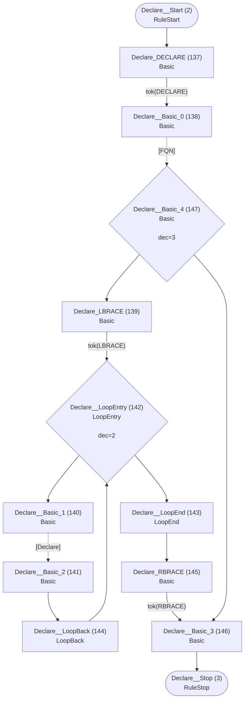
```mermaid
flowchart TD
    q2(["Declare__Start (2)<br/>RuleStart"])
    q3(["Declare__Stop (3)<br/>RuleStop"])
    q137["Declare_DECLARE (137)<br/>Basic<br/>"]
    q138["Declare__Basic_0 (138)<br/>Basic<br/>"]
    q139["Declare_LBRACE (139)<br/>Basic<br/>"]
    q140["Declare__Basic_1 (140)<br/>Basic<br/>"]
    q141["Declare__Basic_2 (141)<br/>Basic<br/>"]
    q142{"Declare__LoopEntry (142)<br/>LoopEntry<br/><br/>dec=2"}
    q143["Declare__LoopEnd (143)<br/>LoopEnd<br/>"]
    q144["Declare__LoopBack (144)<br/>LoopBack<br/>"]
    q145["Declare_RBRACE (145)<br/>Basic<br/>"]
    q146["Declare__Basic_3 (146)<br/>Basic<br/>"]
    q147{"Declare__Basic_4 (147)<br/>Basic<br/><br/>dec=3"}

    q2 --> q137
    q137 -->|"tok(DECLARE)"| q138
    q138 -.->|"[FQN]"| q147
    q139 -->|"tok(LBRACE)"| q142
    q140 -.->|"[Declare]"| q141
    q141 --> q144
    q142 --> q140
    q142 --> q143
    q143 --> q145
    q144 --> q142
    q145 -->|"tok(RBRACE)"| q146
    q146 --> q3
    q147 --> q139
    q147 --> q146
```

## Seq

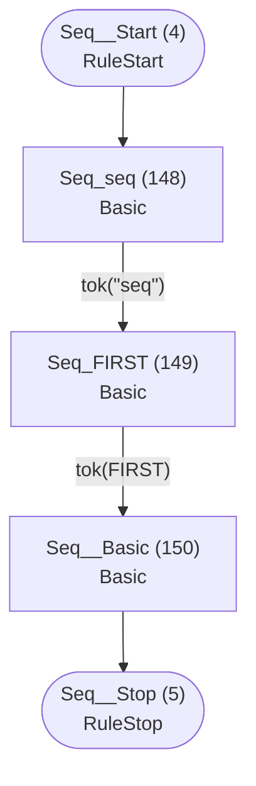
```mermaid
flowchart TD
    q4(["Seq__Start (4)<br/>RuleStart"])
    q5(["Seq__Stop (5)<br/>RuleStop"])
    q148["Seq_seq (148)<br/>Basic<br/>"]
    q149["Seq_FIRST (149)<br/>Basic<br/>"]
    q150["Seq__Basic (150)<br/>Basic<br/>"]

    q4 --> q148
    q148 -->|"tok(&quot;seq&quot;)"| q149
    q149 -->|"tok(FIRST)"| q150
    q150 --> q5
```

## Alt

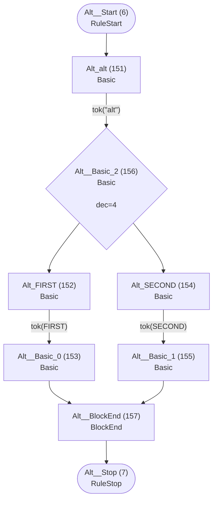
```mermaid
flowchart TD
    q6(["Alt__Start (6)<br/>RuleStart"])
    q7(["Alt__Stop (7)<br/>RuleStop"])
    q151["Alt_alt (151)<br/>Basic<br/>"]
    q152["Alt_FIRST (152)<br/>Basic<br/>"]
    q153["Alt__Basic_0 (153)<br/>Basic<br/>"]
    q154["Alt_SECOND (154)<br/>Basic<br/>"]
    q155["Alt__Basic_1 (155)<br/>Basic<br/>"]
    q156{"Alt__Basic_2 (156)<br/>Basic<br/><br/>dec=4"}
    q157["Alt__BlockEnd (157)<br/>BlockEnd<br/>"]

    q6 --> q151
    q151 -->|"tok(&quot;alt&quot;)"| q156
    q152 -->|"tok(FIRST)"| q153
    q153 --> q157
    q154 -->|"tok(SECOND)"| q155
    q155 --> q157
    q156 --> q152
    q156 --> q154
    q157 --> q7
```

## Prefix

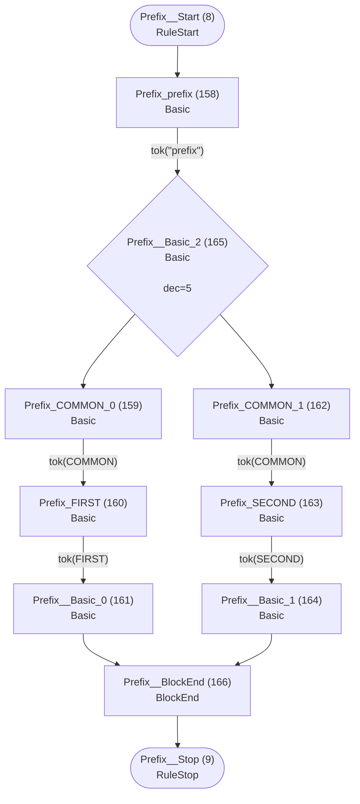
```mermaid
flowchart TD
    q8(["Prefix__Start (8)<br/>RuleStart"])
    q9(["Prefix__Stop (9)<br/>RuleStop"])
    q158["Prefix_prefix (158)<br/>Basic<br/>"]
    q159["Prefix_COMMON_0 (159)<br/>Basic<br/>"]
    q160["Prefix_FIRST (160)<br/>Basic<br/>"]
    q161["Prefix__Basic_0 (161)<br/>Basic<br/>"]
    q162["Prefix_COMMON_1 (162)<br/>Basic<br/>"]
    q163["Prefix_SECOND (163)<br/>Basic<br/>"]
    q164["Prefix__Basic_1 (164)<br/>Basic<br/>"]
    q165{"Prefix__Basic_2 (165)<br/>Basic<br/><br/>dec=5"}
    q166["Prefix__BlockEnd (166)<br/>BlockEnd<br/>"]

    q8 --> q158
    q158 -->|"tok(&quot;prefix&quot;)"| q165
    q159 -->|"tok(COMMON)"| q160
    q160 -->|"tok(FIRST)"| q161
    q161 --> q166
    q162 -->|"tok(COMMON)"| q163
    q163 -->|"tok(SECOND)"| q164
    q164 --> q166
    q165 --> q159
    q165 --> q162
    q166 --> q9
```

## Call

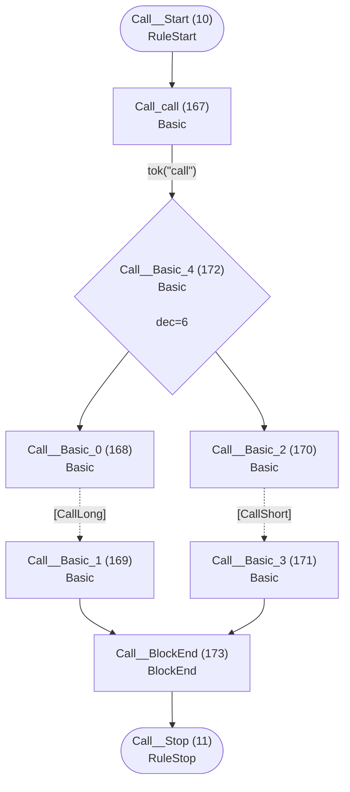
```mermaid
flowchart TD
    q10(["Call__Start (10)<br/>RuleStart"])
    q11(["Call__Stop (11)<br/>RuleStop"])
    q167["Call_call (167)<br/>Basic<br/>"]
    q168["Call__Basic_0 (168)<br/>Basic<br/>"]
    q169["Call__Basic_1 (169)<br/>Basic<br/>"]
    q170["Call__Basic_2 (170)<br/>Basic<br/>"]
    q171["Call__Basic_3 (171)<br/>Basic<br/>"]
    q172{"Call__Basic_4 (172)<br/>Basic<br/><br/>dec=6"}
    q173["Call__BlockEnd (173)<br/>BlockEnd<br/>"]

    q10 --> q167
    q167 -->|"tok(&quot;call&quot;)"| q172
    q168 -.->|"[CallLong]"| q169
    q169 --> q173
    q170 -.->|"[CallShort]"| q171
    q171 --> q173
    q172 --> q168
    q172 --> q170
    q173 --> q11
```

## CallLong

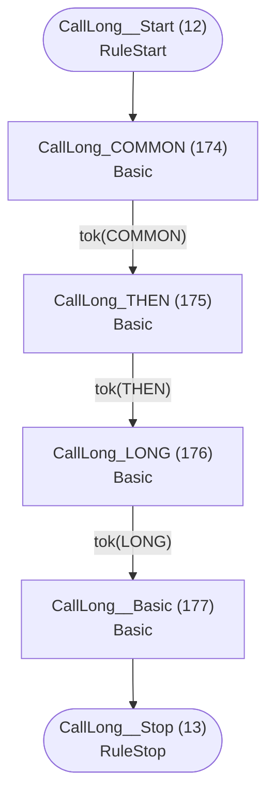
```mermaid
flowchart TD
    q12(["CallLong__Start (12)<br/>RuleStart"])
    q13(["CallLong__Stop (13)<br/>RuleStop"])
    q174["CallLong_COMMON (174)<br/>Basic<br/>"]
    q175["CallLong_THEN (175)<br/>Basic<br/>"]
    q176["CallLong_LONG (176)<br/>Basic<br/>"]
    q177["CallLong__Basic (177)<br/>Basic<br/>"]

    q12 --> q174
    q174 -->|"tok(COMMON)"| q175
    q175 -->|"tok(THEN)"| q176
    q176 -->|"tok(LONG)"| q177
    q177 --> q13
```

## CallShort

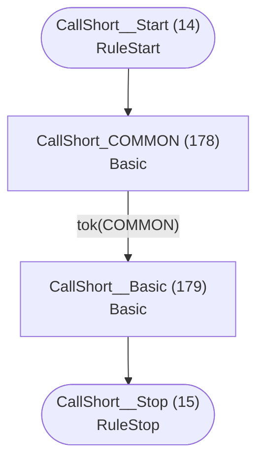
```mermaid
flowchart TD
    q14(["CallShort__Start (14)<br/>RuleStart"])
    q15(["CallShort__Stop (15)<br/>RuleStop"])
    q178["CallShort_COMMON (178)<br/>Basic<br/>"]
    q179["CallShort__Basic (179)<br/>Basic<br/>"]

    q14 --> q178
    q178 -->|"tok(COMMON)"| q179
    q179 --> q15
```

## RefFQN

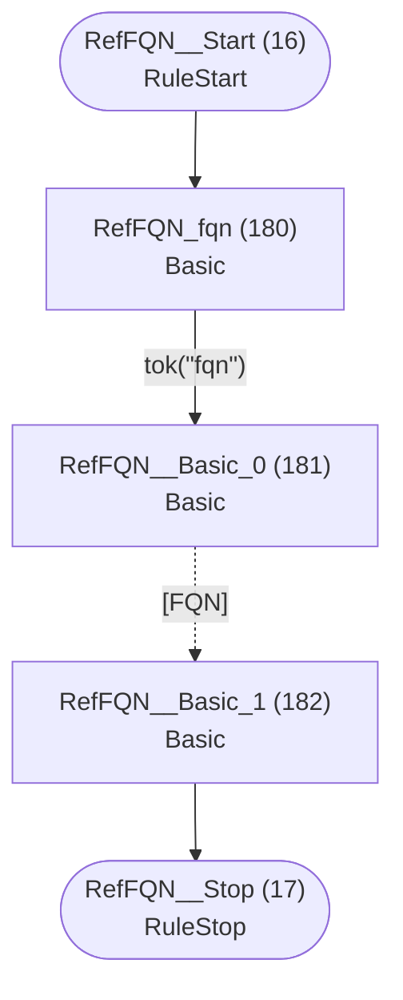
```mermaid
flowchart TD
    q16(["RefFQN__Start (16)<br/>RuleStart"])
    q17(["RefFQN__Stop (17)<br/>RuleStop"])
    q180["RefFQN_fqn (180)<br/>Basic<br/>"]
    q181["RefFQN__Basic_0 (181)<br/>Basic<br/>"]
    q182["RefFQN__Basic_1 (182)<br/>Basic<br/>"]

    q16 --> q180
    q180 -->|"tok(&quot;fqn&quot;)"| q181
    q181 -.->|"[FQN]"| q182
    q182 --> q17
```

## RefList

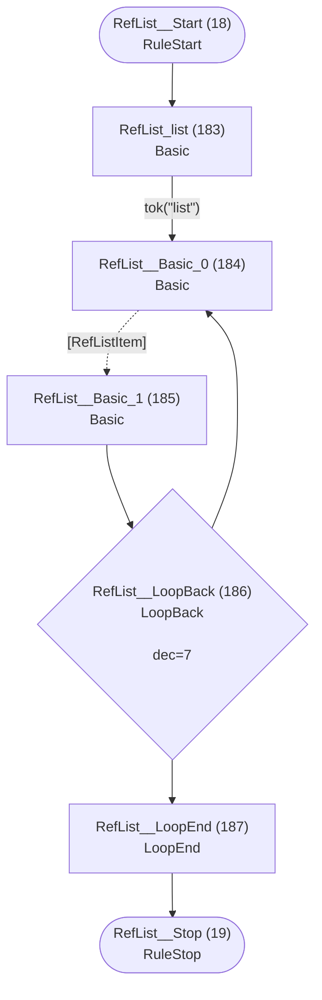
```mermaid
flowchart TD
    q18(["RefList__Start (18)<br/>RuleStart"])
    q19(["RefList__Stop (19)<br/>RuleStop"])
    q183["RefList_list (183)<br/>Basic<br/>"]
    q184["RefList__Basic_0 (184)<br/>Basic<br/>"]
    q185["RefList__Basic_1 (185)<br/>Basic<br/>"]
    q186{"RefList__LoopBack (186)<br/>LoopBack<br/><br/>dec=7"}
    q187["RefList__LoopEnd (187)<br/>LoopEnd<br/>"]

    q18 --> q183
    q183 -->|"tok(&quot;list&quot;)"| q184
    q184 -.->|"[RefListItem]"| q185
    q185 --> q186
    q186 --> q184
    q186 --> q187
    q187 --> q19
```

## RefListItem

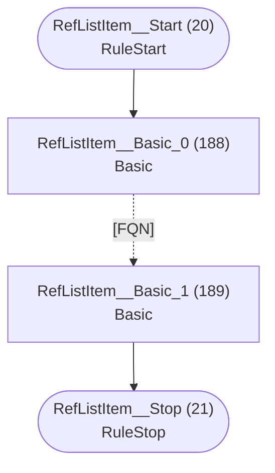
```mermaid
flowchart TD
    q20(["RefListItem__Start (20)<br/>RuleStart"])
    q21(["RefListItem__Stop (21)<br/>RuleStop"])
    q188["RefListItem__Basic_0 (188)<br/>Basic<br/>"]
    q189["RefListItem__Basic_1 (189)<br/>Basic<br/>"]

    q20 --> q188
    q188 -.->|"[FQN]"| q189
    q189 --> q21
```

## RefID

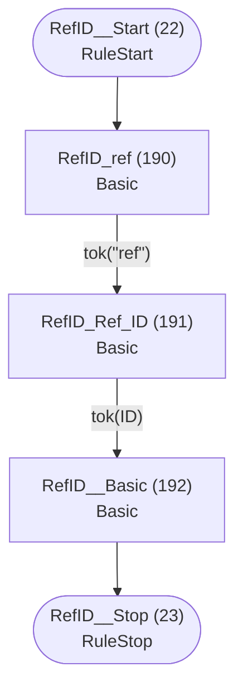
```mermaid
flowchart TD
    q22(["RefID__Start (22)<br/>RuleStart"])
    q23(["RefID__Stop (23)<br/>RuleStop"])
    q190["RefID_ref (190)<br/>Basic<br/>"]
    q191["RefID_Ref_ID (191)<br/>Basic<br/>"]
    q192["RefID__Basic (192)<br/>Basic<br/>"]

    q22 --> q190
    q190 -->|"tok(&quot;ref&quot;)"| q191
    q191 -->|"tok(ID)"| q192
    q192 --> q23
```

## Member

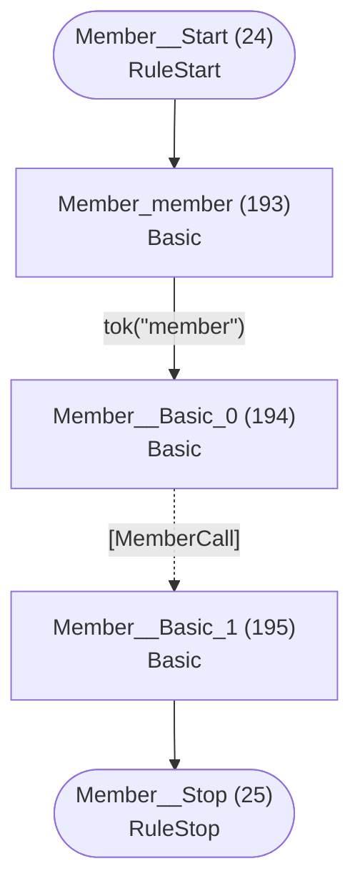
```mermaid
flowchart TD
    q24(["Member__Start (24)<br/>RuleStart"])
    q25(["Member__Stop (25)<br/>RuleStop"])
    q193["Member_member (193)<br/>Basic<br/>"]
    q194["Member__Basic_0 (194)<br/>Basic<br/>"]
    q195["Member__Basic_1 (195)<br/>Basic<br/>"]

    q24 --> q193
    q193 -->|"tok(&quot;member&quot;)"| q194
    q194 -.->|"[MemberCall]"| q195
    q195 --> q25
```

## MemberNoDot

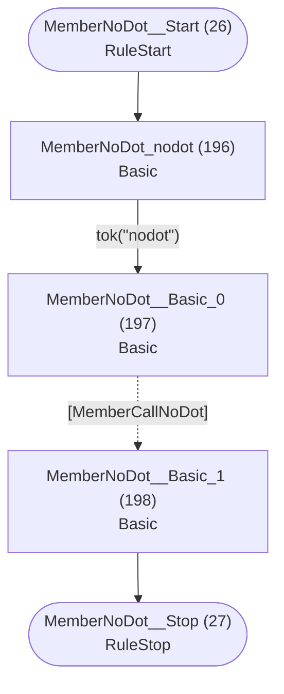
```mermaid
flowchart TD
    q26(["MemberNoDot__Start (26)<br/>RuleStart"])
    q27(["MemberNoDot__Stop (27)<br/>RuleStop"])
    q196["MemberNoDot_nodot (196)<br/>Basic<br/>"]
    q197["MemberNoDot__Basic_0 (197)<br/>Basic<br/>"]
    q198["MemberNoDot__Basic_1 (198)<br/>Basic<br/>"]

    q26 --> q196
    q196 -->|"tok(&quot;nodot&quot;)"| q197
    q197 -.->|"[MemberCallNoDot]"| q198
    q198 --> q27
```

## MemberCall

```mermaid
flowchart TD
    q28(["MemberCall__Start (28)<br/>RuleStart"])
    q29(["MemberCall__Stop (29)<br/>RuleStop"])
    q199["MemberCall_Ref_ID_0 (199)<br/>Basic<br/>"]
    q200["MemberCall_DOT (200)<br/>Basic<br/>"]
    q201["MemberCall_Ref_ID_1 (201)<br/>Basic<br/>"]
    q202["MemberCall__Basic (202)<br/>Basic<br/>"]
    q203{"MemberCall__LoopEntry (203)<br/>LoopEntry<br/><br/>dec=8"}
    q204["MemberCall__LoopEnd (204)<br/>LoopEnd<br/>"]
    q205["MemberCall__LoopBack (205)<br/>LoopBack<br/>"]

    q28 --> q199
    q199 -->|"tok(ID)"| q203
    q200 -->|"tok(DOT)"| q201
    q201 -->|"tok(ID)"| q202
    q202 --> q205
    q203 --> q200
    q203 --> q204
    q204 --> q29
    q205 --> q203
```

## MemberCallNoDot

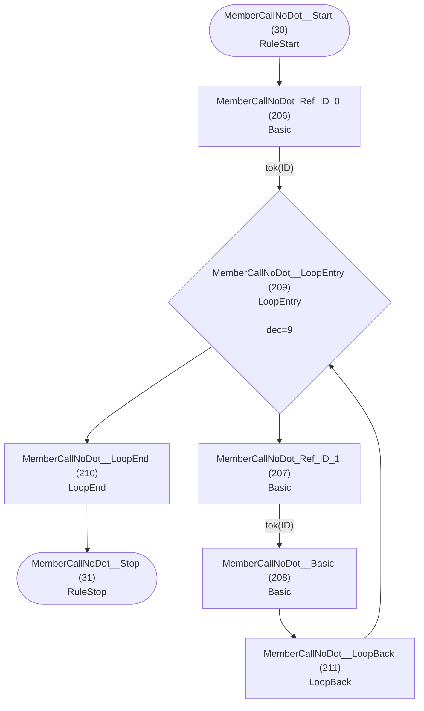
```mermaid
flowchart TD
    q30(["MemberCallNoDot__Start (30)<br/>RuleStart"])
    q31(["MemberCallNoDot__Stop (31)<br/>RuleStop"])
    q206["MemberCallNoDot_Ref_ID_0 (206)<br/>Basic<br/>"]
    q207["MemberCallNoDot_Ref_ID_1 (207)<br/>Basic<br/>"]
    q208["MemberCallNoDot__Basic (208)<br/>Basic<br/>"]
    q209{"MemberCallNoDot__LoopEntry (209)<br/>LoopEntry<br/><br/>dec=9"}
    q210["MemberCallNoDot__LoopEnd (210)<br/>LoopEnd<br/>"]
    q211["MemberCallNoDot__LoopBack (211)<br/>LoopBack<br/>"]

    q30 --> q206
    q206 -->|"tok(ID)"| q209
    q207 -->|"tok(ID)"| q208
    q208 --> q211
    q209 --> q207
    q209 --> q210
    q210 --> q31
    q211 --> q209
```

## RefOrKeyword

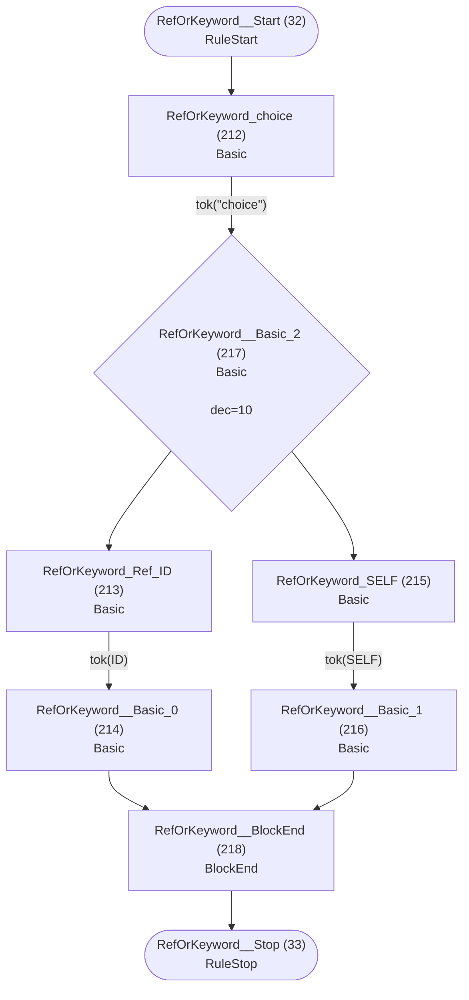
```mermaid
flowchart TD
    q32(["RefOrKeyword__Start (32)<br/>RuleStart"])
    q33(["RefOrKeyword__Stop (33)<br/>RuleStop"])
    q212["RefOrKeyword_choice (212)<br/>Basic<br/>"]
    q213["RefOrKeyword_Ref_ID (213)<br/>Basic<br/>"]
    q214["RefOrKeyword__Basic_0 (214)<br/>Basic<br/>"]
    q215["RefOrKeyword_SELF (215)<br/>Basic<br/>"]
    q216["RefOrKeyword__Basic_1 (216)<br/>Basic<br/>"]
    q217{"RefOrKeyword__Basic_2 (217)<br/>Basic<br/><br/>dec=10"}
    q218["RefOrKeyword__BlockEnd (218)<br/>BlockEnd<br/>"]

    q32 --> q212
    q212 -->|"tok(&quot;choice&quot;)"| q217
    q213 -->|"tok(ID)"| q214
    q214 --> q218
    q215 -->|"tok(SELF)"| q216
    q216 --> q218
    q217 --> q213
    q217 --> q215
    q218 --> q33
```

## Dedup

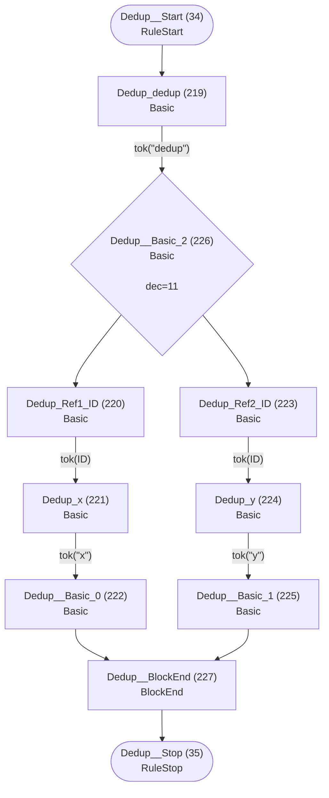
```mermaid
flowchart TD
    q34(["Dedup__Start (34)<br/>RuleStart"])
    q35(["Dedup__Stop (35)<br/>RuleStop"])
    q219["Dedup_dedup (219)<br/>Basic<br/>"]
    q220["Dedup_Ref1_ID (220)<br/>Basic<br/>"]
    q221["Dedup_x (221)<br/>Basic<br/>"]
    q222["Dedup__Basic_0 (222)<br/>Basic<br/>"]
    q223["Dedup_Ref2_ID (223)<br/>Basic<br/>"]
    q224["Dedup_y (224)<br/>Basic<br/>"]
    q225["Dedup__Basic_1 (225)<br/>Basic<br/>"]
    q226{"Dedup__Basic_2 (226)<br/>Basic<br/><br/>dec=11"}
    q227["Dedup__BlockEnd (227)<br/>BlockEnd<br/>"]

    q34 --> q219
    q219 -->|"tok(&quot;dedup&quot;)"| q226
    q220 -->|"tok(ID)"| q221
    q221 -->|"tok(&quot;x&quot;)"| q222
    q222 --> q227
    q223 -->|"tok(ID)"| q224
    q224 -->|"tok(&quot;y&quot;)"| q225
    q225 --> q227
    q226 --> q220
    q226 --> q223
    q227 --> q35
```

## Opt

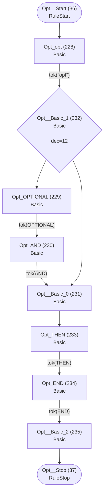
```mermaid
flowchart TD
    q36(["Opt__Start (36)<br/>RuleStart"])
    q37(["Opt__Stop (37)<br/>RuleStop"])
    q228["Opt_opt (228)<br/>Basic<br/>"]
    q229["Opt_OPTIONAL (229)<br/>Basic<br/>"]
    q230["Opt_AND (230)<br/>Basic<br/>"]
    q231["Opt__Basic_0 (231)<br/>Basic<br/>"]
    q232{"Opt__Basic_1 (232)<br/>Basic<br/><br/>dec=12"}
    q233["Opt_THEN (233)<br/>Basic<br/>"]
    q234["Opt_END (234)<br/>Basic<br/>"]
    q235["Opt__Basic_2 (235)<br/>Basic<br/>"]

    q36 --> q228
    q228 -->|"tok(&quot;opt&quot;)"| q232
    q229 -->|"tok(OPTIONAL)"| q230
    q230 -->|"tok(AND)"| q231
    q231 --> q233
    q232 --> q229
    q232 --> q231
    q233 -->|"tok(THEN)"| q234
    q234 -->|"tok(END)"| q235
    q235 --> q37
```

## Group

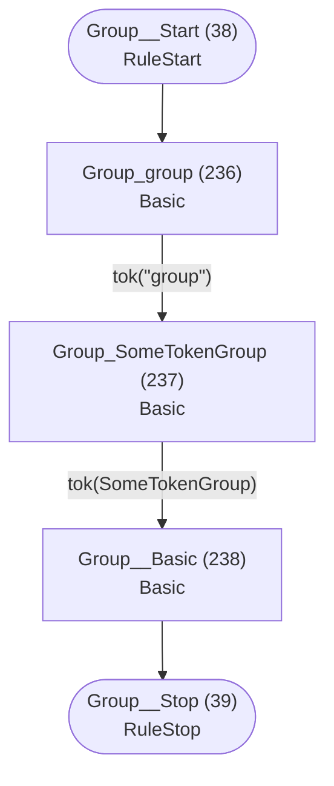
```mermaid
flowchart TD
    q38(["Group__Start (38)<br/>RuleStart"])
    q39(["Group__Stop (39)<br/>RuleStop"])
    q236["Group_group (236)<br/>Basic<br/>"]
    q237["Group_SomeTokenGroup (237)<br/>Basic<br/>"]
    q238["Group__Basic (238)<br/>Basic<br/>"]

    q38 --> q236
    q236 -->|"tok(&quot;group&quot;)"| q237
    q237 -->|"tok(SomeTokenGroup)"| q238
    q238 --> q39
```

## RefGroup

```mermaid
flowchart TD
    q40(["RefGroup__Start (40)<br/>RuleStart"])
    q41(["RefGroup__Stop (41)<br/>RuleStop"])
    q239["RefGroup_refgroup (239)<br/>Basic<br/>"]
    q240["RefGroup_Ref_SomeTokenGroup (240)<br/>Basic<br/>"]
    q241["RefGroup__Basic (241)<br/>Basic<br/>"]

    q40 --> q239
    q239 -->|"tok(&quot;refgroup&quot;)"| q240
    q240 -->|"tok(SomeTokenGroup)"| q241
    q241 --> q41
```

## RefAction

```mermaid
flowchart TD
    q42(["RefAction__Start (42)<br/>RuleStart"])
    q43(["RefAction__Stop (43)<br/>RuleStop"])
    q242["RefAction_action (242)<br/>Basic<br/>"]
    q243["RefAction_Ref_ID (243)<br/>Basic<br/>"]
    q244["RefAction__Basic (244)<br/>Basic<br/>"]

    q42 --> q242
    q242 -->|"tok(&quot;action&quot;)"| q243
    q243 -->|"tok(ID)"| q244
    q244 --> q43
```

## Scope

```mermaid
flowchart TD
    q44(["Scope__Start (44)<br/>RuleStart"])
    q45(["Scope__Stop (45)<br/>RuleStop"])
    q245["Scope_scope (245)<br/>Basic<br/>"]
    q246["Scope_LBRACE (246)<br/>Basic<br/>"]
    q247["Scope__Basic_0 (247)<br/>Basic<br/>"]
    q248["Scope__Basic_1 (248)<br/>Basic<br/>"]
    q249{"Scope__LoopEntry_0 (249)<br/>LoopEntry<br/><br/>dec=13"}
    q250["Scope__LoopEnd_0 (250)<br/>LoopEnd<br/>"]
    q251["Scope__LoopBack_0 (251)<br/>LoopBack<br/>"]
    q252["Scope_use (252)<br/>Basic<br/>"]
    q253["Scope__Basic_2 (253)<br/>Basic<br/>"]
    q254["Scope_AND (254)<br/>Basic<br/>"]
    q255["Scope__Basic_3 (255)<br/>Basic<br/>"]
    q256["Scope__Basic_4 (256)<br/>Basic<br/>"]
    q257{"Scope__LoopEntry_1 (257)<br/>LoopEntry<br/><br/>dec=14"}
    q258["Scope__LoopEnd_1 (258)<br/>LoopEnd<br/>"]
    q259["Scope__LoopBack_1 (259)<br/>LoopBack<br/>"]
    q260["Scope_RBRACE (260)<br/>Basic<br/>"]
    q261["Scope__Basic_5 (261)<br/>Basic<br/>"]

    q44 --> q245
    q245 -->|"tok(&quot;scope&quot;)"| q246
    q246 -->|"tok(LBRACE)"| q249
    q247 -.->|"[Declare]"| q248
    q248 --> q251
    q249 --> q247
    q249 --> q250
    q250 --> q252
    q251 --> q249
    q252 -->|"tok(&quot;use&quot;)"| q253
    q253 -.->|"[RefItem]"| q257
    q254 -->|"tok(AND)"| q255
    q255 -.->|"[RefItem]"| q256
    q256 --> q259
    q257 --> q254
    q257 --> q258
    q258 --> q260
    q259 --> q257
    q260 -->|"tok(RBRACE)"| q261
    q261 --> q45
```

## RefItem

```mermaid
flowchart TD
    q46(["RefItem__Start (46)<br/>RuleStart"])
    q47(["RefItem__Stop (47)<br/>RuleStop"])
    q262["RefItem_Ref_ID (262)<br/>Basic<br/>"]
    q263["RefItem__Basic (263)<br/>Basic<br/>"]

    q46 --> q262
    q262 -->|"tok(ID)"| q263
    q263 --> q47
```

## Loop

```mermaid
flowchart TD
    q48(["Loop__Start (48)<br/>RuleStart"])
    q49(["Loop__Stop (49)<br/>RuleStop"])
    q264["Loop_loop (264)<br/>Basic<br/>"]
    q265["Loop_LBRACE (265)<br/>Basic<br/>"]
    q266["Loop__Basic_0 (266)<br/>Basic<br/>"]
    q267["Loop__Basic_1 (267)<br/>Basic<br/>"]
    q268["Loop__Basic_2 (268)<br/>Basic<br/>"]
    q269["Loop__Basic_3 (269)<br/>Basic<br/>"]
    q270["Loop__Basic_4 (270)<br/>Basic<br/>"]
    q271["Loop__Basic_5 (271)<br/>Basic<br/>"]
    q272{"Loop__Basic_6 (272)<br/>Basic<br/><br/>dec=15"}
    q273["Loop__BlockEnd (273)<br/>BlockEnd<br/>"]
    q274{"Loop__LoopEntry (274)<br/>LoopEntry<br/><br/>dec=16"}
    q275["Loop__LoopEnd (275)<br/>LoopEnd<br/>"]
    q276["Loop__LoopBack (276)<br/>LoopBack<br/>"]
    q277["Loop_RBRACE (277)<br/>Basic<br/>"]
    q278["Loop__Basic_7 (278)<br/>Basic<br/>"]

    q48 --> q264
    q264 -->|"tok(&quot;loop&quot;)"| q265
    q265 -->|"tok(LBRACE)"| q274
    q266 -.->|"[Declare]"| q267
    q267 --> q273
    q268 -.->|"[RefItem]"| q269
    q269 --> q273
    q270 -.->|"[Loop]"| q271
    q271 --> q273
    q272 --> q266
    q272 --> q268
    q272 --> q270
    q273 --> q276
    q274 --> q272
    q274 --> q275
    q275 --> q277
    q276 --> q274
    q277 -->|"tok(RBRACE)"| q278
    q278 --> q49
```

## Chain

```mermaid
flowchart TD
    q50(["Chain__Start (50)<br/>RuleStart"])
    q51(["Chain__Stop (51)<br/>RuleStop"])
    q279["Chain_chain (279)<br/>Basic<br/>"]
    q280["Chain_LBRACE (280)<br/>Basic<br/>"]
    q281["Chain__Basic_0 (281)<br/>Basic<br/>"]
    q282["Chain__Basic_1 (282)<br/>Basic<br/>"]
    q283{"Chain__LoopEntry (283)<br/>LoopEntry<br/><br/>dec=17"}
    q284["Chain__LoopEnd (284)<br/>LoopEnd<br/>"]
    q285["Chain__LoopBack (285)<br/>LoopBack<br/>"]
    q286["Chain_RBRACE (286)<br/>Basic<br/>"]
    q287["Chain__Basic_2 (287)<br/>Basic<br/>"]

    q50 --> q279
    q279 -->|"tok(&quot;chain&quot;)"| q280
    q280 -->|"tok(LBRACE)"| q283
    q281 -.->|"[ChainItem]"| q282
    q282 --> q285
    q283 --> q281
    q283 --> q284
    q284 --> q286
    q285 --> q283
    q286 -->|"tok(RBRACE)"| q287
    q287 --> q51
```

## ChainItem

```mermaid
flowchart TD
    q52(["ChainItem__Start (52)<br/>RuleStart"])
    q53(["ChainItem__Stop (53)<br/>RuleStop"])
    q288["ChainItem_Ref_ID_0 (288)<br/>Basic<br/>"]
    q289["ChainItem_AND (289)<br/>Basic<br/>"]
    q290["ChainItem_Ref_ID_1 (290)<br/>Basic<br/>"]
    q291["ChainItem__Basic (291)<br/>Basic<br/>"]
    q292{"ChainItem__LoopEntry (292)<br/>LoopEntry<br/><br/>dec=18"}
    q293["ChainItem__LoopEnd (293)<br/>LoopEnd<br/>"]
    q294["ChainItem__LoopBack (294)<br/>LoopBack<br/>"]

    q52 --> q288
    q288 -->|"tok(ID)"| q292
    q289 -->|"tok(AND)"| q290
    q290 -->|"tok(ID)"| q291
    q291 --> q294
    q292 --> q289
    q292 --> q293
    q293 --> q53
    q294 --> q292
```

## Infix

```mermaid
flowchart TD
    q54(["Infix__Start (54)<br/>RuleStart"])
    q55(["Infix__Stop (55)<br/>RuleStop"])
    q295["Infix_infix (295)<br/>Basic<br/>"]
    q296["Infix_LBRACE (296)<br/>Basic<br/>"]
    q297["Infix__Basic_0 (297)<br/>Basic<br/>"]
    q298["Infix__Basic_1 (298)<br/>Basic<br/>"]
    q299{"Infix__LoopEntry (299)<br/>LoopEntry<br/><br/>dec=19"}
    q300["Infix__LoopEnd (300)<br/>LoopEnd<br/>"]
    q301["Infix__LoopBack (301)<br/>LoopBack<br/>"]
    q302["Infix_RBRACE (302)<br/>Basic<br/>"]
    q303["Infix__Basic_2 (303)<br/>Basic<br/>"]

    q54 --> q295
    q295 -->|"tok(&quot;infix&quot;)"| q296
    q296 -->|"tok(LBRACE)"| q299
    q297 -.->|"[Binary]"| q298
    q298 --> q301
    q299 --> q297
    q299 --> q300
    q300 --> q302
    q301 --> q299
    q302 -->|"tok(RBRACE)"| q303
    q303 --> q55
```

## Primary

```mermaid
flowchart TD
    q56(["Primary__Start (56)<br/>RuleStart"])
    q57(["Primary__Stop (57)<br/>RuleStop"])
    q304["Primary_Ref_ID (304)<br/>Basic<br/>"]
    q305["Primary__Basic (305)<br/>Basic<br/>"]

    q56 --> q304
    q304 -->|"tok(ID)"| q305
    q305 --> q57
```

## Wrap

```mermaid
flowchart TD
    q58(["Wrap__Start (58)<br/>RuleStart"])
    q59(["Wrap__Stop (59)<br/>RuleStop"])
    q306["Wrap_wrap (306)<br/>Basic<br/>"]
    q307["Wrap_LBRACE (307)<br/>Basic<br/>"]
    q308["Wrap__Basic_0 (308)<br/>Basic<br/>"]
    q309["Wrap_RBRACE (309)<br/>Basic<br/>"]
    q310["Wrap__Basic_1 (310)<br/>Basic<br/>"]

    q58 --> q306
    q306 -->|"tok(&quot;wrap&quot;)"| q307
    q307 -->|"tok(LBRACE)"| q308
    q308 -.->|"[WrapGroup]"| q309
    q309 -->|"tok(RBRACE)"| q310
    q310 --> q59
```

## WrapGroup

```mermaid
flowchart TD
    q60(["WrapGroup__Start (60)<br/>RuleStart"])
    q61(["WrapGroup__Stop (61)<br/>RuleStop"])
    q311["WrapGroup__Basic_0 (311)<br/>Basic<br/>"]
    q312["WrapGroup__Basic_1 (312)<br/>Basic<br/>"]
    q313["WrapGroup__Basic_2 (313)<br/>Basic<br/>"]
    q314{"WrapGroup__LoopBack (314)<br/>LoopBack<br/><br/>dec=20"}
    q315["WrapGroup__LoopEnd (315)<br/>LoopEnd<br/>"]
    q316{"WrapGroup__Basic_3 (316)<br/>Basic<br/><br/>dec=21"}

    q60 --> q311
    q311 -.->|"[WrapElement]"| q316
    q312 -.->|"[WrapElement]"| q313
    q313 --> q314
    q314 --> q312
    q314 --> q315
    q315 --> q61
    q316 --> q312
    q316 --> q315
```

## WrapElement

```mermaid
flowchart TD
    q62(["WrapElement__Start (62)<br/>RuleStart"])
    q63(["WrapElement__Stop (63)<br/>RuleStop"])
    q317["WrapElement_Ref_ID (317)<br/>Basic<br/>"]
    q318["WrapElement__Basic_0 (318)<br/>Basic<br/>"]
    q319["WrapElement_LBRACE (319)<br/>Basic<br/>"]
    q320["WrapElement__Basic_1 (320)<br/>Basic<br/>"]
    q321["WrapElement_RBRACE (321)<br/>Basic<br/>"]
    q322["WrapElement__Basic_2 (322)<br/>Basic<br/>"]
    q323{"WrapElement__Basic_3 (323)<br/>Basic<br/><br/>dec=22"}
    q324["WrapElement__BlockEnd (324)<br/>BlockEnd<br/>"]

    q62 --> q323
    q317 -->|"tok(ID)"| q318
    q318 --> q324
    q319 -->|"tok(LBRACE)"| q320
    q320 -.->|"[WrapGroup]"| q321
    q321 -->|"tok(RBRACE)"| q322
    q322 --> q324
    q323 --> q317
    q323 --> q319
    q324 --> q63
```

## Shadow

```mermaid
flowchart TD
    q64(["Shadow__Start (64)<br/>RuleStart"])
    q65(["Shadow__Stop (65)<br/>RuleStop"])
    q325["Shadow_shadow (325)<br/>Basic<br/>"]
    q326["Shadow__Basic_0 (326)<br/>Basic<br/>"]
    q327["Shadow__Basic_1 (327)<br/>Basic<br/>"]
    q328["Shadow__Basic_2 (328)<br/>Basic<br/>"]
    q329{"Shadow__LoopEntry (329)<br/>LoopEntry<br/><br/>dec=23"}
    q330["Shadow__LoopEnd (330)<br/>LoopEnd<br/>"]
    q331["Shadow__LoopBack (331)<br/>LoopBack<br/>"]

    q64 --> q325
    q325 -->|"tok(&quot;shadow&quot;)"| q326
    q326 -.->|"[Binary]"| q329
    q327 -.->|"[RefItem]"| q328
    q328 --> q331
    q329 --> q327
    q329 --> q330
    q330 --> q65
    q331 --> q329
```

## Nest

```mermaid
flowchart TD
    q66(["Nest__Start (66)<br/>RuleStart"])
    q67(["Nest__Stop (67)<br/>RuleStop"])
    q332["Nest_nest (332)<br/>Basic<br/>"]
    q333["Nest_LBRACE (333)<br/>Basic<br/>"]
    q334["Nest__Basic_0 (334)<br/>Basic<br/>"]
    q335["Nest__Basic_1 (335)<br/>Basic<br/>"]
    q336["Nest_Ref_ID (336)<br/>Basic<br/>"]
    q337["Nest__Basic_2 (337)<br/>Basic<br/>"]
    q338["Nest__Basic_3 (338)<br/>Basic<br/>"]
    q339["Nest__Basic_4 (339)<br/>Basic<br/>"]
    q340{"Nest__Basic_5 (340)<br/>Basic<br/><br/>dec=24"}
    q341["Nest__BlockEnd (341)<br/>BlockEnd<br/>"]
    q342{"Nest__LoopEntry (342)<br/>LoopEntry<br/><br/>dec=25"}
    q343["Nest__LoopEnd (343)<br/>LoopEnd<br/>"]
    q344["Nest__LoopBack (344)<br/>LoopBack<br/>"]
    q345["Nest_RBRACE (345)<br/>Basic<br/>"]
    q346["Nest__Basic_6 (346)<br/>Basic<br/>"]

    q66 --> q332
    q332 -->|"tok(&quot;nest&quot;)"| q333
    q333 -->|"tok(LBRACE)"| q342
    q334 -.->|"[Declare]"| q335
    q335 --> q341
    q336 -->|"tok(ID)"| q337
    q337 --> q341
    q338 -.->|"[Nest]"| q339
    q339 --> q341
    q340 --> q334
    q340 --> q336
    q340 --> q338
    q341 --> q344
    q342 --> q340
    q342 --> q343
    q343 --> q345
    q344 --> q342
    q345 -->|"tok(RBRACE)"| q346
    q346 --> q67
```

## Ambig

```mermaid
flowchart TD
    q68(["Ambig__Start (68)<br/>RuleStart"])
    q69(["Ambig__Stop (69)<br/>RuleStop"])
    q347["Ambig_ambig (347)<br/>Basic<br/>"]
    q348["Ambig__Basic_0 (348)<br/>Basic<br/>"]
    q349["Ambig__Basic_1 (349)<br/>Basic<br/>"]
    q350["Ambig__Basic_2 (350)<br/>Basic<br/>"]
    q351["Ambig__Basic_3 (351)<br/>Basic<br/>"]
    q352{"Ambig__Basic_4 (352)<br/>Basic<br/><br/>dec=26"}
    q353["Ambig__BlockEnd (353)<br/>BlockEnd<br/>"]

    q68 --> q347
    q347 -->|"tok(&quot;ambig&quot;)"| q352
    q348 -.->|"[AmbigName]"| q349
    q349 --> q353
    q350 -.->|"[AmbigRefs]"| q351
    q351 --> q353
    q352 --> q348
    q352 --> q350
    q353 --> q69
```

## AmbigName

```mermaid
flowchart TD
    q70(["AmbigName__Start (70)<br/>RuleStart"])
    q71(["AmbigName__Stop (71)<br/>RuleStop"])
    q354["AmbigName_Name_ID (354)<br/>Basic<br/>"]
    q355["AmbigName_Ref_ID (355)<br/>Basic<br/>"]
    q356["AmbigName_FIRST (356)<br/>Basic<br/>"]
    q357["AmbigName__Basic (357)<br/>Basic<br/>"]

    q70 --> q354
    q354 -->|"tok(ID)"| q355
    q355 -->|"tok(ID)"| q356
    q356 -->|"tok(FIRST)"| q357
    q357 --> q71
```

## AmbigRefs

```mermaid
flowchart TD
    q72(["AmbigRefs__Start (72)<br/>RuleStart"])
    q73(["AmbigRefs__Stop (73)<br/>RuleStop"])
    q358["AmbigRefs_Ref1_ID (358)<br/>Basic<br/>"]
    q359["AmbigRefs_Ref_ID (359)<br/>Basic<br/>"]
    q360["AmbigRefs_SECOND (360)<br/>Basic<br/>"]
    q361["AmbigRefs__Basic (361)<br/>Basic<br/>"]

    q72 --> q358
    q358 -->|"tok(ID)"| q359
    q359 -->|"tok(ID)"| q360
    q360 -->|"tok(SECOND)"| q361
    q361 --> q73
```

## Retype

```mermaid
flowchart TD
    q74(["Retype__Start (74)<br/>RuleStart"])
    q75(["Retype__Stop (75)<br/>RuleStop"])
    q362["Retype_retype (362)<br/>Basic<br/>"]
    q363["Retype_LBRACE (363)<br/>Basic<br/>"]
    q364["Retype__Basic_0 (364)<br/>Basic<br/>"]
    q365["Retype__Basic_1 (365)<br/>Basic<br/>"]
    q366{"Retype__LoopEntry (366)<br/>LoopEntry<br/><br/>dec=27"}
    q367["Retype__LoopEnd (367)<br/>LoopEnd<br/>"]
    q368["Retype__LoopBack (368)<br/>LoopBack<br/>"]
    q369["Retype_RBRACE (369)<br/>Basic<br/>"]
    q370["Retype__Basic_2 (370)<br/>Basic<br/>"]

    q74 --> q362
    q362 -->|"tok(&quot;retype&quot;)"| q363
    q363 -->|"tok(LBRACE)"| q366
    q364 -.->|"[RetypeItem]"| q365
    q365 --> q368
    q366 --> q364
    q366 --> q367
    q367 --> q369
    q368 --> q366
    q369 -->|"tok(RBRACE)"| q370
    q370 --> q75
```

## RetypeItem

```mermaid
flowchart TD
    q76(["RetypeItem__Start (76)<br/>RuleStart"])
    q77(["RetypeItem__Stop (77)<br/>RuleStop"])
    q371["RetypeItem__Basic_0 (371)<br/>Basic<br/>"]
    q372["RetypeItem__Basic_1 (372)<br/>Basic<br/>"]

    q76 --> q371
    q371 -.->|"[RefItem]"| q372
    q372 --> q77
```

## FQN

```mermaid
flowchart TD
    q78(["FQN__Start (78)<br/>RuleStart"])
    q79(["FQN__Stop (79)<br/>RuleStop"])
    q373["FQN_ID_0 (373)<br/>Basic<br/>"]
    q374["FQN_DOT (374)<br/>Basic<br/>"]
    q375["FQN_ID_1 (375)<br/>Basic<br/>"]
    q376["FQN__Basic (376)<br/>Basic<br/>"]
    q377{"FQN__LoopEntry (377)<br/>LoopEntry<br/><br/>dec=28"}
    q378["FQN__LoopEnd (378)<br/>LoopEnd<br/>"]
    q379["FQN__LoopBack (379)<br/>LoopBack<br/>"]

    q78 --> q373
    q373 -->|"tok(ID)"| q377
    q374 -->|"tok(DOT)"| q375
    q375 -->|"tok(ID)"| q376
    q376 --> q379
    q377 --> q374
    q377 --> q378
    q378 --> q79
    q379 --> q377
```

## Binary

```mermaid
flowchart TD
    q80(["Binary__Start (80)<br/>RuleStart"])
    q81(["Binary__Stop (81)<br/>RuleStop"])
    q380["Binary__Basic_0 (380)<br/>Basic<br/>"]
    q381["Binary_BinaryOperator (381)<br/>Basic<br/>"]
    q382["Binary__Basic_1 (382)<br/>Basic<br/>"]
    q383["Binary__Basic_2 (383)<br/>Basic<br/>"]
    q384{"Binary__LoopEntry (384)<br/>LoopEntry<br/><br/>dec=29"}
    q385["Binary__LoopEnd (385)<br/>LoopEnd<br/>"]
    q386["Binary__LoopBack (386)<br/>LoopBack<br/>"]

    q80 --> q380
    q380 -.->|"[Primary]"| q384
    q381 -->|"tok(BinaryOperator)"| q382
    q382 -.->|"[Primary]"| q383
    q383 --> q386
    q384 --> q381
    q384 --> q385
    q385 --> q81
    q386 --> q384
```

