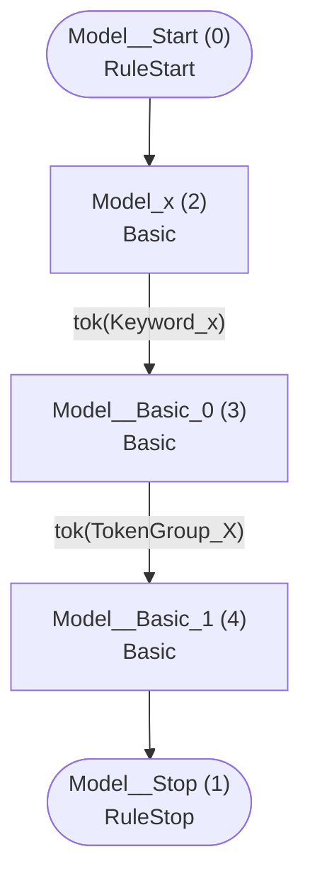

# Runtime ATN for token_modes_with_groups

## Model

```mermaid
flowchart TD
    q0(["Model__Start (0)<br/>RuleStart"])
    q1(["Model__Stop (1)<br/>RuleStop"])
    q2["Model_x (2)<br/>Basic<br/>"]
    q3["Model__Basic_0 (3)<br/>Basic<br/>"]
    q4["Model__Basic_1 (4)<br/>Basic<br/>"]

    q0 --> q2
    q2 -->|"tok(Keyword_x)"| q3
    q3 -->|"tok(TokenGroup_X)"| q4
    q4 --> q1
```

